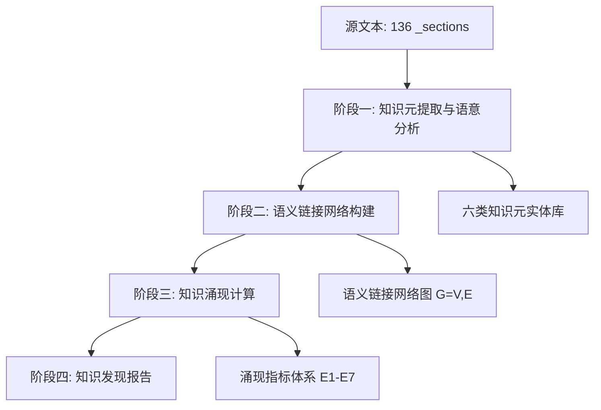

# 00 方法与规则

---

## L1 知识涌现分析总纲

### L2 分析对象

本分析以 Charlotte Fiell 与 Peter Fiell 合著的《Design of the 20th Century》（1999, TASCHEN）为源文本，以该书"分析报告"（包含136个_sections文件的完整结构化分析）为数据基础，执行知识涌现分析。

### L2 核心问题

本分析试图回答以下问题：

1. 当约122个独立词条（覆盖设计师、运动、院校、企业、概念）被聚合并交叉引用时，是否涌现出超越单个词条之和的全局性知识结构？
2. 这些涌现结构是否揭示了该书作者未明确表述但客观上存在于文本网络中的深层设计史叙事？
3. 知识元之间的语义链接网络呈现何种拓扑特征？其核心枢纽、桥接节点与边缘孤岛分别是什么？
4. 从局部知识元到全局知识结构的涌现过程中，是否存在可量化的计算指标？

### L2 分析框架

本分析采用"知识元—语义链接—涌现计算—发现报告"四阶段框架：

| 阶段 | 文件 | 核心任务 |
|------|------|----------|
| 阶段零 | 00_方法与规则 | 定义知识元类型、语义链接类型、涌现计算指标、分析规则 |
| 阶段一 | 01_知识元语意分析 | 从源文本中提取、归类、标注知识元，构建语义特征向量 |
| 阶段二 | 02_语义链接网络 | 构建节点-边图模型，分析网络拓扑与子结构 |
| 阶段三 | 03_知识涌现计算 | 量化涌现强度、识别涌现簇、计算知识流变 |
| 阶段四 | 04_知识发现报告 | 综合前三阶段结果，报告涌现性发现与深层叙事 |

---

## L1 知识元（Knowledge Element）定义与分类规则

### L2 知识元的定义

**知识元**是源文本中可以独立承载一个完整设计史信息单元的最小语义片段。一个知识元必须具备以下属性：

- **可标识性**：可以明确命名或指称（如一个人名、一个运动名称、一个术语）
- **可描述性**：可以被若干属性-值对所描述（如生卒年、国籍、代表作品、核心主张）
- **可关联性**：可以通过明确的语义关系与其他知识元建立链接

### L2 知识元类型体系（六类实体模型）

基于源文本"分析报告"第七节的六类实体清单，定义以下知识元类型：

#### L3 T1：人物（Person）

| 属性 | 数据类型 | 说明 |
|------|----------|------|
| 名称 | String | 标准全名 |
| 生年 | Integer | 出生年份 |
| 卒年 | Integer | 去世年份（在世者留空） |
| 国籍/地域 | Enum | 芬兰、德国、法国、意大利、美国、英国、瑞士、奥地利、日本等 |
| 领域 | Enum | 建筑、家具、产品、平面、纺织、玻璃、陶瓷、金属 |
| 核心主张 | Text | 最重要的设计哲学/理论贡献（≤200字） |
| 代表作品 | List[String] | 最重要的1-3件代表作品名称及年份 |
| 关联机构 | List[String] | 关联的教育机构、企业、组织 |
| 关联运动 | List[String] | 关联的设计运动/风格 |
| 关联人物 | List[String] | 合作者、导师、学生、受其影响者 |

#### L3 T2：运动/风格/流派（Movement）

| 属性 | 数据类型 | 说明 |
|------|----------|------|
| 名称 | String | 标准全名 |
| 时间范围 | String | 起止年份（如"1919-1933"） |
| 发源地 | String | 国家/城市 |
| 核心特征 | Text | 定义性风格/理论特征（≤200字） |
| 代表性人物 | List[String] | 核心成员列表 |
| 代表性机构 | List[String] | 关联院校/组织 |
| 前驱运动 | List[String] | 直接影响来源 |
| 后继运动 | List[String] | 受其影响的后继运动 |
| 对立运动 | List[String] | 与之形成辩论张力的运动 |

#### L3 T3：机构/院校/组织（Institution）

| 属性 | 数据类型 | 说明 |
|------|----------|------|
| 名称 | String | 标准全名 |
| 成立年份 | Integer | 成立时间 |
| 终结年份 | Integer | 关闭时间（如适用） |
| 所在地 | String | 国家/城市 |
| 性质 | Enum | 教育机构、制造企业、博物馆/展览、职业组织 |
| 创始人/核心人物 | List[String] | 创建者或关键推动者 |
| 核心理念 | Text | 机构使命与设计哲学 |
| 关联运动 | List[String] | 代表或推动的设计运动 |
| 输出产品/成果 | List[String] | 代表性设计作品 |

#### L3 T4：制造企业/品牌（Manufacturer）

| 属性 | 数据类型 | 说明 |
|------|----------|------|
| 名称 | String | 标准企业/品牌名称 |
| 成立年份 | Integer | 创立年份 |
| 国别 | String | 所在国家 |
| 关联设计师 | List[String] | 合作/雇佣的设计师 |
| 代表产品 | List[String] | 代表性产品线 |
| 设计哲学 | Text | 企业层面设计理念 |
| 所属产业 | Enum | 电气、家具、办公设备、家居用品、汽车等 |

#### L3 T5：核心概念/术语（Concept）

| 属性 | 数据类型 | 说明 |
|------|----------|------|
| 名称 | String | 标准术语名称 |
| 定义 | Text | 精准定义（≤200字） |
| 词源 | String | 术语来源与语言 |
| 提出者/倡导者 | List[String] | 首创或主要推广者 |
| 关联运动 | List[String] | 关联的设计运动 |
| 对立概念 | List[String] | 与之形成二元对立的概念 |
| 出现年代 | String | 概念首次出现的年代 |

#### L3 T6：代表性产品/作品（Artifact）

| 属性 | 数据类型 | 说明 |
|------|----------|------|
| 名称 | String | 作品标准名称（含型号） |
| 设计师 | String | 设计者 |
| 年份 | Integer | 设计/生产年份 |
| 制造商/委托方 | String | 生产或委托企业 |
| 类别 | Enum | 家具、灯具、玻璃器皿、陶瓷、字体、海报等 |
| 材料 | String | 主要材料 |
| 设计意义 | Text | 在设计史中的地位与创新点 |

---

## L1 语义链接（Semantic Link）类型定义

### L2 链接类型体系

基于源文本中的粗体交叉引用和文本叙述中隐含的关联，定义以下11种语义链接类型：

| 编号 | 链接类型 | 方向性 | 源端类型 | 目标端类型 | 语义含义 | 识别规则 |
|------|----------|--------|----------|------------|----------|----------|
| SL1 | 属于/参与 | 有向 | Person | Movement | 该人物是该运动的核心成员或参与者 | 词条中点明"member of"、"associated with" |
| SL2 | 创建/创立 | 有向 | Person | Institution | 该人物创建或共同创建了该机构 | 词条中点明"founded"、"co-founded" |
| SL3 | 设计/创作 | 有向 | Person | Artifact | 该人物设计了该作品 | 词条中点明作品归属 |
| SL4 | 任教/学习于 | 有向 | Person | Institution | 该人物在该机构任教或学习 | 词条中点明"studied at"、"taught at" |
| SL5 | 影响/启发 | 有向 | 知识元 | 知识元 | 前者对后者产生直接或间接影响 | 点明"influenced"、"inspired by" |
| SL6 | 雇佣/合作 | 双向 | Person | Manufacturer | 设计师与企业的雇佣或合作关系 | 点明"appointed"、"commissioned"、"worked for" |
| SL7 | 前驱/后继 | 有向 | Movement | Movement | 一个运动是另一个运动的历史前驱或后继 | 时间序列与文本点明"evolved from" |
| SL8 | 对立/辩论 | 双向 | 知识元 | 知识元 | 两者构成设计史中的二元辩论张力 | 文本点明"against"、"rejected"、"conflicting" |
| SL9 | 定义/阐述 | 有向 | Person | Concept | 该人物定义或系统阐述了该概念 | 点明"defined"、"promoted"、"coined" |
| SL10 | 实例化/体现 | 有向 | Artifact/Movement | Concept | 该作品或运动体现了该概念 | 文本分析推断 |
| SL11 | 引用/援引 | 有向 | 知识元 | Person | 文本中明确引用该人物的话语或著作 | 直接引文或脚注出现 |

### L2 语义链接的强度权重

对每种链接类型赋予基础权重（1-5），用于后续涌现计算：

| 链接类型 | 权重 | 理由 |
|----------|------|------|
| SL1 属于/参与 | 4 | 强组织归属 |
| SL2 创建/创立 | 5 | 最强的制度性关联 |
| SL3 设计/创作 | 3 | 作品归属性关联 |
| SL4 任教/学习于 | 4 | 教育传承关系 |
| SL5 影响/启发 | 3 | 观念传播 |
| SL6 雇佣/合作 | 3 | 产业协作 |
| SL7 前驱/后继 | 4 | 历史演化 |
| SL8 对立/辩论 | 5 | 最强概念张力 |
| SL9 定义/阐述 | 4 | 知识原创性标记 |
| SL10 实例化/体现 | 3 | 概念-对象映射 |
| SL11 引用/援引 | 2 | 学术证据链 |

---

## L1 涌现计算（Emergence Computation）指标定义

### L2 涌现的操作性定义

**知识涌现**在本分析中被操作性地定义为：在知识元网络（G = {V, E}）中，全局层面可观测到的、无法从任何单一节点或局部邻域直接推导出的结构化模式或性质。涌现的计算基于网络拓扑属性、语义聚类、跨层信息流动三个维度。

### L2 涌现计算指标体系

#### L3 指标E1：网络小世界性（Small-Worldness）

$$S = \frac{C/C_{\text{rand}}}{L/L_{\text{rand}}}$$

其中 C 为聚类系数，L 为平均最短路径长度。S > 1 表明网络具有小世界特性，信息在全局高效传播——这是知识涌现的网络拓扑前提。

#### L3 指标E2：知识枢纽度（Hubness）

$$H(v) = \sum_{e \in E(v)} w(e) \cdot \text{typeFactor}(e)$$

对每个节点 v，计算其加权连接度。高枢纽度节点（如 Bauhaus、Gropius、Aalto）是知识涌现的结构性中心。

#### L3 指标E3：桥接中心性（Betweenness Centrality）

$$BC(v) = \sum_{s \neq v \neq t} \frac{\sigma_{st}(v)}{\sigma_{st}}$$

其中 σ_{st} 为节点 s 到 t 的最短路径总数，σ_{st}(v) 为经过 v 的路径数。高桥接中心性的节点是不同知识群落之间的信息通道。

#### L3 指标E4：语义群落模块度（Modularity）

$$Q = \frac{1}{2m}\sum_{ij}\left[A_{ij} - \frac{k_i k_j}{2m}\right]\delta(c_i, c_j)$$

其中 A_{ij} 为邻接矩阵，k_i 为节点度，c_i 为节点 i 所属群落。Q 的最大值对应最优群落划分，揭示网络中的隐性知识聚类。

#### L3 指标E5：跨层涌现强度（Cross-Layer Emergence Strength）

$$E_{\text{cross}} = \frac{\sum_{t \in T} |\text{links}_{\text{inter-type}}(t)|}{\sum_{t \in T} |\text{links}_{\text{intra-type}}(t)| + \epsilon}$$

衡量不同类型知识元之间的链接密度与同类型内部链接密度之比。E_cross 值高表明"设计人物—运动—机构—概念—产品"之间的跨层整合程度高，知识结构更丰富。

#### L3 指标E6：涌现簇（Emergent Cluster）检测

使用 Louvain 社区发现算法检测网络中的涌现簇。一个涌现簇被定义为：由 ≥3 个知识元组成、内部链接密度显著高于外部、且包含至少两种不同类型的知识元的子网络。

#### L3 指标E7：隐式叙事链（Implicit Narrative Chain）

检测超过3步的语义链接链（如 Person → Institution → Movement → Concept → Artifact），这些链构成了作者未明确说出的"微型设计史叙事"。

---

## L1 分析规则

### L2 规则一：源文本优先

所有知识元的属性填充、语义链接的建立，必须以源文本（分析报告的136个_sections文件）中的实际文字为依据。当文本中存在模糊性时，标记为"推断"并注明推断依据。

### L2 规则二：交叉引用显式化

源文本中的粗体交叉引用是语义链接的直接证据。对于每个粗体引用，必须建立至少一条对应的语义链接（SL5影响/启发或SL1属于/参与）。

### L2 规则三：时间一致性验证

对于所有带时间属性的知识元（人物生卒年、运动起止年、机构成立年等），进行时间一致性检查：如果 A 影响 B，则 A 的活动时间必须早于或重叠于 B 的活动时间（即先因后果）。

### L2 规则四：闭合性假设

分析报告作为本分析的全部数据源，知识涌现仅在此封闭语料内部计算。不引入外部知识库（如维基百科）的增补信息。此规则的目的是：测试在严格封闭条件下，仅通过语义链接网络的构建与分析，能否生成超越原始文本表面陈述的知识发现。

### L2 规则五：可复现性

所有涌现计算指标（E1-E7）的算法参数（如 Louvain 分辨率、权重归一化方式）必须在对应分析文件中明确给出，确保整套分析可以被复现。

### L2 规则六：中文输出规范

所有分析文件以中文撰写，采用 L1（#）、L2（##）、L3（###）、L4（####）四级标题层级。术语首次出现时括注英文原文。表格使用 Markdown 表格语法。公式使用 LaTeX 行内或块级语法。

---

## L1 分析流程

---

## L1 关键术语表

| 中文术语 | 英文对应 | 定义 |
|----------|----------|------|
| 知识元 | Knowledge Element | 可独立承载一个完整设计史信息单元的最小语义片段 |
| 语义链接 | Semantic Link | 两个知识元之间有明确方向和语义类型的关系 |
| 知识涌现 | Knowledge Emergence | 在知识网络中全局层面可观测的、不可从局部推导的结构化模式 |
| 语义群落 | Semantic Community | 通过模块度最优化检测出的知识元密集连接子集 |
| 枢纽节点 | Hub Node | 加权连接度显著高于平均水平的节点 |
| 桥接节点 | Bridge Node | 桥接中心性显著高于平均水平的节点 |
| 涌现簇 | Emergent Cluster | 包含多类型知识元的密集连接子网络 |
| 隐式叙事链 | Implicit Narrative Chain | 超过3步的语义链接链，构成微型设计史叙事 |

---

## L1 后续文件索引

| 文件 | 内容 |
|------|------|
| 01_知识元语意分析.md | 六类知识元的提取、标注与语义特征分析 |
| 02_语义链接网络.md | 语义链接网络构建、拓扑分析与子结构识别 |
| 03_知识涌现计算.md | 七项涌现指标的计算过程与结果 |
| 04_知识发现报告.md | 综合发现、涌现性知识与方法论反思 |
