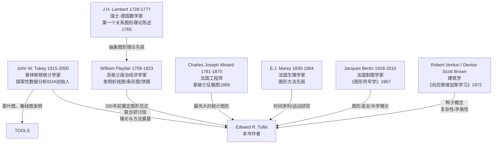

# 《The Visual Display of Quantitative Information》分析报告

---

## 一、书目信息

| 项目 | 内容 |
|------|------|
| **书名（英文）** | The Visual Display of Quantitative Information, Second Edition |
| **书名（中文试译）** | 《定量信息的视觉呈现》（第二版） |
| **作者** | Edward R. Tufte（爱德华·R·塔夫特） |
| **初版年份** | 1983年 |
| **第二版年份** | 2001年 |
| **出版社** | Graphics Press LLC, Cheshire, Connecticut |
| **页数/章节** | 正文191页，共2部分、9章，附索引与致谢；插图约250幅 |
| **ISBN** | 未在文本中明示（Graphics Press自出版） |
| **作者身份** | 耶鲁大学政治学、统计学及计算机科学荣誉教授；信息设计领域先驱 |
| **装帧特色** | 作者自费抵押房产出版，与书籍设计师Howard Gralla合作，实现"自我示例"（self-exemplifying）——书籍本身即为书中理念的物质载体，图与文在句子中间无缝交融，无传统图文分离 |
| **题献** | 献给父母 Edward E. Tufte 和 Virginia James Tufte；纪念 John W. Tukey (1915-2000) |

---

## 二、内容摘要

本书是数据图形设计领域的奠基之作，系统构建了一套关于统计图形（data graphics）的理论语言与实践原则。全书分为两大部分：

**第一部分（图形实践，第1-3章）** 回顾自William Playfair（1759-1823）以降两百余年的图形实践史。第一章展示图形卓越性的经典范例——数据地图（癌症地图、星系图）、时间序列（纽约天气史、Playfair的贸易图表、Marey的火车时刻表）、空间-时间叙事图形（Minard的拿破仑征俄图）和关系图形（散点图及其变体）。第二章严厉批判图形诚信的缺失，提出"谎言因子"（Lie Factor）公式来量化图形扭曲程度，指出图形设计失真（design variation）和不可靠数据是"无聊统计"的两大根源。第三章探究图形精致性与诚信的来源：强调真正精致的图形是"熟练之手"在长期实践中积累的技艺，而非迎合大众口味的肤浅设计，并通过跨国比较揭示图形品质与受众素养的关联。

**第二部分（数据图形理论，第4-9章）** 提出一套系统的图形设计理论。核心概念包括：数据墨水（data-ink）与非数据墨水（non-data-ink）的区分、数据墨水最大化原则与擦除原则（erase principle）、Chartjunk（图表垃圾）的三种变体（摩尔纹振动、网格、自恋鸭形图）、多功能图形元素（multifunctioning graphical elements）、数据密度（data density）与数据矩阵、缩微原理（Shrink Principle）与小型多重图（small multiples），以及数据图形美学原则。全书以"清晰呈现复杂"（the clear portrayal of complexity）为终极追求，以Minard的拿破仑征俄图、Marey的火车时刻表和星系图为经典范例。

作者实践了"自我示例"：书籍设计与内容高度统一——图文混排直至句中、文字图形表格合为一体、版式精致。Tufte抵押房产自筹资金出版，拒绝出版社低价高价的商业模式，确保书籍成为"最优美、最优雅、最美妙的书"。

---

## 三、结构

```
序言（Introduction to the Second Edition, 第一版引言）
│
├── 第一部分：图形实践（Graphical Practice）
│   ├── 第1章  图形卓越性（Graphical Excellence）
│   │        - 数据地图（癌症地图、星系图、Snow的霍乱地图）
│   │        - 时间序列（Playfair的贸易/工资图、Marey的生理运动图）
│   │        - 空间-时间叙事图（Minard的拿破仑征俄图、洛杉矶空气污染）
│   │        - 关系图形（散点图、Phillips曲线、热导率综合图）
│   │
│   ├── 第2章  图形诚信（Graphical Integrity）
│   │        - 图形失真：谎言因子公式
│   │        - 设计变异与数据变异
│   │        - 视觉面积与数量表征
│   │        - 语境与可信度问题
│   │
│   └── 第3章  图形诚信与精致的来源
│            （Sources of Graphical Integrity and Sophistication）
│            - 图形能力与受众素养的国际比较
│            - 日本论文中图形的超级时代
│            - "双重铁律"：图形与受众的匹配
│
├── 第二部分：数据图形理论（Theory of Data Graphics）
│   ├── 第4章  数据墨水与图形再设计（Data-Ink and Graphical Redesign）
│   │        - 数据墨水/非数据墨水概念
│   │        - 数据墨水比公式
│   │        - 擦除策略的五原则
│   │
│   ├── 第5章  图表垃圾：振动、网格与鸭子
│   │        （Chartjunk: Vibrations, Grids, and Ducks）
│   │        - 无意光学艺术（摩尔纹振动）
│   │        - 网格的滥用与灰色网格替代方案
│   │        - 自恋型图形："鸭子"（duck）概念
│   │        - 计算机制图的chartjunk问题
│   │
│   ├── 第6章  数据墨水最大化与图形设计
│   │        （Data-Ink Maximization and Graphical Design）
│   │        - 箱线图→四分位图的再设计
│   │        - 条形图/直方图的再设计（白色网格法）
│   │        - 散点图的再设计（范围框架、点划线图）
│   │
│   ├── 第7章  多功能图形元素
│   │        （Multifunctioning Graphical Elements）
│   │        - 数据构建的数据度量（stem-and-leaf图、Ayres的一战师团图）
│   │        - 数据网格与数据标签
│   │        - 双重功能标签
│   │        - 图形谜题与层次性（3层观看深度、3个视觉角度）
│   │
│   ├── 第8章  数据密度与小型多重图
│   │        （Data Density and Small Multiples）
│   │        - 数据密度公式与实证测量（期刊/报纸比较表）
│   │        - 缩微原理
│   │        - 小型多重图（空气污染、鱼类年龄、染色体对比、汽车维修记录）
│   │
│   └── 第9章  数据图形设计中的美学与技术
│            （Aesthetics and Technique in Data Graphical Design）
│            - 句型/文字表格/表格/半图形/全图形的选择光谱
│            - 友好图形 vs 不友好图形对照表
│            - 文字、数字与图片的整合原则
│            - 比例与尺度：线宽、字体、图形长宽比（倡导水平矩形约1.5:1）
│
├── 尾声（Epilogue）：信息显示的设计
└── 索引（Index）、致谢、图版来源
```

---

## 四、核心论点与概念

> 以下核心概念按首次出现或集中论述位置标记章节号 L###（以正文核心页为参考）。

### L013 图形卓越性的九条标准

1. 展示数据（show the data）
2. 引导观看者思考实质内容而非方法论/设计/技术
3. 避免扭曲数据所要表达的内容
4. 在小空间内呈现大量数字
5. 使大数据集连贯可读
6. 鼓励眼睛比较不同数据片段
7. 从概览到细部结构的多层次揭示数据
8. 服务于清晰目的：描述、探索、制表或装饰
9. 与数据集的统计描述和文字描述紧密整合

### L053 谎言因子（Lie Factor）

定义公式：$$\text{Lie Factor} = \frac{\text{图形中所示效果的大小}}{\text{数据中实际效果的大小}}$$

- 若 Lie Factor > 1，图形夸大了实际效果
- 实质性的图形失真几乎总是涉及 Lie Factor 超过 1 的情况
- 原则：物理图形上所呈现的数字表征应与所呈现的数值量成正比

### L060 数据变异与设计变异（Design Variation vs. Data Variation）

每个图形可分解为两部分：(1) 由数据变异引起的墨水变化，(2) 由非数据设计因素引起的墨水变化。图形中绝大部分墨水应呈现数据信息。数据墨水比 = （数据墨水）/（印刷图形所用的总墨水）。

### L079 图形精致性的双重铁律

图形品质取决于两项条件：(1) 图形制作者具备"熟练之手"（skilled hand）——真实的能力、技能和诚信；(2) 受众具备理解复杂图形的素养。图形诚信与精致是双向匹配的结果。数据显示了各国报纸图形数据密度的显著差异（《华尔街日报》《泰晤士报》与《真理报》的巨大差距）。

### L091 数据墨水理论五原则

1. **Above all else show the data.**（最重要：展示数据。）
2. **Maximize the data-ink ratio.**（最大化数据墨水比。）
3. **Erase non-data-ink.**（擦除所有非数据墨水。）
4. **Erase redundant data-ink.**（擦除冗余的数据墨水。）
5. **Revise and edit.**（反复修订与编辑。）

数据墨水比公式：$$\text{Data-ink ratio} = \frac{\text{data-ink}}{\text{total ink used to print the graphic}}$$

### L107 Chartjunk 三种类型

- **摩尔纹振动（moiré vibration）**：无意光学艺术，由重复线条图案与眼睛生理性震颤相互作用产生闪动感；是最常见的图形垃圾。实证数据：JASA风格表样本中图形68%含摩尔纹，NEJM中21%，Nature中11%。
- **网格（the grid）**：深色网格线不携带信息，遮蔽数据轮廓，应改为灰色细线或完全隐去。灰色网格有助于精确读取。
- **鸭子（the duck）**：自恋型图形——图形整体异化为装饰品，数据被设计元素吞没。源自建筑学中 Venturi/Brown/Izenour 的概念。"装饰建构是可以的，但永远不要建构装饰。"

### L123 数据墨水最大化的再设计实例

- **箱线图→四分位图**：Spear的range bar需要6次直尺放置，重新设计后仅需1次
- **条形图→白色网格条形图**：擦除框架、纵轴、刻度标记，仅保留数据条和白色网格线
- **散点图→范围框散点图（range-frame）**：原先无信息的框架变为数据承载元素，显式标记X和Y变量的最大、最小
- **点划线图（dot-dash-plot）**：在散点图外围叠加两变量的边际分布，一次呈现三类统计信息

### L139 多功能图形元素原则

> Mobilize every graphical element, perhaps several times over, to show the data.
> （动员每一个图形元素，也许反复多次，以展示数据。）

关键设计技术：
- **数据构建的数据度量**：如茎叶图（stem-and-leaf plot）用数字本身形成分布图；Ayres一战师团图用师团番号同时表示数量、具体身份与驻留时长
- **数据网格与数据标签**：Playfair的国债图以不规则间距将网格线绑定到重大事件（数据驱动网格）
- **范围标签**：以实际数据的最小值和最大值替代凑整数字坐标标签

### L154 图形观看架构的三层次

通过三个不同层次组织多重信息而不使图形沦为谜题：
1. **三层观看深度**：(1) 远观——整体聚合结构；(2) 近观——数据细部结构；(3) 潜观——图形背后隐含的信息
2. **三个视觉角度**：每个独立视线方向应保持恒定（水平或垂直），如Ayres师团图的三个阅读方向（时间序列的轮廓线、条形图的垂直构成、各师驻留时间的水平方向）

### L161 数据密度与缩微原理

定义公式：$$\text{data density} = \frac{\text{number of entries in data matrix}}{\text{area of data graphic}}$$

实证测量（1979-1980年抽样数据）：《Nature》中位数48个/平方英寸、《科学》21个/平方英寸、《纽约时报》7个/平方英寸、《真理报》0.2个/平方英寸。美国地质调查局地形图约250,000比特/平方英寸。星系图（最新纪录）：110,000个数字/平方英寸。

**缩微原理**：图形可以大幅度缩小。许多已发表的图形可缩减至其当前面积的一半而无信息损失。

### L170 小型多重图（Small Multiples）

> 对数据墨水而言，少即是无聊。对非数据墨水而言，少即是多。
> （For data-ink, less is a bore. For non-data-ink, less is more.）

核心特征：不可避免的比较性、巧妙的多元变量、已缩小的、高密度图形、几乎完全用数据墨水绘制、高效解读、往往具有叙事内容。范例：洛杉矶空气污染的24小时变化、鱼类年龄构成的逐年变化、人与猿染色体对比、Consumer Reports汽车维修频次表格。

### L177 图形美学原则与友好图形

优雅图形的关键：**设计之简洁与数据之复杂的结合**（simplicity of design and complexity of data）。

友好 vs 不友好图形对照（节选）：
| 友好 | 不友好 |
|------|--------|
| 完整拼写词语，避免神秘编码 | 缩写充斥，需翻阅文本解码 |
| 文字从左到右排列 | 文字纵向排列（尤Y轴） |
| 小消息帮解释数据 | 图形晦涩，需反复参考分散文本 |
| 直接在图形上标注，无需图例 | 被迫在图例与图形间来回 |
| 考虑色盲人群（5-10%观众） | 红绿组合用于关键对比 |
| 有衬线大小写字母 | 全部大写，无衬线 |

### L186 水平矩形原则

图形应倾向于水平矩形（宽大于高），理由：类比地平线（眼睛天然擅长检测水平偏离）、便于标签读写、强调因果变量、Tukey意见（蜿蜒曲线需更宽）、Playfair实践（89幅图中92%为水平矩形）。建议长宽比约1.5:1（比黄金比例1.618更水平）。

### L191 终极原则：清晰呈现复杂

> What is to be sought in designs for the display of information is the clear portrayal of complexity. Not the complication of the simple; rather the task of the designer is to give visual access to the subtle and the difficult — that is, the revelation of the complex.
> （信息展示设计所应追求的，是复杂性的清晰呈现。不是简化简单事物；设计者的任务是对微妙和困难之物给予视觉通路——亦即，对复杂性的揭示。）

---

## 五、方法论与材料

### 5.1 方法论特征

**Tufte的分析方法具有高度的实证精神和跨学科色彩：**

1. **定量实证法**：对大量已发表图形进行系统抽样与统计分析。典型案例：
   - 十大引用率最高科学期刊（1980-1982年）中摩尔纹图形占比统计
   - 统计学教科书和计算机图形手册中chartjunk比例的历史变化
   - 15种全球主要报纸/杂志/期刊的数据密度与数据矩阵大小比较表
   - Playfair 89幅图的长宽比分布统计

2. **案例比较法（Before-After）**：对同一图形进行"原版vs改版"对照，通过视觉对比论证原则的有效性。如：法国人口金字塔（深色网格→灰色网格→白色网格）、JASA风格样图（131条线→精简版）、散点图（传统框架→范围框架→四分位图→点划线图）。

3. **历史谱系法**：追溯图形发明的时间序列——从11世纪中国《禹迹图》→1686年Halley信风地图→1765年Lambert关系图形理论→1786年Playfair经济时间序列→1854年Snow霍乱地图→1869年Minard拿破仑征俄图→现代计算机图形。以历史纵深论证图形是一种缓慢积累的文化成就。

4. **概念蒸馏法**：将复杂的图形设计经验提炼为少数简洁、可操作的公式化原则（如数据墨水比公式、谎言因子公式、数据密度公式），使理论具有可操作性和可验证性。

5. **跨学科类比法**：广泛援引建筑学（Venturi的"鸭子"概念）、艺术批评（Reinhardt的"无噪音"宣言、Albers的色彩理论）、排版学（字体的可读性实验）、视觉心理学（格式塔感知、眼睛分辨力极限）、制图学等领域的成熟概念来丰富和深化数据图形理论。

### 5.2 材料来源

- **历史文献（15-19世纪）**：Lambert的《Pyrometrie》(1779)、Playfair的《The Commercial and Political Atlas》(1786) 和《The Statistical Breviary》(1801)、Marey的《La méthode graphique》(1885)、Halley的哲学汇刊论文(1686)、Snow的《On the Mode of Communication of Cholera》(1855)、Minard的手绘组合图集(1845-1869)、Leonardo da Vinci的手稿
- **现代科学期刊**：《Science》《Nature》《The Lancet》《New England Journal of Medicine》《Journal of the American Statistical Association》等十余种期刊的图像样本
- **新闻媒体**：《New York Times》《Wall Street Journal》《The Times (London)》《Asahi》《Le Monde》《Pravda》《The Economist》《Fortune》《Newsweek》《Business Week》等
- **统计图形教科书与软件手册**：Brinton (1914)、Satet (1932)、Arkin & Colton (1936)、Spear (1952)、Schmid & Schmid (1979)、SAS/GRAPH用户指南 (1980)、Tell-A-Graf用户手册 (1981)
- **政府与机构出版物**：U.S. Bureau of the Census（癌症地图集、人口密度图、Statistical Abstract）、National Science Foundation、OECD
- **经典图形范例**：Minard拿破仑征俄图、Marey巴黎-里昂火车时刻表、纽约市1980年天气史、星系计数的Lick Catalog图、Bertin的法国公社图

---

## 六、学术谱系

### 6.1 先驱与直接师承



### 6.2 学派定位

- Tufte的学术工作在**John Tukey的EDA（探索性数据分析）传统**中延展，但侧重点从Tukey的"数据分析工具"转向"已发表/出版的统计图形的设计品质"
- 同时受到**Bertin的图形符号学**（sémiologie graphique）影响——Bertin提供了图形编码的视觉变量系统（位置、大小、形状、方向、颜色、纹理、灰度），Tufte则补充了数据墨水最大化与chartjunk批评的实用维度
- 来自**现代主义设计与排版传统**的审美批评——Josef Albers、Ad Reinhardt、Mondrian等艺术家的"少即是多"理念通过Tufte转化为"非数据墨水尽可能少"的设计教条
- 继承**Venturi的建筑后现代批评**——"装饰建构是可以的，但永远不要建构装饰"转化为"chartjunk"与"鸭子"的图形批评武器
- 在历史上属于**第二次统计图形复兴**（约1975-2000年），伴随着计算机图形学的兴起，Tufte试图在"计算机能画一切"的时代建立质量判断标准

### 6.3 直接影响

Tufte后续出版了三部姊妹著作形成四部曲：《Envisioning Information》(1990)、《Visual Explanations》(1997)、《Beautiful Evidence》(2006)。《The Visual Display of Quantitative Information》是四部曲的奠基之作，确立了整套术语和分析框架。Tufte的思想深刻影响了数据新闻学（如《纽约时报》信息图团队）、科学出版界的图形标准、以及当代数据可视化工具（如Tableau、D3.js等）的设计哲学。

---

## 七、六类实体清单

### 7.1 关键人物（People）

| 人物 | 生卒年 | 国籍/领域 | 在本书中的角色 |
|------|--------|-----------|----------------|
| William Playfair | 1759-1823 | 苏格兰政治经济学家 | 现代统计图形之父，发明折线图、条形图、饼图；著《The Commercial and Political Atlas》(1786)、《The Statistical Breviary》(1801) |
| J.H. Lambert | 1728-1777 | 瑞士-德国数学家/科学家 | 1765年首次明确提出关系图形（非类比）的抽象理论；绘制土壤温度-深度时间序列 |
| Charles Joseph Minard | 1781-1870 | 法国工程师 | 绘制"可能是有史以来最好的统计图形"——拿破仑1812年征俄图（1869）；亦绘汉尼拔远征图 |
| E.J. Marey | 1830-1904 | 法国生理学家 | 图形方法先驱；火车时刻表设计；马步态/海马/壁虎的运动时间序列摄影 |
| John W. Tukey | 1915-2000 | 美国统计学家 | Tufte的导师与合作者；EDA（探索性数据分析）创始人；发明茎叶图与箱线图；本书理论的重要奠基人 |
| Jacques Bertin | 1918-2010 | 法国制图学家 | 著《Sémiologie Graphique》(1967)；图形符号学理论奠基人；本书中多次引用其法国公社图 |
| John Snow | 1813-1858 | 英国医生 | 1854年伦敦霍乱点状地图——最早的流行病学空间分析经典案例 |
| Edmond Halley | 1656-1742 | 英国天文学家 | 1686年绘制世界上最早的数据地图之一——信风与季风世界地图 |
| Leonard P. Ayres | 1879-1946 | 美国军官/统计学家 | 设计一战美军师团驻法时间多功能图形（打字机+直尺手绘） |
| Josef Albers | 1888-1976 | 德裔美国艺术家/教育家 | 色彩理论家，《Interaction of Color》(1963)；Tufte引用其衬线vs无衬线字体的眼科学论证 |
| Robert Venturi | 1925-2018 | 美国建筑师 | 《向拉斯维加斯学习》(1972)中"鸭子"概念之父；为Tufte的chartjunk批判提供建筑学类比 |
| Herman Chernoff | 1923- | 美国统计学家 | 发明Chernoff面孔图（用卡通脸编码多元数据）；Tufte视为多功能图形的极限案例 |

### 7.2 关键文献（Publications）

| 文献 | 作者 | 年份 | 说明 |
|------|------|------|------|
| *The Commercial and Political Atlas* | William Playfair | 1786 | 第一本含经济时间序列图的书；44幅图中有43幅为时间序列、1幅为条形图 |
| *The Statistical Breviary* | William Playfair | 1801 | Playfair最理论化的著作；首次使用饼图和面积图表示多元数据 |
| *Pyrometrie* | J.H. Lambert | 1779 | 含土壤温度与深度的周期性变化时间序列图 |
| "Essai d'hygrométrie" | J.H. Lambert | 1765/1771 | 首次明确提出抽象关系图形理论；用图形微积分推导蒸发率 |
| *La Méthode Graphique* | E.J. Marey | 1885 | 19世纪图形方法集大成之作；含火车时刻表、马步态、海马运动等经典图例 |
| *Tableaux Graphiques et Cartes Figuratives* | C.J. Minard | 1845-1869 | 拿破仑征俄图与汉尼拔远征图的原出处（巴黎国立路桥学院图书馆藏） |
| *Sémiologie Graphique* | Jacques Bertin | 1967 | 图形符号学奠基之作；确立视觉变量的系统理论框架 |
| *On the Mode of Communication of Cholera* | John Snow | 1855 | 含伦敦Soho区霍乱死亡病例空间分布图 |
| *Cancer Mortality Atlas for U.S. Counties: 1950-1969* | Mason, McKay, Hoover, Blot, Fraumeni | 1975 | 3,056个县的6幅癌症死亡率地图；约21,000个数字的视觉呈现 |
| *Exploratory Data Analysis* | John W. Tukey | 1977 | EDA奠基著作；茎叶图、箱线图等新发明的原始出处 |
| *Learning from Las Vegas* | Venturi, Brown, Izenour | 1972 | "鸭子"建筑概念的来源；被Tufte转用于图形批评 |
| *Atlas of Early American History* | Cappon, Petchenik, Long | 1976 | 以网格叠加展示历史数据的地图集案例 |
| "Historical Development of the Graphical Representation of Statistical Data" | H. Gray Funkhouser | 1937 | 统计图形史的权威综述（发表于 *Osiris* 第3卷） |
| "The Use of Faces to Represent Points in k-Dimensional Space Graphically" | Herman Chernoff | 1973 | Chernoff面孔图的原论文（发表于 *JASA*） |

### 7.3 关键术语/概念（Terms & Concepts）

| 术语（英文） | 中文试译 | 定义出处 | 简要定义 |
|-------------|----------|----------|----------|
| Data-ink | 数据墨水 | Ch.4 (p.91) | 用于呈现数据的不可擦除的核心墨水；改变数据即必须改变此部分 |
| Non-data-ink | 非数据墨水 | Ch.4 (p.96) | 非数据呈现所必需的墨水；包括冗余的数据墨水（同一数据的重复编码） |
| Data-ink ratio | 数据墨水比 | Ch.4 (p.93) | = 数据墨水 ÷ 印刷图形所用的总墨水；衡量图形效率的核心指标 |
| Erase principle | 擦除原则 | Ch.4 (p.96-100) | 通过系统删除非数据墨水和冗余数据墨水来提升图形效率 |
| Chartjunk | 图表垃圾 | Ch.5 (p.107) | 对观众不传递新信息的装饰性墨水；包含摩尔纹、网格和鸭子三类 |
| Moiré vibration | 摩尔纹振动 | Ch.5 (p.107-112) | 由重复线条与眼睛生理性震颤相互作用产生的闪动效应；最常见的chartjunk |
| Duck | 鸭子（图形） | Ch.5 (p.116-121) | 整个图形被装饰形式或计算机碎屑占据，数据沦为设计元素的附庸 |
| Lie Factor | 谎言因子 | Ch.2 (p.57) | = 图形所示效果大小 ÷ 数据所示实际效果大小；>1表示图形夸大效果 |
| Design variation | 设计变异 | Ch.2 (p.60-61) | 由非数据的图形设计因素引起的视觉变化（与真实数据变异无关） |
| Range-frame | 范围框架 | Ch.6 (p.130) | 将传统散点图框架裁剪至数据实测范围的新型框架设计 |
| Dot-dash-plot | 点划线图 | Ch.6 (p.133) | 在散点图外围叠加两变量边际频率分布的复合设计 |
| Quartile plot | 四分位图 | Ch.6 (p.124) | 对传统箱线图的简化再设计——仅需一次直尺放置即可绘制 |
| Multifunctioning graphical elements | 多功能图形元素 | Ch.7 (p.139) | 同一墨水同时承载多种图形功能（如既表示位置又编码数值） |
| Graphical puzzle | 图形谜题 | Ch.7 (p.153) | 必须通过语言解码而非视觉直觉来理解的过度复杂的图形 |
| Data density | 数据密度 | Ch.8 (p.161) | = 数据矩阵条目数 ÷ 图形面积；衡量信息紧凑度的经验指标 |
| Shrink Principle | 缩微原理 | Ch.8 (p.169) | 图形可以大幅缩小面积而不损失可读性和信息 |
| Small multiples | 小型多重图 | Ch.8 (p.170-175) | 一系列保持相同设计结构、仅改变指标变量的缩小图形组合 |
| Graphical excellence | 图形卓越性 | Ch.1 (p.13) | 复杂思想以清晰、精确和效率进行传达 |
| Friendly data graphic | 友好数据图形 | Ch.9 (p.183) | 以观众为本精心设计：词语完整拼写、文字水平排列、标注内置、无冗余编码 |
| Supertable | 超级表格 | Ch.9 (p.179) | 组织有序、带叙事结构的精细表格；比一百张小条形图更好 |
| Clear portrayal of complexity | 复杂性的清晰呈现 | Epilogue (p.191) | 全书终极原则——图形设计的目标不是将简单复杂化，而是让微妙和困难之物可视 |

### 7.4 关键图形作品（Artworks）

| 图形 | 创作者 | 年份 | 类型 | Tufte的评价 |
|------|--------|------|------|-------------|
| 拿破仑征俄图（Carte Figurative des pertes successives en hommes de l'Armée Française dans la campagne de Russie 1812-1813） | C.J. Minard | 1869 | 空间-时间叙事图 | "可能是有史以来最好的统计图形"；六变量合一：军队规模、位置（二维）、方向、温度、日期 |
| 巴黎-里昂火车时刻表 | E.J. Marey | 1880s | 时间-空间图 | 斜度=速度，交点=会车时刻，水平线=停站时长；时空双变量的经典整合 |
| 纽约市1980年天气史 | *New York Times* | 1981 | 时间序列 | 1,888个数字的优雅组织；日最高/低温与常年平均对比；一个页面上讲一个完整的天气故事 |
| 汉尼拔远征图 | C.J. Minard | 1869 | 空间-时间叙事图 | 拿破仑图的小型姊妹版；透明色彩让底图文字透出 |
| 美国癌症死亡率地图集（6幅） | Mason, McKay, Hoover 等 | 1975 | 数据地图 | 每图约21,000个数字在3,056个县上的呈现；揭示癌症地理聚集模式 |
| 星系图（Lick Catalog） | Seldner, Siebers, Groth, Peebles | 1977 | 数据地图 | 数据密度记录保持者（110,000个/平方英寸）；2,275,328个矩形编码在61平方英寸上 |
| Playfair的英格兰进出口图（1700-1782） | William Playfair | 1786 | 时间序列 | 第一个已发表的经济数据时间序列；图形"算术"（进出口面积差） |
| 洛杉矶空气污染小型多重图 | Gregory J. McRae / *Los Angeles Times* | 1979 | 小型多重图 | 12个相同结构的时间-空间切片；28,800个污染读数的多层次呈现 |
| 热导率综合散点图 | Ho, Powell, Liley | 1974 | 关系图形 | 数百项研究的铜热导率数据汇于一幅；编号编码文献来源（可改进为时序编码） |
| 一战美军师团驻法图 | Leonard P. Ayres | 1919 | 多功能图形 | 用打字机+直尺手绘；师团番号同时表示数量、身份、驻留时长 |
| 辐鳍鱼的"活直方图"（Living Histogram） | Brian L. Joiner | 1975 | 创新统计图 | 学生身高数据的物理排列直接形成分布形态 |
| Consumer Reports汽车维修频次表 | *Consumer Reports* | 1982 | 表格式小型多重图 | 制造商×车型年份×故障类型的三维比较矩阵；Tufte称其混合表格与图形的精巧设计 |

### 7.5 关键时间/事件（Timeline）

| 时间 | 事件 | 意义 |
|------|------|------|
| 约前2500年 | 最早的泥板地图出现 | 地图比统计图形早约5000年 |
| 约前500年 | 黄金比例（Golden Section）由古希腊人确立 | 在本书中作为图形长宽比讨论的背景 |
| 11世纪 | 中国《禹迹图》（Yü Chi Thu）刻石 | 最早的高精度网格地图之一（Needham誉为"当时任何文化中最杰出的制图作品"） |
| 1546年 | Petrus Apianus《Cosmographia》出版 | 欧洲制图已逼近统计图形化——但尚未有人将测量数据放在地图上 |
| 1686年 | Edmond Halley绘制信风与季风世界图 | 最早的数据地图之一；用小箭头表示风向 |
| 1765年 | J.H. Lambert提出抽象关系图形理论 | 统计图形不再依赖于地理/物理世界类比的关键突破 |
| 1779年 | Lambert《Pyrometrie》出版 | 含土壤温度周期性时间序列图 |
| 1786年 | William Playfair《The Commercial and Political Atlas》出版 | 第一个经济时间序列图；现代统计图形的正式诞生 |
| 1801年 | Playfair《The Statistical Breviary》出版 | 首次使用饼图和面积图；Playfair最理论化的图形著作 |
| 1854年 | Dr. John Snow绘制伦敦霍乱死亡病例图 | 流行病学空间分析的经典范例 |
| 1869年 | Minard绘制拿破仑俄罗斯战役图 | 被Tufte誉为"可能是有史以来最好的统计图形" |
| 1885年 | E.J. Marey《La méthode graphique》出版 | 19世纪图形方法集大成之作 |
| 1937年 | H. Gray Funkhouser发表统计图形史综述 | 学术史上首次系统梳理图形发明的时间谱系 |
| 1967年 | Jacques Bertin《Sémiologie Graphique》出版 | 图形符号学的理论奠基 |
| 1972年 | Robert Venturi等《Learning from Las Vegas》出版 | "鸭子"概念为Tufte的chartjunk批判提供建筑学类比 |
| 1975年 | 美国癌症地图集出版 | Tufte反复引用的高密度数据地图范例 |
| 1977年 | John Tukey《Exploratory Data Analysis》出版 | EDA方法论奠基；茎叶图、箱线图等新发明的正式发表 |
| 1977年 | Lick星系目录新约简版发表 | 当前数据密度最高纪录的保持者（110,000个数字/平方英寸） |
| 1982年 | Tufte完成《The Visual Display of Quantitative Information》手稿 | 本书的完成 |
| 2001年 | 本书第二版出版 | 增加高分辨率彩色再现Playfair图形、修改17次印刷中的错误 |

### 7.6 关键数据/统计（Key Statistics）

| 数据/统计 | 数值 | 上下文 |
|----------|------|--------|
| 全球每年印刷的统计图形数量估计 | 9000亿至2万亿幅 | 本书导论中用于论证图形设计原则影响范围之广 |
| 图形中时间序列占比 | >75% | 基于1974-1980年全球15种报纸/杂志4,000幅图形的随机抽样 |
| 现代科学文献中关系图形占比 | 约40% | 其中不含经纬度或时间变量 |
| 摩尔纹振动在各期刊中的占比 | Nature 11%, Science 17%, NEJM 21%, JASA样本68% | 1980-1982年十大引用率最高科学期刊的抽样统计 |
| 数据密度范围（期刊中位数） | Nature: 48, Science: 21, JASA: 17, Pravda: 0.2（个/平方英寸） | 1979-1980年抽样数据 |
| 星系图数据密度 | 110,000个数字/平方英寸（17,000个/平方厘米） | 改写后的Lick星系目录图（61平方英寸，2,275,328个矩形） |
| 美国地质调查局地形图信息密度 | 约250,000比特/平方英寸（40,000比特/平方厘米） | "标准17×23英寸图幅含超1亿比特信息" |
| Playfair图形的长宽比 | 92%为水平矩形；2/3介于1.4-1.8之间 | 基于6本不同著作中89幅图形的统计分析 |
| 人眼在1平方英寸内的分辨能力 | 可分辨约625个点或81×81网格下6,561个不同位置 | 以n条黑线和n-1条白线计算的(2n-1)²个线交叉点 |
| 拿破仑军队从莫斯科撤退的损失 | 从422,000人减至10,000人 | Minard征俄图的核心叙事数据 |
| 美国癌症地图的数据矩阵规模 | 约21,000个数字/图（7个变量×3,056个县） | 6幅图中每幅的数据量估计 |
| 图形面积缩小到原来的50% | 几乎不损失可读性和信息 | 缩微原理的核心经验结论 |

---

## 八、语言风格

### 8.1 总体风格定位

Tufte的写作风格是**雄辩的学术散文（eloquent scholarly essay）**与**设计宣言（design manifesto）**的混合体。全书兼具学理严谨性（大量数据、公式、表格、引用）和审美判断力（大量带有明确价值立场的品评——"这可能是最糟糕的图""这是最好的统计图形"）。句子节奏感强，善用排比句式（如：第九章的"Friendly/Unfriendly"对照表、Ad Reinhardt引文的密集否定名词链"no noise, no schmutz, no schmerz..."），近似于带有道德紧迫感的布道式修辞。

### 8.2 典型修辞策略

1. **警句式压缩（Aphoristic Compression）**：将复杂原则浓缩为可引用、易记忆的短句阵列：

   > "Above all else show the data."
   > "For data-ink, less is a bore. For non-data-ink, less is more."
   > "Graphics should be as intelligent and sophisticated as the accompanying text."

2. **对立结构（Binary Oppositions）**：全书贯穿着一系列鲜明的二元对立——卓越 vs 欺骗、数据墨水 vs 非数据墨水与chartjunk、友好 vs 不友好、精致 vs 粗鄙、内容 vs 装饰。这种结构赋予文本清晰的价值指向和批判张力。

3. **图表即论证（Graphic-as-Argument）**：语言论证与视觉证据高度融合。Tufte不只是"谈论"图形，而是把图形嵌入句子的中间（实践了自身"图文合一"的理念），让读者直接观看他所讨论的对象。

4. **数据驱动批判（Data-Driven Critique）**：批判不是空泛的审美指责，而是以定量证据支撑——使用百分比表、分类统计、数据密度测量。如对chartjunk的批判辅以10种期刊和10种教科书的摩尔纹比例统计表。

5. **跨学科引证网络（Interdisciplinary Citation Web）**：自如地引用经济学（Playfair）、建筑学（Venturi）、艺术批评（Reinhardt、Albers、Matisse）、排版学、视觉心理学、制图学、统计学（Tukey）等多领域的权威话语，构建出超越单一学科边界的综合理论场域。

6. **个人叙事穿插（Personal Narrative）**：序言中嵌入自传元素（1975年普林斯顿教学经历、抵押房屋自费出版、与设计师Howard Gralla在车库工作的那个夏天），赋予学术论述以人的温度和历史质感。"银行职员说这是她经手过的第二不寻常的贷款——第一名是贷给一个马戏团买大象的！"

7. **偶有锐利讽刺（Occasional Sharp Irony）**："这可能是有史以来最糟糕的印刷图形""Boutique Data Graphics的世界""We-Used-A-Computer-To-Build-A-Duck Syndrome"——Tufte的讽刺近乎刻薄，但始终服务于论证目的。

### 8.3 汉译难点

- 术语创新（如"chartjunk"译为"图表垃圾"基本可传达，但"duck"的建筑学语境、"moiré vibration"的技术精确性在翻译中会损失部分意涵）
- 警句的节奏与压缩感（英文中"Above all else show the data"六个词的力量在中文"首要的是展示数据"中会有所稀释）
- 讽刺语气（"Boutique Data Graphics"的文化语境——指向1980年代初期美国企业年报中的视觉浮夸风潮）
- 数学公式与图表的视觉论证作用——原文将图文融为一体，译写时须保持这种论证结构

---

## 九、一句话概括

> 以"展示数据"为第一律令、以"数据墨水比最大化"为操作核心、以"清晰呈现复杂性"为终极追求，本书既是一部数据图形设计的理论宣言与操作方法手册，也是古今经典图表的美学鉴赏集——它系统论证了：好的统计图形是一门关于视觉证据的智力与审美学科，其品质取决于数据之丰富与设计之克制的精确平衡。

---

*报告生成日期：2026-08-03*
*源文件路径：F:/Design-history-知识元/00-book/Edward R. Tufte：《The Visual Display of Quantitative Information》，1983.md*
