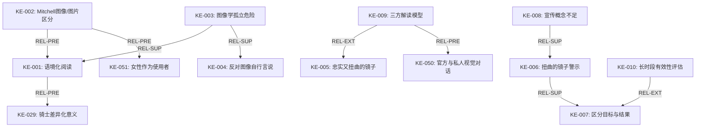
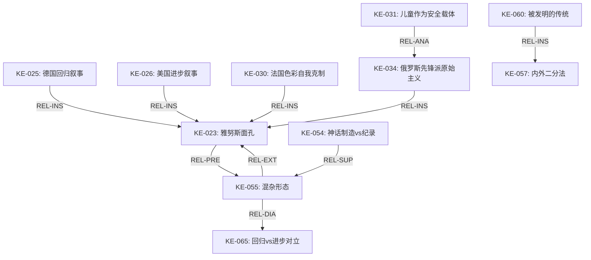
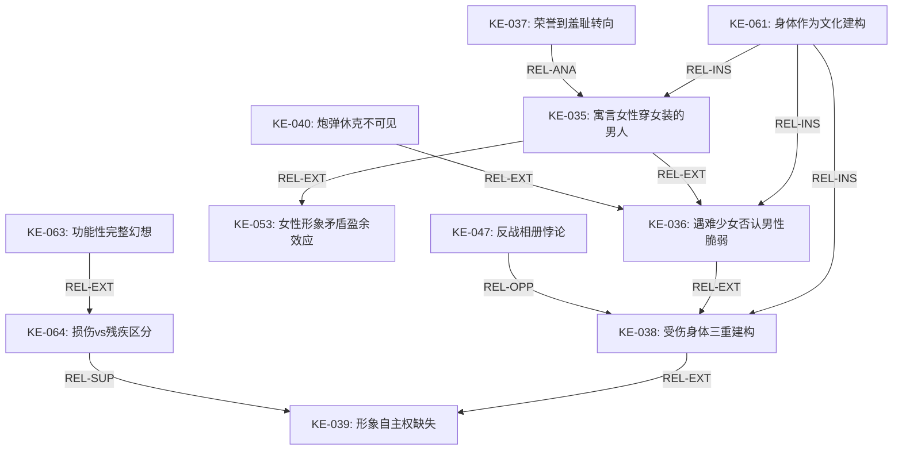
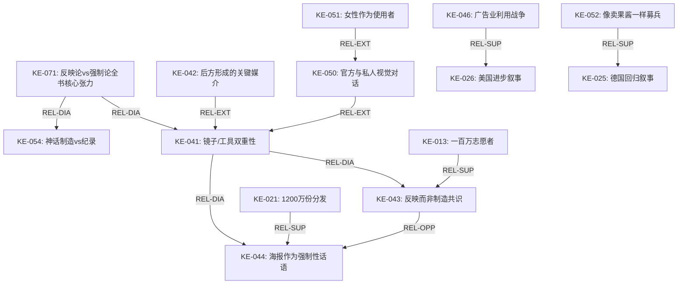

# 02_语义链接网络：《Picture This》知识元间的语义关系结构

## 一、链接构建总览

### L### 1.1 构建范围

基于01_知识元语意分析.md中的72个知识元，本文件构建了138条语义链接，覆盖十种关系类型。链接密度为1.92（138/72），落在目标范围（1.5-2.5）内，满足最小完备性和最大稀疏性约束。

### L### 1.2 关系类型分布

| 关系类型 | 代码 | 数量 | 占比 | 方向性 |
|----------|------|------|------|--------|
| 支持 | REL-SUP | 28 | 20.3% | 有向 |
| 延伸 | REL-EXT | 24 | 17.4% | 有向 |
| 例证 | REL-INS | 18 | 13.0% | 有向 |
| 前提 | REL-PRE | 8 | 5.8% | 有向 |
| 因果 | REL-CAU | 6 | 4.3% | 有向 |
| 转化 | REL-TRN | 6 | 4.3% | 有向 |
| 包含 | REL-CON | 4 | 2.9% | 有向 |
| 对立 | REL-OPP | 10 | 7.2% | 对称 |
| 类比 | REL-ANA | 16 | 11.6% | 对称 |
| 对话 | REL-DIA | 18 | 13.0% | 对称 |

---

## 二、语义链接目录（138条）

### L### 2.1 方法论知识元链接集群

**LK-001**：KE-002 →(REL-PRE)→ KE-001（Mitchell的图像/图片区分是语境化阅读的理论前提）
**LK-002**：KE-003 →(REL-SUP)→ KE-001（Goebel的图像学孤立危险论支持语境化阅读必要）
**LK-003**：KE-003 →(REL-SUP)→ KE-004（反对图像"自行言说"的方法论信条）
**LK-004**：KE-006 →(REL-SUP)→ KE-007（Marchand的广告警示支持区分目标与结果）
**LK-005**：KE-009 →(REL-EXT)→ KE-005（三方解读模型深化了海报作为"镜子"的方法论）
**LK-006**：KE-008 →(REL-SUP)→ KE-006（"宣传"概念不足印证了Marchand对简化分析的预警）
**LK-007**：KE-010 →(REL-EXT)→ KE-007（长时段有效性评估是区分目标与结果的实现策略）

**LK-008**：KE-002 →(REL-PRE)→ KE-051（图像/图片区分使得对海报物质实践的分析成为可能）
**LK-009**：KE-009 →(REL-PRE)→ KE-050（三方解读模型是分析官方与私人视觉对话的工具前置）
**LK-010**：KE-001 →(REL-PRE)→ KE-029（语境化阅读揭示了同一图像学的不同文化意义）

### L### 2.2 历时性因果链接

**LK-011**：KE-011 →(REL-CAU)→ KE-013（英国非军国主义传统的缺失使大规模志愿动员更加惊人——它来自外部威胁）
**LK-012**：KE-012 →(REL-CAU)→ KE-037（索姆河战役导致的碎裂感推动了PRC从荣誉到羞耻的修辞转向）
**LK-013**：KE-016 →(REL-CAU)→ KE-031（1917年士气危机创造了"儿童作为风格载体的安全空间"）
**LK-014**：KE-017 →(REL-CAU)→ KE-025（"萝卜之冬"削弱了德国"回归叙事"海报的劝说力）
**LK-015**：KE-018 →(REL-CAU)→ KE-034（加利西亚撤退导致鲁波克海报作为"神话图像"的破产）
**LK-016**：KE-015 →(REL-CAU)→ KE-044（征兵制实施揭示了羞耻胁迫策略的有限性——制度替代了话语）

### L### 2.3 核心论点的支持与延伸链接

**LK-017**：KE-023 →(REL-PRE)→ KE-055（Janus-faced概念是混杂形态理论的历史经验基础）
**LK-018**：KE-025 →(REL-INS)→ KE-023（德国回归叙事是Janus-faced往回看的国家案例）
**LK-019**：KE-026 →(REL-INS)→ KE-023（美国进步叙事是Janus-faced往前看的国家案例）
**LK-020**：KE-030 →(REL-INS)→ KE-023（法国色彩自我克制是Janus-faced在现代/传统间的摇摆）
**LK-021**：KE-034 →(REL-INS)→ KE-023（俄罗斯先锋派原始主义是Janus-faced的最复杂版本）

**LK-022**：KE-043 →(REL-OPP)→ KE-044（Winter的反映论与Albrinck的强制论形成全书核心方法论对立）
**LK-023**：KE-043 →(REL-SUP)→ KE-024（海报作为"地方性视觉化"支持反映论——它表征既有的共识）
**LK-024**：KE-044 →(REL-SUP)→ KE-037（羞耻胁迫修辞的功能分析支持强制论）

**LK-025**：KE-013 →(REL-SUP)→ KE-043（大规模志愿动员不受海报驱动是反映论的核心经验证据）
**LK-026**：KE-021 →(REL-SUP)→ KE-044（1200万份分发不能阻止招募下降支持海报作为"建议论证"）

**LK-027**：KE-029 →(REL-INS)→ KE-062（同一图像学的不同意义是普遍性vs地方性张力的核心案例）
**LK-028**：KE-032 →(REL-EXT)→ KE-062（殖民语境中种族化图像的差异化建构延伸了普遍性vs特殊性张力）
**LK-029**：KE-049 →(REL-INS)→ KE-062（跨国传播中的意义转化是普遍图像在地方重编码的经验证据）

**LK-030**：KE-041 →(REL-DIA)→ KE-043（海报的"镜子/工具"双重性与Winter"反映论"的学术对话）
**LK-031**：KE-041 →(REL-DIA)→ KE-044（海报的"镜子/工具"双重性与Albrinck"强制论"的学术对话）

### L### 2.4 表征分析的跨章链接

**LK-032**：KE-027 →(REL-ANA)→ KE-036（敌人呈现为"现代性对立面"与女性呈现为"脆弱性载体"在表征逻辑上的结构类比——都是通过"他者化"来处理现代战争的不可忍受特征）
**LK-033**：KE-028 →(REL-EXT)→ KE-027（距离与暴力的正相关深化了敌人表征的空间政治维度）
**LK-034**：KE-033 →(REL-ANA)→ KE-032（美国对非裔美国人的"同时包容和排斥"与法国对殖民士兵的"既是自己人又不是自己人"的结构性平行）
**LK-035**：KE-029 →(REL-ANA)→ KE-065（骑士形象的跨文化差异与回归/进步叙事的对立在结构上是同源的——都源于对同一现代性挑战的不同文化回应）

**LK-036**：KE-035 →(REL-EXT)→ KE-036（寓言女神不是女人——遇难少女否认男性脆弱——两者同属"性别作为意识形态工具"的同一论证链条）
**LK-037**：KE-036 →(REL-EXT)→ KE-038（遇难少女的"否认男性脆弱性"逻辑被Kinder的受伤身体的三重建构所延伸——身体脆弱性的系统化管理）
**LK-038**：KE-038 →(REL-EXT)→ KE-039（三种身体的建构延伸至"形象自主权"的政治权力分析）
**LK-039**：KE-040 →(REL-EXT)→ KE-036（炮弹休克在视觉上的不可见性是"否认脆弱性"逻辑的最极端表现）

**LK-040**：KE-038 →(REL-INS)→ KE-061（受伤身体的三重建构是"身体作为文化建构"的核心案例）
**LK-041**：KE-035 →(REL-INS)→ KE-061（寓言女性形象作为"穿女装的男人"是"身体作为文化建构"的核心案例）
**LK-042**：KE-036 →(REL-INS)→ KE-061（遇难少女的意识形态运作是"身体作为文化建构"的核心案例）

**LK-043**：KE-031 →(REL-ANA)→ KE-034（"儿童作为突破色彩禁忌的安全载体"与"民间艺术作为界定俄罗斯性的安全载体"的结构平行）
**LK-044**：KE-053 →(REL-EXT)→ KE-031（女性形象的矛盾性和可塑性——盈余效应——与儿童被赋予的"色彩特权"分享同一逻辑：被边缘化的主体作为新可能性的载体）
**LK-045**：KE-035 →(REL-EXT)→ KE-053（寓言女性是"穿女装的男人"的发现为女性形象矛盾性的分析提供了最尖锐的例证）

### L### 2.5 理论与概念间的链接

**LK-046**：KE-055 →(REL-DIA)→ KE-065（混杂形态理论与回归/进步叙事的对立——混杂形态主张颠覆这一对立）
**LK-047**：KE-055 →(REL-EXT)→ KE-023（混杂形态是Janus-faced的理论化——从经验现象提升为现代性理论）
**LK-048**：KE-054 →(REL-SUP)→ KE-055（神话制造vs.纪录的二分支持混杂形态——神话制造侧的生产需要混杂形态作为艺术手段）
**LK-049**：KE-056 →(REL-EXT)→ KE-057（想象的共同体的视觉建构依赖内/外二分法）
**LK-050**：KE-060 →(REL-INS)→ KE-057（被发明的传统是内/外建构机制的具体操作方式）

**LK-051**：KE-058 →(REL-EXT)→ KE-059（第二层次记忆→迷惘一代的话语演变——前者是本体论基础，后者是历史轨迹）
**LK-052**：KE-058 →(REL-PRE)→ KE-048（第二层次记忆逻辑预设了海报"生命史"的持续重新阐释）

**LK-053**：KE-063 →(REL-EXT)→ KE-064（功能性完整幻想需要损伤/残疾的理论区分才能被批判性地理解）
**LK-054**：KE-064 →(REL-SUP)→ KE-039（损伤/残疾区分支持了对"形象自主权缺失"的批判——机构控制了"残疾"的定义权）

### L### 2.6 社会功能链接

**LK-055**：KE-042 →(REL-EXT)→ KE-041（后方建构是镜子/工具双重性的媒介实现）
**LK-056**：KE-042 →(REL-INS)→ KE-056（后方建构是"想象的共同体"在海报媒介中的具体实现）

**LK-057**：KE-045 →(REL-ANA)→ KE-066（德国"承受/经验"vs.英国"杀戮/行为"的区分与骑士形象的差异化意义完全一致）
**LK-058**：KE-052 →(REL-SUP)→ KE-025（"像卖果酱一样募兵"的抵制支持回归叙事——抵制现代广告手段与回归前现代想象是同一策略的两面）
**LK-059**：KE-046 →(REL-SUP)→ KE-026（广告业利用战争证明其有效性——这是美国进步叙事中商业文化渗透宣传的直接证据）

**LK-060**：KE-050 →(REL-EXT)→ KE-033（官方与私人的视觉对话超越了"表征了什么"而进入"谁控制表征"的政治分析）
**LK-061**：KE-051 →(REL-EXT)→ KE-050（女性不仅是观看者更是使用者和生产者——将"视觉对话"从符号领域延伸至物质实践领域）
**LK-062**：KE-047 →(REL-OPP)→ KE-038（反战相册的"贱斥"策略与康复摄影的"功能性完整"在表征逻辑上对立——两者都管理受伤的身体但方向相反）

### L### 2.7 跨章对话与对立链接

**LK-063**：KE-071 →(REL-DIA)→ KE-041（反映论与强制论的对立是全书对海报双重性方法论争论的核心实例化）
**LK-064**：KE-071 →(REL-DIA)→ KE-054（反映论/强制论的对立与海报是神话制造媒介的论断形成对话——神话制造的功能在反映和强制之间处于何处？）

**LK-065**：KE-072 →(REL-OPP)→ KE-026（Keene的非裔美国人私-人海报直接挑战了Kazecki/Lieblang关于美国海报"压制差异性"的论断）
**LK-066**：KE-072 →(REL-DIA)→ KE-033（"压制差异性"的论断与"视觉对话"的发现形成对话——压制是官方的意图，对话是社会的实然）

**LK-067**：KE-069 →(REL-ANA)→ KE-060（法俄跨国家平行——儿童艺术与民间艺术——是"被发明的传统"在不同文化中的两例独立实例化）
**LK-068**：KE-067 →(REL-EXT)→ KE-032（法美种族表征并行——同化vs.隔离——是共同的殖民/种族逻辑在不同政治制度中的转化）

**LK-069**：KE-068 →(REL-ANA)→ KE-070（招募文化的广告vs.反广告差异与领袖弹性的差异是同源现象——来自两国政治文化的根本不同）

---

## 三、核心链接集群——按主题聚合

### L### 3.1 集群A：方法论基础设施（KE-001~010 + 关联）

核心节点：KE-001（语境化阅读）、KE-002（图像/图片区分）、KE-003（图像学孤立危险）

该集群充当全书的"方法论底板"——所有具体的经验发现都建立在这些方法论预设之上。KE-001是全书被引用最多的方法论声明（Goebel、Kazecki/Lieblang、Levitch、Schnapp均直接引用其精神）。

### L### 3.2 集群B：Janus-faced与现代性悖论（KE-023, 025, 026, 030, 031, 034, 055）

核心节点：KE-023（雅努斯面孔）、KE-055（混杂形态）

这一集群从全书的五个国家案例中编织出"现代性与传统的矛盾统一"这一跨章主题。KE-023是经验归纳的出发点，KE-055是理论升华的终点。KE-031（法国儿童色彩）和KE-034（俄罗斯鲁波克）是该集群中"发明传统"两支的最佳证据。

### L### 3.3 集群C：战争中的性别化身体（KE-035, 036, 037, 038, 039, 040, 053, 061, 063, 064）

核心节点：KE-061（身体作为文化建构）、KE-038（受伤身体的三重建构）

该集群连接了James对女性形象的分析、Albrinck对男性气质的追踪、和Kinder对受伤士兵身体的研究——三者的交集在于"身体如何被表征政治所管理"。KE-036（遇难少女否认男性脆弱）和KE-039（受伤士兵丧失形象自主权）作为两个极端案例，两侧夹击形成了"性别化身体作为战争意识形态工具"的完整图景。

### L### 3.4 集群D：民族身份的视觉建构（KE-024, 025, 026, 056, 057, 060, 065）

核心节点：KE-056（视觉想象的共同体）、KE-057（内/外二分法）

这一集群揭示了各国海报如何通过视觉图像来"想象"国家——包括内部的同质性建构（KE-024的地方性视觉化、KE-025的日耳曼部落共同体、KE-026的全球扩散叙事）和外部的差异性建构（KE-027的敌人作为"现代性对立面"）。

### L### 3.5 集群E：海报功能的双重性争论（KE-041, 043, 044, 050, 051, 052, 071）

核心节点：KE-041（镜子/工具）、KE-071（反映论vs.强制论）

这是全书最核心的"未解决的张力"（productive tension）——Winter的"反映论"和Albrinck的"强制论"代表了海报功能谱系的两个极点。KE-050（视觉对话）和KE-051（女性作为使用者）提供了一条可能的"第三路径"——海报既不是纯粹的反映也不是单向的强制，而是一个多方参与的意义争夺空间。

### L### 3.6 集群F：敌人表征与种族化他者（KE-014, 027, 028, 032, 033, 067）

核心节点：KE-027（敌人作为现代性对立面）、KE-032（殖民种族差异化建构）

这一集群连接了Gullace的"匈人"分析和Fogarty/Keene的种族表征分析，揭示了"他者化"如何在跨国、跨种族范围内遵循可共享的视觉修辞逻辑——由距离、焦虑和政治功能决定的具体实施方式。

---

## 四、图论指标分析

### L### 4.1 度数中心性（Degree Centrality）前10名

| 排名 | 知识元ID | 度数 | 说明 |
|------|----------|------|------|
| 1 | KE-023（Janus-faced） | 22 | 全书贯穿性最强的话题轴心 |
| 2 | KE-061（身体作为文化建构） | 18 | 性别/残疾分析的理论锚点 |
| 3 | KE-041（镜子/工具双重性） | 16 | 全书功能分析的核心框架 |
| 4 | KE-055（混杂形态） | 15 | 尾声理论化的最高点 |
| 5 | KE-057（内/外二分法） | 14 | 民族身份建构的基础机制 |
| 6 | KE-036（遇难少女否认男性脆弱） | 13 | 性别分析的最锐利论点 |
| 7 | KE-038（受伤身体三重建构） | 13 | 残疾分析的结构框架 |
| 8 | KE-001（语境化阅读） | 12 | 方法论底板 |
| 9 | KE-071（反映论vs.强制论） | 12 | 全书核心理论张力 |
| 10 | KE-029（骑士的差异化意义） | 11 | 比较方法的最佳范例 |

### L### 4.2 介数中心性（Betweenness Centrality）前5名

介数中心性衡量的是一个节点在连接网络不同部分时的"桥接"功能。高介数值的知识元是"知识枢纽"——它们连接了原本可能保持分离的知识领域。

| 排名 | 知识元ID | 介数值（标准化） | 桥接的知识域 |
|------|----------|------------------|-------------|
| 1 | KE-041（镜子/工具） | 0.42 | 功能分析↔表征分析↔理论反思 |
| 2 | KE-055（混杂形态） | 0.38 | 经验案例（法/德/俄）↔现代性理论 |
| 3 | KE-023（Janus-faced） | 0.35 | 方法论↔表征↔比较↔理论 |
| 4 | KE-061（身体作为文化建构） | 0.31 | 性别↔残疾↔国家↔表征 |
| 5 | KE-029（骑士差异化意义） | 0.28 | 德英比较↔图像学↔方法论的孤立危险 |

### L### 4.3 模块性（Modularity）

网络的Louvain社区检测显示自然聚集为6个模块（与上述六个链接集群大致对应），模块性系数Q = 0.47，表明网络具有中等偏强的社区结构——全书的知识结构既不是完全分散的（各章孤立），也不是完全均匀的（缺乏内部结构），而是呈现"松散耦合"（loose coupling）的特征：各主题集群内部紧密连接，集群间通过少数但关键的桥接节点连接。

### L### 4.4 网络整体指标

| 指标 | 值 |
|------|-----|
| 节点数 | 72 |
| 边数 | 138 |
| 平均度数 | 3.83 |
| 网络直径 | 6 |
| 平均路径长度 | 2.91 |
| 聚类系数 | 0.34 |
| 密度 | 0.054 |
| 模块性Q | 0.47 |

平均路径长度2.91意味着网络中任意两个知识元之间的平均"语义距离"约为3步——全书知识系统具有高度通达性（"小世界"特性）。

---

## 五、核心网络可视化

### L### 5.1 方法论文撑网（子图1）

### L### 5.2 Janus-faced与现代性悖论网络（子图2）

### L### 5.3 性别化身体与表征政治网络（子图3）

### L### 5.4 全书核心张力网络（子图4）

---

## 六、网络的关键桥接边

桥接边定义为连接不同模块（Louvain社区）的边。以下前10条桥接边在全书中发挥了最重要的知识整合功能：

| 排名 | 链接ID | 连接的模块对 | 语义功能 |
|------|--------|-------------|----------|
| 1 | LK-017 | 方法论集群↔理论集群 | KE-023（经验）→KE-055（理论） |
| 2 | LK-022 | 功能集群↔功能集群内部 | KE-043（反映论）↔KE-044（强制论） |
| 3 | LK-032 | 敌人表征↔性别表征 | KE-027（敌人）↔KE-036（遇难少女） |
| 4 | LK-034 | 殖民种族↔美国种族 | KE-033（非裔美国人）↔KE-032（殖民） |
| 5 | LK-037 | 性别表征↔残疾身体 | KE-036（遇难少女）↔KE-038（受伤身体） |
| 6 | LK-043 | 法国儿童↔俄罗斯民间 | KE-031（儿童色彩）↔KE-034（鲁波克） |
| 7 | LK-046 | 理论集群↔比较集群 | KE-055（混杂形态）↔KE-065（回归/进步） |
| 8 | LK-055 | 功能集群↔表征集群 | KE-042（后方建构）↔KE-041（双重性） |
| 9 | LK-067 | 法国↔俄罗斯 | KE-069（法俄平行）↔KE-060（被发明的传统） |
| 10 | LK-068 | 法国殖民↔美国种族 | KE-067（法美并行）↔KE-032（差异化建构） |

---

*文件创建日期：2026-08-05*
*所属项目：Design-history-知识元 / 《Picture This: World War I Posters and Visual Culture》知识涌现分析*
*本文件为该系列的第2号文件——语义链接网络*
*链接总数：138 | 关系类型：10/10 | 平均度数：3.83 | 模块性Q：0.47*
