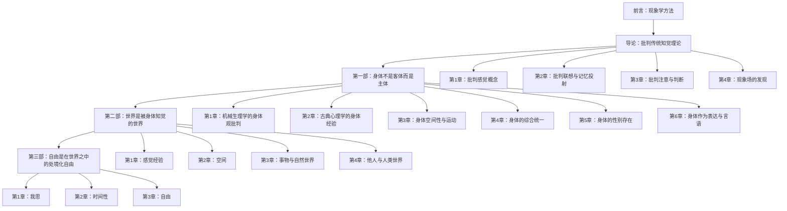

# 00_整体分析报告：梅洛-庞蒂《知觉现象学》(1945)

## 一、著作基本信息

- **书名**：Phénomènologie de la perception（知觉现象学）
- **作者**：Maurice Merleau-Ponty（莫里斯·梅洛-庞蒂，1908-1961）
- **初版**：1945年，Gallimard出版社，巴黎
- **英译**：Colin Smith译，1962年Routledge & Kegan Paul首版，2002年Routledge Classics再版
- **法文原题全称**：Phénomènologie de la perception
- **篇幅**：约54万字（英文版），含前言、导论四章、正文三部共十三章、参考书目与索引

## 二、著作总定位

《知觉现象学》是梅洛-庞蒂的博士主论文，也是其最重要的代表作。该书在胡塞尔现象学与海德格尔存在论的基础上，以"知觉"为核心论域，建立了身体现象学（phenomenology of the body）的完整体系。其根本旨趣在于：**通过回到被科学和反思所遮蔽的前客观的知觉经验，揭示我们与世界之间的原初关联——身体-主体（corps-sujet）在世界之中的"在世存在"（être-au-monde）。**

该书不仅是现象学运动的重要里程碑——将胡塞尔的意识现象学推进为身体现象学，也是二十世纪法国哲学从存在主义向结构主义过渡的关键节点，对福柯、德勒兹、布迪厄等人产生了深远影响。在当代认知科学领域，该书被视为"具身认知"（embodied cognition）理论的哲学先驱。

## 三、全书结构总览

| 结构层次 | 章节 | 核心议题 | 篇幅占比 |
|---------|------|---------|---------|
| **前言** | — | 现象学方法：还原、本质、意向性 | 约3% |
| **导论：传统偏见与返回现象** | 4章 | 批判经验主义与理智主义的知觉理论 | 约14% |
| **第一部：身体** | 6章 | 身体作为在世存在的载体与表达 | 约30% |
| **第二部：被知觉的世界** | 4章 | 感觉、空间、事物、他人 | 约31% |
| **第三部：自为存在与在世存在** | 3章 | 我思、时间性、自由 | 约22% |

## 四、全书核心论证线索

## 五、核心哲学立场

### 5.1 对传统二元论的超越
梅洛-庞蒂的核心策略是揭示经验主义（empiricism）与理智主义（intellectualism）共享同一个偏见：二者都将知觉还原为某种"印象"或"判断"，从而遮蔽了知觉的源初特征。经验主义将知觉视为外部刺激的被动接收，理智主义则将知觉视为意识的构造活动。梅洛-庞蒂证明，**知觉既非纯粹的被动接受，亦非主动的判断，而是身体-主体在世界之中的原初把握**。

### 5.2 身体-主体（le corps-sujet）
全书最核心的概念创新。身体既不是笛卡尔意义上的广延实体（res extensa），也不是单纯的生理机体，而是我们"在世存在"的载体。身体有其自身的意向性（intentionnalité motrice）、自身的综合能力、自身的"我能"（je peux），先于意识的"我思"（je pense）。

### 5.3 知觉的首要性（le primat de la perception）
知觉不是诸多意识行为之一，而是一切意识行为和一切意义的基础。科学的世界是被建构的二阶表达，而知觉的世界是始终"已经在此"的原初土壤。

### 5.4 含混性（l'ambiguïté）
梅洛-庞蒂拒绝将现象还原为清楚分明的要素。知觉世界本质上是含混的：图形与背景不可分割，物体与其境域不可分割，主体与客体不可分割。这种含混不是认识的缺陷，而是存在的根本特征。

## 六、方法论特征

1. **现象学描述而非因果解释**——遵循胡塞尔"回到事物本身"的指令，对知觉经验进行直接描述
2. **病理学案例的经验锚定**——大量使用格式塔心理学实验、神经病理学案例（如幻肢、失认症、施耐德案例）作为现象学分析的入口
3. **对话式论证结构**——每章均以批判经验主义和理智主义的传统观点开篇，在对话中展开自己的立场
4. **跨学科整合**——融汇哲学、心理学（格式塔理论、行为主义、精神分析）、生理学、语言学成果
5. **循环递进**——全书并非线性推进，而是螺旋式深入：同一主题（如身体、知觉、自由）在不同部分反复出现，每次从更高层面展开

## 七、思想史坐标

- **来源**：胡塞尔（生活世界、发生现象学、运作意向性）、海德格尔（在世存在）、格式塔心理学（Köhler, Koffka, Wertheimer）、柏格森、黑格尔、马克思
- **对话对手**：笛卡尔、康德、经验主义（洛克、休谟）、理智主义（莱布尼茨、笛卡尔式反思）、萨特（潜在对话）、实证科学
- **影响**：福柯（身体与权力）、布迪厄（惯习与身体实践）、德勒兹、伊利亚德、当代具身认知科学（Varela, Thompson, Gallagher）、生态心理学（Gibson）

## 八、全书关键实体索引（预概览，详见NN_专项报告）

### 人物实体
L001 胡塞尔（Edmund Husserl, 1859-1938）
L002 海德格尔（Martin Heidegger, 1889-1976）
L003 笛卡尔（René Descartes, 1596-1650）
L004 康德（Immanuel Kant, 1724-1804）
L005 柏格森（Henri Bergson, 1859-1941）
L006 萨特（Jean-Paul Sartre, 1905-1980）
L007 黑格尔（G.W.F. Hegel, 1770-1831）
L008 马克思（Karl Marx, 1818-1883）

### 概念实体
L101 知觉（la perception）
L102 身体-主体（le corps-sujet）
L103 在世存在（être-au-monde / being-in-the-world）
L104 意向性（l'intentionnalité）
L105 现象学还原（la réduction phénoménologique）
L106 现象场（le champ phénoménal）
L107 格式塔（Gestalt / 完形）
L108 身体图式（le schéma corporel）

### 方法论实体
L201 格式塔理论（Gestalttheorie）
L202 发生现象学（genetic phenomenology）
L203 本质还原（eidetic reduction）
L204 运作意向性（fungierende Intentionalität）

### 文本实体
L301 《观念I》（Husserl, Ideen I, 1913）
L302 《存在与时间》（Heidegger, Sein und Zeit, 1927）
L303 《第一哲学沉思集》（Descartes, Meditationes, 1641）
L304 《纯粹理性批判》（Kant, Kritik der reinen Vernunft, 1781/1787）

### 案例/实验实体
L401 缪勒-莱尔错觉（Müller-Lyer illusion）
L402 幻肢现象（le membre fantôme）
L403 施耐德案例（Schneider case, Gelb & Goldstein）
L404 倒视实验（Stratton's inverted vision experiment）

### 学科/流派实体
L501 经验主义（empiricism）
L502 理智主义（intellectualism）
L503 格式塔心理学（Gestalt psychology）
L504 行为主义（behaviorism）

## 九、阅读建议与内部导航

本书应采用"前言→导论→第三部（我思、时间性、自由）→第一部（身体）→第二部（世界）"的回环式阅读策略，这是因为前言对全书方法论做了纲领性阐明，第三部提供了哲学结论的最终形态，第一部和第二部则是具体展开。各章之间具有高度互文性，不应抽取单章孤立阅读。

---

*本整体分析报告完成于2026年8月。以下各章分析报告为独立文档，每份报告对应一章，格式统一为九节结构。*
