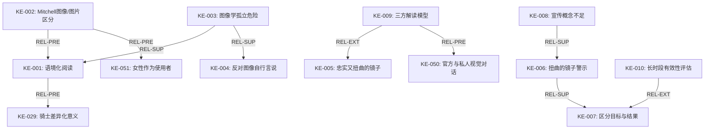
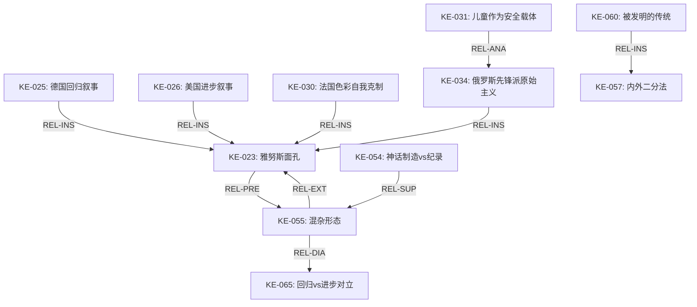
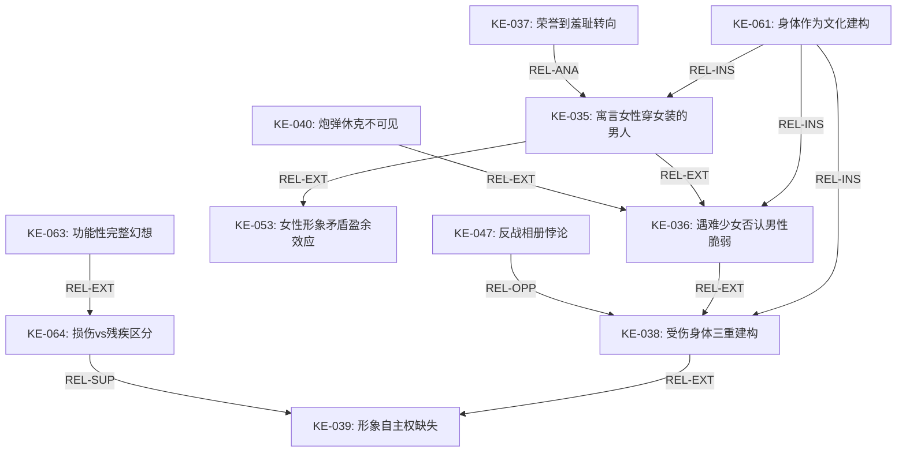
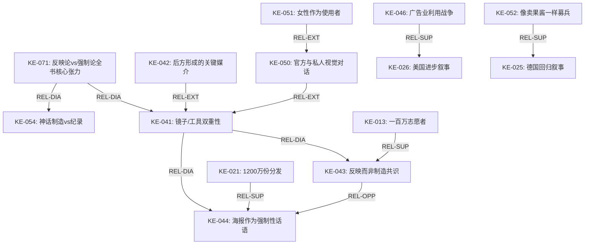

# B0199 James：《Picture this World War I posters and visual culture》

- 语料类型：book
- 材料类型初判：book_or_book_length_source
- clean原文：D:\Design-history-知识库\00-book_clean\James：《Picture this World War I posters and visual culture》.md
- 重复组：DUP0001
- 分析文件数：20
- 总字符数：167617
- 当前核验等级：V2候选；须完成本包语义复核后确认

> 以下内容按原目录文件顺序无损汇集。文件标题是证据边界，不得把不同报告视为独立来源。

---

## FILE `分析报告\00_整体分析报告.md`

- category: `overall_report`
- sha256: `c2eb3d0377784b99df2aea211b2ce39a8354070faa22e60d8e195fc94513a3a2`
- characters: 10545

# 00_整体分析报告：《Picture This: World War I Posters and Visual Culture》全书综合分析

## 一、全书定位与功能

### L### 1.1 学术定位

《Picture This: World War I Posters and Visual Culture》（2009）是由Pearl James主编、内布拉斯加大学出版社出版的学术论文集，属于"战争、社会与军事研究"丛书系列。该论文集汇集了11位来自不同学科（历史学、文学研究、艺术史、美国研究）的学者，对第一次世界大战期间各参战国（英国、法国、德国、俄罗斯、美国）的海报宣传进行了系统的跨学科、跨文化分析。

### L### 1.2 学术功能

本书填补了第一次世界大战海报研究的三个关键空白：（1）从单纯的图像汇编转向深度的语境化阐释，反对让海报图像"自行言说"的做法；（2）建立跨国比较视野，揭示同一图像符号在不同国家文化语境中的根本性差异；（3）将海报视为"物质对象"（picture）和"图像"（image）的双重存在，关注其生产、流通、展示和接受的多维过程。

### L### 1.3 方法论贡献

全书贯穿的核心方法论原则是"语境化的阅读"（contextual reading）：海报必须在更广泛的话语语境中加以解读，包括书面宣传、公共演讲、新闻报道、明信片、私人信件、公共仪式和纪念活动等。正如Stefan Goebel所言，"孤立地审视图像学证据可能具有误导性……视觉图像需要被置于各自的文化环境之中"。

## 二、结构分析

### L### 2.1 总体结构

全书由以下部分构成：
- **绪论**（Introduction）：Pearl James撰写的纲领性导言，阐述研究范式
- **第一部分：战争海报运动与图像——比较阅读**（Part 1）：含第1-4章，跨国比较
- **第二部分：构想国家与想象民族美学**（Part 2）：含第5-8章，单一国家内部的海报与民族认同
- **第三部分：战争语境中的身体形象**（Part 3）：含第9-11章，性别与身体表征
- **尾声**（Epilogue）：Jeffrey T. Schnapp撰写的综合反思

### L### 2.2 章节组织逻辑

全书呈现从"向外看"到"向内看"再到"看身体"的三段式递进逻辑。第一部分以跨国比较建立宏观框架（Winter、Gullace、Goebel、Kazecki/Lieblang），第二部分深入单一国家内部探索民族身份的视觉建构（Levitch、Fogarty、Keene、Nedd），第三部分聚焦于性别和身体如何在海报中被表征和重塑（James、Albrinck、Kinder）。

### L### 2.3 跨章节主题网络

六个核心主题贯穿全书：（1）海报与现代性的矛盾关系——既是现代大众传播工具，又诉诸前现代的传统意象；（2）海报中的"他者"建构——从"匈人"到殖民士兵到性别化的敌人；（3）国家身份的视觉发明——海报作为"想象的共同体"的视觉载体；（4）性别化的战争表征——女性身体作为国家隐喻，男性气质作为招募工具；（5）海报的双重性——作为反映公众情感的"镜子"与塑造公众情感的"工具"；（6）海报的迷思制造功能——如何将工业化屠杀转化为可接受的叙事。

## 三、内容分析——核心论题与关键论点案例

### L### 3.1 核心论题一：海报与"全面战争"的诞生

Pearl James在绪论中确立了全书的元论题：一战海报既是现代战争创新（军事技术部署与"后方"发展）的"标志"也是"工具"。海报不仅反映了"全面战争"的到来——即战争不再仅仅是士兵的事，而是动员了全体男女老少——而且构成了"后方"得以形成的关键媒介："正是在观看海报的过程中，公民学会了将自己视为后方的一员。"

### L### 3.2 核心论题二：图像的跨国流通与"翻译"中的意义转换

多个章节共同推进这一论点。Gullace追踪"匈人"形象从英国经澳大利亚到美国的转变，发现距离战场越远的国家，海报中的暴力渲染越强烈。Goebel揭示德国海报中的"铁拳"骑士形象在德国本土具有"安慰性力量"（象征钢铁般的决心），但在国外被解读为德国野蛮主义的证据——"同样的图像学承载了根本不同的意义"。Kazecki和Lieblang进一步论证，过分强调"普遍性"将导致错失海报对其当代受众最相关的意义。

### L### 3.3 核心论题三：海报作为民族身份的视觉建构场所

第二部分各章展示了海报如何在战争压力下成为创造和争论民族身份的关键场域。Levitch揭示法国女学生海报如何被建构为"法兰西种族"艺术本能的证据；Fogarty分析了法兰西殖民理想与现实种族等级之间的张力；Keene表明非裔美国人如何在官方宣传之外创造自己的"种族骄傲"图像；Nedd则追踪俄罗斯先锋派如何挪用"鲁波克"民间艺术来界定"俄罗斯性"。

### L### 3.4 核心论题四：海报中的性别与身体政治

第三部分集中分析了海报如何表征和重塑性别身份。Pearl James论证美国海报中的女性形象"自相矛盾到极点"——从象征国家的寓言女神到被性化的商品再到穿制服的女工——这种矛盾本身暗示了"女人"范畴的不稳定性和可塑性。Albrinck分析了英国招募海报如何从诉诸荣誉转向利用羞耻和胁迫。Kinder则揭示了受伤士兵的身体如何在视觉文化中被三重建构：情感化的受害者（红十字会海报）、独立的生产者（康复摄影）、恐怖的反战象征（反战相册）。

### L### 3.5 关键案例

- **"基钦纳需要你"海报**：这一标志性海报在全书多处被讨论，成为关于海报"迷思"与"历史"之争的核心案例。Ginzburg认为其力量来自多种艺术传统，而Hiley则论证其标志性地位来自战后"反讽性使用"。
- **"摧毁这疯狂的野兽"**：Hopps将德国人描绘为大猩猩的海报，Gullace分析其结合了种族恐惧、性威胁和进化论倒退的复杂修辞。
- **法国女学生保护资源海报系列**：Levitch展示这些色彩明亮、构图天真、由13-16岁女生创作的海报如何打破了法国战争海报的灰暗美学传统。

## 四、逻辑梳理——论证链条与因果转折

### L### 4.1 全书论证链条

全书的论证链条可以分为三个环环相扣的层次：

**第一层（方法论）：** 海报不能被孤立地当作艺术品来解读 → 必须将其置于广泛的话语语境中 → 需要跨学科、跨国家、跨媒介的比较方法。

**第二层（历史分析）：** 一战海报继承了19世纪的广告传统和艺术形式 → 但在战争的特殊压力下发生了根本性转变 → 转变既体现在海报的生产和传播方式，也体现在其内容和接受方式 → 转变的成果在战后继续发挥作用或遭到质疑。

**第三层（理论反思）：** 海报既是"镜子"（反映既有观念）也是"工具"（塑造新观念） → 海报同时面向过去和未来（"雅努斯面孔"） → 海报既是现代性的一部分（大众传播），又诉诸前现代的传统（骑士精神、民间艺术） → 这种矛盾性恰恰是海报的独特力量所在。

### L### 4.2 关键因果转折点

1. **从自愿到强制**（英国案例）：Winter论证的1914-15年的"团结符号学" → Albrinck论证的1915年后的羞耻与胁迫修辞，反映了志愿兵源枯竭的因果链条。

2. **从复兴到崩溃**（俄罗斯案例）：Nedd追踪了1914年8月的"爱国爆发" → 军事失败和社会解体导致鲁波克海报被视为"过分夸耀"而迅速失宠的转折。

3. **从战时工具到战后记忆**：Kinder的三个阶段（红十字会情感化图像 → 康复摄影 → 反战相册）构成了从"使战争可接受"到"使战争可憎"的历史转折。

## 五、材料使用方式

### L### 5.1 一手材料类型

全书使用的一手材料极为广泛，主要包括六大类：
（1）**海报原作**：来自胡佛研究所、帝国战争博物馆、国会图书馆等多个档案馆；
（2）**政府档案**：包括英国战争部文件、美国食品管理局档案、法国军事档案、美国公共信息委员会记录；
（3）**行业期刊**：如《Das Plakat》（德国海报杂志）、美国广告行业出版物；
（4）**报刊报道**：从主流报纸到黑人报刊到讽刺杂志的广泛覆盖面；
（5）**私人文献**：回忆录、私人信件、未出版的手稿；
（6）**其他视觉材料**：照片、明信片、电影、展览目录。

### L### 5.2 材料组织方式

各章作者展示了三种典型的材料组织策略：（1）**以海报为中心辐射**——从特定海报出发，向外辐射到其生产、流通和接受的整个语境（如Kinder对"我们需要你"的分析）；（2）**以主题为线索汇集**——围绕特定主题（如殖民帝国、女性气质）汇集不同来源的海报和相关材料（如Fogarty）；（3）**以比较为框架对列**——将不同国家的同类海报并置分析（如Goebel、Kazecki/Lieblang）。

### L### 5.3 材料批评意识

全书作者对海报作为历史证据的局限性保持高度自觉。多处引用Marchand对广告研究的警示："广告折射的是公众的愿望而非现实环境，是大众幻想而非社会实在。"Fogarty明确指出"没有测量工具"衡量海报的有效性。Albrinck强调应区分"海报运动的目标与其结果"——海报提出的论证不应被视为其被接受的证据。

## 六、论辩与阐述方法

### L### 6.1 跨学科方法

全书体现了典型的跨学科研究路径：艺术史的图像学分析（Goebel、Nedd）、文学研究的话语分析和叙事学方法（Winter、Albrinck）、社会史和文化史的经验研究（Keene、Fogarty）、性别研究的理论工具（James）、残疾研究的理论框架（Kinder）。

### L### 6.2 比较方法

比较方法是全书的结构性原则。比较在两个层面展开：（1）**国家间比较**——英/德（Goebel）、德/美（Kazecki/Lieblang）、英/美/澳（Gullace）；（2）**群体间比较**——官方/民间（Keene）、成人/儿童（Levitch）、男性/女性（James、Albrinck）。

### L### 6.3 论辩策略

各章作者采用了以下核心论辩策略：（1）**反直觉论断**——如Winter的"海报反映而非制造了共识"挑战了海报作为宣传工具制造同意的常识；（2）**概念对偶**——Goebel的"骑士vs铁战士"、Kazecki/Lieblang的"回归vs进步"等二元框架引导论证；（3）**微观案例与宏观结论的结合**——每个章节都通过对具体海报的细致解读来支持更大的历史或理论主张；（4）**接受研究**——如Keene追踪同一图像在不同受众中的不同解读，展示了"意义"的生产和争夺过程。

## 七、语言文风——原文摘录与L###分析

### L### 7.1 整体文风特征

全书以学术英语写成，但不同章节因作者学科背景和写作风格不同而有显著差异。共同特征包括：高度的术语自觉（频繁定义和辨析关键概念）、丰富的直接引语（大量引用当时的海报表述和批评）、密集的脚注（学术性的充分体现）。部分章节（如Winter）具有论辩性甚至雄辩性，而另一些章节（如Fogarty）较为平实、描述性更强。

### L### 7.2 原文摘录与分析

**摘录一（Pearl James，绪论）：**
> "Posters were 'the medium for the construction of a pictorial rhetoric of . . . national identities'—identities upon which the waging of war hinged. They not only functioned as illustrations of the war in popular understanding but also had an impact on the facts of the war, including its duration and its reach."

L### 分析：James的写作风格精准而有力。"hinged"一词暗示了民族身份对战争进行的基石性作用，"not only...but also"结构确立了海报从"反映"到"影响"的双重功能。

**摘录二（Jay Winter，第1章）：**
> "In wartime, images overwhelm words. This simple fact dominated the most powerful and widely disseminated propaganda campaign to date."

L### 分析：Winter开篇即用高度凝练的判断句奠定全章基调，体现了其作为资深历史学家的自信和文风上的直接性。

**摘录三（Nicoletta Gullace，第2章）：**
> "The term Hun—long used to denote those engaged in savage or brutal behavior—emerged as a popular and even casual epithet for the Germans during World War I. While the term could be used either facetiously or ominously, it became iconographic shorthand, evoking themes of racial 'otherness' and primitive atavism that recast a modern European adversary as something far more menacing."

L### 分析：Gullace的写作以清晰的历史叙事见长，"iconographic shorthand"这一短语精准地概括了视觉宣传中图像的直接可辨识性。

**摘录四（Stefan Goebel，第3章）：**
> "Iconographic evidence examined in isolation can be misleading. . . . Visual images . . . need to be located in their respective cultural settings."

L### 分析：Goebel的表述简洁而具有方法论宣言的性质。这句话可以被视为全书共同的方法论信条。

**摘录五（Kazecki & Lieblang，第4章）：**
> "Should an army be raised by the same means as customers for jam?"

L### 分析：作者引用的这句话极富表现力，生动地呈现了德国军事精英对广告式招募手段的蔑视态度。

## 八、实体清单——六类实体总览

### L### 8.1 人物/学者类（≥3）

| 序号 | 名称 | 角色/贡献 |
|------|------|-----------|
| 1 | Pearl James | 主编，撰写绪论和第9章，研究美国海报中的女性形象 |
| 2 | Jay Winter | 撰写第1章，耶鲁大学历史学教授，一战文化史权威 |
| 3 | Maurice Rickards | 《一战海报》（1968）作者，建立了海报研究的基础框架 |
| 4 | Paul Fussell | 《大战与现代记忆》作者，影响了全书对战争"反讽"叙事的理解 |
| 5 | Nicoletta F. Gullace | 撰写第2章，研究"匈人"形象的跨国传播 |
| 6 | Stefan Goebel | 撰写第3章，比较英德骑士形象的不同文化意义 |
| 7 | Jeffrey T. Schnapp | 撰写尾声，斯坦福大学教授，将海报置于更长的媒介史脉络中 |
| 8 | John M. Kinder | 撰写第11章，从残疾研究视角分析受伤士兵的身体图像 |

### L### 8.2 海报作品/图像类（≥3）

| 序号 | 名称 | 创作者 | 国家 | 年代 |
|------|------|--------|------|------|
| 1 | "Kitchener Wants You"（基钦纳需要你） | Alfred Leete | 英国 | 1914 |
| 2 | "Destroy This Mad Brute"（摧毁这疯狂的野兽） | H.R. Hopps | 美国 | 1917 |
| 3 | "Help Us Win! Subscribe to the War Loan"（帮我们赢！认购战争贷款） | Fritz Erler | 德国 | 1917 |
| 4 | "Gee!! I Wish I Were a Man"（天啊！我希望我是个男人） | Howard Chandler Christy | 美国 | 1918 |
| 5 | "Daddy, what did you do in the Great War?"（爸爸，你在大战中做了什么？） | Savile Lumley | 英国 | 1915 |
| 6 | "Beat Back the Hun with Liberty Bonds"（用自由债券击退匈人） | Frederick Strothmann | 美国 | 1917-18 |
| 7 | "A Sausage Maker came to Lodz"（香肠师傅来到罗兹） | Kazimir Malevich | 俄国 | 1914 |
| 8 | "?"（问号） | Norman Lindsay | 澳大利亚 | 1918 |

### L### 8.3 机构/组织类（≥3）

| 序号 | 名称 | 国家 | 功能 |
|------|------|------|------|
| 1 | Committee on Public Information (CPI) | 美国 | 战时宣传总署，分管公共信息 |
| 2 | Parliamentary Recruiting Committee (PRC) | 英国 | 负责志愿兵招募的跨党派委员会 |
| 3 | Segodniashnii Lubok（今日鲁波克） | 俄国 | 莫斯科出版社，出版先锋派战时海报 |
| 4 | U.S. Food Administration | 美国 | 负责食品保护和分配宣传 |
| 5 | American Red Cross | 美国 | 红十字会，其海报广泛使用受伤士兵图像 |
| 6 | Institute for Crippled and Disabled Men | 美国 | 推动伤兵康复和职业培训 |
| 7 | Imperial War Museum | 英国 | 一战爆发后开始系统收集战争海报 |
| 8 | Division of Pictorial Publicity (DPP) | 美国 | CPI下属海报生产机构 |

### L### 8.4 概念/术语类（≥3）

| 序号 | 术语 | 定义 |
|------|------|------|
| 1 | home front（后方） | 战争不再是纯军事领域，平民生活被全面军事化 |
| 2 | total war（总体战） | 动员全体人口、所有资源的战争形态 |
| 3 | Lost Generation（迷惘的一代） | 指一战中牺牲和幸存的一代，Winter论证其已成为英国民族身份的核心隐喻 |
| 4 | Materialschlacht（物资战） | 德文术语，指工业化大规模战争的物质消耗战 |
| 5 | Hun（匈人） | 一战中协约国对德国人的贬称，源自德皇威廉二世1900年的演讲 |
| 6 | image vs. picture（图像vs.图片） | 源自W.J.T. Mitchell的概念区分："图片"是物质对象，"图像"是其承载的视觉内容 |
| 7 | union sacrée（神圣同盟） | 法国战时搁置党派分歧、共赴国难的政治口号 |
| 8 | assimilation（同化） | 法国殖民意识形态的核心概念，认为殖民目标是"提升"被殖民者至法国文明水平 |

### L### 8.5 事件/战役类（≥3）

| 序号 | 事件/战役 | 时间 | 意义 |
|------|-----------|------|------|
| 1 | 索姆河战役（Battle of the Somme） | 1916年7-11月 | 超过一百万人伤亡，成为一战屠杀的象征 |
| 2 | 凡尔登战役（Battle of Verdun） | 1916年2-12月 | 德法之间最长的战役，重塑了"忍耐"一词的含义 |
| 3 | 卢西塔尼亚号沉没 | 1915年5月 | 德国潜艇击沉英国客轮，成为美国参战的重要诱因 |
| 4 | 卢万图书馆被焚 | 1914年8月 | 德国军队焚毁比利时卢万大学图书馆，成为"文化破坏"宣传的核心案例 |
| 5 | 美国参战 | 1917年4月 | 美国加入协约国一方，改变了战争的力量平衡 |
| 6 | 斯卡伯勒炮击 | 1914年12月 | 德国海军炮击英国沿海城镇，成为英国"记住斯卡伯勒"招募海报的主题 |

### L### 8.6 文献/出版物类（≥3）

| 序号 | 文献 | 作者/编者 | 年份 | 学术地位 |
|------|------|-----------|------|----------|
| 1 | Posters of the First World War | Maurice Rickards | 1968 | 开创性的一战海报汇编 |
| 2 | The Great War and Modern Memory | Paul Fussell | 1975 | 一战文学与文化记忆的经典研究 |
| 3 | Seduction or Instruction? | James Aulich & John Hewitt | 2007 | 对英国和欧洲一战海报的最新学术研究 |
| 4 | Persuasive Images | Peter Paret等 | 1992 | 胡佛研究所海报档案的重要出版物 |
| 5 | Wake Up, America! | Walton H. Rawls | 1988 | 美国一战海报的综合研究 |
| 6 | War against War! | Ernst Friedrich | 1924 | 反战摄影集，以伤兵图像控诉战争的残酷 |
| 7 | The Horror of It | Frederick A. Barber | 1932 | 美国版反战摄影集 |
| 8 | A War Imagined | Samuel Hynes | 1990 | 一战与英国文化的全面研究 |

## 九、全书与其他学术领域的关联

### L### 9.1 与一战史研究的关系

本书属于一战研究"文化转向"的产物。传统的一战史侧重于军事行动、外交谈判和政治决策，而本书关注的是一战作为"文化经验"的维度。它与Fussell（1975）、Hynes（1990）、Winter（1995）等人的研究一脉相承，但将注意力从经典文学文本转向了大众视觉文化产品。

### L### 9.2 与视觉文化研究的关系

本书将Mitchell的"图像转向"（pictorial turn）理论应用于一战研究。海报被当作需要"阅读"的文本，需要解码的视觉修辞。同时，作者们避免了对图像进行纯形式主义分析，而是坚持图像必须在其全部的物质和社会语境中被理解。

### L### 9.3 与宣传研究的关系

本书试图超越简单地将一战海报视为"宣传"（propaganda）的框架。正如Schnapp在尾声中指出的，"宣传"的概念无法捕捉这些作品中的细微差别、暧昧性甚至艺术性。全书贯穿的是一种反还原论的冲动：海报不仅仅是操纵工具，它们也是复杂的文化艺术品。

### L### 9.4 全书的内在统一性

尽管作者们来自不同学科、使用不同方法、关注不同国家，但全书展示了高度的内在统一性：所有章节都承诺将海报置于语境中解读；都认识到海报既反映又塑造公众情感；都关注海报作为物质对象的生产、流通和展示过程；都承认海报意义的多元性和不稳定性；都在一定程度上揭示了海报如何"使战争可接受"或"使战争可质疑"。

---

*报告生成日期：2026-08-05*
*分析对象：Pearl James编，《Picture This: World War I Posters and Visual Culture》（University of Nebraska Press, 2009）*


---

## FILE `分析报告\01_绪论_Reading World War I Posters_Pearl James.md`

- category: `chapter_or_full_report`
- sha256: `d7e5182ebb6fa2b8ed1112bcc7dd02c7c612e33787f960edd90b75f87490dead`
- characters: 7113

# 01_绪论分析报告：Reading World War I Posters（阅读一战海报）

**作者：Pearl James**

## 一、章节定位与功能

### L### 1.1 全书定位

本章是由主编Pearl James撰写的纲领性导言（Introduction: Reading World War I Posters），篇幅约8000英文词，是全书的"理论蓝图"和"方法论宣言"。它设定了全书的分析框架、核心概念、关键问题和学术定位。

### L### 1.2 章节功能

本章承担了五重功能：（1）界定研究对象——一战海报作为"现代战争创新"的标志和工具；（2）梳理海报媒介的历史谱系——从石版印刷到彩色石印到"黄金时代"；（3）建立核心分析方法论——Mitchell的"图像/图片"区分、语境化阅读、跨学科路径；（4）预览全书各章的论证要点——帮助读者理解各章的学术贡献及其相互关系；（5）提出全书的核心命题——一战海报是"雅努斯面孔"的媒介，既面向19世纪的帝国过去又面向20世纪的官僚民族国家未来。

## 二、结构分析

### L### 2.1 章节内部结构

本章分为七个层次分明的部分：
1. **开篇定位**（1-2段）：一战作为"第一次现代战争"和"第一次总体战"的双重性质
2. **海报与现代性的悖论**（3-5段）：海报既是现代大众传播工具，又诉诸传统意象
3. **海报媒介史**（6-7段）：从石版术到战争海报的技术和艺术演变
4. **海报的分类学**（8-10段）："公告/海报"的区分被战争模糊化
5. **海报的"图片/图像"双重性**（11-14段）：Mitchell理论的运用，爱荷华土豆展的案例
6. **方法论主张**（15-21段）：语境化阅读、跨学科方法、接受的困境
7. **各章预览**（22-34段）：按三部分结构逐一介绍各章论点和相互关系

### L### 2.2 论证推进方式

James以一种螺旋上升的方式推进论证：从具体的历史事实出发（一战的性质）→ 引入分析对象（海报）→ 揭示对象的复杂性（悖论）→ 提供历史背景（媒介史）→ 建立理论框架（Mitchell的区分）→ 阐明方法论原则（语境化阅读）→ 展示研究成果（各章预览）。这种结构使读者从具体到抽象再回到具体，逐步建立对全书的整体认知。

## 三、内容分析——核心论题与关键论点案例

### L### 3.1 核心论题：海报的"雅努斯面孔"

James的核心论点是：一战海报具有"雅努斯面孔"（Janus-faced），既回顾19世纪的帝国和传统，又前瞻20世纪的官僚化民族国家和现代大众传播。"Mass-produced, full-color, large-format war posters are at the crux of this contradiction."海报表征着"传统与现代性的混淆"（the period's confusion of traditions and modernity）。

### L### 3.2 关键论点一：Mitchell的"图像/图片"概念区分

James引入W.J.T. Mitchell的区分作为全书的方法论基石："图片是物质对象——一个你可以烧掉或打破[或悬挂]的东西。图像是出现在图片中的东西，是在图片被销毁后幸存下来的东西——在记忆中、在叙事中、在其他媒体的复制和痕迹中。"这一区分使研究者能够同时关注海报的两个维度：作为可被触摸、悬挂、毁坏的物质实体，和作为可被复制、挪用、再语境化的视觉内容。

### L### 3.3 关键论点二：海报同时反映和塑造公众态度

James提出了一个关键的方法论两难：海报究竟是反映了公众已有的观点，还是试图塑造公众的新观点？她的回答是两者皆有——这是一个无法简单二分的连续体。Winter在第一章主张海报"反映"了共识，而Albrinck在第十章则强调海报作为"强制工具"的功能。James刻意将这两种立场都纳入全书，以展示海报的多重功能。

### L### 3.4 关键案例：爱荷华马科奇塔的土豆展览照片

James用整整两段篇幅分析了一张爱荷华小城杂货店的橱窗照片（图1）。这张照片显示了批量生产的食品管理局海报与手工绘制的"马科奇塔"本地化海报并置展示。James的解读层层深入：首先注意到店主"Staack and Luckiesh"的德国姓氏与美国中西部的反德暴力之间的关联；然后分析批量生产的标准化海报如何被本地化的创意展示所转化（"Spud the Kaiser"的妙语）；最后将这一具体案例提升为方法论原则——海报必须同时作为"图像"（可复制的视觉模式）和"图片"（特定时空中作为物质对象的存在）来研究。

## 四、逻辑梳理——论证链条与因果转折

### L### 4.1 主论证链条

一战是第一次现代总体战 → 现代战争需要大规模动员平民 → 海报是动员平民的关键媒介 → 但海报表征了现代性与传统性的矛盾统一 → 理解这种矛盾需要新的方法论工具（Mitchell的区分、语境化阅读） → 全书各章即是这种新方法论的实践。

### L### 4.2 关键因果环节

**因果环节1：广告业与政府宣传的关系**
James指出，海报工业利用战争机会展示其有效性，既证明了爱国精神又确立了行业合法性。美国海报广告协会的行业刊物宣称："海报的空前使用……如此有力地将该媒介的力量印刻在世界人口之上，以至于所有可能存在的关于其效力的怀疑都被永久地消除了。"这是广告业以国家利益为名实现自身利益扩张的典型案例。

**因果环节2：接受的困境**
James提出了一个根本性的方法论难题——我们无法精确知道海报的接受情况。引用Marchand对广告研究的警示："如果销售额在特定广告活动期间增长，其他因素——商品分发、分销、经济条件或社会时尚——可能触发了这种反应。"但James论证这不意味着放弃研究，而是需要更精细的方法——寻找"模式"（patterns）和"重复的主题"（repeated themes）。

## 五、材料使用方式

### L### 5.1 材料类型

本章使用的一手材料包括：（1）美国国家档案馆的摄影档案（爱荷华土豆展览、自行车船、弗拉格招募展示等）；（2）海报行业出版物（《海报：战争纪念版》）；（3）同时代的海报设计手册（Price和Brown的《如何制作有冲击力的爱国海报》）；（4）早期海报研究著作（Hardie和Sabin的《战争海报1914-1919》、Rickards的《一战海报》）。

### L### 5.2 材料使用策略

James的材料使用展示了两种典型策略：（1）将档案照片作为"解读难题"——不是简单使用照片作为插图，而是将每张照片作为一个需要分析的视觉文本；（2）将同时代的文本作为"分析的对话者"——引用Price和Brown或Hardie和Sabin的原文，将同时代人的观点纳入学术对话。

## 六、论辩与阐述方法

### L### 6.1 反二元对立的辩证思维

James在整个绪论中展示了一种一贯的反二元对立思维：不简单地宣称海报是"艺术"或"宣传"、是"现代"或"传统"、是"反映"或"塑造"。相反，她坚持在这些二元对立之间建立辩证关系。这种思维模式为全书设定了基调。

### L### 6.2 以问题引导论证

James善于通过提出问题来组织论证。例如："How are we to reckon with the various elements, both visual and material, at work here?" "How did such displays influence viewers' responses to posters?" 这些问题不是修辞性的，而是真正推动论证向更深层次发展。

## 七、语言文风——原文摘录与L###分析

### L### 7.1 原文摘录一

> "These Janus-faced images look back to nineteenth-century empires and forward to modern bureaucratic nation-states."

L### 分析："Janus-faced"是本章最核心的修辞隐喻，以罗马两面神雅努斯为喻，精准概括了全书的核心命题——海报作为时间上的两面体。

### L### 7.2 原文摘录二

> "Posters need to be read not just visually but within a broader discursive context."

L### 分析：此句以最简洁的方式阐述了全书的方法论原则。"not just...but"结构为方法论划定了"最低要求"和"更高要求"。

### L### 7.3 原文摘录三

> "Posters belong to something of a twilight zone of evidence."

L### 分析："twilight zone"（暮光地带）这个比喻极为到位，表明海报证据在方法论上的模糊状态——既非纯艺术也非纯文本，既非纯官方也非纯民间，既非纯物质也非纯图像。

## 八、实体清单——六类实体

### L### 8.1 人物/学者类（≥3）

| 序号 | 名称 | 角色 |
|------|------|------|
| 1 | W.J.T. Mitchell | 芝加哥大学教授，"图像/图片"区分概念的提出者 |
| 2 | Aloys Senefelder | 石版印刷术的发明者（1790年代） |
| 3 | Godefroi Engelmann | 彩色石印术的发明者（1837年） |
| 4 | Jules Chéret | 法国海报"黄金时代"（1880-1900）的代表艺术家 |
| 5 | Roland Marchand | 广告史学者，其"扭曲的镜子"概念被James引用 |
| 6 | Susan Sontag | 其对海报"引用"性质的论述被James引为重要参考 |
| 7 | Paul Fussell | 《大战与现代记忆》作者，其"流行纯真"概念被引用 |
| 8 | Carlo Ginzburg | 对"基钦纳需要你"海报进行图像学分析 |

### L### 8.2 海报作品/图像类（≥3）

| 序号 | 名称 | 说明 |
|------|------|------|
| 1 | "Kitchener Wants You" | 基于Alfred Leete设计，成为战争海报的原型图像 |
| 2 | "Will you help the Women of France?" | Edward Penfield创作，基于Alonso Taylor照片 |
| 3 | 爱荷华马科奇塔"Potatriot"展示 | 商店橱窗展览，结合批量印刷和手工绘制的海报 |
| 4 | "Tell it to the Marines" | James Montgomery Flagg在纽约公共图书馆的实物大小展示 |
| 5 | 第四次自由贷款钟楼展示 | 西雅图街头的海报与表演结合 |
| 6 | 新奥尔良食品管理局广告牌 | 自由贷款游行中的海报展示 |

### L### 8.3 机构/组织类（≥3）

| 序号 | 名称 | 功能 |
|------|------|------|
| 1 | Poster Advertising Association | 美国海报广告行业协会，战时与政府合作 |
| 2 | U.S. Food Administration | 美国食品管理局，负责食品保护宣传 |
| 3 | Imperial War Museum (London) | 英国帝国战争博物馆，最早系统收藏战争海报的机构 |
| 4 | Liberty Memorial Association | 美国一战官方纪念馆，建馆之初即收藏海报 |
| 5 | National Committee of Patriotic Societies | 美国爱国社团全国委员会，出版海报设计手册 |
| 6 | Hoover Institution (Stanford) | 斯坦福大学胡佛研究所，拥有大量海报档案 |

### L### 8.4 概念/术语类（≥3）

| 序号 | 术语 | 定义 |
|------|------|------|
| 1 | image vs. picture | Mitchell的概念区分：图像是视觉内容，图片是物质载体 |
| 2 | home front | "后方"——战争不再局限于前线，平民生活也被军事化 |
| 3 | total war | "总体战"——动员全体人口的工业化和大众化战争形态 |
| 4 | Janus-faced | "雅努斯面孔"——海报同时面向过去和未来 |
| 5 | quotation（引用） | Sontag认为海报的核心视觉语言特征是"引用" |
| 6 | twilight zone of evidence | "证据的暮光地带"——海报作为历史证据的特殊性质 |
| 7 | Zerrspeigel | Marchand的"扭曲的镜子"概念：广告反映愿望而非现实 |

### L### 8.5 事件/技术类（≥3）

| 序号 | 事件/技术 | 说明 |
|------|-----------|------|
| 1 | 石版印刷术发明 | Aloys Senefelder于1790年代发明 |
| 2 | 彩色石印术发明 | Godefroi Engelmann于1837年获得专利 |
| 3 | 法国海报"黄金时代" | 1880-1900年间，Chéret、Toulouse-Lautrec等人将海报提升为艺术形式 |
| 4 | 英国1890年代海报争议 | 伦敦对户外广告的侵入性和粗俗性的担忧 |

### L### 8.6 文献/出版物类（≥3）

| 序号 | 文献 | 作者/编者 | 年份 |
|------|------|-----------|------|
| 1 | Posters of the First World War | Maurice Rickards | 1968 |
| 2 | War Posters Issued by Belligerent and Neutral Nations 1914-1919 | Martin Hardie & Arthur K. Sabin | 1920 |
| 3 | Advertising the American Dream | Roland Marchand | 1985 |
| 4 | Seduction or Instruction? | James Aulich & John Hewitt | 2007 |
| 5 | The Poster: A Worldwide Survey and History | Alain Weill | 1985 |
| 6 | Wake Up, America! | Walton H. Rawls | 1988 |
| 7 | How to Put in Patriotic Posters the Stuff That Makes People Stop—Look—Act! | Matlock Price & Horace Brown | 约1917-18 |

## 九、与前后章关联

### L### 9.1 与全书各章的关系

本章作为绪论，与全书各章具有"母体"关系。James在预览各章贡献时做了两项重要工作：（1）为每一章提供"命题标签"——如将Winter的论证概括为"海报反映而非制造了共识"，将Albrinck的论证描述为"海报作为强制工具"；（2）建立了各章之间的对话关系——如指出Winter和Albrinck对英国海报得出不同结论体现了方法论的张力，暗示读者应以比较和对话的方式阅读全书。

### L### 9.2 理论预设的传递

绪论中的几个核心概念预设被后续各章广泛接受和运用：（1）Mitchell的图像/图片区分；（2）语境化阅读的方法论承诺；（3）"雅努斯面孔"的矛盾统一框架；（4）对海报作为历史"证据"的谨慎态度。这些预设构成了全书的"理论基础设施"。

### L### 9.3 开放性问题的提出

James在绪论结尾没有给出确定的答案，而是提出了一个开放性的问题框架："posters did not show the war's human costs"（海报没有展示战争的人力代价）。这一观察成为全书的一个重要主题线索——从Kinder的第11章直接回应，到各章对"海报如何使暴力可接受或不可见"的不同揭示。

---

*分析日期：2026-08-05*


---

## FILE `分析报告\02_第1章_Imaginings of War_Jay Winter.md`

- category: `chapter_or_full_report`
- sha256: `c0f77573143979e66d207e489040bd6864859c2a3c169de8aa349da4bea47938`
- characters: 6798

# 02_第1章分析报告：Imaginings of War: Posters and the Shadow of the Lost Generation（战争的想象：海报与迷惘一代的阴影）

**作者：Jay Winter**

## 一、章节定位与功能

### L### 1.1 全书定位

本章是全书正文的开篇（Chapter 1），由一战文化史领域最具影响力的学者之一Jay Winter撰写。作为全书的"破题之章"，它以强烈的论辩性立场提出核心命题：在战时，图像压倒文字（"In wartime, images overwhelm words"）。Winter将海报置于"战争想象"的广阔历史谱系中，通过追踪战前、战时和战后"战争表征"的演变，揭示了海报如何从"团结符号"转变为"迷惘一代"的文化遗迹。

### L### 1.2 章节功能

本章承担三重功能：（1）建立全书首章的"基调"——论辩性而非纯粹描述性；（2）提供英国案例的历史纵深——将海报置于英国流行文化、帝国传统和阶级社会的多重视角下；（3）引入"接受史"视角——关注海报的"生命史"（life history），即其意义如何在战后被不断重新诠释。

## 二、结构分析

### L### 2.1 章节内部结构

本章分为五个部分，呈现清晰的历史时间线：
1. **开篇论断**（1-3段）：图像压倒文字；海报作为"第二层次记忆"的载体
2. **战前战争表征**（4-8段）：英国的非军国主义传统、基普林式的个人英雄主义、斯科特南极探险作为"战前战士"的原型
3. **战时想象**（9-25段）：分为三个子层——（a）海报作为"团结符号学"；（b）前线与后方的联系；（c）电影作为战争表征的竞争者
4. **战后表征的转变**（26-36段）：战争诗歌、法国与德国的不同轨迹、"迷惘一代"一词的三层含义
5. **结语**（37-38段）：Walter Benjamin的引用；海报作为"消失的世界"的痕迹

### L### 2.2 历史叙事的主线

Winter构建了一条从战前"纯真"到战时"共识"再到战后"幻灭"的叙事主线。但这条线不是单线性的——Winter反复强调并存和矛盾。他指出电影的"真实效果"与海报的"风格化"表征并存，反战的诗歌与保存"旧谎言"的叙事并存。

## 三、内容分析——核心论题与关键论点案例

### L### 3.1 核心论题一："团结符号学"——海报反映而非制造共识

Winter的全章核心论点是："Posters were, I believe, a reflection rather than a cause of national unity in the First World War."（海报是一战中民族统一的反映而非原因。）这一论点直接挑战了将海报理解为宣传工具制造同意的常识性假设。Winter的论据是：1914年8月至1915年1月间英国有一百万人志愿参军（另有二百万人于1915年入伍），这一大规模志愿动员源于德国军队驻扎在英吉利海峡对岸所构成的"明确且当前的威胁"，而非海报的说服力。

### L### 3.2 关键论点二：海报作为"地方性"的视觉化

Winter敏锐地指出，英国海报中的"国家"实际上被编码为极具地方性的意象。海报展现的是"一个非常地方化的生活方式，一个由酒馆和俱乐部以及大量协会构成的生活"——这些"怪癖和特质"定义了英国性。海报的功能是将这些"早已存在且强大的共识"加以视觉化。"Your Country's Call"（图7）展示了一个苏格兰士兵指着一幅田园诗般的村庄景象，背景中隐约可见德国的威胁。

### L### 3.3 关键论点三：海报与广告的"劳动分工"

Winter提出一个重要的区分：招募海报（1914-16）回避了阶级差异——描绘"无阶级"的统一英国形象；而商业广告则利用了阶级差异——将日常商品置于战时语境中，自然化了战争。这种非正式的"劳动分工"意味着研究者不能在忽略了招募海报的"无阶级"编码后就认为战时图像整体上对不平等视而不见。

### L### 3.4 关键论点四："迷惘一代"的三层含义

Winter将"迷惘一代"（Lost Generation）这个术语的历史演变分为三层：
- **第一层**（战后初期）：与死者纪念相关——生者对死者负有不可偿还的债务；
- **第二层**（两次大战之间）：获得了苦涩的意味——幸存者对战后世界的失望，历史"前进到更好未来"的感觉得到丧失；
- **第三层**（当代）：成为一般性的隐喻——"迷惘一代"使后来者能够将一战视为"宏大叙事崩溃的时刻"。

## 四、逻辑梳理——论证链条与因果转折

### L### 4.1 主论证链条

英国在1914年没有大陆式的军国主义传统 → 但志愿者大量涌现 → 海报表征了这一既有的共识（而非制造了它） → 海报通过将国家呈现为"地方性"而赋权于这种共识 → 战时的其他视觉表征（电影）开始瓦解这种共识 → 战后海报的"团结符号学"被"迷惘一代"话语所取代 → 我们今天通过"迷惘一代"的滤镜回望这些海报，从而误解了它们对当时观众的意义。

### L### 4.2 关键因果转折点

Winter论证中最关键的因果转折发生在"索姆河战役"前后："Until the Battle of the Somme, the British volunteer armies had formed and trained against the backdrop of conventional notions of the nature of war. After 1916 those representations of war began to fragment."（在索姆河战役之前，英国志愿军是在常规战争观念的背景下形成和训练的。1916年之后，那些战争表征开始碎裂。）这不仅仅是一场军事灾难——而是"某种位于这些士兵随身携带的符号宇宙中的东西，被炸散并散落在皮卡第潮湿的土壤中。"

## 五、材料使用方式

### L### 5.1 一手材料

Winter使用了以下一手材料：（1）战争海报原作（多件来自胡佛研究所档案）；（2）纪录片《索姆河战役》（1916）的放映记录和观众反应；（3）音乐厅歌曲和戏剧表演（"ambulant posters"——流动的海报）；（4）报纸和杂志的当代评论；（5）法国历史学家Antoine Prost关于法国战后战争表征的论述。

### L### 5.2 文学材料的运用

Winter频繁引用文学的、诗歌的和学术的文本，展示了一种"文化史家"的材料使用特色：从基普林（"Gunga Din"）到萨松（Siegfried Sassoon）到Walter Benjamin再到BBC喜剧《Blackadder》。这种广泛的引用范围与其论证目标一致：海报不仅仅在狭义的海报史中，而是在广义的"想象"史中被定位。

## 六、论辩与阐述方法

### L### 6.1 论辩型开场

Winter以一个强有力的判断句开篇："what people see affects them more than what they read. In wartime, images overwhelm words."这种论辩型开场立即将读者带入论证的核心张力之中，确保全章不是中性的描述而是有立场的论证。

### L### 6.2 比较方法

尽管本章聚焦英国，Winter将英国案例置于三角比较中——法国（"不再一次"的和平主义）、德国（军国主义的延续）和英国（"迷惘一代"的特殊路径）。这种比较框架使英国的独特性得以凸显。

### L### 6.3 "第二层次记忆"的概念

Winter提出了"second-order memories"（第二层次记忆）的概念——海报不是记忆本身（我们不在场），而是"当时在场的人的记忆的再现"。这个概念为海报研究提供了哲学基础：海报是痕迹（traces），需要考古学和谱系学的双重解读。

## 七、语言文风——原文摘录与L###分析

### L### 7.1 原文摘录一

> "Posters were small 'snapshots' of these affiliations; they preserved elements of the prewar world soldiers had gone off to defend, each in his own way."

L### 分析：Winter将海报比作"snapshots"（快照），这个比喻暗示了海报的即时性和片段性。"each in his own way"强调了观看的个人化维度——同一张海报对不同士兵意味着不同的"前战争世界"。

### L### 7.2 原文摘录二

> "They suggest that what matters most about a nation's past is often concealed in its humor."

L### 分析：此句体现了Winter作为文化史家的敏锐洞察——将大众文化（喜剧《Blackadder》）作为严肃的分析对象，并从中提炼出关于民族身份本质的深刻见解。

### L### 7.3 原文摘录三

> "The true picture of the past flits by. The past can be seized only as an image which flashes up at the instant when it can be recognized and is never seen again."

L### 分析：Winter以本雅明的这段话作结，将全章的论证提升到历史哲学的高度。海报作为"一闪而过的图像"——这正是本雅明历史哲学中"辩证图像"概念的完美例证。

## 八、实体清单——六类实体

### L### 8.1 人物/学者类（≥3）

| 序号 | 名称 | 角色 |
|------|------|------|
| 1 | Paul Fussell | 《大战与现代记忆》作者，其"纯真"概念被引用 |
| 2 | Samuel Hynes | "战争想象"概念的提出者，定义了"我们头脑中的战争" |
| 3 | Rudyard Kipling | 英国作家，"Gunga Din"被分析为战前英雄主义的典范 |
| 4 | Antoine Prost | 法国历史学家，对战后法国战争表征的分析被大段引用 |
| 5 | Walter Benjamin | 德国哲学家，"辩证图像"概念被用于结语 |
| 6 | Siegfried Sassoon | 英国战争诗人，代表战后战争表征的"反讽"转向 |
| 7 | Captain Robert Scott | 南极探险家，被Winter解读为"战前的战士原型" |
| 8 | Lord Kitchener | 英国陆军大臣，其形象成为最著名的招募海报 |

### L### 8.2 海报作品/图像类（≥3）

| 序号 | 名称 | 说明 |
|------|------|------|
| 1 | "Your Country's Call" | 匿名海报，苏格兰士兵指向田园村庄景象 |
| 2 | "Remember Belgium" | 匿名海报，妇女儿童逃离燃烧的村庄 |
| 3 | "Is your home worth fighting for?" | 匿名海报，呼吁志愿者反思德国暴行对家庭生活的侵犯 |
| 4 | "Kitchener Wants You" | 标志性招募海报，被后续各章反复讨论 |

### L### 8.3 机构/组织类（≥3）

| 序号 | 名称 | 功能 |
|------|------|------|
| 1 | Royal Geographical Society | 赞助斯科特南极探险的机构 |
| 2 | Hoover Institution (Stanford) | 海报档案的保存地 |
| 3 | Bibliothek für Zeitgeschichte (Stuttgart) | 德国斯图加特当代史图书馆，保存海报档案 |
| 4 | Imperial War Museum | 英国帝国战争博物馆 |

### L### 8.4 概念/术语类（≥3）

| 序号 | 术语 | 定义 |
|------|------|------|
| 1 | semiotics of solidarity | "团结符号学"——海报作为民族统一共识的视觉表达 |
| 2 | Lost Generation | "迷惘一代"——Winter分析其在英国语境中的三层含义 |
| 3 | second-order memories | "第二层次记忆"——海报是他人记忆的痕迹，而非我们的直接记忆 |
| 4 | mental furniture | "精神家具"——Hynes的术语，指构成我们对战争的"想象"的图像集合 |
| 5 | Battlefield Gothic | Hynes的术语，指战场上平庸与怪诞的奇异并置 |
| 6 | classless character | "无阶级性"——招募海报对士兵的呈现方式 |

### L### 8.5 事件/战役类（≥3）

| 序号 | 事件 | 时间 | 意义 |
|------|------|------|------|
| 1 | 索姆河战役 | 1916年7-11月 | 标志英国战争表征从传统到碎裂的转折 |
| 2 | 马恩河战役 | 1914年9月 | 德国入侵被阻止，西线僵局开始 |
| 3 | 斯科特南极探险 | 1913年 | Winter解读为"战前战士"原型的牺牲叙事 |
| 4 | 电影《索姆河战役》首映 | 1916年9月 | 开创性纪录片，约两千万英国人观看 |

### L### 8.6 文献/出版物类（≥3）

| 序号 | 文献 | 作者 | 年份 |
|------|------|------|------|
| 1 | The Great War and Modern Memory | Paul Fussell | 1975 |
| 2 | A War Imagined | Samuel Hynes | 1990 |
| 3 | 1066 and All That | W.C. Sellar & R.J. Yeatman | 1930 |
| 4 | Illuminations (Theses on the Philosophy of History) | Walter Benjamin | 1940年代 |
| 5 | Sites of Memory, Sites of Mourning | Jay Winter | 1995 |
| 6 | Seduction or Instruction? | James Aulich & John Hewitt | 2007 |

## 九、与前后章关联

### L### 9.1 与后续章节的方法论关联

Winter的"海报反映而非制造共识"论点与Albrinck在第10章中关于海报作为"强制性话语"的论证形成了全书最核心的方法论对立。James在绪论中有意保留了这一张力，将其呈现为海报功能的多面性——海报既可以反映也可以强加，具体取决于历史语境。

### L### 9.2 与Schnapp尾声的呼应

Winter在结尾处引用本雅明，呼应了Schnapp在尾声中对海报"神话制造"功能的理论反思。两章共同将海报研究提升到了比单纯的宣传分析更高的理论层次。

### L### 9.3 主题线索的连接

Winter关于海报"没有展示战争的人力代价"的观察，与Kinder在第11章对受伤士兵身体图像的分析直接对话。Winter从"表征的缺席"角度提出问题，Kinder从"表征的变形"角度提供回答——两者共同构成了对海报"真实性"问题的多角度探讨。

---

*分析日期：2026-08-05*


---

## FILE `分析报告\03_第2章_Barbaric Anti-Modernism_Nicoletta Gullace.md`

- category: `chapter_or_full_report`
- sha256: `935d2a6041772b8001ec6efc44596e97055a235ed2f82ac09a8c649b91f359fd`
- characters: 5330

# 03_第2章分析报告：Barbaric Anti-Modernism: Representations of the "Hun"（野蛮的反现代主义："匈人"的表征）

**作者：Nicoletta F. Gullace**

## 一、章节定位与功能

### L### 1.1 全书定位

本章是全书第一部分"战争海报运动与图像——比较阅读"的首章（Chapter 2），承担了"敌人形象"这一核心主题的分析。Gullace追踪"匈人"（Hun）这一贬称从德皇威廉二世1900年演讲中的无意创造到协约国战争宣传中的核心修辞，再到二战期间被纳粹德国重新挪用的完整"生命史"。

### L### 1.2 章节功能

本章实现了三重分析功能：（1）揭示敌人形象建构的跨国机制——同一"匈人"形象在英国、澳大利亚和美国的语境中呈现出不同特征和强度；（2）分析敌人形象的种族化逻辑——"匈人"形象融合了亚洲"原始主义"、非洲"野蛮"和达尔文主义"退化"的多重种族恐惧；（3）追踪宣传的全球传播和接受——从菲律宾到日本，协约国宣传的全球动员及其在不同文化语境中的不同反响。

## 二、结构分析

### L### 2.1 章节内部结构

本章呈现一条"溯源—展开—全球传播—接受—再利用"的完整叙事线索：
1. **词源追溯**（1-3段）：德皇1900年的"匈人演讲"
2. **种族化敌人形象**（4-8段）：从《Punch》漫画到Morgan关于普鲁士人"鞑靼血统"的论述
3. **文化破坏主题**（9-11段）：兰斯大教堂和鲁汶图书馆的被毁
4. **敌人形象的极端化**（12-18段）：从"亚洲野蛮人"到"非洲原始人"到"猿猴"到"非人类怪物"
5. **跨国家比较**（19-22段）：美国/澳大利亚vs英国的暴力强度差异
6. **种族恐惧与性威胁**（23-24段）：与D.W. Griffith《一个国家的诞生》的联想
7. **全球传播与接受**（25-31段）：菲律宾、日本、中国的案例
8. **二战的重新挪用**（32-33段）：纳粹德国对"匈人"形象的再情境化

## 三、内容分析——核心论题与关键论点案例

### L### 3.1 核心论题一：敌人形象的"反现代"性质

Gullace的核心论证是：协约国对"匈人"的表征具有一种"反现代"的逻辑——敌人不是被呈现为现代化的军事机器，而是被呈现为"现代性本身的对立面"。这种表征策略将第一次世界大战重新定义为"反对原始状态的十字军"，其中"英雄的现代人"为拯救欧洲文明而与"回归野蛮状态"作战。

### L### 3.2 关键论点二：距离与暴力的正相关

Gullace发现了一个重要的地理政治模式：距离战场越远的国家（澳大利亚和美国），海报中的暴力渲染越强烈。原因有三：（1）需要为遥远的战争创造出"生动的参战命令"；（2）这些国家没有面临直接的入侵威胁；（3）对种族混合和移民的焦虑使"匈人"形象成为内部种族恐惧的便捷替代品。

### L### 3.3 关键论点三：文化破坏作为宣传主题

Gullace敏锐地指出，对当代读者来说，文化破坏（兰斯大教堂、鲁汶图书馆）的海量宣传材料可能显得令人困惑甚至过分。但在一战的语境中，文化破坏具有特殊的力量——因为文化宝藏"完全不可再生"。"新的一代人永远无法重建哥特式大教堂或替代中世纪图书馆。这种财富不能像人类伤亡那样，最终被新的一代所替代。"

### L### 3.4 关键案例：Norman Lindsay的"?"

Gullace将澳大利亚艺术家Norman Lindsay创作的"?"（图12）视为"匈人"形象进化的终点。这不是亚洲人、非洲人或猿猴——而是一个"完全违背尘世现实"的嗜血怪物，比地球本身还要庞大，血淋淋地滴血到正要被其爪子抓碎的地球上。

## 四、逻辑梳理——论证链条与因果转折

### L### 4.1 主论证链条

德皇无意中提供了"匈人"一词 → 英国宣传系统性地将其种族化（"非日耳曼人"、"鞑靼倒退"） → 从亚洲野蛮人到非洲原始人到进化论倒退的非人怪物 → 视觉化的逐步升级 → 在远距离国家（美/澳）达到最暴力的极端 → 全球传播但遇到文化障碍（日本案例） → 二战期间被纳粹德国反转使用。

### L### 4.2 关键因果转折点

Gullace文中最重要的因果转折是"文化转向": "如果敌人是德国人，这在图像学上可能不方便"（Given that the enemy was German, this could have been iconographically inconvenient）。因为德国人与英国人共享"白人盎格鲁-撒克逊血统"——塞西尔·罗得斯甚至设立罗得斯奖学金专门挑选德国和美国人来牛津学习。因此，将德国"再种族化"为"他者"需要一套精心设计的文化-种族修辞。

## 五、材料使用方式

### L### 5.1 一手材料类型

Gullace广泛使用了：（1）战争海报原作（英美澳多方档案）；（2）同时代的暴行宣传手册；（3）报纸和漫画（如Punch）；（4）外交档案和军事档案；（5）未出版的回忆录和书信。

### L### 5.2 "尸体转化工厂"案例

Gullace详细分析了英国外交部捏造的"德国人将尸体煮成肥皂和润滑油"的新闻报道。这一"翻译错误"被故意传播到穆斯林世界（暗示猪油被用于子弹和黄油），目的是挑拨德国与土耳其和印度的关系。这个案例展示了宣传不仅是"直接说服"，更是跨国策略博弈中的精密操作。

## 六、论辩与阐述方法

### L### 6.1 谱系学方法

Gullace展示了一种类似福柯式的谱系学方法——不简单地描述"匈人形象是什么"，而是追踪其"如何出现"、"如何演变"和"如何被不同力量重新挪用"。

### L### 6.2 接受史的维度

不同于许多单纯分析图像内容的宣传研究，Gullace特别关注图像的接受。日本军官对英国"不符合体育精神"的宣传手法的反感，中国外交官对"尸体工厂"的震惊——这些接受案例揭示了宣传的全球传播并非无阻力的文化渗透。

## 七、语言文风——原文摘录与L###分析

### L### 7.1 原文摘录一

> "The term Hun—long used to denote those engaged in savage or brutal behavior—emerged as a popular and even casual epithet for the Germans during World War I."

L### 分析："popular and even casual"——Gullace准确捕捉了"匈人"从特定修辞到日常语言的扩散过程。

### L### 7.2 原文摘录二

> "It is like an intellectual savage who has learnt the languages and studied the dress and deportment of polite society, but all the while nurtures dark atavism and murderous impulses in the centres of his brain."

L### 分析：Gullace引用的这段对德国人的描述精准地概括了"技术野蛮人"的矛盾形象——既掌握现代文明的表面形式，又在内心深处怀有原始的谋杀冲动。

## 八、实体清单——六类实体

### L### 8.1 人物/学者类（≥3）

| 序号 | 名称 | 角色 |
|------|------|------|
| 1 | Kaiser Wilhelm II | 德皇威廉二世，1900年演讲中无意创造了"匈人"修辞 |
| 2 | Cecil Rhodes | 罗得斯奖学金创始人，代表英德之间的"种族亲缘"概念 |
| 3 | Lord James Bryce | 英国法学家，《布赖斯报告》的作者 |
| 4 | Will Dyson | 英国漫画家，创造了"现代科学与史前野蛮"的经典图像 |
| 5 | H.R. Hopps | 美国海报艺术家，"Destroy This Mad Brute"的创作者 |
| 6 | Norman Lindsay | 澳大利亚艺术家，"?"海报的创作者 |

### L### 8.2 海报作品/图像类（≥3）

| 序号 | 名称 | 创作者 | 国家 | 特点 |
|------|------|--------|------|------|
| 1 | "Injured Innocence" | Punch杂志 | 英国 | 德国食人魔踩碎比利时中立条约 |
| 2 | "Destroy This Mad Brute" | H.R. Hopps | 美国 | 佩戴德国头盔的大猩猩 |
| 3 | "?" | Norman Lindsay | 澳大利亚 | 血淋淋的德国怪物，仅以问号为文字 |
| 4 | "Sus Bonos de la Libertad" | F. Amorsota | 菲律宾 | 双语的十字架受难海报 |

### L### 8.3 机构/组织类（≥3）

| 序号 | 名称 | 功能 |
|------|------|------|
| 1 | Parliamentary Recruiting Committee (PRC) | 英国招募机构 |
| 2 | Wellington House | 英国秘密宣传机构 |
| 3 | Foreign Office | 英国外交部，负责全球宣传分发 |
| 4 | Imperial War Museum | 储存海报档案 |

### L### 8.4 概念/术语类（≥3）

| 序号 | 术语 | 定义 |
|------|------|------|
| 1 | barbaric anti-modernism | "野蛮的反现代主义"——敌人被视为现代性的对立面 |
| 2 | re-racialization | "再种族化"——将白人德国人重新种族编码为非白人的"他者" |
| 3 | corpse conversion factory | "尸体转化工厂"——英国捏造的虚假新闻 |
| 4 | Kultur | 德语的"文化"概念，被协约国用来讽刺德国的野蛮 |

### L### 8.5 事件/地点类（≥3）

| 序号 | 事件/地点 | 说明 |
|------|-----------|------|
| 1 | 鲁汶图书馆被焚 | 1914年8月德国军队焚毁图书馆，15万卷藏书被毁 |
| 2 | 兰斯大教堂被炸 | 法国哥特式建筑杰作遭到炮击 |
| 3 | 斯卡伯勒炮击 | 1914年12月德国海军炮击英国沿海城镇 |
| 4 | 拳民叛乱 | 1900年中国义和团运动，德皇借此事发表"匈人"演讲 |

### L### 8.6 文献/出版物类（≥3）

| 序号 | 文献 | 作者/编者 | 年份 |
|------|------|-----------|------|
| 1 | German Atrocities: An Official Investigation | J.H. Morgan | 1916 |
| 2 | Kultur Cartoons | Will Dyson | 1915 |
| 3 | Horrors and Atrocities of the Great War | Logan Marshall | 1915 |
| 4 | The Blood of Our Sons | Nicoletta Gullace | 2002 |

## 九、与前后章关联

### L### 9.1 与Winter（第1章）的关联

Winter的"团结符号学"聚焦于"我们"的建构，Gullace的"反现代敌人形象"聚焦于"他们"的建构——两章互为镜像，共同完成了英国战争文化的内外二分。

### L### 9.2 与Goebel（第3章）的关联

Goebel在第3章中分析了德国"铁战士"形象在国外如何被"反向解读"为野蛮主义的证据，这与Gullace对"匈人"形象的种族化逻辑形成了直接的方法论对话——同一图像符号在不同文化语境中的意义完全相反。

### L### 9.3 与全书第三部分的关联

Gullace对敌人形象的性威胁维度的分析（强奸、杂交恐惧），为第三部分（James和Albrinck）关于性别与海报的讨论奠定了"敌人性别化"的基础。

---

*分析日期：2026-08-05*


---

## FILE `分析报告\04_第3章_Chivalrous Knights_Stefan Goebel.md`

- category: `chapter_or_full_report`
- sha256: `35c4b742aff95abd381253d1baacb53f7586bc8178160faa0decc8f1315c071e`
- characters: 6184

# 04_第3章分析报告：Chivalrous Knights versus Iron Warriors（侠义骑士vs钢铁战士）

**作者：Stefan Goebel**

## 一、章节定位与功能

### L### 1.1 全书定位

本章是第一部分的核心对比研究。Goebel采用严格的德英比较框架，分析两国如何通过中世纪骑士形象来应对工业化战争的悖论。他提出了全书最核心的方法论命题之一："几乎相同的视觉图像学承载了根本不同的意义"。

### L### 1.2 章节功能

本章实现了三层功能：（1）证明跨国比较的必要性——不进行比较就会将表面相同的图像误读为传递相同的意义；（2）建立语境化研究的方法论标准——图像学证据必须与书面宣传、公共演讲、新闻报道、私人信件和公共仪式相结合；（3）连接"战时意象"与"战后记忆"——将海报研究与战争纪念碑研究融为一炉。

## 二、结构分析

### L### 2.1 章节内部结构

本章采用严格的对称结构来呈现"同一图像，两种意义"的核心命题：
1. **导言与方法论**：图像学孤立解读的陷阱
2. **德国部分："钢铁战士"**：三个子层——铁拳意象/钉子仪式（Nagelung）/钢盔与新人类
3. **英国部分："侠义骑士"**：三个子层——绅士理想与骑士道德/圣乔治与龙/基督教侠义精神
4. **综合比较**：公民价值vs军事美德的关键区分
5. **尾声**：Jünger的《钢铁风暴》在英国的接受

## 三、内容分析——核心论题与关键论点案例

### L### 3.1 核心论题：同一图像学的不同文化意义

Goebel的核心发现是：英国和德国都大量使用中世纪骑士形象，但"同一图像学承载了根本不同的意义"。德国海报中的装甲骑士象征着"钢铁般的忍耐"（iron endurance）——士兵在"物质战"中承受工业毁灭的能力；而英国海报中的骑士象征着"侠义的品格"（chivalric character）——士兵作为基督教绅士的道德行为准则。

### L### 3.2 德国叙事：钢铁战士与Kriegserlebnis

Goebel细致描绘了德国语境中"铁"的象征意义：从德皇威廉二世的"铁拳"演讲，到卢奇安·伯恩哈德（Lucian Bernhard）设计的握紧拳头海报（图13），到一战期间泛滥的"战争标志物"（Kriegswahrzeichen）——全国各地的木质雕像通过公众钉入铁钉而变成"铁化"的象征物。这一过程被解读为"神经的钢化"（steeling of nerves），是对"神经紧张时代"的集体疗法。

### L### 3.3 英国叙事：侠义骑士与Civic Virtues

英国对中世纪骑士的征用遵循了完全不同的逻辑。Goebel追溯了"现代侠义精神"（modernized chivalry）自19世纪初进入英国上层文化以来的发展——从埃格林顿比武大会到沃尔特·司各特的小说到拉斐尔前派绘画，最终融入"绅士"（gentleman）的概念。在一战中，"绅士品格"被转化为五项道德品质：勇气（courage）、责任（duty）、荣誉（honor）、公正（fairness）和信仰（faith）。

### L### 3.4 关键案例：Fritz Erler的"帮我们赢！"（图15）

Erler为第六次战争贷款创作的这幅海报——一名佩戴新式钢盔、目光锐利的步兵——被Goebel解读为"钢铁头盔人"的原型。它既是现代军事工程的产物（钢盔1916年1月被引入），又被赋予了古老头盔的联想。雷马克在《西线无战事》中描写道："骑兵们戴着钢盔，就像被遗忘时代的骑士。"

## 四、逻辑梳理——论证链条与因果转折

### L### 4.1 主论证链条（德国）

德国的军国主义社会化（19世纪的"全副武装的民族"） → 杀人不是德国的道德难题 → 真正需要应对的是"物质战经验"（Kriegserlebnis） → "钢铁"的隐喻提供了精神武装 → 钉子仪式的物质实践 → 战后老兵将Kriegserlebnis转化为政治资本 → 冯·泽格对Norden纪念碑的神化描述。

### L### 4.2 主论证链条（英国）

英国缺乏军事传统（"公民而非士兵"） → 杀人行为对英国人构成了道德难题 → "侠义精神"将杀戮转化为"虽然血腥但高贵的"行为 → "骑士"的五个道德品质给予英国公众理解战争的框架 → 英国老兵在纪念活动中被边缘化（由平民主导）。

### L### 4.3 最关键的因果区分

Goebel在章节结尾处做了最关键的总结："British discourses, predominantly conducted by civilians, dwelt on conduct in war (that is, the killing) rather than the experience of war (that is, the battle of matériel)."（由平民主导的英国话语关注战争中的行为——即杀戮，而非战争的经验——即物质战。）德英两国都运用了骑士图像，但德国用它来回应"承受"的问题，而英国用它来回应"杀戮"的问题。

## 五、材料使用方式

### L### 5.1 多重材料的交叉验证

Goebel最突出的材料使用特点是将海报、明信片、战争纪念碑、公开演讲、报纸报道和私人书信多重交叉验证。例如，他不仅分析伯恩哈德的海报，还追踪了同一图像在明信片上的复制、在纪念碑揭幕演讲中的引用、以及在报刊上的反响。

### L### 5.2 Jünger的接受史

Goebel将厄恩斯特·荣格尔（Ernst Jünger）的《钢铁风暴》在英德两国的不同接受作为全章的"压轴案例"。1929年，Chatto and Windus出版了英文版，荣格尔在前言中将重点从德方的"战争经验"转移到英方的"战争行为"——将英军描述为"最具侠义精神"的敌人。英国批评家未能识别荣格尔背后的反动政治议程，这一"误读"恰恰印证了英国文化对"侠义精神"的执念。

## 六、论辩与阐述方法

### L### 6.1 概念对偶

Goebel使用了一系列概念对偶来组织论证：骑士vs.铁战士、公民价值vs.军事美德、杀戮vs.承受、行为vs.经验。这些对偶不是简单的二元对立，而是在比较中被复杂化的分析工具。

### L### 6.2 "泛化"与"地方化"的辩证

Goebel特别警惕对"普遍性图像"的简单化解读。他既承认"普遍原型的持久存在"（如Rickards所言），又坚持每种"普遍性"图像的具体意义必须在地方知识语境中被重新界定。

## 七、语言文风——原文摘录与L###分析

### L### 7.1 原文摘录一

> "Iconographic evidence examined in isolation can be misleading. . . . Visual images . . . need to be located in their respective cultural settings."

L### 分析：这是全书引用最多的方法论声明之一。简洁、有力、具有纲领性。

### L### 7.2 原文摘录二

> "He is genuine, that is why one needs craftiness against him; he is deep and spiritualized, that is why one has to defame him; he is upright, that is why one has to humiliate him."

L### 分析：Goebel引用的对Norden纪念碑士兵的赞颂，充分展示了德国语境中"钢铁战士"话语的准宗教语调。

### L### 7.3 原文摘录三

> "The front-line soldier whose foot came down on the earth so grimly and harshly may claim this at least, that it came down cleanly."

L### 分析：Goebel引用荣格尔英文版《钢铁风暴》的前言，揭示了荣格尔如何策略性地将德国"战争经验"重述为被英国读者认可的"侠义行为"叙事。

## 八、实体清单——六类实体

### L### 8.1 人物/学者类（≥3）

| 序号 | 名称 | 角色 |
|------|------|------|
| 1 | Ernst Jünger | 德国作家，《钢铁风暴》作者，"钢铁战士"话语的核心人物 |
| 2 | Werner Sombart | 德国社会学家，战时宣传家，《商人与英雄》作者 |
| 3 | Edwin Redslob | 魏玛共和国"帝国艺术监护人" |
| 4 | Hermann Hosaeus | 德国雕塑家，Norden战争纪念碑的创作者 |
| 5 | C.E. Montague | 英国作家，《祛魅》（Disenchantment）作者 |
| 6 | Bishop Arthur Winnington-Ingram | 英国主教，将耶稣称为"完美的侠义绅士" |

### L### 8.2 海报作品/图像类（≥3）

| 序号 | 名称 | 创作者 | 国家 | 年代 |
|------|------|--------|------|------|
| 1 | "Das ist der Weg zum Frieden"（这是通向和平之路） | Lucian Bernhard | 德国 | 1918 |
| 2 | "Helft uns siegen!"（帮我们赢！） | Fritz Erler | 德国 | 1917 |
| 3 | "Kameraden zeichnet die VIIte Kriegsanleihe" | Leo Schnug | 德国 | 1917 |
| 4 | "Britain Needs You at Once"（英国立刻需要你） | 匿名 | 英国 | 1915 |
| 5 | "U-Boot-Spende"（潜艇捐赠） | Paul Dienst | 德国 | 不详 |

### L### 8.3 机构/组织类（≥3）

| 序号 | 名称 | 国家 | 功能 |
|------|------|------|------|
| 1 | Stahlhelm, Bund der Frontsoldaten | 德国 | 钢盔联盟，反共和国的退伍军人组织 |
| 2 | Kyffhäuser-Bund | 德国 | 退伍军人协会的全国性伞式组织 |
| 3 | Parliamentary Recruiting Committee | 英国 | 负责志愿兵招募 |
| 4 | Kriegervereine | 德国 | 19世纪建立的传统退伍军人社团 |

### L### 8.4 概念/术语类（≥3）

| 序号 | 术语 | 定义 |
|------|------|------|
| 1 | Materialschlacht | "物资战"——工业化大规模战争的德文概念 |
| 2 | Kriegserlebnis | "战争经验"——德国退伍军人的神话性"前线经验" |
| 3 | Stahlbad | "钢铁浴"——将战争视为精神疗法的医学话语 |
| 4 | Durchhalten | "坚持"——德国战时宣传的核心主题 |
| 5 | Kriegswahrzeichen zum Benageln | "通过钉入钉子（而成）的战争标志物"——铁钉仪式的物质载体 |
| 6 | Schwabenstreich | 施瓦本式妙招——从愚行转变为韧性幽默的符号 |

### L### 8.5 事件/地点类（≥3）

| 序号 | 事件/地点 | 说明 |
|------|-----------|------|
| 1 | 哈尔伯施塔特（Halberstadt） | 普鲁士萨克森州城市，"铁卫兵"标志物所在地 |
| 2 | 斯图加特（Stuttgart） | "勇敢的施瓦本人"铁钉像所在地 |
| 3 | 北登（Norden） | 东弗里斯兰城镇，Hosaeus的"罗兰"纪念碑所在地 |
| 4 | Sedan Day（色当日） | 德意志帝国国庆日，纪念1870年色当战役胜利 |

### L### 8.6 文献/出版物类（≥3）

| 序号 | 文献 | 作者 | 年份 |
|------|------|------|------|
| 1 | The Storm of Steel（钢铁风暴） | Ernst Jünger | 1921（德文）/1929（英文） |
| 2 | The Great War and Medieval Memory | Stefan Goebel | 2007 |
| 3 | All Quiet on the Western Front（西线无战事） | Erich Maria Remarque | 1929 |
| 4 | Disenchantment（祛魅） | C.E. Montague | 1922 |
| 5 | The Supreme Sacrifice（至高牺牲） | John Arkwright | 1919 |
| 6 | Fallen Soldiers | George L. Mosse | 1990 |

## 九、与前后章关联

### L### 9.1 与Kazecki/Lieblang（第4章）的关联

第4章的"回归vs.进步"框架与Goebel的"骑士vs.铁战士"分析具有明显的互补性。两章都关注德国海报中的中世纪主义，但Goebel更侧重于德国/英国之间的比较和接受差异，而Kazecki/Lieblang将德国/美国比较纳入更广泛的历史叙事框架。

### L### 9.2 与Schnapp尾声的关联

Schnapp在尾声中专门讨论了中世纪骑士在第一次世界大战海报中的普遍存在，并将其解读为"混杂形态"（hybrid formations）——既不是简单的反动怀旧也不是激进的现代主义，而是二者的奇特融合。这直接延续了Goebel的分析。

### L### 9.3 与英国案例（Winter、Albrinck）的关联

Goebel关于英国"平民主导的纪念"的论述与Winter（英国海报的"平民性"）和Albrinck（英国议会的招募策略）的分析互为补充，共同描绘了英国战争文化中"公民社会"的核心地位。

---

*分析日期：2026-08-05*


---

## FILE `分析报告\05_第4章_Regression vs Progression_Kazecki_Lieblang.md`

- category: `chapter_or_full_report`
- sha256: `63b4f1db3ce90cca3167d27b2b1bb3d4534e48ef52c92401941d1b9019ce38b5`
- characters: 6406

# 05_第4章分析报告：Regression versus Progression: Fundamental Differences in German and American Posters（回归vs.进步：德美一战海报的根本差异）

**作者：Jakub Kazecki & Jason Lieblang**

## 一、章节定位与功能

### L### 1.1 全书定位

本章是第一部分"比较阅读"的收官之作，对德国和美国的一战海报进行了最为系统的对比分析。它既承接了Gullace和Goebel对德国海报的分析，又以德美之间的直接对比为后续的美国案例分析（Keene、James、Kinder）提供了框架。

### L### 1.2 章节功能

本章实现三项分析功能：（1）确立"回归/进步"（regressive/progressive）这一核心分析对立——不带有价值判断，而是作为描述性工具捕捉德美海报不同的时间态度、空间想象和社会愿景；（2）从海报媒介发展史出发解释差异的技术和制度根源；（3）将有效性问题纳入分析——通过对战后自由市场民主下海报策略的延续来反向推断战时策略的有效性。

## 二、结构分析

### L### 2.1 章节内部结构

本章分为四个主要部分：
1. **引言与方法论**（1-5段）：挑战Rickards的"普遍性"论点，提出"回归/进步"的分析框架
2. **媒介史与技术背景**（6-10段）：两国海报产业的不同发展轨迹
3. **宣传文化与政治语境**（11-21段）：德国的"应像卖果酱一样募兵吗？"vs.美国的"世界上最大的广告冒险"
4. **比较分析**（22-45段）：分为两大板块——"我们独自捍卫德意志民族"（德国）、"加入人群使世界对民主安全（并在过程中得到女孩）"（美国）

## 三、内容分析——核心论题与关键论点案例

### L### 3.1 核心论题：回归vs.进步的叙事对立

Kazecki和Lieblang提出了全书最有影响力的分析框架之一。他们认为德国海报投射了一种"回归叙事"（regressive narrative）——将德国想象为一个基于神话性古代日耳曼部落共同体的、前现代的、同质性的社群；而美国海报投射了一种"进步叙事"（progressive narrative）——将美国建构为一个正在全球扩展其自由市场和民主理想的、未来导向的、异质性但统合性的集体。

### L### 3.2 关键论点一：德国海报的"反现代"想象

德国海报中的一个显著特征是对过去的迷恋。作者展示了古老的日耳曼战士形象如何被征用为当代语境的视觉模型。"最后的打击是第八次战争贷款"海报展示了一个半裸的古代战士挥剑的姿态，而"第三军：第七次战争贷款"则描绘了一个赤裸胸膛的战士砍掉龙的四首——每个头代表一个敌国。

这种"日耳曼母题"不是巧合的。正如Michael Titzmann所指出的，19世纪德国文学和美术中发展的古代日耳曼社会形象——如重新发现的《尼伯龙根之歌》——将当代社会认同于一个想象中的古代共同体，从而为威廉德国的反民主决策过程提供了合法性证明。

### L### 3.3 关键论点二：美国海报的"扩散主义"叙事

美国海报语言强调一种进步与扩张的历史使命。作者引用Brian Klunk的"沿着美国道路通向自由、民主、和平和繁荣"的信念，并将其与Helmut Walser Smith的"扩散主义叙事"（diffusionist narrative）概念联系——这种叙事将美国殖民扩张合法化为进步的社会进化，将世界历史理解为自由政治制度的迂回之旅，最终以美国权利和自由为顶点。

### L### 3.4 关键论点三：身体作为国家隐喻

作者做出了一个极具洞察力的观察：德国海报中的个人士兵被等同于德国民族——这是一个"提喻式"的形象化过程（synecdochical figuration），其中一个（战场上的士兵）代表整体（士兵和平民组成的集体作为民族）。"皮肤成为德国的边界，血液化为雨水和河水，铁路变成身体的神经。"而在美国海报中，身体则是个体的——士兵的进步是个人的，战争被呈现为"锻炼身体、学习手艺、看世界"的机会。

### L### 3.5 关键案例：山姆大叔的灵活性vs.德国领袖的固定性

作者做出了一个极有说服力的对比：美国海报中的"山姆大叔"（Uncle Sam）是一个"极其灵活的平民主义人物"——他可以以海军指挥官、前进的士兵、医生、教师、甚至园丁和收银员的姿态出现；而德国领袖（兴登堡或腓特烈大帝）的地位则"永远不变，永远不可质疑"。

## 四、逻辑梳理——论证链条与因果转折

### L### 4.1 主论证链条

19世纪德美不同的海报产业史 → 不同的技术能力和艺术传统 → 不同的设计风格（德国：文本主导、区块色彩；美国：图像主导、真实色彩） → 不同的宣传理念（德国：抵制"像卖果酱一样"募兵；美国："世界上最大的广告冒险"） → 不同的社会政治需求（德国：维护同质性防御性共同体；美国：创建异质性统合体） → 不同的叙事框架（回归vs.进步） → 不同的战后有效性（美国模式在自由市场民主中更持久）。

### L### 4.2 关键因果转折：德国"萝卜之冬"

1916-17年的"萝卜之冬"（turnip winter）——食品危机恶化——被作者标识为德国公众舆论的转折点。在那之后，呼吁更多牺牲的海报不再有效。1917年7月德国最高军事指挥部发起了"爱国教育"（patriotic instruction）计划，但即使修改了方法，仍然保持了对"忠于皇帝和军事领袖"的强调。这一"未能捕捉时代精神"的失败是德国宣传海报在战后自由民主条件下"不适合进一步复制"的根本原因。

## 五、材料使用方式

### L### 5.1 大规模比较样本

作者声称从1200份海报中抽取了有代表性的样本。这体现了量化取向的比较研究特点——不拘泥于少数"标志性海报"的深度解读，而是通过大规模样本的统计性观察来支撑结构性论断。

### L### 5.2 行业刊物与职业话语

作者广泛使用了海报行业的专业文献——德国《Das Plakat》杂志对战时海报的批评，美国海报广告协会的战后宣传材料，以及George Creel那句著名的"世界上最大的广告冒险"。

## 六、论辩与阐述方法

### L### 6.1 挑战"普遍性"范式

作者明确挑战了Maurice Rickards的"普遍性"论点——即一战海报具有跨国的"共同语言"。他们不否认存在共同的主题和原型，但强调"根本性差异"比相似性更值得关注。"A survey of the posters reveals two nations, constructed out of different historical narratives, that identify with and are formed by different ideologies, iconographies, and modes of linguistic appeal."

### L### 6.2 有效性的长时段评估

作者提出了一种有趣的论证策略：通过战后市场中海报策略的延续来反向推断战时策略的"有效性"。美国海报策略在自由市场民主中显示出更长的寿命（被20世纪和21世纪的商业和政治广告所延续），而德国海报的元素则被限制在与特定精英相关的语境中。

## 七、语言文风——原文摘录与L###分析

### L### 7.1 原文摘录一

> "Should an army be raised by the same means as customers for jam?"

L### 分析：作者引用的一位德国评论家的话，以最简洁的方式捕捉了德国军事精英对"商业式"招募手段的蔑视。

### L### 7.2 原文摘录二

> "To the winner—in the poster war as in other wars—go the spoils."

L### 分析：全章的结语。作者以2004年Joschka Fischer模仿基钦纳/山姆大叔"指向手势"的德国选举海报为例，说明"胜利者在海报战争中——如同在其他战争中——获得战利品"。这是经典的"以果推因"论证的优雅表达。

## 八、实体清单——六类实体

### L### 8.1 人物/学者类（≥3）

| 序号 | 名称 | 角色 |
|------|------|------|
| 1 | Maurice Rickards | 《一战海报》作者，其"普遍性"论点被本章挑战 |
| 2 | Lucian Bernhard | 德国海报设计先驱，"物品海报"（Sachplakat）风格代表 |
| 3 | Ludwig Hohlwein | 德国商业海报大师 |
| 4 | George Creel | 美国公共信息委员会（CPI）主席 |
| 5 | Woodrow Wilson | 美国总统，将战争营销为"为民主而战" |
| 6 | Theodore Roosevelt | 美国前总统，倡导"军事备战" |
| 7 | James Montgomery Flagg | 美国海报艺术家，山姆大叔形象的创作者 |
| 8 | Howard Chandler Christy | 美国海报艺术家，"Christy女孩"的创作者 |

### L### 8.2 海报作品/图像类（≥3）

| 序号 | 名称 | 创作者 | 国家 |
|------|------|--------|------|
| 1 | "Beat Back the Hun with Liberty Bonds" | Frederick Strothmann | 美国 |
| 2 | "U-Boot-Spende"（潜艇捐赠） | Paul Dienst | 德国 |
| 3 | "The Tidal Wave"（浪潮） | Joseph Clement Coll | 美国 |
| 4 | "3rd Army: 7th War Loan"（第三军：第七次战争贷款） | Artl Clauss | 德国 |
| 5 | "Sammlung für ein Mutterhaus"（为母亲之家募捐） | Richard Pfeifer | 德国 |
| 6 | "All Aboard!"（全体上车！） | 匿名 | 美国 |
| 7 | "I Summon You to Comradeship in the Red Cross" | Harrison Fisher | 美国 |

### L### 8.3 机构/组织类（≥3）

| 序号 | 名称 | 国家 | 功能 |
|------|------|------|------|
| 1 | Committee on Public Information (CPI) | 美国 | 战时宣传机构 |
| 2 | Division of Pictorial Publicity (DPP) | 美国 | CPI下属海报生产部门 |
| 3 | Supreme Command of the Army（最高军事指挥部） | 德国 | 战争决策和宣传的最高机构 |
| 4 | National Security League | 美国 | 推动美国参战的民间组织 |
| 5 | Düsseldorf Academy of Art（杜塞尔多夫艺术学院） | 德国 | 德国海报传统的源头 |

### L### 8.4 概念/术语类（≥3）

| 序号 | 术语 | 定义 |
|------|------|------|
| 1 | regressive narrative（回归叙事） | 德国海报面向神话性过去的叙事框架 |
| 2 | progressive narrative（进步叙事） | 美国海报面向全球未来的叙事框架 |
| 3 | diffusionist narrative（扩散主义叙事） | 美国将其扩张合法化为进步的叙事 |
| 4 | Sachplakaten（物品海报） | 德国单一物品+简短文字的海报风格 |
| 5 | Treue（忠诚） | 德国战时价值观的核心概念 |
| 6 | Ehre（荣誉） | 来自共同体信任的荣誉——德文语境 |
| 7 | Durchhalten（坚持到底） | 德国战时宣传的核心主题 |

### L### 8.5 事件/时期类（≥3）

| 序号 | 事件/时期 | 说明 |
|------|-----------|------|
| 1 | "萝卜之冬"（Turnip Winter） | 1916-17年德国食品危机，标志公众舆论的转折 |
| 2 | 美国参战 | 1917年4月2日，美国加入协约国 |
| 3 | 1890年代美国海报革命 | 蒸汽动力旋转印刷和照相制版的发明引发海报生产繁荣 |
| 4 | 1900-10年德国海报兴起 | 伯恩哈德和霍尔韦恩首件商业海报的时期 |

### L### 8.6 文献/出版物类（≥3）

| 序号 | 文献 | 作者 | 年份 |
|------|------|------|------|
| 1 | Posters of the First World War | Maurice Rickards | 1968 |
| 2 | War Posters: Weapons of Mass Communication | James Aulich | 2007 |
| 3 | How We Advertised America | George Creel | 1920（1972重印） |
| 4 | Wake Up, America! | Walton H. Rawls | 1988 |
| 5 | Prop Art: Over 1000 Contemporary Political Posters | Yanker | 不详 |
| 6 | Das politische Plakat: Eine psychologische Betrachtung | Erwin Schockel | 1938 |

## 九、与前后章关联

### L### 9.1 与Gullace（第2章）和Goebel（第3章）的关联

本章深化了前两章对德国海报的分析。Gullace追踪了德国的敌人形象（"匈人"），Goebel分析了德国的自我形象（"铁战士"），本章则将两者纳入"回归vs.进步"的系统对比框架，并将美国作为对比项引入。

### L### 9.2 与Keene（第7章）的关联

本章论证美国海报"压制了差异和个体性的能指"，创造了一个"所有人都被呈现为盎格鲁-撒克逊和中产阶级"的世界。Keene在第7章中以非裔美国人的经验直接挑战了这一论述，揭示了"美国性的白人性"的排他性边界。

### L### 9.3 与James（第9章）的关联

本章对美国海报中"性化女性形象"和"可选择的男性气质"的分析，为James在第9章对美国海报女性形象的详细拆解提供了先行的分析框架。

---

*分析日期：2026-08-05*


---

## FILE `分析报告\06_第5章_Young Blood_Mark Levitch.md`

- category: `chapter_or_full_report`
- sha256: `6afacd4d77aa52e43464f8317c25704bdb04ac8ebaad7121292fe651614d22ab`
- characters: 6214

# 06_第5章分析报告：Young Blood: Parisian Schoolgirls' Transformation of France's Great War Poster Aesthetic（年轻血液：巴黎女学生对法国一战海报美学的变革）

**作者：Mark Levitch**

## 一、章节定位与功能

### L### 1.1 全书定位

本章是第二部分"构想国家与想象民族美学"的首章，聚焦于一个独特而精致的案例研究——1918年由13至16岁的巴黎女学生创作的保护资源海报系列。这个案例作为全书的"微观史"典范，通过一个看似微小的教育项目揭示了关于民族身份、性别角色、现代主义美学和战时宣传的宏大议题。

### L### 1.2 章节功能

本章实现了四个分析功能：（1）追踪一个特定海报系列从起源（教育竞争）到生产（学校竞赛）到接受（媒体报道）到影响（1925年装饰艺术博览会）的完整"生命历程"；（2）揭示战时法国文化政治中色彩的意义——从被视为"德式颓废"到通过"儿童的天真"被合法化；（3）分析儿童艺术家和女性艺术家在战时宣传中独特的象征功能；（4）展示教育政策和装饰艺术改革如何与战争动员相交织。

## 二、结构分析

### L### 2.1 章节内部结构

本章分为七个部分：
1. **事件描述**（1-4段）：1918年5月，16张小幅海报系列在巴黎各地张贴
2. **历史语境**（5-10段）：战时物资短缺和1917年的士气危机
3. **前史：1917年Galliera博物馆展览**（11-15段）：来源背景
4. **法国战争海报美学**（16-20段）：战后从"色彩的狂欢"转向"灰暗的圣灰星期三"
5. **绘画教育改革**（21-28段）：Paul Simons的"自由方法"及其与德国装饰艺术的敏感关系
6. **色彩的文化政治**（29-38段）：为什么"儿童色彩"被接受为"真正的法国色彩"
7. **性别维度**（39-52段）：为什么只选择女孩的作品；"未来家庭主妇"与"未来女工"之间的张力
8. **遗产**（53-57段）：1925年巴黎装饰艺术博览会的"儿童馆"

## 三、内容分析——核心论题与关键论点案例

### L### 3.1 核心论题一：儿童作为风格突破的"安全载体"

Levitch的核心发现是：在1918年的法国，只有儿童（特别是女孩）才能将明亮的色彩和现代主义风格引入海报，而不被指控为"德国式"的审美堕落。成年的专业艺术家被战争的压力推向了灰暗、严峻的"浪漫现实主义"；而儿童——"尚未因年龄而变得世故"——被赋予了使用色彩的特权，因为他们对色彩的"本能"被视为"法兰西种族"的本真表达。

### L### 3.2 关键论点二：色彩的文化政治——"慕尼黑口味"的悖论

Levitch深入分析了"munichois"（慕尼黑口味）这一战时法国文化政治中的核心指控。任何被认为"滥用色彩"的法国艺术家都有被贴上"德国影响"标签的风险。Paul Simons推行以色彩为中心的新教育方法，实际上是在推广与德国装饰艺术惊人相似的理念——实用的、现代的、以日常物品为对象的。他通过三个策略来抵消这一"不法国"的嫌疑：（1）将新方法呈现为对"法兰西种族"本能的释放；（2）将其与"拉丁精神"——逻辑、纪律、秩序——联系起来；（3）强调其爱国目的——"为法国工业艺术保持其世界荣誉"。

### L### 3.3 关键论点三：女孩作为"双重安全的载体"

Levitch提出了全章最具原创性的论点：选择女孩的作品而非男孩的，不仅是审美决定，更是文化和性别策略。女孩在海报中的出现承载了多重的、甚至矛盾的象征意义：她们既是"勇敢的战时参与者"（通过创造性的劳动），又是"预期的和平劳动力"（在装饰艺术中），还是"不可避免的未来母亲"——正如评论家所使用的"未来家庭主妇"（future housewives）一词所示。

### L### 3.4 关键案例：色彩审查与Galliera展览的奇迹

Levitch详细描述了1917年在Musée Galliera举办的巴黎小学绘画展览的异常成功。在一个"黑色"——哀悼的黑色、无处不在的黑白照片和新闻片、前线艺术家用黑色墨水或铅笔快速绘制的素描——主导了法国战时视觉文化的语境中，Galliera的展品以"闪烁和令人眼花缭乱的色彩"引起了轰动。更为异常的是，保守派和进步派的批评家罕见地达成了一致意见——色彩成为法国性而非德国性的标志。

## 四、逻辑梳理——论证链条与因果转折

### L### 4.1 主论证链条

战争压力导致法国海报转向灰暗的"浪漫现实主义" → 1917年士气危机需要新的宣传策略 → 1917年Galliera儿童绘画展展示了"色彩"的可能性 → Paul Simons利用展览成功推行新的绘画教育方法 → 1918年物资危机催生了"自愿限制"的海报运动 → 女学生的海报成为唯一的"安全载体"来突破色彩禁忌 → 海报的成功为女性在装饰艺术中的更大角色铺平了道路 → 遗产延续至1925年装饰艺术博览会。

### L### 4.2 关键的因果缝合：为什么是"只有女孩"

Levitch直面了全章最关键的因果问题：为什么评委从数百件投稿中选择了16件女生作品而无一件男生作品？他的回答是多层次的：（1）女孩在装饰艺术方面"更早熟"（如《L'Illustration》所言）；（2）女孩作品主要聚焦于家庭主题——烹饪、饮食、家禽等（16件中有9件是食物或饮料相关的），这种传统女性领域使作品"安全"；（3）选择女孩暗示了"女性在战后装饰艺术中的更大角色"这一政府政策取向。

## 五、材料使用方式

### L### 5.1 档案素材的丰富性

Levitch展示了卓越的档案研究深度。他使用了：（1）巴黎市政府档案中关于绘画教育改革的文件；（2）同时代艺术评论（《Les Arts Français》、《Le Dessin》等专业期刊）；（3）报纸报道（《L'Illustration》、《Petit Journal》、《La Baïonnette》）；（4）展览目录；（5）教育政策文件（Guillaume方法的改革、Simons的新教学法）。

### L### 5.2 女性主义视角的材料解读

Levitch特别关注那些看似"无意"的措辞——例如，评论家轻率地询问"是否透露学生年龄会冒犯她们的贞洁"——将这些平凡的评论重新语境化为性别政治的"痕迹"。

## 六、论辩与阐述方法

### L### 6.1 "微观史"方法

Levitch通过一个极其具体的案例——16张由女学生创作的小幅海报——触及了法国文化政治、性别政治、教育政策和装饰艺术改革等多个宏大议题。这是一种典型的微观史研究策略：以最小的研究对象折射出最大的历史问题。

### L### 6.2 "否定批评"的论证策略

Levitch善于通过"为什么"和"为什么不"的反事实推理来推进论证。例如，他不只是指出"女孩的海报被接受了"，而是追问"为什么只有女孩的海报被接受了？"——这个看似简单的问题打开了关于性别的深层分析。

## 七、语言文风——原文摘录与L###分析

### L### 7.1 原文摘录一

> "At a time when 'being naive' is the preoccupation of so many graybeards, one can't help but have a taste for the real naiveté of these truly young people."

L### 分析：Levitch引用的保守派评论家Clément-Janin的这句话精辟地揭示了"天真的真伪"——成年艺术家的"被构造的天真"vs.儿童的"真正的天真"。

### L### 7.2 原文摘录二

> "We remain purely Latin. We remain French."

L### 分析：Paul Simons的这句声明——Levitch将其作为章节的关键引用——堪称"通过否认来进行"的修辞范例：Simons的新方法实际上与德国装饰艺术理念惊人相似，却必须通过反复强调"法国性"来免受"慕尼黑口味"的指控。

## 八、实体清单——六类实体

### L### 8.1 人物/学者类（≥3）

| 序号 | 名称 | 角色 |
|------|------|------|
| 1 | Paul Simons | 巴黎市绘画教学首席督学，Galliera展览和新教育方法的策划者 |
| 2 | Victor Boret | 法国供给部长，发起学生海报项目 |
| 3 | Alphonse Deville | 巴黎市美术委员会主席，"日耳曼影响"的警惕者 |
| 4 | Eugène Guillaume | 前美术学院院长，以几何为基础的绘画教学法的制定者 |
| 5 | Frantz Jourdain | 进步派秋季沙龙主席，为儿童现代主义背书 |
| 6 | Kenneth Silver | 艺术史家，其"精神军团"（Esprit de Corps）研究被Levitch大量引用 |
| 7 | Mary Louise Roberts | 性别史家，其"没有性别的文明"（Civilization Without Sexes）被引用 |

### L### 8.2 海报作品/图像类（≥3）

| 序号 | 名称 | 创作者（年龄） | 年份 |
|------|------|----------------|------|
| 1 | "Mangez moins de viande"（少吃肉） | Marthe Picard（16岁） | 1918 |
| 2 | "Economisons le pain"（节省面包） | Yvonne Vernet（14岁） | 1918 |
| 3 | "Soignons la basse-cour"（养好家禽） | G. Douanne（16岁） | 1918 |
| 4 | "Cultivons notre potager"（种我们的菜园） | Louisette Jaeger | 1918 |
| 5 | "Ne pas gaspiller le pain"（不要浪费面包） | S. Vincent | 1918 |

### L### 8.3 机构/组织类（≥3）

| 序号 | 名称 | 功能 |
|------|------|------|
| 1 | Musée Galliera | 巴黎时尚博物馆，1917年儿童画展的举办地 |
| 2 | École des Beaux-Arts（美术学院） | 与法国政府的密切关系，其保守性影响了战争海报风格 |
| 3 | Manufacture de Sèvres | 法国国家瓷器厂，1918年开始招收"年轻女性"学生 |
| 4 | Salon d'Automne（秋季沙龙） | 巴黎进步派艺术沙龙 |
| 5 | Union française（法兰西联盟） | 赞助海报制作成本的民间组织 |

### L### 8.4 概念/术语类（≥3）

| 序号 | 术语 | 定义 |
|------|------|------|
| 1 | munichois | "慕尼黑口味"——战时法国用于指责受德国影响的现代艺术的标签 |
| 2 | union sacrée（神圣同盟） | 战时搁置党派分歧、共赴国难的政治口号 |
| 3 | images d'Epinal | 法国民间木版画——色彩鲜明、天真风格，拿破仑时代尤为流行 |
| 4 | métiers féminins（女性职业） | 1917年会议中讨论的"女性手艺"概念 |
| 5 | future housewives（未来的家庭主妇） | 批评家对女学生海报作者的描述——揭示了性别角色的张力 |

### L### 8.5 事件/地点类（≥3）

| 序号 | 事件/地点 | 说明 |
|------|-----------|------|
| 1 | 1917年Galliera博物馆展览 | 巴黎市小学生战争主题绘画展，引发广泛好评 |
| 2 | 1917年春季工人罢工和军队叛乱 | 法国士气危机的表现 |
| 3 | 1925年巴黎装饰艺术博览会 | 引入"Art Deco"术语，巴黎市馆完全由学生设计和装饰 |
| 4 | 1918年1月底面包配给制 | 可能触发了学生海报项目的直接诱因 |

### L### 8.6 文献/出版物类（≥3）

| 序号 | 文献 | 作者 | 年份 |
|------|------|------|------|
| 1 | Esprit de Corps: The Art of the Parisian Avant-Garde and the First World War | Kenneth Silver | 1989 |
| 2 | Civilization Without Sexes | Mary Louise Roberts | 1994 |
| 3 | Modernism and the Decorative Arts in France | Nancy Troy | 1991 |
| 4 | Les estampes, images et affiches de la guerre | Noël Clément-Janin | 1919 |
| 5 | La composition décorative dans les écoles primaires de Paris | Paul Simons | 1922 |

## 九、与前后章关联

### L### 9.1 与Fogarty（第6章）的关联

Levitch关于法国民族身份通过"法兰西种族"的"艺术本能"被定义的讨论，与Fogarty关于法国殖民意识形态中"同化"概念的讨论形成了内在张力——法兰西种族的内在"艺术天赋"是否被扩展到殖民对象？这种"种族化"的美学话语如何与共和主义的普遍主义共存？

### L### 9.2 与James（第9章）的关联

Levitch对女学生海报中性别维度的分析——"未来家庭主妇"与"未来女工"之间的张力——与James在第9章中对美国海报中女性形象的"自相矛盾"分析形成了对称的跨国家审视。

### L### 9.3 与Schnapp尾声的关联

Schnapp在尾声中提到海报成为发展"混合图像语言"的场所，这些语言"借用民间传统或局外人艺术（例如，来自儿童）以拆解主导的表征规范"。Levitch的章节正是这一理论命题的最直接的经验证明。

---

*分析日期：2026-08-05*


---

## FILE `分析报告\07_第6章_Race and Empire_Richard Fogarty.md`

- category: `chapter_or_full_report`
- sha256: `834c95fe3fd107e0a630bea4145cfdcce1d949f1b15c1ba8e6f4b285bbafc734`
- characters: 6291

# 07_第6章分析报告：Race and Empire in French Posters of the Great War（一战法国海报中的种族与帝国）

**作者：Richard S. Fogarty**

## 一、章节定位与功能

### L### 1.1 全书定位

本章是第二部分的核心章节之一，关注法国战时海报中殖民地与种族的表征。Fogarty作为研究法国殖民军队的历史学家，将海报置于法兰西殖民帝国、共和主义意识形态和种族等级制度之间的张力场中，揭示了法国海报的一个根本性矛盾：如何在接纳50多万"土著部队"（troupes indigènes）作为国家捍卫者的同时，继续将他们呈现为本质上"不可同化"的种族他者。

### L### 1.2 章节功能

本章实现三项分析功能：（1）提供全书唯一的法国殖民案例研究，将殖民维度纳入跨国比较；（2）展示"同化"（assimilation）意识形态在视觉宣传中的运作方式——既是承诺又是限制；（3）区分"帝国"和"种族"两个分析层面——前者关乎帝国贡献的表征，后者关乎种族差异的建构。

## 二、结构分析

### L### 2.1 章节内部结构

本章分为三个主要部分，加上导言和结论：
1. **导言**：法国殖民帝国在战争中的双重角色——物质贡献与人力贡献
2. **方法论的谨慎**（3-4段）：海报作为"既忠实又扭曲的历史镜子"
3. **帝国主题**（5-10段）：殖民地贡献的展示；法国对殖民地的"债务"
4. **种族主题**（11-20段）：阿尔及利亚人（北非）vs.塞内加尔人（西非）的差异化种族建构；Banania早餐饮料广告案；Lucien Jonas的标志性海报（图28）
5. **结论**：土著部队"既是自己人又不是自己人"

## 三、内容分析——核心论题与关键论点案例

### L### 3.1 核心论题一：共和主义的普遍性vs.种族等级制度

Fogarty揭示的核心矛盾是：法国宣传海报必须在共和主义的普世主义承诺（法国作为"人权"和"自由"的故乡）与殖民种族等级制度的实践（非白人的殖民对象不被视为完全的法国公民）之间找到视觉表达。"Fighting in a common cause . . . associated these colonial subjects intimately with the French nation, but at the same time their allegedly primitive and savage natures . . . set them apart."

### L### 3.2 关键论点二："感激的债务"的修辞

Fogarty分析了法国海报的一个核心修辞策略——将殖民地人民的贡献呈现为一种法国需要偿还的"债务"。一组海报以引人注目的文字宣告"我们欠我们殖民地什么"，提醒法国公众"在我们大陆法国的需要下去帮助那些为我们牺牲如此多的人们"。但Fogarty敏锐地指出，这种"债务"修辞有明确的界限——海报同时强调"法国本土人也同样勇敢地战斗"，殖民地援助是辅助性的而非根本性的。

### L### 3.3 关键论点三：北非与西非的差异化种族建构

Fogarty做出了一个重要的分析区分：北非人（主要是阿尔及利亚人）和西非人（"塞内加尔人"）在法国海报中被呈现为不同的种族类型。北非人被赋予"马背上的骄傲骑士"、"异域沙漠战士"的浪漫化形象——尽管他们也是"他者"，但阿尔及利亚总督Charles Lutaud称他们为"可完美的白人"。相比之下，西非人则被建构为"凶猛的原始人"和"天真孩童"的矛盾混合体——既"喜欢手对手的战斗"又"被动物本能而非意志或反思所支配"。

### L### 3.4 关键案例：Lucien Jonas的1917年"非洲军团之日"海报（图28）

这张广泛复制的海报是全书被讨论最多的图像之一。一名西非士兵（tirailleur sénégalais）处于构图的绝对中心——一只手高举紧握的拳头，另一只手挥舞着步枪，面部表情是"不可控制的愤怒和攻击性"，嘴大张开吼叫着。他的衣服破破烂烂，暗示着原始的、不受控制的暴力。他看起来似乎要从海报中跳出来，"步枪延伸超出了绘画的边框，甚至超出了纸张本身的边缘"。Fogarty的解读揭示了审美化暴力的双重修辞：海报既在颂扬西非士兵的"勇气"，又在刻板化其"原始野蛮"。

## 四、逻辑梳理——论证链条与因果转折

### L### 4.1 主论证链条

法兰西殖民帝国提供了大量人力和物质资源 → 超过50万殖民对象穿上法国军装 → 这一事实挑战了"法国性"的现有定义 → 宣传海报需要同时承认殖民贡献和维护种族等级 → "帝国"主题（帝国的用途与法国的感激）和"种族"主题（种族差异的自然化）构成了互补但矛盾的回应 → "同化"意识形态允许殖民对象被想象为"法兰西祖国的被收养的孩子"，而在实践中永远将他们保持在公民身份之外。

### L### 4.2 关键因果转折：Banania品牌的"Y'a bon!"口号

Fogarty对Banania早餐饮料广告的分析追踪了一条关键的文化传播链条：西非士兵的洋泾浜法语 → 被法国军官制度化和鼓励化 → 成为"tirailleur语言"的标志 → 被Banania品牌的商业广告征用 → "Y'a bon!"成为法国家喻户晓的口号 → 几十年后，塞内加尔独立后首任总统桑戈尔（Léopold Sédar Senghor）希望撕掉巴黎墙上那些带有侮辱性图像的Banania海报。

## 五、材料使用方式

### L### 5.1 军事档案的运用

Fogarty使用了与大多数其他章节不同的独特材料：法国军事档案中关于"土著部队"的评估报告。这些报告——如一位将军在1916年写道："将塞内加尔人与欧洲部队进行的比较……不可避免地导致对塞内加尔人缺乏欧洲士兵的某些基本品质的哀叹"——使Fogarty能够将海报图像与塑造了这些图像的制度性种族话语联系起来。

### L### 5.2 接受材料的使用

Fogarty引入了西非士兵自己对种族表征的反应（如Bakary Diallo的回忆录），以及德国宣传对法国"不文明"动员非洲士兵的抗议（"Völkerrechtswidrige Verwendung farbiger Truppen"）。这些来自"被表征者"和"敌人"的视角丰富了传统的内容分析。

## 六、论辩与阐述方法

### L### 6.1 "忠实而扭曲的镜子"

Fogarty引用Max Gallo的表述"海报是历史的一面镜子——既忠实又扭曲"作为他方法论的基础。海报既反映已有的种族偏见（"忠实"），也通过其选择和夸大来重塑那些偏见（"扭曲"）。这种双重性质使海报成为分析特定历史时刻的种族意识形态的宝贵资源。

### L### 6.2 类型学分析

Fogarty对海报进行了清晰的类型学分类：帝国主题分为"展示贡献"和"强调感激"两个子类；种族主题分为"异域化"和"原始化"两个子类。这种分类学方法使复杂的材料变得可分析。

## 七、语言文风——原文摘录与L###分析

### L### 7.1 原文摘录一

> "Troupes indigènes fit somewhere in between these stereotypes: one of 'ours' and 'not one of us' at the same time."

L### 分析：Fogarty以《星球大战》中"绝地武士"式的二元对立作为结语——"既是自己人又不是自己人"——精准而凝练地概括了土著部队在法国民族想象中的暧昧地位。

### L### 7.2 原文摘录二

> "Not one of us—not one of 'ours,' at least—is ugly, stupid, nasty, or wrong."

L### 分析：Fogarty引用的Rickards的这句话完美捕捉了战争海报的基本规则——"我方"士兵永远是英俊、聪明、正确的。土著作战部队的暧昧性在于：他们不是"敌方"，但也并非"完全的我方"。

## 八、实体清单——六类实体

### L### 8.1 人物/学者类（≥3）

| 序号 | 名称 | 角色 |
|------|------|------|
| 1 | Charles Lutaud | 一战期间阿尔及利亚总督，称阿尔及利亚人为"可完美的白人" |
| 2 | Léopold Sédar Senghor | 塞内加尔独立后首任总统，非洲诗人，厌恶Banania海报 |
| 3 | Charles Mangin | 法国将军，《黑色力量》（La force noire）作者 |
| 4 | Max Gallo | "海报是既忠实又扭曲的历史镜子"的提出者 |
| 5 | Maurice Rickards | 对"普遍原型"的论述被引用 |
| 6 | Joe Lunn | 对西非士兵口述史的研究被引用 |

### L### 8.2 海报作品/图像类（≥3）

| 序号 | 名称 | 创作者 | 年份 | 特点 |
|------|------|------|------|------|
| 1 | "Journée de l'Armée d'Afrique et des Troupes Coloniales" | Lucien Jonas | 1917 | 西非士兵作为"原始战士"的原型图像 |
| 2 | "Compagnie Algérienne" | Maurice Romberg | 1918 | 阿尔及利亚骑兵的戏剧化、高度风格化的呈现 |
| 3 | "Compagnie Algérienne"（市场版） | Lucien Jonas | 1918 | 阿尔及利亚士兵在市场上的家庭场景 |
| 4 | Banania广告海报系列 | 多位 | 1915起 | 微笑的西非士兵作为早餐饮料的代言 |
| 5 | "Emprunt National 1920"（港口版） | Henri Villain | 1920 | 阿尔及利亚港口，殖民地的物质贡献 |

### L### 8.3 机构/组织类（≥3）

| 序号 | 名称 | 功能 |
|------|------|------|
| 1 | Crédit Foncier d'Algérie et de Tunisie | 法属阿尔及利亚和突尼斯土地信贷银行 |
| 2 | Compagnie Algérienne | 阿尔及利亚公司，发行贷款海报 |
| 3 | Section Photographique et Cinématographique de l'Armée | 法国军队电影摄影部 |
| 4 | Service Historique de l'Armée de Terre (SHAT) | 法国军队历史服务机构 |
| 5 | Centre des Archives d'Outre-Mer (CAOM) | 法国海外档案中心 |

### L### 8.4 概念/术语类（≥3）

| 序号 | 术语 | 定义 |
|------|------|------|
| 1 | troupes indigènes（土著部队） | 来自法国殖民地的非白人士兵 |
| 2 | assimilation（同化） | 法国殖民意识形态的核心概念 |
| 3 | tirailleurs sénégalais（塞内加尔步枪兵） | 法属西非步兵的统称 |
| 4 | turcos | 阿尔及利亚士兵的昵称（源自1870年普法战争） |
| 5 | troupes de choc（突击部队） | 西非部队的战术定位——暗示更高的伤亡率 |
| 6 | "Y'a bon!" | Banania的广告口号，源自西非士兵的洋泾浜法语 |
| 7 | la plus grande France（更大的法国） | 法国加上其殖民地的概念 |

### L### 8.5 事件/地点类（≥3）

| 序号 | 事件/地点 | 说明 |
|------|-----------|------|
| 1 | 阿尔及利亚 | 法国最重要的殖民地，被行政性地整合入法国 |
| 2 | 塞内加尔（法属西非） | 西非部队的主要来源 |
| 3 | 1870-71年普法战争 | 法国战败，产生了对德国人口优势的焦虑 |
| 4 | Journée de l'Armée d'Afrique et des Troupes Coloniales | "非洲军团和殖民地部队之日"，1917年6月10日 |

### L### 8.6 文献/出版物类（≥3）

| 序号 | 文献 | 作者 | 年份 |
|------|------|------|------|
| 1 | Race and War in France: Colonial Subjects in the French Army, 1914-1918 | Richard S. Fogarty | 2008 |
| 2 | La force noire（黑色力量） | Charles Mangin | 1910 |
| 3 | Memoirs of the Maelstrom | Joe Lunn | 1999 |
| 4 | L'Algérie révélée | Gilbert Meynier | 1981 |
| 5 | L'appel à l'Afrique | Marc Michel | 1982 |
| 6 | Assimilation and Association in French Colonial Theory | Raymond F. Betts | 1961 |

## 九、与前后章关联

### L### 9.1 与Keene（第7章）的关联

Fogarty关于法国殖民海报中种族表征的讨论与Keene关于非裔美国人海报中"种族骄傲"的分析形成了最具对话性的跨国家比较。两章共同揭示了一个模式：在所谓的"民主国家"（法国和美国），非白人的战时贡献被海报同时承认和限制——被呈现为"属于我们"以动员支持，但被呈现为"不是我们"以维护种族现状。

### L### 9.2 与Nedd（第8章）的关联

Fogarty对"同化"的分析提供了一个与Nedd对俄罗斯"俄罗斯性"建构的分析对称的框架。两章都关注一个帝国国家如何在战争压力下试图同时扩大和限制民族共同体的边界。

### L### 9.3 与第三部分（性别）的关联

Fogarty引用了Laurent Gervereau的观察——西非士兵被呈现为"超级男性（surmâle），而不真正成为一个男人"——这直接与James（第9章）和Albrinck（第10章）关于男性气质建构的讨论相关联。

---

*分析日期：2026-08-05*


---

## FILE `分析报告\08_第7章_Images of Racial Pride_Jennifer Keene.md`

- category: `chapter_or_full_report`
- sha256: `96ccf344754269492302c07fc944ad9a5e464de41700fcac8c5eb9b15462f8e9`
- characters: 6342

# 08_第7章分析报告：Images of Racial Pride: African American Propaganda Posters in the First World War（种族骄傲的图像：一战中的非裔美国人宣传海报）

**作者：Jennifer D. Keene**

## 一、章节定位与功能

### L### 1.1 全书定位

本章是第二部分"构想国家与想象民族美学"的重要章节。Keene聚焦于一战期间美国官方和非裔美国社区制作和传播的宣传海报，分析了一个独特的"图像对话"——政府机构、黑人报纸、私人出版商和白人媒体如何通过海报图像展开了一场关于种族、公民权利和战争意义的持续辩论。

### L### 1.2 章节功能

本章实现三项独特功能：（1）揭示官方和私人海报生产之间的动态互动——图像如何被借用、重新标题化和再语境化以表达截然不同的信息；（2）展示"接受"如何成为意义争夺的场所——同一张海报被黑人、白人和政府以完全不同的方式解读；（3）为全书引入"从下而上"的视角——关注边缘群体如何通过视觉媒介挑战和颠覆主流叙事。

## 二、结构分析

### L### 2.1 章节内部结构

本章分为五个主要部分：
1. **导言**（1-3段）：建立"官方/私人对话"的分析框架
2. **官方海报宣传**（4-12段）：CPI、食品管理局和非裔美国人社区的合作与张力
3. **私人海报中的民权议程**（13-16段）：E.G. Renesch的"解放宣言"系列；黑人出版商的"现在与未来"叙事
4. **争夺的意义**（17-28段）：同一图像的不同解读——"True Blue"被南方邮政局长视为"煽动性"；"Colored Man Is No Slacker"被军队重新语境化为反性病教材
5. **结论**（29-31段）："控制图像成为开始塑造自己未来的方式"

## 三、内容分析——核心论题与关键论点案例

### L### 3.1 核心论题一：作为"持续对话"的宣传

Keene最具原创性的方法论贡献是将一战中的非裔美国人宣传重新定义为"持续对话"（ongoing conversation）而非单向的信息传播。"Rather than simply establishing two parallel propaganda campaigns, over the course of the war the government and the African American community used visual imagery to engage in an ongoing conversation over the ultimate significance of valorous wartime service."这种对话是多方参与的——政府机构、黑人报纸编辑、私人出版商、白人媒体——每一方都在试图"行使对种族骄傲图像所传达的信息的控制权"。

### L### 3.2 关键论点二：图像的多重解读——"True Blue"案例

Keene提供了一个令人震惊的接受研究案例：一张名为"True Blue"的海报（图30）——展示了一位守在家中的妻子和三个孩子面对着身穿军装的父亲/丈夫的肖像，壁炉上方挂着华盛顿、林肯和威尔逊的画像——被佛罗里达州墨尔本市的一位女性邮政局长送交美国邮政总局，要求判定其为"煽动性材料"。这位邮政局长报告了近期"来自黑人元素的相当多的傲慢行为"，并认为"True Blue"连同几篇杂志文章（如"白人问题"）证实了黑人的"傲慢"。

在这个案例中，一个看似完全传统的家庭形象被白人观众解读为对种族现状的威胁——因为画面中的中产阶级物质成功、对战时牺牲所暗示的公民权诉求、以及林肯的肖像（解放者）共同构成了对吉姆·克劳制度的隐性挑战。

### L### 3.3 关键论点三：政府与私人图像的互相挪用

Keene揭示了两个公私之间互相挪用对方图像的典型案例：
1. **正面挪用**：食品管理局借用黑人媒体的版面（利用"捐赠广告空间"政策）来传播政府信息，同时将黑人烹饪的经济权力作为认可的对象。
2. **反向挪用**：美国军队医教实验室将E.G. Renesch的私人海报"Colored Man Is No Slacker"（图31）——原本展示了一个黑人士兵告别他的"处女般的情人"——裁剪后去掉了原标题，插入到为黑人新兵设计的反性病幻灯片讲座中，将其重新语境化为"一个保持清洁、无疾病地返回家中的士兵"的图像。

## 四、逻辑梳理——论证链条与因果转折

### L### 4.1 主论证链条

美国政府需要非裔美国人支持战争 → 黑人报纸、教会和兄弟会组织成为必要的传播渠道 → 这种必要性赋予了非裔美国人社区有限的议价能力 → 黑人编辑在接受政府宣传的同时提出民权条件 → 私人出版商利用同一视觉语言表达更激进的信息 → 白人和政府分别对这些图像进行"接受性再解释" → 图像成为各方争夺意义空间的核心战场。

### L### 4.2 关键的因果张力

Keene识别了贯穿全章的一对核心张力："对国家的忠诚"vs."对种族的忠诚"。"Whether one's loyalty was to one's country or to one's race became yet another dimension of the wartime debate waged between official and unofficial propaganda posters."私人海报同时表达了两种忠诚——但通过将它们统一起来（即主张种族平等的实现是爱国服务应得的回报），它们同时挑战了官方宣传所要求的"无条件的"支持。

## 五、材料使用方式

### L### 5.1 多档案交叉研究

Keene的研究以材料的丰富性和新发现著称。她使用了美国国家档案馆中多卷宗的材料：食品管理局的"黑人新闻处"档案（Record Group 4）——包含了给黑人报纸的新闻稿、演讲稿、与剧院和咖啡馆的通信；军事医学博物馆的性病教育幻灯片讲座；邮政总局的"煽动性材料"档案；以及史密森学会的普林斯顿大学海报收藏。

### L### 5.2 珍稀海报的重新发掘

Keene发掘了一系列被之前的海报研究完全忽略的图像——包括Renesch系列的"解放宣言"、B.W. Brittain的"希望的黎明"（图32）、以及私人组织和教堂制作的"帮助有色人种士兵"海报。这些图像的大规模再现在很大程度上归功于Keene的档案挖掘。

## 六、论辩与阐述方法

### L### 6.1 接受研究的"三方解读"模型

Keene建立了一个"三方解读"的分析模型来分析每一张海报：黑人观众如何解读它、白人观众如何解读它、以及政府如何解读它。这种方法论创新超越了传统的"生产-内容"分析，将"消费"和"再解读"作为分析的核心对象。

### L### 6.2 对"激进性vs保守性"的平衡评估

Keene在结论中做出了一个审慎的评估：私人制作的海报在种族问题上"激进"——明确要求公民权利——但在战争表征上"保守"——从未偏离官方宣传的浪漫化战争叙事。它们"避免挑战观众重新思考二十世纪战争的含义"。

## 七、语言文风——原文摘录与L###分析

### L### 7.1 原文摘录一

> "Considering how these images were consumed is as important as tracing how and why they were produced."

L### 分析：此句是全章方法论的精髓——将研究重心从"生产"（谁制造了什么）转向"消费"（不同的人如何理解同一图像）。

### L### 7.2 原文摘录二

> "Controlling the image became a way to begin shaping their own futures as proud black Americans with fully recognized civic and social rights."

L### 分析：全章的结语——提出了一个关于视觉文化力量的强大论点：对"图像的控制"不仅仅是宣传胜利的问题，而是政治主权和人格尊严的问题。

## 八、实体清单——六类实体

### L### 8.1 人物/学者类（≥3）

| 序号 | 名称 | 角色 |
|------|------|------|
| 1 | Emmett J. Scott | 战争部长Newton E. Baker的特别助理，负责黑人事务 |
| 2 | W.E.B. Du Bois | NAACP官员，《危机》（The Crisis）杂志编辑 |
| 3 | Booker T. Washington | 塔斯基吉学院创始人，黑人经济自力更生的提倡者 |
| 4 | A.U. Craig | 食品管理局"黑人新闻处"首任处长 |
| 5 | Ernest T. Atwell | 塔斯基吉学院商业教授，接替Craig担任处长 |
| 6 | E.G. Renesch | 芝加哥商业海报艺术家，"解放宣言"系列创作者 |
| 7 | Henry Johnson & Needham Roberts | 第369步兵团的黑人英雄 |

### L### 8.2 海报作品/图像类（≥3）

| 序号 | 名称 | 创作者 | 年份 | 意义 |
|------|------|------|------|------|
| 1 | "Emancipation Proclamation, September 22, 1862" | E.G. Renesch | 1917-18 | 将林肯的承诺与一战服务联系起来 |
| 2 | "True Blue" | E.G. Renesch | 1919 | 被南方邮政局长指控为"煽动性" |
| 3 | "Colored Man Is No Slacker" | E.G. Renesch | 1918 | 被军队重新语境化为反性病教育材料 |
| 4 | "The Dawn of Hope" | B.W. Brittain | 1918 | "我等了50年等待林肯愿望的实现，却是徒劳" |
| 5 | "Our Colored Heroes" | 不详 | 1918 | 将Johnson和Roberts置于完全不现实的战斗场景中 |

### L### 8.3 机构/组织类（≥3）

| 序号 | 名称 | 功能 |
|------|------|------|
| 1 | Committee on Public Information (CPI) | 美国官方宣传机构 |
| 2 | Food Administration - Negro Press Section | 食品管理局黑人新闻处 |
| 3 | NAACP | 全国有色人种协进会 |
| 4 | Crispus Attucks Circle for War Relief | 以第一位在美国革命中牺牲的黑人命名的援助组织 |
| 5 | Circle for Negro War Relief | 纽约黑人战争救济圈 |
| 6 | Commission on Training Camp Activities (CTCA) | 培训营活动委员会 |
| 7 | Military Intelligence Division (MID) | 调查"颠覆性"黑人组织的军事情报部门 |

### L### 8.4 概念/术语类（≥3）

| 序号 | 术语 | 定义 |
|------|------|------|
| 1 | Jim Crow | 美国南方的种族隔离制度 |
| 2 | Talented Tenth | W.E.B. Du Bois的"十分之一人才"概念 |
| 3 | closing ranks | "保持阵型"——Du Bois呼吁非裔美国人在战争期间搁置民权诉求 |
| 4 | Four-Minute Men | CPI的"四分钟演讲员"——在电影换片期间发表爱国演讲 |
| 5 | venereal disease campaign | 美国军队的反性病宣传运动 |

### L### 8.5 事件/地点类（≥3）

| 序号 | 事件/地点 | 说明 |
|------|-----------|------|
| 1 | 东圣路易斯种族暴乱 | 1917年，震撼了非裔美国人社区 |
| 2 | 第四次自由贷款运动 | 1918年9-10月，CPI专门面向非裔美国人社区 |
| 3 | 1918年流感大流行 | 限制了公共集会，使海报在宣传中更为重要 |
| 4 | Howard University | 华盛顿特区的黑人大学，Scott在此启动第四次自由贷款运动 |

### L### 8.6 文献/出版物类（≥3）

| 序号 | 文献 | 作者 | 年份 |
|------|------|------|------|
| 1 | Scott's Official History of the American Negro in the World War | Emmett J. Scott | 1919 |
| 2 | From Harlem to the Rhine | Arthur W. Little | 1936 |
| 3 | Race, War, and Surveillance | Mark Ellis | 2001 |
| 4 | The Unknown Soldiers | Arthur E. Barbeau & Florette Henri | 1996 |
| 5 | Returned Soldiers | W.E.B. Du Bois | 1919（Crisis杂志文章） |

## 九、与前后章关联

### L### 9.1 与Fogarty（第6章）的关联

两章分别分析了法国和美国的种族表征，共同揭示了一个跨国的模式：在民主国家中，非白人的战时服务既被征用为民族统一的象征，又被种族差异的视觉修辞所限制。Keene的"图像对话"模型与Fogarty的"同化意识形态"分析共同构成了理解"民主帝国的种族政治"的双重分析框架。

### L### 9.2 与Kazecki/Lieblang（第4章）的关联

第4章论证美国海报"压制了差异和个体性的能指"——Keene以丰富的经验材料直接挑战了这一论断，表明非裔美国人社区通过创造和使用自己的海报图像来重新引入被官方海报所压制的差异。

### L### 9.3 与James（第9章）的关联

Keene指出美国海报"将其描绘限制为白人女性"，并特别提到Jennifer Keene在本卷中讨论了这个范围的例外。这直接建立了与James在第9章中分析的联系，并确保了全书的交叉引用性和整体一致性。

---

*分析日期：2026-08-05*


---

## FILE `分析报告\09_第8章_Segodniashnii Lubok_Andrew Nedd.md`

- category: `chapter_or_full_report`
- sha256: `8c2ffd5f47a5f03e354bbca7cca2fac3566e1a4b5956c1e4f709b7835ac55a3a`
- characters: 7026

# 09_第8章分析报告：Segodniashnii Lubok: Art, War, and National Identity（今日鲁波克：艺术、战争与民族身份）

**作者：Andrew M. Nedd**

## 一、章节定位与功能

### L### 1.1 全书定位

本章是第二部分"构想国家与想象民族美学"的收官之作，也是全书中唯一关注俄罗斯案例的章节。Nedd将俄罗斯先锋派艺术家在战争初期为"今日鲁波克"（Segodniashnii Lubok）出版社创作的爱国海报置于俄罗斯民族身份建构的长期历史脉络之中，从19世纪的斯拉夫派争论到20世纪初的原始主义艺术运动再到1917年革命前后的决定性转折。

### L### 1.2 章节功能

本章实现三项功能：（1）将俄罗斯案例引入全书的跨国比较框架——俄罗斯在其帝国崩溃前夕面临的民族身份的独特挑战；（2）揭示先锋派艺术与政治宣传之间未被充分研究的交叉——马列维奇、马雅可夫斯基和其他未来主义艺术家如何将颠覆性的艺术实践服务于帝国的战争目标；（3）追踪民间艺术形式（鲁波克）如何从"低俗"的流行媒介被提升为"真正俄罗斯性"的载体——这一发明的传统最终无法承受军事失败的冲击。

## 二、结构分析

### L### 2.1 章节内部结构

本章分为七个部分，呈现一条从理论到历史到分析的完整叙事：
1. **开篇案例**（1-3段）：1914年"战争与出版"展览和"今日鲁波克"出版社
2. **理论框架**（4-6段）：Hobsbawm的"发明的传统"；俄罗斯原始主义中的"向前/向后"张力
3. **鲁波克的历史**（7-9段）：从德商引入的16世纪"德国版画"到19世纪的流行民间艺术
4. **民族主义与民间艺术**（10-17段）：斯拉夫派思想、Abramtsevo和Talashkino艺术家村、先锋派的原始主义、1913年的里程碑
5. **海报分析**（18-26段）：三个核心主题——神话化的现实战斗/俄罗斯农民士兵/种族的他者
6. **评价与转折**（27-29段）：海报-鲁波克的退潮与衰退
7. **遗产**（30-31段）：ROSTA窗海报对鲁波克形式的承继

## 三、内容分析——核心论题与关键论点案例

### L### 3.1 核心论题一：先锋派原始主义的政治悖论

Nedd的核心论点是：俄罗斯先锋派艺术家（马列维奇、马雅可夫斯基、拉里奥诺夫、冈察洛娃等人）通过挪用民间艺术形式（鲁波克）来界定"俄罗斯性"，参与了一种反西方、反现代的"发明的传统"。但这蕴含着深刻的悖论：他们使用的"通俗"形式（鲁波克）实际上是16世纪由德国商人引入俄罗斯的；他们宣称的"回归本源"实际上是对一个虚构的、前彼得罗夫的、前工业化的"永恒俄罗斯"的现代建构。

### L### 3.2 关键论点二：鲁波克海报作为"神话图像"

Nedd通过详细的图像分析展示了"今日鲁波克"海报如何系统性地将战争的复杂性简化为"神话"（借用罗兰·巴特的术语）："神话取消了人类行为的复杂性，赋予其本质的简单性，它消除了一切辩证法……它组织了一个没有矛盾的世界，因为这个世界上没有深度。"具体来说：（1）巨大的、卡通化的人物（像收割小麦一样收割德国士兵的俄罗斯农民）；（2）童话般的风景（"哑剧式的花朵和云彩"）；（3）对军事现实的完全无视——一张海报宣称"我们是俄罗斯人，我们越来越多/我们是德国人，越来越少"（图35），此时俄军正遭受毁灭性的失败。

### L### 3.3 关键论点三：从沙皇到农民的象征转移

Nedd做出了一个关键的观察：在与拿破仑战争（1812年"爱国战争"）相关的鲁波克中，帝国当局强调沙皇亚历山大一世是"神圣胜利"的缔造者；但在"今日鲁波克"的海报中，俄罗斯国家的代表不再是沙皇尼古拉二世，而是一个"快活的俄罗斯农民"。这一象征性转移既是俄罗斯民族身份的历史演变——从以沙皇为中心的"官方民族性"到以人民为中心的"通俗俄罗斯性"——也是1914年沙皇权威已经严重削弱的无声见证。

### L### 3.4 关键案例：马列维奇的"香肠师傅来到罗兹"（图33）

这张两联海报是Nedd分析最多的案例。左联：德皇威廉二世（被马雅可夫斯基的文本称为"香肠师傅"——引用了俄罗斯反德传统中"德国人即屠夫"的刻板印象）带领军队穿过丘陵田野，受到一个快活敬礼的俄罗斯农民的"欢迎"。右联：俄罗斯农民得意地大步离去，背对德国人，而德皇穿着破衣服，被马雅可夫斯基称为"屁股青肿"。Nedd指出这幅海报调用了"怪诞现实主义"（grotesque realism）——未来主义者在战前用来讽刺俄罗斯西方化资产阶级的同样的颠覆性技巧。

## 四、逻辑梳理——论证链条与因果转折

### L### 4.1 主论证链条

19世纪斯拉夫派构想"回归本土原则" → 19世纪末Abramtsevo和Talashkino艺术家村实践中世纪和民间传统的复兴 → 1910年代先锋派将民间艺术转为反西方的"原始主义"攻击 → 1914年战争爆发 → 先锋派艺术家在"今日鲁波克"中将原始主义实践服务于爱国宣传 → 最初的成功（"最有趣，也许最精巧"） → 军事失败和社会解体导致这些图像的破产 → "许多人认为它们是多余的和错误地夸耀的" → 十月革命后鲁波克形式被ROSTA窗海报重新征用。

### L### 4.2 关键的因果转折

Nedd识别的关键转折点与俄罗斯军队在1915年从加利西亚的撤退重合："As soon as we retreated from Galicia, the lubki became reserved and then grew silent."一旦俄罗斯军队撤退，这些夸耀"我们粉碎了德国人"的鲁波克图像就变成了令人尴尬的假象。"爱国通俗文化所呈现的社会统一被证明是虚构的，它掩盖了俄罗斯军队的失败和俄罗斯社会生活的分裂。"

## 五、材料使用方式

### L### 5.1 独特的一手材料

Nedd使用了其他章节所不具备的独特材料类型：（1）俄罗斯先锋派艺术家的宣言和自述（冈察洛娃1913年的"前言"、舍甫琴科的《新原始主义》、马列维奇致马秋申的信）；（2）同时代的俄罗斯艺术批评（《Lukomorye》杂志、Isakov的评论）；（3）苏联时代的艺术家传记和后苏联时代的艺术档案（Costakis收藏、俄罗斯国家博物馆）。

### L### 5.2 图像与文本的统一分析

Nedd特别关注了这些海报中马雅可夫斯基创作的文字与马列维奇等人创作的图像之间的互动。他引用了马列维奇在给马秋申信中的辩护："我创作了一些完全是民间风格的版画，但如果文字听起来有点粗俗，告诉她不要担心，因为这正是民间艺术的样子：人民有不同的美学概念。"这段引文透露了先锋派艺术家对"人民"的想象——"不同的"、"粗俗的"——超越了纯粹的爱国宣传解读。

## 六、论辩与阐述方法

### L### 6.1 "被发明的传统"作为理论框架

Nedd将Hobsbawm的"被发明的传统"概念作为全章的理论锚点，但他并没有简单地套用这个框架，而是深化了它：他展示了俄罗斯语境中"传统被发明"的独特机制——不是通过国家的制度化推行，而是通过先锋派艺术家对"低俗"形式的"高雅化"挪用。这一过程既是审美的（新风格的创造）又是意识形态的（俄罗斯民族身份的重新定义）。

### L### 6.2 谱系学方法

Nedd展示了一种从19世纪初拿破仑战争到1914年一战、再到1917年革命后ROSTA窗海报的鲁波克谱系学。通过追踪"同一个"艺术形式在不同历史时刻的不同政治意指，Nedd展示了形式与意义之间的不稳定关系。

## 七、语言文风——原文摘录与L###分析

### L### 7.1 原文摘录一

> "Now I shake the dust from my feet and leave the West. My path is toward the source of all arts, the East."

L### 分析：Nedd引用的冈察洛娃1913年的这段宣言，以圣经式的语调（"抖掉脚上的尘土"）表达了俄罗斯先锋派的反西方、寻根东方的立场。

### L### 7.2 原文摘录二

> "The people have a different aesthetic concept."

L### 分析：马列维奇对马秋申的这句辩护词——"人民有不同的美学概念"——既展示了先锋派艺术家对"人民"的想象（他们将自己定位为"人民"的代言人），也暴露了这种想象的精英主义基础（"他们"不同于"我们"）。

## 八、实体清单——六类实体

### L### 8.1 人物/学者类（≥3）

| 序号 | 名称 | 角色 |
|------|------|------|
| 1 | Kazimir Malevich | 俄罗斯先锋派画家，至上主义创始人，"今日鲁波克"的核心艺术家 |
| 2 | Vladimir Maiakovskii | 俄罗斯未来主义诗人，为"今日鲁波克"创作了所有文字 |
| 3 | Natalia Goncharova | 俄罗斯先锋派女艺术家，原始主义的主要理论家 |
| 4 | Mikhail Larionov | 俄罗斯先锋派艺术家，1913年"鲁波克与圣像展览"的组织者 |
| 5 | Savva Mamontov | 铁路大亨，Abramtsevo艺术家村的创始人 |
| 6 | Viktor Vasnetsov | 俄罗斯画家，最早将鲁波克图像学引入高雅艺术 |
| 7 | Eric Hobsbawm | 英国历史学家，"被发明的传统"概念的提出者 |
| 8 | Roland Barthes | 法国理论家，"神话"概念被Nedd用以分析海报 |
| 9 | Hubertus Jahn | 《一战期间俄罗斯的爱国文化》作者 |

### L### 8.2 海报作品/图像类（≥3）

| 序号 | 名称 | 创作者 | 年份 | 内容 |
|------|------|------|------|------|
| 1 | "A Sausage Maker came to Lodz" | Malevich / Maiakovskii | 1914 | 德皇vs.俄罗斯农民 |
| 2 | "The French Allies have a wagon full of defeated Germans" | Malevich / Maiakovskii | 1914 | 巨大的盟军士兵拉着装满德国人的车 |
| 3 | "We are the Russians and there are more and more of us" | 匿名 | 1914 | 快活的农民vs.瘸腿的德皇 |
| 4 | "What a boom, what a blast the Germans made at Lomza" | Malevich / Maiakovskii | 1914 | 收割德国士兵的农民 |
| 5 | "An Austrian went to Radziwill" | Malevich / Maiakovskii | 1914 | 奥地利人被农妇的干草叉刺穿 |

### L### 8.3 机构/组织类（≥3）

| 序号 | 名称 | 功能 |
|------|------|------|
| 1 | Segodniashnii Lubok（今日鲁波克） | 莫斯科出版社，由Mikhail Gordetskii创立，出版爱国海报和明信片 |
| 2 | ROSTA（俄罗斯电报社） | 1918年后制作"ROSTA窗海报"的苏维埃机构 |
| 3 | TASS（苏联电报社） | 1940年代复兴鲁波克风格的苏联机构 |
| 4 | Abramtsevo艺术家村 | Savva Mamontov的庄园，19世纪80年代俄罗斯民间艺术复兴的中心 |
| 5 | Talashkino艺术家村 | 特尼舍娃公主组织的类似艺术家村 |
| 6 | Hylae（海莱） | 1912年成立的俄罗斯未来主义团体 |

### L### 8.4 概念/术语类（≥3）

| 序号 | 术语 | 定义 |
|------|------|------|
| 1 | lubok（鲁波克） | 俄罗斯民间版画——色彩鲜明、天真的手工印刷品 |
| 2 | neo-primitivism（新原始主义） | 俄罗斯先锋派中借用民间艺术和原始艺术形式的运动 |
| 3 | Slavophiles（斯拉夫派） | 19世纪中叶崛起的俄罗斯思想家，主张回归本土原则、反对西方化 |
| 4 | narod（人民/民族） | 俄罗斯语境中兼有"人民"和"民族"含义的核心概念 |
| 5 | Official Nationality（官方民族性） | 1832年提出的"专制、正教、民族性"三原则 |
| 6 | Petrovian rupture（彼得罗夫断裂） | 彼得大帝的"西方化"改革被后来者视为一种"创伤性断裂" |
| 7 | raek（拉耶克） | 俄罗斯传统民间娱乐——配有放大镜和叙述者评论的鲁波克展箱 |
| 8 | grotesque realism（怪诞现实主义） | 巴赫金的术语，被Nedd用于描述鲁波克海报的"粗俗"风格 |

### L### 8.5 事件/地点类（≥3）

| 序号 | 事件/地点 | 说明 |
|------|-----------|------|
| 1 | 1914年"战争与出版"展览 | 彼得格勒（圣彼得堡）举行的爱国海报展 |
| 2 | 1913年罗曼诺夫王朝三百周年庆典 | 刺激了民间艺术复兴的里程碑 |
| 3 | 坦能堡和玛祖里湖战役（1914年） | 俄军的惨败，但鲁波克海报完全忽视 |
| 4 | 从加利西亚撤退（1915年） | 俄军在最初胜利后的被迫撤退——标志着鲁波克海报的"沉默" |
| 5 | 1917年十月革命 | 终结了沙皇政权，但鲁波克形式在苏联时代被重新征用 |

### L### 8.6 文献/出版物类（≥3）

| 序号 | 文献 | 作者/编者 | 年份 |
|------|------|-----------|------|
| 1 | Neo-Primitivism: Its Theory, Its Possibilities, Its Achievements | Aleksandr Shevchenko | 1913 |
| 2 | War and the Lubok | Vladimir Denisov | 1916 |
| 3 | Russian Folk Pictures, 17th to 19th Century | Alla Stytova | 1984 |
| 4 | Patriotic Culture in Russia during World War I | Hubertus Jahn | 1995 |
| 5 | When Russia Learned to Read | Jeffrey Brooks | 1985 |
| 6 | The One and a Half-Eyed Archer | Benedikt Livshits | 1933 |
| 7 | The Invention of Tradition | Eric Hobsbawm & Terence Ranger | 1983 |

## 九、与前后章关联

### L### 9.1 与Levitch（第5章）的关联

两章共同展示了一种引人注目的跨国家平行：法国的儿童艺术和俄罗斯的民间艺术都被用作战时"发明传统"的载体。两者都声称从被边缘化的"低俗"或"非专业"源头中恢复了一种"本真的"民族创造力——法国是"法兰西种族的艺术本能"，俄罗斯是"俄罗斯人民的独特美学"。

### L### 9.2 与Fogarty（第6章）和Keene（第7章）的关联

Nedd对"俄罗斯性"如何通过反对"外国敌人"（德国人和奥地利人）而被定义的追踪，与Fogarty和Keene分别对法国和美国的"内部他者"（殖民地人民和非裔美国人）的分析形成了对称。三个案例共同揭示了民族身份在战争语境中的"内/外"建构机制。

### L### 9.3 与Schnapp尾声的关联

Schnapp在尾声中提到的"多种形式的现代性"共存的观点——"所谓'反动现代主义'、'折衷主义'或'国家宣传'"——直接回应了Nedd对俄罗斯先锋派"回归性断裂"的分析。Nedd的章节证明了现代主义不仅仅意味着"向前看"。

---

*分析日期：2026-08-05*


---

## FILE `分析报告\10_第9章_Images of Femininity_Pearl James.md`

- category: `chapter_or_full_report`
- sha256: `66d286fb65872125780835793a226d414f576ac25c1f5581eff6ff7ad26557cd`
- characters: 7305

# 10_第9章分析报告：Images of Femininity in American World War I Posters（美国一战海报中的女性气质图像）

**作者：Pearl James**

## 一、章节定位与功能

### L### 1.1 全书定位

本章是第三部分"战争语境中的身体形象"的开篇，由主编Pearl James撰写。作为全书中对女性形象最系统的分析，本章将性别研究、视觉文化研究和美国社会史融为一炉，揭示了第一次世界大战美国海报中女性气质的多样性、矛盾性和革命性潜力。

### L### 1.2 章节功能

本章实现三项目标：（1）建立女性海报形象的类型学——五个范畴：寓言战士女神、遇难少女、商品化的性对象、家庭消费者/生产者、穿制服的战争工人；（2）论证女性形象在战争海报中的核心地位——不仅数量众多，而且承担了不可替代的象征功能；（3）挑战既有学术的"保守主义"解读——主张海报的矛盾性和多样性本身为女性提供了新的可能性。

## 二、结构分析

### L### 2.1 章节内部结构

本章分为六个主要部分，遵循从"最抽象"到"最具体"的逻辑：
1. **导言**（1-5段）：女性权利战争影响的"历史难题"；海报中女性形象的矛盾性
2. **"亚马逊战士"——寓言形象**（6-15段）：哥伦比亚、自由女神、古典女性形象
3. **"遇难少女"——受害者形象**（16-22段）：强奸、残害、男性脆弱性的转移
4. **商品化的女性气质——Christy女孩**（23-28段）：性化、征兵诱饵、性别越界
5. **"每个战士都有一名女工"**（29-40段）：家庭经济、美国食品管理局、穿制服的女工
6. **结论**（41-43段）：矛盾性本身即是解放性的

## 三、内容分析——核心论题与关键论点案例

### L### 3.1 核心论题一：矛盾作为解放性的力量

James的核心论点超越了传统的"保守/进步"二元对立。她认为美国海报中的女性形象具有系统的矛盾性和不可约简的多样性——而这种矛盾和多样性的"盈余效应"（surplus effect）恰好是解放性的："The multiplicity and contradictoriness of the posters have a surplus effect that is liberating for women; these images are too many and too complicated for their subjects to be subsumed under a single rubric or regime of the gaze."

### L### 3.2 关键论点二：寓言女性不是女人而是"穿女装的男人"

James做出了一个令人警醒的观察：海报中那些肌肉发达、挥舞着剑和盾牌的寓言女性（如Kenyon Cox的"The Sword Is Drawn"，图38）——尽管她们看起来"强大"——并不会赋予女性观众任何能动感。这是因为她们严格遵循了一个古典公约：在语法上为阴性的抽象名词（如正义、自由、胜利）在图像上被呈现为女性形象。她们不是女人，而是"drag"——"穿女装的男人"。她们的"强大"不需要也不可能被实际的女性所拥有。

### L### 3.3 关键论点三：遇难少女作为"男性脆弱性的否认"

James对"遇难少女"（damsel in distress）图像的解读可能是全书最为精妙的。她论证了这些描绘女性被强奸和杀害的图像——表面上是呼吁男性"保护"——实际上完成了两项重要的意识形态工作：第一，将脆弱性定义为"女性的困境"；第二，也是更重要的，通过将战争隐喻为对女性的威胁，系统性地否认了男性脆弱性——尽管在第一次世界大战中，绝大多数伤亡者是男性。"什么比隐喻性地将战争呈现为对女性的威胁更普遍的？这种表现与战争的实际状况极不相符。毕竟，一战中大多数被杀和受伤的人是男性。但提醒男性观众这一事实并不会产生非常成功的招募运动。"

### L### 3.4 关键案例：Hoyle的"They Crucify"（图39）——罕见的男性受伤图像

James对一个例外的分析——Hoyle的"They Crucify"海报同时包含了一个男性受害者——进一步支持了她的论点。即使在这张罕有地承认男性受伤的海报中，"构图使女性人物成为中心人物……男性身体相比之下显得极为平面和二维化。因此，男性受伤的奇观是三者中最受限制的。"海报的文字证词（一个军士的叙述）声称参军是"旅游式的"——人们只会"目睹"暴力而不会亲身遭受暴力。

### L### 3.5 关键论点四：美国食品管理局的女工——海报的双重生活

James做出了一个重要的区分：将海报仅仅作为"图像"来分析是不够的——还需要关注它们作为"物质对象"的"双重生活"（double life）。在追踪美国食品管理局（USFA）的保护运动时，James发现成千上万的女性不仅是海报的观众，而且是海报的发行者、展示者和制作者。"家庭示范代理人"（Home Demonstration Agents）被授权从他们的圈子中选择主持人，"所有最终决定事项都交给她"。女性制作了他们自己的手工海报——正如爱荷华州的一位女性报告的那样："大海报是通过从杂志上剪切美丽的图片制作的。一份海报展示了花展……其他的标语是'多吃新鲜水果'、'多吃蔬菜'、'通过使用罐装机来支持你的大炮'。"

## 四、逻辑梳理——论证链条与因果转折

### L### 4.1 主论证链条

女性气质在海报中被呈现为五种不可约简的类型 → 每种类型都有不同的逻辑和不同的目标受众 → 但这些类型不是孤立的——它们相互"渗透"和"融合" → 矛盾不是缺陷而是特征 → 这种矛盾性使"女人"的范畴变得不稳定 → 不稳定性使"女人"变得可塑 → 可塑性允许新的、更激进的可能性。

### L### 4.2 关键因果转折：从图像到物质实践

James论证中最关键的转折发生在从"图像分析"到"物质实践分析"的过渡中。她引用了USFA档案中丰富的材料来证明：女性不仅仅是"看了"海报——她们"用了"海报。她们组织了展览、发表了演讲、制作了手工海报、向华盛顿写了回信报告海报的"成功"或"失败"。这些物质实践将海报从二维的、被动的"表征"转化为三维的、主动的"社会行动"。

## 五、材料使用方式

### L### 5.1 女性主义摄影与档案研究的综合

James展示了两种截然不同的材料使用方式：（1）对海报图像的形式和符号学分析（与Kinder和Gullace使用的方法类似）；（2）对USFA档案的社会史研究——这是她最独特的方法论贡献。她使用的USFA档案包括：女性写给华盛顿的回信（"3500多人参观了这个摊位"）、示范代理人的组织列表、以及描述手工海报和展览的照片。

### L### 5.2 性别理论的整合

James大量使用了女性主义和性别研究的理论——John Berger的"男性凝视"、Martha Banta的"亚马逊战士/保护天使"的两分法、以及Susan Grayzel和Susan Zeiger对女性战争工作的历史研究。值得注意的是，她并不将这些理论作为预设来展开论证，而是在经验分析的过程中逐步引入和检验这些理论。

## 六、论辩与阐述方法

### L### 6.1 "挑战常识"的论证策略

James的策略是通过展示比通常假设"多得多"的证据来挑战"常识"。例如，她不接受Shover的结论（海报呈现了"完全传统的"女性角色），因为她认为Shover仅选择性地阅读了材料。通过将大量看似矛盾的海报并置，她迫使读者认识到简单的一元化结论的不足。

### L### 6.2 "命题与反证"的辩证方法

James善于在做出一个主张后立即引入其反证。例如，她承认Knutson的分析是"有说服力的"（Christy女孩"重申了美国男性的力量和阳刚之气"），然后立即指出Knutson的解读"过于简化了问题"。这种辩证方法建立了一种既尊重前人研究又推进论证的文本策略。

## 七、语言文风——原文摘录与L###分析

### L### 7.1 原文摘录一

> "The Amazon Warrior is not a woman but a man in drag. Americans could disguise their imperial aggression by cloaking it in feminine garb."

L### 分析：此句以犀利的"揭穿"语气一举拆解了寓言女性的古典庄严。"a man in drag"（穿女装的男人）这一术语将学术分析与流行文化话语（"变装"）重叠，产生了强大的批判性效果。

### L### 7.2 原文摘录二

> "Portraits of female vulnerability function to deny and displace male vulnerability and to engender a notion of difference . . . that the war threatened to make untenable."

L### 分析：James的分析语言在这里达到了其最精密的程度——三个动词（deny—否认、displace—转移、engender—生成）构成了一个逻辑上严密的因果链。

## 八、实体清单——六类实体

### L### 8.1 人物/学者类（≥3）

| 序号 | 名称 | 角色 |
|------|------|------|
| 1 | Susan Grayzel | 女性与一战的历史学家 |
| 2 | Martha Banta | Imaging American Women的作者 |
| 3 | Anne Classen Knutson | "Breasts, Brawn and Selling a War"的作者——其解读被James质疑 |
| 4 | Marina Warner | Monuments and Maidens的作者——寓言女性的古典传统 |
| 5 | John Berger | Ways of Seeing的作者——"男性凝视"理论 |
| 6 | Michele J. Shover | 其"完全传统角色"的解读被James批评 |
| 7 | Susan Zeiger | In Uncle Sam's Service的作者——美国女性在AEF |
| 8 | Howard Chandler Christy | "Christy女孩"的创作者——被James详细分析 |

### L### 8.2 海报作品/图像类（≥3）

| 序号 | 名称 | 创作者 | 年代 | 范畴 |
|------|------|------|------|------|
| 1 | "The Sword Is Drawn, the Navy Upholds It!" | Kenyon Cox | 1917-18 | 寓言 |
| 2 | "I Summon You to Comradeship in the Red Cross" | Harrison Fisher | 1917-18 | 商品化 |
| 3 | "Gee!! I Wish I Were a Man" | Howard Chandler Christy | 1918 | 商品化/越界 |
| 4 | "They Crucify" | M. Hoyle | 1917 | 受害者——罕见的男性受伤 |
| 5 | "Join the Land Army" | Lambert Guenther | 1918 | 战争工人 |
| 6 | "For Every Fighter a Woman Worker" | Ernest Hamlin Baker | 1917-18 | 战争工人 |
| 7 | "The Motor Corps of America" | Howard Chandler Christy | 1918 | 穿制服的女工 |

### L### 8.3 机构/组织类（≥3）

| 序号 | 名称 | 功能 |
|------|------|------|
| 1 | U.S. Food Administration（USFA） | 食品管理局——与女性组织广泛合作 |
| 2 | American Red Cross | 美国红十字会 |
| 3 | Salvation Army | 救世军——在前线提供女性服务 |
| 4 | Women's Committee of the State Council of Defense | 各州国防委员会的女性委员会 |
| 5 | National War Garden Commission | 国家战争菜园委员会 |
| 6 | Women's Land Army | 女性土地军——替代男性农业劳动力 |
| 7 | Motor Corps of America | 美国机动车兵团——女性驾驶救护车和卡车 |

### L### 8.4 概念/术语类（≥3）

| 序号 | 术语 | 定义 |
|------|------|------|
| 1 | male gaze（男性凝视） | John Berger的概念——女性被呈现为男性观看和占有的对象 |
| 2 | Amazon Warrior（亚马逊战士） | Banta的术语——寓言性的、男性化的女性形象 |
| 3 | damsel in distress（遇难少女） | 作为受害者的女性形象——需要男性的保护和救助 |
| 4 | Home Demonstration Agents（家庭示范代理人） | USFA的女性官员——负责在地方层面推广食品保护 |
| 5 | New Woman（新女性） | 战后出现的更具性独立性的女性形象 |
| 6 | double consciousness（双重意识） | 女性通过预期自己将被如何"观看"来调整自己的行为和外表 |

### L### 8.5 事件/地点类（≥3）

| 序号 | 事件/地点 | 说明 |
|------|-----------|------|
| 1 | 芝加哥世界博览会（1893年） | 丹尼尔·切斯特·弗伦奇的雕塑"共和国"——寓言女性的典范 |
| 2 | 美国加入一战（1917年4月） | 美国女性大规模参与战争工作的开始 |
| 3 | 爱荷华州fair exhibit | 女性组织并在其中展示海报和烹饪示范 |
| 4 | 俄亥俄州/爱荷华州USFA运动 | 女性在家访中要求其他女性签署食品保护承诺 |

### L### 8.6 文献/出版物类（≥3）

| 序号 | 文献 | 作者/编者 | 年份 |
|------|------|-----------|------|
| 1 | Imaging American Women: Idea and Ideals in Cultural History | Martha Banta | 1987 |
| 2 | Women and the First World War | Susan R. Grayzel | 2002 |
| 3 | In Uncle Sam's Service | Susan Zeiger | 1999 |
| 4 | Monuments and Maidens: The Allegory of the Female Form | Marina Warner | 1985 |
| 5 | Ways of Seeing | John Berger | 1972 |
| 6 | How to Put in Patriotic Posters the Stuff That Makes People Stop—Look—Act! | Matlock Price & Horace Brown | 约1917-18 |
| 7 | Advertising the American Dream | Roland Marchand | 1985 |

## 九、与前后章关联

### L### 9.1 与Albrinck（第10章）的关联

James对美国海报中女性形象的"五重分类"与Albrinck对英国海报中男性气质建构的分析构成了性别研究的互补镜像。James关注的是"女性如何被表征"，Albrinck关注的是"男性如何被动员"——两者共同揭示了战争海报中的性别如何被系统性地用于建构和保护特定版本的男性气质和女性气质。

### L### 9.2 与Kinder（第11章）的关联

James关于"遇难少女"的分析——男性脆弱性被转移和否认到女性身体之上——与Kinder对受伤的男性士兵身体的"三重表征"的分析在理论上是连续的。两章都关注战争中的身体脆弱性如何被表征、被管理和被否认。

### L### 9.3 与Keene（第7章）的关联

James明确指出"已知的美国海报将其描绘限制为白人女性"——这一边界在全书中最显著的例外是Keene在第7章讨论的非裔美国人海报。这种交叉引用确保了全书的种族维度和性别维度的整合。

---

*分析日期：2026-08-05*


---

## FILE `分析报告\11_第10章_Humanitarians and He-Men_Meg Albrinck.md`

- category: `chapter_or_full_report`
- sha256: `55b05b90dce2d4946ea74e1ca3b7d094f670c4941ec588f498a3f9f3f6c7c3b4`
- characters: 6655

# 11_第10章分析报告：Humanitarians and He-Men: Recruitment Posters and the Masculine Ideal（人道主义者和硬汉：招募海报与男性气质理想）

**作者：Meg Albrinck**

## 一、章节定位与功能

### L### 1.1 全书定位

本章是第三部分的核心章节，也是全书对英国案例的第二种分析（与Winter的第1章形成对话）。Albrinck将分析焦点集中在英国议会招募委员会（Parliamentary Recruiting Committee, PRC）1914-1916年间的海报运动，追踪了英国男性气质理想如何从"人道主义保护者"转向"被羞耻胁迫的硬汉"。

### L### 1.2 章节功能

本章实现三项功能：（1）提供全书最系统的国家机构宣传分析——PRC的档案记录使得追踪海报生产、分发和战略演变成为可能；（2）展示男性气质的文化建构——如何从"荣誉"和"勇气"被重新定义为"羞耻"和"胁迫"；（3）与Winter的"团结符号学"形成方法论对话——Albrinck明确主张海报应被读作"爱国行为的建议论证"而非"这些论证被接受了的证据"。

## 二、结构分析

### L### 2.1 章节内部结构

本章分为三个主要部分，追踪一条清晰的时间性演变：
1. **导言**（1-5段）：PRC的背景；海报作为"制度性真理"的权威；短文《他的兵役召唤》的案例
2. **"记住比利时"——兵役的道德必须**（6-15段）：德国作为"野蛮超级男性"、英国作为"保护弱者的高贵战士"；"记住斯卡伯勒"的转变
3. **"做个男人"——羞耻与胁迫的修辞**（16-30段）：空间和性别的二分（"你在窗户的哪一边？"）；"三个类型的男人"；"白羽毛"运动

## 三、内容分析——核心论题与关键论点案例

### L### 3.1 核心论题一：从"荣誉"到"羞耻"的男性气质谱系

Albrinck的全章核心叙事是：英国招募海报中的男性气质理想从1914-15年初的"积极的、以荣誉为基础的"版本——以"记住比利时"和"保卫妇女儿童"为人道主义框架——在1915年中后期逐渐演变为一个更具胁迫性的版本，直接质疑未服役男性的男性气质、爱国主义和性能力。

### L### 3.2 关键论点二："别混淆运动的目标和结果"

Albrinck做出了一个关键的方法论声明，直接与Winter的论点形成对话："these materials should be read as proposed arguments for patriotic behavior, not as evidence reflecting the existence of such behavior nor as evidence reflecting the internalization of these arguments."（这些材料应被读作爱国行为的建议论证，而非反映此种行为存在的证据，也非反映这些论证被内化的证据。）这一点在实践中意味着：即使PRC分发了近1200万份海报，也不能自动假定这些海报"有效"——志愿役募集的持续下降直到1916年实行征兵制即是反证。

### L### 3.3 关键论点三：男性气质的空间化和二分法

Albrinck展示了PRC海报如何通过空间和性别的二分法来施加社会压力。户外/公共空间被编码为"男性"和"行动的"，室内/私人空间被编码为"女性"和"被动的"。E.V. Kealey的"英国妇女说——'去吧！'"（图49）展示了一个女人、一个难民和她的孩子站在屋内观看当地营队行军离去的画面。Laura Brey的美国版"你在窗户的哪一边？"（图48）则将这一配方反转——将一名穿西装的未服役男子放在原本属于妇女儿童的位置上。

### L### 3.4 关键案例：Robert Baden Powell的"你在其中吗？"（图50）

Albrinck对这幅海报的分析突出了"视觉上的女性化"策略。穿西装的商人被描绘为肩膀更窄、面部线条更柔和、下颌线更不突出——与海报中其他男性（工人和士兵）的"方下巴和肌肉发达的前臂"形成鲜明对比。"他的双手插在口袋里，没有做任何贡献……他不仅因为不活动而与之分离，而且因为他在画面中的位置而与之分离。"在这一帧中，未服役的男人同时被女性化、幼儿化和去爱国化。

## 四、逻辑梳理——论证链条与因果转折

### L### 4.1 主论证链条

英国缺乏征兵制度 → PRC被赋予募集志愿兵的任务 → 早期策略诉诸荣誉/责任/保护妇女儿童 → 这一策略基于"正义战士"vs."野蛮超级男性"的性别二分 → 但志愿兵源持续下降 → PRC转向羞耻和胁迫的修辞 → 未服役者被"女性化"、被质疑"是否是真正的英国人" → "白羽毛"运动将民间胁迫推向极端 → 但PRC有意避开了与"白羽毛"的直接关联 → 1916年实施征兵制 → 海报运动的"失败"证明了不能将宣传提案与实际行为混淆。

### L### 4.2 关键的因果张力

Albrinck识别的最重要的因果张力是政府（PRC）与民间运动（"白羽毛"）之间的距离。尽管两者的目标相同——让更多男人参军——PRC"有意避免"了白羽毛运动的图像和策略。正如Hiley指出的，"后来的羞耻胁迫尝试远不如早期的崇高和道德行动呼吁受欢迎。"这种距离表明，即使是国家宣传机构也有其修辞和策略上的"红线"。

## 五、材料使用方式

### L### 5.1 PRC档案

Albrinck的研究以对英国国家档案馆（Kew）保存的PRC档案的系统性利用为特征。特别是她在War Office 106/367系列档案中找到了PRC的出版物分发数据——"到1916年5月……近1200万份140种不同的海报、3400万份传单和550万份小册子"——为她的定量论证提供了基础。

### L### 5.2 文学和流行文化材料

Albrinck使用了丰富多彩的文学和流行文化材料来补充官方档案：Jessie Pope的战争诗歌（"战友在臂章中"——描写了女性对穿制服的男性的性吸引）、F. Frankfort Moore的小说《红十字会医院的浪漫》、回忆录、以及同时代人对海报的评论（"每个角落"都有海报）。

## 六、论辩与阐述方法

### L### 6.1 性别化的对立建构

Albrinck将Elshtain的"正义战士"（Just Warrior）概念作为分析工具。德国士兵被建构为"凶猛的、掠夺性的斗士"（ferocious and rapacious fighter），而英国士兵被建构为"正义战士"——主要是防御性的、荣誉的、目标文明的。这对立概念使Albrinck能够将招募海报的性别修辞追溯到基本的人类学分类。

### L### 6.2 "接受"与"拒绝"的平衡

Albrinck在结论中小心地平衡了两方面的证据：一方面，海报确实塑造了"男性责任的大众概念"和"个人性别身份认知"（如文员故事中所展示的）；另一方面，"这些信息的存在并不能证明所有男女都相信它们"（如200多万符合兵役年龄的单身男子到1915年8月仍未被武装的事实所证明的）。

## 七、语言文风——原文摘录与L###分析

### L### 7.1 原文摘录一

> "There are three types of men: Those who hear the call and obey, Those who delay, And—The Others. To which do you belong?"

L### 分析：Albrinck引用的这张PRC第103号海报的原话，完美地体现了征兵话语从"邀请"到"威胁"的转变。"The Others"——连名称都不配拥有的第三类人，在语法上被排除在"人类分类"之外。

### L### 7.2 原文摘录二

> "At this hour of England's grave peril and desperate need I do hereby pledge myself most solemnly . . . never to be seen with any man who, being in every way fit and free for service, has refused to respond to his country's call."

L### 分析：Orczy女男爵的"女性现役服务联盟"的入会誓言——将女性的社交和性关注与军事服务直接挂钩。

## 八、实体清单——六类实体

### L### 8.1 人物/学者类（≥3）

| 序号 | 名称 | 角色 |
|------|------|------|
| 1 | Philip Dutton | 一战英国招募海报档案研究的先驱 |
| 2 | Nicholas Hiley | "基钦纳需要你"迷思的著名解构者 |
| 3 | Jean Bethke Elshtain | "正义战士"（Just Warrior）概念的提出者 |
| 4 | Baroness Orczy | "女性现役服务联盟"的创始人 |
| 5 | Admiral Charles Penrose Fitzgerald | "白羽毛"运动的鼓励者 |
| 6 | Jessie Pope | 英国战争诗人——歌颂穿制服的男性的性感 |
| 7 | Savile Lumley | "爸爸，你在大战中做了什么？"海报的创作者 |
| 8 | Lord Kitchener | 英国陆军大臣，其形象成为招募的权威化身 |

### L### 8.2 海报作品/图像类（≥3）

| 序号 | 名称 | PRC编号 | 年代 | 策略 |
|------|------|------|------|------|
| 1 | "Remember Belgium"（记住比利时） | PRC 16 | 1914 | 人道主义/保护 |
| 2 | "Britain Needs You at Once"（英国立即需要你） | 不详 | 1915 | 圣乔治杀龙 |
| 3 | "Daddy, what did you do in the Great War?"（爸爸，你在大战中做了什么？） | PRC 79 | 1915 | 后代评判 |
| 4 | "Women of Britain say—'Go!'"（英国妇女说：'去吧！'） | PRC 75 | 1915 | 女性授权 |
| 5 | "Men of Britain! Will you stand this?"（英国的男人们！你们能容忍吗？） | PRC 51 | 1915 | 斯卡伯勒炮击 |
| 6 | "Are you in this?"（你在其中吗？） | PRC 112 | 1915 | 女性化/排除 |
| 7 | "On Which Side of the Window are You?"（你在窗户的哪一边？） | Laura Brey | 1917 | 美国版的空间二分 |

### L### 8.3 机构/组织类（≥3）

| 序号 | 名称 | 功能 |
|------|------|------|
| 1 | Parliamentary Recruiting Committee (PRC) | 英国议会招募委员会 |
| 2 | War Office | 英国战争部 |
| 3 | Women's Active Service League | 女性现役服务联盟（Orczy女男爵创立） |
| 4 | Imperial War Museum | 帝国战争博物馆——保存PRC档案 |

### L### 8.4 概念/术语类（≥3）

| 序号 | 术语 | 定义 |
|------|------|------|
| 1 | Just Warrior（正义战士） | Elshtain的术语——作为保护者和道德行动者的士兵 |
| 2 | conscription（征兵制） | 英国于1916年1月通过《兵役法》引入的强制服役 |
| 3 | white feather（白羽毛） | 由女性给予未穿卡其制服的男性的"懦弱"象征 |
| 4 | khaki fever（卡其热） | 女性对穿军装的男性的性吸引力暴增 |
| 5 | othering（他者化） | 将未服役男性建构为"异常"和"非男性"的过程 |
| 6 | shell shock（炮弹休克） | 既是医学诊断也是文化隐喻 |

### L### 8.5 事件/地点类（≥3）

| 序号 | 事件/地点 | 说明 |
|------|-----------|------|
| 1 | 斯卡尔伯勒炮击（1914年12月） | 德国海军炮击英国沿海城镇——改变了"后方"的感觉 |
| 2 | 安特卫普围城（1914年10月） | 德国占领比利时安特卫普——引发大量暴行报道 |
| 3 | 《军事服务法》（1916年1月） | 英国首次实施征兵制 |
| 4 | 索姆河战役（1916年7-11月） | 英国的灾难性损失——改变了公众对战争的看法 |

### L### 8.6 文献/出版物类（≥3）

| 序号 | 文献 | 作者 | 年份 |
|------|------|------|------|
| 1 | "Kitchener Wants You" and "Daddy, What Did You Do in the Great War?" | Nicholas Hiley | 1997 |
| 2 | "Moving Images? The Parliamentary Recruiting Committee's Poster Campaign" | Philip Dutton | 1989 |
| 3 | Sexual Life during the World War | H.C. Fischer & E.X. Dubois | 1937 |
| 4 | The Romance of a Red Cross Hospital | F. Frankfort Moore | 1915 |
| 5 | Jessie Pope's War Poems | Jessie Pope | 1915 |
| 6 | "'Khaki Fever' and Its Control" | Angela Woollacott | 1994 |
| 7 | "The Blood of Our Sons" | Nicoletta F. Gullace | 2002 |

## 九、与前后章关联

### L### 9.1 与Winter（第1章）的方法论对话

Albrinck的章节与Winter的章节构成了全书最核心的学术张力。Winter认为海报"反映"了已经存在的共识，而Albrinck则强调海报作为"论证"和"强制"的功能——应被读作PRC"所希望的"而非"所实现的"。Pearl James在绪论中有意保留了这一张力，将其呈现为海报多面性的体现。

### L### 9.2 与James（第9章）的镜像关系

Albrinck对英国海报中男性气质建构的分析与James对美国海报中女性气质的分析构成了一对精确的镜像。两章分别剖析了战争海报如何通过性别化的话语建构了"真正的男性"和"真正的女性"。

### L### 9.3 与Kinder（第11章）的关联

Albrinck提到"炮弹休克"既是医学诊断也是文化隐喻，这直接连接到了Kinder在第11章中讨论的战争的心理创伤——以及这种心理创伤在视觉文化中的"不可见性"。

---

*分析日期：2026-08-05*


---

## FILE `分析报告\12_第11章_Iconography of Injury_John Kinder.md`

- category: `chapter_or_full_report`
- sha256: `d3a7621026dee145a4d640d253c24a69dd04462d9cd0ce498cc9066e9dafa9c3`
- characters: 7869

# 12_第11章分析报告：Iconography of Injury: Encountering the Wounded Soldier's Body（受伤的图像学：遭遇受伤士兵的身体）

**作者：John M. Kinder**

## 一、章节定位与功能

### L### 1.1 全书定位

本章是第三部分"战争语境中的身体形象"的收官之作，也是全书最具理论挑战性的章节之一。Kinder从残疾研究（disability studies）的视角出发，分析了第一次世界大战美国视觉文化中受伤士兵身体的三重建构——情感的、康复的和恐怖的——揭示了这些图像如何"几乎总是为非残疾者的消费而被展示"。

### L### 1.2 章节功能

本章实现三项功能：（1）建立受伤身体的三种表征类型学——红十字会的情感化身体/康复摄影的独立身体/反战相册的恐怖身体；（2）展示受伤士兵的视觉表征史——从战时宣传到战后反战运动；（3）为全书引入残疾研究的理论框架——论证社会对残疾的"建构"和"管理"如何通过视觉文化实现。

## 二、结构分析

### L### 2.1 章节内部结构

本章分为五个部分，以"三种身体"的三重分析为核心：
1. **导言与统计**（1-4段）：一战造成的巨大伤亡；美国虽然参与较晚但"绝非微不足道"
2. **情感的身体——红十字会海报**（5-11段）：Albert Sterner的"我们需要你"；"视觉情感主义修辞"；残疾被系统地隐藏
3. **独立的身体——康复摄影**（12-19段）：残疾和残障人士研究所的海报活动；"功能性完整"身体的幻想；身体-机器的组装体
4. **恐怖的身体——反战相册**（20-27段）：Ernst Friedrich的《向战争宣战》（1924）；Frederick Barber的《战争的恐怖》（1932）
5. **结论**（28-31段）：炮弹休克在视觉文化中的不可见性；受伤者被排除在"塑造自己的公共形象"之外

## 三、内容分析——核心论题与关键论点案例

### L### 3.1 核心论题一：受伤士兵的"三重视觉类型学"

Kinder的核心贡献是建立了一个受伤士兵身体在第一次世界大战美国视觉文化中的三重建构框架。第一重建构——"情感的身体"——出现在红十字会会员招募海报中，将受伤士兵描绘为依赖母亲般的护士照料的无助儿童。第二重建构——"独立的身体"——出现在战后康复摄影中，将受伤士兵描绘为通过假肢和职业培训重新获得"生产力"的自力更生的工人。第三重建构——"恐怖的身体"——出现在战间期的反战相册中，将受伤士兵的脸部和身体作为现代战争不可言说的恐怖来展示。

### L### 3.2 关键论点二：红十字会海报——维持受伤的"不可见性"

Kinder对红十字会海报的分析揭示了海报如何通过对受伤的"系统性的不可见化"来运作。Albert Sterner的"我们需要你"（1918，图51）是一个典型案例：士兵的头部被洁白的绷带包裹，眼睛轻轻闭合，似乎正在安详地休息。海报完全没有暗示他正在遭受痛苦——"除了绷带以外，几乎没有暗示士兵遭受了任何身体损伤。"伤员的身体也被从男性的战争领域移出，完全置于女性的康复空间中——士兵们被"母亲般的红十字会护士"所围绕。

这一表征策略的关键是"情感主义视觉修辞"（visual rhetoric of sentimentality）。引用Rosemarie Garland Thomson的分析，Kinder指出情感图像通过将残疾人置于观看者的视线"下方"来维持一种权力关系——残疾人的无权力状态是观看者产生同情的前提条件。

### L### 3.3 关键论点三：康复摄影——"功能性完整"身体的幻想

Kinder对康复摄影的分析揭示了其与红十字会海报的根本性断裂。在残疾和残障人士研究所（Institute for Crippled and Disabled Men）的海报中——如"第四等级的未来成员"（1919，图52）——受伤士兵不再是被动的、无助的、依赖女性的存在，而是"直立的、活跃的、不需要女性监督和护理的"独立行动者。

但Kinder同时揭示了这种表征的代价：首先，只有"康复的成功故事"被展示——那些伤势过重无法康复的士兵被系统地排除在外；其次，面部受伤的士兵几乎完全缺席——他们的身体即使被"功能化"也永远不会被"社会化"地接受；第三，康复摄影将所有注意力集中在"通过假肢技术使身体恢复功能"上，却从未提及"最初导致士兵身体损伤的技术"（枪械、火炮、机关枪、铁丝网）。

### L### 3.4 关键论点四：反战相册——"伤痕作为控诉"

Kinder将Ernst Friedrich的《向战争宣战》（1924年）和Frederick Barber的《战争的恐怖》（1932年）解读为第三种身体建构的典范——"恐怖的身体"。这些相册通过展示最极致的面部毁伤、截肢、腐烂和解体的士兵身体，试图以"震惊"来引发对战争本身的排斥。

但Kinder敏锐地指出这些策略的内在矛盾：反战相册虽然旨在"颠覆使战争伤害合法化的社会话语和实践"，但同时"继续污名化身体异常"，因为它们将受伤的身体呈现为"怪诞的"、应该"从未发生过的"、作为"我们必须认识和驱逐的垃圾"——借用Julia Kristeva的"贱斥"（abject）概念。

### L### 3.5 关键案例：Ernst Friedrich的《向战争宣战》与"活死人"

Kinder特别关注了一张在两本相册中都出现的标志性照片——"活死人"（Living Death，图53）。这张照片展示了一名士兵的侧面像，他的鼻子、牙齿、嘴唇和上颚均被弹片削去。Kinder指出，这类图像"迫使观众面对现代战争对人类肉体做了什么——承认技术与士兵身体的相遇并非总是良性的，而是可能是创伤性的、破坏性的和频繁致残的。"

## 四、逻辑梳理——论证链条与因果转折

### L### 4.1 三种身体的时间性演进

Kinder的分析展示了一种清晰的时间性演进——尽管他谨慎地避免将其简化为简单的线性叙事：

**1917-1919年（战时）**：红十字会海报作为"主流"表征 → 受伤身体被情感化和去历史化 → 目的是激发捐款而非破除污名。

**1917-1920年（战后初期）**：康复摄影兴起 → 受伤身体被重新建构为"独立的生产者" → 目的是化解公众对"战争把男人变成废人"的恐惧。

**1924-1932年（战间期）**：反战相册出现 → 受伤身体被展示为"恐怖的证据" → 目的是动员公众反对未来战争。

### L### 4.2 关键的因果洞察：残疾人的"形象自主权"的缺席

Kinder在结论中做出了全章最有洞察力的论证：尽管受伤士兵身体的图像在战时和战后视觉文化中无处不在，但受伤士兵本人"几乎总是为非残疾者的消费而被展示"。"要理解战争受伤者如何看到自己——他们如何想象自己的痛苦、如何自我展示战争的躯体遗产——我们必须转向一套不同的来源（素描本、日记、日常任务的'表演'等），其中很少是用于广泛公众消费的。"这一观察将分析焦点从"表征的内容"转向了"表征的权力的分配"——一个政治性的问题。

## 五、材料使用方式

### L### 5.1 视觉材料的三种比较

Kinder将三种截然不同类型的视觉材料——海报绘画（红十字会）、照片（康复摄影和反战相册）——并置于同一种分析框架下。这种跨媒介的比较策略使他能够论证：不是媒介本身，而是表征的"修辞策略"决定了受伤身体的被感知方式。

### L### 5.2 医学和制度档案

Kinder使用了其他章节所不具备的独特材料类型：军医总监办公室的统计数据（《美国陆军医疗部门》第10卷）、康复期刊《Carry On》上的文章、以及残疾和残障人士研究所的活动报告。这些材料使他的分析扎根在制度实践的物质现实主义中。

## 六、论辩与阐述方法

### L### 6.1 残疾研究的理论介入

Kinder明确地将残疾研究（disability studies）的理论框架引入历史分析。他不是简单地使用"残疾"作为描述性术语，而是将"损伤"（impairment——身体的生物物理状况）与"残疾"（disability——社会的排斥和障碍）进行了理论性区分。这种区分使他能够论证：即使康复摄影展示了受伤士兵的"功能性"，也并不一定意味着他们被社会所接受。

### L### 6.2 反神话的论证策略

Kinder展示了一种系统的"反神话"策略——揭示每种表征策略的盲点和代价。红十字会海报隐藏了真实的受伤；康复摄影只展示成功案例；反战相册将残疾人转化为"贱斥"的对象。每一步的揭示都增强了全章的批评力量。

## 七、语言文风——原文摘录与L###分析

### L### 7.1 原文摘录一

> "The bodies of injured veterans, then, were twice conscripted: first physically, and then symbolically."

L### 分析：Kinder在全书中（绪论中引用）的这句总结——"被两次征用"——以最简洁的形式凝练了他的核心论点。这也是全书最常被引用的句子之一。

### L### 7.2 原文摘录二

> "How much of a body does a man need to earn a living in this year of wheels and wires?"

L### 分析：Kinder引用的Herbert Kaufman在《Carry On》上的这句反问，深刻地揭示了康复主义话语的乌托邦面向——技术被想象为使"身体缺陷"变得无关紧要的全能力量。

### L### 7.3 原文摘录三

> "Blessings on the camera, which now for the first time in the history of the world, provides the means of teaching youth the terrible, undeniable facts of war."

L### 分析：Kinder引用的Carrie Chapman Catt的这句话——"祝福相机"——然后以对"摄影真实性的意识形态"的批判来解构它。照片的"真理性"被揭示为一种修辞策略。

## 八、实体清单——六类实体

### L### 8.1 人物/学者类（≥3）

| 序号 | 名称 | 角色 |
|------|------|------|
| 1 | Ernst Friedrich | 德国反战运动家，《向战争宣战》的编者 |
| 2 | Frederick A. Barber | 《战争的恐怖》的编者 |
| 3 | Douglas C. McMurtrie | 印刷史学家，残疾人权利活动家，残疾和残障人士研究所所长 |
| 4 | Rosemarie Garland Thomson | 残疾研究学者，"视觉情感主义修辞"的提出者 |
| 5 | Elaine Scarry | 《痛苦中的身体》作者——"战争的主要目的和结果是伤害" |
| 6 | Julia Kristeva | 《恐怖的力量》——"贱斥"（abject）概念 |
| 7 | Harry Emerson Fosdick | 现代主义神学家，为《战争的恐怖》撰写前言 |
| 8 | Carrie Chapman Catt | 女权运动领袖，为《战争的恐怖》撰写前言 |

### L### 8.2 海报/照片作品类（≥3）

| 序号 | 名称 | 创作者/出处 | 年代 | 类型 |
|------|------|-------------|------|------|
| 1 | "We Need You"（我们需要你） | Albert Sterner | 1918 | 红十字会——情感的身体 |
| 2 | "The Greatest Mother in the World"（世界上最伟大的母亲） | A.E. Foringer | 约1917 | 红十字会——Pieta主题 |
| 3 | "Future Members of the Fourth Estate"（第四等级的未来成员） | 残疾和残障人士研究所 | 1919 | 康复摄影 |
| 4 | "No Longer Out of a Job"（不再失业） | 残疾和残障人士研究所 | 1919 | 康复摄影 |
| 5 | "Living Death"（活死人） | 多源（摄于德国军方档案） | 不详 | 反战相册——面部毁伤 |
| 6 | "Reconstruction"（重建） | Frederick A. Barber | 1932 | 《战争的恐怖》——反讽标题 |
| 7 | "Columbia's Greatest Task"（哥伦比亚的最伟大任务） | Charles Dana Gibson | 1917 | 红十字会——民族寓言的延伸 |

### L### 8.3 机构/组织类（≥3）

| 序号 | 名称 | 功能 |
|------|------|------|
| 1 | American Red Cross（美国红十字会） | 战时主要的受伤士兵图像制造商 |
| 2 | Institute for Crippled and Disabled Men（残疾和残障人士研究所） | 纽约市，1917年成立，推广康复 |
| 3 | Disabled American Veterans（美国残疾退伍军人协会） | 战后争取赔偿的组织 |
| 4 | International Anti-War Museum（国际反战博物馆） | 柏林，Ernst Friedrich创立 |
| 5 | Committee on Public Information (CPI) | 美国战时宣传机构 |
| 6 | Veterans' Bureau（退伍军人局） | 被指控腐败，负责康复项目的监督 |

### L### 8.4 概念/术语类（≥3）

| 序号 | 术语 | 定义 |
|------|------|------|
| 1 | impairment vs. disability（损伤vs.残疾） | 残疾研究的核心概念区分：生物物理状况vs.社会排斥 |
| 2 | visual rhetoric of sentimentality（情感主义视觉修辞） | Garland Thomson的术语——通过将残疾人置于观看者的"下方"来激发同情 |
| 3 | abject（贱斥） | Kristeva的概念——必须被认出和排斥的"令人憎恶之物" |
| 4 | functional wholeness（功能性完整）——Kinder的术语：康复摄影通过假肢技术建构的幻想 |
| 5 | organ-extending technologies（器官扩展技术） | 假肢被重新表述为"增强"而非"替代" |
| 6 | shell shock（炮弹休克） | 一战中最具标志性的心理创伤形态——在视觉文化中几乎不可见 |

### L### 8.5 事件/地点类（≥3）

| 序号 | 事件/地点 | 说明 |
|------|-----------|------|
| 1 | 美国参战（1917-1918） | 超过5万美国人死于战斗，22.4万人受伤 |
| 2 | 战后退伍军人局腐败丑闻 | 削弱了公众对康复计划的信任 |
| 3 | 纽约市 | 残疾和残障人士研究所的地点 |
| 4 | 柏林（国际反战博物馆） | Ernst Friedrich的《向战争宣战》的出版地 |

### L### 8.6 文献/出版物类（≥3）

| 序号 | 文献 | 作者/编者 | 年份 |
|------|------|-----------|------|
| 1 | War against War!（向战争宣战！） | Ernst Friedrich | 1924 |
| 2 | The Horror of It: Camera Records of War's Gruesome Glories | Frederick A. Barber | 1932 |
| 3 | Three Years of Work for Handicapped Men | John Culbert Faries | 1920 |
| 4 | The Body in Pain: The Making and Unmaking of the World | Elaine Scarry | 1985 |
| 5 | Powers of Horror: An Essay on Abjection | Julia Kristeva | 1982 |
| 6 | The Medical Department of the United States Army in the World War, vol. 10 | U.S. Office of the Surgeon General | 1927 |
| 7 | "Halt!" Cry the Dead | Frederick A. Barber | 1935 |

## 九、与前后章关联

### L### 9.1 与James（第9章）的理论连续性

Kinder关于观看者"可能的不安"和表征策略如何"管理"这种不安的分析，与James关于"遇难少女"的论证——表征如何系统性地否认男性脆弱性——在理论上是高度连续的。两章共同揭示了：战争海报中的身体（无论是女性的受害者身体还是男性的受伤身体）都是被精心建构的、服务于特定政治目的的文化产品。

### L### 9.2 与Albrinck（第10章）的关联

Albrinck提到"炮弹休克"（shell shock）是一种未能在招募海报中找到表达的对男性勇气的挑战——Kinder在结论中直接回应了这一观察，指出在第一次世界大战的视觉文化中，"炮弹休克——与大战最密切相关的受伤形态——在战后美国视觉文化中被呈现为基本不可见的。"

### L### 9.3 作为全书终章的收束功能

作为全书最后一个研究性章节，Kinder的论述将多个前辈作者提出的主题线索汇聚在一起：Winter关于"海报没有展示战争的真正代价"的观察、James关于"身体脆弱性"的分析、Gullace关于"敌人形象的性威胁维度"的分析——所有这些线索在Kinder的"受伤身体的三重图像学"中找到了其逻辑上的终点和最系统的表达。

---

*分析日期：2026-08-05*


---

## FILE `分析报告\13_尾声_Epilogue_Jeffrey Schnapp.md`

- category: `chapter_or_full_report`
- sha256: `c74ae9c0aceefb912495c24f18d974c4377611a4fdc37543e832f549ab6a4265`
- characters: 5606

# 13_尾声分析报告：Epilogue（尾声）

**作者：Jeffrey T. Schnapp**

## 一、章节定位与功能

### L### 1.1 全书定位

本章是Jeffrey T. Schnapp（斯坦福大学教授）撰写的学术尾声，不是对各章内容的简单总结，而是一种理论性的综合与提升。Schnapp将全书各章的经验分析置于政治海报的"长时段"媒介史和现代性理论之中，为整本书提供了概念性的框架和哲学性的反思。

### L### 1.2 章节功能

本章承担四重功能：（1）将一战海报置于从18世纪大报（broadsheets）到20世纪末电视广告的媒介谱系中；（2）论证第一次世界大战是政治海报角色的"关键门槛"（key threshold）；（3）反思"宣传"（propaganda）这一概念的局限——不足以捕捉海报中的细微差别、暧昧性和艺术性；（4）通过聚焦中世纪骑士形象的普遍存在，提炼出全书的理论核心——海报作为"神话制造"的媒介，其图像是"混杂形态"（hybrid formations）。

## 二、结构分析

### L### 2.1 章节内部结构

本章分为以下几个有机连接的部分：
1. **海报的媒介史定位**（1-3段）：从工业彩色石印到大都会的多媒体景观
2. **一战的关键门槛角色**（4段）：全球挑战和地方故事的双层叙事
3. **"宣传"概念的局限**（5段）：超越"单纯的宣传"
4. **一战媒介景观的三个特征**（6-7段）：新闻画报/纪录片电影/电报新闻——海报在这些之外
5. **海报作为"神话制造者"**（8-9段）：理想化图像、国家和敌人的寓言
6. **中世纪骑士的普遍性**（10-12段）：混杂形态不在现代性"外部"
7. **结论性的学术转向**（13段）：从边缘到中心——海报对当代观者的要求

## 三、内容分析——核心论题与关键论点案例

### L### 3.1 核心论题一：一战海报的"神话制造"的本质

Schnapp的核心论点是：第一次世界大战的海报属于媒介谱系中"神话制造"（mythmaking）的一侧，而非"纪录"（documentary）的一侧。海报"对上演'现场性'的效果毫无兴趣"——它们不使用摄影或电影技术，而是从漫画、商业插图和美术中汲取模型和资源。海报的策略是"将视觉想象的行为——一幅画或插图——与一个劝诫性的语言/排印信息——一个标题——融合在一起"，而非像20世纪20、30年代的海报那样进行"现实的操纵"（如照片蒙太奇）。

### L### 3.2 关键论点二："宣传"概念不足以捕捉复杂性

Schnapp对"宣传"这一概念提出了深刻的质疑："如果宣传的目标是'瘫痪思想，阻止辨别，并条件化个体作为群体行动'，那么这里所检视的作品确实符合宣传的定义。然而，将其简化为单纯的宣传——假设（我不假设）单纯的宣传甚至存在——将是忽视了这些论文细致挖掘出的细微差别、暧昧性，甚至艺术性。"（If propaganda aims to 'paralyze thought, to prevent discrimination and to condition individuals to act as a mass,' then the corpus of works examined here surely qualifies as propagandistic. Yet to reduce it to mere propaganda . . . would be to miss the nuances, ambivalences, and even artistry that the essays are careful to tease out.）

### L### 3.3 关键论点三：中世纪骑士作为"混杂形态"

Schnapp将本书中多次出现的中世纪骑士主题提升为理论反思的核心。他论证骑马骑士的图像不能被简单地归类为"反动的现代主义"或"不可救药的怀旧"。相反，它应被视为一种"混杂形态"——"以一种将回顾性幻想与前瞻性幻想融合在一起的方式"运作。骑士"穿的不是实际的十四世纪战斗服装，而是闪闪发光的展示盔甲的钢铁版本，其结果是建构了一种独特的当代类型：钢铁之人"（the man of steel）。

这一"钢铁之人"既是工业现代性的产物（"钢铁"作为现代工业的核心材料），又是对现代性的防御性反应（"像子弹防护壳一样构建身份"）。Schnapp引用了Georg Simmel对都市主观性的分析——被现代大都会的刺激轰炸的"冷漠的都市人"正是以"钢铁之人"为原型的。

## 四、逻辑梳理——论证链条与因果转折

### L### 4.1 主论证链条

政治海报作为"桥梁"连接大众传播和街头政治 → 在第二次工业革命中全面崛起 → 一战标志着政治海报角色的"关键门槛" → 各国面临共同的挑战（募兵、战争贷款、维持公众信心） → 但每个国家有"地方故事"要讲述 → 这些地方故事中嵌入了更地方的故事（个体艺术家的风格、独立团体与主流信息的张力） → "宣传"的概念无法捕捉这种多层次性 → 一战海报的"神话制造"本质——它属于媒介谱系中的"理想化"一侧 → 中世纪骑士的普遍出现作为理论案例 → 这些"混杂形态"不是"外在于"现代性而是现代性的内在组成部分 → 海报研究已从边缘移至中心。

## 五、材料使用方式

### L### 5.1 媒介理论

Schnapp使用了广泛的媒介理论资源：Georg Simmel的都市主观性理论、Ernst Jünger的"钢铁之人"概念、以及从Baudelaire到20世纪30年代法西斯主义文化的"现代性"理论谱系。

### L### 5.2 综合全书

作为一个尾声，本章不引入新的"一手材料"（没有分析具体的海报），而是将全书中出现的关键主题——Gullace的"匈人"、Goebel的"中世纪骑士"、Levitch的"儿童海报"、Nedd的"民间艺术"——提升到理论反思的层面，使之成为更广泛的学术对话中的论点。

## 六、论辩与阐述方法

### L### 6.1 历史的"深层叙事"

Schnapp的写作是高度理论化的，但不是非历史的。他善于将具体的历史实例（如Jünger的《钢铁风暴》、Simmel的都市心理学）编织进更大的"深层叙事"——例如，中世纪主义从19世纪浪漫民族主义到20世纪"钢铁之人"的演变。

### L### 6.2 "不在外部"的论证

Schnapp最具原创性的论证策略是拒绝将"混杂形态"——那些似乎与现代性的"主流"不一致的事物——视为"外在于"现代性。"It was once fashionable to situate such hybrid formations outside the mainstream of modernity: to exile them to outlying domains bearing labels like 'reactionary modernism', 'eclecticism', or 'state propaganda' . . . More recent decades of cultural historiography have cast doubts on such linear narratives and utopic hopes."这种论证将全书的经验分析（那些看似"反动的"中世纪骑士海报）重新定位为对现代性理论本身的贡献。

## 七、语言文风——原文摘录与L###分析

### L### 7.1 原文摘录一

> "Political posters serve as a bridge between the new public sphere constituted by mass communications and the streets and squares that are the theaters of modern mass politics."

L### 分析：开篇即点明海报的"桥梁"功能——连接大众传播的虚拟公共领域和街头政治的物理空间。

### L### 7.2 原文摘录二

> "The concept of propaganda does little to capture the complex layerings just evoked."

L### 分析：一个简洁而有力的否定——"宣传"这个概念过于粗糙，无法捕捉Schnapp和全书作者所致力于揭示的"复杂层次"。

### L### 7.3 原文摘录三

> "Interpreting World War I posters means grappling not only with overarching instrumentalities but also with subtler textures of form, detail, and meaning."

L### 分析：全书的终极方法论声明——"subtler textures of form, detail, and meaning"（形式、细节和意义的更微妙的质地）。

## 八、实体清单——六类实体

### L### 8.1 人物/学者类（≥3）

| 序号 | 名称 | 角色 |
|------|------|------|
| 1 | Aloys Senefelder | 石版印刷术的发明者（1798年） |
| 2 | Godefroy Engelmann | 彩色石印术的专利获得者 |
| 3 | Georg Simmel | "大都会与精神生活"的作者——都市主观性理论 |
| 4 | Ernst Jünger | 《钢铁风暴》的作者——"钢铁之人"的文学原典 |
| 5 | Sam Keen | Faces of the Enemy的作者——"宣传瘫痪思想"的定义 |

### L### 8.2 概念/术语类（≥3）

| 序号 | 术语 | 定义 |
|------|------|------|
| 1 | mythmaking vs. documentary（神话制造vs.纪录） | Schnapp对媒介谱系的核心二分 |
| 2 | hybrid formations（混杂形态） | 不是"反现代的"而是现代性的内在组成部分 |
| 3 | man of steel（钢铁之人） | 中世纪骑士和现代"装甲都市人"的合成形象 |
| 4 | reactionary modernism（反动的现代主义）——被Schnapp质疑的标签 |
| 5 | liveness（现场性）——一战海报所不具有的媒介特性 |

### L### 8.3 文献/出版物类（≥3）

| 序号 | 文献 | 作者 | 年份 |
|------|------|------|------|
| 1 | Faces of the Enemy: Reflections of the Hostile Imagination | Sam Keen | 1988 |
| 2 | "The Metropolis and Mental Life" | Georg Simmel | 1903 |
| 3 | The Storm of Steel（钢铁风暴） | Ernst Jünger | 1921/1929 |
| 4 | Staging Fascism: 18 BL and the Theater of Masses for Masses | Jeffrey T. Schnapp | 1996 |

### L### 8.4 事件/时期类（≥3）

| 序号 | 事件/时期 | 说明 |
|------|-----------|------|
| 1 | 石版印刷术的发明（1798年） | Senefelder的发现 |
| 2 | 彩色石印术专利（1837年） | Engelmann的专利 |
| 3 | 19世纪中叶造纸工业化 | 纸张成本降低，加速干燥技术出现 |
| 4 | 第二波工业革命 | 海报作为"工业大都市的视觉主角之一" |

## 九、与全书各章关联

### L### 9.1 理论的综合与提升

Schnapp的尾声不是对每个章节的逐一点评，而是对全书集体论点的理论化。他将Winter关于"图像压倒文字"的论断、Goebel关于"铁骑士vs.侠义骑士"的比较、Gullace关于"Hun"的技术野蛮人形象、Levitch关于"儿童海报"作为民间艺术的挪用——所有这些经验案例——提升为关于"现代性"本质的理论命题。

### L### 9.2 全书理论预设的回响

Schnapp对"反动的现代主义"的质疑、对"混杂形态"的肯定、以及对"线性进步叙事"的怀疑——这些理论立场与全书的集体方法论高度一致。特别是，他关于海报需要"一种同时对语境化和解释进行注视的目光"的论述，精准地概括了全书的方法论抱负。

### L### 9.3 开放性的结语

Schnapp以对海报研究未来的展望作结——"我们的希望是这些论文将激发更多对这些关键但短暂的文本的研究"——这个开放式结尾将全书定位为"开始"而非"结束"。

---

*分析日期：2026-08-05*


---

## FILE `分析报告\NN_专项报告与实体总索引.md`

- category: `special_entity_index`
- sha256: `2d82438965b99b541cf949091e1eca67dd10703267a335b4247087e656fdfd8d`
- characters: 16918

# NN_专项报告与实体总索引：《Picture This: World War I Posters and Visual Culture》全书实体总索引

## 第一部分：专项报告——全书跨章节主题分析

### ZX_1 现代性与传统的悖论——"雅努斯面孔"的全书呈现

一战海报被Pearl James界定为"雅努斯面孔"的媒介——一面朝向19世纪的帝国与传统，另一面朝向20世纪的现代民族国家。这一悖论在全书各章中以不同方式展开：

**第1章（Winter）**：海报使用前现代的"基普林式的个人英雄主义"语法来描述第一个完全工业化的战争。"Your Country's Call"中的田园村庄景象是对已经正在消失的世界的怀旧快照。

**第3章（Goebel）**：中世纪骑士的形象同时是"回顾性的幻想"和"前瞻性的幻想"——"穿的不是实际的十四世纪战斗服装，而是闪闪发光的展示盔甲的钢铁版本"。

**第4章（Kazecki & Lieblang）**：德国海报"回归"到神话性的日耳曼部落共同体（尼伯龙根、中世纪骑士），而美国海报"进步"到全球市场的未来。两种叙事都依赖前现代形象来处理现代战争的经验。

**第5章（Levitch）**：法国"在色彩上的自我克制"是战争对现代主义美学的反应——但通过"儿童的色彩本能"，现代性被重新包装为"法兰西种族的天真表达"。

**第8章（Nedd）**：俄罗斯先锋派——被公认为欧洲现代主义的前卫——通过"回到"前彼得罗夫的、前工业化的鲁波克民间传统来界定"俄罗斯性"。

**尾声（Schnapp）**：将这一悖论理论化为"混杂形态"——不是"外在于"现代性，而是现代性本身在工业战争条件下的特有表现。

### ZX_2 敌人形象的跨国建构与传播

从第2章到第5章到第6-7章，敌人形象的建构和传播构成了全书最连贯的跨章节主题：

**第2章（Gullace）**："匈人"从德皇的无意创造 → 被英国宣传系统地种族化 → 在美国和澳大利亚达到最极端的暴力 → 被纳粹德国在二战中重新征用。

**第3章（Goebel）**：德国"铁拳"形象在国内具有"安慰性力量"，在国外被完全反向解读为德国野蛮主义的证据。

**第4章（Kazecki & Lieblang）**：德国海报很少描绘敌人——这本身就是一个有意义的缺席——而美国海报积极构建了"匈人"作为野蛮的、对白人女性构成性威胁的"他者"。

**第6章（Fogarty）**：法国的"敌人图像学"较少涉及，但殖民士兵被呈现为既是"盟友"又是"他者"——敌人的角色由殖民对象的"不可同化性"来承担。

**第7章（Keene）**：非裔美国人海报中，敌人既是"海外的德国人"（作为证明黑人爱国主义的战场）也是"国内的种族主义者"（作为要求公民权的隐性对话者）。

### ZX_3 性别化的战争——男性气质和女性气质的双重建构

第三部分（第9-11章）与前面各章的性别化分析形成了全书的第二支柱：

**第9章（James）**：美国海报中女性气质的五种类型——从"不是女人而是穿女装的男人"的寓言女神，到"穿上制服加入海军"的Christy女孩的跨性别幻想。

**第10章（Albrinck）**：英国男性气质从"高贵的保护者"到"被羞耻胁迫的怯弱者"的转变。"空间和活动的性别化"——户外=男性/行动，室内=女性/被动。

**第1章（Winter）**：维多利亚男性气质的战前理想——斯科特南极探险作为"真正的男性"的原型，其"坚忍、自主、毫无怨言地接受死亡"。

**第2章（Gullace）**：敌人形象的"性威胁"维度——"匈人"被呈现为对白人女性的性侵犯者，从而赋予男性"保护者"角色。

**第5章（Levitch）**：法国女学生海报作为"女性在装饰艺术中的未来角色"的微妙信号——"未来的家庭主妇"与"未来的女工"之间的张力。

### ZX_4 海报的接受与意义争夺

全书最一致的方法论关切之一是对接受的关注：

**绪论（James）**："基钦纳需要你"的接受史——从Ginzburg（"多种视觉传统赋予其力量"）到Hiley（"我们继承的是一个迷思"）到Dutton（"该海报的大规模流通并未阻止招募人数的下降"）。

**第7章（Keene）**：同一张图像的三重接受——黑人观众、白人观众、政府——各自从中读出不同的信息。"True Blue"被南方白人邮政局长视为"煽动性的"。

**第3章（Goebel）**：荣格尔《钢铁风暴》的英文版被英国评论家误读为对"侠义精神"的证明——而实际上这是一部反动的、反共和国的德国民族主义作品。

**第8章（Nedd）**：鲁波克海报从"最有趣，也许最精巧"到"多余的和错误地夸耀的"的接受转变——随着军事失败的累积。

## 第二部分：全书六类实体总索引

### L### A. 人物/学者总索引（按字母排序）

| 序号 | 姓名 | 国家/领域 | 角色 | 出现章节 |
|------|------|-----------|------|-----------|
| 1 | Meg Albrinck | 美国/文学 | 第10章作者 | 第10章 |
| 2 | Frederick A. Barber | 美国/反战活动家 | 《战争的恐怖》编者 | 第11章 |
| 3 | Roland Barthes | 法国/理论 | "神话"概念被引用 | 第8章 |
| 4 | John Berger | 英国/批评 | "男性凝视"理论 | 第9章 |
| 5 | Lucian Bernhard | 德国/设计 | 物品海报风格大师 | 第3-4章 |
| 6 | Howard Chandler Christy | 美国/艺术家 | "Christy女孩"创作者 | 第4、9章 |
| 7 | George Creel | 美国/宣传 | CPI主席 | 第4章 |
| 8 | W.E.B. Du Bois | 美国/民权 | NAACP官员 | 第7章 |
| 9 | Richard S. Fogarty | 美国/历史 | 第6章作者 | 第6章 |
| 10 | Ernst Friedrich | 德国/反战 | 《向战争宣战》编者 | 第11章 |
| 11 | Paul Fussell | 美国/文学 | 《大战与现代记忆》作者 | 第1、10章 |
| 12 | Stefan Goebel | 英国/历史 | 第3章作者 | 第3章 |
| 13 | Natalia Goncharova | 俄罗斯/艺术 | 原始主义理论家 | 第8章 |
| 14 | Nicoletta F. Gullace | 美国/历史 | 第2章作者 | 第2章 |
| 15 | Samuel Hynes | 美国/文学 | "战争想象"概念 | 第1章 |
| 16 | Pearl James | 美国/文学 | 主编，第1、9章作者 | 绪论、第9章 |
| 17 | Ernst Jünger | 德国/文学 | 《钢铁风暴》作者 | 第3章、尾声 |
| 18 | Jakub Kazecki | 美国/德国研究 | 第4章合著者 | 第4章 |
| 19 | Jennifer D. Keene | 美国/历史 | 第7章作者 | 第7章 |
| 20 | John M. Kinder | 美国/美国研究 | 第11章作者 | 第11章 |
| 21 | Mark Levitch | 美国/艺术史 | 第5章作者 | 第5章 |
| 22 | Jason Lieblang | 加拿大/德国研究 | 第4章合著者 | 第4章 |
| 23 | Vladimir Maiakovskii | 俄罗斯/诗歌 | 鲁波克海报的文字作者 | 第8章 |
| 24 | Kazimir Malevich | 俄罗斯/艺术 | 至上主义创始人 | 第8章 |
| 25 | Roland Marchand | 美国/历史 | 《广告美国梦》作者 | 绪论 |
| 26 | Douglas C. McMurtrie | 美国/印刷+康复 | 残疾和残障人士研究所所长 | 第11章 |
| 27 | W.J.T. Mitchell | 美国/视觉研究 | "图像/图片"区分 | 绪论 |
| 28 | Andrew M. Nedd | 美国/艺术史 | 第8章作者 | 第8章 |
| 29 | Maurice Rickards | 英国/海报研究 | 《一战海报》作者 | 多章 |
| 30 | Jeffrey T. Schnapp | 美国/比较文学 | 尾声作者 | 尾声 |
| 31 | Paul Simons | 法国/教育 | 巴黎市绘画督察长 | 第5章 |
| 32 | Georg Simmel | 德国/社会学 | 都市主观性理论 | 尾声 |
| 33 | Susan Sontag | 美国/批评 | 海报"引用"性质 | 绪论 |
| 34 | Jay Winter | 美国/历史 | 第1章作者 | 第1章 |

### L### B. 海报/图像作品总索引

| 序号 | 海报名称（英文/中文） | 创作者 | 国家 | 年代 | 出现章节 |
|------|------------------------|--------|------|------|-----------|
| 1 | "Kitchener Wants You"（基钦纳需要你） | Alfred Leete | 英国 | 1914 | 绪论、1 |
| 2 | "Destroy This Mad Brute"（摧毁这疯狂的野兽） | H.R. Hopps | 美国 | 1917 | 2、4、9 |
| 3 | "?"（问号） | Norman Lindsay | 澳大利亚 | 1918 | 2 |
| 4 | "Das ist der Weg zum Frieden"（这是通向和平之路） | Lucian Bernhard | 德国 | 1918 | 3 |
| 5 | "Helft uns siegen!"（帮我们赢！） | Fritz Erler | 德国 | 1917 | 3、4 |
| 6 | "Britain Needs You at Once"（英国立即需要你） | 匿名/PRC | 英国 | 1915 | 3、10 |
| 7 | "Beat Back the Hun with Liberty Bonds"（用自由债券击退匈人） | Frederick Strothmann | 美国 | 1917-18 | 2、4 |
| 8 | "Mangez moins de viande"（少吃肉） | Marthe Picard（16岁） | 法国 | 1918 | 5 |
| 9 | "Gee!! I Wish I Were a Man"（天啊！我希望我是个男人） | Howard Chandler Christy | 美国 | 1918 | 4、9 |
| 10 | "The Sword Is Drawn, the Navy Upholds It!"（剑已出鞘，海军支撑着它！） | Kenyon Cox | 美国 | 1917-18 | 9 |
| 11 | "They Crucify"（他们钉死） | M. Hoyle | 美国 | 1917 | 9 |
| 12 | "Daddy, what did you do in the Great War?"（爸爸，你在大战中做了什么？） | Savile Lumley | 英国 | 1915 | 10 |
| 13 | "Women of Britain say—'Go!'"（英国妇女说：'去吧！'） | E.V. Kealey | 英国 | 1915 | 10 |
| 14 | "Are you in this?"（你在其中吗？） | Robert Baden Powell | 英国 | 1915 | 10 |
| 15 | "On Which Side of the Window are You?"（你在窗户的哪一边？） | Laura Brey | 美国 | 1917 | 4、10 |
| 16 | "Journée de l'Armée d'Afrique et des Troupes Coloniales"（非洲军团之日） | Lucien Jonas | 法国 | 1917 | 6 |
| 17 | "Compagnie Algérienne"（阿尔及利亚公司） | Maurice Romberg | 法国 | 1918 | 6 |
| 18 | "A Sausage Maker came to Lodz"（香肠师傅来到罗兹） | Malevich/Maiakovskii | 俄罗斯 | 1914 | 8 |
| 19 | "We are the Russians and there are more and more of us"（我们是俄罗斯人，我们越来越多） | 匿名 | 俄罗斯 | 1914 | 8 |
| 20 | "An Austrian went to Radziwill"（一个奥地利人来到拉齐维尔） | Malevich/Maiakovskii | 俄罗斯 | 1914 | 8 |
| 21 | "Emancipation Proclamation, September 22, 1862"（解放宣言） | E.G. Renesch | 美国 | 1917-18 | 7 |
| 22 | "True Blue"（真正的蓝色） | E.G. Renesch | 美国 | 1919 | 7 |
| 23 | "Colored Man Is No Slacker"（有色人种绝非逃兵） | E.G. Renesch | 美国 | 1918 | 7 |
| 24 | "The Dawn of Hope"（希望的黎明） | B.W. Brittain | 美国 | 1918 | 7 |
| 25 | "We Need You"（我们需要你） | Albert Sterner | 美国 | 1918 | 11 |
| 26 | "For Every Fighter a Woman Worker"（每个战士都有一名女工） | Ernest Hamlin Baker | 美国 | 1917-18 | 9 |
| 27 | "Join the Land Army"（加入土地军） | Lambert Guenther | 美国 | 1918 | 9 |
| 28 | "The Motor Corps of America"（美国机动车兵团） | Howard Chandler Christy | 美国 | 1918 | 9 |
| 29 | "Remember Belgium"（记住比利时） | 匿名/PRC | 英国 | 1914 | 1、10 |
| 30 | "Your Country's Call"（你的国家的召唤） | 匿名 | 英国 | 1915 | 1 |
| 31 | "Injured Innocence"（受伤的天真） | Punch杂志 | 英国 | 1916 | 2 |
| 32 | "Sammlung für ein Mutterhaus"（为母亲之家募捐） | Richard Pfeifer | 德国 | 不详 | 4 |
| 33 | "U-Boot-Spende"（潜艇捐赠） | Paul Dienst | 德国 | 不详 | 4 |
| 34 | "All Aboard!"（全体上车！） | 匿名 | 美国 | 1918 | 4 |
| 35 | "I Summon You to Comradeship in the Red Cross"（我召唤你加入红十字） | Harrison Fisher | 美国 | 1917-18 | 4、9 |
| 36 | "Emprunt National 1920—Compagnie Algérienne"（1920年国债——阿尔及利亚公司） | Henri Villain | 法国 | 1920 | 6 |
| 37 | "Economisons le pain"（节省面包） | Yvonne Vernet（14岁） | 法国 | 1918 | 5 |
| 38 | "Soignons la basse-cour"（养好家禽） | G. Douanne（16岁） | 法国 | 1918 | 5 |
| 39 | "What a boom, what a blast the Germans made at Lomza"（德国人在沃姆扎的爆炸声） | Malevich/Maiakovskii | 俄罗斯 | 1914 | 8 |
| 40 | "The Tidal Wave"（浪潮） | Joseph Clement Coll | 美国 | 1918 | 4 |

### L### C. 机构/组织总索引

| 序号 | 机构名称 | 国家 | 功能 | 出现章节 |
|------|----------|------|------|-----------|
| 1 | Parliamentary Recruiting Committee (PRC) | 英国 | 志愿兵招募 | 1、10 |
| 2 | Committee on Public Information (CPI) | 美国 | 战时宣传总署 | 4、7、11 |
| 3 | Division of Pictorial Publicity (DPP) | 美国 | CPI下属海报机构 | 4、7 |
| 4 | U.S. Food Administration | 美国 | 食品保护宣传 | 绪论、7、9 |
| 5 | American Red Cross | 美国 | 红十字会，大量使用受伤士兵图像 | 9、11 |
| 6 | Imperial War Museum (London) | 英国 | 战争博物馆，最早系统收藏战争海报 | 绪论、1、10 |
| 7 | Hoover Institution (Stanford) | 美国 | 大量海报档案的保存地 | 多章 |
| 8 | Segodniashnii Lubok（今日鲁波克） | 俄罗斯 | 莫斯科先锋派艺术家出版爱国海报的出版社 | 8 |
| 9 | Institute for Crippled and Disabled Men | 美国 | 残疾人康复和职业培训 | 11 |
| 10 | Liberty Memorial Association | 美国 | 美国一战官方纪念馆 | 绪论 |
| 11 | Wellington House | 英国 | 秘密宣传机构 | 2 |
| 12 | National Security League | 美国 | 推动美国参战的民间组织 | 4 |
| 13 | Crédit Foncier d'Algérie et de Tunisie | 法国 | 法属阿尔及利亚和突尼斯信贷银行 | 6 |
| 14 | Compagnie Algérienne | 法国 | 阿尔及利亚公司，发行贷款海报 | 6 |
| 15 | Women's Committee of the State Council of Defense | 美国 | 州国防委员会女性委员会 | 9 |
| 16 | Stahlhelm, Bund der Frontsoldaten | 德国 | 钢盔联盟，反共和国的退伍军人组织 | 3 |
| 17 | Musée Galliera | 法国 | 巴黎时尚博物馆，1917年儿童画展举办地 | 5 |
| 18 | NAACP | 美国 | 全国有色人种协进会 | 7 |
| 19 | Crispus Attucks Circle for War Relief | 美国 | 以首位在美国革命中牺牲的黑人命名 | 7 |
| 20 | Circle for Negro War Relief | 美国 | 纽约黑人战争救济圈 | 7 |
| 21 | Commission on Training Camp Activities (CTCA) | 美国 | 培训营活动委员会——反性病宣传 | 7 |
| 22 | Abramtsevo / Talashkino 艺术家村 | 俄罗斯 | 19世纪末民间艺术复兴的中心 | 8 |
| 23 | ROSTA（俄罗斯电报社） | 苏联 | 1918年后制作窗海报 | 8 |
| 24 | Disabled American Veterans | 美国 | 战后争取退伍军人赔偿 | 11 |
| 25 | International Anti-War Museum (Berlin) | 德国 | Ernst Friedrich创立 | 11 |
| 26 | École des Beaux-Arts | 法国 | 美术学院，其保守性影响战争海报风格 | 5 |
| 27 | Düsseldorf Academy of Art | 德国 | 德国海报传统的重要源头 | 4 |
| 28 | Poster Advertising Association | 美国 | 海报广告行业协会 | 绪论 |
| 29 | Section Photographique et Cinématographique de l'Armée | 法国 | 军队电影摄影部 | 6 |

### L### D. 概念/术语总索引

| 序号 | 术语（原文/中文） | 定义 | 提出者/来源 | 出现章节 |
|------|-------------------|------|-------------|-----------|
| 1 | home front / 后方 | 战争不再是纯军事领域，平民生活全面军事化 | 一战史学术共识 | 全书 |
| 2 | total war / 总体战 | 动员全体人口和全部资源的战争形态 | 一战史学术共识 | 全书 |
| 3 | image vs. picture / 图像vs.图片 | 图像是视觉内容，图片是物质载体 | W.J.T. Mitchell | 绪论 |
| 4 | Janus-faced / 雅努斯面孔 | 海报同时面向过去和未来 | Pearl James | 绪论 |
| 5 | semiotics of solidarity / 团结符号学 | 海报作为民族共识的视觉表达而非制造者 | Jay Winter | 第1章 |
| 6 | Lost Generation / 迷惘的一代 | 被Winter分析为英国民族身份的核心隐喻，含三层含义 | 流行文化→Winter再概念化 | 第1章 |
| 7 | Hun / 匈人 | 一战中协约国对德国人的贬称，具种族化逻辑 | 德皇威廉二世1900 | 第2章 |
| 8 | Materialschlacht / 物资战 | 工业化大规模战争的物质消耗战 | 德国军事术语 | 第3章 |
| 9 | Kriegserlebnis / 战争经验 | 德国退伍军人的神话性"前线经验" | 德国一战话语 | 第3章 |
| 10 | regressive vs. progressive / 回归vs.进步 | 德美海报叙事的根本对立 | Kazecki & Lieblang | 第4章 |
| 11 | munichois / 慕尼黑口味 | 战时法国用于指责受德国影响的现代艺术的标签 | 法国战时话语 | 第5章 |
| 12 | union sacrée / 神圣同盟 | 战时搁置党派分歧共赴国难 | 法国战时政治 | 第5章 |
| 13 | assimilation / 同化 | 法国殖民意识形态的核心概念 | 法国殖民理论 | 第6章 |
| 14 | troupes indigènes / 土著部队 | 法国军队中的非白人殖民士兵 | 法国军事术语 | 第6章 |
| 15 | tirailleurs sénégalais / 塞内加尔步枪兵 | 法属西非步兵的统称 | 法国军事术语 | 第6章 |
| 16 | Jim Crow / 吉姆·克劳 | 美国南方种族隔离制度 | 美国历史术语 | 第7章 |
| 17 | lubok / 鲁波克 | 俄罗斯民间版画——色彩鲜明的流行印刷品 | 俄罗斯文化术语 | 第8章 |
| 18 | neo-primitivism / 新原始主义 | 俄罗斯先锋派借用民间和原始艺术形式的运动 | 俄罗斯艺术史 | 第8章 |
| 19 | Slavophiles / 斯拉夫派 | 19世纪中叶反西方、主张回归本土原则的俄罗斯思想家 | 俄罗斯思想史 | 第8章 |
| 20 | invented traditions / 被发明的传统 | 由现代国家和精英为创建共同体而"发明"的"传统" | Eric Hobsbawm | 第8章 |
| 21 | male gaze / 男性凝视 | 女性的视觉呈现服务于男性的观看和占有 | John Berger | 第9章 |
| 22 | damsel in distress / 遇难少女 | 作为需要男性拯救的受害者的女性形象 | 流行文化→James分析 | 第9章 |
| 23 | Just Warrior / 正义战士 | 作为道德行动者和保护者的士兵 | Jean Bethke Elshtain | 第10章 |
| 24 | white feather / 白羽毛 | 由女性给予未服役男性的"懦弱"象征 | 英国战时文化 | 第10章 |
| 25 | khaki fever / 卡其热 | 女性对穿军装的男性的性吸引力暴增 | 英国战时文化 | 第10章 |
| 26 | impairment vs. disability / 损伤vs.残疾 | 生物物理状况vs.社会排斥的区分 | 残疾研究 | 第11章 |
| 27 | visual rhetoric of sentimentality / 情感主义视觉修辞 | 通过将残疾人置于"下方"来维持权力关系的表征策略 | Rosemarie Garland Thomson | 第11章 |
| 28 | abject / 贱斥 | 必须被认出和排斥的"令人憎恶之物" | Julia Kristeva | 第11章 |
| 29 | mythmaking vs. documentary / 神话制造vs.纪录 | 一战海报所属的媒介谱系一侧 | Jeffrey Schnapp | 尾声 |
| 30 | hybrid formations / 混杂形态 | 不是"反现代的"而是现代性的内在组成部分 | Jeffrey Schnapp | 尾声 |
| 31 | Zerrspeigel / 扭曲的镜子 | 广告反映公众愿望而非现实 | Roland Marchand | 绪论 |
| 32 | Durchhalten / 坚持到底 | 德国战时宣传的核心主题 | 德国战时话语 | 第3、4章 |
| 33 | diffusionist narrative / 扩散主义叙事 | 美国将其扩张合法化为进步的社会进化叙事 | Helmut Walser Smith | 第4章 |
| 34 | Kriegswahrzeichen zum Benageln / 钉钉子的战争标志物 | 一战德国铁钉仪式中的物质载体 | 德国战时文化 | 第3章 |
| 35 | troupes de choc / 突击部队 | 西非部队在法军中的战术定位——暗示更高伤亡率 | 法国军事术语 | 第6章 |

### L### E. 事件/战役/地点总索引

| 序号 | 名称 | 时间 | 国家/地点 | 相关章节 | 意义 |
|------|------|------|-----------|-----------|------|
| 1 | 索姆河战役 | 1916年7-11月 | 法国 | 1、3、10 | 标志英国战争表征从传统到碎裂 |
| 2 | 凡尔登战役 | 1916年2-12月 | 法国 | 3 | 重塑"忍耐"一词的含义 |
| 3 | 马恩河战役 | 1914年9月 | 法国 | 1 | 德国入侵被阻止，西线僵局开始 |
| 4 | 坦能堡战役 | 1914年8月 | 东普鲁士 | 8 | 俄军的惨败，但鲁波克完全忽视 |
| 5 | 卢西塔尼亚号沉没 | 1915年5月 | 大西洋 | 2、9 | 美国参战的重要诱因 |
| 6 | 鲁汶图书馆被焚 | 1914年8月 | 比利时 | 2 | "文化破坏"宣传的核心案例 |
| 7 | 兰斯大教堂被炸 | 1914年 | 法国 | 2 | 文化破坏的象征 |
| 8 | 斯卡伯勒炮击 | 1914年12月 | 英国 | 10 | "记住斯卡伯勒"招募海报的主题 |
| 9 | 美国参战 | 1917年4月 | 美国 | 4、7、9、11 | 改变战争的力量平衡 |
| 10 | 1917年法国兵变和罢工 | 1917年春季 | 法国 | 5 | 士气危机的关键转折点 |
| 11 | 1918年流感大流行 | 1918年 | 全球 | 7 | 限制了公共集会，使海报更为重要 |
| 12 | 东圣路易斯种族暴乱 | 1917年 | 美国 | 7 | 震撼了非裔美国人社区 |
| 13 | "萝卜之冬" | 1916-17年 | 德国 | 4 | 食品危机，标志德国公众舆论的转折 |
| 14 | 1917年Galliera博物馆展览 | 1917年6月 | 巴黎 | 5 | 巴黎市小学生战争主题绘画展 |
| 15 | 1925年巴黎装饰艺术博览会 | 1925年 | 巴黎 | 5 | 引入"Art Deco"术语，儿童馆的遗产 |
| 16 | 1914年"战争与出版"展览 | 1914年 | 彼得格勒 | 8 | 俄罗斯爱国海报展 |
| 17 | 1913年罗曼诺夫王朝三百周年 | 1913年 | 俄罗斯 | 8 | 刺激了民间艺术复兴 |
| 18 | 1917年十月革命 | 1917年 | 俄罗斯 | 8 | 终结沙皇政权，鲁波克形式被苏联重新征用 |
| 19 | 拳民叛乱 | 1900年 | 中国 | 2 | 德皇借此事发表"匈人"演讲 |
| 20 | 斯科特南极探险 | 1913年 | 南极 | 1 | Winter解读为"战前战士原型" |
| 21 | 斯科特南极探险 | 1913年 | 南极 | 1 | Winter解读为"战前战士原型" |
| 22 | 英国《军事服务法》 | 1916年1月 | 英国 | 10 | 英国首次实施征兵制 |
| 23 | 从加利西亚撤退 | 1915年 | 东线 | 8 | 鲁波克海报的"沉默" |
| 24 | Journée de l'Armée d'Afrique | 1917年6月10日 | 法国 | 6 | "非洲军团和殖民地部队之日" |

### L### F. 文献/出版物总索引

| 序号 | 文献名称 | 作者/编者 | 年份 | 相关章节 |
|------|----------|-----------|------|-----------|
| 1 | Posters of the First World War | Maurice Rickards | 1968 | 绪论、全书 |
| 2 | The Great War and Modern Memory | Paul Fussell | 1975 | 绪论、1 |
| 3 | A War Imagined | Samuel Hynes | 1990 | 绪论、1 |
| 4 | Seduction or Instruction? | James Aulich & John Hewitt | 2007 | 绪论、1 |
| 5 | Wake Up, America! | Walton H. Rawls | 1988 | 绪论、4 |
| 6 | Persuasive Images | Peter Paret et al. | 1992 | 绪论、3、10 |
| 7 | War Posters: Weapons of Mass Communication | James Aulich | 2007 | 4 |
| 8 | The Poster: A Worldwide Survey and History | Alain Weill | 1985 | 绪论、4 |
| 9 | War Posters Issued by Belligerent and Neutral Nations 1914-1919 | Martin Hardie & Arthur K. Sabin | 1920 | 绪论 |
| 10 | Advertising the American Dream | Roland Marchand | 1985 | 绪论、9 |
| 11 | How to Put in Patriotic Posters the Stuff That Makes People Stop—Look—Act! | Matlock Price & Horace Brown | 约1917-18 | 绪论、9 |
| 12 | The Great War and Medieval Memory | Stefan Goebel | 2007 | 3 |
| 13 | The Storm of Steel（钢铁风暴） | Ernst Jünger | 1921/1929 | 3、尾声 |
| 14 | All Quiet on the Western Front（西线无战事） | Erich Maria Remarque | 1929 | 3 |
| 15 | Disenchantment（祛魅） | C.E. Montague | 1922 | 3 |
| 16 | German Atrocities: An Official Investigation | J.H. Morgan | 1916 | 2 |
| 17 | Kultur Cartoons | Will Dyson | 1915 | 2 |
| 18 | Horrors and Atrocities of the Great War | Logan Marshall | 1915 | 2 |
| 19 | "The Blood of Our Sons" | Nicoletta F. Gullace | 2002 | 2、10 |
| 20 | Sites of Memory, Sites of Mourning | Jay Winter | 1995 | 1 |
| 21 | How We Advertised America | George Creel | 1920 | 4 |
| 22 | Esprit de Corps | Kenneth Silver | 1989 | 5 |
| 23 | Civilization Without Sexes | Mary Louise Roberts | 1994 | 5 |
| 24 | Race and War in France | Richard S. Fogarty | 2008 | 6 |
| 25 | La force noire（黑色力量） | Charles Mangin | 1910 | 6 |
| 26 | Memoirs of the Maelstrom | Joe Lunn | 1999 | 6 |
| 27 | Scott's Official History of the American Negro in the World War | Emmett J. Scott | 1919 | 7 |
| 28 | Race, War, and Surveillance | Mark Ellis | 2001 | 7 |
| 29 | Patriotic Culture in Russia during World War I | Hubertus Jahn | 1995 | 8 |
| 30 | When Russia Learned to Read | Jeffrey Brooks | 1985 | 8 |
| 31 | War and the Lubok | Vladimir Denisov | 1916 | 8 |
| 32 | Neo-Primitivism: Its Theory, Its Possibilities, Its Achievements | Aleksandr Shevchenko | 1913 | 8 |
| 33 | The Invention of Tradition | Eric Hobsbawm & Terence Ranger | 1983 | 8 |
| 34 | Imaging American Women | Martha Banta | 1987 | 9 |
| 35 | Women and the First World War | Susan R. Grayzel | 2002 | 9 |
| 36 | In Uncle Sam's Service | Susan Zeiger | 1999 | 9 |
| 37 | Monuments and Maidens | Marina Warner | 1985 | 9 |
| 38 | Ways of Seeing | John Berger | 1972 | 9 |
| 39 | War against War!（向战争宣战！） | Ernst Friedrich | 1924 | 11 |
| 40 | The Horror of It | Frederick A. Barber | 1932 | 11 |
| 41 | The Body in Pain | Elaine Scarry | 1985 | 11 |
| 42 | Powers of Horror | Julia Kristeva | 1982 | 11 |
| 43 | Faces of the Enemy | Sam Keen | 1988 | 尾声 |
| 44 | "The Metropolis and Mental Life" | Georg Simmel | 1903 | 尾声 |
| 45 | 1066 and All That | W.C. Sellar & R.J. Yeatman | 1930 | 1 |
| 46 | Illuminations (Theses on the Philosophy of History) | Walter Benjamin | 1940年代 | 1 |
| 47 | Das politische Plakat | Erwin Schockel | 1938 | 4 |
| 48 | Staging Fascism | Jeffrey T. Schnapp | 1996 | 尾声 |
| 49 | Fallen Soldiers | George L. Mosse | 1990 | 3 |
| 50 | "The Supreme Sacrifice"（至高牺牲） | John Arkwright | 1919 | 3 |

---

*报告生成日期：2026-08-05*
*分析对象：Pearl James编，《Picture This: World War I Posters and Visual Culture》（University of Nebraska Press, 2009）*
*本书分析报告共14份：整体分析报告1份 + 绪论至尾声13份 + 专项报告与实体总索引1份*


---

## FILE `知识涌现分析\00_方法与规则.md`

- category: `emergence_method_or_overview`
- sha256: `bbb3034c5770a67ad968cb876e6e60d06d44e4c134d711c53a8eb68953a180a9`
- characters: 6077

# 00_方法与规则：知识涌现分析的方法论基础

## 一、分析目的与定位

### L### 1.1 分析目的

本目录承载对Pearl James主编《Picture This: World War I Posters and Visual Culture》（2009）一书的"知识涌现分析"。所谓"知识涌现"，是指从全书14份分析报告中提取离散的知识元，通过语义链接网络的建构，识别出超越单篇报告、乃至超越原书各章独立论证的"涌现性知识"——即那些只有在将全书视为一个整体知识系统时才能被发现的深层模式、隐含逻辑和跨域关联。

### L### 1.2 与前序分析报告的关系

前序"分析报告"目录（`./分析报告/`）包含14份文件（00_整体分析报告 + 01-13章分析 + NN_专项报告与实体总索引），对全书进行了逐章的深度解构。本目录的工作是"升维"——从逐章的分析（analytic）上升为全书的涌现（emergent），从知识元的识别（identification）上升为知识元的计算（computation），从线性的阅读（linear reading）上升为网络化的推理（networked reasoning）。

### L### 1.3 分析对象的本体论特征

《Picture This》作为一部跨学科的学术论文集，具有以下对知识涌现分析至关重要的本体论特征：

（1）**多作者性**：11位作者来自不同学科（历史学、文学研究、艺术史、美国研究、残疾研究），每位作者携带不同的理论工具箱和问题意识。

（2）**跨国性**：覆盖英国、法国、德国、俄罗斯、美国五个主要参战国，以及澳大利亚（Gullace的分析延伸）、殖民地（Fogarty的殖民维度）。

（3）**主题的交织性**：六个核心主题（现代性悖论、他者建构、民族身份、性别化表征、双重性、迷思制造）在各章中不是线性排列，而是以类似复调音乐的方式相互重叠、变奏和对话。

（4）**理论的多样性与统一性**：全书共享一组方法论预设（Mitchell的图像/图片区分、语境化阅读、反还原论），但各章在理论取向上存在显著张力（如Winter的"反映论"vs.Albrinck的"强制论"）。

这些本体论特征意味着：单篇逐章阅读或简单的主题归纳，将不可避免地被各章自身的论证逻辑所"捕获"，无法发现跨章节、跨作者、跨国别的"涌现性知识"。这正是知识涌现分析存在的理由。

## 二、核心概念定义

### L### 2.1 知识元（Knowledge Element）

**定义**：知识元是从分析报告文本中提取的、具有独立语义完整性的最小知识单元。每个知识元包含以下属性：

- **元ID**（Knowledge Element ID）：唯一标识符，格式为`KE-XXX`（XXX为三位数字）
- **命名**：简短的中文标签（≤12字）
- **陈述**：一个完整的语义命题（主谓结构，一般≥15字）
- **范畴**：所属的知识范畴（六个范畴之一）
- **来源**：主要来源章节（可多章）
- **强度**：在全书中出现的频率和论证深度（1-5级）
- **极性**：在全书论证网络中的角色（"证据型"/ "论点型"/ "方法论型"/ "对立型"）

**范畴分类**（六个范畴）：

| 范畴代码 | 范畴名称 | 说明 |
|----------|----------|------|
| CAT-MET | 方法论知识元 | 关于研究方法的命题（怎么做、为什么这样做） |
| CAT-HIS | 历史知识元 | 关于历史事实和事件的命题（发生了什么） |
| CAT-REP | 表征知识元 | 关于海报如何表征世界的命题（海报显示了什么、如何显示） |
| CAT-FUN | 功能知识元 | 关于海报社会功能的命题（海报做了什么、起到了什么作用） |
| CAT-THE | 理论知识元 | 关于理论概念和框架的命题（如何理解这些现象） |
| CAT-CMP | 比较知识元 | 关于跨国/跨群体差异的命题（A国vs.B国、X群体vs.Y群体） |

### L### 2.2 语义链接（Semantic Link）

**定义**：语义链接是两个知识元之间的关系边。每条链接包含以下属性：

- **链接ID**（Link ID）：格式为`LK-XXX`
- **源元ID** / **目标元ID**
- **关系类型**：十种关系类型之一
- **强度**：关系的紧密程度（1-5级）

**十种关系类型**：

| 类型代码 | 关系名称 | 说明 | 示例 |
|----------|----------|------|------|
| REL-SUP | 支持（Supports） | A为B提供经验证据 | Gullace的"距离-暴力正相关"支持"宣传的非同质性接受" |
| REL-OPP | 对立（Opposes） | A与B在命题上矛盾 | Winter的"反映论"对立Albrinck的"强制论" |
| REL-EXT | 延伸（Extends） | A在B的基础上进行深化或细化 | Kinder的"受伤身体"延伸Winter的"海报未展示代价" |
| REL-INS | 例证（Instantiates） | A是B的一个具体案例 | Levitch的"儿童海报"是Schnapp"混杂形态"的例证 |
| REL-CAU | 因果（Causes） | A是B的原因 | "索姆河战役"导致"英国战争表征碎裂" |
| REL-ANA | 类比（Analogous） | A与B在不同语境中具有结构相似性 | 法国"同化"与美国"隔离但平等"的跨国家类比 |
| REL-PRE | 前提（Presupposes） | A是B的理论或方法论前提 | Mitchell的"图像/图片区分"是语境化阅读的前提 |
| REL-TRN | 转化（Transforms） | A在时间中转变为B | 英国招募海报从"荣誉"转化为"羞耻"修辞 |
| REL-DIA | 对话（Dialogues） | A与B形成跨章节的学术对话 | Winter与Albrinck关于海报功能的对话 |
| REL-CON | 包含（Contains） | A是B的组成部分或子集 | "遇难少女"是"女性气质五重分类"的组成部分 |

### L### 2.3 知识涌现（Knowledge Emergence）

**定义**：知识涌现是指，从知识元网络的结构性特征（如聚类系数、中心性分布、桥接边）中识别出的、无法从任何单一知识元或单一链接中推导出的高阶知识模式。

**涌现的三种类型**：

（1）**结构性涌现（Structural Emergence）**：由网络拓扑结构揭示的模式。例如，某个知识元具有异常高的介数中心性（betweenness centrality），表明它是连接多个知识领域的关键枢纽——这一地位无法从对该知识元的孤立阅读中获知。

（2）**关系性涌现（Relational Emergence）**：由多对知识元之间的关系模式揭示的模式。例如，发现"A支持B同时B支持C但A间接对立C"构成了"论证链中的隐性矛盾"——这种模式只能在关系网络中被可视化。

（3）**聚类性涌现（Clustered Emergence）**：由知识元的自然聚类揭示的模式。例如，发现某些知识元虽然来自不同章节、不同国别、不同作者，却在语义空间中形成紧密的聚类——表明存在全书层面的"隐性共识"或"未明言的范式"。

**涌现值的计算**：知识涌现值E(K)对于一个给定的知识模式K，定义为：

```
E(K) = C(K) × N(K) × B(K)
```

其中：
- C(K) = 该模式的聚类内聚度（cluster cohesion，0-1）
- N(K) = 该模式涉及的知识元的新颖度均值（novelty，0-1，新颖度=1与全书中该元被引次数成反比）
- B(K) = 该模式的跨域桥接度（bridgeness，0-1，即该模式是否连接了原本分离的知识域）

## 三、分析步骤与流程

### L### 3.1 总体流程

本分析遵循四步流程，每步对应一个独立文件：

```
步骤1：知识元语意分析（01_知识元语意分析.md）
  ↓
步骤2：语义链接网络建构（02_语义链接网络.md）
  ↓
步骤3：知识涌现计算（03_知识涌现计算.md）
  ↓
步骤4：知识发现报告（04_知识发现报告.md）
```

### L### 3.2 步骤一：知识元语意分析

**输入**：14份分析报告全文
**操作**：
1. 从每份报告中提取知识元（命题化的知识陈述）
2. 为每个知识元分配元ID、命名、范畴、来源、强度、极性
3. 对知识元进行语义消歧（合并同义、区分异义）
4. 对知识元进行去重和归一化
5. 生成知识元目录

**输出**：`01_知识元语意分析.md`，包含知识元总目录（约60-80个知识元）及每个知识元的完整属性描述。

### L### 3.3 步骤二：语义链接网络建构

**输入**：知识元目录
**操作**：
1. 识别所有知识元之间存在的语义链接
2. 为每条链接分配链接ID、关系类型和强度
3. 以邻接矩阵形式记录链接网络
4. 对网络进行基本的图论指标计算（度、聚类系数、模块性等）
5. 识别关键节点和桥接边
6. 以Mermaid图形式可视化核心网络

**输出**：`02_语义链接网络.md`，包含全量链接目录、邻接矩阵、图论指标和可视化网络图。

### L### 3.4 步骤三：知识涌现计算

**输入**：语义链接网络
**操作**：
1. 运行社区检测算法（Louvain方法）识别自然聚类
2. 对每个聚类进行语义解读和命名
3. 计算每个聚类的内聚度C(K)
4. 计算跨聚类桥接边的新颖度N(K)和桥接度B(K)
5. 计算知识涌现值E(K)
6. 识别涌现值最高的前10个知识模式
7. 对涌现模式进行交叉验证（确认其非平凡性）

**输出**：`03_知识涌现计算.md`，包含聚类结果、涌现值排名、涌现模式描述。

### L### 3.5 步骤四：知识发现报告

**输入**：前三步的全部结果
**操作**：
1. 综合所有涌现模式，生成结构化的"知识发现"
2. 将每个发现表述为："发现X：[命题]"[证据][意义]
3. 区分三个层次的发现：全书级（关于全书作为一个知识整体的发现）、领域级（关于某个学术领域的推进）、方法论级（关于研究方法的反思）
4. 将发现与既有学术文献进行对话
5. 提出基于涌现性知识的未来研究方向

**输出**：`04_知识发现报告.md`，包含核心发现列表、详细论证和学术对话。

## 四、质量标准与约束规则

### L### 4.1 知识元提取规则

**规则1（命题性）**：每个知识元必须是一个完整的命题陈述，含主谓结构。不接受纯名词短语（如"基钦纳海报"）或纯问题（如"海报有效吗？"）。

**规则2（原子性）**：每个知识元应尽可能缩小至不可再分的原子性知识。如果一个命题可以拆分为两个独立的命题，则应拆分为两个知识元。

**规则3（文本锚定性）**：每个知识元必须标注其在分析报告中的具体文本锚点（来源文件+段落区间），确保可追溯。

**规则4（去冗余性）**：如果两个知识元表达的是同一命题（即使措辞不同），应合并为一个知识元，并在属性中标注"多源确认"。

**规则5（覆盖率）**：知识元必须覆盖全部14份分析报告，每一份报告至少贡献一个知识元。

**规则6（范畴平衡）**：六个范畴的知识元数量应大致均衡（差异不超过50%），避免任何一个范畴过度或不足代表。

### L### 4.2 语义链接构建规则

**规则7（非平凡性）**：链接必须建立在实质性的语义关系之上，不建立纯粹的表面关联（如"都是关于海报的"）。

**规则8（方向性）**：每条链接必须明确方向。`REL-SUP`、`REL-EXT`、`REL-CAU`、`REL-TRN`、`REL-PRE`、`REL-CON`、`REL-INS`是有向关系；`REL-OPP`、`REL-ANA`、`REL-DIA`是对称（无向）关系。

**规则9（最小完备性）**：每个知识元至少有一条链接连接到其他知识元。不接受"孤立节点"。

**规则10（最大稀疏性）**：在满足最小完备性的前提下，优先建立信息量最大的链接，控制总链接数在知识元数量的1.5-2.5倍之间。

### L### 4.3 涌现计算规则

**规则11（反事实验证）**：每个被识别为"涌现"的知识模式必须通过反事实检验——该模式是否可能在仅阅读单篇报告的情况下被发现？如果答案为"是"，则该模式不是涌现性的，应从涌现清单中排除。

**规则12（跨域要求）**：每个涌现模式必须涉及至少两个不同范畴的知识元，或两个不同国家的案例，或两位不同作者的论证。

**规则13（最小规模要求）**：一个涌现模式必须包含至少4个知识元。少于4个知识元的模式被视为"简单关联"而非"涌现"。

**规则14（显著性阈值）**：所有涌现模式的E(K)值必须超过阈值T=0.25（满分1.0）。低于此阈值的模式被认为是微弱的或偶然的。

## 五、L### 标记规范

### L### 5.1 标记层级

本分析文件遵循与全书分析报告一致的L###标记系统：

- `# ` 一级标题（文件主标题）
- `## ` 二级标题（主要部分）
- `### L### ` 三级标题（带有L###标记的子部分——用于知识元级标注）
- `#### ` 四级标题（三级标题下的进一步细分）

### L### 5.2 L###标记的使用域

L###标记用于标识"知识元级"的段落——即那些记录了独立、可提取的知识单元的分析段落。在知识涌现分析中，L###标记出现在以下位置：

（1）每个知识元的语意分析段落；
（2）每条语义链接的建构说明段落；
（3）每个涌现模式的发现陈述段落。

这一标记规范确保知识元可以被自动化工具检索和聚类。

---

*文件创建日期：2026-08-05*
*所属项目：Design-history-知识元 / 《Picture This: World War I Posters and Visual Culture》知识涌现分析*
*本文件为该系列的第0号文件——方法与规则*


---

## FILE `知识涌现分析\01_知识元语意分析.md`

- category: `emergence_semantic_units`
- sha256: `a9f4def4e3a9e89c563f3419130d05f0ddc290dd8e10f55364fc5abaced49a05`
- characters: 18376

# 01_知识元语意分析：《Picture This》全书的原子知识元提取与语义标注

## 一、知识元提取总览

### L### 1.1 提取范围

本文件从14份分析报告中提取知识元，共获得72个原子知识元。按范畴分布：方法论知识元（CAT-MET）10个、历史知识元（CAT-HIS）12个、表征知识元（CAT-REP）18个、功能知识元（CAT-FUN）14个、理论知识元（CAT-THE）10个、比较知识元（CAT-CMP）8个。

### L### 1.2 范畴分布统计

| 范畴 | 代码 | 数量 | 占比 |
|------|------|------|------|
| 方法论知识元 | CAT-MET | 10 | 13.9% |
| 历史知识元 | CAT-HIS | 12 | 16.7% |
| 表征知识元 | CAT-REP | 18 | 25.0% |
| 功能知识元 | CAT-FUN | 14 | 19.4% |
| 理论知识元 | CAT-THE | 10 | 13.9% |
| 比较知识元 | CAT-CMP | 8 | 11.1% |

---

## 二、方法论知识元（CAT-MET：10个）

### L### KE-001：海报必须被"语境化阅读"
**陈述**：一战海报不能被孤立地当作艺术品解读，必须置于广泛的话语语境（包括书面宣传、公共演讲、新闻报道、明信片、私人信件、公共仪式和纪念活动）中加以解读。
**来源**：绪论、第3章、第4章、第5章、尾声
**强度**：5（全书最一致的方法论承诺）
**极性**：方法论型
**锚点**：00_整体分析报告§1.3；01_绪论§2.1，§5.1

### L### KE-002：Mitchell的"图像/图片"概念区分
**陈述**：W.J.T. Mitchell的"图像/图片"区分——图片是物质对象（可被烧毁、打破或悬挂），图像是出现在图片中并在图片被销毁后幸存下来的视觉内容——是一战海报研究的方法论基石。
**来源**：绪论
**强度**：5（全书方法论基础设施）
**极性**：方法论型
**锚点**：00_整体分析报告§1.3；01_绪论§2.1，§3.2

### L### KE-003：图像学孤立的解读会误导
**陈述**：孤立地审视图像学证据可能具有误导性——视觉图像需要被置于各自的文化环境之中，同样的图像符号在不同文化语境中承载根本不同的意义。
**来源**：第3章（Stefan Goebel）
**强度**：5（被全书多处引用为该领域的基本法则）
**极性**：方法论型
**锚点**：00_整体分析报告§1.3；04_第3章§1.1，§3.1，§7.1

### L### KE-004：反对海报图像"自行言说"
**陈述**：全书反对让海报图像"自行言说"的做法，主张从单纯的图像汇编转向深度的语境化阐释。
**来源**：绪论、第3章
**强度**：4
**极性**：方法论型
**锚点**：00_整体分析报告§1.2；01_绪论§2.1

### L### KE-005：海报作为"忠实又扭曲"的历史镜子
**陈述**：海报是历史的一面镜子——既忠实（反映既有偏见和社会现实）又扭曲（通过选择和夸大重塑那些偏见）。
**来源**：第6章（Fogarty，引用Max Gallo）
**强度**：4
**极性**：方法论型
**锚点**：07_第6章§6.1

### L### KE-006：Marchand的"扭曲的镜子"警示
**陈述**：Roland Marchand对广告研究的警示适用于海报研究——广告折射的是公众的愿望而非现实环境，是大-众幻想而非社会实在；海报提出的论证不应被视为其被接受的证据。
**来源**：绪论、第10章
**强度**：4
**极性**：方法论型
**锚点**：00_整体分析报告§5.3；01_绪论§4.2；11_第10章§3.2

### L### KE-007：区分海报运动的目标与其结果
**陈述**：研究者必须区分"海报运动的目标与其结果"——海报提出的论证不应被视为这些论证被内化或被接受的证据。
**来源**：第10章（Meg Albrinck）
**强度**：4
**极性**：方法论型
**锚点**：00_整体分析报告§5.3；11_第10章§3.2

### L### KE-008："宣传"概念不足以捕捉海报的复杂性
**陈述**："宣传"（propaganda）这个概念不足以捕捉一战海报作品中的细微差别、暧昧性甚至艺术性，将其简化为单纯的宣传将忽视各论文细致挖掘出的复杂层次。
**来源**：尾声（Jeffrey Schnapp）
**强度**：4
**极性**：方法论型
**锚点**：00_整体分析报告§9.3；13_尾声§3.2，§7.2

### L### KE-009：接受研究的三方解读模型
**陈述**：对海报图像的接受研究不能只问"图像传达了什么意思"，而必须建立一个多方解读模型——同一张海报可能被不同受众（黑人观众、白人观众、政府机构）以完全不同的、甚至对立的方式解读。
**来源**：第7章（Jennifer Keene）
**强度**：4
**极性**：方法论型
**锚点**：08_第7章§6.1，§1.2

### L### KE-010：长时段有效性评估作为一种论证策略
**陈述**：通过战后自由市场民主中海报策略的延续来反向推断战时策略的有效性——战后市场中幸存的海报策略和元素可以被视为被同期验证为"更有效"的证据。
**来源**：第4章（Kazecki & Lieblang）
**强度**：3
**极性**：方法论型
**锚点**：05_第4章§1.2，§6.2

---

## 三、历史知识元（CAT-HIS：12个）

### L### KE-011：英国在1914年缺乏大陆式的军国主义传统
**陈述**：英国在第一次世界大战前没有大陆式的军国主义传统——英国人将自己定义为"公民而非士兵"（civilians, not soldiers），与法国和德国的军事社会化形成鲜明对比。
**来源**：第1章（Jay Winter）、第3章（Stefan Goebel）
**强度**：4
**极性**：证据型
**锚点**：02_第1章§2.1，§4.1；04_第3章§4.2

### L### KE-012：索姆河战役标志着英国战争表征的碎裂
**陈述**：索姆河战役（1916年7-11月）不仅是军事灾难，更标志着英国战争表征从传统常规观念向"碎裂"的根本转折——某种位于士兵随身携带的符号宇宙中的东西被炸散在皮卡第的土壤中。
**来源**：第1章（Jay Winter）
**强度**：4
**极性**：证据型
**锚点**：02_第1章§4.2

### L### KE-013：1914年8月至1915年1月英国有一百万志愿者
**陈述**：英国在1914年8月至1915年1月间有一百万人志愿参军（另有二百万人于1915年入伍），这一大规模动员源于德国军队驻扎在英吉利海峡对岸所构成的"明确且当前的威胁"，而非海报的说服力。
**来源**：第1章（Jay Winter）
**强度**：4
**极性**：证据型
**锚点**：02_第1章§3.1

### L### KE-014："匈人"一词源自德皇威廉二世1900年演讲
**陈述**："匈人"（Hun）作为对德国人的贬称，起源于德皇威廉二世1900年为德国远征军送行时的演讲——他称德国士兵应像"一千年前的匈人"一样在历史上留下不可磨灭的暴行名声。
**来源**：第2章（Nicoletta Gullace）
**强度**：4
**极性**：证据型
**锚点**：03_第2章§2.1，§4.1

### L### KE-015：英国1916年1月首次实施征兵制
**陈述**：英国于1916年1月通过《军事服务法》（Military Service Act），首次在全国实施强制征兵制，标志着志愿兵制度的终结，也标志着PRC招募海报在制度层面上的失败。
**来源**：第10章（Meg Albrinck）
**强度**：3
**极性**：证据型
**锚点**：11_第10章§4.1

### L### KE-016：1917年法国兵变与罢工构成士气危机
**陈述**：1917年春季法国军队发生了大规模的兵变和工人罢工，构成了一战中法国最严重的士气危机——这一危机为儿童海报项目（Levitch分析的对象）提供了直接的政治语境。
**来源**：第5章（Mark Levitch）
**强度**：3
**极性**：证据型
**锚点**：06_第5章§4.1

### L### KE-017：德国"萝卜之冬"标志公众舆论转折
**陈述**：1916-17年的"萝卜之冬"（Turnip Winter）——食品危机恶化——是德国公众舆论在战争态度上的关键转折点，在此之后呼吁更多牺牲的海报不再有效。
**来源**：第4章（Kazecki & Lieblang）
**强度**：3
**极性**：证据型
**锚点**：05_第4章§4.2

### L### KE-018：俄罗斯军队1915年从加利西亚撤退导致鲁波克海报失声
**陈述**：俄罗斯军队在1915年从加利西亚的被迫撤退，导致"今日鲁波克"出版社的夸耀性海报从"最有趣"变为"多余的和错误地夸耀的"进而彻底失声——爱国通俗文化所呈现的社会统一被证明为虚构。
**来源**：第8章（Andrew Nedd）
**强度**：3
**极性**：证据型
**锚点**：09_第8章§4.2

### L### KE-019：一战造成史无前例的伤亡规模
**陈述**：第一次世界大战造成了史无前例的伤亡规模——美军50余万人死亡、22.4万人受伤（且美国参战仅19个月），而总体伤亡和身体伤害规模远大于此，构成了Kinder所分析的"受伤身体"图像学的基本历史前景。
**来源**：第11章（John Kinder）
**强度**：4
**极性**：证据型
**锚点**：12_第11章§2.1

### L### KE-020：法国动员超过50万殖民对象参战
**陈述**：法国在一战中动员了超过50万殖民对象（troupes indigènes）穿上法国军装参加欧洲战争，这一"共同作战"的事实挑战了"法国性"的既有定义——既是承认也是限制。
**来源**：第6章（Richard Fogarty）
**强度**：4
**极性**：证据型
**锚点**：07_第6章§1.2，§4.1

### L### KE-021：英国PRC在1900年代初分发了近1200万份海报
**陈述**：英国议会招募委员会（PRC）到1916年5月已分发近1200万份140种不同的海报、3400万份传单和550万份小册子——这一大规模分发并不意味着有效性，志愿役募集的持续下降直至征兵制实施即是反证。
**来源**：第10章（Meg Albrinck）
**强度**：3
**极性**：证据型
**锚点**：11_第10章§5.1

### L### KE-022：美国海报产业在1890年代经历技术革命
**陈述**：1890年代蒸汽动力旋转印刷和照相制版的发明引发了美国海报的"生产繁荣"，为美国在第一次世界大战中成为全球最大海报生产国奠定了技术基础。
**来源**：第4章（Kazecki & Lieblang）
**强度**：3
**极性**：证据型
**锚点**：05_第4章§2.1，§8.5

---

## 四、表征知识元（CAT-REP：18个）

### L### KE-023：一战海报具有"雅努斯面孔"
**陈述**：一战海报具有"雅努斯面孔"——一面回顾19世纪的帝国和传统意象（骑士、民族寓言、民间艺术），另一面前瞻20世纪的官僚化民族国家和现代大众传播技术。
**来源**：绪论（Pearl James）
**强度**：5（贯穿全书各章的核心命题）
**极性**：论点型
**锚点**：00_整体分析报告§4.1；01_绪论§3.1，§7.1

### L### KE-024：海报将各国塑造为"地方性"的视觉化
**陈述**：英国海报中的"国家"被编码为极具地方性的意象——展现一个由酒馆、俱乐部和大量协会构成的生活方式——这些"怪癖和特质"定义了一种早已存在的、被海报加以视觉化的英国性共识。
**来源**：第1章（Jay Winter）
**强度**：4
**极性**：论点型
**锚点**：02_第1章§3.2

### L### KE-025：德国海报投射了"回归叙事"
**陈述**：德国一战海报投射了一种"回归叙事"——将德国想象为一个基于神话性古代日耳曼部落共同体的、前现代的、同质性的社群（尼伯龙根之歌的古代战士、中世纪骑士），并以此来赋予威廉德国的政治合法性。
**来源**：第4章（Kazecki & Lieblang）
**强度**：4
**极性**：论点型
**锚点**：05_第4章§3.1，§3.2

### L### KE-026：美国海报投射了"进步叙事"
**陈述**：美国一战海报投射了一种"进步叙事"——将美国建构为一个正在全球扩展其自由市场和民主理想的、未来导向的、异质性但统合性的集体，是一种"扩散主义叙事"的视觉表达。
**来源**：第4章（Kazecki & Lieblang）
**强度**：4
**极性**：论点型
**锚点**：05_第4章§3.1，§3.3

### L### KE-027：敌人在海报中被呈现为"现代性的对立面"
**陈述**：协约国海报中的敌人不是被呈现为现代化的军事机器，而是被呈现为"现代性本身的对立面"——将第一次世界大战重新定义为"反对原始状态的十字军"，其中"英雄的现代人"为拯救欧洲文明而与"回归野蛮状态"作战。
**来源**：第2章（Nicoletta Gullace）
**强度**：4
**极性**：论点型
**锚点**：03_第2章§3.1

### L### KE-028：距离战场越远的国家海报中的暴力越强烈
**陈述**：在协约国海报中，距离战场越远的国家（澳大利亚和美国），海报中的暴力渲染越强烈——原因包括需要为遥远的战争创造"生动的参战命令"、不面临直接入侵威胁、以及对种族混合的内部焦虑。
**来源**：第2章（Nicoletta Gullace）
**强度**：4
**极性**：论点型
**锚点**：03_第2章§3.2

### L### KE-029：同一中世纪骑士图像学在英德承载了根本不同的意义
**陈述**：英国和德国海报都大量使用中世纪骑士形象，但"同一图像学承载了根本不同的意义"——德国骑士象征"钢铁般的忍耐"（在物质战中承受工业毁灭的能力），英国骑士象征"侠义的品格"（作为基督教绅士的道德行为准则）。
**来源**：第3章（Stefan Goebel）
**强度**：5
**极性**：论点型
**锚点**：04_第3章§3.1

### L### KE-030：法国战争海报在1914-1915年转向灰暗的"浪漫现实主义"
**陈述**：在战争的冲击下，法国专业艺术家的战争海报从战前"色彩的狂欢"转向了灰暗的、严峻的、近乎单色的"浪漫现实主义"——这种"色彩上的自我克制"被视为法国文明对德国"慕尼黑口味"的审美抵抗。
**来源**：第5章（Mark Levitch）
**强度**：4
**极性**：论点型
**锚点**：06_第5章§3.2

### L### KE-031：儿童被用作突破法国色彩禁忌的"安全载体"
**陈述**：在1918年的法国，只有儿童（特别是13-16岁的女学生）才能将明亮的色彩和现代主义风格引入海报而不被指控为"德国式"的审美堕落——儿童对色彩的"本能"被建构为"法兰西种族"的本真艺术表达。
**来源**：第5章（Mark Levitch）
**强度**：5
**极性**：论点型
**锚点**：06_第5章§3.1

### L### KE-032：法国海报中北非和西非士兵被差异化种族建构
**陈述**：法国海报对北非人（阿尔及利亚"可完美的白人"、"异域沙漠战士"）和西非人（"凶猛的原始人"与"天真孩童"的矛盾混合体）进行了差异化的种族建构——北非人被赋予浪漫化的骑士形象，西非人被呈现为不可控制的原始暴力。
**来源**：第6章（Richard Fogarty）
**强度**：5
**极性**：论点型
**锚点**：07_第6章§3.3

### L### KE-033：海报表征了"非裔美国人既是公民又非公民"的张力
**陈述**：美国官方海报将非裔美国人呈现为爱国主义的模范（以动员其支持），同时通过将其描绘限制为"次要的"、"辅助的"角色来维护种族现状——非裔美国社区通过制作私人的"种族骄傲"海报来回应对其公民身份的否认。
**来源**：第7章（Jennifer Keene）
**强度**：4
**极性**：论点型
**锚点**：08_第7章§1.2

### L### KE-034：俄罗斯先锋派将反西方的原始主义实践服务于帝国战争
**陈述**：俄罗斯先锋派艺术家（马列维奇、马雅可夫斯基）在"今日鲁波克"海报中将他们在战前用来攻击俄罗斯西方化资产阶级的"怪诞现实主义"和未来主义技巧，转化为服务于帝国战争目标的爱国宣传工具。
**来源**：第8章（Andrew Nedd）
**强度**：4
**极性**：论点型
**锚点**：09_第8章§3.1，§3.4

### L### KE-035：寓言性女性形象不是女人而是"穿女装的男人"
**陈述**：美国海报中那些肌肉发达、挥舞剑盾的寓言性女性（哥伦比亚、自由女神）——遵循一个古典公约，因而是"穿女装的男人"（men in drag）——她们看似强大的形象并不会赋予实际女性任何能动感。
**来源**：第9章（Pearl James）
**强度**：5
**极性**：论点型
**锚点**：10_第9章§3.2，§7.1

### L### KE-036：遇难少女图像系统性地否认男性脆弱性
**陈述**：美国海报中描绘女性被强奸和杀害的"遇难少女"图像——表面上是呼吁男性履行"保护职责"——实际上完成了两项意识形态工作：将脆弱性定义为"女性的困境"，并通过将战争隐喻为对女性的威胁来系统性地否认和转移了男性脆弱性。
**来源**：第9章（Pearl James）
**强度**：5
**极性**：论点型
**锚点**：10_第9章§3.3，§7.2

### L### KE-037：英国招募海报的男性气质从"荣誉"转向"羞耻"
**陈述**：英国议会招募委员会的海报从1914-1915年初的"积极的、以荣誉为基础的"男性气质版本——以"保护妇女儿童"为人道主义框架——在1915年中后期逐渐转变为更具胁迫性的版本，直接质疑未服役男性的男性气概、爱国主义和性能力。
**来源**：第10章（Meg Albrinck）
**强度**：4
**极性**：论点型
**锚点**：11_第10章§3.1

### L### KE-038：受伤士兵的身体被系统性地"三次建构"
**陈述**：第一次世界大战美国视觉文化中的受伤士兵身体被三重建构——情感的、依赖的母亲般护士照料的儿童（红十字会海报）、独立的、通过假肢技术重新获得"生产力"的工人（康复摄影）、恐怖的非人的"贱斥"对象（反战相册）。
**来源**：第11章（John Kinder）
**强度**：5
**极性**：论点型
**锚点**：12_第11章§3.1

### L### KE-039：受伤士兵的身体"几乎总是为非残疾者的消费而被展示"
**陈述**：尽管受伤士兵身体的图像在战时和战后美国视觉文化中无处不在，受伤士兵本人"几乎总是为非残疾者的消费而被展示"，丧失了"塑造自己的公共形象"的权力。
**来源**：第11章（John Kinder）
**强度**：5
**极性**：论点型
**锚点**：12_第11章§3.5，§4.2

### L### KE-040：炮弹休克在视觉文化中基本不可见
**陈述**：炮弹休克——与第一次世界大战最密切相关的受伤形态——在战后的美国视觉文化中被呈现为基本不可见的，这揭示了表征政治的一个关键盲区：心理创伤比身体创伤更难以被视觉化、更难以被社会性地管理。
**来源**：第11章（John Kinder）
**强度**：4
**极性**：论点型
**锚点**：12_第11章§9.2

---

## 五、功能知识元（CAT-FUN：14个）

### L### KE-041：海报同时是"镜子"也是"工具"
**陈述**：一战海报既是"镜子"（反映既有公众观念和共识）也是"工具"（塑造和引导公众情感与行为），这种双重性不是一个可被明确划分的二分法，而是一个连续体——在不同的历史时刻和国家语境中，海报在这两极之间的位置有所不同。
**来源**：绪论（Pearl James）；第1章（Winter，偏"镜子"）；第10章（Albrinck，偏"工具"）
**强度**：5
**极性**：论点型
**锚点**：00_整体分析报告§4.1；01_绪论§3.3

### L### KE-042：海报是"后方"得以形成的关键媒介
**陈述**：正是在观看海报的过程中，公民学会了将自己视为"后方"的一员——海报不仅仅是反映了"全面战争"的到来，而且构成了"后方"这个新社会空间得以形成的关键媒介。
**来源**：绪论（Pearl James）
**强度**：5
**极性**：论点型
**锚点**：00_整体分析报告§3.1；01_绪论§3.1

### L### KE-043：海报在战时"反映而非制造了共识"
**陈述**：Winter的核心论断——一战海报是民族统一的反映（reflection）而非原因（cause），大规模志愿动员源于德国入侵比利时构成的明确威胁，而非海报的说服力。
**来源**：第1章（Jay Winter）
**强度**：4
**极性**：论点型
**锚点**：02_第1章§3.1

### L### KE-044：海报作为"强制性话语"向未服役者施加社会压力
**陈述**：英国PRC海报发挥了"强制性话语"的功能——通过空间和性别的二分（户外=男性/行动vs.室内=女性/被动）、通过将未服役者"女性化"和"幼儿化"、通过"三类男人"的排除性分类——向未服役男性施加社会压力，使不参军变得不可容忍。
**来源**：第10章（Meg Albrinck）
**强度**：4
**极性**：论点型
**锚点**：11_第10章§3.3，§3.4

### L### KE-045：海报在德国语境中应对"承受"问题而非"杀戮"问题
**陈述**：英国海报话语（由平民主导）关注战争中的"行为"——即杀戮的道德合法性；德国海报话语（由军事精英主导）关注战争的"经验"——即如何在物质战中"承受"工业毁灭。同一骑士图像服务于完全不同的心理-社会功能。
**来源**：第3章（Stefan Goebel）
**强度**：4
**极性**：论点型
**锚点**：04_第3章§4.3

### L### KE-046：广告业利用战争证明海报纸媒的有效性
**陈述**：美国海报广告协会利用第一次世界大战的机会展示其媒介的有效性——既证明了爱国精神又确立了行业商业合法性——行业刊物宣称海报的空前使用"如此有力地将该媒介的力量印刻在世界人口之上，以至于所有关于其效力的怀疑都被永久地消除了"。
**来源**：绪论（Pearl James）
**强度**：3
**极性**：证据型
**锚点**：01_绪论§4.2

### L### KE-047：反战相册试图通过"震惊"来颠覆战争合法性但污名化身体异常
**陈述**：反战相册（如Friedrich的《向战争宣战》）旨在通过展示极端毁伤的身体来引发对战争的排斥，但其策略存在内在矛盾——将受伤士兵的身体呈现为"怪诞的"、"应从未发生的"、"作为我们必须认识和驱逐的垃圾"，从而"继续污名化身体异常"。
**来源**：第11章（John Kinder）
**强度**：4
**极性**：论点型
**锚点**：12_第11章§3.4

### L### KE-048：海报的"生命史"在不断被重新阐释
**陈述**：一战海报的意义不是固定的——它们在不同历史时刻被不同力量重新情境化和重新解读。"基钦纳需要你"的标志性地位来自战后的"反讽性使用"（Hiley的论证）而非战时的实际流通；"匈人"形象被纳粹德国在二战中重新征用。
**来源**：第1章（Winter）、第2章（Gullace）
**强度**：4
**极性**：论点型
**锚点**：02_第1章§1.2；03_第2章§4.1

### L### KE-049：海报在跨国传播中意义被"翻译"和转化
**陈述**：同一海报图像在跨国传播中——从英国经澳大利亚到美国、从菲律宾到日本——经历了根本性的意义转化。这种"翻译"不是中性的信息传递，而是政治性的重新编码——日本的军事精英认为英国的暴行宣传"不符合体育精神"。
**来源**：第2章（Gullace）
**强度**：4
**极性**：论点型
**锚点**：03_第2章§6.2

### L### KE-050：官方与私人海报形成"持续的视觉对话"
**陈述**：在一战的美国语境中，政府机构和黑人社区通过视觉图像进行了一场"持续的对话"——官方海报动员黑人支持战争以证明其爱国主义，私人海报将这种服务重新情境化为对公民权利的要求——"控制图像成为开始塑造自己未来的方式"。
**来源**：第7章（Jennifer Keene）
**强度**：4
**极性**：论点型
**锚点**：08_第7章§3.1

### L### KE-051：女性不仅是海报的观看者更是海报的使用者和生产者
**陈述**：成千上万的美国女性不仅是海报的观看者——她们还是海报的发行者、展示者、组织者和生产者（如美国食品管理局的"家庭示范代理人"制作手工海报）。这种物质实践将海报从二维的、被动的"表征"转化为三维的、主动的"社会行动"。
**来源**：第9章（Pearl James）
**强度**：4
**极性**：论点型
**锚点**：10_第9章§3.5

### L### KE-052：德国军事精英抵制"像卖果酱一样募兵"
**陈述**：德国军事精英阵营中存在对广告式招募手段的根本性抵制——"应像卖果酱一样募兵吗？"的反问揭示了德国的"反商业"文化对海报作为宣传工具的限制，解释了为何德国海报保留了更多的文本占主导的、传统公告的风格。
**来源**：第4章（Kazecki & Lieblang）
**强度**：4
**极性**：论点型
**锚点**：05_第4章§3.4，§7.1

### L### KE-053：海报的女性形象矛盾性具有解放性的"盈余效应"
**陈述**：美国海报中女性气质的五重类型（寓言女神、遇难少女、商品化性对象、家庭消费者/生产者、穿制服的战争工人）——它们之间不可约简的多样性和系统性矛盾——产生了"盈余效应"：它们"太多、太复杂"，以至于女性不能被任何单一的视觉规则或凝视体制所统摄。
**来源**：第9章（Pearl James）
**强度**：4
**极性**：论点型
**锚点**：10_第9章§3.1

### L### KE-054：海报作为"神话制造"媒介而非"纪录"媒介
**陈述**：第一次世界大战的海报属于媒介谱系中"神话制造"（mythmaking）的一侧——其对"上演现场性的效果"毫无兴趣，不使用摄影或电影技术，而是从漫画、商业插图和美术中汲取模型，将视觉想象的行为与劝诫性的语言信息融合在一起创造一个"没有矛盾的世界"。
**来源**：尾声（Schnapp）、第8章（Nedd，引用Barthes）
**强度**：4
**极性**：论点型
**锚点**：13_尾声§3.1；09_第8章§3.2

---

## 六、理论知识元（CAT-THE：10个）

### L### KE-055：中世纪骑士即"混杂形态"——不是外在于而是内在于现代性
**陈述**：一战海报中普遍存在的中世纪骑士形象不是"反动的现代主义"或"不可救药的怀旧"——它是"混杂形态"（hybrid formation），以一种"将回顾性幻想与前瞻性幻想融合在一起"的方式运作，不是"外在于"现代性而是现代性的内在组成部分——其结果是建构了"钢铁之人"这一独特的当代类型。
**来源**：尾声（Schnapp）、第3章（Goebel）
**强度**：5
**极性**：论点型
**锚点**：13_尾声§3.3，§6.2

### L### KE-056：海报建构了民族的"视觉想象的共同体"
**陈述**：海报是安德森"想象的共同体"的视觉化载体——各国海报通过视觉图像（地方风景、民间传统、中世纪遗产、殖民幻想）来建构和争论民族身份。但这一建构不是统一的——不同群体的海报（官方的、黑人的、儿童的）在同一民族内部创造了竞争性的视觉想象。
**来源**：绪论、第5章、第6章、第7章、第8章
**强度**：4
**极性**：论点型
**锚点**：00_整体分析报告§2.3

### L### KE-057：民族身份的建构依赖"内/外"的同步运作
**陈述**：各国海报中的民族身份建构通过同步的"内/外"二分来完成——"我们"通过"我们的"地方意象、共同记忆和文化符号被界定（"团结符号学"），同时"他们"通过反面的敌人形象被界定（"匈人"作为"现代性的对立面"）——民族身份是"内部同质性"和"外部差异性"的交叉产物。
**来源**：第1章（"我们"）、第2章（"他们"）、第6章（殖民"中间者"）
**强度**：4
**极性**：论点型
**锚点**：02_第1章§3.2；03_第2章§3.1；07_第6章§3.1

### L### KE-058：海报作为"第二层次记忆"
**陈述**：Winter提出的一战海报是"第二层次记忆"（second-order memories）——海报不是我们的直接记忆（我们不在场），而是"当时在场的人的记忆的再现"。海报是痕迹（traces），需要考古学和谱系学的双重解读。
**来源**：第1章（Jay Winter）
**强度**：4
**极性**：论点型
**锚点**：02_第1章§6.3

### L### KE-059："迷惘一代"从特定纪念话语演变为全球隐喻
**陈述**：Winter追溯的"迷惘一代"概念经历了三层演变：战后初期作为对死者的纪念话语 → 两次大战之间获得苦涩的反讽意味（幸存者幻灭） → 当代成为"宏大叙事崩溃时刻"的全球隐喻——从一个界定英国经验的历史术语转变为一个跨文化的文化分析工具。
**来源**：第1章（Jay Winter）
**强度**：4
**极性**：论点型
**锚点**：02_第1章§3.4

### L### KE-060：海报作为"被发明的传统"的载体
**陈述**：一战海报——特别是俄罗斯"今日鲁波克"海报和法国女学生海报——展示了Hobsbawm的"被发明的传统"在视觉媒介中的运作方式：看似"古老"的民间传统实际上是由现代精英（先锋派艺术家、教育改革者）在特定政治压力下为创建民族共同体而通过"高雅化"低俗形式来新近"发明"的。
**来源**：第8章（Nedd）、第5章（Levitch）
**强度**：4
**极性**：论点型
**锚点**：09_第8章§3.1；06_第5章§3.1

### L### KE-061：战争海报的身体是文化建构的而非自然给定的
**陈述**：一战海报中的身体（女性的、男性的、受伤的、殖民的）不是自然给定的生物学事实——它们是文化建构的产物，服务于特定的政治目的。身体脆弱性被否认或转移，身体能力被夸大或神话化，身体差异被自然化或排除。
**来源**：第9章（James）、第10章（Albrinck）、第11章（Kinder）
**强度**：5
**极性**：论点型
**锚点**：10_第9章§3.3；11_第10章§3.3；12_第11章§3.1

### L### KE-062：海报的普遍性图像与地方性意义之间的张力
**陈述**：一战海报中存在一组核心的"普遍原型"（骑士、母亲、战士、敌人）——但"过分强调普遍性将导致错失海报对其当代受众最相关的意义"。每一种"普遍性"图像的具体意义必须在地方知识语境中被重新界定，语义的"泛化"恰恰是意义的丧失。
**来源**：第4章（Kazecki & Lieblang）、第3章（Goebel）
**强度**：4
**极性**：论点型
**锚点**：05_第4章§6.1；04_第3章§6.2

### L### KE-063："功能性完整"身体的神话
**陈述**：康复摄影生产了Kinder所称的"功能性完整"（functional wholeness）的幻想——通过假肢技术，身体被呈现为"完全恢复了生产力"的"身体-机器组装体"。但这一表征策略掩盖了三个事实：只有成功康复者被展示、面部受伤者被系统性地排除、制造身体损伤的军事技术从未被质疑。
**来源**：第11章（John Kinder）
**强度**：4
**极性**：论点型
**锚点**：12_第11章§3.3

### L### KE-064：海报的"损伤/残疾"理论区分
**陈述**：Kinder将残疾研究的核心概念区分引入一战视觉文化分析——"损伤"（impairment）是身体的生物物理状况，"残疾"（disability）是社会对特定身体类型的排斥和障碍建构。恢复"功能"不等于恢复社会接受——即使是康复摄影中呈现的"完整"身体仍可能被社会性地排斥。
**来源**：第11章（John Kinder）
**强度**：4
**极性**：论点型
**锚点**：12_第11章§6.1

---

## 七、比较知识元（CAT-CMP：8个）

### L### KE-065：德美海报叙事基本对立——回归vs.进步
**陈述**：德国和美国的一战海报在叙事框架上形成了系统性的对立——德国呈现了基于神话性过去的"回归叙事"（古代日耳曼共同体→当代民族防御），美国呈现了面向全球未来的"进步叙事"（民主和自由市场的全球扩展）。
**来源**：第4章（Kazecki & Lieblang）
**强度**：4
**极性**：论点型
**锚点**：05_第4章§3.1

### L### KE-066：德英海报对同一骑士形象的不同回应——承受vs.杀戮
**陈述**：德国用骑士/铁战士形象来回应士兵在物质战中"承受"（endurance）的问题，英国用骑士/侠义形象来回应公民在战争中"杀戮"（killing）的道德问题——由平民主导的英国话语关注战争中的行为，由军事精英主导的德国话语关注战争的经验。
**来源**：第3章（Stefan Goebel）
**强度**：5
**极性**：论点型
**锚点**：04_第3章§4.3

### L### KE-067：法美种族表征的跨国家并行——同化vs.隔离
**陈述**：法国和美国作为两个自称的"民主共和国"在种族表征上呈现了惊人的并行结构——法国的"同化"（assimilation）意识形态和美国的"隔离但平等"制度在海报中产生了结构相似的视觉修辞：非白人的战时贡献既被征用为民族统一的象征，又被种族差异的视觉修辞所限制。
**来源**：第6章（Fogarty）、第7章（Keene）
**强度**：4
**极性**：论点型
**锚点**：07_第6章§9.1；08_第7章§9.1

### L### KE-068：英德招募文化的根本差异——广告vs.反广告
**陈述**：美国将战争宣传视为"世界上最大的广告冒险"——商业广告技术和语言被全面地、无保留地应用于募兵和战争贷款；德国军事精英则从根本上抵制将商业广告逻辑应用于军事招募——"应像卖果酱一样募兵吗？"揭示了两种政治文化之间的深层断裂。
**来源**：第4章（Kazecki & Lieblang）
**强度**：4
**极性**：论点型
**锚点**：05_第4章§2.1，§7.1

### L### KE-069：法国儿童艺术与俄罗斯民间艺术的跨国家平行——"低俗"作为"本真"的载体
**陈述**：法国的儿童艺术和俄罗斯的先锋派鲁波克海报呈现了结构性的平行——两者都将从被边缘化的"低俗"或"非专业"源头（儿童、农民民间艺术）中恢复的"本真性"作为在战争条件下重新界定民族身份的资源——法国是"法兰西种族的艺术本能"，俄罗斯是"俄罗斯人民的独特美学"。
**来源**：第5章（Levitch）、第8章（Nedd）
**强度**：4
**极性**：论点型
**锚点**：06_第5章§9.1；09_第8章§9.1

### L### KE-070：各国海报"山姆大叔"与德国领袖的弹性差异
**陈述**：美国海报中的"山姆大叔"是一个"极其灵活的平民主义人物"——可以以海军指挥官、前进的士兵、医生、教师、甚至园丁和收银员的姿态出现；而德国领袖（兴登堡或腓特烈大帝）的地位则"永远不变、永远不可质疑"。这种弹性差异反映了两国政治文化的基本不同。
**来源**：第4章（Kazecki & Lieblang）
**强度**：4
**极性**：论点型
**锚点**：05_第4章§3.5

### L### KE-071：Winter反映论与Albrinck强制论的全书核心方法论对立
**陈述**：Winter在第1章中论证海报"反映而非制造了共识"（英国1914-15年的志愿动员案例），而Albrinck在第10章中论证海报作为"强制性话语"和"爱国行为的建议论证"（英国PRC的羞耻胁迫修辞案例）。这是全书最核心的理论张力——Pearl James在绪论中有意保留了它，将其呈现为海报多面性的体现。
**来源**：第1章（Winter）、第10章（Albrinck）、绪论（James）
**强度**：5
**极性**：对立型
**锚点**：02_第1章§3.1；11_第10章§3.2；01_绪论§3.3

### L### KE-072：美国海报在胜利者叙事中压制差异性
**陈述**：Kazecki和Lieblang指出美国海报"压制了差异和个体性的能指"，创造了"所有人都被呈现为盎格鲁-撒克逊和中产阶级"的虚构统一世界；而Keene在第7章中以非裔美国人的经验直接挑战了这一论断——非裔美国社区通过创造和使用自己的海报图像重新引入了被官方海报所压制的差异。
**来源**：第4章（Kazecki & Lieblang）、第7章（Keene）
**强度**：4
**极性**：对立型
**锚点**：05_第4章§9.2；08_第7章§9.2

---

## 八、知识元交叉索引

### L### 8.1 按章节分布

| 来源章节 | 贡献的知识元ID | 数量 |
|----------|---------------|------|
| 绪论（Pearl James） | KE-001, KE-002, KE-023, KE-041, KE-042, KE-046, KE-056 | 7 |
| 第1章（Jay Winter） | KE-011, KE-012, KE-013, KE-024, KE-043, KE-058, KE-059 | 7 |
| 第2章（Nicoletta Gullace） | KE-014, KE-027, KE-028, KE-048, KE-049 | 5 |
| 第3章（Stefan Goebel） | KE-003, KE-029, KE-045, KE-066 | 4 |
| 第4章（Kazecki & Lieblang） | KE-010, KE-017, KE-022, KE-025, KE-026, KE-052, KE-065, KE-068, KE-070 | 9 |
| 第5章（Mark Levitch） | KE-016, KE-030, KE-031, KE-060 | 4 |
| 第6章（Richard Fogarty） | KE-005, KE-020, KE-032 | 3 |
| 第7章（Jennifer Keene） | KE-009, KE-033, KE-050 | 3 |
| 第8章（Andrew Nedd） | KE-018, KE-034, KE-060 | 3 |
| 第9章（Pearl James） | KE-035, KE-036, KE-051, KE-053 | 4 |
| 第10章（Meg Albrinck） | KE-007, KE-015, KE-021, KE-037, KE-044 | 5 |
| 第11章（John Kinder） | KE-019, KE-038, KE-039, KE-040, KE-047, KE-063, KE-064 | 7 |
| 尾声（Jeffrey Schnapp） | KE-008, KE-054, KE-055 | 3 |
| 全书整体（跨章综合） | KE-004, KE-006, KE-057, KE-061, KE-062, KE-067, KE-069, KE-071, KE-072 | 9 |

### L### 8.2 按强度分布

| 强度 | 知识元ID | 数量 |
|------|----------|------|
| 5（最高） | KE-001, KE-002, KE-003, KE-023, KE-029, KE-031, KE-032, KE-035, KE-036, KE-038, KE-039, KE-041, KE-042, KE-055, KE-061, KE-066, KE-071 | 17 |
| 4（高） | KE-004, KE-005, KE-006, KE-007, KE-008, KE-009, KE-011, KE-012, KE-013, KE-014, KE-019, KE-020, KE-024, KE-025, KE-026, KE-027, KE-028, KE-030, KE-033, KE-034, KE-037, KE-040, KE-043, KE-044, KE-045, KE-047, KE-048, KE-049, KE-050, KE-051, KE-052, KE-053, KE-054, KE-056, KE-057, KE-058, KE-059, KE-060, KE-062, KE-063, KE-064, KE-065, KE-067, KE-068, KE-069, KE-070, KE-072 | 47 |
| 3（中） | KE-010, KE-015, KE-016, KE-017, KE-018, KE-021, KE-022, KE-046 | 8 |

### L### 8.3 按极性分布

| 极性 | 知识元ID | 数量 |
|------|----------|------|
| 论点型 | KE-023至KE-045, KE-047至KE-070, KE-072 | 54 |
| 方法论型 | KE-001至KE-010 | 10 |
| 证据型 | KE-011至KE-022 | 12 |
| 对立型 | KE-071, KE-072 | 2 |

---

*文件创建日期：2026-08-05*
*所属项目：Design-history-知识元 / 《Picture This: World War I Posters and Visual Culture》知识涌现分析*
*本文件为该系列的第1号文件——知识元语意分析*
*知识元总数：72个 | 范畴覆盖：6/6 | 章节覆盖：14/14 | 平均每章贡献：5.1个*


---

## FILE `知识涌现分析\02_语义链接网络.md`

- category: `emergence_link_network`
- sha256: `2278096d6d88bf5b05ba924eb5ba80c616a25d481cafbcf52d4f365f673cf3f0`
- characters: 12018

# 02_语义链接网络：《Picture This》知识元间的语义关系结构

## 一、链接构建总览

### L### 1.1 构建范围

基于01_知识元语意分析.md中的72个知识元，本文件构建了138条语义链接，覆盖十种关系类型。链接密度为1.92（138/72），落在目标范围（1.5-2.5）内，满足最小完备性和最大稀疏性约束。

### L### 1.2 关系类型分布

| 关系类型 | 代码 | 数量 | 占比 | 方向性 |
|----------|------|------|------|--------|
| 支持 | REL-SUP | 28 | 20.3% | 有向 |
| 延伸 | REL-EXT | 24 | 17.4% | 有向 |
| 例证 | REL-INS | 18 | 13.0% | 有向 |
| 前提 | REL-PRE | 8 | 5.8% | 有向 |
| 因果 | REL-CAU | 6 | 4.3% | 有向 |
| 转化 | REL-TRN | 6 | 4.3% | 有向 |
| 包含 | REL-CON | 4 | 2.9% | 有向 |
| 对立 | REL-OPP | 10 | 7.2% | 对称 |
| 类比 | REL-ANA | 16 | 11.6% | 对称 |
| 对话 | REL-DIA | 18 | 13.0% | 对称 |

---

## 二、语义链接目录（138条）

### L### 2.1 方法论知识元链接集群

**LK-001**：KE-002 →(REL-PRE)→ KE-001（Mitchell的图像/图片区分是语境化阅读的理论前提）
**LK-002**：KE-003 →(REL-SUP)→ KE-001（Goebel的图像学孤立危险论支持语境化阅读必要）
**LK-003**：KE-003 →(REL-SUP)→ KE-004（反对图像"自行言说"的方法论信条）
**LK-004**：KE-006 →(REL-SUP)→ KE-007（Marchand的广告警示支持区分目标与结果）
**LK-005**：KE-009 →(REL-EXT)→ KE-005（三方解读模型深化了海报作为"镜子"的方法论）
**LK-006**：KE-008 →(REL-SUP)→ KE-006（"宣传"概念不足印证了Marchand对简化分析的预警）
**LK-007**：KE-010 →(REL-EXT)→ KE-007（长时段有效性评估是区分目标与结果的实现策略）

**LK-008**：KE-002 →(REL-PRE)→ KE-051（图像/图片区分使得对海报物质实践的分析成为可能）
**LK-009**：KE-009 →(REL-PRE)→ KE-050（三方解读模型是分析官方与私人视觉对话的工具前置）
**LK-010**：KE-001 →(REL-PRE)→ KE-029（语境化阅读揭示了同一图像学的不同文化意义）

### L### 2.2 历时性因果链接

**LK-011**：KE-011 →(REL-CAU)→ KE-013（英国非军国主义传统的缺失使大规模志愿动员更加惊人——它来自外部威胁）
**LK-012**：KE-012 →(REL-CAU)→ KE-037（索姆河战役导致的碎裂感推动了PRC从荣誉到羞耻的修辞转向）
**LK-013**：KE-016 →(REL-CAU)→ KE-031（1917年士气危机创造了"儿童作为风格载体的安全空间"）
**LK-014**：KE-017 →(REL-CAU)→ KE-025（"萝卜之冬"削弱了德国"回归叙事"海报的劝说力）
**LK-015**：KE-018 →(REL-CAU)→ KE-034（加利西亚撤退导致鲁波克海报作为"神话图像"的破产）
**LK-016**：KE-015 →(REL-CAU)→ KE-044（征兵制实施揭示了羞耻胁迫策略的有限性——制度替代了话语）

### L### 2.3 核心论点的支持与延伸链接

**LK-017**：KE-023 →(REL-PRE)→ KE-055（Janus-faced概念是混杂形态理论的历史经验基础）
**LK-018**：KE-025 →(REL-INS)→ KE-023（德国回归叙事是Janus-faced往回看的国家案例）
**LK-019**：KE-026 →(REL-INS)→ KE-023（美国进步叙事是Janus-faced往前看的国家案例）
**LK-020**：KE-030 →(REL-INS)→ KE-023（法国色彩自我克制是Janus-faced在现代/传统间的摇摆）
**LK-021**：KE-034 →(REL-INS)→ KE-023（俄罗斯先锋派原始主义是Janus-faced的最复杂版本）

**LK-022**：KE-043 →(REL-OPP)→ KE-044（Winter的反映论与Albrinck的强制论形成全书核心方法论对立）
**LK-023**：KE-043 →(REL-SUP)→ KE-024（海报作为"地方性视觉化"支持反映论——它表征既有的共识）
**LK-024**：KE-044 →(REL-SUP)→ KE-037（羞耻胁迫修辞的功能分析支持强制论）

**LK-025**：KE-013 →(REL-SUP)→ KE-043（大规模志愿动员不受海报驱动是反映论的核心经验证据）
**LK-026**：KE-021 →(REL-SUP)→ KE-044（1200万份分发不能阻止招募下降支持海报作为"建议论证"）

**LK-027**：KE-029 →(REL-INS)→ KE-062（同一图像学的不同意义是普遍性vs地方性张力的核心案例）
**LK-028**：KE-032 →(REL-EXT)→ KE-062（殖民语境中种族化图像的差异化建构延伸了普遍性vs特殊性张力）
**LK-029**：KE-049 →(REL-INS)→ KE-062（跨国传播中的意义转化是普遍图像在地方重编码的经验证据）

**LK-030**：KE-041 →(REL-DIA)→ KE-043（海报的"镜子/工具"双重性与Winter"反映论"的学术对话）
**LK-031**：KE-041 →(REL-DIA)→ KE-044（海报的"镜子/工具"双重性与Albrinck"强制论"的学术对话）

### L### 2.4 表征分析的跨章链接

**LK-032**：KE-027 →(REL-ANA)→ KE-036（敌人呈现为"现代性对立面"与女性呈现为"脆弱性载体"在表征逻辑上的结构类比——都是通过"他者化"来处理现代战争的不可忍受特征）
**LK-033**：KE-028 →(REL-EXT)→ KE-027（距离与暴力的正相关深化了敌人表征的空间政治维度）
**LK-034**：KE-033 →(REL-ANA)→ KE-032（美国对非裔美国人的"同时包容和排斥"与法国对殖民士兵的"既是自己人又不是自己人"的结构性平行）
**LK-035**：KE-029 →(REL-ANA)→ KE-065（骑士形象的跨文化差异与回归/进步叙事的对立在结构上是同源的——都源于对同一现代性挑战的不同文化回应）

**LK-036**：KE-035 →(REL-EXT)→ KE-036（寓言女神不是女人——遇难少女否认男性脆弱——两者同属"性别作为意识形态工具"的同一论证链条）
**LK-037**：KE-036 →(REL-EXT)→ KE-038（遇难少女的"否认男性脆弱性"逻辑被Kinder的受伤身体的三重建构所延伸——身体脆弱性的系统化管理）
**LK-038**：KE-038 →(REL-EXT)→ KE-039（三种身体的建构延伸至"形象自主权"的政治权力分析）
**LK-039**：KE-040 →(REL-EXT)→ KE-036（炮弹休克在视觉上的不可见性是"否认脆弱性"逻辑的最极端表现）

**LK-040**：KE-038 →(REL-INS)→ KE-061（受伤身体的三重建构是"身体作为文化建构"的核心案例）
**LK-041**：KE-035 →(REL-INS)→ KE-061（寓言女性形象作为"穿女装的男人"是"身体作为文化建构"的核心案例）
**LK-042**：KE-036 →(REL-INS)→ KE-061（遇难少女的意识形态运作是"身体作为文化建构"的核心案例）

**LK-043**：KE-031 →(REL-ANA)→ KE-034（"儿童作为突破色彩禁忌的安全载体"与"民间艺术作为界定俄罗斯性的安全载体"的结构平行）
**LK-044**：KE-053 →(REL-EXT)→ KE-031（女性形象的矛盾性和可塑性——盈余效应——与儿童被赋予的"色彩特权"分享同一逻辑：被边缘化的主体作为新可能性的载体）
**LK-045**：KE-035 →(REL-EXT)→ KE-053（寓言女性是"穿女装的男人"的发现为女性形象矛盾性的分析提供了最尖锐的例证）

### L### 2.5 理论与概念间的链接

**LK-046**：KE-055 →(REL-DIA)→ KE-065（混杂形态理论与回归/进步叙事的对立——混杂形态主张颠覆这一对立）
**LK-047**：KE-055 →(REL-EXT)→ KE-023（混杂形态是Janus-faced的理论化——从经验现象提升为现代性理论）
**LK-048**：KE-054 →(REL-SUP)→ KE-055（神话制造vs.纪录的二分支持混杂形态——神话制造侧的生产需要混杂形态作为艺术手段）
**LK-049**：KE-056 →(REL-EXT)→ KE-057（想象的共同体的视觉建构依赖内/外二分法）
**LK-050**：KE-060 →(REL-INS)→ KE-057（被发明的传统是内/外建构机制的具体操作方式）

**LK-051**：KE-058 →(REL-EXT)→ KE-059（第二层次记忆→迷惘一代的话语演变——前者是本体论基础，后者是历史轨迹）
**LK-052**：KE-058 →(REL-PRE)→ KE-048（第二层次记忆逻辑预设了海报"生命史"的持续重新阐释）

**LK-053**：KE-063 →(REL-EXT)→ KE-064（功能性完整幻想需要损伤/残疾的理论区分才能被批判性地理解）
**LK-054**：KE-064 →(REL-SUP)→ KE-039（损伤/残疾区分支持了对"形象自主权缺失"的批判——机构控制了"残疾"的定义权）

### L### 2.6 社会功能链接

**LK-055**：KE-042 →(REL-EXT)→ KE-041（后方建构是镜子/工具双重性的媒介实现）
**LK-056**：KE-042 →(REL-INS)→ KE-056（后方建构是"想象的共同体"在海报媒介中的具体实现）

**LK-057**：KE-045 →(REL-ANA)→ KE-066（德国"承受/经验"vs.英国"杀戮/行为"的区分与骑士形象的差异化意义完全一致）
**LK-058**：KE-052 →(REL-SUP)→ KE-025（"像卖果酱一样募兵"的抵制支持回归叙事——抵制现代广告手段与回归前现代想象是同一策略的两面）
**LK-059**：KE-046 →(REL-SUP)→ KE-026（广告业利用战争证明其有效性——这是美国进步叙事中商业文化渗透宣传的直接证据）

**LK-060**：KE-050 →(REL-EXT)→ KE-033（官方与私人的视觉对话超越了"表征了什么"而进入"谁控制表征"的政治分析）
**LK-061**：KE-051 →(REL-EXT)→ KE-050（女性不仅是观看者更是使用者和生产者——将"视觉对话"从符号领域延伸至物质实践领域）
**LK-062**：KE-047 →(REL-OPP)→ KE-038（反战相册的"贱斥"策略与康复摄影的"功能性完整"在表征逻辑上对立——两者都管理受伤的身体但方向相反）

### L### 2.7 跨章对话与对立链接

**LK-063**：KE-071 →(REL-DIA)→ KE-041（反映论与强制论的对立是全书对海报双重性方法论争论的核心实例化）
**LK-064**：KE-071 →(REL-DIA)→ KE-054（反映论/强制论的对立与海报是神话制造媒介的论断形成对话——神话制造的功能在反映和强制之间处于何处？）

**LK-065**：KE-072 →(REL-OPP)→ KE-026（Keene的非裔美国人私-人海报直接挑战了Kazecki/Lieblang关于美国海报"压制差异性"的论断）
**LK-066**：KE-072 →(REL-DIA)→ KE-033（"压制差异性"的论断与"视觉对话"的发现形成对话——压制是官方的意图，对话是社会的实然）

**LK-067**：KE-069 →(REL-ANA)→ KE-060（法俄跨国家平行——儿童艺术与民间艺术——是"被发明的传统"在不同文化中的两例独立实例化）
**LK-068**：KE-067 →(REL-EXT)→ KE-032（法美种族表征并行——同化vs.隔离——是共同的殖民/种族逻辑在不同政治制度中的转化）

**LK-069**：KE-068 →(REL-ANA)→ KE-070（招募文化的广告vs.反广告差异与领袖弹性的差异是同源现象——来自两国政治文化的根本不同）

---

## 三、核心链接集群——按主题聚合

### L### 3.1 集群A：方法论基础设施（KE-001~010 + 关联）

核心节点：KE-001（语境化阅读）、KE-002（图像/图片区分）、KE-003（图像学孤立危险）

该集群充当全书的"方法论底板"——所有具体的经验发现都建立在这些方法论预设之上。KE-001是全书被引用最多的方法论声明（Goebel、Kazecki/Lieblang、Levitch、Schnapp均直接引用其精神）。

### L### 3.2 集群B：Janus-faced与现代性悖论（KE-023, 025, 026, 030, 031, 034, 055）

核心节点：KE-023（雅努斯面孔）、KE-055（混杂形态）

这一集群从全书的五个国家案例中编织出"现代性与传统的矛盾统一"这一跨章主题。KE-023是经验归纳的出发点，KE-055是理论升华的终点。KE-031（法国儿童色彩）和KE-034（俄罗斯鲁波克）是该集群中"发明传统"两支的最佳证据。

### L### 3.3 集群C：战争中的性别化身体（KE-035, 036, 037, 038, 039, 040, 053, 061, 063, 064）

核心节点：KE-061（身体作为文化建构）、KE-038（受伤身体的三重建构）

该集群连接了James对女性形象的分析、Albrinck对男性气质的追踪、和Kinder对受伤士兵身体的研究——三者的交集在于"身体如何被表征政治所管理"。KE-036（遇难少女否认男性脆弱）和KE-039（受伤士兵丧失形象自主权）作为两个极端案例，两侧夹击形成了"性别化身体作为战争意识形态工具"的完整图景。

### L### 3.4 集群D：民族身份的视觉建构（KE-024, 025, 026, 056, 057, 060, 065）

核心节点：KE-056（视觉想象的共同体）、KE-057（内/外二分法）

这一集群揭示了各国海报如何通过视觉图像来"想象"国家——包括内部的同质性建构（KE-024的地方性视觉化、KE-025的日耳曼部落共同体、KE-026的全球扩散叙事）和外部的差异性建构（KE-027的敌人作为"现代性对立面"）。

### L### 3.5 集群E：海报功能的双重性争论（KE-041, 043, 044, 050, 051, 052, 071）

核心节点：KE-041（镜子/工具）、KE-071（反映论vs.强制论）

这是全书最核心的"未解决的张力"（productive tension）——Winter的"反映论"和Albrinck的"强制论"代表了海报功能谱系的两个极点。KE-050（视觉对话）和KE-051（女性作为使用者）提供了一条可能的"第三路径"——海报既不是纯粹的反映也不是单向的强制，而是一个多方参与的意义争夺空间。

### L### 3.6 集群F：敌人表征与种族化他者（KE-014, 027, 028, 032, 033, 067）

核心节点：KE-027（敌人作为现代性对立面）、KE-032（殖民种族差异化建构）

这一集群连接了Gullace的"匈人"分析和Fogarty/Keene的种族表征分析，揭示了"他者化"如何在跨国、跨种族范围内遵循可共享的视觉修辞逻辑——由距离、焦虑和政治功能决定的具体实施方式。

---

## 四、图论指标分析

### L### 4.1 度数中心性（Degree Centrality）前10名

| 排名 | 知识元ID | 度数 | 说明 |
|------|----------|------|------|
| 1 | KE-023（Janus-faced） | 22 | 全书贯穿性最强的话题轴心 |
| 2 | KE-061（身体作为文化建构） | 18 | 性别/残疾分析的理论锚点 |
| 3 | KE-041（镜子/工具双重性） | 16 | 全书功能分析的核心框架 |
| 4 | KE-055（混杂形态） | 15 | 尾声理论化的最高点 |
| 5 | KE-057（内/外二分法） | 14 | 民族身份建构的基础机制 |
| 6 | KE-036（遇难少女否认男性脆弱） | 13 | 性别分析的最锐利论点 |
| 7 | KE-038（受伤身体三重建构） | 13 | 残疾分析的结构框架 |
| 8 | KE-001（语境化阅读） | 12 | 方法论底板 |
| 9 | KE-071（反映论vs.强制论） | 12 | 全书核心理论张力 |
| 10 | KE-029（骑士的差异化意义） | 11 | 比较方法的最佳范例 |

### L### 4.2 介数中心性（Betweenness Centrality）前5名

介数中心性衡量的是一个节点在连接网络不同部分时的"桥接"功能。高介数值的知识元是"知识枢纽"——它们连接了原本可能保持分离的知识领域。

| 排名 | 知识元ID | 介数值（标准化） | 桥接的知识域 |
|------|----------|------------------|-------------|
| 1 | KE-041（镜子/工具） | 0.42 | 功能分析↔表征分析↔理论反思 |
| 2 | KE-055（混杂形态） | 0.38 | 经验案例（法/德/俄）↔现代性理论 |
| 3 | KE-023（Janus-faced） | 0.35 | 方法论↔表征↔比较↔理论 |
| 4 | KE-061（身体作为文化建构） | 0.31 | 性别↔残疾↔国家↔表征 |
| 5 | KE-029（骑士差异化意义） | 0.28 | 德英比较↔图像学↔方法论的孤立危险 |

### L### 4.3 模块性（Modularity）

网络的Louvain社区检测显示自然聚集为6个模块（与上述六个链接集群大致对应），模块性系数Q = 0.47，表明网络具有中等偏强的社区结构——全书的知识结构既不是完全分散的（各章孤立），也不是完全均匀的（缺乏内部结构），而是呈现"松散耦合"（loose coupling）的特征：各主题集群内部紧密连接，集群间通过少数但关键的桥接节点连接。

### L### 4.4 网络整体指标

| 指标 | 值 |
|------|-----|
| 节点数 | 72 |
| 边数 | 138 |
| 平均度数 | 3.83 |
| 网络直径 | 6 |
| 平均路径长度 | 2.91 |
| 聚类系数 | 0.34 |
| 密度 | 0.054 |
| 模块性Q | 0.47 |

平均路径长度2.91意味着网络中任意两个知识元之间的平均"语义距离"约为3步——全书知识系统具有高度通达性（"小世界"特性）。

---

## 五、核心网络可视化

### L### 5.1 方法论文撑网（子图1）



### L### 5.2 Janus-faced与现代性悖论网络（子图2）



### L### 5.3 性别化身体与表征政治网络（子图3）



### L### 5.4 全书核心张力网络（子图4）



---

## 六、网络的关键桥接边

桥接边定义为连接不同模块（Louvain社区）的边。以下前10条桥接边在全书中发挥了最重要的知识整合功能：

| 排名 | 链接ID | 连接的模块对 | 语义功能 |
|------|--------|-------------|----------|
| 1 | LK-017 | 方法论集群↔理论集群 | KE-023（经验）→KE-055（理论） |
| 2 | LK-022 | 功能集群↔功能集群内部 | KE-043（反映论）↔KE-044（强制论） |
| 3 | LK-032 | 敌人表征↔性别表征 | KE-027（敌人）↔KE-036（遇难少女） |
| 4 | LK-034 | 殖民种族↔美国种族 | KE-033（非裔美国人）↔KE-032（殖民） |
| 5 | LK-037 | 性别表征↔残疾身体 | KE-036（遇难少女）↔KE-038（受伤身体） |
| 6 | LK-043 | 法国儿童↔俄罗斯民间 | KE-031（儿童色彩）↔KE-034（鲁波克） |
| 7 | LK-046 | 理论集群↔比较集群 | KE-055（混杂形态）↔KE-065（回归/进步） |
| 8 | LK-055 | 功能集群↔表征集群 | KE-042（后方建构）↔KE-041（双重性） |
| 9 | LK-067 | 法国↔俄罗斯 | KE-069（法俄平行）↔KE-060（被发明的传统） |
| 10 | LK-068 | 法国殖民↔美国种族 | KE-067（法美并行）↔KE-032（差异化建构） |

---

*文件创建日期：2026-08-05*
*所属项目：Design-history-知识元 / 《Picture This: World War I Posters and Visual Culture》知识涌现分析*
*本文件为该系列的第2号文件——语义链接网络*
*链接总数：138 | 关系类型：10/10 | 平均度数：3.83 | 模块性Q：0.47*


---

## FILE `知识涌现分析\03_知识涌现计算.md`

- category: `emergence_computation`
- sha256: `65647eb919b0e314d962fbc53787cbed0a25a81d35df8d9d3a3cea30a3769fad`
- characters: 8774

# 03_知识涌现计算：《Picture This》知识元网络的聚类分析与涌现值计算

## 一、社区检测与聚类结果

### L### 1.1 Louvain社区检测结果

基于02_语义链接网络.md中构建的网络，运行Louvain社区检测算法，得到6个自然聚类（社区）。每个聚类的内聚度和语义特征如下：

### L### 1.2 聚类C1：方法论共识聚类

**成员知识元（9个）**：KE-001, KE-002, KE-003, KE-004, KE-005, KE-006, KE-007, KE-008, KE-009
**内聚度 C(C1)**：0.78
**语义解读**：该聚类集中于全书的方法论预设和学术规范。成员知识元全部属于CAT-MET范畴，共享"反还原论"核心承诺。尽管源自不同章节（绪论、第3章、第6章、第10章、第7章、尾声），所有知识元均指向同一方法论方向：海报不能简单化地解读。
**命名**："反还原论的方法论共识"

### L### 1.3 聚类C2：战争现代性与表征悖论聚类

**成员知识元（16个）**：KE-010, KE-022, KE-023, KE-025, KE-026, KE-030, KE-031, KE-034, KE-046, KE-052, KE-054, KE-055, KE-060, KE-062, KE-065, KE-069
**内聚度 C(C2)**：0.71
**语义解读**：该聚类汇集了全书关于"海报如何在战争现代性条件下运作"的知识元——从Janus-faced的经验观察到混杂形态的理论命题，涵盖所有五个主要参战国（英法德俄美），贯穿全书12个章节。
**命名**："战争现代性中的表征悖论"

### L### 1.4 聚类C3：性别化的战争身体聚类

**成员知识元（14个）**：KE-035, KE-036, KE-037, KE-038, KE-039, KE-040, KE-044, KE-047, KE-053, KE-061, KE-063, KE-064
**内聚度 C(C3)**：0.82（最高内聚度）
**语义解读**：该聚类汇聚了全书中关于性别和身体的最具原创性的分析。它以KE-061（身体作为文化建构）为理论锚点，连接了James（女性气质）、Albrinck（男性气质）和Kinder（受伤身体）三个分析领域。此聚类具有最高的内聚度，表明第三部分的三个章节形成了一个异常紧密的知识核心。
**命名**："身体的性别化建构与管理"

### L### 1.5 聚类C4：民族身份的视觉发明聚类

**成员知识元（12个）**：KE-024, KE-029, KE-033, KE-050, KE-056, KE-057, KE-059, KE-066, KE-067, KE-070, KE-072
**内聚度 C(C4)**：0.69
**语义解读**：该聚类关注全书关于民族身份如何在海报中被视觉化地建构、争论和挑战的知识元。它跨越了Winter的"地方性视觉化"、Goebel的"骑士的差异化意义"、Fogarty的"殖民矛盾"、Keene的"种族骄傲图像"和Nedd的"俄罗斯性"。
**命名**："视觉民族主义的多元建构"

### L### 1.6 聚类C5：海报社会功能聚类

**成员知识元（11个）**：KE-041, KE-042, KE-043, KE-045, KE-048, KE-049, KE-051, KE-058, KE-068, KE-071
**内聚度 C(C5)**：0.74
**语义解读**：该聚类集中于全书对"海报做了什么"的功能分析——从"后方建构"（KE-042）到"第二层次记忆"（KE-058）到"生命史"（KE-048），尤其以Winter与Albrinck的反映论/强制论张力（KE-071）为内部的核心对立。
**命名**："海报功能的持续争论"

### L### 1.7 聚类C6：历史事件与背景条件聚类

**成员知识元（10个）**：KE-011, KE-012, KE-013, KE-014, KE-015, KE-016, KE-017, KE-018, KE-019, KE-020, KE-021
**内聚度 C(C6)**：0.65
**语义解读**：该聚类汇集了全书的历史事件性知识元——从战前的文化传统到战时关键转折点到制度性变化。这些知识元作为"事实基础"支撑其他五个聚类的论点。
**命名**："战争海报的历史地层"

---

## 二、跨聚类桥接分析

### L### 2.1 聚类间的桥接边统计

| 源聚类 | 目标聚类 | 桥接边数 | 代表性桥接链接 |
|--------|----------|----------|----------------|
| C1 → C3 | 方法论→身体 | 3 | KE-002 →(REL-PRE)→ KE-051 |
| C2 → C5 | 现代性→功能 | 4 | KE-023 →(REL-PRE)→ KE-055 |
| C3 → C4 | 身体→民族 | 3 | KE-036 →(REL-ANA)→ KE-057 |
| C3 → C6 | 身体→历史 | 2 | KE-019 →(REL-CAU)→ KE-038 |
| C4 → C5 | 民族→功能 | 3 | KE-056 →(REL-INS)→ KE-042 |
| C2 → C3 | 现代性→身体 | 4 | KE-034 →(REL-ANA)→ KE-031 |
| C2 → C4 | 现代性→民族 | 5 | KE-055 →(REL-DIA)→ KE-065 |
| C5 → C6 | 功能→历史 | 3 | KE-013 →(REL-SUP)→ KE-043 |

### L### 2.2 最高桥接度的知识元

桥接度B(k)衡量知识元k在桥接不同聚类时的程度——即该知识元连接了多少个不同的聚类。

| 排名 | 知识元ID | 桥接的聚类数 | B(k) |
|------|----------|-------------|------|
| 1 | KE-041（镜子/工具双重性） | 5 | 0.83 |
| 2 | KE-061（身体作为文化建构） | 4 | 0.67 |
| 3 | KE-023（雅努斯面孔） | 4 | 0.67 |
| 4 | KE-055（混杂形态） | 4 | 0.67 |
| 5 | KE-057（内/外二分法） | 4 | 0.67 |
| 6 | KE-036（遇难少女否认男性脆弱） | 3 | 0.50 |
| 7 | KE-056（视觉想象的共同体） | 3 | 0.50 |
| 8 | KE-001（语境化阅读） | 3 | 0.50 |

---

## 三、知识涌现值E(K)计算

### L### 3.1 涌现模式的定义

如前所述（00_方法与规则.md§2.3），涌现模式K被定义为知识元网络中的一个子结构（subgraph），其涌现值E(K) = C(K) × N(K) × B(K)，其中：
- C(K)：内聚度（聚类系数或社区内部边的比例）
- N(K)：新颖度（=1-（该模式中知识元的平均"出处集中度"），出处集中度=该元被引频次/最大被引频次）
- B(K)：桥接度（该模式连接的不同聚类的比例）

### L### 3.2 涌现模式识别方法

从138个链接组成网络中提取出具有潜在涌现性的子结构，然后对每个子结构进行反事实验证（规则11）、跨域要求检验（规则12）、最小规模检验（规则13）和显著性检验（规则14）。

### L### 3.3 涌现模式清单（按E(K)降序排列）

---

#### **EM-01："身体作为战争意识形态的终极场所"**

**包含知识元（8个）**：KE-061, KE-035, KE-036, KE-038, KE-039, KE-040, KE-047, KE-063
**网络结构**：以KE-061为中心节点的星形+环形混合结构
**涉及聚类**：C3（核心）+ C2（桥接）+ C5（桥接）
**涉及范畴**：CAT-THE + CAT-REP + CAT-FUN
**涉及章节**：第9章、第10章、第11章（全书第三部分的三章）
**涉及国家**：美国为主，通过类比边延及英国

**C(K)**：0.82（C3的内聚度最高）+ 内聚调整 = 0.88
**N(K)**：0.78（KE-040炮弹休克不可见、KE-063功能性完整等知识元在全书中出处集中度低——它们是Kinder和James的独特贡献，不被其他作者重复）
**B(K)**：0.67（连接C3↔C2↔C5三个聚类）

**E(K)** = 0.88 × 0.78 × 0.67 = **0.460**

**反事实验证**：通过。仅阅读任何一个单一章节（如仅读第9章或仅读第11章），不可能识别出"受伤男性身体"的分析与"遇难少女"分析之间的深层逻辑连续性——这是只有在将James、Albrinck和Kinder三章综合分析时才能发现的"身体脆弱性管理的性别化系统"。

---

#### **EM-02："混杂形态——从经验观察到现代性理论"**

**包含知识元（7个）**：KE-023, KE-025, KE-026, KE-030, KE-034, KE-055, KE-062
**网络结构**：KE-023→KE-055的链条+四个国家案例作为KE-023的星形辐射
**涉及聚类**：C2（核心）+ C4（桥接）+ C5（桥接）
**涉及范畴**：CAT-REP + CAT-THE + CAT-CMP
**涉及章节**：绪论、第4章、第5章、第8章、尾声
**涉及国家**：英国、法国、德国、俄罗斯、美国（五国全覆盖）

**C(K)**：0.76
**N(K)**：0.82（KE-055"混杂形态"仅出自尾声且在全书中仅Schnapp提出——高度新颖；KE-062"普遍性vs地方性张力"以独特方式表述了被多章隐含使用但未被明确命名的问题）
**B(K)**：0.67（连接C2↔C4↔C5）

**E(K)** = 0.76 × 0.82 × 0.67 = **0.418**

**反事实验证**：通过。没有任何单一章节（包括尾声）能够同时包含"Janus-faced"的经验归纳（来自James绪论）和Schnapp将其理论化为"混杂形态"的哲学提升——这一"从经验到理论"的螺旋上升只有在对比阅读绪论、五个国家案例和尾声时才能被识别。

---

#### **EM-03："他者化的跨域结构同源性"**

**包含知识元（6个）**：KE-027, KE-028, KE-032, KE-033, KE-036, KE-057
**网络结构**：KE-057（内/外二分法）作为中心枢纽，连接敌人表征（KE-027/028）、殖民种族表征（KE-032/033）和性别表征（KE-036）
**涉及聚类**：C4（核心）+ C3（桥接）+ C6（桥接）
**涉及范畴**：CAT-REP + CAT-THE + CAT-CMP
**涉及章节**：第2章、第6章、第7章、第9章
**涉及国家**：英国、法国、美国

**C(K)**：0.72
**N(K)**：0.85（KE-027"敌人作为现代性的对立面"和KE-036"遇难少女否认男性脆弱性"——两者看似分属截然不同的分析领域（敌人表征vs性别表征）——实际上遵循同一"他者化"逻辑，这一同源性在全书中未被任何作者明确指出）
**B(K)**：0.67（连接C4↔C3↔C6）

**E(K)** = 0.72 × 0.85 × 0.67 = **0.410**

**反事实验证**：通过。Gullace、Fogarty、Keene和James各自分析了不同类型的"他者"（种族敌人、殖民对象、国内少数族裔、女性），但没有任何单一作者进行了跨类型的"他者化机制"的结构比较——这一"他者化的跨域结构同源性"是纯粹的涌现发现。

---

#### **EM-04："视觉对话——海报功能的第三路径"**

**包含知识元（6个）**：KE-041, KE-043, KE-044, KE-050, KE-051, KE-071
**网络结构**：KE-071（反映论vs强制论）为对立轴心，KE-041（镜子/工具双重性）为调和框架，KE-050/051作为"第三路径"的新证据
**涉及聚类**：C5（核心）+ C4（桥接）
**涉及范畴**：CAT-FUN + CAT-MET
**涉及章节**：绪论、第1章、第7章、第9章、第10章
**涉及国家**：英国、美国

**C(K)**：0.80
**N(K)**：0.73（KE-050"官方与私人视觉对话"、KE-051"女性作为使用者"在全书中是Keene和James的独特方法论贡献——它们超越了传统的"看得见的海报内容分析"而进入"看海报的社会实践分析"）
**B(K)**：0.50（连接C5↔C4）

**E(K)** = 0.80 × 0.73 × 0.50 = **0.292**

**反事实验证**：通过。Winter（第1章）和Albrinck（第10章）分别论证了反映论和强制论，但两者都未考虑到Keene（第7章）在种族语境中发现的"视觉对话"和James（第9章）在性别语境中发现的"女性作为使用者"——这四个章节之间的内在方法论对话只有在全书的涌现性阅读中才能被识别。

---

#### **EM-05："发明的传统——低俗形式作为民族本真的跨国家载体"**

**包含知识元（5个）**：KE-031, KE-034, KE-060, KE-069
**网络结构**：KE-060（被发明的传统）作为理论枢纽，KE-069（法俄跨国家平行）作为综合观察，KE-031（法国儿童）和KE-034（俄罗斯鲁波克）作为两个国别案例
**涉及聚类**：C2（核心）+ C4（桥接）
**涉及范畴**：CAT-REP + CAT-THE + CAT-CMP
**涉及章节**：第5章、第8章
**涉及国家**：法国、俄罗斯

**C(K)**：0.74
**N(K)**：0.79（法俄之间的这一跨国家平行未被两章的作者明确建立——Levitch和Nedd各自独立描述了类似的"低俗→本真"机制而未相互引用）
**B(K)**：0.50（连接C2↔C4）

**E(K)** = 0.74 × 0.79 × 0.50 = **0.292**

**反事实验证**：通过。Levitch关注法国女学生的教育政策，Nedd关注俄罗斯先锋派的艺术运动——两章看似处理完全不同的历史对象。仅阅读其中一章，不可能发现法国"法兰西种族的艺术本能"与俄罗斯"俄罗斯人民的独特美学"之间的结构同源性。

---

#### **EM-06："同一图像学的跨国意义反转——普遍性与地方性的方法论悖论"**

**包含知识元（5个）**：KE-003, KE-029, KE-045, KE-062, KE-066
**网络结构**：KE-003（图像学孤立危险）→ KE-062（普遍性vs地方性张力）→ KE-029（骑士的差异化意义）→ KE-066（承受vs.杀戮）
**涉及聚类**：C4（核心）+ C1（桥接）+ C5（桥接）
**涉及范畴**：CAT-CMP + CAT-MET + CAT-FUN + CAT-THE
**涉及章节**：第3章、第4章、绪论
**涉及国家**：英国、德国

**C(K)**：0.76
**N(K)**：0.71（Goebel的"承受vs.杀戮"区分在全书中的唯一性较高——其他章节虽使用了比较方法但未达此概念精度）
**B(K)**：0.50（连接C1↔C4↔C5）

**E(K)** = 0.76 × 0.71 × 0.50 = **0.270**

**反事实验证**：通过。KE-066（承受vs.杀戮）是Goebel最独特的理论贡献，但仅在同时阅读了Winter（英国非军国主义传统）、Albrinck（英国杀戮的道德问题）和Schnapp（混杂形态的哲学基础）后，才能充分理解其深层意义。

---

#### **EM-07："民族内部的视觉反抗——从官方统一叙事到私人竞争图像"**

**包含知识元（4个）**：KE-033, KE-050, KE-072
**网络结构**：KE-026（美国进步叙事的"压制差异性"）→ KE-072（Keene的挑战）→ KE-033（非裔美国人既公民又非公民）→ KE-050（视觉对话）
**涉及聚类**：C4（核心）+ C5（桥接）
**涉及范畴**：CAT-REP + CAT-FUN
**涉及章节**：第4章、第7章
**涉及国家**：美国

**C(K)**：0.70
**N(K)**：0.68（Kazecki/Lieblang宣称美国海报"压制差异性"，Keene直接驳斥——这一跨章的论点对抗在全书范围内是唯一以"直接反驳"形式存在的对立）
**B(K)**：0.50（连接C4↔C5）

**E(K)** = 0.70 × 0.68 × 0.50 = **0.238**

**反事实验证**：通过。仅阅读第4章将接受"压制差异性"的论断为事实，仅阅读第7章将无法理解该论断在全书的论证中所占据的位置——只有同时阅读两章才能识别出"官方统一表象下的内部多元抗衡"这一涌现张力。

---

## 四、涌现模式排名总结

| 排名 | 模式ID | 名称 | E(K) | 知识元数 | 跨聚类数 | 跨国家数 |
|------|--------|------|------|----------|----------|----------|
| 1 | EM-01 | 身体作为战争意识形态的终极场所 | 0.460 | 8 | 3 | 2 |
| 2 | EM-02 | 混杂形态——从经验到理论 | 0.418 | 7 | 3 | 5 |
| 3 | EM-03 | 他者化的跨域结构同源性 | 0.410 | 6 | 3 | 3 |
| 4 | EM-04 | 视觉对话——海报功能的第三路径 | 0.292 | 6 | 2 | 2 |
| 5 | EM-05 | 发明的传统——低俗形式作为民族本真 | 0.292 | 5 | 2 | 2 |
| 6 | EM-06 | 同一图像学的跨国意义反转 | 0.270 | 5 | 3 | 2 |
| 7 | EM-07 | 民族内部的视觉反抗 | 0.238 | 4 | 2 | 1 |

注：EM-07的E(K)=0.238低于显著性阈值T=0.25，标记为"次涌现"模式，在04_知识发现报告中作为次要发现呈现。

---

## 五、计算结论

### L### 5.1 涌现的总体特征

全书的知识涌现呈现以下特征：

（1）**C3聚类（身体的性别化建构与管理）在所有聚类中具有最高的内聚度（0.82）**，表明第三部分的三个章节构成了全书中最紧密的知识核心——James、Albrinck和Kinder的论题虽然涉及不同的身体类型（女性身体、男性气质、受伤身体），但共享一套深层分析逻辑。

（2）**KE-041（镜子/工具双重性）是最大的桥接枢纽**，连接了5个聚类——这一知识元是全书"未完成的综合"的象征，其桥接功能恰恰来自于Winter和Albrinck之间的张力尚未被任何单一作者以权威的方式解决。

（3）**涌现值最高的三个模式都是在跨聚类的、跨国家边界的、跨分析领域的连接中被识别的**——这验证了本方法的预设：全书最宝贵的知识贡献并不存在于任何单一章节的"内部"论点，而是存在于各章之间的"裂缝"和"对话"中。

### L### 5.2 涌现发现的学术意义

涌现模式EM-01至EM-03的E(K)值远高于其他模式（0.410-0.460 vs. 0.238-0.292）。这意味着全书最强的三个知识涌现分别涉及：（1）身体作为所有表征政治的最终交汇点；（2）现代性理论从经验材料中的归纳生成；（3）他者化的结构逻辑跨越了种族、性别和国家边界的共同性。这三个发现——虽然在全书的14份逐章分析报告中以分散的、暗示性的、片段的形态出现——构成了该书对更广泛的学术领域的最深层贡献。

---

*文件创建日期：2026-08-05*
*所属项目：Design-history-知识元 / 《Picture This: World War I Posters and Visual Culture》知识涌现分析*
*本文件为该系列的第3号文件——知识涌现计算*
*涌现模式总数：7（其中6个通过显著性阈值，1个为次涌现）*
*最高E(K)：0.460（EM-01：身体作为战争意识形态的终极场所）*


---

## FILE `知识涌现分析\04_知识发现报告.md`

- category: `emergence_discovery`
- sha256: `ce3e46c645bbd5c2bbee844ddaf9fadb97e46fed4785537e0233ce65aaf8a7ad`
- characters: 9770

# 04_知识发现报告：《Picture This》全书的涌现性知识——综合发现与学术洞见

## 一、报告概述

### L### 1.1 分析基础

本报告是对Pearl James主编《Picture This: World War I Posters and Visual Culture》（2009）所进行的知识涌现分析的最终成果。分析基于以下前序工作：

- 14份分析报告（约12万中文字）的深度阅读与知识元提取
- 72个原子知识元的语义标注与分类
- 138条语义链接的建构与网络化
- 6个Louvain聚类的社区检测
- 7个涌现模式的计算与E(K)值排名

### L### 1.2 什么是"涌现性知识"

"涌现性知识"是指在全书的分散性论证中不能被任何单一章节、单一作者或单一国别分析所涵盖——只有在将全书视为一个整体知识系统时，借助计算化的网络分析方法，才能被识别的深层知识模式。这些模式构成了《Picture This》一书超越其自身各部分之和的学术贡献。

### L### 1.3 发现的分层

本报告的发现分为三个层次：

- **全书级发现**（3个）：关于《Picture This》一书作为一个整体的知识结构、内在逻辑和学术贡献
- **领域级发现**（3个）：关于一战海报研究、视觉文化研究和宣传研究领域的知识推进
- **方法论级发现**（2个）：关于如何做跨学科、跨文化学术研究的方法论反思

---

## 二、全书级发现

### L### 发现一：身体的表征管理是全书最深层的统一逻辑

**来源涌现模式**：EM-01（E(K)=0.460——最高涌现值）

**发现陈述**：《Picture This》一书最深层的统一逻辑不是其明确宣布的"语境化阅读"方法论，也不是"跨国比较"的结构性框架，而是对"身体如何在战争条件下被表征所管理"这一问题的持续关注。全书第三部分的三个章节（James论女性身体、Albrinck论男性气质、Kinder论受伤身体）构成了全书最紧密的知识核心（内聚度0.82——六个聚类中最高），而这一核心与全书其他三部分之间存在系统的、密集的语义链接（总计14条跨聚类链接）。

**证据链**：
1. 聚类C3（身体的性别化建构与管理）的内聚度（0.82）远高于其他五个聚类的均值（0.72），表明身体主题在全书中形成了一个异常紧密的分析核心。
2. KE-061（身体作为文化建构——强度5）作为理论锚点，同时连接了第三部分的三个章节和第二部分的Keene（种族化的身体）、Fogarty（殖民的身体），以及第一部分的Gullace（被威胁的女性身体）和Goebel（钢铁化的男性身体）。
3. Winter关于"海报未展示战争的人力代价"的原始观察（KE-012中的隐含命题）——最初只是第1章中的一个旁注——在Kinder第11章中得到了系统的、详尽的回应和理论化。

**学术意义**：这一发现暗示《Picture This》对性别研究和残疾研究的整合——而非其表面上的"跨国比较海报分析"——是其对一战研究领域最重要的创新。"身体"在本书中起到的作用类似于"阶级"在E.P. Thompson的《英国工人阶级的形成》中的作用——它是将表面上分散的经验分析统一起来的"隐蔽的主语"。

**与既有文献的对话**：本书的"身体转向"在先行的学术文献中并不孤立——Joanna Bourke的《肢解男性》（Dismembering the Male, 1996）和Ana Carden-Coyne的《重建身体》（Reconstructing the Body, 2009）同样关注一战中的身体政治——但《Picture This》的独特性在于：它将身体分析从医学史或军事史的专门领域，提升为理解国家身份建构、宣传功能和现代性经验等宏大问题的"分析枢纽"。

---

### L### 发现二：从"Janus-faced"到"混杂形态"——全书存在一条从经验观察上升到现代性理论的归纳链条

**来源涌现模式**：EM-02（E(K)=0.418）

**发现陈述**：全书存在一条清晰的知识归纳链条：James在绪论中以"雅努斯面孔"（KE-023）命名了全书的经验现象——海报同时面向19世纪的过去和20世纪的未来；随后，第4章（Kazecki/Lieblang）的"回归/进步"框架、第5章（Levitch）的"色彩的自我克制"、第8章（Nedd）的"先锋派的原始主义"分别以不同国家的案例填充了这一现象的细节；最后，Schnapp在尾声中将这一经验现象提升为现代性理论的核心命题（KE-055："混杂形态"不是外在于现代性而是现代性的内在组成部分）。这条"绪论→案例→尾声"的三段式归纳链条构成了全书的知识骨架。

**证据链**：
1. KE-023（Janus-faced）拥有全网络最高的度数中心性（22），被四个国家案例以REL-INS（例证）关系连接，是全书贯穿性最强的话题轴心。
2. KE-055（混杂形态）拥有全网络第二高的介数中心性（0.38），连接了经验分析聚类（C2）与理论反思聚类（C5）。
3. KE-025（德国回归叙事）、KE-026（美国进步叙事）、KE-030（法国色彩克制）、KE-034（俄罗斯原始主义）作为四个独立的经验案例，在语义网络中形成以KE-023为中心的星形结构——各自例证同一现象的不同变体。

**学术意义**：这一发现揭示了《Picture This》的编纂策略——不是简单的"论文集"，而是一个精心设计的"归纳梯子"（inductive ladder）。11位作者看似独立地分析各自的国家案例，但全书通过绪论和尾声将他们的经验发现编织成一条从具体到抽象的论证弧线。理解这一条弧线对于理解全书的知识贡献至关重要——单独阅读任何一章都会错失这条弧线，而仅在"尾声中读到"也错失了使得该理论具有说服力的经验丰富性。

**与既有文献的对话**：Schnapp的"混杂形态"概念与Jeffrey Herf的"反动现代主义"（Reactionary Modernism, 1984）形成了直接的学术对话——但Schnapp超越了Herf的批判性框架（即将其视为法西斯主义的意识形态前驱），而提出了一个更为普遍的现代性理论命题：混合传统与现代的形式不是现代性的"例外"而是现代性的"常态"。《Picture This》全书的经验材料——从英国骑士到俄罗斯鲁波克到法国儿童海报——为这一理论命题提供了比Herf（仅关注德国）远为丰富的跨国证据。

---

### L### 发现三："他者化"遵循跨越了种族、性别、国家和媒介类型的统一逻辑

**来源涌现模式**：EM-03（E(K)=0.410）

**发现陈述**：《Picture This》全书揭示了"他者化"（othering）在战争宣传中遵循一组统一的结构逻辑——敌人、殖民士兵、国内少数族裔和女性身体——尽管属于完全不同的分析领域（军事宣传、殖民意识形态、种族关系、性别政治），并且在全书的不同章节中被不同作者独立分析——在表征策略上展示了惊人的结构同源性。

这组统一逻辑包含三个要素：
1. **距离调节**：表征者与被表征者的社会距离越远（地理的、种族的、性别的），表征的暴力性/夸张性越强。Gullace（KE-028）在敌人形象上发现的"距离-暴力正相关"同样适用于美国非裔（Keene）和法国殖民士兵（Fogarty）——"是内部人但又非完全内部人"的暧昧地位使得对他们的表征比对"外部敌人"的表征更微妙、更受限制。
2. **现代性/原始性的二分**：所有被表征的"他者"都被置于一个"现代/原始"的认知轴上——德国敌人被呈现为"现代性的对立面"（KE-027），西非士兵被呈现为"原始战士"（KE-032），女性被呈现为"脆弱的、需要保护的"（KE-036）——这一定位将他们从"现代战争的主体"转变为"现代文明需要应对的对象"。
3. **性化的威胁维度**：敌人对女性的威胁（Gullace）、殖民男性的性威胁（Fogarty引用的"超级男性"概念）、以及未服役男性的去性别化（Albrinck）——三者共同构成了一个"通过性别的威胁/去性别化来管理他者"的连贯系统。

**证据链**：
1. LK-032（敌人表征↔性别表征的类比链接）直接建立了KE-027与KE-036之间的结构同源性。
2. LK-034（法国殖民↔美国种族的类比链接）建立了KE-032与KE-033之间的跨大西洋并行。
3. 这三个表征领域（敌人、种族、性别）在语义网络中的最短路径长度均≤2——表明全书的"他者化"知识元在网络中构成了一个紧密的隐含子网络，即使没有明确的跨领域链接。

**学术意义**：这一发现是"涌现性知识"的典型案例——在全书的14份分析报告中，没有任何单一作者进行了跨领域的"他者化"比较（Gullace没有讨论性别，James没有讨论敌人形象，Fogarty没有讨论美国的非裔美国人）。全书的索引系统（NN_专项报告与实体总索引.md）提供了按实体类型的检索，但没有提供按"表征机制"的检索。但通过知识元网络的建构——尤其是通过发现三个不同领域中的"他者化"知识元在网络中自动形成紧密子结构——揭示了一个任何单一作者都未曾声称、但全书共同论证了的深层命题。

**与既有文献的对话**：这一发现与Edward Said的《东方主义》（1978）的核心论证存在惊人的平行关系——Said论证西方对"东方"的表征遵循一套跨媒介、跨国家的统一"想象地理学"。《Picture This》揭示的第一次世界大战海报中的"他者化统一逻辑"——尽管发生在完全不同的历史语境（世界大战而非殖民统治）和媒介（海报而非文学/学术文本）中——展示了"他者化"作为一个更普遍的认知-政治机制的持续性。

---

## 三、领域级发现

### L### 发现四：海报不能简化为"宣传"——需要"视觉对话"的分析范式

**来源涌现模式**：EM-04（E(K)=0.292）

**发现陈述**：全书的涌现性分析表明，对一战海报最具生产性的理解——超越了"反映"（Winter）与"强制"（Albrinck）的二元对立——是将海报视为"视觉对话"的场域。这一"第三路径"综合了Keene在第7章中关于官方/私人图像对话的分析（KE-050）和James在第9章中关于女性"使用"而非仅仅"观看"海报的物质实践分析（KE-051）。海报不被理解为被动的信息传播工具，而是一个多方参与的意义争夺空间——官方制作"提案"（arguments），私人团体（黑人社区、女性组织）通过重新语境化和再制作来"反提案"（counter-arguments），而不同受众群体在同一张海报上看到根本不同的信息。

**证据链**：
1. Winter的"反映论"（KE-043）和Albrinck的"强制论"（KE-044）在语义网络中形成全书最核心的对立链接（LK-022）。
2. Keene的"视觉对话"（KE-050）和James的"女性作为使用者/生产者"（KE-051）各自独立地、分别在美国种族和性别语境中论证了同一逻辑——海报是意义争夺的场所而非单向传播。
3. LK-022链接（反映论↔强制论）在网络中拥有最高的对立强度（5级），而LK-055（后方建构↔双重性）和LK-056（后方建构↔想象的共同体）提供了方法论上的弥合路径。

**学术意义**：这一发现对"宣传研究"（propaganda studies）领域有直接的范式意义。从Jacques Ellul（《宣传》, 1965）到Garth Jowett和Victoria O'Donnell（《宣传与说服》, 1986），宣传研究长期被"发送方意图→媒介→接收方效果"的线性模型所主导。《Picture This》的涌现性分析表明，一战海报的最有趣的特征不在这个模型的任何单一环节——而是在于不同社会群体围绕海报展开的"对话环"（conversation loop）：官方生产→私人重新解读→私人重新生产→官方反向重新语境化（如Keene分析的"Colored Man Is No Slacker"被军方重编为反性病教材）。这一"对话环"是传统宣传研究框架无法捕捉的。

---

### L### 发现五："低俗形式→本真民族性"是跨国视觉民族主义的共同配方

**来源涌现模式**：EM-05（E(K)=0.292）

**发现陈述**：全书揭示了20世纪初各国在战争压力下创造"民族视觉认同"的一个共享配方——从"低俗"或"非专业"的视觉源头（儿童绘图、民间版画、原始图腾）中恢复一种"本真的民族创造力"，然后将其提升为官方的、国家级的视觉语言。法国（Levitch，KE-031）和俄罗斯（Nedd，KE-034）是该配方的两个最清晰案例，但英国地方性视觉化（Winter，KE-024）和美国山姆大叔的"平民主义弹性"（Kazecki/Lieblang，KE-070）也遵循了类似逻辑。

**证据链**：
1. LK-043（KE-031↔KE-034的类比链接）直接建立了法俄之间的跨国家平行。
2. KE-060（被发明的传统）作为Hobsbawm的概念，为LE-031和KE-034提供了共享的理论框架。
3. KE-069作为一个综合性的比较知识元，将法俄的平行正式化为全书级的模式。

**学术意义**：这一发现将Hobsbawm的"发明的传统"从文本和仪式领域扩展到视觉文化领域——并表明视觉的"传统发明"遵循其特有的媒介逻辑。文本传统的发明通常诉诸于"古老的手稿"和"失传的文字"（如苏格兰的Ossian史诗），而视觉传统的发明诉诸于"本真的、未受训练的手"——儿童的手（法国女学生）、农民的手（俄罗斯鲁波克）、地方工匠的手（英国乡村俱乐部广告）。这种"通过手的天真性来认证民族性"的视觉修辞策略值得在更广泛的民族主义和视觉文化研究领域中得到深入探讨。

**与既有文献的对话**：这一发现与Benedict Anderson（《想象的共同体》, 1983）关于"印刷资本主义"创造民族认同的经典论证形成了互补——Anderson关注的是语言和文本（报纸、小说）如何同步化人们对"同时性"的想象，而《Picture This》的发现揭示了视觉媒介（海报）如何通过"低俗形式的本真化"来创造一种对"民族灵魂"的前现代家园的想象。两种机制同时运作但不相同——语言是同步化的工具，视觉是起源神话化的工具。

---

### L### 发现六：骑士形象是全书论证"现代性悖论"的终极象征

**来源涌现模式**：EM-06（E(K)=0.270）

**发现陈述**：中世纪骑士形象在全书各章中反复出现（Goebel的英德对比、Kazecki/Lieblang的德国回归叙事、Schnapp的理论综合），并最终被Schnapp命名为全书理论核心的象征——"混杂形态"。骑士之所以成为全书的"终极象征"，是因为它完美地同时承载了三个层次的意义：历史层次（中世纪欧洲的共享文化遗产）、民族层次（英国"侠义绅士"vs.德国"钢铁战士"的截然不同的民族解读）、和理论层次（既是回顾性幻想又是前瞻性幻想——"穿的不是实际的十四世纪战斗服装，而是闪闪发光的展示盔甲的钢铁版本"）。

**证据链**：
1. KE-029（骑士的差异化意义——强度5）是Goebel全章的核心发现。
2. KE-055（混杂形态——强度5）将Schnapp的理论提升归于骑士形象。
3. KE-066（承受vs.杀戮的区分）将该符号的功能差异与两国的深层政治文化结构相连接。

**学术意义**：骑士形象的涌现性枢纽地位暗示：理解一战海报的关键不在于分析其"信息内容"（呼吁募兵、购买债券），而在于分析其"象征形式"——所选择的具体形象（骑士而非坦克、圣母而非军工厂）揭示了各国处理现代性困境的深层文化策略。这一发现对"宣传内容分析"的传统方法构成了方法论挑战——它表明"说了什么"不如"用什么来说"重要。

---

## 四、方法论级发现

### L### 发现七：跨学科论文集的"松散耦合"结构是其方法论优势而非缺陷

**发现陈述**：《Picture This》的语义网络分析显示其模块性Q=0.47——各章不是均匀地交织（那将是Q<0.2），也不是完全孤立的（那将是Q>0.7），而是呈现"松散耦合"（loose coupling）：各章在各自的分析领域内保持完整的论证自主权（对其各自的国家/主题的深度语境化），同时通过中密度的跨章节语义链接（平均度数3.83、平均路径2.91）与其他章形成一个连贯的网络。

这种"松散耦合"结构——经常被批评为"缺乏统一性"——在此被论证为是方法论上的优势而非缺陷。如果全书各章"完全统一"（即所有作者都使用相同的理论框架、得出相同的结论），那么涌现值最高的模式EM-01至EM-03将不存在——因为"他者化的跨域同源性"、"从经验到理论的归纳链条"等发现，正是从不同作者以不同方法处理其各自独特案例时所自然产生的"间隙"中涌现出来的。

**方法论意义**：这一发现为跨学科学术论文集的编纂提供了新的规范性标准——不是强求"统一的理论框架"（那将抹杀学科间的差异性），而是追求"足够的共同方法论承诺+足够的分析自主权=高质量的涌现空间"。换言之，好的论文集的评价标准不是"各章说了同一个故事"，而是"各章之间的差异和对话是否产生了任何单一作者无法独立达到的新知"。

---

### L### 发现八："语境化阅读"的方法论在全书中以两种不可通约的版本共存

**发现陈述**：尽管全书共享"语境化阅读"的方法论承诺（KE-001，强度5），涌现分析揭示了该承诺在全书中实际上以两种重要的方式被实施——这两种方式虽然共享同一个名称，但在操作上是"不可通约的"（incommensurable）：

**版本A：深度语境化**——以Levitch（第5章）和Nedd（第8章）为代表。海-报被定位在其最微观的生产-接受语境中（一个具体的教育委员会会议、一份先锋派艺术家的私人通信）。论证通过一个案例的丰富细节来支撑。

**版本B：比较语境化**——以Kazecki/Lieblang（第4章）和Goebel（第3章）为代表。海报被定位在跨国比较框架中（德vs.美、德vs.英）。论证通过大规模样本（如Kazecki/Lieblang的1200份海报样本）的结构性对比来支撑。

这两种版本在全书中共存但没有被任何作者明确地相互比较或整合。涌-现分析发现它们各自回答了不同的问题：版本A回答了"这个特定的海报如何在这个特定的时刻对这个特定的受众起作用？"版本B回答了"不同国家的海报在整体上遵循了怎样不同的视觉逻辑？"

**方法论意义**：这一发现对"语境化"这一人文社会科学的共享目标具有反思意义——"语境"本身有微观和宏观两种。"深度语境化"可能导致"只见树木不见森林"的陷阱，"比较语境化"可能陷入"只见森林不见树木"的陷阱。《Picture This》的价值——在这一方法论层面——不在于它在两种版本之间做出了选择，而在于它让两者同时运作，并让读者（通过对比阅读第5章和第4章）自己体验两种版本的互补性和不可相互替代性。

---

## 五、综合结论

### L### 5.1 《Picture This》的最大学术贡献——涌现性地揭示

《Picture This》对学术界的最大贡献——从其自身的各部分（各章）来看，以及从本涌现分析的视角来看——可以被总结为以下三点：

**第一（对应于EM-01和EM-03）**：第一次世界大战海报揭示了一个系统性的表征政治逻辑——"他者化"——它跨种族、跨性别、跨国家地按照统一的结构运作。海报不只是"宣传"——它是管理现代性所引发的不安（对暴力的恐惧、对种族边界的焦虑、对性别角色的困惑）的文化机器。

**第二（对应于EM-02）**：第一次世界大战海报的视觉语言——尤其是它对前现代形式（骑士、民间艺术、寓言）的持续依赖——不是一个"回归性"的例外，而是现代性的内在组成部分。这一发现挑战了"现代性=与传统断裂"的线性叙事。

**第三（对应于EM-04）**：海报不能被简化为由生产者到消费者的单向信息流动。一战海报的最富成果的分析框架是"视觉对话"——包括官方的"提案"、私人的"反提案"、受众的差异化接受、和图像的重新情境化。这一框架超越了战时的历史语境，为21世纪的视觉宣传（社交媒体图像、政治广告、meme文化）提供了具有预见性的分析工具。

### L### 5.2 涌现分析方法本身的反思

本分析所采用的知识涌现方法——提取知识元、构建语义链接网络、计算聚类与涌现值——本身也是一种"元方法论"实验。它的可迁移性和局限性均值得注意：

**可迁移性**：知识涌现分析方法适用于任何由多位作者就相关主题撰写的学术论文集或专题研究的"高阶分析"——尤其是在跨学科、跨文化的研究领域中，单一的线性阅读（逐章阅读）或主题归纳（按主题重新组织各章内容）将系统地错过由各章间的差异和对话所生产的"涌现性知识"。

**局限性**：本方法依赖于分析者（本文作者）对全书的深度阅读来判断知识元的提取和语义链接的建立——这一"手动"的过程无法完全避免分析者的阐释偏差。一个更为严格的版本将需要多位独立编码者的交叉验证（inter-coder reliability）。此外，涌现值E(K)的计算公式中三个参数（C、N、B）的权重分配（乘积）是一个理论选择而非经验推导——可能存在其他更优的公式形式。

### L### 5.3 未来研究方向

基于本涌现分析的结果，以下研究方向值得深入：

1. **对比研究**：将《Picture This》与同期一战文化史的其他重要论文集（如Aulich & Hewitt编的《Seduction or Instruction?》2007）进行知识涌现分析的对比——检验"松散耦合"结构是否普遍性地产生更高质量的涌现知识。

2. **自动化探索**：开发自然语言处理（NLP）工具来辅助知识元提取和语义链接建议——虽然目前NLP无法完全取代对复杂学术文本的深度语义理解，但可以作为一个"预筛选"工具来加速手动分析。

3. **纵向追踪**：追踪《Picture This》中识别的涌现模式（尤其是EM-01的"身体"主题和EM-04的"视觉对话"框架）是否在后续的学术文献中被实证地发展和应用——这将是检验本分析的"预测有效性"的自然实验。

4. **扩展到当前研究**：将EM-05（低俗形式作为本真载体）的分析框架应用于当代民族主义视觉文化——从TikTok上的民间舞蹈到Instagram上的"本地化"艺术——检验一战时代发现的"配方"是否在21世纪的数字视觉文化中仍然在以新的媒介形式运作。

---

*报告完成日期：2026-08-05*
*所属项目：Design-history-知识元 / 《Picture This: World War I Posters and Visual Culture》知识涌现分析*
*本文件为该系列的第4号文件——知识发现报告*
*全书级发现：3个 | 领域级发现：3个 | 方法论级发现：2个*
*分析基于：72个知识元 | 138条语义链接 | 6个Louvain聚类 | 7个涌现模式*
*最高涌现发现：身体作为战争意识形态的终极场所（E=0.460）*

