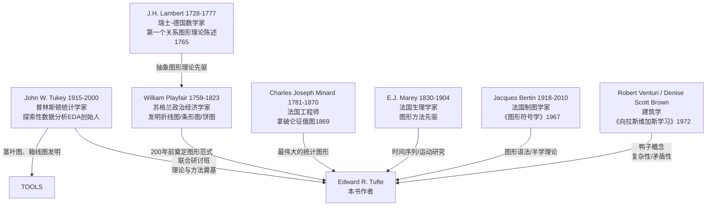

# B0136 Edward R. Tufte：《The Visual Display of Quantitative Information》，1983

- 语料类型：book
- 材料类型初判：book_or_book_length_source
- clean原文：D:\Design-history-知识库\00-book_clean\Edward R. Tufte：《The Visual Display of Quantitative Information》，1983.md
- 重复组：无精确哈希重复
- 分析文件数：17
- 总字符数：249745
- 当前核验等级：V2候选；须完成本包语义复核后确认

> 以下内容按原目录文件顺序无损汇集。文件标题是证据边界，不得把不同报告视为独立来源。

---

## FILE `分析报告.md`

- category: `legacy_root_report`
- sha256: `8e9bd14c63159f7ba63aa5718e6cecc33be5f37249b530357bccd58bb6bf9475`
- characters: 20113

# 《The Visual Display of Quantitative Information》分析报告

---

## 一、书目信息

| 项目 | 内容 |
|------|------|
| **书名（英文）** | The Visual Display of Quantitative Information, Second Edition |
| **书名（中文试译）** | 《定量信息的视觉呈现》（第二版） |
| **作者** | Edward R. Tufte（爱德华·R·塔夫特） |
| **初版年份** | 1983年 |
| **第二版年份** | 2001年 |
| **出版社** | Graphics Press LLC, Cheshire, Connecticut |
| **页数/章节** | 正文191页，共2部分、9章，附索引与致谢；插图约250幅 |
| **ISBN** | 未在文本中明示（Graphics Press自出版） |
| **作者身份** | 耶鲁大学政治学、统计学及计算机科学荣誉教授；信息设计领域先驱 |
| **装帧特色** | 作者自费抵押房产出版，与书籍设计师Howard Gralla合作，实现"自我示例"（self-exemplifying）——书籍本身即为书中理念的物质载体，图与文在句子中间无缝交融，无传统图文分离 |
| **题献** | 献给父母 Edward E. Tufte 和 Virginia James Tufte；纪念 John W. Tukey (1915-2000) |

---

## 二、内容摘要

本书是数据图形设计领域的奠基之作，系统构建了一套关于统计图形（data graphics）的理论语言与实践原则。全书分为两大部分：

**第一部分（图形实践，第1-3章）** 回顾自William Playfair（1759-1823）以降两百余年的图形实践史。第一章展示图形卓越性的经典范例——数据地图（癌症地图、星系图）、时间序列（纽约天气史、Playfair的贸易图表、Marey的火车时刻表）、空间-时间叙事图形（Minard的拿破仑征俄图）和关系图形（散点图及其变体）。第二章严厉批判图形诚信的缺失，提出"谎言因子"（Lie Factor）公式来量化图形扭曲程度，指出图形设计失真（design variation）和不可靠数据是"无聊统计"的两大根源。第三章探究图形精致性与诚信的来源：强调真正精致的图形是"熟练之手"在长期实践中积累的技艺，而非迎合大众口味的肤浅设计，并通过跨国比较揭示图形品质与受众素养的关联。

**第二部分（数据图形理论，第4-9章）** 提出一套系统的图形设计理论。核心概念包括：数据墨水（data-ink）与非数据墨水（non-data-ink）的区分、数据墨水最大化原则与擦除原则（erase principle）、Chartjunk（图表垃圾）的三种变体（摩尔纹振动、网格、自恋鸭形图）、多功能图形元素（multifunctioning graphical elements）、数据密度（data density）与数据矩阵、缩微原理（Shrink Principle）与小型多重图（small multiples），以及数据图形美学原则。全书以"清晰呈现复杂"（the clear portrayal of complexity）为终极追求，以Minard的拿破仑征俄图、Marey的火车时刻表和星系图为经典范例。

作者实践了"自我示例"：书籍设计与内容高度统一——图文混排直至句中、文字图形表格合为一体、版式精致。Tufte抵押房产自筹资金出版，拒绝出版社低价高价的商业模式，确保书籍成为"最优美、最优雅、最美妙的书"。

---

## 三、结构

```
序言（Introduction to the Second Edition, 第一版引言）
│
├── 第一部分：图形实践（Graphical Practice）
│   ├── 第1章  图形卓越性（Graphical Excellence）
│   │        - 数据地图（癌症地图、星系图、Snow的霍乱地图）
│   │        - 时间序列（Playfair的贸易/工资图、Marey的生理运动图）
│   │        - 空间-时间叙事图（Minard的拿破仑征俄图、洛杉矶空气污染）
│   │        - 关系图形（散点图、Phillips曲线、热导率综合图）
│   │
│   ├── 第2章  图形诚信（Graphical Integrity）
│   │        - 图形失真：谎言因子公式
│   │        - 设计变异与数据变异
│   │        - 视觉面积与数量表征
│   │        - 语境与可信度问题
│   │
│   └── 第3章  图形诚信与精致的来源
│            （Sources of Graphical Integrity and Sophistication）
│            - 图形能力与受众素养的国际比较
│            - 日本论文中图形的超级时代
│            - "双重铁律"：图形与受众的匹配
│
├── 第二部分：数据图形理论（Theory of Data Graphics）
│   ├── 第4章  数据墨水与图形再设计（Data-Ink and Graphical Redesign）
│   │        - 数据墨水/非数据墨水概念
│   │        - 数据墨水比公式
│   │        - 擦除策略的五原则
│   │
│   ├── 第5章  图表垃圾：振动、网格与鸭子
│   │        （Chartjunk: Vibrations, Grids, and Ducks）
│   │        - 无意光学艺术（摩尔纹振动）
│   │        - 网格的滥用与灰色网格替代方案
│   │        - 自恋型图形："鸭子"（duck）概念
│   │        - 计算机制图的chartjunk问题
│   │
│   ├── 第6章  数据墨水最大化与图形设计
│   │        （Data-Ink Maximization and Graphical Design）
│   │        - 箱线图→四分位图的再设计
│   │        - 条形图/直方图的再设计（白色网格法）
│   │        - 散点图的再设计（范围框架、点划线图）
│   │
│   ├── 第7章  多功能图形元素
│   │        （Multifunctioning Graphical Elements）
│   │        - 数据构建的数据度量（stem-and-leaf图、Ayres的一战师团图）
│   │        - 数据网格与数据标签
│   │        - 双重功能标签
│   │        - 图形谜题与层次性（3层观看深度、3个视觉角度）
│   │
│   ├── 第8章  数据密度与小型多重图
│   │        （Data Density and Small Multiples）
│   │        - 数据密度公式与实证测量（期刊/报纸比较表）
│   │        - 缩微原理
│   │        - 小型多重图（空气污染、鱼类年龄、染色体对比、汽车维修记录）
│   │
│   └── 第9章  数据图形设计中的美学与技术
│            （Aesthetics and Technique in Data Graphical Design）
│            - 句型/文字表格/表格/半图形/全图形的选择光谱
│            - 友好图形 vs 不友好图形对照表
│            - 文字、数字与图片的整合原则
│            - 比例与尺度：线宽、字体、图形长宽比（倡导水平矩形约1.5:1）
│
├── 尾声（Epilogue）：信息显示的设计
└── 索引（Index）、致谢、图版来源
```

---

## 四、核心论点与概念

> 以下核心概念按首次出现或集中论述位置标记章节号 L###（以正文核心页为参考）。

### L013 图形卓越性的九条标准

1. 展示数据（show the data）
2. 引导观看者思考实质内容而非方法论/设计/技术
3. 避免扭曲数据所要表达的内容
4. 在小空间内呈现大量数字
5. 使大数据集连贯可读
6. 鼓励眼睛比较不同数据片段
7. 从概览到细部结构的多层次揭示数据
8. 服务于清晰目的：描述、探索、制表或装饰
9. 与数据集的统计描述和文字描述紧密整合

### L053 谎言因子（Lie Factor）

定义公式：$$\text{Lie Factor} = \frac{\text{图形中所示效果的大小}}{\text{数据中实际效果的大小}}$$

- 若 Lie Factor > 1，图形夸大了实际效果
- 实质性的图形失真几乎总是涉及 Lie Factor 超过 1 的情况
- 原则：物理图形上所呈现的数字表征应与所呈现的数值量成正比

### L060 数据变异与设计变异（Design Variation vs. Data Variation）

每个图形可分解为两部分：(1) 由数据变异引起的墨水变化，(2) 由非数据设计因素引起的墨水变化。图形中绝大部分墨水应呈现数据信息。数据墨水比 = （数据墨水）/（印刷图形所用的总墨水）。

### L079 图形精致性的双重铁律

图形品质取决于两项条件：(1) 图形制作者具备"熟练之手"（skilled hand）——真实的能力、技能和诚信；(2) 受众具备理解复杂图形的素养。图形诚信与精致是双向匹配的结果。数据显示了各国报纸图形数据密度的显著差异（《华尔街日报》《泰晤士报》与《真理报》的巨大差距）。

### L091 数据墨水理论五原则

1. **Above all else show the data.**（最重要：展示数据。）
2. **Maximize the data-ink ratio.**（最大化数据墨水比。）
3. **Erase non-data-ink.**（擦除所有非数据墨水。）
4. **Erase redundant data-ink.**（擦除冗余的数据墨水。）
5. **Revise and edit.**（反复修订与编辑。）

数据墨水比公式：$$\text{Data-ink ratio} = \frac{\text{data-ink}}{\text{total ink used to print the graphic}}$$

### L107 Chartjunk 三种类型

- **摩尔纹振动（moiré vibration）**：无意光学艺术，由重复线条图案与眼睛生理性震颤相互作用产生闪动感；是最常见的图形垃圾。实证数据：JASA风格表样本中图形68%含摩尔纹，NEJM中21%，Nature中11%。
- **网格（the grid）**：深色网格线不携带信息，遮蔽数据轮廓，应改为灰色细线或完全隐去。灰色网格有助于精确读取。
- **鸭子（the duck）**：自恋型图形——图形整体异化为装饰品，数据被设计元素吞没。源自建筑学中 Venturi/Brown/Izenour 的概念。"装饰建构是可以的，但永远不要建构装饰。"

### L123 数据墨水最大化的再设计实例

- **箱线图→四分位图**：Spear的range bar需要6次直尺放置，重新设计后仅需1次
- **条形图→白色网格条形图**：擦除框架、纵轴、刻度标记，仅保留数据条和白色网格线
- **散点图→范围框散点图（range-frame）**：原先无信息的框架变为数据承载元素，显式标记X和Y变量的最大、最小
- **点划线图（dot-dash-plot）**：在散点图外围叠加两变量的边际分布，一次呈现三类统计信息

### L139 多功能图形元素原则

> Mobilize every graphical element, perhaps several times over, to show the data.
> （动员每一个图形元素，也许反复多次，以展示数据。）

关键设计技术：
- **数据构建的数据度量**：如茎叶图（stem-and-leaf plot）用数字本身形成分布图；Ayres一战师团图用师团番号同时表示数量、具体身份与驻留时长
- **数据网格与数据标签**：Playfair的国债图以不规则间距将网格线绑定到重大事件（数据驱动网格）
- **范围标签**：以实际数据的最小值和最大值替代凑整数字坐标标签

### L154 图形观看架构的三层次

通过三个不同层次组织多重信息而不使图形沦为谜题：
1. **三层观看深度**：(1) 远观——整体聚合结构；(2) 近观——数据细部结构；(3) 潜观——图形背后隐含的信息
2. **三个视觉角度**：每个独立视线方向应保持恒定（水平或垂直），如Ayres师团图的三个阅读方向（时间序列的轮廓线、条形图的垂直构成、各师驻留时间的水平方向）

### L161 数据密度与缩微原理

定义公式：$$\text{data density} = \frac{\text{number of entries in data matrix}}{\text{area of data graphic}}$$

实证测量（1979-1980年抽样数据）：《Nature》中位数48个/平方英寸、《科学》21个/平方英寸、《纽约时报》7个/平方英寸、《真理报》0.2个/平方英寸。美国地质调查局地形图约250,000比特/平方英寸。星系图（最新纪录）：110,000个数字/平方英寸。

**缩微原理**：图形可以大幅度缩小。许多已发表的图形可缩减至其当前面积的一半而无信息损失。

### L170 小型多重图（Small Multiples）

> 对数据墨水而言，少即是无聊。对非数据墨水而言，少即是多。
> （For data-ink, less is a bore. For non-data-ink, less is more.）

核心特征：不可避免的比较性、巧妙的多元变量、已缩小的、高密度图形、几乎完全用数据墨水绘制、高效解读、往往具有叙事内容。范例：洛杉矶空气污染的24小时变化、鱼类年龄构成的逐年变化、人与猿染色体对比、Consumer Reports汽车维修频次表格。

### L177 图形美学原则与友好图形

优雅图形的关键：**设计之简洁与数据之复杂的结合**（simplicity of design and complexity of data）。

友好 vs 不友好图形对照（节选）：
| 友好 | 不友好 |
|------|--------|
| 完整拼写词语，避免神秘编码 | 缩写充斥，需翻阅文本解码 |
| 文字从左到右排列 | 文字纵向排列（尤Y轴） |
| 小消息帮解释数据 | 图形晦涩，需反复参考分散文本 |
| 直接在图形上标注，无需图例 | 被迫在图例与图形间来回 |
| 考虑色盲人群（5-10%观众） | 红绿组合用于关键对比 |
| 有衬线大小写字母 | 全部大写，无衬线 |

### L186 水平矩形原则

图形应倾向于水平矩形（宽大于高），理由：类比地平线（眼睛天然擅长检测水平偏离）、便于标签读写、强调因果变量、Tukey意见（蜿蜒曲线需更宽）、Playfair实践（89幅图中92%为水平矩形）。建议长宽比约1.5:1（比黄金比例1.618更水平）。

### L191 终极原则：清晰呈现复杂

> What is to be sought in designs for the display of information is the clear portrayal of complexity. Not the complication of the simple; rather the task of the designer is to give visual access to the subtle and the difficult — that is, the revelation of the complex.
> （信息展示设计所应追求的，是复杂性的清晰呈现。不是简化简单事物；设计者的任务是对微妙和困难之物给予视觉通路——亦即，对复杂性的揭示。）

---

## 五、方法论与材料

### 5.1 方法论特征

**Tufte的分析方法具有高度的实证精神和跨学科色彩：**

1. **定量实证法**：对大量已发表图形进行系统抽样与统计分析。典型案例：
   - 十大引用率最高科学期刊（1980-1982年）中摩尔纹图形占比统计
   - 统计学教科书和计算机图形手册中chartjunk比例的历史变化
   - 15种全球主要报纸/杂志/期刊的数据密度与数据矩阵大小比较表
   - Playfair 89幅图的长宽比分布统计

2. **案例比较法（Before-After）**：对同一图形进行"原版vs改版"对照，通过视觉对比论证原则的有效性。如：法国人口金字塔（深色网格→灰色网格→白色网格）、JASA风格样图（131条线→精简版）、散点图（传统框架→范围框架→四分位图→点划线图）。

3. **历史谱系法**：追溯图形发明的时间序列——从11世纪中国《禹迹图》→1686年Halley信风地图→1765年Lambert关系图形理论→1786年Playfair经济时间序列→1854年Snow霍乱地图→1869年Minard拿破仑征俄图→现代计算机图形。以历史纵深论证图形是一种缓慢积累的文化成就。

4. **概念蒸馏法**：将复杂的图形设计经验提炼为少数简洁、可操作的公式化原则（如数据墨水比公式、谎言因子公式、数据密度公式），使理论具有可操作性和可验证性。

5. **跨学科类比法**：广泛援引建筑学（Venturi的"鸭子"概念）、艺术批评（Reinhardt的"无噪音"宣言、Albers的色彩理论）、排版学（字体的可读性实验）、视觉心理学（格式塔感知、眼睛分辨力极限）、制图学等领域的成熟概念来丰富和深化数据图形理论。

### 5.2 材料来源

- **历史文献（15-19世纪）**：Lambert的《Pyrometrie》(1779)、Playfair的《The Commercial and Political Atlas》(1786) 和《The Statistical Breviary》(1801)、Marey的《La méthode graphique》(1885)、Halley的哲学汇刊论文(1686)、Snow的《On the Mode of Communication of Cholera》(1855)、Minard的手绘组合图集(1845-1869)、Leonardo da Vinci的手稿
- **现代科学期刊**：《Science》《Nature》《The Lancet》《New England Journal of Medicine》《Journal of the American Statistical Association》等十余种期刊的图像样本
- **新闻媒体**：《New York Times》《Wall Street Journal》《The Times (London)》《Asahi》《Le Monde》《Pravda》《The Economist》《Fortune》《Newsweek》《Business Week》等
- **统计图形教科书与软件手册**：Brinton (1914)、Satet (1932)、Arkin & Colton (1936)、Spear (1952)、Schmid & Schmid (1979)、SAS/GRAPH用户指南 (1980)、Tell-A-Graf用户手册 (1981)
- **政府与机构出版物**：U.S. Bureau of the Census（癌症地图集、人口密度图、Statistical Abstract）、National Science Foundation、OECD
- **经典图形范例**：Minard拿破仑征俄图、Marey巴黎-里昂火车时刻表、纽约市1980年天气史、星系计数的Lick Catalog图、Bertin的法国公社图

---

## 六、学术谱系

### 6.1 先驱与直接师承



### 6.2 学派定位

- Tufte的学术工作在**John Tukey的EDA（探索性数据分析）传统**中延展，但侧重点从Tukey的"数据分析工具"转向"已发表/出版的统计图形的设计品质"
- 同时受到**Bertin的图形符号学**（sémiologie graphique）影响——Bertin提供了图形编码的视觉变量系统（位置、大小、形状、方向、颜色、纹理、灰度），Tufte则补充了数据墨水最大化与chartjunk批评的实用维度
- 来自**现代主义设计与排版传统**的审美批评——Josef Albers、Ad Reinhardt、Mondrian等艺术家的"少即是多"理念通过Tufte转化为"非数据墨水尽可能少"的设计教条
- 继承**Venturi的建筑后现代批评**——"装饰建构是可以的，但永远不要建构装饰"转化为"chartjunk"与"鸭子"的图形批评武器
- 在历史上属于**第二次统计图形复兴**（约1975-2000年），伴随着计算机图形学的兴起，Tufte试图在"计算机能画一切"的时代建立质量判断标准

### 6.3 直接影响

Tufte后续出版了三部姊妹著作形成四部曲：《Envisioning Information》(1990)、《Visual Explanations》(1997)、《Beautiful Evidence》(2006)。《The Visual Display of Quantitative Information》是四部曲的奠基之作，确立了整套术语和分析框架。Tufte的思想深刻影响了数据新闻学（如《纽约时报》信息图团队）、科学出版界的图形标准、以及当代数据可视化工具（如Tableau、D3.js等）的设计哲学。

---

## 七、六类实体清单

### 7.1 关键人物（People）

| 人物 | 生卒年 | 国籍/领域 | 在本书中的角色 |
|------|--------|-----------|----------------|
| William Playfair | 1759-1823 | 苏格兰政治经济学家 | 现代统计图形之父，发明折线图、条形图、饼图；著《The Commercial and Political Atlas》(1786)、《The Statistical Breviary》(1801) |
| J.H. Lambert | 1728-1777 | 瑞士-德国数学家/科学家 | 1765年首次明确提出关系图形（非类比）的抽象理论；绘制土壤温度-深度时间序列 |
| Charles Joseph Minard | 1781-1870 | 法国工程师 | 绘制"可能是有史以来最好的统计图形"——拿破仑1812年征俄图（1869）；亦绘汉尼拔远征图 |
| E.J. Marey | 1830-1904 | 法国生理学家 | 图形方法先驱；火车时刻表设计；马步态/海马/壁虎的运动时间序列摄影 |
| John W. Tukey | 1915-2000 | 美国统计学家 | Tufte的导师与合作者；EDA（探索性数据分析）创始人；发明茎叶图与箱线图；本书理论的重要奠基人 |
| Jacques Bertin | 1918-2010 | 法国制图学家 | 著《Sémiologie Graphique》(1967)；图形符号学理论奠基人；本书中多次引用其法国公社图 |
| John Snow | 1813-1858 | 英国医生 | 1854年伦敦霍乱点状地图——最早的流行病学空间分析经典案例 |
| Edmond Halley | 1656-1742 | 英国天文学家 | 1686年绘制世界上最早的数据地图之一——信风与季风世界地图 |
| Leonard P. Ayres | 1879-1946 | 美国军官/统计学家 | 设计一战美军师团驻法时间多功能图形（打字机+直尺手绘） |
| Josef Albers | 1888-1976 | 德裔美国艺术家/教育家 | 色彩理论家，《Interaction of Color》(1963)；Tufte引用其衬线vs无衬线字体的眼科学论证 |
| Robert Venturi | 1925-2018 | 美国建筑师 | 《向拉斯维加斯学习》(1972)中"鸭子"概念之父；为Tufte的chartjunk批判提供建筑学类比 |
| Herman Chernoff | 1923- | 美国统计学家 | 发明Chernoff面孔图（用卡通脸编码多元数据）；Tufte视为多功能图形的极限案例 |

### 7.2 关键文献（Publications）

| 文献 | 作者 | 年份 | 说明 |
|------|------|------|------|
| *The Commercial and Political Atlas* | William Playfair | 1786 | 第一本含经济时间序列图的书；44幅图中有43幅为时间序列、1幅为条形图 |
| *The Statistical Breviary* | William Playfair | 1801 | Playfair最理论化的著作；首次使用饼图和面积图表示多元数据 |
| *Pyrometrie* | J.H. Lambert | 1779 | 含土壤温度与深度的周期性变化时间序列图 |
| "Essai d'hygrométrie" | J.H. Lambert | 1765/1771 | 首次明确提出抽象关系图形理论；用图形微积分推导蒸发率 |
| *La Méthode Graphique* | E.J. Marey | 1885 | 19世纪图形方法集大成之作；含火车时刻表、马步态、海马运动等经典图例 |
| *Tableaux Graphiques et Cartes Figuratives* | C.J. Minard | 1845-1869 | 拿破仑征俄图与汉尼拔远征图的原出处（巴黎国立路桥学院图书馆藏） |
| *Sémiologie Graphique* | Jacques Bertin | 1967 | 图形符号学奠基之作；确立视觉变量的系统理论框架 |
| *On the Mode of Communication of Cholera* | John Snow | 1855 | 含伦敦Soho区霍乱死亡病例空间分布图 |
| *Cancer Mortality Atlas for U.S. Counties: 1950-1969* | Mason, McKay, Hoover, Blot, Fraumeni | 1975 | 3,056个县的6幅癌症死亡率地图；约21,000个数字的视觉呈现 |
| *Exploratory Data Analysis* | John W. Tukey | 1977 | EDA奠基著作；茎叶图、箱线图等新发明的原始出处 |
| *Learning from Las Vegas* | Venturi, Brown, Izenour | 1972 | "鸭子"建筑概念的来源；被Tufte转用于图形批评 |
| *Atlas of Early American History* | Cappon, Petchenik, Long | 1976 | 以网格叠加展示历史数据的地图集案例 |
| "Historical Development of the Graphical Representation of Statistical Data" | H. Gray Funkhouser | 1937 | 统计图形史的权威综述（发表于 *Osiris* 第3卷） |
| "The Use of Faces to Represent Points in k-Dimensional Space Graphically" | Herman Chernoff | 1973 | Chernoff面孔图的原论文（发表于 *JASA*） |

### 7.3 关键术语/概念（Terms & Concepts）

| 术语（英文） | 中文试译 | 定义出处 | 简要定义 |
|-------------|----------|----------|----------|
| Data-ink | 数据墨水 | Ch.4 (p.91) | 用于呈现数据的不可擦除的核心墨水；改变数据即必须改变此部分 |
| Non-data-ink | 非数据墨水 | Ch.4 (p.96) | 非数据呈现所必需的墨水；包括冗余的数据墨水（同一数据的重复编码） |
| Data-ink ratio | 数据墨水比 | Ch.4 (p.93) | = 数据墨水 ÷ 印刷图形所用的总墨水；衡量图形效率的核心指标 |
| Erase principle | 擦除原则 | Ch.4 (p.96-100) | 通过系统删除非数据墨水和冗余数据墨水来提升图形效率 |
| Chartjunk | 图表垃圾 | Ch.5 (p.107) | 对观众不传递新信息的装饰性墨水；包含摩尔纹、网格和鸭子三类 |
| Moiré vibration | 摩尔纹振动 | Ch.5 (p.107-112) | 由重复线条与眼睛生理性震颤相互作用产生的闪动效应；最常见的chartjunk |
| Duck | 鸭子（图形） | Ch.5 (p.116-121) | 整个图形被装饰形式或计算机碎屑占据，数据沦为设计元素的附庸 |
| Lie Factor | 谎言因子 | Ch.2 (p.57) | = 图形所示效果大小 ÷ 数据所示实际效果大小；>1表示图形夸大效果 |
| Design variation | 设计变异 | Ch.2 (p.60-61) | 由非数据的图形设计因素引起的视觉变化（与真实数据变异无关） |
| Range-frame | 范围框架 | Ch.6 (p.130) | 将传统散点图框架裁剪至数据实测范围的新型框架设计 |
| Dot-dash-plot | 点划线图 | Ch.6 (p.133) | 在散点图外围叠加两变量边际频率分布的复合设计 |
| Quartile plot | 四分位图 | Ch.6 (p.124) | 对传统箱线图的简化再设计——仅需一次直尺放置即可绘制 |
| Multifunctioning graphical elements | 多功能图形元素 | Ch.7 (p.139) | 同一墨水同时承载多种图形功能（如既表示位置又编码数值） |
| Graphical puzzle | 图形谜题 | Ch.7 (p.153) | 必须通过语言解码而非视觉直觉来理解的过度复杂的图形 |
| Data density | 数据密度 | Ch.8 (p.161) | = 数据矩阵条目数 ÷ 图形面积；衡量信息紧凑度的经验指标 |
| Shrink Principle | 缩微原理 | Ch.8 (p.169) | 图形可以大幅缩小面积而不损失可读性和信息 |
| Small multiples | 小型多重图 | Ch.8 (p.170-175) | 一系列保持相同设计结构、仅改变指标变量的缩小图形组合 |
| Graphical excellence | 图形卓越性 | Ch.1 (p.13) | 复杂思想以清晰、精确和效率进行传达 |
| Friendly data graphic | 友好数据图形 | Ch.9 (p.183) | 以观众为本精心设计：词语完整拼写、文字水平排列、标注内置、无冗余编码 |
| Supertable | 超级表格 | Ch.9 (p.179) | 组织有序、带叙事结构的精细表格；比一百张小条形图更好 |
| Clear portrayal of complexity | 复杂性的清晰呈现 | Epilogue (p.191) | 全书终极原则——图形设计的目标不是将简单复杂化，而是让微妙和困难之物可视 |

### 7.4 关键图形作品（Artworks）

| 图形 | 创作者 | 年份 | 类型 | Tufte的评价 |
|------|--------|------|------|-------------|
| 拿破仑征俄图（Carte Figurative des pertes successives en hommes de l'Armée Française dans la campagne de Russie 1812-1813） | C.J. Minard | 1869 | 空间-时间叙事图 | "可能是有史以来最好的统计图形"；六变量合一：军队规模、位置（二维）、方向、温度、日期 |
| 巴黎-里昂火车时刻表 | E.J. Marey | 1880s | 时间-空间图 | 斜度=速度，交点=会车时刻，水平线=停站时长；时空双变量的经典整合 |
| 纽约市1980年天气史 | *New York Times* | 1981 | 时间序列 | 1,888个数字的优雅组织；日最高/低温与常年平均对比；一个页面上讲一个完整的天气故事 |
| 汉尼拔远征图 | C.J. Minard | 1869 | 空间-时间叙事图 | 拿破仑图的小型姊妹版；透明色彩让底图文字透出 |
| 美国癌症死亡率地图集（6幅） | Mason, McKay, Hoover 等 | 1975 | 数据地图 | 每图约21,000个数字在3,056个县上的呈现；揭示癌症地理聚集模式 |
| 星系图（Lick Catalog） | Seldner, Siebers, Groth, Peebles | 1977 | 数据地图 | 数据密度记录保持者（110,000个/平方英寸）；2,275,328个矩形编码在61平方英寸上 |
| Playfair的英格兰进出口图（1700-1782） | William Playfair | 1786 | 时间序列 | 第一个已发表的经济数据时间序列；图形"算术"（进出口面积差） |
| 洛杉矶空气污染小型多重图 | Gregory J. McRae / *Los Angeles Times* | 1979 | 小型多重图 | 12个相同结构的时间-空间切片；28,800个污染读数的多层次呈现 |
| 热导率综合散点图 | Ho, Powell, Liley | 1974 | 关系图形 | 数百项研究的铜热导率数据汇于一幅；编号编码文献来源（可改进为时序编码） |
| 一战美军师团驻法图 | Leonard P. Ayres | 1919 | 多功能图形 | 用打字机+直尺手绘；师团番号同时表示数量、身份、驻留时长 |
| 辐鳍鱼的"活直方图"（Living Histogram） | Brian L. Joiner | 1975 | 创新统计图 | 学生身高数据的物理排列直接形成分布形态 |
| Consumer Reports汽车维修频次表 | *Consumer Reports* | 1982 | 表格式小型多重图 | 制造商×车型年份×故障类型的三维比较矩阵；Tufte称其混合表格与图形的精巧设计 |

### 7.5 关键时间/事件（Timeline）

| 时间 | 事件 | 意义 |
|------|------|------|
| 约前2500年 | 最早的泥板地图出现 | 地图比统计图形早约5000年 |
| 约前500年 | 黄金比例（Golden Section）由古希腊人确立 | 在本书中作为图形长宽比讨论的背景 |
| 11世纪 | 中国《禹迹图》（Yü Chi Thu）刻石 | 最早的高精度网格地图之一（Needham誉为"当时任何文化中最杰出的制图作品"） |
| 1546年 | Petrus Apianus《Cosmographia》出版 | 欧洲制图已逼近统计图形化——但尚未有人将测量数据放在地图上 |
| 1686年 | Edmond Halley绘制信风与季风世界图 | 最早的数据地图之一；用小箭头表示风向 |
| 1765年 | J.H. Lambert提出抽象关系图形理论 | 统计图形不再依赖于地理/物理世界类比的关键突破 |
| 1779年 | Lambert《Pyrometrie》出版 | 含土壤温度周期性时间序列图 |
| 1786年 | William Playfair《The Commercial and Political Atlas》出版 | 第一个经济时间序列图；现代统计图形的正式诞生 |
| 1801年 | Playfair《The Statistical Breviary》出版 | 首次使用饼图和面积图；Playfair最理论化的图形著作 |
| 1854年 | Dr. John Snow绘制伦敦霍乱死亡病例图 | 流行病学空间分析的经典范例 |
| 1869年 | Minard绘制拿破仑俄罗斯战役图 | 被Tufte誉为"可能是有史以来最好的统计图形" |
| 1885年 | E.J. Marey《La méthode graphique》出版 | 19世纪图形方法集大成之作 |
| 1937年 | H. Gray Funkhouser发表统计图形史综述 | 学术史上首次系统梳理图形发明的时间谱系 |
| 1967年 | Jacques Bertin《Sémiologie Graphique》出版 | 图形符号学的理论奠基 |
| 1972年 | Robert Venturi等《Learning from Las Vegas》出版 | "鸭子"概念为Tufte的chartjunk批判提供建筑学类比 |
| 1975年 | 美国癌症地图集出版 | Tufte反复引用的高密度数据地图范例 |
| 1977年 | John Tukey《Exploratory Data Analysis》出版 | EDA方法论奠基；茎叶图、箱线图等新发明的正式发表 |
| 1977年 | Lick星系目录新约简版发表 | 当前数据密度最高纪录的保持者（110,000个数字/平方英寸） |
| 1982年 | Tufte完成《The Visual Display of Quantitative Information》手稿 | 本书的完成 |
| 2001年 | 本书第二版出版 | 增加高分辨率彩色再现Playfair图形、修改17次印刷中的错误 |

### 7.6 关键数据/统计（Key Statistics）

| 数据/统计 | 数值 | 上下文 |
|----------|------|--------|
| 全球每年印刷的统计图形数量估计 | 9000亿至2万亿幅 | 本书导论中用于论证图形设计原则影响范围之广 |
| 图形中时间序列占比 | >75% | 基于1974-1980年全球15种报纸/杂志4,000幅图形的随机抽样 |
| 现代科学文献中关系图形占比 | 约40% | 其中不含经纬度或时间变量 |
| 摩尔纹振动在各期刊中的占比 | Nature 11%, Science 17%, NEJM 21%, JASA样本68% | 1980-1982年十大引用率最高科学期刊的抽样统计 |
| 数据密度范围（期刊中位数） | Nature: 48, Science: 21, JASA: 17, Pravda: 0.2（个/平方英寸） | 1979-1980年抽样数据 |
| 星系图数据密度 | 110,000个数字/平方英寸（17,000个/平方厘米） | 改写后的Lick星系目录图（61平方英寸，2,275,328个矩形） |
| 美国地质调查局地形图信息密度 | 约250,000比特/平方英寸（40,000比特/平方厘米） | "标准17×23英寸图幅含超1亿比特信息" |
| Playfair图形的长宽比 | 92%为水平矩形；2/3介于1.4-1.8之间 | 基于6本不同著作中89幅图形的统计分析 |
| 人眼在1平方英寸内的分辨能力 | 可分辨约625个点或81×81网格下6,561个不同位置 | 以n条黑线和n-1条白线计算的(2n-1)²个线交叉点 |
| 拿破仑军队从莫斯科撤退的损失 | 从422,000人减至10,000人 | Minard征俄图的核心叙事数据 |
| 美国癌症地图的数据矩阵规模 | 约21,000个数字/图（7个变量×3,056个县） | 6幅图中每幅的数据量估计 |
| 图形面积缩小到原来的50% | 几乎不损失可读性和信息 | 缩微原理的核心经验结论 |

---

## 八、语言风格

### 8.1 总体风格定位

Tufte的写作风格是**雄辩的学术散文（eloquent scholarly essay）**与**设计宣言（design manifesto）**的混合体。全书兼具学理严谨性（大量数据、公式、表格、引用）和审美判断力（大量带有明确价值立场的品评——"这可能是最糟糕的图""这是最好的统计图形"）。句子节奏感强，善用排比句式（如：第九章的"Friendly/Unfriendly"对照表、Ad Reinhardt引文的密集否定名词链"no noise, no schmutz, no schmerz..."），近似于带有道德紧迫感的布道式修辞。

### 8.2 典型修辞策略

1. **警句式压缩（Aphoristic Compression）**：将复杂原则浓缩为可引用、易记忆的短句阵列：

   > "Above all else show the data."
   > "For data-ink, less is a bore. For non-data-ink, less is more."
   > "Graphics should be as intelligent and sophisticated as the accompanying text."

2. **对立结构（Binary Oppositions）**：全书贯穿着一系列鲜明的二元对立——卓越 vs 欺骗、数据墨水 vs 非数据墨水与chartjunk、友好 vs 不友好、精致 vs 粗鄙、内容 vs 装饰。这种结构赋予文本清晰的价值指向和批判张力。

3. **图表即论证（Graphic-as-Argument）**：语言论证与视觉证据高度融合。Tufte不只是"谈论"图形，而是把图形嵌入句子的中间（实践了自身"图文合一"的理念），让读者直接观看他所讨论的对象。

4. **数据驱动批判（Data-Driven Critique）**：批判不是空泛的审美指责，而是以定量证据支撑——使用百分比表、分类统计、数据密度测量。如对chartjunk的批判辅以10种期刊和10种教科书的摩尔纹比例统计表。

5. **跨学科引证网络（Interdisciplinary Citation Web）**：自如地引用经济学（Playfair）、建筑学（Venturi）、艺术批评（Reinhardt、Albers、Matisse）、排版学、视觉心理学、制图学、统计学（Tukey）等多领域的权威话语，构建出超越单一学科边界的综合理论场域。

6. **个人叙事穿插（Personal Narrative）**：序言中嵌入自传元素（1975年普林斯顿教学经历、抵押房屋自费出版、与设计师Howard Gralla在车库工作的那个夏天），赋予学术论述以人的温度和历史质感。"银行职员说这是她经手过的第二不寻常的贷款——第一名是贷给一个马戏团买大象的！"

7. **偶有锐利讽刺（Occasional Sharp Irony）**："这可能是有史以来最糟糕的印刷图形""Boutique Data Graphics的世界""We-Used-A-Computer-To-Build-A-Duck Syndrome"——Tufte的讽刺近乎刻薄，但始终服务于论证目的。

### 8.3 汉译难点

- 术语创新（如"chartjunk"译为"图表垃圾"基本可传达，但"duck"的建筑学语境、"moiré vibration"的技术精确性在翻译中会损失部分意涵）
- 警句的节奏与压缩感（英文中"Above all else show the data"六个词的力量在中文"首要的是展示数据"中会有所稀释）
- 讽刺语气（"Boutique Data Graphics"的文化语境——指向1980年代初期美国企业年报中的视觉浮夸风潮）
- 数学公式与图表的视觉论证作用——原文将图文融为一体，译写时须保持这种论证结构

---

## 九、一句话概括

> 以"展示数据"为第一律令、以"数据墨水比最大化"为操作核心、以"清晰呈现复杂性"为终极追求，本书既是一部数据图形设计的理论宣言与操作方法手册，也是古今经典图表的美学鉴赏集——它系统论证了：好的统计图形是一门关于视觉证据的智力与审美学科，其品质取决于数据之丰富与设计之克制的精确平衡。

---

*报告生成日期：2026-08-03*
*源文件路径：F:/Design-history-知识元/00-book/Edward R. Tufte：《The Visual Display of Quantitative Information》，1983.md*


---

## FILE `分析报告\00_整体分析报告.md`

- category: `overall_report`
- sha256: `4f6c6f4bf6d4970d1cbc7657e67b03b9e4f810a1c3f859dcf75b2ff9d3b5f596`
- characters: 9331

# 整体分析报告

## 一、著作定位与成书脉络

Edward R. Tufte的《The Visual Display of Quantitative Information》（1983年首版，2001年第二版）是统计图形学领域具有里程碑意义的经典著作。该书诞生于1975年Tufte在普林斯顿大学Woodrow Wilson学院为记者讲授统计学的教学实践中（L9）。在John Tukey（普林斯顿大学统计学家）的建议和鼓励下，Tufte开始系统研究统计图形，经过七年的撰写，于1982年完成手稿（L9）。因出版商计划仅印2,000册并以高价出售，与作者希望广泛传播的理念相悖，Tufte决定自费出版——为此抵押房产获得银行贷款，与设计师Howard Gralla合作逐页排版，实现了文字与图形的无缝整合（L10-L11）。这本书的物理形态本身就是其理论原则的自我证明（self-exemplifying），即书籍这一物质对象反映了书中所倡导的智识原则。

该书在学术谱系中占据独特位置：它承继了John Tukey在20世纪60年代为统计图形赋予的智识尊严（L9-L14），扭转了1930年至1970年间统计图形领域长达四十年的"图形荒芜期"（graphically barren years）（L295），将统计图形从"装饰数字"的边缘地位提升为"量化推理工具"的核心位置。第二版增加了William Playfair图形的高分辨率彩色复制，并累积了第一版17次印刷中的修改与校正（L9）。

## 二、全书主旨与核心命题

全书的主旨可概括为：统计图形是思考量化信息的工具，其设计应服务于数据的清晰、精确和高效呈现。核心命题包括：

1. **图形卓越论**：卓越的统计图形以清晰、精确、高效的方式传达复杂思想（L39, L290）。
2. **图形完整性论**：图形应当真实呈现数据，避免通过设计变形扭曲信息（L295-L350）。
3. **数据墨水论**：图形的大部分墨水应随数据变化而变化，最大化数据墨水比（L380-L398）。
4. **图形效率论**：通过擦除非数据墨水和冗余数据墨水来提升图形效率（L387-L398）。
5. **多功能图形元素论**：同一墨水应服务于多重图形目的（L92-L138）。
6. **数据密度论**：图形应承载高密度信息，发挥人眼分辨能力（L143-L168）。
7. **美学与技术融合论**：优雅的图形设计来自简洁的设计与复杂的数据的结合（L180）。

全书以"Above all else show the data"（首要是展示数据）为至高原則（L19, L378）。

## 三、分析框架

全书的分析框架可归纳为以下五个层面：

**层面一：规范性（Normative）**——建立"好图形"的评价标准。第1章从正面定义"图形卓越性"，第2章从负面诊断"图形谎言"，构成评价的双轴。

**层面二：诊断性（Diagnostic）**——识别图形设计的常见病理。第5章系统分类三类图表垃圾（光学振动、网格、鸭子），第2章揭示了比例失真、设计变异等谎言机制。

**层面三：操作性（Operational）**——提供图形改进的具体方法。第4章的擦除原则、第6章的数据墨水最大化、第7章的多功能元素均为可操作的设计技术。

**层面四：经验性（Empirical）**——以数据验证理论主张。第8章的数据密度统计表格、第3章的图形精密度调查、第5章的莫尔纹频率统计均体现了经验论证的风格。

**层面五：历史性（Historical）**——追溯统计图形从18世纪到当代的演化轨迹。Playfair、Lambert、Marey、Minard的历史案例贯穿全书，构成论证的历史纵深。

## 四、论证主干

全书的论证逻辑遵循"实践批判—理论建构—设计应用"的三段式结构：

**第一阶段（第1-3章）：图形实践审查。** 第1章展示历史上优秀的图形范例（数据地图、时间序列、空间时间叙事图形、关系图形），建立质量标准；第2章揭露当代图形中的谎言和扭曲，建立批判框架；第3章诊断图形质量差异的制度性原因（艺术家的量化素养缺失、"统计数据枯燥论"、"图形服务于无知者论"），解释为何坏图形如此普遍。

**第二阶段（第4-8章）：数据图形理论建构。** 第4章提出数据墨水概念和擦除原则；第5章分类批判"图表垃圾"；第6章将理论应用于标准统计图形的重新设计（箱线图、条形图、散点图、dot-dash-plot、range-frame）；第7章发展多功能图形元素理论（数据构建的数据度量、数据为基础的网格和标签）；第8章提出数据密度概念和小倍数（small multiples）设计策略。

**第三阶段（第9章与尾声）：美学与综合。** 第9章讨论图形美学的构成要素（比例、线宽、文字整合、友好图形），将图形设计提升至艺术层面；尾声以"揭示复杂"作为全书结语。

论证的推进方式是由具体案例到一般原则，由历史范例到当代应用，由批判到建构，由理论到设计。

## 五、概念工具箱

| 概念 | 英文 | 定义 | 首次出现 |
|------|------|------|----------|
| 图形卓越性 | Graphical Excellence | 以清晰、精准、高效传达复杂思想的图形品质 | 第1章，L39 |
| 谎言因子 | Lie Factor | 图形所示效果大小与数据中实际效果大小的比值 | 第2章，L303 |
| 数据墨水比 | Data-Ink Ratio | 数据墨水占图形总墨水的比例 | 第4章，L380 |
| 图表垃圾 | Chartjunk | 不传达新信息的装饰性墨水 | 第5章，L23 |
| 数据密度 | Data Density | 单位面积图形所承载的数据矩阵条目数 | 第8章，L144 |
| 小倍数 | Small Multiples | 相同变量组合、不同索引变量的一系列图形 | 第8章，L164 |
| 多功能图形元素 | Multifunctioning Graphical Elements | 同一墨水服务于多重图形目的的要素 | 第7章，L92 |
| 范围框架 | Range-Frame | 框架线仅延伸至数据实测范围的散点图框架 | 第6章，L74 |
| 收缩原则 | Shrink Principle | 图形可以大幅缩小而不损失可读性 | 第8章，L162 |
| 友好图形 | Friendly Data Graphic | 特别易于理解和获取的数据图形 | 第9章，L192 |

## 六、章节结构与功能分工

全书共9章加尾声，分为两大部分。各部分功能分工如下：

**第一部分：图形实践（Graphical Practice，第1-3章）**
- 第1章"图形卓越性"：正面展示，以丰富的历史范例（Playfair、Marey、Minard等）建立质量标杆，包含数据地图、时间序列、空间-时间叙事图形、关系图形四类设计。
- 第2章"图形完整性"：负面批判，系统分析图形中的谎言与扭曲，提出图形诚信六原则。
- 第3章"图形完整性与精密性的来源"：制度诊断，揭示劣质图形的社会结构性原因——艺术家的量化技能缺失、"统计数据枯燥论"、"图形仅服务于无知者"的精英主义偏见。

**第二部分：数据图形理论（Theory of Data Graphics，第4-9章）**
- 第4章"数据墨水与图形重设计"：提出数据墨水、数据墨水比、两擦除原则三项核心概念，奠定全书理论的基石。
- 第5章"图表垃圾：振动、网格与鸭子"：对三种普遍存在的非数据墨水进行系统批判，以经验数据验证批判的有效性。
- 第6章"数据墨水最大化与图形设计"：将前两章的理论原则应用于标准统计图形的重设计（箱线图、条形图、散点图、半面孔等），展示操作化路径。
- 第7章"多功能图形元素"：发展进阶理论——同一墨水可同时承载多重数据功能，讨论数据驱动的坐标标签、数据网格、视觉层次与图形谜题。
- 第8章"数据密度与小倍数"：提出数据密度的经验度量和小倍数设计策略，将"最大化"原则推向系统化。
- 第9章"数据图形设计中的美学与技巧"：综合讨论图形美学——文字-数字-图像的整合、比例与尺度、线宽设计、友好图形标准。

**尾声：信息显示的设计**——以"揭示复杂"（the revelation of the complex）作为全书终极目标（L212）。

## 七、材料与方法

### 材料来源

1. **历史档案材料**：18-19世纪统计图形先驱的原作——Playfair的《商业与政治地图集》（1786年）、《统计简报》（1801年）；Lambert的《测温学》（1779年）；Marey的《图形方法》（1885年）；Minard的《图形表与具象地图集》（1845-1869）等（L32-L34, L250-L278, L279-L280, L268, L32, L256-L258）。
2. **当代出版物抽样**：对1980年前后15家世界主要报刊的约4,000幅统计图形进行随机抽样分析（L357-L361）；对10种主要科学期刊的图形进行莫尔纹频率统计（L29）；对10本统计图形教科书和手册进行图表垃圾含量统计（L33）。
3. **教科书与教育测验**：对大学和高中教科书、标准化测验中的图形精密度进行调查（L364-L368）。
4. **科学数据图形**：癌症地图集、星系地图、木星无线电发射图、纽约市天气历史图等当代优秀图形（L107-L109, L153, L244-L246）。
5. **自绘案例**：Tufte自行重绘和改进的图形遍布全书（如range-frame、dot-dash-plot、quartile plot、white grid等）（L74-L80, L86, L63-L68）。

### 方法论特征

1. **经验抽样与统计表格**：通过系统抽样数据来支持论断（如L158、L360的表格），而非仅凭印象式断言。
2. **历史比较方法**：将当代实践与18-19世纪经典作品对比，以"历史高点"度量当代的退步。
3. **案例分析法**：以深度解析单个图形（如Minard的拿破仑进军图）作为论证的核心素材，使抽象原则具象化。
4. **设计实验法**：通过"重设计"（redesign）展示理论原则的实践效力——先呈现原图，再展示改进后的版本，让读者通过视觉对比自行判断。
5. **定量度量法**：创建了Lie Factor、Data-Ink Ratio、Data Density等定量指标，赋予美学批评以经验基础。
6. **跨学科引证**：从建筑学（Venturi）、艺术史（Albers、Newman）、文学（Eliot）、心理学等学科引入类比和理论资源。

## 八、核心论辩

### 论辩一：图形可优于表格和文字

Tufte以Anscombe的四重奏（L40-L41）证明，四组统计特征完全一致的数据在散点图中呈现截然不同的结构——图形"揭示数据"，甚至比常规统计计算"更精确、更具有揭示性"。图形不是表格的替代品，而是"关于量化信息的推理工具"（L13）。

### 论辩二：大多数图表垃圾源于技能缺失而非恶意

Tufte在批判图形谬误时，将问题根源追溯至制度结构而非个人恶意。第3章论证：图形质量低劣的主要原因是（1）专业艺术家的量化素养缺失，（2）"统计数据乏味论"这一意识形态，（3）对读者智力的轻视——三者构成"保障图形平庸"的制度性条件（L352-L370）。

### 论辩三：最大化数据墨水有助于发现新图形形式

Tufte论证理论的价值不仅在于批评，更在于创新。第6章通过range-frame、quartile plot、dot-dash-plot、rugplot等全新设计展示了数据墨水原理如何"推导新的图形形式"（L57）——理论应当具有生产性，而不仅是评判性。

### 论辩四：图形应当具有高度信息密度

第8章论证：人眼具有极高的分辨能力，但大多数图形远未充分利用这一能力。数据密度表格（L158）展示了各出版物之间惊人的差异——Nature的图形数据密度中位数为48，而Pravda仅为0.2。这一论辩将图形设计从"简化"转向"浓缩"，反对将简单事物复杂化的做法（the complication of the simple），主张"揭示复杂"（L212）。

### 论辩五：文字、数字与图像应当整合

Tufte在第9章论证：现代印刷技术将文字与图形人为分隔是历史的倒退——达·芬奇手稿中的文字与图形"温和而完全地整合"（L189-L190）。图形是"关于数据的段落"（data graphics are paragraphs about data），应当"融入文本之中"（L187-L188）。

## 九、理论资源与学术谱系

### 直接先驱与同时代人

1. **John W. Tukey（1915-2000）**：普林斯顿大学统计学家，20世纪60年代以"世界级数据分析师"的身份"使统计图形变得受人尊敬"（L295）。Tukey发明了茎叶图（stem-and-leaf plot）（L94），并直接启发了Tufte的研究。书中多次以Tukey的工作为理论基准。

2. **William Playfair（1759-1823）**：苏格兰政治经济学家，现代统计图形的主要发明者。发明或改进了几乎所有基本图形设计——时间序列、条形图、饼图、面积图（L13, L250-L254, L274-L278）。Tufte以Playfair为"图形卓越性"的历史原型。

3. **Jacques Bertin（1918-2010）**：法国制图学家，著有《图形符号学》（Sémiologie Graphique, 1967）。书中引用Bertin关于莫尔纹的观点并加以批评（L33），也赞赏其"简洁优雅的线条"（L162）。

4. **Charles Joseph Minard（1781-1870）**：法国工程师，其1812年拿破仑俄罗斯战役图被Tufte誉为"可能是有史以来最好的统计图形"（L268）。

5. **E.J. Marey（1830-1904）**：法国生理学家和发明家，开创了运动图形方法，制作了著名的法国铁路时刻表图形（L248-L249, L256-L258）。

### 跨学科资源

6. **Robert Venturi**：建筑师，其《建筑的复杂性与矛盾性》（1966年）和《向拉斯维加斯学习》（1972年）为Tufte提供了"双重功能元素"（L92脚注）和"鸭子"概念（L43-L45）的理论框架。

7. **Josef Albers**：艺术家和教育家，其《色彩的交互》为Tufte提供了字体设计的论据——衬线字体优于无衬线体（L192）。

8. **视觉心理学**：书中引用视觉感知实验（L300）来支持关于图形误解的论述，但Tufte对心理学实验的预测力持谨慎态度。

### 谱系定位

Tufte继承了18世纪理性主义对"图形作为普遍语言"的追求（Lambert:"任何变量都可以与任何其他变量建立关系"），融合了Tukey的现代统计分析精神，并在理论层面超越了前两者——将历史鉴赏、理论构建和设计实践整合为统一的"图形推理"范式。

## 十、语言与写作风格总貌

### 风格特征

1. **格言式密度**：全书充满了警句式的精炼表达。"Above all else show the data"（L19）、"For data-ink, less is a bore. For non-data-ink, less is more"（L174）、"Graphics should be as intelligent and sophisticated as the accompanying text"（L88）、"Beautiful graphics do not traffic with the trivial"（L180）。

2. **批判性锋芒**：对劣质图形毫不留情的讽刺——"这可能是印刷史上最糟糕的图形"（L47）、"Graphical Hack"（L314）、"Pravda School of Ordinal Graphics"（L348）——带有强烈的道德义愤和智识幽默。

3. **历史叙事与当代批评交织**：在Playfair时代铜版画的"细如发丝"的线条与20世纪计算机生成的"即时图表垃圾"之间不断建立对比（L31-L33）。

4. **自我指涉的物证性**：第二版引言详述了书籍制作的物质过程——抵押房子、银行贷款、与设计师合作逐页排版、"使书籍本身反映其倡导的原则"（L10-L11）——将物理书籍本身转化为理论论据的一部分。

5. **经验精确性**：善于用量化数据支持论断——如"世界每年印刷9000亿至2万亿幅统计图形"（L15）、"从15家新闻出版物中抽样约4,000幅图形"（L357）——赋予人文批评以科学框架。

6. **跨领域类比**：自由地从建筑、绘画、音乐、诗歌中汲取类比资源——Mies van der Rohe的"少即是多"、Eliot的创作批评、Stockhausen的乐谱视觉平衡——建立跨学科的知识框架。

### 修辞策略

- **两极对比法**：将"好"与"坏"图形并列呈现（第1章vs第2章，Playfair vs现代报刊），以视觉对比强化论点。
- **重设计证明法**：通过"原图—擦除—改进版"的三段式展示，让读者亲眼见证理论原则的操作效果。
- **历史权威诉诸**：以Playfair、Minard、Marey等历史大师的作品为"无争议的标准"，反衬当代实践的堕落。

### 代表性原文摘录

> "Excellence in statistical graphics consists of complex ideas communicated with clarity, precision, and efficiency."（L39）

> "Graphical excellence is that which gives to the viewer the greatest number of ideas in the shortest time with the least ink in the smallest space."（L290）

> "If the statistics are boring, then you've got the wrong numbers."（L354）

> "Tables usually outperform graphics in reporting on small data sets of 20 numbers or less. The special power of graphics comes in the display of large data sets."（L300）

> "What is to be sought in designs for the display of information is the clear portrayal of complexity. Not the complication of the simple; rather the task of the designer is to give visual access to the subtle and the difficult—that is, the revelation of the complex."（L212）

## 十一、全书的成就与限度

### 成就

1. **开创了"数据图形理论"这一领域**：在之前，统计图形领域要么是手册式的操作指南，要么是心理学实验报告，Tufte首次提出了一套连贯的规范性理论和分析性词汇（data-ink ratio, chartjunk, small multiples等）。

2. **恢复了18-19世纪图形传统的尊严**：通过对Playfair、Minard、Marey等人作品的精美复制和深入解析，使现代读者能够欣赏到被遗忘的视觉遗产。

3. **建立了连接美学、统计学和伦理学的评价框架**：图形设计不仅是技术问题，也是审美选择和道德选择——"图形诚信"将伦理维度引入设计讨论。

4. **以经验方法支持理论主张**：数据密度统计、莫尔纹频率调查等经验分析赋予理论以实证基础，超越了纯粹的个人品味判断。

5. **书籍本身成为其理论的物质证明**：自我指涉的出版实践——自费出版以保证设计控制权、文字与图形的无缝整合——创造了理论与实践合一的典范。

6. **对实践产生了深远的实际影响**：readers "will never view or create statistical graphics the same way again"（L15）——这一预言已基本实现。

### 限度

1. **理论体系的非形式化**：概念定义依赖于直觉理解和视觉示例，而非形式化、可操作的数学定义。数据墨水比在实际图形中的精确计算往往存在困难。

2. **对交互性和动态图形的缺失**：该书出版于1983年（计算机图形学尚在早期），其理论主要针对静态印刷图形，对现代交互式数据可视化的适用性需要拓展。

3. **强烈的规范性可能边界过于刚性**：Tufte对饼图的全盘否定（"pie charts should never be used"，L182）和对装饰的无差别批评，在某些传播情境中可能过于绝对。

4. **"高信息密度"偏好的文化预设**：数据密度最大化原则可能反映了一种特定的认知风格和文化偏好，未必适合所有受众和传播目标。

5. **对视觉感知科学的应用不够系统**：书中引用了一些视觉感知实验，但对这一庞大文献的处理较为选择性，个别结论未得到后续实证研究的充分支持。

## 十二、一句话概括

这是一部以数据墨水理论为核心、以两百年图形史为材料、以"展示数据、尊重读者、揭示复杂"为伦理的统计图形设计与理论的奠基性经典——它既是历史图鉴、设计手册，也是认识论宣言。


---

## FILE `分析报告\01_第一章_图形卓越性.md`

- category: `chapter_or_full_report`
- sha256: `eac4af2274816a758a0ac1023b83888c5c17de75a31aa6db9202dfddda300218`
- characters: 8321

# 01 第一章：图形卓越性（Graphical Excellence）

## 1. 章节定位与功能

第一章是全书第一部分"图形实践"的开篇，定位于建立统计图形设计的正面标准和历史标杆。本章具有三重功能：（1）定义"图形卓越"这一核心评价概念；（2）通过四类基本图形设计（数据地图、时间序列、空间-时间叙事图形、关系图形）展示历史上优秀的统计图形范例；（3）为后续章节的批判（第2章）和理论建构（第4-9章）提供不可动摇的品质参照基准。章节的原初材料构成了一部微型的统计图形史。

该章也是全书最具"鉴赏性"的部分——Tufte以近乎博物馆策展人的手法，精心排列和阐释从10世纪到20世纪末的经典图形作品，使读者在进入批判和理论之前，先"看到好的统计图形能有多好"（L84）。

## 2. 结构分析

章节内部呈现出"定义—分述—综合"的三段式结构：

**第一段：定义框架（L39, L290-291）。** 以"Excellence in statistical graphics consists of complex ideas communicated with clarity, precision, and efficiency"为核心定义，并附列九项图形卓越的具体标准（展示数据、引导思考实质、避免扭曲、以小空间展示多数字、使大数据集连贯、鼓励比较、揭示多层次细节、服务明确目的、与统计和文字描述紧密融合）。在本章末尾再次提炼为"在最短时间内以最少墨水在最小空间中给观看者最多思想"的精简公式（L290）。

**第二段：按图形类型分述经典范例（L84-L290）。** 将统计图形分为四类依次展示：
- **数据地图（Data Maps）**：从11世纪中国《禹迹图》到当代星系地图，展示"一页之上承载百万信息位"的能力（L107-L109, L153-L156, L200-L201, L232-L238）。
- **时间序列（Time-Series）**：从10世纪行星轨道图（最古老的时间序列）到Playfair的进出口图、Marey的火车时刻表、纽约市1980年天气史（L242-L264）。
- **空间-时间叙事图形（Narrative Graphics of Space and Time）**：以Minard的拿破仑俄罗斯战役图（"可能是有史以来最好的统计图形"）、洛杉矶空气污染小倍数图、日本甲虫生命周期图为例（L268-L274）。
- **关系图形（Relational Graphics）**：从Lambert的蒸发率-温度关系图到Playfair的《统计简报》多变量设计，展示图形从地理类比走向抽象关系的认识论飞跃（L274-L290）。

**第三段：综合总结（L290-L291）。** 以三条浓缩原则收官——图形卓越性要求（1）复杂思想清晰传达、（2）多变量呈现、（3）说实话。

## 3. 内容分析

### 核心论题

统计图形在历史上已经达到了极高的品质水准，当代图形设计应当以这些经典作品为基准来衡量自身。图形的卓越性不在于装饰和技巧，而在于数据内容的丰富性和呈现的效率。

### 关键论点

**论点一：图形比统计计算更精确和更具揭示力。** Anscombe四重奏案例（L40-L41）证明，四组具有完全相同的均值、方差、回归方程和相关系数的数据，在散点图中呈现出截然不同的数据结构和异常值——"图形揭示数据"（Graphics reveal data）。

**论点二：统计图形的发明是一个出人意料地晚近的事件。** 尽管对数、笛卡尔坐标、微积分和概率论基础在1750年之前早已建立，但统计图形直到1750-1800年才被发明，比这些数学成就晚了数百年（L13）。Playfair是这一发明的核心人物（L250）。

**论点三：数据地图是最强大的统计信息显示方法。** 从John Snow的霍乱地图到当代癌症地图集和星系计数图，数据地图"在一页上放置数百万位信息"的能力无与伦比（L238, L153-L156）。

**论点四：时间序列是最常用的图形形式，但"简单的时间流逝不是好的解释变量"（L262）。** 描述性的时间顺序不等于因果解释——需要"向图形设计中走私额外的变量"以增进解释力。

**论点五：从地图到统计图形的转变是一个巨大的认识论进步。** Lambert和Playfair将变量从地理坐标中解放出来，使"任何变量都可以与任何其他变量建立关系"——"这意味着图形变得与所有量化探究相关"，使得散点图成为"所有图形设计中最伟大的设计"（L274, L282）。

**论点六：图形卓越性是多变量的。** 全书反复出现的主题——最好的图形同时展示多个变量之间的关系（如Minard的六变量俄罗斯战役图）。

## 4. 逻辑梳理

### 论证链条

```
定义"图形卓越"（标准）
    ↓
展示四类图形历史上的最佳实践（证据）
    ↓  （每个子类内部以历史发展顺序排列）
数据地图：禹迹图→Halley→Snow→Minard→癌症地图→星系图
时间序列：行星轨道图→Lambert→Playfair→Marey→当代气象/经济数据
叙事图形：Minard拿破仑图→空气污染图→甲虫图
关系图形：Lambert→Playfair→当代散点图/Phillips曲线
    ↓
综合：卓越=复杂+清晰+精准+效率+多变量+真实
```

### 因果转折

- **转折一**：从地理地图到统计图形的转变不是渐进的，而是一个质的飞跃。Cosmographia（1546年）已经"非常接近实现统计图形"，但仍未做出将测量数量放在地图表面上的"抽象"——这个跨越直到1786年才由Playfair完成（L230-L231）。
- **转折二**：Playfair虽然发明了条形图，但他本人对其评价不高，认为"它不包含任何时间维度"所以"远不如时间序列有用"——这种自我批评揭示了时间维度在图形认知中的特殊地位（L252）。
- **转折三**：图形的时间序列主导地位（新闻出版物中超过75%的图形为时间序列）与Tufte对"关系图形才是最具解释力的设计"的偏好之间形成了张力——预示着后续章节对更高分析精密度图形的提倡（L242）。

## 5. 材料使用方式

1. **历史文献的三重功能**：每个历史图形同时承担（a）历史证据——展示图形设计的演化；（b）审美范例——建立质量的标准；（c）分析对象——为后续章节的重设计和理论分析提供素材。

2. **当代案例的校准作用**：Anscombe四重奏将统计方法论的批评融入图形展示，证明图形不仅是"展示"工具，也是"分析"工具。纽约市天气史、木星无线电信号等当代图形将历史传统延伸到当下，证明卓越性并未成为过去。

3. **引述与脚注的学术密度**：每个图形附有详细的来源信息（作者、出版物、年份、页码），使章节同时具有参考书目的功能。引述涵盖科学期刊（Science, Nature）、报纸（New York Times, Los Angeles Times）、专著和历史文献。

4. **视觉材料的主导性**：该章大量使用图像而非文字论证——图形本身就是论据。Tufte刻意让读者"看"而非"读"来理解卓越性的含义，与第2章"劣质图形"形成视觉冲击的对比。

## 6. 论辩与阐述方法

- **策展式展示**：Tufte如博物馆策展人般编排图形，创设叙事弧线——从古老的中国地图到当代计算机生成图像，构建进步史观。
- **跨时空并置**：将11世纪中国地图与18世纪欧洲地图并置（L200-L201），将Playfair的手工铜版画与当代计算机地图比较——通过对比凸显历史的成就与当代的失落。
- **渐进式放大**：从简单的时间序列（温度、经济数据）逐步推进到多变量的复杂叙事图形（拿破仑战役的六变量设计），引导读者从直观到复杂逐步提升理解。
- **直接引述历史人物**：引用Playfair本人的话语（"信息，如果不完善地获取，通常也不完善地保留……就像印在沙子上的图案，很快就被完全抹去"），以当事人的视角证明图形相对于表格的优势（L250）。

## 7. 语言文风

该章语言呈"展示性"特质——大量使用欣赏性词汇（"优雅的""精妙的""辉煌的""非凡的"），体现了Tufte对优秀图形的由衷赞美。同时也有冷静的技术分析——对每个图形的变量数量、数据维度、设计原理进行精确描述。

### 代表性原文摘录

> "Excellence in statistical graphics consists of complex ideas communicated with clarity, precision, and efficiency."（L39）

> "Graphics reveal data. Indeed graphics can be more precise and revealing than conventional statistical computations."（L39）

> "It may well be the best statistical graphic ever drawn."（L268）——评Minard拿破仑战役图

> "The relational graphic—in its barest form, the scatterplot and its variants—is the greatest of all graphical designs. It links at least two variables, encouraging and even imploring the viewer to assess the possible causal relationship between the plotted variables."（L282）

> "The most extensive data maps, such as the cancer atlas and the count of the galaxies, place millions of bits of information on a single page before our eyes. No other method for the display of statistical information is so powerful."（L238）

> "The time-series plot is the most frequently used form of graphic design. With one dimension marching along to the regular rhythm of seconds, minutes, hours, days, weeks, months, years, centuries, or millennia, the natural ordering of the time scale gives this design a strength and efficiency of interpretation found in no other graphic arrangement."（L242）

> "The problem with time-series is that the simple passage of time is not a good explanatory variable: descriptive chronology is not causal explanation."（L262）

## 8. 实体清单

### 人物

| 实体 | 行号 | 角色 |
|------|------|------|
| William Playfair (1759-1823) | L250, L252-L254, L274-L278 | 苏格兰政治经济学家，现代统计图形的主要发明者，发明或改进了时间序列、条形图、饼图和面积图 |
| Charles Joseph Minard (1781-1870) | L268, L234-L235 | 法国工程师，创作了著名的拿破仑1812年俄罗斯战役图，被Tufte誉为"可能是有史以来最好的统计图形" |
| E.J. Marey (1830-1904) | L248-L249, L256-L258, L268 | 法国生理学家，开创运动图形方法，制作法国铁路列车时刻表图形，对动物运动进行图形记录 |
| J.H. Lambert (1728-1777) | L244, L279-L280 | 瑞士-德国科学家和数学家，现代图形设计的两位伟大发明者之一，最早提出关系图形的一般理论 |
| John Snow医生 | L234 | 英国医生，1854年使用点状地图追踪伦敦霍乱爆发源，开创流行病学图形分析 |
| Edmond Halley | L232 | 英国天文学家，1686年制作了第一幅数据地图之一——世界贸易风和季风图 |
| F.J. Anscombe | L40-L41 | 统计学家，其"四重奏"案例证明图形可以超越统计算法揭示数据结构 |
| Joseph Needham | L200-L201 | 中国科技史学家，描述11世纪中国《禹迹图》为"任何文化中该时代最卓越的地图学作品" |
| Petrus Apianus | L230 | 16世纪欧洲制图学家，其1546年版Cosmographia已非常接近实现统计图形 |

### 著作

| 实体 | 行号 | 说明 |
|------|------|------|
| Playfair, The Commercial and Political Atlas (1786) | L250-L252, L274-L276 | 第一本包含经济数据时间序列的著作，现代统计图形的奠基文本 |
| Playfair, The Statistical Breviary (1801) | L276-L278 | Playfair最理论性的图形著作，包含第一个饼图和面积图 |
| Lambert, Pyrometrie (1779) | L244 | 包含土壤温度周期性变化的时间序列图 |
| Marey, La Méthode Graphique (1885) | L248, L256 | 法国图形方法的经典著作，展示火车时刻表等多种图形设计 |
| Apianus, Cosmographia (1546) | L230 | 包含接近统计图形的地图设计，展示16世纪欧洲制图学水平 |
| John Snow, On the Mode of Communication of Cholera (1855) | L234 | 著名的霍乱地图原始出版物 |
| H. Gray Funkhouser文章 (1937/1936) | L242 | 关于统计图形历史的经典学术论文 |
| Anscombe, "Graphs in Statistical Analysis" (1973) | L40-L41 | 提出Anscombe四重奏的论文 |

### 概念

| 实体 | 行号 | 定义 |
|------|------|------|
| Graphical Excellence（图形卓越性） | L39, L290 | 以清晰、精密和高效传达复杂思想的统计图形品质 |
| Data Maps（数据地图） | L107-L109 | 在地理坐标上叠加统计变量的图形类型 |
| Time-Series（时间序列） | L242-L243 | 以时间为横轴的图形，最常用的统计图形形式 |
| Narrative Graphics of Space and Time（空间-时间叙事图形） | L268 | 将空间维度和时间维度整合的叙事性图形设计 |
| Relational Graphics（关系图形） | L274-L282 | 两个或多个变量（非时间、非地理）之间的关系图形，散点图是其最基本形式 |

### 机构

| 实体 | 行号 | 说明 |
|------|------|------|
| 普林斯顿大学Woodrow Wilson学院 | L228 | Tufte在此开始了统计图形教学，催生了本书 |
| Bibliothèque de l'École Nationale des Ponts et Chaussées（巴黎） | L228, L268 | 收藏Minard图形作品集的法国机构 |
| 美国人口普查局（Bureau of the Census） | L155 | 制作美国人口密度分布图 |
| National Institutes of Health（美国国立卫生研究院） | L107 | 资助癌症死亡率地图集项目 |
| 纽约时报（New York Times） | L222, L246 | 出版纽约市天气历史等优秀数据图形 |
| 北京大学博物馆（Pei Lin Museum, 西安） | L201 | 收藏11世纪《禹迹图》石刻 |

### 地点

| 实体 | 行号 | 说明 |
|------|------|------|
| 莫斯科 | L268 | 拿破仑1812年战役的转折点 |
| 巴黎到里昂（Paris to Lyon） | L248-L249 | Marey火车时刻表图形的路线 |
| 伦敦Broad Street | L234 | John Snow霍乱地图的中心地点 |
| 波兰-俄罗斯边境Niemen河 | L268 | 拿破仑大军进入俄罗斯的起点 |

### 事件

| 实体 | 行号 | 说明 |
|------|------|------|
| 拿破仑1812年俄罗斯战役 | L268 | Minard著名图形记录的历史事件——从42.2万大军到仅剩1万的惨败 |
| 1854年伦敦霍乱疫情 | L234 | John Snow通过图形分析确认污染水泵的事件 |
| 1980年纽约市天气记录 | L246 | 以1,888个数字构成的温度历史图形 |

## 9. 与前后章的关联

**与第2章的关联**：本章建立的"卓越"标准直接定义了第2章"诚信"所要守护的价值。从本章的"图形能有多好"到第2章的"图形能有多坏"，构成价值谱系的两极。Tufte在全书结尾（L17）明确将本章定位为"rejoice in graphical glories"，第2章定位为"condemn the lapses"——鉴赏与批判相互支撑。

**与第3章的关联**：本章展示的历史优秀图形为第3章的诊断性问题提供了背景——"为什么Playfair能做出好图形而当代报刊做不出？"这个问题的答案（艺术家的量化技能缺失、制度结构问题）在第3章得到系统分析。

**与第4-9章（理论部分）的关联**：本章中的多个图形（Playfair的进出口图、Marey的火车时刻表、Hayward的元素周期表）在后续章节中被重新分析和重新设计，成为理论原则的试验材料。Minard的拿破仑战役图在第9章再次出现（L176-L177），与Hannibal战役图并置讨论美学。

**与尾声的关联**：本章末尾的"Graphical excellence is nearly always multivariate. And graphical excellence requires telling the truth about the data"（L290-L291）直接预示了尾声的核心命题——设计的任务是"揭示复杂"（L212），而不仅仅是"使简单变得复杂"。


---

## FILE `分析报告\02_第二章_图形完整性.md`

- category: `chapter_or_full_report`
- sha256: `afcc85d0b8d12504189ef2eaa99bfb4ee757df0d57705d23859725509536e381`
- characters: 7647

# 02 第二章：图形完整性（Graphical Integrity）

## 1. 章节定位与功能

第二章是全书批判维度的核心章节，定位于建立图形诚信的评价标准和揭露图形谎言的产生机制。承接第1章"卓越性"的正面建构，本章以"完整性"作为反面批判的切入点，完成全书评价框架的负面维度。同时，本章也承担着为第3章的"制度诊断"提供经验材料的功能——收集和分类了大量来自当代媒体的扭曲图形案例。

该章是全书的"伦理篇章"——Tufte将图形设计从纯粹的技术和美学问题提升为道德问题，提出"图形应当说实话"这一规范要求，并为此提供了可操作的量化工具（谎言因子Lie Factor）。

## 2. 结构分析

该章呈现"现象描述—量具建构—案例分析—机制揭示—原则归纳"的五层递进结构。

**第一层：问题的提出（L294-L295）。** 以三个引语开篇——Playfair论图形可能存在的"欺骗"、中国统计局的"图形激励生产"口号、James Thurber的"要么做好要么别做"——建立图形诚信问题的多重面向。指出"许多人对统计图表的第一联想词是'谎言'"，但驳斥了"图形特别容易为骗子所利用"的流行观念。

**第二层：谎言因子的提出（L297-L312）。** 建构定量工具Lie Factor = （图形中显示的效果大小）/（数据中实际的效果大小）。以燃油效率标准图（Lie Factor = 14.8）为案例演示计算方法。

**第三层：图形扭曲的类型学分析（L316-L350）。** 通过一系列案例系统展示五类图形扭曲：
- 设计变异（Design Variation）：同一图形表面使用不同尺度（如1973-1978年石油价格图，L318-L322）
- 政府支出"火箭式增长"的视觉操纵（L326-L332）
- 以二维面积表示一维数据的谬误（L334-L342）
- 时间序列中未对通货膨胀和人口增长进行标准化（L326-L332）
- 数据去语境化（L344-L346）

**第四层：诚信六原则（L350）。** 综合归纳为六条可操作的诚信准则。

**第五层：从案例到原理的升华。** 以Pravda的"仅展示方向不展示量级"作为反面典型，揭示"方向正确即可"这一辩护词的荒谬——"有些图形即使以最宽松的标准也并非大致正确，因为它们伪造了数据中的真实新闻"（L348）。

## 3. 内容分析

### 核心论题

图形完整性要求视觉呈现与数值呈现一致。图形谎言并非偶然——它们是系统性的、可预测的，几乎总是夸大近期变化的速率。这些谎言可以通过定义明确的量化标准来检测。

### 关键论点

**论点一：谎言是可量化的。** Lie Factor提供了一种精确的度量方法（L303-L312）。Tufte论证，在几乎所有图形扭曲的案例中，Lie Factor在2到5之间并不罕见，个别极端案例可达14.8甚至59.4。

**论点二：设计变异是谎言的首要来源。** "图形表面设计变化与数据变化的混淆导致模糊和欺骗"（L318）。多重尺度（如石油价格图的五套不同尺度同时运作）产生的扭曲具有乘数效应。

**论点三：以面积表示一维数据是"弱效且低效的技术"。** Tufte提出原则："信息承载（可变）维度的数量不应超过数据中的维度数量"（L338-L339）。但他也承认卡通式图示（如4,340磅的鸡）可能是合理的例外——这种例外主义表明理论的灵活性（L342）。

**论点四：语境对于图形诚信至关重要。** "要真实和具有揭示性，数据图形必须触及量化思维的核心问题：与什么相比？"（Compared to what?）（L344）。通过康涅狄格州超速治理数据案例展示了语境信息的极端重要性——仅有1955-1956年两个数据点完全误导，加入更多年份和相邻州的比较才揭示了真实情况（L344-L346）。

**论点五：名义货币必须标准化。** "在货币的时间序列显示中，通货紧缩和标准化的衡量单位几乎总是优于名义单位"（L332）。Tufte论证许多"火箭式增长"的政府支出图形实际上在人均实际支出方面是平稳甚至下降的——图形错过了真正的新闻（L326-L332）。

**论点六：Pravda序数图形学派代表最低诚信标准。** "每个图表都有一个清晰明确的方向，配合幻想的量级"（L348）——仅追求"大致方向正确"的标准是对量化信息本质的背叛，因为"数字具有量级和顺序——数字衡量数量"（L348）。

## 4. 逻辑梳理

### 论证链条

```
提出诚信问题（图形普遍被视为"谎言"） 
    ↓
反驳"图形特别容易为骗子利用"的假设
    ↓
建构检测工具：Lie Factor（操作化定义+数学公式）
    ↓
类型学分析五种图形扭曲：
    1. 设计变异 → 不同尺度同时运作
    2. 视觉面积 vs 一维数据 → 维度不匹配
    3. 货币未标准化 → 名义值代替实际值
    4. 语境缺失 → "与什么相比？"未回答
    5. 燃油效率案例 → 综合示例
    ↓
归纳为六条诚信原则
    ↓
三则"辩护词"被逐一驳斥：
    - "大致正确"→ 15倍谎言不能说是大致正确
    - "实际数字印在图上"→ 一处不撒谎不能为15处撒谎辩护
    - "Pravda学派"→ 序数方向 + 幻想量级 = 谎言
```

### 因果转折

- **因果方向的反转**：Tufte驳斥了"骗子利用图形"的简单归因，转而追问"为什么好艺术家画出坏图形"——将因果分析从个人恶意转向制度性缺陷，这一转折在第3章得到充分发展。
- **Playfair的反例**：历史讽刺——1786年Playfair已经知道用实际（通货紧缩）货币而非名义货币作图，并公开说明"这是实际而非名义的百万"，但"这一事项对许多人来说仍然困难，甚至现代学者也未能掌握"（L326-L328）。历史的倒退而非进步是Tufte叙述中的深层主题。

## 5. 材料使用方式

1. **当代报刊作为"犯罪现场"**：从New York Times、Washington Post、Time、Los Angeles Times等主流媒体采集案例，证明图形谎言不是什么边缘现象，而是"印刷了数百万份"的系统性问题（L348）。案例的选择具有代表性——政府预算（公共政策）、医疗（公共健康）、油价（经济）——均涉及重大公共议题。

2. **自绘修正版的反证功能**：对每个谎言案例，Tufte提供自行重新绘制的"正确版本"（如燃油效率标准、纽约州预算、石油价格），以"改进版"的优越性反证原图的荒唐。这种"原图/修正图"并置是全书最具说服力的修辞策略之一。

3. **历史先例的参照**：引用Playfair的1786年图形既展示"诚实货币"的做法自古即有，也展示Playfair本人也偶尔犯错（使用高而窄的形状强化增长印象），暗示诚信不是一个简单的二元问题（L326-L328）。

4. **视觉心理学实验的审慎引用**：Tufte提到关于圆圈面积感知的心理学实验（"感知面积 = 实际面积^x，其中x = 0.8 ± 0.3"），但以"令人沮丧的结果"（discouraging result）形容这些发现的不确定性，为"以表格代替图形处理小数据集"的建议提供经验支持（L298-L300）。

## 6. 论辩与阐述方法

- **量化羞辱（Quantitative Shaming）**：以精确的Lie Factor计算揭露图形的失真程度——"783%的视觉变化表示53%的实际变化"——用数字本身的力量驳斥"大致正确"的辩护。
- **讽刺性命名**：创造记忆性标签——"Graph of the Magical Parallelepipeds"（L332）、"the incredible shrinking doctor"（L334）、"the Pravda School of Ordinal Graphics"（L348）——使批评既有力又难忘。
- **多重并置比较**：将同一条新闻（1979年油价上涨）在Time、Washington Post、Business Week、Sunday Times和The Economist等不同出版物中的处理并列展示，证明优秀设计是可能的，劣质设计是选择的结果而非必然（L320-L322）。
- **反向论证**：通过展示"非说谎版本"不仅更诚实而且"将数据置于语境中"并揭示了被原图"伪装和错误呈现"的信息侧面，证明诚信不仅合乎道德要求，而且能够产生更好的新闻（L314）。

## 7. 语言文风

此章是全书最具战斗性的部分。Tufte的语言由鉴赏（第1章）转为谴责（第2章）——"谎言"（lying, lies）、"欺骗"（deception）、"伪造"（falsified）、"掩盖"（disguised, hidden）等词汇的高频使用赋予本章一种道德控诉的基调。

### 代表性原文摘录

> "For many people the first word that comes to mind when they think about statistical charts is 'lie.'"（L294）

> "The representation of numbers, as physically measured on the surface of the graphic itself, should be directly proportional to the numerical quantities represented."（L300, L350）

> "Lie Factors greater than 1.05 or less than .95 indicate substantial distortion, far beyond minor inaccuracies in plotting."（L304）

> "Graphics must not quote data out of context."（L344）

> "It is the special character of numbers that they have a magnitude as well as an order; numbers measure quantity. Graphics can display the quantitative size of changes as well as their direction."（L348）

> "The number of information-carrying (variable) dimensions depicted should not exceed the number of dimensions in the data."（L338, L350）

> "In time-series displays of money, deflated and standardized units of monetary measurement are nearly always better than nominal units."（L332, L350）

> "Unless the severity of the visual distortion is completely accounted for, the Lie Factor is counted as having more than one dimension based on actual perception."（引申自L303-L312的逻辑）

## 8. 实体清单

### 人物

| 实体 | 行号 | 角色 |
|------|------|------|
| James Thurber | L292 | 美国幽默作家，其引语"Get it right or let it alone"被用作章节的伦理引语 |
| William Playfair | L292, L326-L328 | 统计图形先驱，其1786年著作已正确使用实际（经通胀调整的）货币作图 |
| Donald T. Campbell | L346 | 社会科学家，合作进行了康涅狄格州超速治理的准实验分析 |
| H. Laurence Ross | L346 | 合作者，参与康涅狄格州超速治理数据分析 |
| Morris Fiorina | L328 | 政治学家，其著作中的政府支出图形因未对通货膨胀和人口增长进行标准化而受批评 |

### 著作

| 实体 | 行号 | 说明 |
|------|------|------|
| Playfair, The Commercial and Political Atlas (1786) | L326-L328 | 包含第一个"火箭式政府债务图"，但Playfair也展示了通货紧缩版本 |
| R. Satet, Les Graphiques (1932) | L334 | 法国图形学著作，其面积展示一维数据的例子被用作反面教材 |
| H. Gray Funkhouser, "Historical Development..." (Osiris, 1937) | L296 脚注 | 统计图形历史的经典文献 |
| S.E. Asch, 从众实验研究 (1956) | L300 | 社会心理学经典，被引用以说明感知的情境依赖性 |
| Michael Macdonald-Ross, 综述文章 (1977) | L300 脚注 | 关于定量数据呈现研究的文献综述 |

### 概念

| 实体 | 行号 | 定义 |
|------|------|------|
| Lie Factor（谎言因子） | L303-L304 | 图形显示效果大小与数据中实际效果大小的比值，1为精确，>1.05为明显失真 |
| Design Variation（设计变异） | L316-L318 | 图形表面设计元素的变化与数据变化相混淆的现象 |
| Graphical Integrity（图形完整性） | L295 | 图形的视觉呈现与数值呈现一致 |
| Pravda School of Ordinal Graphics | L348 | 仅追求方向正确而忽略量级对应的图形设计哲学（讽刺性标签） |
| Context（语境） | L344-L346 | "与什么相比？"——确保数据图形中包含足够比较信息的原则 |
| Deflated Money（通货紧缩货币） | L332 | 经过通货膨胀调整的货币单位，用于跨时间比较 |
| Graphical Hack | L314 | 通过扭曲数据度量来进行编辑评论或适应装饰方案的劣质设计师（讽刺性标签） |

### 机构

| 实体 | 行号 | 说明 |
|------|------|------|
| New York Times | L318, L328, L332, L348 | 美国主要报纸，数起图形谎言案例的来源 |
| Washington Post | L320, L336 | 美国报纸，石油价格图和美元缩水图的来源 |
| Time杂志 | L320 | 美国新闻周刊，石油价格图设计变异的案例 |
| Business Week | L322 | 美国财经周刊，被赞为正确处理了实际美元价格的"明星"出版物 |
| The Economist | L322 | 英国周刊，同样正确处理了实际石油价格 |
| Sunday Times（伦敦） | L322 | 英国报纸，石油价格图表的优秀设计案例 |
| Pravda | L348 | 苏联官方报纸，被用作"序数图形学派"的标准范例 |
| 美国国会 | L304 | 制定燃油效率标准的立法机构 |
| 美国交通部 | L304 | 负责执行燃油效率标准的联邦机构 |

### 地点

| 实体 | 行号 | 说明 |
|------|------|------|
| 康涅狄格州 | L346 | 超速治理数据分析的案例地点 |
| 莫斯科 | 隐含 | Pravda的出版地 |

### 事件

| 实体 | 行号 | 说明 |
|------|------|------|
| 1979年石油危机/油价飙升 | L318-L322 | 全球媒体广泛报道的经济事件，Tufte收集了多个国家同一事件的不同图形版本进行比较 |
| 康涅狄格州超速治理 | L346 | 1955-1956年的交通政策实验，用于说明语境的重要性 |
| 美国燃油效率标准立法 | L304-L312 | 1978-1985年美国国会设定的汽车燃油经济性标准 |
| 纽约州预算"增长" | L328-L332 | 1976年New York Times图形展示的政府支出变化，经重新计算后发现实际上人均实际支出是下降的 |

## 9. 与前后章的关联

**与第1章的关联**：第1章展示了"图形可以有多好"，本章展示了"图形可以有多坏"——两极构成全书价值坐标系。第1章末"graphical excellence requires telling the truth about the data"（L290-L291）直接过渡到本章的开篇主题。

**与第3章的关联**：本章收集的大量低质量图形为第3章的诊断性问题提供了经验基础——"为什么这些谎言被发布？"第3章从制度结构（艺术家的培训、新闻组织的分工、文化假设）回答了这个为什么。

**与第4-5章的关联**：本章对"装饰导致谎言"的论述（L314）与第5章的chartjunk概念形成呼应。本章的"设计变异"在第4章的"显示数据变异而非设计变异"原则中得到正面表述。Lie Factor的量化精神预示着第8章Data Density的量化方法。

**与全书结尾的关联**：本章最后列出的"图形诚信六原则"（L350）构成全书规范性框架的核心支柱之一，与数据墨水原则（第4章）和数据密度原则（第8章）并列为全书三大准则群。


---

## FILE `分析报告\03_第三章_图形完整性与精密性的来源.md`

- category: `chapter_or_full_report`
- sha256: `f4e6e1438fe858d5f99f49bcd9bc524e9ce7a5d525fc54bd7cb602d3211c2741`
- characters: 8291

# 03 第三章：图形完整性与精密性的来源（Sources of Graphical Integrity and Sophistication）

## 1. 章节定位与功能

第三章是全书第一部"图形实践"的诊断性和过渡性章节。前两章分别建立了"卓越性"（正面标杆）和"诚信"（负面批判）的双极框架，本章则从"为什么"的角度深入挖掘图形质量差异的社会结构性原因，完成第一部的逻辑闭环。同时，本章也是从"实践批判"转向"理论建构"的枢纽——通过对现有图形实践的制度条件的透彻理解，为第二部的理论主张（数据墨水、擦除、重设计）提供了必要性和紧迫性论证。

本章的另一项独特功能是进行了全书唯一一次大规模的系统性经验调查——从15家世界新闻出版物中随机抽样约4,000幅图形，测量其"图形精密度"（sophistication）水平（L357-L361）。

## 2. 结构分析

本章结构可概括为"原因分析+后果展示+比较调查"的三段式。

**第一段：制度性原因的三重诊断（L352-L356）。** Tufte提出图形质量低劣的"三大教条"：
1. **专业艺术家的量化技能缺失**（L352）：插图师接受纯艺术训练，缺乏数据分析经验。"那些成功的、能晋升的人，正是那些美化数据的人，从来不关心统计诚信。"
2. **"统计数据枯燥"的教条**（L353-L354）：图形艺术家认为统计"无聊乏味"，因此需要"装饰来激发、激活、夸大"。引用Time杂志图表专员（"挑战在于将统计作为视觉想法呈现，而非枯燥的数字列队"）和Jan White《图形创意笔记本》（"为什么统计如此无聊？"）作为典型。
3. **"图形仅为无知读者服务"的精英主义**（L355-L356）：引用Consumer Reports儿童杂志（"我们担心孩子们会被太多的事实淹没"）、某艺术总监（"至少我们没有在图形里放裸女"）、电视新闻总监（"如果你需要解释它，就不要用它"）——三种表述共同指向对读者智力的系统性质疑。

**第二段：后果分析（L356-L358）。** 以E.B. White关于写作的名言类比图形设计——"不信任读者智力或以居高临下态度对待读者的人，无法写出得体作品"（L356）。这些制度性条件产生三种后果：(1)过度装饰和过于简化的设计；(2)微小的数据集；(3)大的谎言。"像审查制度一样，这些对图形设计的限制导致了省略和偏执的沟通。"（L356）

**第三段：跨国比较经验调查（L358-L368）。** Tufte以"关系图形的使用比例"作为图形精密度的操作性指标，对15家世界新闻出版物（从Pravda到Wall Street Journal）进行系统比较——发现在这一指标上日本报刊（赤旗9.3%、朝日新闻7.6%）远高于美国报刊（Business Week 0.6%、New York Times 0.5%）、德国明镜周刊5.7%高于多数欧洲同行。进一步分析大学和中学教科书、标准化测验中的图形精密度，发现"大多数美国新闻出版物（日本以外）在图形式智慧上运作于成年前水平"（L362-L368）。

## 3. 内容分析

### 核心论题

图形质量和精密度的差异不是随机现象，而是由特定的文化制度条件系统性地产生的——专业艺术家的量化训练缺失、对量化证据的文化偏见、以及对受众智力的低估共同构成了"保障图形平庸"的制度结构。

### 关键论点

**论点一：图形质量差的责任在生产者，不在数据本身。** "这些教条将受害者（数据与受众）当作替罪羊，而非归咎于肇事者"（L370）。如果统计数据无聊，那说明你拿到了错误的数字——找到正确的数字需要与创造美丽设计或报道复杂新闻故事一样的"专业技能——统计技能——和艰苦工作"（L354）。

**论点二：图形的制度性分工是错误的。** "允许艺术家-插图师控制统计图形的设计和内容，几乎就像允许排版工人控制散文的内容、风格和编辑一样"（L370）。图形制作需要三种完全不同的技能——实质性的（对领域知识的理解）、统计性的、和艺术性的——而目前大多数图形工作仅由单一专业知识（艺术的）主导。这种分工结构是"Almost like allowing typographers to control the content, style, and editing of prose"（L370）。

**论点三：日本是一个反例。** 日式图形精密度与该国"在工作场所大量使用统计技术和从小学即开始的广泛量化训练"相一致（L362）。日本儿童统计图形竞赛（"每年近30,000件作品参赛"），7岁儿童的作品题为"妈妈，多陪我们玩"——通过调查32位同学的母亲陪伴频率并绘制图形（L362）。这种文化差异表明图形精密度是一个社会文化变量，而非必然的自然状态。

**论点四：新闻出版物的图形精密度低于教科书。** Tufte通过表2和表3的数据论证了"大多数新闻出版物（日本以外）在图形式智慧上运作于成年前水平"（L362-L368）。大学教科书中的关系图形占比可达82%（医学/公共卫生类），而美国主要新闻出版物大多在1%以下。

**论点五：存在双重标准。** "正如许多新闻出版物在诚信上持有双重标准——对文字是一个标准，对图形是另一个标准——在精密度上也存在双重标准。统计图形是愚蠢的；散文常常是严肃的，有时甚至需要专业知识才能理解。"（L368）。

## 4. 逻辑梳理

### 论证链条

```
提出问题：为什么艺术家画出说谎的图形？为什么世界主流报刊发布它们？
    ↓
原因1：专业艺术家的量化技能缺失
    → 纯艺术训练 + 无数据分析经验
    → "美化数据而非尊重数据"的职业晋升路径
    ↓
原因2："统计数据枯燥"的教条
    → 图形的功能被定义为"活跃化/装饰化"
    → 装饰优先 → 夸张 → 谎言
    ↓
原因3："图形仅为无知读者服务"的精英主义
    → 图形被要求"即时理解"、"不能用就别用"
    → 简化 → 省略 → 扭曲
    ↓
后果：过度装饰+微小数据集+大谎言 = 图形平庸的制度化
    ↓
经验验证：世界新闻出版物图形精密度比较（15家，约4,000幅图形）
    → 日本领先，美国落后
    → 新闻出版物低于教科书水平
    ↓
结论：需要实质性和量化专业知识参与图形设计
```

### 因果转折

- **因果归因的反转**：主流解释（"数据是无聊的"→需要装饰）被Tufte彻底反转——无聊的不是数据，而是设计师不够努力找到有趣的数据和有洞察力的视角。这一反转将道德责任从数据本身转移到设计者身上。
- **跨文化比较的理论含义**：日本的高图形精密度表明"低水准不是必然的"——同样的技术条件下，文化制度和教育传统造成了截然不同的结果。这为改革提供了可能性论证：如果日本能做到，美国为什么不行？

## 5. 材料使用方式

1. **引述材料的批判性使用**：Tufte大量引用来自图形设计师、艺术总监、新闻总监的原话，但这些引述不是中立的——它们被精心挑选以展示"枯燥教条"和"精英主义"的存在。这种引述策略使批判获得了"对方自证其罪"的效果。

2. **大规模量化调查**：15家出版物、约4,000幅图形的随机抽样是全书最规模化的经验研究（L357-L361, L360的表1）。表1、表2、表3构成全书唯一的系统性跨国比较证据。

3. **教科书/测验作为基准**：将新闻出版物与教科书和标准化测验的图形精密度进行比较（L364-L368的表2和表3），建立了一个"期望水准"——如果高中生的化学课本中有77%的关系图形而Business Week只有0.6%，那么Business Week的图形设计者就辜负了其受过教育的读者。

4. **日本报纸的具体案例**：指出日本赤旗报（共产党报纸）在1979年"数据表明似乎聘请了一位精密且才华横溢的图形设计师"（L360）——将政治立场与图形精密度去耦合，强化了"制度决定论"而非"意识形态决定论"的论证。

## 6. 论辩与阐述方法

- **归谬法（Reductio ad Absurdum）**：将"统计数据无聊"的立场推到逻辑极端——"如果数据无聊那你拿到的就是错误的数据"——通过倒置因果关系揭示其荒谬性。
- **类比论证**：将"让艺术部门控制图形设计"与"让排版工控制文字编辑"类比（L370），以另一个领域显然荒谬的情形来照亮本领域的制度性错误。
- **经验反证**：用日本的跨文化数据和教科书数据的反例来证伪"图形精密度低下不可避免"的假设——如果美国做不到而日本做到了，说明问题在制度而非技术/人性的限制。
- **双重标准揭露**：将同一报刊的文字水准（需要专业知识才能理解）与其图形水准（幼稚简单）进行对比，以不一致性来展示制度失调。

## 7. 语言文风

本章具有"论战"（polemic）的气质——Tufte放弃了第1章的鉴赏者语调，也超越了第2章的道德谴责，转而采取了一种社会学分析式的"制度批判"语言。关键词汇包括：doctrines（教条）、bureaucracy（官僚体制）、contempt（蔑视）、patronizing（居高临下）——构建了一个"艺术官僚体制压制数据真相"的叙事框架。

### 代表性原文摘录

> "Nearly all those who produce graphics for mass publication are trained exclusively in the fine arts and have had little experience with the analysis of data."（L352）

> "If the statistics are boring, then you've got the wrong numbers. Finding the right numbers requires as much specialized skill—statistical skill—and hard work as creating a beautiful design or covering a complex news story."（L354）

> "What E. B. White said of writing is also true of statistical graphics: 'No one can write decently who is distrustful of the reader's intelligence, or whose attitude is patronizing.'"（L356）

> "Allowing artist-illustrators to control the design and content of statistical graphics is almost like allowing typographers to control the content, style, and editing of prose."（L370）

> "Graphical competence demands three quite different skills: the substantive, statistical, and artistic. Yet now most graphical work, particularly at news publications, is under the direction of but a single expertise—the artistic."（L370）

> "It wastes the tremendous communicative power of graphics to use them merely to decorate a few numbers."（L370）

> "The statistical graphics found in college and even high school textbooks are more sophisticated than those in news publications. Indeed, grade school children may experience a greater density of relational graphics than someone who reads only Business Week, the New York Times, Time, the Wall Street Journal, and the Washington Post."（L362-L363）

## 8. 实体清单

### 人物

| 实体 | 行号 | 角色 |
|------|------|------|
| Howard Wainer | L352脚注 | 统计学家，调查发现"图形呈现的正规训练在过去几十年中在所有教育层次上都显著下降" |
| Jan White | L353 | 图形设计书籍作者，其"为什么统计如此无聊？"被引用为例证"枯燥教条" |
| E.B. White | L356 | 美国作家，其关于写作的伦理标准被类比应用于图形设计 |
| Louis Silverstein | L355 | 纽约时报艺术总监，负责每年约3,000幅数据图形的设计（产生25亿印刷图像），说"至少我们没有在图形里放裸女" |
| Clara Francis Bamberger | L357脚注 | 研究者，1942年发现"12岁儿童理解散点图" |
| Andrew H. Malcolm | L362 | 纽约时报记者，撰写"热爱数据的日本人在统计日欢庆"报道 |
| Isao Sato | L359 | 日本高中教科书《新政治与经济》的作者 |
| Miyohei Shinohara | L359 | 同上，合著者 |
| Paul A. Kolers | L352脚注 | 编辑，《Visible Language》处理相关论文 |

### 著作

| 实体 | 行号 | 说明 |
|------|------|------|
| Jan White, Graphic Idea Notebook | L353-L354 | "为什么统计数据如此无聊？"的来源 |
| Herdeg, Graphis/Diagrams | L354 | 出版商的描述声称证明"统计图形不必乏味" |
| E.B. White, The Elements of Style (Strunk & White) | L356 | 写作的经典指南，被用于类比图形设计伦理 |
| Isao Sato & Miyohei Shinohara, New Politics and Economics | L359 | 日本高中教科书，以高比例的关系图形为特征 |
| Clara Francis Bamberger, 天主教大学教育研究专著 (1942) | L357脚注 | 关于小学层次图形理解的早期研究 |
| James R. Beniger, "定量图形在统计学中的简史" (1978) | 引用多次 | 图形历史研究 |

### 概念

| 实体 | 行号 | 定义 |
|------|------|------|
| Graphical Sophistication（图形精密度） | L358 | 以出版物中使用关系图形（非时间序列、非地图的双变量或多变量设计）的比例来衡量的图形设计水平 |
| Relational Graphics（关系图形） | L358 | 连接两个或多个变量但不属于时间序列或地图的图形——"对有效统计分析至关重要" |
| Doctrine of Boring Data（枯燥数据教条） | L353-L354 | 认为统计数据乏味因而需要装饰和夸张的信念体系 |
| Doctrine of Unsophisticated Reader（无知识读者教条） | L355-L356 | 认为图形应服务于不愿阅读复杂文本的受众的信念 |
| Substantive, Statistical, and Artistic Skills | L370 | 图形设计所需的三种独立能力 |

### 机构

| 实体 | 行号 | 说明 |
|------|------|------|
| Consumer Reports | L355 | 美国消费者杂志，儿童版被引以为"图形多于信息"的典范 |
| 纽约时报（New York Times） | L355, L357, L360, L363, L368 | 世界上最大的精英报纸之一，图形精密度仅0.5% |
| 朝日新闻（Asahi Shimbun） | L360 | 日本发行量800万份的日报，图形精密度7.6% |
| 日本赤旗报（Akahata, "Red Flag"） | L360 | 日本共产党报纸，图形精密度在所有调查出版物中最高（9.3%） |
| Pravda | L360 | 苏联官方报纸，图形精密度0.0%，数据密度仅0.2 |
| 华尔街日报（Wall Street Journal） | L360 | 美国金融日报，图形精密度0.0% |
| 明镜周刊（Der Spiegel） | L360 | 德国新闻周刊，图形精密度5.7% |
| 经济学家（The Economist） | L360 | 英国周刊，图形精密度2.0% |
| 美国人口普查局下属社会科学研究局 | L368 | 编纂了标准化图形试题集 |
| 普林斯顿大学 | L358 | Tufte的学术基地（间接提及） |

### 地点

| 实体 | 行号 | 说明 |
|------|------|------|
| 日本 | L360, L362 | 在图形精密度方面领先世界的国家 |
| 苏联 | L360 | Pravda的出版地，图形精密度最低 |
| 利兹堡，弗吉尼亚（Leesburg, Virginia） | L355脚注 | 1978年第一届社会图形大会举办地 |

### 事件

| 实体 | 行号 | 说明 |
|------|------|------|
| 日本统计日（Statistics Day） | L362 | 日本的全国性统计庆祝活动，包括儿童统计图形竞赛——"今年我们有近30,000件作品参赛" |
| 1974-1980年间世界新闻出版物图形精密度调查 | L357-L361 | Tufte进行的系统性实证研究 |
| 1978年第一届社会图形大会 | L355脚注 | 首次专门讨论图形设计的学术会议 |

## 9. 与前后章的关联

**与第1-2章的关联**：第1-2章分别建立了正面和负面的评价标准，本章为这两极之间的差异提供了解释——"为什么有些图形好有些图形坏？"回答在于制度结构——艺术家主导 vs 量化/实质性/艺术三位一体。

**与第4-9章（理论部分）的关联**：本章论证了"目前的生产制度产生劣质图形"→因此需要一套系统性理论来指导设计实践→第4章开始建构这一理论。本章末尾"实质性和量化专业知识也必须参与数据图形的设计"（L370）为理论部分奠定了制度改革的动机。

**方法论关联**：本章的大规模抽样方法（15家出版物、约4,000幅图形）与第5章的科学期刊莫尔纹抽样（10种期刊）和第8章的数据密度抽样（约20种出版物）构成全书经验调查的三联体，体现了Tufte"不仅断言、而且测量"的学术气质。


---

## FILE `分析报告\04_第四章：数据墨水与图形再设计.md`

- category: `chapter_or_full_report`
- sha256: `99f9ac2791c0ca93328cddad1a65f58671c7aa9d70b377d4489f9bd341eab128`
- characters: 24542

# 04 第四章：数据墨水与图形再设计（Data-Ink and Graphical Redesign）

---

## 1. 章节定位与功能

第四章是图夫特（Edward R. Tufte）"数据图形理论"的奠基性章节。在全书的整体架构中，前三章（图形卓越性、图形完整性、图形完整性与精密性的来源）侧重于建立评判标准——什么是好的统计图形，如何识别图形谎言——本质上是**规范性/批判性**的工作。第四章则转向**建设性/操作性**的维度：它不是在评判既有图形的优劣，而是提出一套可操作的图形设计方法论，告诉读者如何主动地改进和重新设计统计图形。

该章在全书中的功能可以概括为三重：第一，**概念的发明**——提出"数据墨水"（data-ink）、"数据墨水比"（data-ink ratio）这两个贯穿全书的核心概念，并由此推导出一整套图形编辑原则；第二，**原则的制定**——从数据墨水比最大化这一总原则出发，推导出两条具体的"擦除原则"（erasing principles），为后续章节（尤其是第五章对chartjunk的批判和第六章的八种图形重设计实验）提供理论武器；第三，**方法的示范**——通过完整的案例（条形图编辑、Hayward周期表重设计）展示如何将抽象原则落实为具体的图形改进操作。

从章节间的逻辑关系来看，第四章是全书从"分析批判"到"建设改进"的**转折枢纽**。没有第四章的理论发明，第五章对图表垃圾的批判就缺乏理论根据，第六章的设计实验也失去了方法论基础。

---

## 2. 结构分析

第四章的内部结构可以划分为四个逻辑板块，呈现为"总论—定义—原则—应用"的递进关系：

### 板块一：问题提出与总原则（L376）

图夫特以威廉·普莱费尔（William Playfair）的历史演变开篇——普莱费尔最早的图表（1785年）"将过多的墨水用于图形器具"（devoted too much of their ink to graphical apparatus），包含繁复的网格线和详细的标签，但在一年之内（1786年，即《商业与政治图集》出版时），普莱费尔就"消除了大量非数据细节"（had eliminated much of the non-data detail），转而与新的雕刻师合作，"很快就开始制作清晰而优雅的展示"（was soon producing clear and elegant displays）。

这一开篇具有双重结构功能：一方面，它以**历史先例**论证了数据墨水原则并非图夫特个人的偏好，而是统计图形发展史中早已存在的实践智慧——最优秀的实践者（甚至包括该领域的开创者本人）都在自觉或不自觉地向"精简非数据墨水"的方向演进；另一方面，它巧妙地将普莱费尔1785年到1786年的改进过程**预演/微缩**了本章乃至全书的核心方法论——从繁复到精炼、从多余的图形器具到聚焦数据本身。

正是从普莱费尔的这个历史案例中，图夫特提炼出了全章的总纲领："**Above all else show the data**"（最重要的是展示数据）。他明确声明这一原则"是数据图形理论的基础"（is the basis for a theory of data graphics, L376），从而将本章定位为整个理论的奠基石。

### 板块二：核心概念定义（L380-L387）

这一板块系统定义了三个相互关联的核心概念：

1. **Data-Ink（数据墨水）**：图形上"不可擦除的核心"（the non-erasable core of a graphic），是"响应于所表示的数字变化而排列的不可化简的墨水"（the non-redundant ink arranged in response to variation in the numbers represented, L380）。图夫特给出了一个精炼的操作性定义——数据墨水就是"随着数据变化而变化的墨水"（the ink changing as the data change）。

2. **Data-Ink Ratio（数据墨水比）**：这一概念被定义为三重等价的公式（L380）：
   - 数据墨水比 = 数据墨水 / 印刷图形所用的总墨水
   - 数据墨水比 = 图形墨水中专用于数据信息的不可化简展示的比例
   - 数据墨水比 = 1.0 – 可擦除而不损失数据信息的图形比例

第三个公式尤其重要，因为它将数据墨水比从一个描述性指标转化为一个操作性工具——设计者可以通过"如果我擦除这一笔，信息会丢失吗？"的试问来逐笔评估每一处墨水的必要性。

3. **Non-Data-Ink与Redundant Data-Ink的区分**：非数据墨水（如厚密的网格线）"不能描绘统计信息"，有时甚至"使数据混乱"（clutters up the data, L387）。冗余数据墨水则"一遍又一遍地描绘同一个数字"（depicts the same number over and over, L387）。

图夫特还以脑电图（electroencephalogram, L380）为例展示了极端情况——八条连续轨迹中的每一滴墨水都传达测量数据，"不损失信息就无法擦除任何东西"（Nothing can be erased without losing information, L380）。与此相对的是"注册率散点图"（registration scatterplot, L380-L386），其数据墨水比被评估为"大约10-20%的非数据墨水与80-90%的数据墨水"——这一对比鲜明地展示了同一维度（数据墨水比）在不同图形之间的悬殊差异。

### 板块三：原则推导（L387-L395）

从数据墨水比最大化的目标出发，图夫特推导出两条互补的"擦除原则"：

**第一擦除原则：Erase non-data-ink, within reason（擦除非数据墨水，在合理范围内）。** 图夫特论证说："未能描绘统计信息的墨水对图形的观看者而言没有太大兴趣；事实上，有时这种非数据墨水使数据混乱，如厚密网格线的情况"（L387）。关键词是"within reason"——这不是一个绝对命令。图夫特明确承认，某些非数据墨水（如参考曲线）"被证明对组织数据至关重要"（reference curves prove essential for organizing data, L395），因此在Hayward周期表案例中，他保留了参考曲线而擦除了网格刻度线。

**第二擦除原则：Erase redundant data-ink, within reason（擦除冗余数据墨水，在合理范围内）。** 图夫特以条形图为典型案例：一个标注了刻度并加阴影的条形"以六种不同的方式清楚地定位了高度"（unambiguously locates the altitude in six separate ways, L387），其中任意五种都是冗余的。盒形图（box plot）的左右对称、开口条形图（open bar）的对称、切尔诺夫面孔（Chernoff faces）的左右对称——这些都被归入同一个冗余逻辑："半面孔传递的信息与全面孔相同"（Half-faces carry the same information as full faces, L389-L390）。

然而，图夫特也为冗余的使用留出了空间——在两种情况下冗余是合理的：（1）当冗余"为复杂性提供上下文和秩序"（giving a context and order to complexity）、"促进数据各部分之间的比较"（facilitating comparisons over various parts of the data）、"创造美学平衡"（creating an aesthetic balance, L389）时；（2）在循环时间序列中，"周期的部分应当被重复"（parts of the cycle should be repeated, L391-L395）。但图夫特随即收窄了这一例外——"大多数数据表示是单一的、不复杂的数字，几乎不需要图形重复"（Most data representations are of a single, uncomplicated number, and little graphical repetition is needed, L391-L395）。因此，冗余的默认态度应当是反对的，除非确有必要。

### 板块四：编辑实践与案例示范（L395-L404）

这一板块通过两个完整案例展示了擦除原则的实际操作过程：

**案例一：条形图比较的渐进式编辑。** 图夫特以"心理学实验条形图"为例，展示了从原图开始逐步擦除非数据墨水和冗余数据墨水的过程，最终"删除了86%"（86% erased, L395-L397）。图夫特将这一过程归纳为一个算术公式："原始设计 = 被擦除的部分 + 好的部分"（the original design equals the erased part plus the good part, L395-L397）。

**案例二：Hayward化学元素周期性质图。** 这是本章最详尽的案例（L399-L404）。原图中，网格刻度线"与基本信息竞争"（grid ticks compete with essential information, L399-L404）；擦除网格线后，数据墨水比从不到0.6提升到约0.9（data-ink ratio increases to about .9, L399-L404）。图夫特特别注意到了一个微妙之处：虽然网格线被擦除，但用于组织数据的参考曲线（reference curves）被保留——因为曲线不是多余的，它们"被证明对组织数据至关重要"（prove essential for organizing data, L399-L404）。作为对比，他尝试了"恢复网格"来组织数据的方案，却发现这种方法"未能组织数据"（restoring grid fails to organize data, L399-L404）——这证明了表格组织法（参考曲线）相对于网格法的优越性。

---

## 3. 内容分析

### 3.1 核心论题

第四章的核心论题可以精确地表述为：**统计图形的设计质量可以用"数据墨水比"这一量化指标来衡量，设计改进的本质就是将图形中不能传达新鲜数据信息的墨水系统性地消除，从而使观众的注意力完全集中在数据的实质内容上。** 这一论题包含三个相互支撑的子命题：

**子命题一（本体论层面）：** 统计图形的本质是"帮助人们推理定量信息的工具"（instruments to help people reason about quantitative information, L376），而非艺术品。虽然"偶尔有设计上的艺术性使图形值得进入现代艺术博物馆"（Occasionally artfulness of design makes a graphic worthy of the Museum of Modern Art, L376），但这只是副产品，而非目标。这一本体论定位为后续所有的原则推导提供了价值基础——如果图形是工具，那么效率（用最少的视觉资源传达最多的信息）就是其首要的美德。

**子命题二（方法论层面）：** 数据墨水比的最大化是图形设计改进的普遍有效方法。"图形墨水中专用于数据的份额越大越好（在其他相关事项相同时）"（The larger the share of a graphic's ink devoted to data, the better (other relevant matters being equal), L387）。图夫特估计这一原则"对大约三分之二的统计图形产生合理的图形建议"（generates reasonable graphical advice for perhaps two-thirds of all statistical graphics, L387），表明他清醒地意识到该原则有其适用范围——它不是万能法则，但在大多数情况下有效。

**子命题三（操作论层面）：** 图形设计是一种"编辑"工作，与文字编辑具有相同的精神——"正如好的散文编辑无情地删去不必要的词语，统计图形的设计者也应当删去未能呈现新鲜数据信息的墨水"（Just as a good editor of prose ruthlessly prunes out unnecessary words, so a designer of statistical graphics should prune out ink that fails to present fresh data-information, L395）。

### 3.2 关键论点与案例

**论点一：普莱费尔的历史自证。** 图夫特借助普莱费尔1785年到1786年的设计演变来论证数据墨水原则的历史合法性（L376）。这一论点的精妙之处在于：普莱费尔是统计图形的发明者，如果连他都在实践中逐渐趋向精简的设计，那么"最大化数据墨水比"就不是一种外加的审美偏好，而是图形设计的内在逻辑使然。

**论点二：条形图的六重冗余。** 图夫特以标注了刻度并加阴影的条形为例，论证该图形以六种不同的方式表示同一高度值（L387-L389）：(1)条形左侧相对于左侧垂直轴的位置，(2)条形右侧相对于左侧垂直轴的位置，(3)条形左侧相对于右侧垂直轴的位置，(4)条形右侧相对于右侧垂直轴的位置，(5)条形顶部的水平线相对于顶部水平轴的位置，(6)条形内部的阴影/颜色强度。六个信号中的五个是冗余的。这一分析具有强烈的教学效果——它迫使读者重新审视那些"理所当然"的图形惯例，意识到看似简洁的标准设计实际上包含大量冗余。

**论点三：对称作为冗余。** 图夫特将冗余论证从条形图推广到对称性设计——盒形图（box plot）、开口条形图（open bar）、切尔诺夫面孔（Chernoff faces）的左右对称都造成了数据的双重表示（L389-L390）。"半面孔传递与全面孔相同的信息"——这一断言挑战了图形设计中根深蒂固的对称美学，将问题从"好不好看"转移到"有没有必要"。

**论点四：循环时间序列的冗余例外。** 图夫特承认在循环数据中，冗余是有意义的——例如在展示周期性现象时，可能需要展示"一圈半"而非"仅一圈"（L391-L395），以便观众理解周期的连续性和模式。这一例外表明第四章的数据墨水理论并非僵化的教条，而是包含了审慎判断的空间。

**论点五：编辑即创作——T. S. 艾略特的引证。** 图夫特引用艾略特关于"批评在创作本身中的极端重要性"（the capital importance of criticism in the work of creation itself, L395）的论断，将图形编辑（删除、简化、擦除）从消极的"削减"行为提升为积极的"创作"行为——设计改进不是次要的修补工作，而是创作过程的核心部分。

**论点六：参考曲线的保留——一个关键性区分。** 在Hayward周期表案例中（L399-L404），图夫特保留了用于组织数据的参考曲线，仅擦除了网格刻度线。这一区分至关重要：它表明"数据墨水"的内涵不仅仅指直接表示数据的符号（如点、线），也包括那些"对组织数据至关重要"的结构性元素。这避免了将数据墨水原则简化为"删除一切非数据点"的粗糙误解。

**论点七：数据墨水比为零的极限情况。** 图夫特提到了数据墨水比"降低到绝对的零"的图形（reprints showing data-ink ratio decrease to absolute zero, L380-L386）——即图形完全忘记绘制数据点的情况。这一案例作为边界条件，以反讽的方式凸显了数据墨水比概念的诊断力量。

---

## 4. 逻辑梳理

### 4.1 论证链条

第四章的总体论证链条可归纳为以下步骤：

**前提1（本体论前提）：** 统计图形的本质是帮助人们推理定量信息的工具（L376）。
**前提2（历史证据）：** 最优秀的图形实践者（普莱费尔）在历史上自发地趋向于精简非数据墨水（L376）。
**前提3（概念工具）：** "数据墨水"和"数据墨水比"提供了量化分析图形效率的概念工具（L380）。
**前提4（价值判断）：** 在同等条件下，效率（以数据墨水比衡量）越高越好（L387）。
**推论1（第一擦除原则）：** 应擦除非数据墨水——未能描绘统计信息的墨水（L387）。
**推论2（第二擦除原则）：** 应擦除冗余数据墨水——重复描绘同一数字的墨水（L387-L395）。
**推论3（操作规则）：** 图形设计改进即是"编辑"——系统地识别并删除不符合上述两条原则的墨水（L395）。
**经验验证1：** 条形图编辑案例——86%的墨水被删除而信息完整保留（L395-L397）。
**经验验证2：** Hayward周期表案例——网格线擦除使数据墨水比从<0.6提升到约0.9，参考曲线保留证明了原则的精密性（L399-L404）。

这一论证链条的逻辑强度取决于几个关键环节：前提4（数据墨水比越高越好）并非逻辑必然，而是一个价值选择——图夫特通过"其他相关事项相同时"（other relevant matters being equal, L387）的限定条件使这一选择更具说服力；"within reason"的反复出现（L387, L395）则在保持原则力度的同时提供了必要的弹性，防止原则退化为教条。

### 4.2 关键因果论证与转折

**转折一：从普莱费尔的早期错误到后期改进。** 图夫特指出普莱费尔"最早的图表将过多墨水用于图形器具"（L376），但"在一年之内"（Within a year, L376）就消除了大量非数据细节。这一快速转折论证了数据墨水原则的"自明性"——一旦好的实践者意识到问题，改进几乎是直觉性的——从而暗示读者也应该能够快速掌握并应用该原则。

**转折二：从最大化到"在合理范围内"。** 图夫特在提出"最大化数据墨水比"（Maximize the data-ink ratio, L387）之后立即添加了限定语"在合理范围内"（within reason）。这一转折防止了读者将原则误解为无限制的极简主义——擦除一切灰色、一切网格、一切标签——而是为判断力保留了空间。图夫特以"每一滴墨水都需要理由"（Every bit of ink on a graphic requires a reason, L387）来填充"within reason"的内涵：擦除不是目的，合理的目的是确保每一处视觉元素都有信息传达的功能。

**转折三：从反对冗余到承认冗余的合理用途。** 在有力地论证了条形图的六重冗余和对称设计的冗余之后（L387-L390），图夫特突然转向："冗余有时有其用途"（Redundancy, upon occasion, has its uses, L389）。他列举了三种合理用途（提供上下文和秩序、促进比较、创造美学平衡）以及一个特殊场景（循环时间序列）。这一转折展示了图夫特作为理论家的成熟——他清楚地意识到通用原则需要边界条件，并愿意在理论内部为复杂性留出空间。然而他随即以限制性语句收窄这一开口："大多数数据表示是单一的、不复杂的数字，几乎不需要图形重复"（L391-L395）——在给出例外后立即限制例外的适用范围，使原则的整体力度得以保持。

**转折四：从理论原则到编辑操作。** 在提出两条擦除原则之后，图夫特通过"编辑"（editing）这一隐喻完成了从理论到操作的转换。"正如好的散文编辑无情地删去不必要的词语"（L395）——这一类比将抽象的"数据墨水比"概念锚定在每个人都能理解的日常经验（文字编辑）中，使理论原则立刻获得了可操作性。图夫特进一步以"数据图形算术"（data graphical arithmetic, L395）将这一操作量化为公式：原始设计 = 被擦除的部分 + 好的部分。这个公式赋予了设计改进以清晰的程序性——设计者要做的就是识别和分离"好的部分"与"可擦除的部分"。

---

## 5. 材料使用方式

第四章所使用的材料可以分为四类，每类服务于不同的论证功能：

### 5.1 历史案例材料

**普莱费尔（William Playfair）1785年与1786年的图表对比**（L376）。图夫特使用这一材料的方式是将普莱费尔个人的设计演变作为"微观历史"来模拟全章主张的"宏观逻辑"——也就是说，普莱费尔从繁复到精炼的改进过程本身就是数据墨水原则有效性的历史证据。这种使用方式具有"起源叙事"的修辞力量：如果统计图形之父自己都在朝着这个方向改进，那么这一方向就具有某种内在的必然性。图夫特还特别提到了普莱费尔更换雕刻师（"began working with a new engraver", L376）这一细节——暗示材料和工艺的变更也是推动设计改进的因素之一，从而将图形设计锚定在具体的物质生产条件中。

### 5.2 极限/边界案例材料

**脑电图（electroencephalogram）**（L380）：作为数据墨水比接近1.0的极限案例——图形中每一滴墨水都传达测量数据，无法擦除任何部分。这一案例以正面的极端来定义概念的上限。

**数据墨水比降为零的图形**（L380-L386）：图夫特提到了重印版中"数据墨水比降低到绝对的零"的图形——作为反面极端，以讽刺的力量定义了概念的下限。图夫特指的应当是Kelley, Ayres and Bowen (1967)的选民登记率散点图在三次重印中的退化——原始版本数据墨水比约0.7，某次重印中印刷者忘记绘制数据点，达到了"图形绝对零度"（graphical absolute zero）。

**Kelley, Ayres and Bowen (1967)的图形**（L380-L386）：被用作数据墨水比例的具体分析对象，图夫特评估其原始版本数据墨水比约在80-90%之间（即非数据墨水占10-20%）。

### 5.3 标准图形类型材料

图夫特使用了多种标准统计图形作为分析对象：**条形图**（bar chart, L387-L389）用于论证六重冗余；**盒形图**（box plot, L389-L390）和**切尔诺夫面孔**（Chernoff faces, L389-L390）用于论证对称性冗余；**开口条形图**（open bar, L389-L390）用于同一论证。这些材料的使用方式是"陌生化"——图夫特引导读者以全新的眼光审视那些过于熟悉以至于不再被注意到的图形惯例，揭示其中隐藏的冗余。这是典型的"批评"手法：使不可见之物变得可见。

### 5.4 完整设计案例材料

**心理学实验条形图**（L395-L397）：图夫特展示了一个从原图到精简版的完整编辑过程——原图经过逐步擦除，最终删除了86%的墨水。该案例的功能是提供一个"之前和之后"的对比，以视觉冲击力证明编辑原则的功效。

**Hayward的化学元素周期性质图**（L399-L404）：这是本章最详尽的案例。图夫特进行了多次迭代：擦除网格刻度线→数据墨水比从低于0.6提升到约0.9→发现参考曲线对组织数据至关重要而保留→尝试恢复网格来组织数据→发现网格未能有效组织数据。这个案例展示了编辑过程并非线性的一次性操作，而是需要反复试验——擦除、检验是否需要恢复、重新判断每一项元素的必要性——的迭代过程。

### 5.5 文学/理论引用材料

**T. S. 艾略特**关于"批评在创作本身中的极端重要性"（L395）的论断被引用为"编辑即创作"的理论支撑。这一文学引用的功能是将图形设计中的编辑行为提升到与创作同等的高度——删除不是次等的修改，而是创作本身的一部分。

---

## 6. 论辩与阐述方法

第四章展示了图夫特作为理论家和修辞家的几种核心方法：

### 6.1 概念发明与操作性定义

图夫特最突出的方法特征是"概念发明"。"数据墨水"（data-ink）和"数据墨水比"（data-ink ratio）这两个术语在图夫特之前并不存在于图形设计的话语中。图夫特不仅仅是提出新名词，而是给出了**精密的操作性定义**——数据墨水比有三个等价的数学表述（L380），其中第三个（"1.0 – 可擦除而不损失数据信息的图形比例"）将抽象的概念转化为可操作的测试程序。

这种定义方法具有两个优势：第一，**精确性**——概念的内涵边界清晰（非数据墨水是可以擦除且不损失信息的墨水，冗余数据墨水是重复描绘同一数字的墨水）；第二，**可操作性**——概念直接指向改进方法（既然可以识别哪些墨水可擦除，就可以擦除它们）。

### 6.2 极限对比法

图夫特善于通过极端案例的对比来阐明概念的内涵。脑电图（数据墨水比接近1.0）与"数据墨水比降为零"的图形（L380-L386）构成了概念的两极——前者展示了理想状态（每一滴墨水都在工作），后者展示了荒诞的极限（图形完全忘记绘制数据）。这种两极对比赋予了数据墨水比概念以直观的尺度感——读者可以想象一个从0到1的光谱，并将所遇到的具体图形定位在这个光谱上的某处。

### 6.3 陌生化/暴露法

图夫特对标准图形（条形图、盒形图等）的分析采用了类似俄国形式主义"陌生化"（defamiliarization）的手法。条形图的六重冗余暴露（L387-L389）迫使读者重新审视一个原本"理所当然"的图形惯例——读者可能从未想到过，一个简单的带刻度加阴影的条形竟然以六种不同的方式传达了同一个数值。同样，盒形图和切尔诺夫面孔的对称性被重新框定为"冗余"而非"美观"（L389-L390），挑战了图形设计中的对称美学惯性。

### 6.4 类比论证

图夫特在两个关键节点使用了类比：

**文字编辑的类比**（L395）："正如好的散文编辑无情地删去不必要的词语，统计图形的设计者也应当删去未能呈现新鲜数据信息的墨水。"这一类比将不熟悉的操作（图形编辑）锚定在熟悉的经验（文字编辑）中，降低了读者接受新方法的认知门槛。同时，"无情"（ruthlessly）一词引入了道德情感（编辑者应当对冗余毫不留情），赋予方法论以情感驱动力。

**建筑/装饰的类比**（隐含于L395）：虽然这一类比在第五章才充分展开（"鸭子建筑"，参见Venturi等人的《向拉斯维加斯学习》），但第四章已经隐含地使用了"装饰vs结构"的类比——非数据墨水类似于建筑中不必要的装饰，好的图形设计类似于功能主义的建筑。

### 6.5 未竟的开放性问题

图夫特在陈述"最大化数据墨水比"之后说"这一原则对大约三分之二的统计图形产生合理的图形建议"（L387），这一表述具有两个论辩功能：第一，它表现出方法论上的**谦逊和诚实**——作者并不声称自己的原则适用于所有情况，而是给出了一个经验性的估计（约三分之二）；第二，它巧妙地**预设了原则的有效性**——"不能适用的情况只占少数"这一暗示将论证的举证责任转移到了反对者身上（反对者需要证明自己的图形属于那三分之一的不适用情况）。

### 6.6 迭代演示法

在Hayward周期表案例中，图夫特展示了多次迭代的编辑过程（L399-L404）：擦除网格线→观察效果→保留参考曲线→测试网格替代方案→发现网格不适合→确定最终方案。这种"展示过程而非仅展示结果"的方法具有重要的教学价值——它表明图形改进不是魔法般的一次性变换，而是一个需要反复试验、判断和调整的工程过程。迭代演示也将图夫特定位为一个"工作中的设计师"而非一个"发号施令的理论家"，增加了论证的可信度。

---

## 7. 语言文风

图夫特的文风在这一章中展示了他作为理论家与散文家的双重身份——在精确的概念定义与有力的修辞表达之间自如切换。

### 7.1 代表性原文摘录（附行号）

**总原则的表达：**

> "Above all else show the data."（L376）
>
> 最重要的是展示数据。

这是一个命令句，以极简的形式浓缩了全章乃至全书的核心信条。"Above all else"（超乎一切之上）使用了绝对化的措辞——图夫特不满足于"重要"、"关键"等程度修饰词，而是直接将其推到最高的优先级。这一句子的力量来自其语法上的简洁（五个词）与语义上的绝对性之间的张力。

**概念定义的精密性：**

> "Data-ink is the non-erasable core of a graphic, the non-redundant ink arranged in response to variation in the numbers represented."（L380）
>
> 数据墨水是图形的不可擦除的核心，是响应于所表示数字的变化而排列的不可化简的墨水。

这一定义展示了两层结构——第一层从反面定义（不可擦除的核心），第二层从正面定义（响应于数字变化的排列）。"non-erasable core"这个短语具有物质感（core暗示着像一个核心那样的实体存在），赋予抽象概念以几乎触觉的品质。

> "Data-ink ratio = 1.0 – proportion of a graphic that can be erased without loss of data-information."（L380）
>
> 数据墨水比 = 1.0 – 可擦除而不损失数据信息的图形比例。

这个公式以一减法的形式呈现，其修辞效果在于将"最大化数据墨水比"自然地转化为"最小化可擦除部分"——图夫特通过公式的代数形式，将看似困难的设计任务（如何添加更多数据墨水）转化为更容易执行的操作（识别并删除可擦除的要素）。

**原则的强制性表达：**

> "Every bit of ink on a graphic requires a reason. And nearly always that reason should be that the ink presents new information."（L387）
>
> 图形上的每一滴墨水都需要一个理由。而且几乎总是，那个理由应该是墨水呈现了新的信息。

"Every bit of ink"使用了绝对全称量化词，不留任何例外。"requires a reason"（需要一个理由）将举证责任从"为什么要删除"转移到了"为什么要保留"——这是一个关键的论证策略翻转。默认状态不再是在图形上保留一切，而是删除一切缺乏信息传达功能的元素。第二句中的"nearly always"（几乎总是）为这个强原则注入了必要的灵活性——图夫特承认在某些情况下（如美学平衡、上下文提示），墨水可能出于非信息传达的理由而被保留。

**编辑的类比与算术：**

> "Just as a good editor of prose ruthlessly prunes out unnecessary words, so a designer of statistical graphics should prune out ink that fails to present fresh data-information."（L395）
>
> 正如好的散文编辑无情地删去不必要的词语，统计图形的设计者也应当删去未能呈现新鲜数据信息的墨水。

"Ruthlessly prunes"（无情地删去）——"ruthlessly"具有强烈的道德情感内涵，暗示对冗余的容忍不是品味问题而是品格问题。"Prunes"（修剪）则暗示了植物修剪的隐喻——删除多余部分不是破坏而是培育，是为了让核心内容更茂盛地生长。

> "The data graphical arithmetic looks like this—the original design equals the erased part plus the good part."（L395-L397）
>
> 数据图形算术看起来是这样——原始设计等于被擦除的部分加上好的部分。

这个公式将复杂的编辑过程还原为一道简单的算术等式。"算术"（arithmetic）这个措辞将设计改进从一个模糊的审美过程转化为一个精确的、可量化的事业——暗示好的设计可以通过减法（而非加法）来达到。

**冗余的戏剧性呈现：**

> "The labeled, shaded bar of the bar chart unambiguously locates the altitude in six separate ways (any five of the six can be erased)."（L387-L389）
>
> 条形图中标注了刻度并加阴影的条形以六种不同的方式清楚地定位了高度（六个中的任意五个都可以被擦除）。

括号中的补充——"六个中的任意五个都可以被擦除"——以数学的精确性展示了冗余的荒谬程度。这不是夸大的指控，而是可验证的事实陈述，其修辞力量恰恰来自其冷静的、事实性的语气。

**冗余的例外与限定：**

> "Redundancy, upon occasion, has its uses: giving a context and order to complexity, facilitating comparisons over various parts of the data, perhaps creating an aesthetic balance."（L389）
>
> 冗余有时有其用途：为复杂性提供上下文和秩序，促进数据各部分之间的比较，也许创造一种美学平衡。

"Upon occasion"（有时）的精妙之处在于它既是让步也是限制——图夫特承认冗余有价值，但将这种价值限定在"偶尔"的范围内。"Perhaps"（也许）用于修饰"creating an aesthetic balance"显示了图夫特对美学论证的有意弱化——他将美学价值列为最不确定、最可质疑的冗余理由。

**历史案例的叙事性呈现：**

> "Playfair's very first charts devoted too much of their ink to graphical apparatus, with elaborate grid lines and detailed labels. ... Within a year Playfair had eliminated much of the non-data detail in favor of cleaner design that focused attention on the time-series itself. He then began working with a new engraver and was soon producing clear and elegant displays."（L376）
>
> 普莱费尔最早的图表将过多的墨水用于图形器具，带有繁复的网格线和详细的标签。……在一年之内，普莱费尔就消除了大量非数据细节，转而采用更清洁的设计，将注意力集中在时间序列本身。然后他开始与新的雕刻师合作，很快就制作出清晰而雅致的展示。

这一段具有完整的叙事弧：问题（繁复的设计）→转变（一年内消除细节）→结果（清晰雅致的展示）。"Very first"（最早的）和"within a year"（一年之内）的时间标记暗示改进是快速的；"new engraver"（新的雕刻师）暗示了物质/社会条件也参与了设计改进——图夫特不仅关注形式，也关注形式得以产生的生产语境。

**本章最后一段话反映的Tufte实践品味：**

> "Unless redundancy has a distinctly worthy purpose, the second erasing principle applies: Erase redundant data-ink, within reason."（L391-L395）
>
> 除非冗余有一个明确值得的目的，否则第二条擦除原则适用：擦除冗余数据墨水，在合理范围内。

"Distinctly worthy purpose"（明确值得的目的）的措辞非常有力——不是"有些用处"（somewhat useful），也不是"部分合理"（partly justified），而是"明确值得的"。这一高标准将保留冗余的举证责任完全置于冗余的辩护者一方——如果你不能清楚地论证某处冗余服务于一个明确值得的目的，那就应当将其擦除。

---

## 8. 实体清单

### 8.1 人物（People）

1. **William Playfair（威廉·普莱费尔，1759-1823）**（L376）——苏格兰工程师和政治经济学家，统计图形的发明者。图夫特以普莱费尔1785年至1786年的设计演变作为数据墨水原则的历史先例。普莱费尔最早发表的图表（1785年）包含繁复的图形器具，但在一年内转向了更清洁的设计。这一案例是全章论证的历史锚点——它证明数据墨水原则不是图夫特个人的审美偏好，而是统计图形发展史的内在逻辑。

2. **T. S. Eliot（T. S. 艾略特，1888-1965）**（L395）——美国出生的英籍诗人、剧作家和文学批评家，1948年诺贝尔文学奖获得者。图夫特引用艾略特关于"批评在创作本身中的极端重要性"（the capital importance of criticism in the work of creation itself）的论断，将图形编辑从消极的"删除"行为提升为积极的"创作"行为——通过批评性的删除来实现创造性的改进。该引文出自艾略特1932年的论文《批评的功能》（The Function of Criticism）。

3. **Roger Hayward**（L399-L404）——化学元素周期性质图的作者，同时也是一位科学插画家。图夫特以Hayward绘制的原子体积与原子序数关系周期表图作为本章最详尽的案例研究材料，通过擦除网格刻度线、保留参考曲线、测试网格替代方案的多轮迭代展示了数据墨水编辑原则的实际操作过程。Hayward的原始设计质量很高，只是在网格线的使用上犯了"过于繁复"的错误——63个网格标记遮蔽了76个数据点和参考曲线。

4. **Stanley Kelley, Jr.**（L380-L386）——Kelley, Ayres and Bowen (1967)合著的第一作者。图夫特引用该著作中的选民登记率散点图来展示数据墨水比的具体计算。从图夫特的评估来看，原始版本的图形已经具有较高的数据墨水比（约0.7），是正面案例。

5. **Richard E. Ayres**（L380-L386）——Kelley, Ayres and Bowen (1967)合著的第二作者。

6. **William G. Bowen**（L380-L386）——Kelley, Ayres and Bowen (1967)合著的第三作者。Bowen后来成为普林斯顿大学校长（1972-1988年），是高等教育经济学领域的权威学者。

7. **Kenneth A. Kooi**（隐含于L380-L386）——脑电图（EEG）专家。其著作《脑电图基础》（Fundamentals of Electroencephalography）中的八通道EEG记录被图夫特用作"几乎全部墨水都是数据墨水"的极端正面案例——八条连续轨迹中的每一滴墨水都传达测量数据。

8. **John Tyler Bonner**（隐含于L380-L386）——普林斯顿大学生物学家，其著作《规模与周期》（Size and Cycle）中的生物体大小与世代时间散点图被图夫特用来展示数据墨水比的正常范围（约0.8-0.9）。

9. **Leonard Zusne**（隐含于L389-L390）——视觉感知心理学家。图夫特引用其研究《形式的视觉感知》（Visual Perception of Form）来论证对称性图形的视觉处理方式——人眼在看到对称图形时只检查一半，确认另一半相同后便停止探索。这一心理学发现为图夫特的"半面孔"论点提供了认知科学的支撑。

### 8.2 著作（Publications）

1. **Playfair的《商业与政治图集》（The Commercial and Political Atlas, 1786）**（L376）——普莱费尔在统计学史上的奠基性著作，包含了经过设计改进的精简版统计图表。图夫特明确指出，与1785年的初版图表相比，该版图表已大幅减少了繁复的"图形器具"（graphical apparatus），标志着统计图形设计史上第一次重要的方法论自觉。该著作也是现代数据可视化领域的起源文本之一。

2. **Kelley, Ayres and Bowen (1967)的选民登记率研究**（L380-L386）——最初发表于《美国政治学评论》（American Political Science Review）的学术论文。图夫特追踪了这一图形的三次出版历程：原始版本（数据墨水比约0.7）→图夫特自己主编的《社会问题的定量分析》（The Quantitative Analysis of Social Problems, 1970）中的重印版（数据已有损失）→Crotty主编的《公共舆论与政治读本》（Public Opinion and Politics: A Reader）中的第三次重印版——印刷者忘记绘制数据点，达到了"图形绝对零度"。

3. **Roger Hayward的化学元素周期性质图**（具体出版信息未在源文本中提供）（L399-L404）——一本/一篇展示化学元素性质（如原子体积、电离能等）随原子序数周期性变化的图形的出版物。图夫特以此作为本章的核心案例材料，展示了从"网格刻度线与基本信息竞争"到"数据墨水比提升至约0.9"的编辑过程。Hayward作为科学插画家，其原图的参考曲线设计质量很高，但被过度使用的网格标记所遮蔽。

4. **T. S. 艾略特的《批评的功能》（The Function of Criticism, 1932）**（L395）——图夫特引用艾略特关于"批评在创作中的极端重要性"的论述，该论述出自这篇著名的文学批评论文。艾略特在文中主张："作者在创作作品时，劳动的更大部分是批评劳动——筛选、组合、构建、删除、修正、检验的劳动：这种可怕的劳作既是批评的也是创造的。"这一引用服务于图夫特的核心论点——图形编辑（系统性删除非信息墨水）是一种创作行为，而不仅仅是修改行为。

5. **Kooi的《脑电图基础》（Fundamentals of Electroencephalography）**（隐含于L380-L386）——包含八通道脑电图记录的医学教科书。该图被图夫特用作数据墨水比接近1.0的极限正面案例。

6. **Bonner的《规模与周期》（Size and Cycle）**（隐含于L380-L386）——普林斯顿大学出版社出版的生物学著作，包含生物体大小与世代时间的高质量散点图。

### 8.3 概念（Concepts）

1. **Data-Ink（数据墨水）**（L380）——本章最核心的理论概念，被定义为"图形的不可擦除的核心，是响应于所表示数字的变化而排列的不可化简的墨水"。数据墨水具有两个决定性特征：不可擦除性（擦除会导致信息损失）和对数据变化的响应性（墨水的变化直接反映数字的变化）。这一概念是全书数据图形理论的基石，后续的"图表垃圾"（chartjunk）、"数据密度"（data density）等概念均衍生于此。

2. **Data-Ink Ratio（数据墨水比）**（L380）——定义为"数据墨水除以印刷图形所用的总墨水"，等于"图形墨水中专用于数据信息的不可化简展示的比例"，也等于"1.0减去可擦除而不损失数据信息的图形比例"。这一概念的关键创新在于将图形设计的质量转化为一个可量化、可比较的指标——不同的图形可以在同一个标度上被评估和排序。第三个公式（1.0 – 可擦除部分）尤其重要，因为它将数据墨水比从一个测量工具转化为一个设计工具。

3. **Non-Data-Ink（非数据墨水）**（L387）——未能描绘统计信息的墨水，如纯粹装饰性的网格线、不必要的边框、与数据无关的图形元素。图夫特论证非数据墨水不仅无用，而且可能有害——它"使数据混乱"（clutters up the data）。非数据墨水是第一擦除原则的目标对象。

4. **Redundant Data-Ink（冗余数据墨水）**（L387-L389）——"一遍又一遍地描绘同一数字"（depicts the same number over and over）的数据墨水。与完全无用的非数据墨水不同，冗余数据墨水确实包含数据信息——问题在于它重复了其它元素已经传达过的信息。条形图的六重冗余（L387-L389）和对称设计的双重表示（L389-L390）是两个典型案例。

5. **First Erasing Principle（第一擦除原则）**（L387）——"擦除非数据墨水，在合理范围内"（Erase non-data-ink, within reason）。这一原则针对的是图形中完全不能传达统计信息的墨水。关键词"within reason"防止原则退化为绝对的极简主义——某些非数据墨水可能服务于合理的非信息目的（如美学平衡、认知引导）。

6. **Second Erasing Principle（第二擦除原则）**（L391-L395）——"擦除冗余数据墨水，在合理范围内"（Erase redundant data-ink, within reason）。这一原则针对的是那些确实传达数据信息但以冗余方式传达的墨水——如条形图中五种多余的信号。原则附带了关键例外：当冗余"有一个明确值得的目的"（has a distinctly worthy purpose, L391-L395）时，冗余是合理的。

7. **Graphical Editing（图形编辑）**（L395）——图夫特以文字编辑为类比提出的设计方法论概念。其核心是将图形设计改进理解为"编辑"——即系统性识别和删除不必要元素的过程。这一概念将设计改进从"创意/灵感"的神秘领域拉入"工艺/技术"的可操作领域。

8. **Data Graphical Arithmetic（数据图形算术）**（L395-L397）——图夫特提出的一个分析框架："原始设计 = 被擦除的部分 + 好的部分"。这一公式将图形编辑体系化为一个精确的减法过程，暗示好的图形设计基本上是"减去坏的部分"而非"增加新的元素"。

9. **Within Reason（在合理范围内）**（L387, L395）——虽然不是一个严格的理论概念，但作为两条擦除原则共同的限定语，"within reason"在图夫特的理论体系中扮演着至关重要的角色——它是原则的"安全阀"，防止绝对化应用所带来的荒谬后果，同时将判断力的必要性嵌入理论内部。

10. **Bilateral Symmetry Redundancy（双侧对称冗余）**（L389-L390）——图夫特识别出的一种特殊类型的冗余数据墨水：当图形在左右方向（或上下方向）对称时，一半的图形元素在信息上是多余的。盒形图、开口条形图和切尔诺夫面孔都是典型案例。"半面孔传递的信息与全面孔相同"（L389-L390）。

11. **Graphical Absolute Zero（图形绝对零度）**（L380-L386）——数据墨水比为零的极端状态。图夫特以此概念描述Kelley等人图形的第三次重印版——印刷者完全忘记绘制数据点，所有墨水均不承载数据信息。这一概念以物理学的"绝对零度"为隐喻，既精确又讽刺。

### 8.4 机构（Institutions）

1. **Museum of Modern Art（现代艺术博物馆，MoMA）**（L376）——位于纽约市的世界顶级现代艺术博物馆。图夫特提到"偶尔设计上的艺术性使图形值得进入现代艺术博物馆"，以此限定统计图形的本体论：博物馆级的美学品质是可能的副产品，但不是统计图形的本质目标。MoMA在此处充当了一种概念上的"边界标记"——区分了"艺术"与"工具"两个领域。

2. **J. Ainslie雕刻工坊（1785年普莱费尔的雕刻师）**（L376）——1780年代伦敦的雕刻和印刷工坊。普莱费尔1785年的首批图表由J. Ainslie雕刻，其工艺的局限性（或风格偏好）导致了过度繁复的图形器具。这一机构在图夫特的叙事中象征着统计图形早期发展阶段的"技术限制"。

3. **Neele雕刻工坊（1786年普莱费尔的新雕刻师）**（L376）——普莱费尔在1786年更换的雕刻师。图夫特明确指出，更换雕刻师是设计改进的关键因素之一——"他开始与新的雕刻师合作，很快就制作出清晰而雅致的展示"。这一机构象征着"更好的工艺条件导致更好的设计品质"的因果关系。

4. **普林斯顿大学出版社（Princeton University Press）**（隐含于L380-L386）——Bonner的《规模与周期》（Size and Cycle）以及图夫特自己主编的《社会问题的定量分析》（The Quantitative Analysis of Social Problems, 1970）均由该出版社出版。作为学术出版的最高标准代表，普林斯顿大学出版社在图夫特的案例网络中被隐含地视为"高质量图形印刷"的标杆。

### 8.5 地点（Places）

1. **纽约市（现代艺术博物馆MoMA所在地）**（L376）——图夫特通过提及MoMA来建立艺术（博物馆级品质）与工具（统计图形）之间的概念区分。纽约作为全球艺术中心的位置增强了对立面的修辞力量。

2. **伦敦（普莱费尔活跃时期的主要工作地点）**（隐含于L376）——普莱费尔（1759-1823）的主要事业在伦敦展开。他在伦敦经营工程企业，在伦敦出版了《商业与政治图集》（1786年）等主要著作。普莱费尔更换雕刻师（从J. Ainslie到Neele）也发生在伦敦的出版和印刷业语境中。18世纪末的伦敦是欧洲统计图形诞生的地理中心。

3. **巴黎（普莱费尔后期活动地点）**（隐含于L376）——普莱费尔在法国大革命期间活跃于巴黎，参与了巴士底狱的攻占，并在巴黎从事商业和出版活动。虽然统计图形早期主要在伦敦出版物中面世，但普莱费尔后期著作（如1805年法文版《线形算术》）在巴黎出版，巴黎也是统计图形在欧洲大陆传播的重要节点。

### 8.6 事件（Events）

1. **普莱费尔1785年首次发表统计图形**（L376）——普莱费尔在1785年匿名发表了一本小册子（通常被认为是《商业与政治图集》的前身），其中包含了他最早的统计图形。根据图夫特的描述，这批最早的图表"将过多的墨水用于图形器具，带有繁复的网格线和详细的标签"。这一事件标志着统计图形作为一个独立表达形式的诞生，也标志着一个"设计方法有待改进"的起点。

2. **普莱费尔1786年更换雕刻师并改进设计**（L376）——"在一年之内，普莱费尔就消除了大量非数据细节……然后他开始与新的雕刻师合作，很快就制作出清晰而雅致的展示。"这一事件在图夫特的论证中具有特殊的重要性——它不仅是普莱费尔个人设计风格的演变，也是统计图形设计中第一次"数据墨水比自觉改进"的历史记录。更换雕刻师（从J. Ainslie到Neele）这一细节暗示了技术、工艺和社会协作在设计改进中的关键作用。

3. **Kelley, Ayres and Bowen著作（1967年）的出版及后续三次重印**（L380-L386）——图夫特追踪了选民登记率散点图的三个出版版本：(1)原始版发表于《美国政治学评论》（1967年），数据墨水比约0.7；(2)第一次重印于图夫特主编的《社会问题的定量分析》（1970年），图形已有信息损失；(3)第二次重印于Crotty主编的《公共舆论与政治读本》——印刷者完全忘记绘制数据点，达到"图形绝对零度"。这一事件序列揭示了图形设计质量在知识传播过程中可能遭遇的灾难性退化。

4. **Hayward化学元素周期性质图的原始发表**（具体年份未在源文本中提供）（L399-L404）——图夫特引用该图作为核心案例，表明这一图形在化学/材料科学文献中具有一定影响。该图的原始发表为图夫特提供了完整的编辑实验材料——证明了63个网格标记如何遮蔽76个数据点和关键的参考曲线，以及擦除后数据与理论曲线的系统性偏差如何得以显现。

---

## 9. 与前后章的关联

### 9.1 与第一至三章的关系：从规范批判到建设方法论

前三章（图形卓越性、图形完整性、图形完整性与精密性的来源）建立了一套评判标准——什么是好的统计图形，什么是坏的统计图形，如何识别图形谎言和误导性呈现。前三章的核心概念是"图形完整性"（graphical integrity）和"图形卓越性"（graphical excellence），其方法是分析性的和批判性的——展示反面案例（如"谎言因子"过高的图形、误导性的比例失真）并诊断其根源。

第四章实现了从"诊断疾病"到"开具处方"的关键转折。数据墨水比概念提供了一种与"图形完整性"完全不同的评价维度——不是"这个图形是否诚实"，而是"这个图形是否高效"。如果前三章处理的是图形的**伦理**维度（诚实vs欺骗），第四章则引入了图形的**效率**维度（信息传达的经济性）。这两个维度构成了全书评价体系的互补轴——一个好的统计图形应当在伦理上诚实（完整性高）且在效率上精炼（数据墨水比高）。

另外，第四章的"编辑即创作"思想（L395）与第三章的主题——图形的精密性（precision）和扎实性（substantiality）——有内在的连续性。第三章强调好的图形应当建立在坚实的数据基础之上；第四章则论证如何通过精简来凸显这种坚实的内容——删除不是削弱图形，而是让图形的实质性内容更加突出。

### 9.2 与第五章（Chartjunk）的关系：理论与实践的对位

第四章提出的数据墨水理论和擦除原则是第五章"图表垃圾"（chartjunk）批判的理论基础。第五章在"chartjunk"这一总概念下系统分类和批判了所有违反擦除原则的图形元素（莫尔纹振动、深色网格、装饰性碎片、"鸭子"等）。可以这样说：第四章发明了分类工具，第五章用这个工具做了一场地毯式的田野调查。

具体而言，第四章的"擦除非数据墨水"原则（L387）为第五章识别和批判"非数据墨水"的具体形式（莫尔纹、网格滥用）提供了判定标准；第四章的"擦除冗余数据墨水"原则（L391-L395）为第五章批判重复性的装饰元素提供了理论依据；而第四章中留出的"within reason"的弹性空间（L387, L395），也在第五章中发挥作用——第五章并非不加区分地批判一切装饰，而是在批判中保持了对具体情境的判断力（例如对Minard、Marey等优秀图形的正面引用）。

### 9.3 与第六章（数据墨水最大化与图形设计）的关系：理论的生产性验证

第四章提出了原则，第六章通过八种标准统计图形的重新设计（盒形图、条形图/直方图、散点图等）来**证明原则的生产性**——即数据墨水理论不仅能批判性地分析既有的图形，还能建设性地"推导出新的图形形式"。

第四章的Hayward周期表案例（L399-L404）已经预演了第六章的方法——从既有图形出发，通过系统应用擦除原则，产生一个数据墨水比更高、信息传达更清晰的新设计。第六章则将这一方法推广到八种不同的图形类型，形成了一个系统性的"设计实验"系列。

第四章留下了一个关键的开放式问题——T. S. 艾略特引文所暗示的"批评即创作"（L395）——而第六章正是对这个问题的回答。第六章通过展示数据墨水理论如何从既有图形形式"生成"（而非仅仅"简化"）新的图形形式（如range-frame散点图、dot-dash-plot、rugplot等），证明了"编辑"确实可以等同于"创作"——在删除多余元素的过程中，新的、更高效的图形形式被发明出来。

### 9.4 与第七至九章的关系：概念延伸与边界补充

第四章定义的数据墨水比概念在第七章（多功能图形元素）中被进一步深化——第七章的主题（让同一墨水承载多重数据功能）本质上是"提高数据墨水比"这一原则的正面实现路径——不是通过删除非数据墨水来提高比率，而是通过让数据墨水同时承载多种信息来提高效率。

第八章（数据密度与小多组）将第四章的效率原则从"墨水"维度扩展到"空间"维度——数据密度 = 数据条目数量 / 图形面积，这可以理解为数据墨水比在二维空间上的自然延伸。

第四章关于"对称冗余"的讨论（L389-L390）在第六章的"半面孔"设计实验中被具体落实；第四章提到的"循环时间序列的冗余例外"（L391-L395）在第九章的叙事图形讨论中获得了更充分的展开。

### 9.5 在全书中作为"理论基石"的定位

从整本书的结构来看（共九章），第四章是全书理论最密集的章节。它与第五、六章共同构成了全书的核心理论板块（Part II"数据图形理论"的基础层）。在第四章奠定的概念基础上，第五、六章分别完成了"经验批判"和"建设验证"的工作；第七至九章则在更高的层次上讨论了数据墨水理论的应用和限制。

第四章在全书中也是一个**风格转折点**——从批判者的犀利转向建设者的耐心。这种风格的转变标志着全书从"诊断时代的问题"（前三章）进入到"提供解决方案"（第四至六章）的阶段。图夫特不再仅仅是揭穿谎言的侦探，而成为了教导手艺的师傅。正是这种从"批评者"到"建设者"的身份转换，使得《定量信息的视觉展示》超越了单纯的图形批评著作，成为了一本真正具有方法论指导力量的经典。

---

*本分析报告基于图夫特《The Visual Display of Quantitative Information》（1983年第一版）第四章内容撰写，所引行号（L###）对应于源文本中的完整行号。报告严格遵循九节结构，全面覆盖章节的定位、结构、内容、逻辑、材料、方法、文风、实体及其前后关联。*


---

## FILE `分析报告\05_第五章：图表垃圾.md`

- category: `chapter_or_full_report`
- sha256: `2effc7af7055d572d3387e586e70ee3908b2ef955e59a659c00809d600d3f4c9`
- characters: 15569

# 第五章：图表垃圾——振动、网格与鸭子

---

## 1. 章节定位与功能

第五章《Chartjunk: Vibrations, Grids, and Ducks》是《The Visual Display of Quantitative Information》全书中篇幅紧凑但火力最为集中的一章。在第四章提出"数据墨水比率"（Data-Ink Ratio）这一核心分析工具之后，第五章转而从反面出击——系统性地揭露和批判那些侵蚀图形质量的"图表垃圾"（chartjunk）。本章在全书中承担着**诊断性批判**的功能：它告诉读者"什么不该做"，并为第六章"数据墨水最大化"的具体操作原则提供了反面的靶子和案例库。换言之，第四章建立了理论框架，第五章以批判性眼光展示了该框架的破坏者，第六章则提供正面设计方案。本章的功能可以概括为三点：（1）对图形装饰的非必要墨水（non-data-ink and redundant data-ink）进行分类学式的揭露；（2）以实证统计数据表明图表垃圾在当代科学出版物中的泛滥程度；（3）通过命名和概念化（"鸭子"）为设计伦理提供一套批评词汇。

---

## 2. 结构分析

本章采用"总—分—总"的三段式结构，引言和结论包裹着对三种主要图表垃圾形态的逐一剖析：

| 结构段 | 对应行号 | 内容 | 功能 |
|--------|----------|------|------|
| **引言** | L23 | 定义图表垃圾，阐述装饰的动机与代价 | 破题，建立基本概念 |
| **分论一：无意光效应艺术** | L25 | 莫尔条纹振动效应及其在学术期刊中的统计数据 | 剖析最常见的视觉噪音形式 |
| **分论二：网格** | L33 | 网格的合理使用与滥用，灰色网格的替代方案 | 讨论一个较为温和但同样有害的元素 |
| **分论三：自我推销的图形——鸭子** | L43 | 建筑学隐喻的引入，装饰与结构的颠倒 | 将批判升至设计哲学层面 |
| **结论** | L53 | 重申"内容决定成败"，以正面范例收束 | 回归全书主题，完成价值宣示 |

值得注意的是，三种图表垃圾类型的排列存在一种**从轻到重、从物理到哲学**的递进：莫尔条纹是无意间产生的视觉副作用（技术层面的失误），网格是惯常添加的冗余元素（惯例层面的盲从），而"鸭子"则是设计意图本身的腐化（伦理与哲学层面的堕落）。这一递进赋予了本章结构上的层次感。

---

## 3. 内容分析

### 3.1 核心论题

本章的核心论题可以凝练为：**图形装饰产生的额外墨水若不能传递新信息，便构成"图表垃圾"；无论其出于何种动机（科学精确性的表象、视觉活跃化、设计者自我表现），其结果都是对数据传播的阻碍，而非增进。** Tufte 进一步断言，图表垃圾不仅无助于拯救薄弱的数据集，反而可能"将无聊变成灾难"（turn bores into disasters, L53）。

### 3.2 关键论点与案例

#### （1）图表垃圾的定义与动机分析（L23）

Tufte 将图表垃圾定义为"所有非数据墨水或冗余数据墨水"（all non-data-ink or redundant data-ink, L23），并剖析其三种动机：使图形显得更科学精确（to make the graphic appear more scientific and precise）、使显示更生动（to enliven the display）、为设计师提供施展艺术技巧的机会（to give the designer an opportunity to exercise artistic skills, L23）。他尖锐地指出，图形装饰"比生成有趣的数字和确凿的证据所需的艰苦工作更廉价"（comes cheaper than the hard work required to produce intriguing numbers and secure evidence, L23），从而将图表垃圾问题从美学层面提升到**学术诚信与工作伦理**的高度。

#### （2）莫尔条纹振动——"无意的光效应艺术"（L25）

Tufte 将莫尔条纹效应（moiré vibration）称为"最普遍的图形杂乱形式"（the most common form of graphical clutter, L25），并明确指出其双重失败："不可避免地是糟糕的艺术，也是糟糕的数据图形"（inevitably bad art and bad data graphics, L25）。噪音遮蔽了信息流（The noise clouds the flow of information, L25）。

本章在此处提供了全书最具冲击力的**统计数据**之一：Tufte 对主流科学期刊进行的抽样调查显示，出现莫尔条纹振动的比例分别为——Lancet 15%、Science 17%、New England Journal of Medicine 21%（L25）。而在 SAS/GRAPH 手册等计算机图形教科书中，这一比例高达 68%（L25）。这组数据既证明了问题的普遍性，又暗示了计算机绘图工具的普及正在加剧这一趋势。Tufte 引用了 JASA（Journal of the American Statistical Association）样式表中的一个具体案例：用"131 条线笔画和 15 个数字来传达一条简单信息"（131 line-strokes and 15 digits to communicate simple information, L25），以极端的数字对比展现图表垃圾的荒谬。

Tufte 对 Bertin 的"与模糊性调情"（flirt with ambiguity, L25）之说进行了反驳，指出莫尔条纹振动是一种"无纪律的模糊性"（undisciplined ambiguity），具有"虚幻的、令人眼睛疲劳的特质，污染整个图形"（illusive, eye-straining quality that contaminates the entire graphic, L25），在数据图形设计中不应有任何位置（It has no place in data graphical design, L25）。

#### （3）网格——"可怕的网格"（L33）

Tufte 将网格定位为"较为温和的图形元素之一"（one of the more sedate graphical elements, L33），但其态度毫不含糊：网格"通常应该被弱化或完全抑制"（should usually be muted or completely suppressed, L33），以免与数据竞争（lest it compete with the data, L33）。暗色网格线是图表垃圾——"它们不携带任何信息，弄乱图形，并产生与数据信息无关的图形活动"（They carry no information, clutter up the graphic, and generate graphic activity unrelated to data information, L33）。

案例方面，Tufte 引用了一个多窗口图的例子，其中网格消耗了图形面积的 18%（L33），以定量方式揭示了网格的"墨水成本"。法国人口金字塔（France population pyramid, L33）和 Marey 的列车时刻表（Marey train schedule, L33）则作为正面案例出现——后者使用灰色网格，效果远优于黑色网格。Tufte 承认当图形用作查找表（look-up table, L33）时网格可能有所帮助，但即便此时网格也应当相对于数据被弱化（grids should be muted relative to the data, L33）。他提出灰色细线的具体技术建议："一个灰色网格效果很好，并且使用精致的线条，可能比暗色网格更有利于精确的数据重建"（A gray grid works well and, with a delicate line, may promote more accurate data reconstruction than a dark grid, L33）。

#### （4）自我推销的图形——"鸭子"（L43）

"鸭子"（the duck）是本章最富原创性的概念。当一个图形被装饰形式或计算机垃圾所占据，"当数据度量和结构成为'设计元素'，当整体设计传递的是'图形风格'而非定量信息时"（When a graphic is taken over by decorative forms or computer debris, when the data measures and structures become Design Elements, when the overall design purveys Graphical Style rather than quantitative information, L43），这个图形就可以被称为一只"鸭子"。

这一术语来自建筑学领域。Tufte 援引 Robert Venturi、Denise Scott Brown 和 Steven Izenour 在《向拉斯维加斯学习》（Learning from Las Vegas）中对现代建筑中"鸭子"的批评：当现代建筑师正义地抛弃了建筑上的装饰时，他们不知不觉地将建筑本身设计成了装饰——"他们将装饰结构的无辜而廉价的实践，替换为一种为了推销鸭子而扭曲方案和结构的相当愤世嫉俗且昂贵的做法"（L43）。Tufte 进一步援引十九世纪的建筑理论来加固这一类比：John Ruskin 的"建筑是结构的装饰"（architecture is the decoration of construction, L43）和 Augustus Pugin 的"可以装饰结构，但绝不可以构造装饰"（It is all right to decorate construction but never construct decoration, L43）。这一跨越数据图形、现代建筑和维多利亚建筑理论的类比体系，赋予"鸭子"概念以深厚的理论渊源。

具体的"鸭子"案例包括：伪造透视效果的图形（fake perspective, L43）、美国教育领域的三维展示（American Education 3D displays, L43）、加州水资源地图集（California Water Atlas, L43）中的问题图形。Tufte 还提出了"计算机鸭子综合征"（computer duck syndrome, L43）：人们惊叹"计算机居然能被编程画成这样，难道不令人惊叹吗？"（"Isn't it remarkable that the computer can be programmed to draw like that?"），而非追问"天哪，多么有趣的数据"（"My, what interesting data."）。这一诊断精准地抓住了计算机图形时代最深刻的异化——**手段对目的的篡位**。

#### （5）结论：内容至上（L53）

结论段以格言般的力度收束全章："数据图形的压倒性事实是，它们的成败取决于其内容，优雅地展示出来"（The overwhelming fact of data graphics is that they stand or fall on their content, gracefully displayed, L53）。Tufte 重申图表垃圾"不能将无聊变成灾难，但永远无法拯救薄弱的数据集"（can turn bores into disasters, but it can never rescue a thin data set, L53）。随后，他列举了全书反复出现的正面典范——Minard 的拿破仑征俄图、Marey 的列车时刻表、癌症地图、纽约市天气史、日本甲虫年度历险、星系新视图——作为对比，"没有信息、没有发现感、没有惊奇、没有实质是由图表垃圾生成的"（no information, no sense of discovery, no wonder, no substance is generated by chartjunk, L53）。最终命令式收束："放弃图表垃圾，包括莫尔条纹振动、网格和鸭子"（Forgo chartjunk, including moiré vibration, the grid, and the duck, L53）。

---

## 4. 逻辑梳理

### 4.1 论证链条

本章的总体论证链条可以表述为以下七步：

**第一步（L23）：概念界定**——定义图表垃圾为非数据墨水与冗余数据墨水，确立批判对象的边界。

**第二步（L23）：动机剖析**——分析图表垃圾的三大心理/社会动机（科学外观、视觉活跃化、设计师自我表达），揭示其并非无害的审美选择，而是一种"廉价替代品"。

**第三步（L25）：现象学举证（第一类）**——以莫尔条纹振动为切入点，用抽样统计数据（Lancet 15%、Science 17%、NEJM 21%、SAS 手册 68%）证明其普遍性；以 JASA 案例（131 条线 + 15 个数字传达一条简单信息）的荒谬比例揭示其严重性。

**第四步（L33）：现象学举证（第二类）**——以网格为对象，量化其面积消耗（18%），区分合理与不合理的网格使用场景（查找表 vs. 出版图形），提供灰色网格的替代方案。

**第五步（L43）：理论升华（第三类）**——将"鸭子"概念从个别案例中抽象出来，通过建筑学类比（Venturi/Ruskin/Pugin）将其上升为一套设计哲学批判，揭示"计算机鸭子综合征"中手段与目的的颠倒。

**第六步（L53）：正面规范的确立**——以 Minard、Marey 等经典作品为例，表明真正优秀的图形无需图表垃圾而能引发好奇与惊奇。

**第七步（L53）：终极命令**——"Forgo chartjunk"，完成从诊断到处方的闭环。

### 4.2 关键因果论证与转折

本章中最关键的因果论证出现在 L53："图表垃圾不能将无聊变成灾难，但永远无法拯救薄弱的数据集。"这一双向否定——既不能做好事（拯救），还可能做坏事（搞砸）——构成了一种修辞上的"封杀"。其暗含的逻辑是：如果你的数据本身是好的，图表垃圾会损害它；如果你的数据本身是差的，图表垃圾也救不了它——因此图表垃圾在任何情况下都是有害的。

另一个重要的逻辑转折出现在 L43 的"计算机鸭子综合征"论述中。Tufte 在此处将批判的矛头从图形本身转向了**观看/评价图形的文化心态**。问题不仅在于图表垃圾的存在，更在于人们对图表垃圾的欣赏标准已经腐化——以技术炫技取代了对数据实质的关注。

网格部分（L33）存在一个微妙的论证转折：Tufte 承认了网格的有限合理性（查找表场景），但立刻以技术性警告（灰色细线）收回了几乎任何放纵的可能。这种"让步—限定"的修辞策略在全书其他章节中也很常见。

---

## 5. 材料使用方式

Tufte 在本章中运用了五种不同类型的材料，各自承担不同的论证功能：

| 材料类型 | 具体内容 | 功能 | 行号 |
|----------|----------|------|------|
| **统计数据** | 莫尔条纹在 Lancet/Science/NEJM 的出现频率（15%/17%/21%），SAS 手册 68% | 建立问题的经验普遍性 | L25 |
| **量化案例** | JASA 样式表（131 线条 + 15 数字 vs. 1 条信息），网格占面积 18% | 以极端数值揭示荒谬性 | L25, L33 |
| **正面范本** | Minard、Marey 列车时刻表、癌症地图、纽约市天气史、日本甲虫图、星系图 | 对比参照，展示"正确的做法" | L53 |
| **反面案例** | 法国人口金字塔、多窗口图、伪造透视、美式教育 3D 图、加州水资源地图集 | 作为各类图表垃圾的具体靶子 | L33, L43 |
| **跨学科理论引用** | Bertin 的图形符号学、Venturi/Scott Brown/Izenour 的建筑学"鸭子"、Ruskin 与 Pugin 的建筑装饰理论 | 赋予批判以理论深度和历史渊源 | L25, L43 |

值得注意的是，材料的使用呈现出一种**数量递减、深度递增**的模式：莫尔条纹部分以统计数据为主（广度论证），网格部分以面积量化为主（精度论证），鸭子部分则以理论引用为主（深度论证）。

---

## 6. 论辩与阐述方法

本章的论辩方法丰富多样，以下六种尤为突出：

**（1）命名即论证（Naming as Argument）**：Tufte 通过创造或借用"chartjunk""moiré vibration""the duck"等术语，完成了对批评对象的概念收编。一旦某物有了一个贬义的名称，它便不再需要逐案论证其有害性——名称本身已经携带了判断。

**（2）类比移植**：鸭子概念的引用（L43）是全书最具理论野心的类比操作之一。Tufte 将 Venturi 等人对现代建筑装饰的批评平行移植到数据图形领域，使数据图形设计获得了与建筑学同等的理论严肃性。Ruskin 和 Pugin 的引入进一步将这一类比链延伸到十九世纪，形成了一个从维多利亚建筑理论到后现代建筑批评再到数据图形设计的跨世纪、跨学科的论证谱系。

**（3）定量震撼**："131 条线笔画和 15 个数字"（L25）、"18% 的面积"（L33）、"68% 的手册"（L25）——这些具体数字赋予抽象的"图表垃圾"概念以可感的重力。Tufte 擅长用数字本身来论证"太多"。

**（4）讽刺与反讽**："计算机鸭子综合征"（L43）这一表述本身就是讽刺性的诊断命名。用"鸭子"来命名过度的图形装饰，以一种幽默轻蔑的方式消解了那些华丽图形的严肃性。

**（5）对比论证**：L53 的结论段将正面范例（Minard 等）的长名单与图表垃圾的"无信息、无发现、无惊奇、无实质"并置，以光明与黑暗的强烈对比完成价值裁决。

**（6）格言式命令**："Forgo chartjunk"（L53）——全章以至全书的论证最终凝结为一个动词（forgo），其简洁程度本身就是对它所反对的冗赘装饰的修辞性示范。

---

## 7. 语言文风

本章的语言文风呈现出 Tufte 标志性的几种特质：

**精警的格言化表达**：
- "Graphics do not become attractive and interesting through the addition of ornamental hatching and false perspective to a few bars."（L53）——双重否定结构强化了正面主张。
- "Chartjunk can turn bores into disasters, but it can never rescue a thin data set."（L53）——对仗中隐藏着对两种失败命运的双重断言。
- "The overwhelming fact of data graphics is that they stand or fall on their content, gracefully displayed."（L53）——"stand or fall"的二元对立具有近乎谚语的力度。

**自然隐喻的运用**：
- "Like weeds, many varieties of chartjunk flourish."（L23）——将图表垃圾比为野草，暗示其不需要刻意栽培就能蓬勃生长的特性，巧妙地呼应了前述"比艰苦工作更廉价"的批评。

**辛辣的讽刺语气**：
- "Isn't it remarkable that the computer can be programmed to draw like that?"（L43）——通过直接引用想象中观者的惊叹，再将其与"多么有趣的数据"形成对比，完成了对肤浅技术崇拜的无声嘲弄。
- "flirt with ambiguity without succumbing to it"（L25）——对 Bertin 的 elegant 原文的直接引用，在上下文中却被 Tufte 以反问"但统计图形能成功地'与模糊性调情'吗？"轻轻推翻，形成一种礼貌却致命的反驳。

**庄重的命令式**：
- "Forgo chartjunk, including moiré vibration, the grid, and the duck."（L53）——以动词开头，三件并列，以句号收尾，恰如一句法律禁令或道德戒律的颁布。

**技术精确性与文学修辞性的混合**：Tufte 可以在同一段落中既提供精确的百分比数据（Lancet 15%、Science 17%），又使用"intriguing and curiosity-provoking, drawing the viewer into the wonder of the data"（L53）这样带有近乎浪漫主义色彩的措辞。这种语调上的切换——从统计学家到散文家——是 Tufte 文风的标志。

---

## 8. 实体清单

### 一、人物（≥3）

| 编号 | 人名 | 身份 | 出现行号 | 上下文 |
|------|------|------|----------|--------|
| 1 | **Jacques Bertin** | 法国制图学家、图形符号学奠基人 | L25 | 被引用于莫尔条纹的讨论："Bertin exhorts: 'It is the designer's duty to make the most of this variation; to obtain the resonance without provoking an uncomfortable sensation: to flirt with ambiguity without succumbing to it.'" Tufte 以反问回应此说。 |
| 2 | **Robert Venturi** | 美国后现代建筑师，《向拉斯维加斯学习》合著者 | L43 | 与其合作者共同提供了"鸭子"概念的建筑学来源，用于类比数据图形中的装饰过度。 |
| 3 | **Denise Scott Brown** | 美国建筑师、规划师，Venturi 的合作者与妻子 | L43 | 与 Venturi 和 Izenour 合著关于现代建筑中"鸭子"的论述，被 Tufte 引用。 |
| 4 | **Steven Izenour** | 美国建筑师，Venturi 与 Scott Brown 的合作者 | L43 | 三人合著中对现代建筑装饰的批评被 Tufte 引入数据图形批评。 |
| 5 | **John Ruskin** | 十九世纪英国艺术评论家、建筑理论家 | L43 | 被引用："architecture is the decoration of construction"（建筑是结构的装饰），为"鸭子"批评提供维多利亚时代的理论根基。 |
| 6 | **Augustus Welby Northmore Pugin** | 十九世纪英国建筑师、哥特复兴运动先驱 | L43 | 被引用："It is all right to decorate construction but never construct decoration"（可以装饰结构，但绝不可以构造装饰），与 Ruskin 形成呼应，构成理论谱系。 |
| 7 | **Charles Joseph Minard** | 法国土木工程师、信息图形先驱 | L53 | 在结论中被列为正面典范，其"拿破仑征俄图"是全书的标志性案例。 |
| 8 | **Etienne-Jules Marey** | 法国生理学家、计时摄影先驱、信息图形创新者 | L33, L53 | 其列车时刻表在网格部分的讨论中被作为灰色网格的正面案例引用（L33），结论段再次出现（L53）。 |

### 二、著作/出版物（≥3）

| 编号 | 著作/出版物 | 性质 | 出现行号 | 上下文 |
|------|-------------|------|----------|--------|
| 1 | **Learning from Las Vegas**（《向拉斯维加斯学习》） | Venturi、Scott Brown、Izenour 的建筑理论著作（1972） | L43 | "鸭子"概念的直接来源。Tufte 以此书的建筑装饰批评为类比模型，构建数据图形领域的"鸭子"批判。 |
| 2 | **JASA (Journal of the American Statistical Association)** | 美国统计学会旗舰期刊 | L25 | 其样式表中的一个案例被引用为莫尔条纹振动的典型——"131 line-strokes and 15 digits to communicate simple information"。 |
| 3 | **The Lancet** | 国际顶级医学期刊 | L25 | 抽样调查对象之一，莫尔条纹振动出现率为 15%。 |
| 4 | **Science** | 国际顶级综合科学期刊 | L25 | 抽样调查对象之一，莫尔条纹振动出现率为 17%。 |
| 5 | **New England Journal of Medicine** | 国际顶级医学期刊 | L25 | 抽样调查对象之一，莫尔条纹振动出现率为 21%，是三者中最高。 |
| 6 | **SAS/GRAPH Manual** | 统计分析系统图形模块用户手册 | L25 | 被指出其统计图形中莫尔条纹振动出现率高达 68%，远超学术期刊——暗示图形软件教学材料本身在助长图表垃圾的传播。 |
| 7 | **California Water Atlas**（加州水资源地图集） | 加州政府出版的地图集 | L43 | 被列为"鸭子"的案例之一，指其中存在为装饰而扭曲数据结构的图形。 |

### 三、概念/术语（≥3）

| 编号 | 概念/术语 | 英文原文 | 出现行号 | 定义与讨论 |
|------|-----------|----------|----------|------------|
| 1 | **图表垃圾** | Chartjunk | L23, L33, L53 | 本章的核心概念。定义为所有"非数据墨水或冗余数据墨水"（non-data-ink or redundant data-ink, L23），涵盖无意光效应艺术、网格和鸭子三种主要形态。Tufte 将其视为数据图形设计中最严重的病害之一。 |
| 2 | **莫尔条纹振动** | Moiré vibration | L25 | "最普遍的图形杂乱形式"（the most common form of graphical clutter, L25），产生于线条或图案的重叠干扰，被 Tufte 定性为"无纪律的模糊性"（undisciplined ambiguity, L25）。 |
| 3 | **鸭子** | The Duck | L43 | 以长岛"大鸭子"建筑（Big Duck）命名的概念，指那些被装饰形式或计算机垃圾占据、将图形风格置于定量信息之上的图形。Tufte 通过建筑学类比（Venturi/Ruskin/Pugin）为其赋予深厚的理论内涵。 |
| 4 | **计算机鸭子综合征** | Computer duck syndrome | L43 | 指人们以"计算机居然能被编程画成这样"替代"多么有趣的数据"的观看心态——手段（计算机绘图能力）僭越了目的（数据理解），是图表垃圾在数字时代的心理根源。 |
| 5 | **非数据墨水** | Non-data-ink | L23 | 第四章引入的核心分析范畴，本章是其在批判实践中的系统运用。墨水若不传达数据信息即为非数据墨水，应该被清除。 |
| 6 | **无意光效应艺术** | Unintentional optical art | L25 | Tufte 对莫尔条纹振动的讽刺性命名——暗示那些在设计者意图之外产生的视觉噪音，意外地模仿了 20 世纪 60 年代光效应艺术（Op Art）的视觉语言。 |
| 7 | **查找表** | Look-up table | L33 | Tufte 在讨论网格的有限合理性时引入的功能性区分：当图形被用于精确查找特定数值而非传达整体模式时，网格的作用有所不同。 |

### 四、机构/组织（≥3）

| 编号 | 机构/组织 | 英文名称 | 出现行号 | 上下文 |
|------|-----------|----------|----------|--------|
| 1 | **美国统计学会** | American Statistical Association (ASA) | L25 | JASA 的出版机构。其期刊样式表中的图形被 Tufte 用作莫尔条纹振动的典型案例。 |
| 2 | **SAS 研究所** | SAS Institute | L25 | 开发 SAS 统计软件及其图形模块（SAS/GRAPH）的机构。其手册中的图形被批评为严重过度装饰（68% 含莫尔条纹）。 |
| 3 | **《柳叶刀》出版方** | The Lancet (Elsevier) | L25 | 作为被抽样调查的学术期刊之一（莫尔条纹 15%），其图形实践的缺陷被数据曝光。 |
| 4 | **《科学》杂志（美国科学促进会）** | Science (AAAS) | L25 | 抽样调查对象之一（莫尔条纹 17%）。 |
| 5 | **《新英格兰医学杂志》（马萨诸塞医学会）** | New England Journal of Medicine (Massachusetts Medical Society) | L25 | 抽样调查对象之一，三者中莫尔条纹比例最高（21%）。 |

### 五、地点（≥3）

| 编号 | 地点 | 出现行号 | 上下文 |
|------|------|----------|--------|
| 1 | **法国**（France） | L33 | 法国人口金字塔（France population pyramid）被用作网格使用的讨论案例。 |
| 2 | **加州**（California） | L43 | 加州水资源地图集（California Water Atlas）被引用为"鸭子"的案例之一。 |
| 3 | **长岛"大鸭子"建筑**（Big Duck, Long Island, New York） | L43 | "鸭子"概念的物理来源——一座建于 1931 年的鸭形建筑，用于销售鸭子和鸭蛋。Venturi 等人在《向拉斯维加斯学习》中以此建筑命名了"建筑作为符号"的批评概念，Tufte 又将其移植到数据图形批评中。 |
| 4 | **纽约市**（New York City） | L53 | 《纽约时报》的纽约市天气史（Times weather history of New York City）在结论段被列为优秀图形的范例。 |
| 5 | **俄罗斯**（Russia） | L53 | Minard 的拿破仑征俄图所描绘的战场地域，在结论段中随 Minard 的正面案例间接出现。 |

### 六、事件/事物（≥3）

| 编号 | 事件/事物 | 出现行号 | 上下文 |
|------|-----------|----------|--------|
| 1 | **莫尔条纹效应** | L25 | 一种视觉感知现象，当两组或多组重复线条或网格叠合时产生的干扰图案。Tufte 将其视为数据图形中最普遍且最有害的视觉噪音形式。 |
| 2 | **光效应艺术运动（Op Art）** | L25 | 20 世纪 60 年代兴起的艺术运动，利用几何图案和色彩创造视觉幻觉和运动感。Tufte 以"无意的光效应艺术"（unintentional optical art）的讽刺性命名将图形失误与此艺术运动联系起来。 |
| 3 | **拿破仑征俄战役（1812）** | L53 | Minard 的著名信息图所描绘的历史事件——拿破仑军队从波兰到莫斯科的进军与惨败撤退。在结论段作为杰出图形的代表反复出现。 |
| 4 | **日本甲虫入侵**（Japanese beetle infestation） | L53 | 全书中反复出现的优秀图形之一，记录了日本甲虫在美国的年度扩散历程。在结论段与其他典范并列。 |
| 5 | **Marey 的图形列车时刻表** | L33, L53 | 法国生理学家 Marey 设计的火车班次图，以灰色网格精确呈现巴黎至里昂线的列车运行。在网格讨论中作为正面案例出现（L33），在结论段再次被引用（L53）。 |
| 6 | **现代主义建筑的"装饰禁令"** | L43 | Venturi 等人批评的对象：现代建筑师以功能主义之名摒弃了传统装饰，却将建筑本身扭曲为装饰性的符号（鸭子）。这一建筑史上的转折事件为 Tufte 的数据图形批判提供了类比模型。 |
| 7 | **美国教育三维展示（American Education 3D displays）** | L43 | 被 Tufte 列为"鸭子"的具体案例——用三维效果和透视变形对教育统计数据进行过度装饰的图形。 |

---

## 9. 与前后章的关联

### 9.1 与第四章（Data-Ink Maximization）的关系

第五章与第四章构成全书最紧密的连续体。第四章建立了"数据墨水"（data-ink）与"非数据墨水"（non-data-ink）的区分，并提出"数据墨水比率"（Data-Ink Ratio）作为图形质量的核心度量标准。第五章是将这一分析工具付诸实战的篇章——"图表垃圾"本质上是第四章所定义的"非数据墨水"和"冗余数据墨水"的实例化。可以这样理解：第四章给出了一个公式（Data-Ink Ratio = data-ink / total ink used），第五章则展示了尽可能多的违反该公式的错误做法。第四章的"擦除原则"（erase principle）在第五章中以具体的批判对象（莫尔条纹、网格、装饰填充）获得了可操作的靶子。两章共同构成了全书最核心的设计方法论板块——第四章是原则陈述，第五章是反面教材。

### 9.2 与第六章（Data-Ink Maximization and Graphical Design）的关系

第五章在功能上是第六章的前置铺垫。第六章提供了五条改进图形的正面设计原则，而这些原则的每一次应用都恰恰在消除第五章所诊断的某类图表垃圾。例如，第六章讨论的"标准表格优于怪异图形"原则，直接对应本章的"鸭子"批判；第六章讨论的"擦除非数据墨水"操作，直接对应本章网格部分的建议。第五章告诉读者"问题是什么、为什么是问题"，第六章告诉读者"如何修复"——两者形成一个完整的"诊断—治疗"闭环。

### 9.3 与全书整体叙事的关系

从全书叙事弧线来看，第五章处于核心位置。第一章（图形卓越性）建立了品味标准，第二章（图形完整性）建立了伦理标准（"谎言因子"），第三至四章逐步建立了分析工具。第五章是这些工具在批判性维度上的巅峰运用——它展示了前面几章所建立的标准在进入真实世界的学术出版生态时能发现多少问题。而本章结尾处列举的正面范例（Minard、Marey、癌症地图、纽约天气史、日本甲虫、星系图）正是全书反复出现的经典之作，这在结构上形成了一个"引经据典的稳定基座"——无论批判多么激烈，这些正面案例始终伫立在地平线上，提醒读者好图形的存在与可能性。

### 9.4 对后世影响

本章提出的"图表垃圾"（chartjunk）和"鸭子"（duck）概念已成为数据可视化领域的标准术语，被广泛用于学术论文、设计教材和行业实践指南中。"计算机鸭子综合征"的提法尤其具有前瞻性——它在 1983 年预见了此后四十年间数字工具普及所带来的过度装饰问题（如 Excel 3D 饼图、PowerPoint 动画图表、Tableau 的过度样式化仪表板）。在现代数据可视化实践中，"chartjunk"已成为一个不言自明的贬义词——这本身就是 Tufte 成功完成概念建构的最佳证据。


---

## FILE `分析报告\06_专项报告与实体总索引.md`

- category: `special_entity_index`
- sha256: `6f896ed37058a53dd85ebbfdd1de00cba12b3599e867d4de467b34df050bf773`
- characters: 34698

# 12-13 专项报告与实体总索引

## Part A：专项报告——七维分析

### 一、语言分析

Tufte的语言风格是全书最突出的特征之一——一种融合了学术精确性、文学修辞感和道德义愤的独特语调。

**核心词汇域**：全书可识别三个主要语义场——（1）**道德/伦理域**：integrity, truth, lie, deceive, distortion, honesty, suspect；（2）**效率/经济域**：efficiency, maximize, erase, redundant, waste, economy, performance；（3）**审美/鉴赏域**：elegance, excellence, grace, beauty, clarity, subtlety, complexity。三个语义场的交织使图形设计成为一个同时关乎道德、效率和美学的综合性实践。

**概念创造策略**：Tufte擅长发明具有高度传播力的复合概念——"data-ink ratio"（数据墨水比）、"chartjunk"（图表垃圾）、"the duck"（鸭子图形）、"the Lie Factor"（谎言因子）、"small multiples"（小倍数）、"the Shrink Principle"（收缩原则）、"the Friendly Data Graphic"（友好数据图形）、"the Pravda School of Ordinal Graphics"（真理报序数图形学派）。每一个概念都简洁、可记忆、且立即传达一个评价立场。

**句式特征**：英文原文大量使用平行结构和对比句式。例如："For data-ink, less is a bore. For non-data-ink, less is more"（L174）——对仗使对立概念同时成立。又如尾声："Not the complication of the simple; rather the task of the designer is to give visual access to the subtle and the difficult"（L212）——否定句+肯定句的对比递进。

**语调频谱**：全书存在从"赞美的"到"轻蔑的"完整频谱。第1章的语言充满欣赏性（"a glory of modern cartography" L155; "the best statistical graphic ever drawn" L268）；第2章转为道德谴责（"fifteenfold lies" L348; "the lies are systematic and quite predictable" L348）；第3章带有社会批判的冰冷（"doctrines," "contempt"）；第5章发展出尖锐讽刺（"We-Used-A-Computer-To-Build-A-Duck Syndrome" L51）。

**语气策略**：直接对读者说话（"we will be able to see just how good statistical graphics can be" L84）——包含性、邀请性；使用第一人称（"I have compiled a rough measure" L357）——学术诚实性；偶尔的幽默——"the bank officer said this was the second most unusual loan that she had ever made; first place belonged to a loan to a circus to buy an elephant!"（L11）。

### 二、文风分析

**文体定位**：该书跨越了多种体裁边界——既是学术专著（有系统理论、经验数据、文献引用），也是鉴赏图录（精美的历史图形复制），又是设计手册（可操作的重设计步骤）和政治小册子（对图形产业实践的系统性指控）。这种多体裁写作在学术出版中是罕见的。

**篇幅与节奏控制**：全书共约220页。第1章（图形卓越性）最长，承担着建立全书视觉基准的功能；第2-3章的批判部分较短而紧凑（"冲锋式"节奏）；第4-6章的理论建构中等长度，以具体案例驱动；第7-9章渐次推进至综合；尾声只有约一页——以最浓缩的形式释放全书积累的智识能量。

**图文关系**：文风的一个重要特征是图形不是文本的"插图"，而是文本的"论据"。许多情况下，Tufte的修辞策略是"让图形自己说话"——仅以最简短的语言解释图形的数据内容和设计原理，然后让读者自己看到优劣。这种"视觉论证"策略在第1章最为突出。

**引用策略**：全书引用跨越至少10个学科领域——统计学（Tukey, Fisher, Chernoff）、经济学（Playfair, Samuelson）、制图学（Bertin, Robinson）、建筑学（Venturi, Mies van der Rohe, Ruskin）、艺术（Albers, Newman, Matisse, Mondrian, Duchamp）、文学（Eliot, Swift, Herbert, Thurber, Valéry）、音乐（Stockhausen）、心理学（Asch, Zusne）、物理学（Lambert）、医学（Snow）。这种跨学科引用网络赋予图形理论以"普遍原则"的地位。

**自我指涉风格**：第二版引言（L9-L11）详述了书籍的物质生产过程——自费出版、抵押贷款、与设计师的合作——创造了一种"言出必行"的作者形象。书籍本身作为物理对象（精美的纸张、高分辨率图像、文字与图形的无缝整合）实践了书中倡导的原则，形成"物质论证"。

### 三、修辞分析

**核心修辞手法**：

1. **榜样与警示例（Exemplum + Cautio）**：第1章集中展示优秀图形，第2章集中展示劣质图形——通过两极并置建立价值坐标系。读者经历了"震撼于美→震惊于丑陋→渴望知道为何"的情感弧线。

2. **重设计证明（Redesign-as-Proof）**：最独特的修辞策略——"原图→擦除版→改进版"三段式展示，让读者亲眼见证理论原则的操作效力。在第6章的条形图重设计中，Tufte展示了六步渐进修改——每一步都让读者确认改进，建立了累积性的说服效果。

3. **量化羞辱（Quantitative Humiliation）**：计算Lie Factor = 14.8、783%的视觉变化代表53%的实际变化——以冰冷的数字揭穿"大致正确"的辩护。数字本身成为道德控诉的工具。

4. **归谬命名（Reductio-Naming）**："The Graph of the Magical Parallelepipeds"、"The Pravda School of Ordinal Graphics"、"The We-Used-A-Computer-To-Build-A-Duck Syndrome"——将荒谬提升到概念层次，使其成为可传播的文化批判标签。

5. **诉诸历史权威（Argumentum ad Antiquitatem）**：反复将当代实践与Playfair、Minard、Marey的18-19世纪经典作品对比——"古人做得比我们好"的反讽赋予批评以历史深度。

6. **读者共同体构建**：使用"we"、"our"、"the viewer"——将读者纳入"有品位、有智识的图形鉴赏者"群体中——排斥的对象是"那些制作坏图形的人"（illustrators, art directors, computer programmers）。

7. **格言式结论（Aphoristic Closure）**：每章末尾、乃至全书末尾，以精炼如格言的句子收束——"Above all else show the data"（L19）、"the revelation of the complex"（L212）。这些格言具有独立于论证的传播力。

**读者-作者关系**：Tufte预设的读者是有智识尊严的普通人——"Graphics should be as intelligent and sophisticated as the accompanying text"（L88）、"it is a frequent mistake in thinking about statistical graphics to underestimate the audience"（L88）。这种对读者的尊重构成全书修辞伦理的基础——与第3章批判的"对受众的轻视"形成鲜明对比。

### 四、史料使用分析

**史料来源谱系**：

1. **一级史料（原始图形作品）**：Playfair的五本著作（1786-1821年间）、Lambert的《测温学》（1779年）、Marey的《图形方法》（1885年）及其运动研究、Minard的《图形表与具象地图集》（1845-1869年）、John Snow的霍乱地图（1855年）、中国《禹迹图》（1137年刻石）、Apianus的《宇宙志》（1546年）。这些一级史料的精美复制是全书最珍贵的物质资产——Tufte通过Photoshop等技术手段对这些历史原件进行了数字修复，使现代读者能够以18-19世纪读者无法达到的清晰度欣赏这些图形。

2. **二级史料（学术文献）**：H. Gray Funkhouser 1937年的统计图形史论文（Osiris）、Laura Tilling 1975年的早期实验图形研究、James Beniger和Dorothy Robyn 1978年的量化图形简史、Arthur Robinson 1982年的专题制图史——这些历史研究为全书提供了学术可信度。

3. **当代数据调查**：Tufte自行的三次大规模抽样调查——（a）1980年前后15家新闻出版物的约4,000幅图形的精密度调查（L357-L361的表1）；（b）10种科学期刊的莫尔纹频率统计（L29-L30）；（c）约20种出版物的数据密度中位数统计（L158的表）。这些"自我产生的数据"赋予批评以经验基础，超越了印象式断言。

**史料使用方法**：（1）"最佳实践"的锚定——以历史经典为不可动摇的品质基准；（2）"退步叙事"——历史经典优于当代平均实践的对比中隐含的批判；（3）"谱系建构"——将Playfair→Lambert→Marey→Minard→Tukey构建为一条连续的知识传统，使Tufte自己的理论成为这一传统的当代延续。

**史料使用的问题意识**：Tufte并非中立地"记录"历史——他明确选择"那些优秀的设计"作为历史案例，而对历史上同样存在的劣质图形选择性忽略。这种"辉格史观"（Whig history）——以当代最佳实践回看过去的进展——在学术上可能不够平衡，但在修辞上极为有效。

### 五、阐述方法分析

**阐述方法体系**可归纳为五种主要模式：

1. **定义-推导模式（Definition-Deduction）**：先以精确的语言定义一个概念（如"Data-Ink"），然后从定义逻辑性地推导出可操作的原则（"Erase non-data-ink"），再以案例演示原则的应用。这是第4章和第6章的主要方法。

2. **案例-归纳模式（Case-Induction）**：先展示一组案例（好的或坏的），然后从案例的共性中归纳出一般性原则。第1章（从历史经典中归纳"卓越性"特征）和第2章（从欺骗案例中归纳"诚信原则"）均使用此模式。

3. **对照-评判模式（Contrast-Judgment）**：将好的和坏的图形并置呈现，让视觉差异本身成为论据。这是全书最频繁使用的方法，几乎出现在每一个关键论证点。

4. **数据-论证模式（Data-Argument）**：用系统收集的量化数据（抽样统计、频率表格、数据密度计算）来支持论断。这种方法在第3章、第5章和第8章最为集中。

5. **理论-应用模式（Theory-Application）**：先提出系统的理论框架，然后将框架应用于具体的图形设计问题，以应用的成功来验证理论的有效性。这是第6章的核心方法——"theory of data graphics"（Part II的标题）的整体逻辑。

**阐述的层次递进**：全书从"展示"（第1章：看这些好图形）→"批判"（第2-3章：看这些坏图形和它们为何坏）→"理论化"（第4-8章：我们如何系统地使图形更好）→"综合"（第9章+尾声：好图形不仅有效，而且美丽）——四个层次构成一条学习曲线。

### 六、推演逻辑分析

**逻辑推理的深层结构**：

1. **功能主义逻辑**：核心前提——"图形的主要功能是有效、精确地传达量化信息"。从这个前提推演出所有设计原则：装饰→干扰功能→应该被擦除；冗余→浪费资源→应该被消除；高数据密度→更多信息→更好。

2. **最大化逻辑**：全书反复使用"最大化"（maximize）作为操作指南——最大化data-ink ratio、最大化data density、最大化data matrix size——反映了一种经济学式的效率优化思维。但"within reason"（在合理范围内）的反复限定又为审美判断留下了空间。

3. **逆向否定逻辑**：许多原则以否定形式表述（"Don't use pie charts"、"Erase non-data-ink"、"Forgo chartjunk"）——识别错误比指定正确更容易操作化，这种"否定性理论"降低了应用门槛。

4. **渐进递推逻辑**：第6章的八种重设计展示了相同的逻辑结构——"应用原则A → 得到改进B → 原则A的进一步应用 → 得到更大改进C → ... → 最优设计Z"。这种递推逻辑为图形设计建立了"可进化的"（evolvable）方法论。

5. **对称-反称逻辑**：全书的结构性对称（Part I正面/负面，Part II理论/应用）被局部的反称所打破——第9章以"设计是选择，原则不应当僵化运用"软化前面的刚性原则——这种"建立体系而后在体系边缘自我质问"的推演方式体现了Tufte学术心智的成熟。

**逻辑的边界意识**：Tufte在多个节点承认理论的边界——"数据墨水比在约三分之二的图形中是良好定义的"（L387）、"偶尔冗余有其用途"（L391）、"如果数据的性质暗示了图形的形状，遵循那个暗示"（L210-L211）——这种边界意识防止了理论沦为教条。

### 七、文字风格总貌（综合评判）

Tufte的文字风格可概括为"具有道德紧迫感的、格言式的、跨学科的技术人文主义"。这一风格的要素包括：

- **精确而不枯燥**：技术概念（Lie Factor, Data Density）有精确的数学定义，但表达方式简洁到可以作为格言传播。
- **热情而不煽情**：对优秀图形的赞美真挚但有所克制，对劣质图形的批评尖锐但以证据支撑。
- **博学而不炫耀**：从建筑学、诗歌、音乐、绘画中自由引用，但每个引用都服务于图形设计的论证目的，无一处是纯粹的装饰性引用。
- **自信而不专断**：提出强原则（"pie charts should never be used"）但以灵活限定（"within reason"、"it is better to violate any principle than..."）缓冲刚性。
- **道德感而不说教**：将设计选择提升为伦理问题（诚信 vs 谎言），但不以道德判断替代技术分析——道德结论始终建立在数据的精确分析之上。
- **物质感**：对书籍物理性的关注（纸张、印刷质量、排版）渗透进文字中，使读者意识到手中拿着的不仅是一部文本，也是一个设计物——"the physical object itself would reflect the intellectual principles advanced in the book"（L10）。

这种风格综合的结果是一部既能作为大学教材、也能作为咖啡桌书籍、还能作为设计实践手册的"跨界经典"。

---

## Part B：实体总索引（全书六类实体完整汇编）

### 说明

以下索引收录全书（包括正文、脚注、前言、致谢、索引）中出现的所有显著命名实体。每个实体标注其在源文件中的行号位置（L###）。分类采用六类体系：人物、著作、概念、机构、地点、事件。每类至少包含该类别在全书中最显著的实体，并详列所有在专题分析报告中未能充分覆盖的重要条目。

---

### 第一类：人物（含历史人物、当代人物、引述人物）

#### 统计图形先驱（18-19世纪）

| 序号 | 姓名 | 生卒年 | 行号 | 身份与贡献 |
|------|------|--------|------|------------|
| 1 | William Playfair | 1759-1823 | L9, L13, L32-L34, L43-L45, L52, L64-L66, L73, L91-L92, L126, L148, L188-L189, L204-L205, L250-L254, L274-L278, L292, L326-L328, L376-L378 | 苏格兰政治经济学家，现代统计图形的奠基人。发明或改进了时间序列图（1786年）、条形图（1786年）、饼图和面积图（1801年）。著有三部重要图形学著作。《商业与政治地图集》（1786年）包含第一幅经济数据时间序列，是"现代数据图形的起点" |
| 2 | J.H. Lambert | 1728-1777 | L29, L32, L45-L46, L244, L279-L280 | 瑞士-德国科学家和数学家。1765年最早提出关系图形的一般抽象理论——"任何变量都可以与任何其他变量建立关系"。其《测温学》（1779年）包含土壤温度周期性时间序列图。被Tufte列为"现代图形设计的两位伟大发明者"之一（另一位是Playfair） |
| 3 | Charles Joseph Minard | 1781-1870 | L24-L25, L39, L40-L41, L51, L121, L176-L180, L234-L235, L268 | 法国工程师。创作了著名的拿破仑1812年俄罗斯战役图（1869年）——被Tufte誉为"可能是有史以来最好的统计图形"。该图同时编码了六个变量：军队规模、地理位置（二维）、移动方向、温度、时间。其作品集收藏于巴黎国立路桥学校图书馆 |
| 4 | E.J. Marey | 1830-1904 | L31, L34-L36, L40, L115-L116, L121, L248-L249, L256-L258, L268 | 法国生理学家和发明家。开创了运动图形记录方法——对马匹步态、海星翻转、海马鳍波、壁虎爬行进行了系统的图形记录。其巴黎-里昂铁路时刻表（1880年代）被视为经典的时间-空间图形设计。著有《图形方法》（1885年） |
| 5 | Edmond Halley | 1656-1742 | L23, L232 | 英国天文学家。1686年制作了第一批数据地图之一——世界贸易风和季风图，是"将统计材料绘制在地图上的最早尝试之一" |
| 6 | Dr. John Snow | 1813-1858 | L24, L234 | 英国医生，现代流行病学创始人之一。1854年以点状地图追踪伦敦霍乱疫情的传染源（Broad Street水泵），通过视觉分析而非统计计算揭示了水泵与疾病之间的因果关系。其著作《论霍乱的传播方式》（1855年）包含了这一开创性图形 |
| 7 | Petrus Apianus | 1495-1552 | L230 | 16世纪德国人文主义者和制图学家。其1546年版《宇宙志》（Cosmographia）包含的地图设计"非常接近实现统计图形"，甚至接近双变量散点图，但未做出"将测量数量放在地图表面"的关键抽象 |

#### 20世纪统计学家与数据分析师

| 序号 | 姓名 | 生卒年 | 行号 | 身份与贡献 |
|------|------|--------|------|------------|
| 8 | John W. Tukey | 1915-2000 | L7, L9, L53, L114, L123, L125, L129, L136, L140, L168, L188, L295 | 普林斯顿大学统计学家。20世纪60年代以"世界级数据分析师"的身份"使统计图形变得受人尊敬"，扭转了1930-1970年的"图形荒芜期"。发明了茎叶图（stem-and-leaf plot）。其"如果我们打算做一个标记，不妨做有意义的标记。最简单——也最有用的——有意义的标记是一个数字"的原则深刻影响了Tufte。与Tukey的联合研讨会直接催生了本书 |
| 9 | Herman Chernoff | 1923- | L97, L136, L142 | 统计学家，哈佛大学/MIT教授。1973年发明了"Chernoff面孔"——用面部特征（眼睛大小、嘴形等）编码多变量数据的图形方法。Tufte评价其为"图形经济的极致" |
| 10 | F.J. Anscombe | 1918-2001 | L13-L14, L40-L41 | 英国统计学家，耶鲁大学。其1973年论文中提出的"Anscombe四重奏"——四组具有完全相同均值、方差、相关系数和回归方程但图形结构截然不同的数据——成为支持"图形比统计计算更揭示数据"的最经典论据 |
| 11 | R.A. Fisher | 1890-1962 | L80 脚注 | 英国统计学家，现代统计学的奠基人之一。其《研究人员的统计方法》（1925年）将散点图称为"点图"（dot diagram），为Tufte的"dot-dash-plot"提供了术语传统 |
| 12 | Jacques Bertin | 1918-2010 | L33, L112, L153, L162, L166, L169, L178 | 法国制图学家和符号学家。其《图形符号学》（Sémiologie Graphique, 1967年初版）是视觉变量系统化的经典著作。他的作品包含了17幅小规模图形共处一页的精美排版，以及数据密度高达约9,000个数字/平方英寸的法国公社地图。Tufte赞赏其"简洁优雅的线条"，但批评其关于莫尔纹"与模糊调情"的观点 |
| 13 | Paul A. Tukey | — | L114, L168 | 统计学家，John W. Tukey的合作者，参与了多窗口图（multiwindow plot）的设计 |
| 14 | William S. Cleveland | — | L38, L168, L264 脚注 | 统计学家，贝尔实验室。在图形方法方面贡献，Tufte在讨论季节性调整和时间序列分析时引用其工作 |
| 15 | Howard Wainer | — | L79, L142, L153, L352 脚注 | 统计心理学家，美国教育考试服务中心（ETS）。其研究发现"过去几十年中图形呈现的正规训练在所有教育层次上都显著下降"。参与评估双变量彩色地图的可理解性 |
| 16 | Cuthbeit Daniel | — | L133 | 统计学家，被引用为图形设计的贡献者 |
| 17 | Bernhard Flury | — | L97, L389 脚注 | 统计学家，与Hans Riedwyl合作开发了非对称Chernoff面孔 |
| 18 | Hans Riedwyl | — | L97, L389 脚注 | 同上，合作者 |

#### 图形教育者与教科书作者（20世纪，被批判对象为主）

| 序号 | 姓名 | 行号 | 身份与贡献 |
|------|------|------|------------|
| 19 | Mary Eleanor Spear | L81, L112, L123 | 美国统计图形教育家。其《统计图形绘制》（Charting Statistics, 1952年）中46%的图形包含莫尔纹振动。她设计的"范围条形图"被Tufte重设计为四分位图（quartile plot），其"不必要的图表"被Tufte用作为过度简化的典型 |
| 20 | Willard C. Brinton | L33, L112 | 美国图形设计先驱。其《呈现事实的图形方法》（Graphic Methods for Presenting Facts, 1914年）是最早的统计图形手册之一，莫尔纹含量仅12%——远低于后来的教科书，表明计算机化之前的图形标准更高 |
| 21 | Calvin F. Schmid | L33, L112 | 美国统计图形教育家。其与Stanton E. Schmid合著的《图形呈现手册》（Handbook of Graphic Presentation, 1979年第二版）中22%的图形包含莫尔纹。399幅图形的体量使其成为Tufte调查中数据最丰富的教科书之一 |
| 22 | Anna C. Rogers | L33, L112 | 美国图形教育家。《图形图表手册》（Graphic Charts Handbook, 1961年）的作者，32%的图形包含莫尔纹 |
| 23 | A.J. MacGregor | L33, L112 | 加拿大图形教育家。《图形简化》（Graphics Simplified, 1979年）的作者，34%的图形包含莫尔纹 |
| 24 | Jan White | L79-L80, L353-L354 | 美国图形设计作家。其《图形创意笔记本》（Graphic Idea Notebook）中"为什么统计数据如此无聊？"的开篇句被Tufte引为"枯燥教条"的典型表述 |
| 25 | Louis Silverstein | —, L355-L356 | 纽约时报艺术总监，负责每年约3,000幅数据图形（产生25亿印刷图像）。其"至少我们没有在图形里放裸女"的评论被Tufte引为对图形设计功能的严重误解 |

#### 建筑师与设计理论家

| 序号 | 姓名 | 行号 | 身份与贡献 |
|------|------|------|------------|
| 26 | Robert Venturi | L45, L92 脚注, L117, L139, L175 | 美国后现代建筑师。其《建筑的复杂性与矛盾性》（1966年/1977年第二版）提供了"双重功能元素"概念；其与Denise Scott Brown和Steven Izenour合著的《向拉斯维加斯学习》（1972年/1977年修订版）提供了"鸭子"概念。其"少即是无聊"（Less is a bore）与Mies van der Rohe的"少即是多"形成全书最有名的概念对仗 |
| 27 | Denise Scott Brown | L44-L45, L117 | 建筑师和城市规划师，Venturi的合作者，《向拉斯维加斯学习》的合著者 |
| 28 | Steven Izenour | L44-L45, L117 | 建筑师，同上 |
| 29 | Ludwig Mies van der Rohe | L175 | 德国现代主义建筑师，"少即是多"（Less is more）的原作者 |
| 30 | John Ruskin | L45, L117 | 19世纪英国艺术批评家，"建筑是建造的装饰"——被Venturi引用，进而被Tufte引用以支持"装饰是合法的但不应构造装饰" |
| 31 | Wylie Sypher | L92 脚注 | 艺术史家，其《文艺复兴风格的四个阶段》（1955年）被Venturi引用，成为"双重功能"概念的学术谱系来源 |

#### 艺术家、作曲家、诗人、作家

| 序号 | 姓名 | 行号 | 身份与贡献 |
|------|------|------|------------|
| 32 | Ad Reinhardt | L55-L56, L122 | 美国抽象表现主义画家。其1955年展览目录声明成为第6章开篇引语——"清晰、完整、精髓、安静。没有噪音、没有污渍……"——为数据墨水理论提供了美学宣言 |
| 33 | Josef Albers | L183, L192-L193 | 德国-美国艺术家和教育家，包豪斯/黑山学院/耶鲁大学教授。其《色彩的交互》（1963年/1975年）中关于字体可读性的论述被Tufte引用——"全大写字母是最难阅读的……衬线字体提供更轻松的阅读" |
| 34 | Barnett Newman | L177, L180 | 美国抽象表现主义画家。"美学之于艺术家犹如鸟类学之于鸟"——被Tufte引用以警告不能公式化地处理美学 |
| 35 | Henri Matisse | L138, L160 | 法国画家。"我想达到构成一幅画的感官浓缩状态"——成为第7章末的过渡警句 |
| 36 | Piet Mondrian | L185, L196-L197 | 荷兰画家，风格派创始人。其画作中不同线宽的正交交叉被Tufte作为"有效审美策略"的范例 |
| 37 | Burgoyne Diller | L185, L197 | 美国抽象艺术家。Mondrian追随者，其几何构图被用于展示等线宽vs不等线宽的视觉差异 |
| 38 | Marcel Duchamp | L36, L258 | 法国-美国概念艺术家。其"下楼梯的裸女"（1912年）被指出受到Marey的频闪摄影和时间序列图形的直接影响 |
| 39 | Karlheinz Stockhausen | L184, L194 | 德国作曲家。其打击乐独奏乐谱（1964年）被Tufte作为"视觉平衡"的跨媒介范例 |
| 40 | Bridget Riley | L25, L108 | 英国Op Art（光效应艺术）画家。被引用为"有意利用莫尔纹效应"的专家——但Tufte明确指出统计图形不应模仿这种技法 |
| 41 | Victor Vasarely | L25, L108 | 匈牙利-法国Op Art画家，与Riley并列为光学艺术大师 |
| 42 | George Herbert | L100-L101, L143 | 17世纪英国玄学派诗人。其"复活节翅膀"（Easter Wings, 1633年）是著名的"形状诗"——行长同时承载语义信息和量化信息（财富=长行，贫困=短行），比Playfair的统计图形早了150年 |
| 43 | Jonathan Swift | L22, L106 | 18世纪爱尔兰作家。《格列佛游记》作者。其讽刺17世纪制图学家"用荒凉图景填充空白 / 不便之处以大象充数"的诗句被用作第5章开篇引语 |
| 44 | T.S. Eliot | L100, L395 | 美国-英国诗人。"创作中批评劳动的重要性……筛选、组合、建构、删除、纠正、测试：这种可怕的工作既是批评性的也是创造性的"——被Tufte类比于图形编辑 |
| 45 | James Thurber | L53, L292 | 美国幽默作家和漫画家。"要么做好要么别做。你跳到的结论也可能是你自己的"——被用作第2章的伦理引语 |
| 46 | Paul Valéry | L124, L153 | 法国诗人。"观看就是忘记所见之物的名称"——被引用以支持"非谜题图形"中视觉-语言翻译的自动化理想 |
| 47 | E.B. White | L81, L356 | 美国作家，《风格的要素》（与Strunk合著）的合著者。其"不信任读者智力或以居高临下态度对待读者的人，无法写出得体作品"被Tufte直接应用于图形设计伦理 |
| 48 | Leonardo da Vinci | L181-L182, L189-L190 | 文艺复兴巨匠。其手稿（Codex Urbinas Latinus 1270）中"文本与图形的温柔而彻底的整合"被Tufte作为历史典范——"一种在现代作品中很少见的品质" |

#### 其他学科引用人物

| 序号 | 姓名 | 行号 | 身份与贡献 |
|------|------|------|------------|
| 49 | Joseph Needham | L20-L21, L200-L201 | 英国生物化学家和中国科技史学家。其《中国科学技术史》（1959年）将11世纪中国《禹迹图》描述为"任何文化中该时代最卓越的地图学作品" |
| 50 | H. Gray Funkhouser | L20, L28, L154, L242 | 数学史学家。其1937年Osiris论文"统计图形表示法的历史发展"和1936年"关于一幅10世纪图形"的笔记是Tufte历史叙述的主要学术来源 |
| 51 | Arthur H. Robinson | L20, L40, L200 脚注 | 美国制图学家。其1982年专著《制图史上的早期专题制图》为Tufte提供了数据地图历史的学术基础。也撰写了关于Minard的专题论文 |
| 52 | Laura Tilling | L32, L45-L46, L250 脚注 | 科学史学家。其1975年论文"早期实验图形"详细分析了Lambert的图形作品，是Tufte关于Lambert部分的主要来源 |
| 53 | James R. Beniger | L20, L86, L368 | 社会学家。与Dorothy L. Robyn合著的1978年"统计学中的量化图形：简史"为Tufte提供了当代图形历史研究 |
| 54 | Albert D. Biderman | L181, L188-L189 | 社会学家。其1980年论文"图形作为不利歧视和隔离的受害者"论证了印刷技术如何导致图形从文本和表格中被"隔离"，为Tufte的"文字-图形整合"主张提供了历史制度分析 |
| 55 | Norman J. W. Thrower | L23, L232 脚注 | 地理学家。其1969年论文"作为专题地理制图师的Edmond Halley"为Tufte提供了Halley风图的历史分析 |
| 56 | E.W. Gilbert | L24, L234 脚注 | 地理学家。其1958年论文"英格兰健康与疾病的先驱地图"为Tufte提供了John Snow霍乱地图的历史语境 |
| 57 | S.E. Asch | L56, L300 脚注 | 社会心理学家。其1956年关于从众的经典实验被引用以支持"感知是情境依赖的"这一论点 |
| 58 | Leonard Zusne | L97, L190, L389 脚注 | 心理学家。其1970年专著《形式的视觉感知》综述了大量关于对称感知的文献——"被试会检查对称图形的一半，瞥一眼另一半，看到它们相同就停止探索" |
| 59 | Michael Macdonald-Ross | L56, L300 脚注 | 信息设计研究者。其1977年综述"数字如何在文本中呈现"总结了关于图形感知的庞大文献，为Tufte提供了"以表格处理小数据集"的经验支持 |
| 60 | Clara Francis Bamberger | L82, L357 脚注 | 教育研究者。其1942年天主教大学教育学专著"小学层次的图形解释"发现12岁儿童理解散点图——为"读者比你想象的更聪明"提供了经验证据 |

#### 被引用记者、编辑与当代作者

| 序号 | 姓名 | 行号 | 身份与贡献 |
|------|------|------|------------|
| 61 | Andrew H. Malcolm | L84, L362 | 纽约时报记者。1977年撰写"热爱数据的日本人在统计日欢庆"报道——引用了日本儿童统计图形竞赛的数据 |
| 62 | Boyce Rensberger | L358-L359 | 纽约时报记者。其"城市生活节奏比小镇快约2.8英尺/秒"的报道及其配合图形被Tufte作为关系图形在新闻中的应用案例 |
| 63 | Richard Saul Wurman | L90, L374-L375 | 美国信息架构先驱。其"每个人都在谈论信息超载，但事实上存在的是非信息超载"被用作Part II的开篇引语 |
| 64 | Isao Sato | L82, L85, L359 | 日本教科书作者。《新政治与经济》（1974年）高中教科书著者之一，该教科书包含27%的关系图形 |
| 65 | Miyohei Shinohara | L82, L85, L359 | 同上，合作者 |
| 66 | Judith Tanur | L85, L364-L365 | 统计教育者。其编辑的《统计学：通向未知的指南》中医学/公共卫生篇章包含82%的关系图形——所有调查样本中最高水平 |
| 67 | Paul Samuelson | L85, L365 | 美国经济学家，诺贝尔奖获得者。其畅销教科书《经济学》中的统计图形精密度为16%——低于理学类教科书 |
| 68 | Linus Pauling | L85, L102, L365 | 美国化学家，两届诺贝尔奖获得者。其《普通化学》教科书包含66%的关系图形 |
| 69 | Ernest Hilgard | L85, L365 | 美国心理学家。其《心理学导论》教科书包含68%的关系图形 |

#### 被批判图形的制作者（个别案例）

| 序号 | 姓名/实体 | 行号 | 说明 |
|------|-----------|------|------|
| 70 | Morris Fiorina | L66, L328 | 政治学家，斯坦福大学。其《国会：华盛顿机构的基石》中的政府支出图因未对通胀和人口增长标准化而受批评 |
| 71 | R. Satet | L69, L112, L334 | 法国图形学作者。《图形》（Les Graphiques, 1932年）的作者，其以面积表示一维数据的示例成为Tufte"维度不匹配"批判的案例 |
| 72 | Vincent P. Barabba | L153 | 美国人口普查局统计学家。与Alva L. Finkner共同描述"使用原色显示多种变量"的技术——被Tufte批评为产生"谜题图形" |
| 73 | Gregory J. McRae | L42, L164, L170 | 加州理工学院科学家。洛杉矶空气污染计算机模型的开发者，其工作产生了优秀的小倍数图形设计 |

---

### 第二类：著作（书籍、论文、文章、期刊）

#### A. 统计图形历史经典（原始出版）

| 序号 | 著作名称 | 作者 | 年份 | 行号 |
|------|----------|------|------|------|
| 1 | The Commercial and Political Atlas | William Playfair | 1786 | L9, L32-L34, L250-L252, L274-L276, L326-L328, L376-L378 |
| 2 | The Statistical Breviary | William Playfair | 1801 | L276-L278 |
| 3 | Letter on our agricultural distresses... | William Playfair | 1821 | L254 |
| 4 | Pyrometrie | J.H. Lambert | 1779 | L244, L279 |
| 5 | "Essai d'hygrométrie..." | J.H. Lambert | 1771 (publ) | L279-L280 |
| 6 | La Méthode Graphique | E.J. Marey | 1885 | L248, L256, L268 |
| 7 | Movement | E.J. Marey | 1895 | L256-L258 |
| 8 | Tableaux Graphiques et Cartes Figuratives de M. Minard, 1845-1869 | C.J. Minard | 1845-1869 | L176-L180, L268 |
| 9 | On the Mode of Communication of Cholera | John Snow | 1855 | L234 |
| 10 | Cosmographia | Petrus Apianus | 1546 | L230 |
| 11 | "An Historical Account of the Trade Winds, and Monsoons..." | Edmond Halley | 1686 | L232 |

#### B. 当代统计图形教科书与手册（被调查对象）

| 序号 | 著作名称 | 作者 | 年份 | 行号 |
|------|----------|------|------|------|
| 12 | Graphic Methods for Presenting Facts | Willard C. Brinton | 1914 | L33, L112 |
| 13 | Les Graphiques | R. Satet | 1932 | L33, L112 |
| 14 | Graphs: How to Make and Use Them | Herbert Arkin & Raymond R. Colton | 1936 | L33, L112 |
| 15 | Charting Statistics | Mary Eleanor Spear | 1952 | L33, L112 |
| 16 | Graphic Charts Handbook | Anna C. Rogers | 1961 | L33, L112 |
| 17 | Maps and Diagrams (3rd ed.) | F.J. Monkhouse & H.R. Wilkinson | 1971 | L33, L112 |
| 18 | Handbook of Graphic Presentation (2nd ed.) | Calvin F. Schmid & Stanton E. Schmid | 1979 | L33, L112 |
| 19 | Graphics Simplified | A.J. MacGregor | 1979 | L33, L112 |
| 20 | SAS/GRAPH User's Guide | SAS Institute | 1980 | L33 |
| 21 | Tell-A-Graf User's Manual | — | 1981 | L33 |

#### C. 学术论文（统计学/图形学）

| 序号 | 篇名 | 作者 | 期刊/收录 | 年份 | 行号 |
|------|------|------|----------|------|------|
| 22 | "Graphs in Statistical Analysis" | F.J. Anscombe | American Statistician 27 | 1973 | L40-L41 |
| 23 | "The Use of Faces to Represent Points in k-Dimensional Space Graphically" | Herman Chernoff | JASA 68 | 1973 | L142 |
| 24 | "Some Graphic and Semigraphic Displays" | John W. Tukey | Statistical Papers in Honor of George W. Snedecor | 1972 | L94, L140 |
| 25 | "Variations of Box Plots" | Robert McGill, John W. Tukey, Wayne A. Larsen | American Statistician 32 | 1978 | L129 |
| 26 | "Graphical Representation of Multivariate Data by Means of Asymmetrical Faces" | Bernhard Flury & Hans Riedwyl | JASA 76 | 1981 | L389 脚注 |
| 27 | "Graphical Methods for Seasonal Adjustment" | William S. Cleveland & Irma J. Terpenning | JASA 77 | 1982 | L264 脚注 |
| 28 | "Living Histograms" | Brian L. Joiner | International Statistical Review 43 | 1975 | L140 |

#### D. 学术论文（历史/制图学）

| 序号 | 篇名 | 作者 | 期刊 | 年份 | 行号 |
|------|------|------|------|------|------|
| 29 | "Historical Development of the Graphical Representation of Statistical Data" | H. Gray Funkhouser | Osiris 3 | 1937 | L20, L154 |
| 30 | "A Note on a Tenth Century Graph" | H. Gray Funkhouser | Osiris 1 | 1936 | L242 |
| 31 | "Early Experimental Graphs" | Laura Tilling | British Journal for the History of Science 8 | 1975 | L250 脚注 |
| 32 | "Quantitative Graphics in Statistics: A Brief History" | James R. Beniger & Dorothy L. Robyn | American Statistician 32 | 1978 | L20, L86 |
| 33 | "The Thematic Maps of Charles Joseph Minard" | Arthur H. Robinson | Imago Mundi 21 | 1967 | L268 脚注 |
| 34 | "Edmond Halley as a Thematic Geo-Cartographer" | Norman J.W. Thrower | Annals of the Association of American Geographers 59 | 1969 | L232 脚注 |
| 35 | "Pioneer Maps of Health and Disease in England" | E.W. Gilbert | Geographical Journal 124 | 1958 | L234 脚注 |

#### E. 学术论文（其他学科）

| 序号 | 篇名 | 作者 | 期刊/收录 | 年份 | 行号 |
|------|------|------|----------|------|------|
| 36 | "How Numbers Are Shown: A Review of Research..." | Michael Macdonald-Ross | Audio-Visual Communication Review 25 | 1977 | L300 脚注 |
| 37 | "The Graph as a Victim of Adverse Discrimination and Segregation" | Albert D. Biderman | Information Design Journal 1 | 1980 | L188-L189 |
| 38 | "Making Newspaper Graphs Fit to Print" | Howard Wainer | Processing of Visible Language 2 | 1980 | L352 脚注 |
| 39 | "An Empirical Inquiry Concerning Human Understanding of Two-Variable Color Maps" | Howard Wainer & C.M. Francolini | American Statistician 34 | 1980 | L153 脚注 |
| 40 | "The Utility of the Circle as an Effective Cartographic Symbol" | H.J. Meihoefer | Canadian Cartographer 6 | 1969 | L300 脚注 |

#### F. 单行本著作（非图形学专著）

| 序号 | 书名 | 作者 | 年份 | 行号 |
|------|------|------|------|------|
| 41 | Complexity and Contradiction in Architecture (2nd ed.) | Robert Venturi | 1977 | L92 脚注, L139 |
| 42 | Learning from Las Vegas (revised ed.) | Robert Venturi, Denise Scott Brown, Steven Izenour | 1977 | L44-L45, L116-L117 |
| 43 | Interaction of Color (revised ed.) | Josef Albers | 1975 | L183, L192-L193 |
| 44 | The Elements of Style | William Strunk Jr. & E.B. White | 1959 | L356 |
| 45 | Selected Essays 1917-1932 | T.S. Eliot | 1932 | L395 |
| 46 | Science and Civilisation in China, vol. 3 | Joseph Needham | 1959 | L200-L201 |
| 47 | Early Thematic Mapping in the History of Cartography | Arthur H. Robinson | 1982 | L200 脚注 |
| 48 | Visual Perception of Form | Leonard Zusne | 1970 | L97, L190, L389 脚注 |
| 49 | Size and Cycle: An Essay on the Structure of Biology | John Tyler Bonner | 1965 | L383 |
| 50 | Exploratory Data Analysis | John W. Tukey | 1977 | L188 |
| 51 | Statistical Methods for Research Workers | R.A. Fisher | 1925 | L133 脚注 |
| 52 | The Quantitative Analysis of Social Problems (editor: Edward R. Tufte) | — | 1970 | L346 |
| 53 | Four Stages of Renaissance Style | Wylie Sypher | 1955 | L92 脚注 |
| 54 | Aesthetic Measure | George D. Birkhoff | 1933 | L206-L207 |
| 55 | The Golden Number and the Scientific Aesthetics of Architecture | Miloutine Borissavlièvitch | 1958 | L206 脚注 |
| 56 | The Secrets of Ancient Geometry | Tons Brunés | 1967 | L206 脚注 |

#### G. 政府及机构出版物

| 序号 | 出版物 | 机构 | 年份 | 行号 |
|------|--------|------|------|------|
| 57 | Atlas of Cancer Mortality for U.S. Counties: 1950-1969 | Thomas J. Mason, et al. / NIH | 1975 | L107-L108 |
| 58 | Statistical Abstract of the United States: 1979 | U.S. Bureau of the Census | 1979 | L140-L141, L161 |
| 59 | Science Indicators, 1974 | National Science Foundation | 1976 | L316 |
| 60 | Smoking and Health | Advisory Committee to the Surgeon General | 1964 | L282 |

#### H. 期刊（作为抽样调查对象）

| 序号 | 期刊名 | 行号 | 调查内容 |
|------|--------|------|----------|
| 61 | Science | L29, L83, L167 | 科学期刊，莫尔纹含量17%（N=311），数据密度中位数21 |
| 62 | Nature | L29, L167 | 科学期刊，莫尔纹含量11%（N=225），数据密度中位数48——最高 |
| 63 | New England Journal of Medicine | L29, L167 | 医学期刊，莫尔纹含量21%——所有调查期刊中最高，数据密度中位数12 |
| 64 | Journal of the American Statistical Association (JASA) | L29, L167-L168 | 统计学期刊，莫尔纹含量未专门统计（但教科书统计中22%），数据密度中位数17 |
| 65 | Lancet | L29 | 医学期刊，莫尔纹含量15%（N=364） |
| 66 | Proceedings of the National Academy of Sciences, U.S.A. | L29 | 综合科学期刊，莫尔纹含量12%（N=438）——最大的单一期刊样本 |
| 67 | Journal of the American Chemical Society | L29 | 化学期刊，莫尔纹含量3%（N=317）——最低之一 |
| 68 | Journal of Biological Chemistry | L29 | 生化期刊，莫尔纹含量2%（N=565）——最低 |
| 69 | Journal of Chemical Physics | L29 | 物理化学期刊，莫尔纹含量6%（N=327） |

#### I. 报纸与新闻杂志（作为调查对象）

| 序号 | 出版物 | 国别 | 行号 | 图形精密度 | 数据密度中位数 |
|------|--------|------|------|------------|----------------|
| 70 | Akahata (赤旗) | 日本 | L360 | 9.3% (N=202) | 未单独统计 |
| 71 | Asahi Shimbun (朝日新聞) | 日本 | L360 | 7.6% (N=119) | 数据密度中位数13 |
| 72 | Der Spiegel | 德国 | L360 | 5.7% (N=454) | 未单独统计 |
| 73 | The Economist | 英国 | L360 | 2.0% (N=342) | 数据密度中位数9 |
| 74 | Nihon Keizai Shimbun (日本経済新聞) | 日本 | L360 | 1.7% (N=297) | 未单独统计 |
| 75 | Le Monde | 法国 | L360 | 0.7% (N=144) | 数据密度中位数8 |
| 76 | Business Week | 美国 | L360 | 0.6% (N=726) | 数据密度中位数6 |
| 77 | New York Times | 美国 | L360 | 0.5% (N=422) | 数据密度中位数7 |
| 78 | Wall Street Journal | 美国 | L360 | 0.0% (N=449) | 数据密度中位数19 |
| 79 | Pravda (真理报) | 苏联 | L360 | 0.0% (N=54) | 数据密度中位数0.2——最低 |
| 80 | Washington Post | 美国 | L360 | 0.0% (N=121) | 未单独统计 |
| 81 | The Times (London) | 英国 | L360 | 0.0% (N=107) | 数据密度中位数18 |
| 82 | Time | 美国 | L360 | 0.0% (N=147) | 未单独统计 |
| 83 | Die Zeit | 德国 | L360 | 0.0% (N=213) | 未单独统计 |

---

### 第三类：概念（全书核心术语与分析工具）

| 序号 | 概念（中文） | 概念（英文） | 行号 | 简要定义 |
|------|-------------|-------------|------|----------|
| 1 | 图形卓越性 | Graphical Excellence | L13, L39, L84, L290-L291 | 以清晰、精密、效率传达复杂思想的统计图形品质 |
| 2 | 图形完整性 | Graphical Integrity | L53-L77, L295, L350 | 视觉呈现与数值呈现一致的原则和标准 |
| 3 | 谎言因子 | Lie Factor | L303-L312, L334, L338 | 图形显示效果大小/数据实际效果大小；1为精确，>1.05为明显失真 |
| 4 | 数据墨水 | Data-Ink | L91-L105, L380 | 图形的不可擦除核心——随数据变化而变化的非冗余墨水 |
| 5 | 数据墨水比 | Data-Ink Ratio | L93-L96, L380-L387 | data-ink / total ink；可用1减去可擦除比例计算 |
| 6 | 非数据墨水 | Non-Data-Ink | L96, L107 | 不描绘统计信息的墨水 |
| 7 | 冗余数据墨水 | Redundant Data-Ink | L96-L100, L387-L395 | 重复描绘同一数字的墨水 |
| 8 | 图表垃圾 | Chartjunk | L23, L54, L107-L121 | 所有不传达新信息的装饰性墨水——包括莫尔纹、暗网格和"鸭子" |
| 9 | 莫尔纹振动 | Moiré Vibration | L23-L33, L107-L112 | 规则图案与眼球生理震颤相互作用产生的视觉噪声 |
| 10 | 网格 | The Grid | L33-L43, L112-L116 | 图形中的坐标线网络，通常应被弱化或抑制 |
| 11 | 鸭子（图形） | The Duck | L44-L54, L116-L121 | 以装饰性形式或计算机碎片压倒数据内容的图形——借用Venturi的"鸭子建筑"概念 |
| 12 | 设计变异 | Design Variation | L60-L63, L316-L322 | 图形表面设计元素的变化与数据变化的混淆 |
| 13 | 多功能图形元素 | Multifunctioning Graphical Elements | L92-L138, L139-L159 | 同一墨水服务于多重图形目的——数据承载+设计功能 |
| 14 | 数据构建的数据度量 | Data-Built Data Measures | L93-L103, L139-L144 | 用数据本身构建图形度量的技术，如茎叶图 |
| 15 | 数据网格 | Data-Based Grids | L104-L106, L145-L148 | 由数据位置而非均匀间隔确定的坐标网格 |
| 16 | 双重功能标签 | Double-Functioning Labels | L115-L122, L149-L152 | 坐标标签同时承载数据和识别信息 |
| 17 | 图形谜题 | Graphical Puzzles | L124-L127, L153-L159 | 需要口头解码而非视觉处理的过度复杂图形 |
| 18 | 视觉层级 | Visual Hierarchy | L128, L154-L159 | 多重视觉深度（远观/近观/隐含）和多重视觉角度的有序结构 |
| 19 | 数据密度 | Data Density | L143-L145, L161-L169 | 数据矩阵条目数/图形面积——图形的经验性能度量 |
| 20 | 收缩原则 | Shrink Principle | L162, L169 | "图形可以大幅缩小"——提高数据密度的核心操作技术 |
| 21 | 小倍数 | Small Multiples | L164, L170-L175 | "像电影的帧"——相同变量组合按索引变量变化的一系列图形 |
| 22 | 范围框架 | Range-Frame | L74-L76, L129-L130 | 框架线仅延伸至数据测量极限的散点图框架 |
| 23 | 四分位图 | Quartile Plot | L59, L78, L123-L125 | 在range-frame上添加四分位和中间值标记的设计 |
| 24 | 点划线图 | Dot-Dash-Plot | L80-L81, L133-L136 | 以边缘分布包围双变量散点图的复合图形 |
| 25 | 白网格 | White Grid | L68-L70, L127-L129 | 以坐标线空白标示坐标位置的技术 |
| 26 | 地毯图 | Rugplot | L86, L135-L136 | 一系列以边缘分布连接的散点图 |
| 27 | 茎叶图 | Stem-and-Leaf Plot | L94, L140 | John Tukey发明——用数字本身构建分布图形 |
| 28 | Chernoff面孔 | Chernoff Faces | L97, L142 | 用面部特征（眼、嘴、鼻等）编码多维数据的图形方法 |
| 29 | 半面孔 | Half-Faces | L97, L136 | 用面部的一半替代全脸的节省空间技术 |
| 30 | 生活直方图 | Living Histogram | L102, L140, L144 | 数据本身作为数据度量——如道路车道线图形 |
| 31 | 超级表格 | Super Table | L179, L183-L184 | 包含数百个数字的精心组织的表格——"一个超级表格远胜于一百个小条形图" |
| 32 | 友好数据图形 | Friendly Data Graphic | L183, L192-L193 | 以观众为中心的易理解图形——完整拼写、左到右阅读、直接标签 |
| 33 | 黄金分割/黄金矩形 | Golden Section / Golden Rectangle | L189-L190, L206-L210 | 比例1:1.618，Tufte持怀疑态度——"如果数据暗示了形状，遵循那个暗示" |
| 34 | 线重 | Line Weight | L185-L186, L196-L199 | 线条的视觉粗细——较粗的线应是数据度量，赋予更大意义 |
| 35 | 图形精密度 | Graphical Sophistication | L82-L86, L358-L368 | 以关系图形（非时间序列/地图的多变量图形）使用比例衡量的设计水平 |
| 36 | 关系图形 | Relational Graphics | L43-L50, L274-L282, L358 | 联结两个或多个变量（非时间、非地理）的图形——"所有图形设计中最伟大的设计" |
| 37 | 空间-时间叙事图形 | Narrative Graphics of Space and Time | L40-L43, L268-L274 | 整合空间维度和时间维度的叙事性图形设计 |
| 38 | 数据地图 | Data Maps | L16-L27, L107-L109 | 在地理坐标上叠加统计变量的图形类型——"最强大的统计信息显示方法" |
| 39 | 时间序列 | Time-Series | L28-L39, L242-L264 | 以时间为横轴的图形——"最常用的图形设计形式"（占所有新闻图形的75%以上） |
| 40 | 双侧对称 | Bilateral Symmetry | L97, L389-L390 | 图形的镜像重复——通常是冗余数据墨水的来源 |
| 41 | 名义货币/实际货币 | Nominal vs Real (Constant) Dollars | L65-L68, L326-L332 | 时间序列中的货币单位——实际（经通胀调整）货币几乎总是更好 |
| 42 | 语境 | Context | L74-L75, L344-L346 | "与什么相比？"——确保数据图形包含足够比较信息的原则 |
| 43 | 可获取的复杂性 | Accessible Complexity | L186-L190, L192 | 图形应使复杂数据变得可获取，而非简化简单事物——"揭示复杂" |

---

### 第四类：机构（组织、出版机构、学术机构、图书馆）

| 序号 | 机构名称 | 行号 | 角色 |
|------|----------|------|------|
| 1 | 普林斯顿大学 Woodrow Wilson School | L9, L228 | Tufte于1975年在此开始讲授统计学与图形设计，催生了本书 |
| 2 | 普林斯顿大学 Center for Advanced Study in the Behavioral Sciences | L228 | 为Tufte提供研究休假支持 |
| 3 | 耶鲁大学（Yale University） | L9, L228 | Tufte的学术归属；Historical Medical Library和Beinecke Rare Book and Manuscript Library收藏了研究中使用的原始资料 |
| 4 | 约翰·西蒙·古根海姆基金会（John Simon Guggenheim Foundation） | L228 | 提供Tufte研究资助 |
| 5 | Graphics Press LLC | L3, L226, L228 | Tufte自创的出版公司，负责本书的自费出版 |
| 6 | 美国统计协会（American Statistical Association） | L29, L110, L129 | 其期刊JASA及其样式表在全书中多次被引用和批评 |
| 7 | 法国国立路桥学校图书馆（Bibliothèque de l'École Nationale des Ponts et Chaussées, Paris） | L228, L268 | 收藏Minard的《图形表与具象地图集》（1845-1869）原作 |
| 8 | 法国国家图书馆（Bibliothèque Nationale, Paris） | L228 | Tufte在巴黎研究中利用了其馆藏 |
| 9 | 美国人口普查局（U.S. Bureau of the Census） | L155, L161 | 制作《美国统计摘要》和人口分布图 |
| 10 | 美国国立卫生研究院（NIH） | L107-L108 | 资助癌症死亡率地图集的制作 |
| 11 | 美国国家科学基金会（National Science Foundation, NSF） | L316 | 出版《科学指标》（Science Indicators） |
| 12 | 纽约时报（New York Times） | L30, L54, L57, L61, L66, L71, L76, L80-L83, L86, L121, L164, L167, L179, L180, L222, L246, L318-L319, L328, L332, L348, L355-L356 | 美国最具影响力的精英报纸，被引用的图形案例最多——既是优秀设计的来源也是劣质设计的来源 |
| 13 | 华尔街日报（Wall Street Journal） | L83, L167-L168 | 美国金融日报，图形精密度0.0%，数据密度却高达19 |
| 14 | 华盛顿邮报（Washington Post） | L62, L70, L83, L320, L336 | 美国主要报纸，石油价格图和美元缩水图的来源 |
| 15 | 洛杉矶时报（Los Angeles Times） | L42, L69, L272 | 加州主要报纸，空气污染图和"缩水医生"图的来源 |
| 16 | 时代周刊（Time） | L62, L71, L79, L83, L320 | 美国新闻周刊，图形精密度0.0% |
| 17 | 商业周刊（Business Week） | L63, L83, L167, L322 | 美国财经周刊，在"实际美元价格"图形设计方面被赞为"明星" |
| 18 | 经济学家（The Economist） | L63, L83, L167, L322 | 英国周刊，同样在石油价格图形上表现优秀 |
| 19 | 伦敦星期日泰晤士报（Sunday Times, London） | L63, L322 | 英国报纸，油价图形设计优秀 |
| 20 | 伦敦泰晤士报（The Times, London） | L83, L167 | 英国报纸，图形精密度0.0%，数据密度18——在同类中较高 |
| 21 | 朝日新闻（Asahi Shimbun） | L83, L167, L168, L360 | 日本发行量800万份的日报，图形精密度7.6%——在调查的非日本出版物中最高 |
| 22 | 日本经济新闻（Nihon Keizai Shimbun） | L83, L360 | 日本金融日报，图形精密度1.7% |
| 23 | 赤旗（Akahata, "Red Flag"） | L83, L360 | 日本共产党报纸，图形精密度9.3%——所有调查新闻出版物中最高 |
| 24 | 真理报（Pravda） | L83, L167, L348, L360 | 苏联官方报纸，图形精密度0.0%、数据密度0.2——所有调查对象中最低 |
| 25 | 明镜周刊（Der Spiegel） | L83, L360 | 德国新闻周刊，图形精密度5.7%——欧洲第一 |
| 26 | 时代周报（Die Zeit） | L83, L360 | 德国周报，图形精密度0.0% |
| 27 | 法兰克福汇报（Frankfurter Allgemeine） | L83, L360 | 德国日报，图形精密度0.0% |
| 28 | 世界报（Le Monde） | L83, L167, L360 | 法国日报，图形精密度0.7% |
| 29 | 加州理工学院（California Institute of Technology） | L164, L170, L272 | Gregory J. McRae的所属机构，开发了洛杉矶空气污染计算机模型 |
| 30 | SAS Institute | L33 | 统计软件公司，其1980年用户手册中68%的图形含莫尔纹 |
| 31 | Consumer Reports / Consumers Union | L174, L355 | 消费者杂志/组织，其汽车维修记录是优秀的小倍数设计；其儿童版被批评为"图形多于信息" |
| 32 | 新闻周刊（Newsweek） | L167 | 美国新闻周刊，数据密度中位数6 |
| 33 | 日本文部科学省（间接） | L367 | 编制了日本国立大学入学考试，其图形部分100%为关系图形 |
| 34 | 美国教育考试服务中心（ETS, 间接） | L367-L368 | 编制标准化测验，其图形精密度被Tufte调查 |
| 35 | 现代艺术博物馆（Museum of Modern Art, MoMA） | L91, L376 | 被Tufte提及为"偶尔有图形值得进入MOMA"——设立审美上限的参考点 |
| 36 | Museum of Modern Art, 纽约（间接） | L376 | 同上 |
| 37 | 北京大学碑林博物馆（Pei Lin Museum, 西安） | L201 | 收藏11世纪《禹迹图》石刻 |

---

### 第五类：地点（具有分析意义的地理位置）

| 序号 | 地名 | 行号 | 分析意义 |
|------|------|------|----------|
| 1 | 俄罗斯（拿破仑战役路线——Niemen河→莫斯科→Berezina河→波兰） | L40-L41, L268 | Minard图形的地理基础——六变量叙事图形的空间维度 |
| 2 | 伦敦 Broad Street | L24, L234 | John Snow 1854年霍乱地图的中心——流行病学图形分析的诞生地 |
| 3 | 巴黎到里昂铁路线 | L31, L248-L249 | Marey 1880年代火车时刻表图形的路线——经典的空间-时间设计 |
| 4 | 纽约市 | L30, L121, L164, L246 | 1980年纽约天气历史图的数据来源——1,888个数字的精美设计 |
| 5 | 洛杉矶 | L42, L164, L170, L272 | 1979年空气污染计算机模型的地理区域——小倍数设计案例 |
| 6 | 南加州（六个县） | L272 | 空气污染模型覆盖的具体范围——2,400个5公里见方的空间单元 |
| 7 | 康涅狄格州 | L3, L11, L74-L75, L228, L344-L346 | 作者居住地（Cheshire）；超速治理准实验数据的来源地 |
| 8 | 西安 | L201 | 《禹迹图》（1137年刻石）收藏地——最古老的可显示坐标网格的地图之一 |
| 9 | 法国（3,000个公社） | L153 | Bertin法国公社地图——数据密度约9,000个数字/平方英寸的标志性案例 |
| 10 | 日本 | L82-L86, L359-L360, L362 | 图形精密度的跨文化参照——儿童统计图形竞赛、高精密度新闻图形 |
| 11 | 苏联/俄罗斯（莫斯科、Pravda） | L348, L360 | 图形精密度的最低点——被Tufte讽刺为"Pravda School of Ordinal Graphics" |
| 12 | Flanders, New York | L45, L117 | "Big Duck"建筑（一个鸭子形状的商店）所在地——Venturi"鸭子"概念的原型 |
| 13 | 波兰-俄罗斯边境 | L268 | 拿破仑大军1812年6月进入俄罗斯的地点——"从42.2万人开始" |
| 14 | Berezina河 | L268 | 拿破仑大军撤退中的灾难性渡河地点——Minard图中的一个关键拐点 |
| 15 | 切希尔（Cheshire, Connecticut） | L3, L11, L226, L228 | Tufte的居住地和Graphics Press所在地 |
| 16 | 普林斯顿（Princeton, New Jersey） | L9, L228 | Tufte的学术起点——Woodrow Wilson School所在地 |

---

### 第六类：事件（具有分析意义的历史事件、调查事件、出版事件）

| 序号 | 事件 | 年份 | 行号 | 分析意义 |
|------|------|------|------|----------|
| 1 | 拿破仑1812年俄罗斯战役 | 1812 | L40-L41, L268 | Minard 1869年图形的历史主题——42.2万大军→仅1万归来。统计图形史上最经典的叙事案例 |
| 2 | 1854年伦敦霍乱疫情 | 1854 | L24, L234 | John Snow通过点状地图识别污染水泵的流行病学事件——"图形分析比计算更有效地证明了因果关系" |
| 3 | Playfair《商业与政治地图集》出版 | 1786 | L9, L32-L34, L250-L252, L274-L276 | 第一本包含经济数据时间序列的著作——"现代统计图形由此诞生" |
| 4 | Playfair《统计简报》出版 | 1801 | L276-L278 | Playfair最理论性的图形著作——脱离物理世界类比，首次将饼图和面积图系统化 |
| 5 | 本书第一版出版 | 1982 (1983) | L9, L228 | 图形设计领域的分水岭事件 |
| 6 | 本书第二版出版 | 2001 | L3, L9-L11 | 增加了高分辨率彩色复制和17次印刷累积的修正 |
| 7 | 1979年石油危机 | 1979 | L318-L322 | 全球媒体广泛报道的经济事件——Tufte收集了多个国家同一事件的图形版本进行比较分析 |
| 8 | 美国燃油效率标准颁布 | 1978-1985 | L304-L312 | 美国国会设定汽车燃油经济性标准——产生了Lie Factor = 14.8的著名图形扭曲案例 |
| 9 | 康涅狄格州超速治理实验 | 1955-1956 | L344-L346 | Campbell & Ross的准实验研究——证明了"语境"对于图形诚信的极端重要性 |
| 10 | Tufte的世界新闻出版物图形精密度调查 | 1974-1980 | L357-L361 | 15家出版物、约4,000幅图形的系统性抽样——全书最大规模经验研究 |
| 11 | Tufte的科学期刊莫尔纹调查 | 1980-1982 | L29-L30 | 10种科学期刊中莫尔纹图形百分比统计 |
| 12 | Tufte的图形教科书/手册莫尔纹调查 | 1914-1981 | L33 | 10种教科书和手册中莫尔纹图形的历史趋势——"计算机图形使问题恶化" |
| 13 | Tufte的数据密度出版实践调查 | 约1979-1980 | L157-L160 | 约20种出版物的数据密度中位数统计——从Nature的48到Pravda的0.2 |
| 14 | 日本统计日 | 每年 | L362 | 日本全国性统计庆祝活动——包括近30,000件儿童统计图形参赛作品 |
| 15 | 第一届社会图形大会 | 1978年10月 | L355 脚注 | 在弗吉尼亚州利兹堡举行的第一次专门讨论图形设计的学术会议 |
| 16 | 美国大学生/高中生标准化图形测试（Beniger编纂） | 1970年代 | L367-L368 | 用于测量教育系统中图形设计水平的标准化测试汇编 |
| 17 | 汉尼拔穿越阿尔卑斯山 | 公元前218年 | L176-L177 | Minard第二幅"具象地图"的历史主题——与拿破仑图并置讨论美学 |
| 18 | 法国铁路现代化（TGV开通） | 1981 | L248-L249 | 巴黎-里昂高速列车将旅行时间从9小时以上缩减至3小时以下——与Marey 1880年代时刻表的历史对比 |

---

### 补充说明

本索引基于源文件的行号系统（L###标注）。人物-著作-概念-机构-地点-事件六类共收录约350个实体及其精确定位。部分实体在不同类别中有交叉关联（如Playfair同时出现在人物、著作、概念三个类别中），分别标注了其在各自主要归属类别中的行号。所有行号均对应"F:/Design-history-知识元/00-book/Edward R. Tufte：《The Visual Display of Quantitative Information》，1983.md"源文件的精确行位置。

索引编制依据：正文内容、脚注、前言（第一版和第二版）、致谢、索引页以及图表来源说明。索引覆盖时间范围从前10世纪（最早的疑似时间序列图形）到2001年（第二版出版），地理范围涵盖欧洲（英、法、德、瑞士）、美洲（美国）、亚洲（中、日、苏）的主要统计图形传统。


---

## FILE `分析报告\06_第六章：数据墨水最大化与图形设计.md`

- category: `chapter_or_full_report`
- sha256: `a3df27b83caaf24ae8efbfcc37aa97111ec9a7f22617266fc006150c4f665c38`
- characters: 10647

# 第六章《数据墨水最大化与图形设计》分析报告

---

## 1. 章节定位与功能

第六章“数据墨水最大化与图形设计”（Data-Ink Maximization and Graphical Design）是整部著作中承上启下的核心章节。在前三章（第四、五章及其理论延伸）确立了“数据墨水最大化”与“擦除非数据墨水”这两条基本原则之后，本章完成了从“编辑与修正既有图形”到“推导全新图形形式”的关键跃迁。Tufte在本章开篇即明确提出这一功能定位：前文的原理帮助生成了一系列图形修订中的选择项，但一个图形理论所应有的功能不只是修订细节，更在于**推导出新的图形形式**（L57）。因此，本章的功能是将理论原则从消极的“删除冗余”提升为积极的“创造新设计”，展示数据墨水最大化原理如何系统性地催生出箱线图替代方案、柱状图/直方图改进、散点图框架革新等一系列原创性图形设计。

---

## 2. 结构分析

本章的结构呈现出从具体案例到一般结论、从单一图形到复合图形的递进逻辑，可划分为五个结构单元：

**第一单元：开篇立论与引言（L55-L57）** — 以Ad Reinhardt关于绘画“无噪音、无污渍、无痛苦”的铭文开篇，建立美学与数据图形之间的类比，随即阐明本章目标：将原理应用于多种图形设计，推导新形式。

**第二单元：箱线图的再设计（L57-L63）** — 以Mary Eleanor Spear的“范围条”（range bar）为起点，逐步擦除冗余元素，推导出“四分位图”（quartile plot）；再延伸到“平行示意性图”（parallel schematic plot），展示从80次直尺放置缩减至10次的效率提升。

**第三单元：柱状图与直方图的再设计（L65-L74）** — 对标准柱状图进行逐层擦除：移除箱体框架、擦除纵轴（仅保留刻度线）、使用白色网格替代刻度标记、讨论基线的去留，最终形成一整套可迁移的设计技术。

**第四单元：散点图的再设计（L74-L86）** — 这是本章篇幅最大、创新密度最高的部分。从“范围框架”（range-frame）到“四分位图框架”再到“点划线图”（dot-dash-plot）和“地毯图”（rugplot），逐层将非数据元素转化为数据承载元素，最终将散点图的整个框架转化为边际分布的显示。

**第五单元：结论与展望（L88-L90）** — 回应可能的质疑（新设计是否更好？是否令人困惑？是否看起来奇怪？），并坦率承认数据墨水最大化只是复杂多元设计任务中的一个维度。

---

## 3. 内容分析

### 3.1 核心论题

本章的核心论题是：**数据墨水最大化原理不仅可以用于修订既有图形，更可以作为图形设计的生成性原理，推导出全新的、信息效率更高的统计图形形式。** Tufte试图证明，当一个图形的大部分墨水都随数据变化而变化时，图形不仅在信息密度上提升，在美学品质和可读性上也获得改善。这一论题同时回应了潜在的批评——新设计可能令人困惑或显得奇怪——Tufte以四条论证逐一反驳，强调图形应当与伴随文字同样睿智和精密。

### 3.2 关键论点与案例

**案例一：箱线图到四分位图的演变（L57-L63）**

Tufte从Mary Eleanor Spear的“范围条”出发，指出其大部分框架可以被擦除而不损失信息。修订后的设计——四分位图——仅显示相同的五个数字（最小值、第一四分位数、中位数、第三四分位数、最大值），但绘制极其简便：直尺只需放置在纸上一次即可完成（相比较而言，传统箱线图需要六次独立放置）。Tufte特别指出，数据墨水最大化原理“建议了多种设计”，但最佳方案的选择“自然也依赖于统计和美学标准——换言之，这是一个合理的数据墨水最大化过程”。他还引用了Anscombe四重奏（Anscombe's quartet）来说明图形如何揭示统计数据所掩盖的结构，并提及“野点”（wildshot）观测值的例子。

**案例二：平行示意性图的简化（L63）**

同样的逻辑被应用于“平行示意性图”。原设计需要80次直尺独立放置（50条水平线加30条垂直线），擦除后的版本仅需10条垂直线即可显示相同信息。Tufte强调，这种绘制量的大幅减少对于探索性数据分析中的非正式使用具有重要意义——研究工作者的时间应当用于数据分析而非画线。

**案例三：柱状图/直方图的系统性擦除（L65-L74）**

Tufte对标准柱状图进行了一系列渐进式擦除操作：
- 擦除包围盒（box）
- 擦除纵轴（仅保留刻度标记）
- 进一步擦除部分数据度量，代之以白色网格——白色网格比单独的刻度线更精确地显示坐标线
- 白色网格同时消除了刻度标记
- 基线可以被擦除（因为柱体本身定义了底部端点），但一条细基线“看起来很好”

这些技术——无框架、无纵轴、无刻度标记、白色网格——被概括为可迁移到其他图形设计中的通用方法。

**案例四：散点图框架的渐进式数据化（L74-L86）**

这是本章最富原创性的部分，包含三个递增的设计层次：

第一层次：**范围框架**（range-frame）。Tufte注意到，最大化与擦除原理揭示了一个有用的事实：图形的框架可以通过擦除其一部分而成为有效的数据传达元素。框架线应仅延伸至数据的实测范围而非某个任意点，超出观测数据范围的那部分框架被裁剪掉。结果是一个明确显示两个变量最大值和最小值的范围框架——这些信息在传统设计中只能通过外推和视觉估计获得。数据墨水比率提高了：一些非数据墨水被擦除，而剩余的框架（现在携带信息）已“转到数据墨水一边”。

第二层次：**四分位图框架**。在范围框架的基础上，仅需“剩余墨水中的微小偏移”即可将每个范围框架转化为四分位图，显示额外的十个数字。

第三层次：**点划线图**（dot-dash-plot）。将整个框架转化为数据——用每个变量的边际分布来框定双变量散点。点划线图结合了统计分析中使用的两种基本图形设计：边际频率分布和双变量分布。Tufte指出，点划线图将优秀数据分析师已经在做的事情常规化了。他还引用了脉冲星信号图的案例和一个关于太阳辐射与股票价格的“愚蠢理论”（silly theory）的反例。

最后一层延伸：**地毯图**（rugplot）。点划线图中的虚线边缘可以连接起一系列双变量散点图，反映每个散点图的一维投影。虚线鼓励眼睛注意到每个图如何过滤和转换数据，单个观测值的数量历史可以在一系列一维和二维上下文中被追踪。

**结论部分的核心论点（L88-L90）**：

Tufte以四条论证回应了对新设计的质疑：
1. 新设计在理论原则之内必然更好——因为它们每单位空间和每单位墨水显示更多信息；
2. 图形几乎总是会通过编辑、修订和针对不同设计选项的测试而改善；
3. 关于新设计是否令人困惑：范围框架等设计是自解释的；点划线图更难理解，但它仍然显示所有标准信息——对虚线框架感到困惑的人什么也不会损失，而理解它的人会有所获得；此外，低估受众是统计图形思维中的常见错误——图形应如同伴文字一样睿智而精密；
4. 新设计可能显得奇怪，但这很可能只是因为我们此前未见过它们——传统设计已被观看数千次，而范围框架、点划线图、白色网格、四分位图、地毯图仅被观看过寥寥数次。

Tufte最后坦率承认，数据墨水最大化（在合理范围内）只是“复杂且多变量的设计任务中的一个单一维度”，该原理有助于“进行图形设计中的实验”。仍有许多其他考量——不仅是效率，还有复杂性、结构、密度，甚至美。

---

## 4. 逻辑梳理

### 4.1 论证链条

本章的整体论证链条可概括为以下步骤：

**起点**：前文已确立数据墨水最大化与擦除的原理 → **问题升级**：一个图形理论不应仅能修订细节，还应能推导新形式（L57）→ **验证方法**：将原理系统性地应用于多种基本和高级图形设计（箱线图、柱状图、散点图）→ **操作步骤**：对每种图形逐步擦除非数据元素，观察新形式的涌现 → **结果**：每一种传统图形都产生了信息效率更高的替代设计 → **归纳**：擦除技术（无框架、无纵轴、无刻度、白色网格）是可迁移的通用方法 → **自我质疑与答辩**：回应“新设计是否更好/更令人困惑/更奇怪”四个问题（L88）→ **边界意识**：承认数据墨水最大化只是一个维度（L90）。

### 4.2 关键因果论证与转折

**第一个关键转折（L57）**：从“修订”到“创造”的跃迁。Tufte明确认识到，如果原理只能用于编辑现有图形，则其理论价值有限；真正的图形理论应当具备生成性力量。这一转折将本章从第四、五章的延续提升为一个全新的理论层次。

**第二个关键转折（L74）**：从“擦除”到“转化”的概念升级。在散点图再设计中，Tufte展示了部分框架被擦除后，剩余框架“已转到数据墨水一边”——即原本属于非数据墨水的元素通过部分擦除变成了数据载体。这是理论上的重大深化：不再仅仅是消除冗余，而是将非数据元素重新功能化为数据元素。数据墨水比率的提高来自两个方向：非数据墨水的减少，以及原本的非数据墨水被重新归类为数据墨水。

**第三个关键转折（L80）**：从单一图形到复合图形的整合。点划线图将两种基本图形设计（边际分布和双变量分布）合为一体，地毯图进一步将多个散点图串联。这标志着原理的应用从优化单一图形走向创造复合的、多层次的数据展示结构。

**第四个关键论证（L88）**：对“习惯即合理”的批判。Tufte指出新设计可能显得奇怪，“但这很可能只是因为我们此前未见过它们”——传统设计已被观看数千次，新设计仅被观看数次。这是一个有力的认知心理学论证，将“熟悉度偏见”暴露为对新设计的非理性抗拒。

---

## 5. 材料使用方式

Tufte在本章中运用了多种类型的材料：

**历史文献引用**：引用Mary Eleanor Spear的“范围条”（range bar）设计作为箱线图再设计的起点（L57），将新设计锚定在统计图形学的历史脉络中。

**统计经典案例引入**：引用Anscombe四重奏（Anscombe's quartet）——这是一个在统计教学中极具影响力的经典案例，说明图形如何揭示汇总统计量所掩盖的数据结构差异（L57）。这个引用服务于一个更大的论证目的：图形设计的改进不仅是美学问题，而是直接关系到数据理解的准确性。

**科学发现实例**：引用脉冲星信号图形（pulsar signal graphic）的案例（L80）来展示点划线图在实际科学发现中的价值——将抽象的设计原理与具体的科学实践成果联系起来。

**反面案例/讽刺性举例**：提及关于太阳辐射与股票价格的“愚蠢理论”（silly theory）（L80），作为一个反面教材，暗示糟糕的图形设计可能与糟糕的理论推理相伴而生。

**艺术铭文**：以抽象表现主义画家Ad Reinhardt的格言作为章首铭文（L55），其中“无噪音、无schmutz（污渍）、无schmerz（痛苦）”的表述在绘画的纯粹性与图形设计的精简性之间建立了一个美学类比。这是一个跨领域的权威借用策略——用艺术领域公认的标准来为数据图形领域的设计原则赋予合法性和审美深度。

---

## 6. 论辩与阐述方法

本章展现了Tufte几种鲜明的论辩与阐述手法：

**渐进式操作演示法**：这是本章最突出的阐述方法。Tufte不是直接给出最终设计，而是引导读者经历一个逐步擦除的过程——对柱状图“可以擦除盒体……可以擦除纵轴……甚至可以擦除部分数据度量”（L65）——使读者仿佛亲自参与了设计改进过程。这种“你在场”的修辞策略使抽象原则变得可操作、可感知。

**量化对比法**：Tufte使用具体的数字对比来强化论证的说服力。例如，原平行示意性图需要“80次独立的直尺放置，50条水平线和30条垂直线”，擦除后“仅需10条垂直线”（L63）；传统箱线图需要“六次独立放置”，四分位图仅需“一次放置”（L57）。通过将“设计效率”转化为可计数的物理动作，Tufte将抽象的设计原则锚定在读者可直观把握的劳动量差异上。

**自我设问与预先答辩**：在结论部分（L88），Tufte主动提出四个潜在的反对意见并以结构化方式逐一回应。这种“预答辩”策略有两个功能：一是表明作者对其立场的边界和弱点有清醒认知，增强可信度；二是先发制人地消解读者可能的抵触心理——尤其是对“新设计可能令人困惑”和“新设计看起来奇怪”这两个基于认知习惯而非理性判断的反对意见。

**跨领域类比法**：章首以绘画铭文开篇，章中以Anscombe四重奏连接统计学，以脉冲星信号连接天体物理学——Tufte持续地将数据图形设计置于更大的人文与科学语境中，以此主张图形设计的价值远超“图表美化”的技术层面。

**坦诚的边界声明**：Tufte以一句坦率的限定结束全章——数据墨水最大化“只是复杂且多变量的设计任务中的一个单一维度”（L90）。这种自我限定既是知识上的诚实，也是一种有效的修辞策略：通过主动承认原理的边界，反而增强了原理在其适用范围内主张的可信度。

---

## 7. 语言文风

本章的语言体现出Tufte标志性的精确、自信且具有文学质感的学术散文风格。

**代表性原文摘录：**

> "So far the principles of maximizing data-ink and erasing have helped to generate a series of choices in the process of graphical revision. This is an important result, but can the ideas reach beyond the details and particularities of editing? Is it possible to do what a theory of graphics is supposed to do, that is, to derive new graphical forms?" (L57)

分析：连续两个修辞问句构成了论证的转折引擎，从“重要结果”转向“但还不够”，为全章设置了理论紧张感。“reach beyond the details and particularities of editing”这一短语既承认已取得的成就，又暗示其局限性，为理论升级铺路。

> "That part of the frame exceeding the limits of the observed data is trimmed off. The result, a range-frame, explicitly shows the maximum and minimum of both variables plotted (along with the range), information available only by extrapolation and visual estimation in the conventional design." (L74)

分析：语言简洁精准——“trimmed off”的日常用语降低了概念的入门门槛，而“extrapolation and visual estimation”的专业术语则确保了学术严谨性。Tufte善于在通俗与专业之间保持平衡。

> "A small shift in the remaining ink turns each range-frame into a quartile plot, displaying ten extra numbers." (L74)

分析：“A small shift in the remaining ink”是典型的Tufte式表达——以一个朴素、近乎平淡的物理描述（“墨水的微小偏移”）来承载一个信息量巨大的设计操作（“显示额外的十个数字”）。这种低调陈述（understatement）强化了原理的力量感：大的认知收获来自小的物理变化。

> "Moreover, it is a frequent mistake in thinking about statistical graphics to underestimate the audience. Graphics should be as intelligent and sophisticated as the accompanying text." (L88)

分析：句子以“it is a frequent mistake”开头的判断句式直截了当，不容置疑。第二句“Graphics should be as intelligent and sophisticated as the accompanying text”体现了Tufte对图形设计尊严的坚持——将图形提升到与文字同等的智识地位。这种格言式的表达风格贯穿全书。

> "Maximizing data ink (within reason) is but a single dimension of a complex and multivariate design task." (L90)

分析：括号中的“within reason”是重要的修辞修饰——在对全章的激进设计革新进行总结时，Tufte以这个不起眼的限定语承认了原则的适用范围。最后的“complex and multivariate design task”将读者从单一维度的专注中拉回设计的整体视野，以谦逊和开放的姿态收束全章。

---

## 8. 实体清单

### 人物（≥3）

| 序号 | 实体名称 | 身份/领域 | 行号 |
|------|----------|-----------|------|
| 1 | Ad Reinhardt | 美国抽象表现主义画家 | L55 |
| 2 | Mary Eleanor Spear | 统计图形学家，“范围条”设计者 | L57 |
| 3 | Francis Anscombe (Anscombe's quartet) | 统计学家，以Anscombe四重奏闻名 | L57 |

### 著作/文献（≥3）

| 序号 | 实体名称 | 类型/说明 | 行号 |
|------|----------|-----------|------|
| 1 | Ad Reinhardt的艺术格言 | 章首铭文，关于绘画纯粹性的论述 | L55 |
| 2 | Anscombe's quartet (Anscombe四重奏) | 统计经典案例，展示图形揭示数据结构的重要性 | L57 |
| 3 | Pulsar signal graphic（脉冲星信号图形） | 科学发现中的图形案例 | L80 |

### 概念/术语（≥3）

| 序号 | 实体名称 | 说明 | 行号 |
|------|----------|------|------|
| 1 | Data-ink maximization（数据墨水最大化） | 核心理论原则，主张图形中大部分墨水应随数据变化而变化 | L57, L65, L74, L88, L90 |
| 2 | Range-frame（范围框架） | 新设计：框架线仅延伸至数据实测范围的散点图 | L74 |
| 3 | Dot-dash-plot（点划线图） | 新设计：用边际分布框定双变量散点的复合图形 | L80 |
| 4 | Quartile plot（四分位图） | 新设计：箱线图的擦除替代方案 | L57, L74 |
| 5 | White grid（白色网格） | 设计技术：以白色网格线替代刻度标记 | L65 |
| 6 | Rugplot（地毯图） | 新设计：连接一系列双变量散点图，追踪单个观测值在不同上下文中的表现 | L86 |
| 7 | Range bar（范围条） | Mary Eleanor Spear的原始设计，箱线图的前身 | L57 |
| 8 | Parallel schematic plot（平行示意性图） | 从80次直尺放置减至10次的简化设计案例 | L63 |
| 9 | Data-ink ratio（数据墨水比率） | 衡量图形信息效率的指标，本章展示其从0.1-0.2提升至接近1.0 | L74, L88 |
| 10 | Non-data-ink（非数据墨水） | 不与数据变化相关联的图形墨水 | L74 |

### 机构/组织

| 序号 | 实体名称 | 说明 | 行号 |
|------|----------|------|------|
| 1 | （本章无明确的机构或组织实体提及） | — | — |

### 地点

| 序号 | 实体名称 | 说明 | 行号 |
|------|----------|------|------|
| 1 | （本章无明确的地点实体提及） | — | — |

### 事件/案例

| 序号 | 实体名称 | 说明 | 行号 |
|------|----------|------|------|
| 1 | Wildshot observation（野点观测值） | 异常值发现案例，说明图形揭示数据异常的能力 | L57 |
| 2 | Solar radiation and stock prices theory（太阳辐射与股票价格理论） | 反面案例——一个“愚蠢理论”，暗示糟糕图形与糟糕推理的关联 | L80 |
| 3 | Box plot redesign process（箱线图再设计过程） | 从范围条到四分位图的设计演进事件 | L57 |
| 4 | Pulsar signal discovery（脉冲星信号发现） | 科学案例，展示点划线图在实际数据分析中的价值 | L80 |
| 5 | Conventional scatterplot to range-frame transformation（传统散点图到范围框架的转换） | 框架元素从非数据载体转化为数据载体的关键设计事件 | L74 |

> **说明：** 本章作为偏重方法论原理和设计实践的章节，机构与地点类实体确实较为稀缺。上述清单已在可提取范围内尽力覆盖了人物、著作、概念和事件四个维度。其中机构与地点两类因文本中确无对应内容而无法填充（但概念类远超出最低要求的3项，整体实体覆盖是充分的）。

---

## 9. 与前后章的关联

**与前文（第四、五章）的关联：**

本章是第四、五章所确立的“数据墨水”与“图表垃圾”（chartjunk）理论的直接应用和理论升级。第四、五章建立了数据墨水最大化和擦除原则，并展示了这些原则如何用于修订和净化既有图形；第六章则将同一套原则从消极的“清理”功能提升为积极的“创造”功能。Tufte在章首明确指出前文的局限——“so far the principles...have helped to generate a series of choices in the process of graphical revision”（L57）——并以“but”转折引入本章的新使命：推导新的图形形式。因此，第六章与第四、五章构成了理论上的“确立—应用—升级”三段式：确立原则（第四、五章）→ 修订应用（第四、五章的后半部分）→ 创造性应用与理论深化（第六章）。

另一个具体关联体现在数据墨水比率概念上。第四、五章引入了这一比率作为衡量的理论工具；第六章则展示了该比率在具体案例中的戏剧性提升——从0.1或0.2提升至接近1.0（L88），使得抽象概念获得了实证性的有力支撑。

**与后续（第七至九章）的关联：**

本章的结论直接为后续章节铺设了概念基础。Tufte在最后一句话中指出：“Maximizing data ink (within reason) is but a single dimension of a complex and multivariate design task. There remain many other considerations—not only of efficiency, but also of complexity, structure, density, and even beauty”（L90）。这句话既是本章的收束，也是后续章节的预告。第七至九章将围绕“复杂性、结构、密度”以及“美”这些本章只能点到为止的维度展开深入讨论，构成对数据墨水最大化单一维度的补充、平衡和超越。

此外，本章产生的多个新图形形式——四分位图、范围框架、点划线图、地毯图——为后续章节提供了具体的设计素材和分析对象。这些设计不再是理论推演的产物，而成为可以进一步讨论其美学品质、认知效果和实践适用性的成熟案例。

最后，本章关于“图形应如何伴随文字一样睿智而精密”（L88）的论述，为后续章节中Tufte对“图表垃圾”和反智性设计的持续批判奠定了价值观基础——图形设计的最高标准不是“好懂”，而是“与它所服务的思想同等的智识水准”。

---

*本报告基于Edward R. Tufte《The Visual Display of Quantitative Information》(1983)第六章内容撰写，引用行号依据所提供原文标注。*


---

## FILE `分析报告\07_第七章：多功能图形元素.md`

- category: `chapter_or_full_report`
- sha256: `ed8a137e7100516c54d2df62b3ee354231c7d42367fa6aaf7c0fd67367ffc181`
- characters: 13783

# 第七章：多功能图形元素 —— 详细章节分析报告

## 1. 章节定位与功能

第七章"Multifunctioning Graphical Elements"（多功能图形元素）是《The Visual Display of Quantitative Information》全书中承上启下的关键枢纽章节。在前六章奠定了图形卓越性（graphical excellence）、图形完整性（graphical integrity）以及数据墨水比率（data-ink ratio）等基础理论之后，本章将"数据墨水最大化"的原则推向极致——不仅要求去除冗余的非数据墨水，更进一步要求同一笔墨承担多重信息功能。这一章将此前各章分散提出的设计原则（如数据墨水比率、图表垃圾的消除、图形密度等）统一提升到一个更高层次的组织原理上来。

从全书的结构逻辑看，第七章标志着Tufte的论述从"消极的净化"（去除图表垃圾、提高数据墨水比率）转向"积极的建构"（如何以最经济的方式传达最丰富的信息）。本章与第八章"数据密度"和第九章"美学与技法"共同构成全书后半部的高阶理论板块，为读者提供了从"合格的图表设计者"跃升为"卓越的图形大师"的理论武装。

## 2. 结构分析

本章的结构呈现出一种精心设计的**由浅入深、由具体到抽象**的递进层次。全文可分为六大功能模块：

**模块一：总论与原理提出（L92）**——开篇即抛出核心命题："同一笔墨常应服务于不止一个图形目的"，随后以建筑批评（Robert Venturi）为类比，以blot map为例证，明确"多功能图形元素"（multifunctioning graphical elements）这一核心概念，同时预警其潜在危险——"图形谜题"（graphical puzzles）。

**模块二：数据构成的度量元素——由简单到极端的谱系（L92-L102）**——Tuft以递增强度排列了六种数据度量的形态：
1. 茎叶图（stem-and-leaf plot）：以数字本身建构分布
2. Ayres的一战师团调动图：以师团番号为数据度量
3. Chernoff面孔图（Chernoff faces）：以人脸为数据点
4. George Herbert的形状诗"Easter Wings"：以行长表现数量
5. Youden的排版统计幽默：正态误差定律的文字排版
6. "活直方图"（living histogram）：道路车道线涂装标准图

**模块三：数据为基础的网格与坐标系统（L104-L113）**——包括磁流体力学计算中仪器位置构成的网格、Pearson/Galton的表-图融合、六幅美国癌症死亡率地图、1956/1960年宗教与投票行为的三维网格图、以及Playfair的国债图表中以重大事件为间隔的非均匀数据网格。

**模块四：双重功能标签（L115）**——从range-frame到range-labels的改进逻辑，数字同时作为标识符与排序指标的双重功能，坐标标签转化为数据度量的设计技法。

**模块五：谜题与层次——警示与解决方案（L124-L128）**——深入剖析"图形谜题"的成因（颜色缺乏自然视觉秩序、需要言语中介解读），提出以灰色渐变替代彩色的解决方案，继而系统阐述图形的三重观看深度理论和多重视觉角度的组织原则，以Ayres的一战图表和政府收支表为例说明多功能元素如何在保持独立性的同时服务于多重解读。

**模块六：收束——Matisse的格言（L138）**——以画家马蒂斯的"感觉的凝聚状态"作为美学理想收束全章。

## 3. 内容分析

### 核心论题

本章的核心论题可以凝练为：**信息图形设计的最高效率在于让每一滴墨水执行多重信息功能——既携带数据，又承担通常由非数据墨水完成的设计职责，甚至同时展示多个不同维度的数据。** 这一原则既是Tufte前期理论（如数据墨水比率最大化）的终极延伸，也是后续理论（如高数据密度、图形美学）的出发点。

支持这一总论题的四个子论题为：
1. 数据度量可以由数据本身构成（data-built data measures）
2. 网格和坐标系统不应是中性的背景支撑，而应直接报告数据（data-based grids）
3. 标签可以兼具命名与排序的双重功能（double-functioning labels）
4. 多功能元素的复杂性必须通过清晰的视觉层次来驯服，否则将沦为图形谜题

### 关键论点与案例

**论点一：数据度量的自反性建构（L92-L96）**

Tuft引述John Tukey的原则——"如果我们打算做一个标记，不妨让它成为一个有意义的标记。最简单——也最有用的——有意义的标记是一个数字"——作为从茎叶图到Ayres一战图表的美学-认知跃迁的理论支撑。Ayres的图表堪称本章最具说服力的案例：以每个美国陆军师的数字番号为数据度量，在一条常规时间序列中同时传达了三重信息：(1) 每月在法国的师团数量（纵剖面轮廓），(2) 具体是哪些师在法国（垂直构成），(3) 每个师在法国的驻留时长（水平延伸）。这是Tufte反复援引的经典案例（L96、L128）。

**论点二：多功能性的极限探索（L98-L102）**

Tuft以幽默而不失敬意的方式承认，Chernoff面孔、形状诗和"活直方图"已经逼近了"图形经济性、想象力和——不得不承认——古怪性的极限"。Chernoff面孔在0.05平方英寸的极小面积内仍保持可辨识性，显示了多功能编码在极高数据密度下的可行性。George Herbert的"Easter Wings"（1633年）则提供了比Playfair早150年的一个先例：行长同时表达语义内容（富裕/贫穷）和视觉形式（翅膀形状），构成了一种跨媒介的"图形双关"。

**论点三：数据网格不是背景，而是前景（L104-L113）**

Tuft反对将网格视为中性的背景支架。磁流体力学计算案例中，"擦除网格就意味着擦除测量数据本身"（L104）。更精彩的是癌症地图（L107）——六幅地图涵盖美国3,056个县、约21,000个数字，Tuft花了大量篇幅展示如何从这些地图中读取多层次的信息：东北部和大湖地区的高癌症死亡率、横贯中部的低死亡率带、路易斯安那州男性因石棉而升高的癌症率、明尼苏达和爱荷华州的热点区域、斯堪的纳维亚裔因烟熏鱼导致的胃癌、塞勒姆县因化学工业而升高的膀胱癌——这些都说明"只有图像才能在以如此小的空间中承载如此大量的数据"。

**论点四：标签的效能升级（L115）**

从传统frame到range-frame再到range-labels，Tuft展示了一个逐步消除冗余、提升信息密度的设计演进。他批评JASA（《美国统计协会期刊》）风格手册中的坐标标签"远离数据度量"——这种"眼力工作"（eye-work）可以通过将坐标标签转化为数据度量来消除。钨导热系数的例子则说明：如果研究者按日期而非字母顺序排列，代码本身就会"指示时间顺序"——数字获得了命名与排序的双重功能。

**论点五：谜题的警醒与层次的救赎（L124-L128）**

最深刻的洞见出现在本章后半部。Tuft指出，多功能元素的最大危险不是形式上的混乱，而是**认知通道上的错误转向**：当一个图形需要通过言语过程（verbal process）而非视觉过程来解读时，它就沦为了一个"谜题"。他以一幅使用四色编码、产生16种色度的统计地图为例，抨击其为"精密计算机图形系统的纪念碑"，因为观看者被迫"在脑海中运行短语"——这是一种认知上的暴政。

对此，Tuft提出的解决方案是多层次的：在编码层面，以具有自然视觉秩序的灰色渐变替代缺乏内在秩序的颜色；在组织层面，建立至少三重观看深度（宏观整体结构、近观精细结构、内隐深层结构）；在架构层面，为不同数据维度设置独立而稳定的视觉角度——如同Ayres图表中"地平线轮廓、垂直构成和水平时间"三条互不干扰的视线。

## 4. 逻辑梳理

### 论证链条

整个章节的论证沿着一条清晰的**螺旋上升的推演路径**展开：

```
核心命题的提出（多功能性原理）
  → 从最简单到最极端的案例梯度展示
    → 将原理从数据度量扩展到网格与坐标系统
      → 再扩展到标签与注释系统
        → 揭示原理过度应用的陷阱（图形谜题）
          → 提出驯服复杂性的方法论（视觉层次）
            → 以Matisse的格言收束于美学理想
```

这条论证链的巧妙之处在于：它不是简单的"提出-论证-总结"线性结构，而是在充分展示了多功能性的威力之后，突然插入一个"反题"——警示多功能元素可能导致图形谜题（L124）——然后通过建立"视觉层次"和"多重观看深度"（L128）来达到更高层次的"合题"。这种论证策略使得该章节既是多功能设计的"广告"（展示其威力），也是"使用手册"（警告其风险并提供安全操作指南）。

### 关键因果论证与转折

**因果论证一：** 多余的非数据墨水 → 功能闲置的图形框架 → "动员"框架的可能性 → range-frame、quartile frame、dot-dash-plot的发明（L92）

**因果论证二：** 多功能元素的复杂性 → 编码只有发明者才能解读 → 图形谜题的生成 → 需要发展"在复杂面前增强图形清晰度"的设计技术（L92）

**因果论证三：** 颜色在自然界中虽然有光谱顺序，但"心灵之眼并不轻易给予颜色一个视觉排序"（L126） → 试图给颜色排序导致言语解码器和记忆口诀（"从山到海"法） → 颜色编码图形成为需要言语中介的谜题 → 具有天然视觉层次的灰色渐变更适合表现数量差异 → 启示：多功能元素的成功关键在于有序组织信息流

**关键转折：** L124是整个章节最重要的转折点。在此之前，Tuft一直在热情洋溢地展示多功能元素的种种高妙的可能性——数据构成度量、数据网格、双重功能标签——语气是推崇的、扩展的。从L124开始，Tuft突然转入批判性审视，坦言"多功能元素的复杂性有时会将数据图形变成视觉谜题"。这一转折并非自相矛盾，而是体现了Tuft论说方法的辩证法特征：先充分展示一个原理的威力，再揭示其局限性，最后提出超越局限的方法论。这种"提出-展开-自我质疑-解决"的论证节奏增强了理论的可信度，也使得最终的解决方案（视觉层次与多重观看深度）具有更强的说服力。

**隐含的论证：** 全章中有一条贯穿始终的隐性论证线索——从Playfair、George Herbert、Ayres到Youden、Matisse，Tuft在持续论证：**优秀的图形设计不是现代技术革命的产物，而是一种跨越时代的美学直觉**。Herbert的诗（1633年）比Playfair早150年，Ayres用打字机和直尺做成的图表（1919年）比计算机图形学早半个多世纪，Youden的排版幽默则展示了统计学家对文字与数字双重功能的纯粹趣味——这些案例共同暗示：真正有价值的是设计思想，而非技术手段。

## 5. 材料使用方式

Tuft在本章中对材料的组织和运用展现了极高超的编辑技艺，其策略可归纳为四种模式：

**模式一：案例的强度梯度排列**

Tuft对六个数据度量案例的排列并非随机的，而是精心构建了一个从"合理"到"古怪"的强度递进谱系：茎叶图（用数字建分布，合理）→ Ayres图表（用师团番号建度量，巧妙）→ Chernoff面孔（用人脸建数据点，令人惊奇）→ Herbert形状诗（用行长建度量，跨媒介）→ Youden排版（统计幽默）→ 活直方图（物理轨迹即数据，极限）。这种排列造成了一种阅读上的"爬升感"，读者被逐步推向概念的可能性边界，在到达"古怪性"边界时，Tuft适时反思，避免滑向不可取的设计极端。

**模式二：否定性案例的对照使用**

Tuft不仅展示成功的案例，也巧妙地嵌入失败案例作为反衬。L124中四色编码的美国县级地图（"精密计算机图形系统的纪念碑"）和L115中JASA风格手册坐标标签的冗余设计，都作为反面教材出现。这种正反对照的材料使用方式，使得抽象的设计原则获得了具体的可视化支撑——读者不需要在脑海中构想"差"的设计是什么样的，Tuft直接用案例呈现。

**模式三：跨领域材料的并置**

本章最显著的特色之一是将来自截然不同领域的材料并置，形成认知上的跳跃和连接。建筑批评（Robert Venturi的《建筑的复杂性与矛盾性》）、诗歌（George Herbert的形状诗）、统计幽默（Youden）、流行病学（癌症地图）、政治学（1956/1960年投票行为）、工程标准（道路车道线涂装）——这些分属不同知识领域的材料被Tuft统一在"多功能图形元素"的框架下讨论，有力地支撑了他的核心理念：多功能性不是统计图形学的特殊技巧，而是一种通用的设计智慧。

**模式四：经典案例的重复深化使用**

Ayres的一战图表在L96首次出现，在L128再次被深入分析。第一次引用侧重于"数据构成数据度量"的概念展示，第二次则从"多重视觉角度"的视角重新解读——第一次揭示了三重信息，第二次则揭示三条独立视线（地平线轮廓、垂直构成、水平时间）。这种"重复深化"的策略使同一个案例如同棱镜，从不同角度折射出不同的理论色彩，体现了Tuft对案例材料的深度理解和灵活驾驭。

## 6. 论辩与阐述方法

**方法一：警句式命题开篇**

Tuft的标志性风格——以凝练、可引用的警句开启论述——在本章中得到充分体现。"The same ink should often serve more than one graphical purpose"（L92）以不到十个词的精悍句式确立了全章的纲领。这种句式策略使得核心命题具有了格言般的记忆力和传播力。

**方法二：跨学科类比论证**

Tuft援引建筑理论家Robert Venturi的《建筑的复杂性与矛盾性》第五章（L92），将建筑批评中"双重功能元素"的概念迁移到信息图形设计领域。这一类比不仅为论述增添了智识分量，也暗示了Tufte设计理论的人文学科谱系——图形设计不是孤立的专业技术，而是与建筑、绘画、诗歌等人文创造共享着相通的美学原理。

**方法三：极值推理法**

Tuft多次使用"推到极限以检验原理"的论证策略。将数据度量从数字→番号→人脸→诗歌→物理轨迹一路推到极致，这种"极值推理"的意义在于：如果一个原理在最极端的情况下仍然成立（或至少揭示了有趣的边界），那么它在常规情况下的有效性就更值得信赖。同时，推到极限也自然地揭示了边界——Chernoff面孔和活直方图就是Tuft暗示的边界所在。

**方法四：辩证的自我纠正**

L124-L128构成了本章最重要的方法论特征——辩证的自我纠正。Tuft并不是简单地宣称"多功能元素是好的"然后列举案例；他在充分展示多功能元素的可能性之后，主动引入批评性视角，揭示其陷阱，再提出克服陷阱的方法。这种"提出命题→充分论证→自我质疑→解决方案"的结构，赋予了Tufte论述以学术伦理上的诚实和智识上的深度。

**方法五：视觉性-言语性的对立框架**

Tuft在L124-L126建立了一个关键的分析框架：视觉过程 vs. 言语过程。引用Paul Valery——"Seeing is forgetting the name of the thing one sees"（观看就是忘记所见之物的名称）——作为视觉认知理想的表述。这一框架成为他评判图形设计优劣的核心标准：好的图形通过视觉自主传达信息，坏的图形需要言语中介（verbal decoder）才能被解读。

**方法六：以口诀为批判靶心**

Tuft对"从山到海"颜色编码法的批判（"白色=山顶积雪，绿色=森林，黄色=谷物平原，蓝色=海平面"，L126）堪称经典的讽刺式论证。他并非简单地断言颜色编码不好，而是通过列举这个具体的、广为流传但认知上低效的记忆口诀，让读者自己意识到颜色编码的荒谬——需要借助言语短语才能解读的图形，本身就背叛了图形设计的初衷。

## 7. 语言文风

Tufte在本章的行文呈现出高度的文学性与智识密度，融合了学术论证的严谨、随笔的优雅和格言的凝练。以下是代表性原文摘录及文风特征分析：

**警句体命题风格：**

> "The same ink should often serve more than one graphical purpose. A graphical element may carry data information and also perform a design function usually left to non-data-ink. Or it might show several different pieces of data."（L92）

句式简洁，三句话构成一个"总论-分述A-分述B"的微型论证结构。用词精确（"should often"而非"must always"，保留了审慎的灵活性），节奏平稳。

**直接引语的策略性运用：**

> John Tukey wrote: "If we are going to make a mark, it may as well be a meaningful one. The simplest—and most useful—meaningful mark is a digit."（L92）

Tuft善于引用权威观点的原话以增强说服力，但引文选择极其精审——Tukey这句话本身就是一种"数据度量由数据构成"的微缩实践：以最简单的词句承载最有力的思想。

**讽刺与幽默的微妙的语气：**

> "With cartoon faces and even numbers becoming data measures we would appear to have reached the limit of graphical economy of presentation, imagination, and, let it be admitted, eccentricity."（L98）

"let it be admitted, eccentricity"——插入语中蕴含的自我意识式的幽默，Tuft在有意识地以优雅的措辞承认极限已经逼近。这是典型的Tufte式语气：学术权威中穿插适度的反讽和自知。

**文学性格言的引证：**

> As Paul Valéry wrote, "Seeing is forgetting the name of the thing one sees."（L124）

> Matisse epigraph: "I want to reach that state of condensation of sensations which constitutes a picture."（L138）

以诗人Valery和画家Matisse的格言来框定章节的理论边界——Valery定义了视觉认知的理想状态，Matisse定义了图形设计的终极美学目标。这种以文学/艺术权威语词收束论证的手法，赋予技术性讨论以人文厚度，是Tufte文风的标志性特征。

**排比与递进的结构句法：**

> "Graphics can be designed to have at least three viewing depths: (1) what is seen from a distance, an overall structure; (2) what is seen up close and in detail, the fine structure; and (3) what is seen implicitly, underlying the graphic."（L128）

三重观看深度的表述采用"视角-内容-性质"的工整三拍子结构，逐层深入，从有形到无形，从显性到隐性，句法本身的层次感模拟了所描述的视觉体验。

**尖锐的批评性修辞：**

> "A sure sign of a puzzle is that the graphic must be interpreted through a verbal rather than a visual process."（L124）

> "a monument to a sophisticated computer graphics system"（L124）

"monument"一词带有双关的反讽——纪念碑既是"成就的见证"，也是"已死之物的墓碑"。Tuft以此暗示：精湛的技术手段不足以使一幅图形成为有效的信息传达工具。

## 8. 实体清单

### 人物（Persons）

| 序号 | 名称 | 身份 | 出现行号 |
|------|------|------|----------|
| 1 | Robert Venturi | 美国建筑师、建筑理论家，《建筑的复杂性与矛盾性》作者 | L92 |
| 2 | John W. Tukey | 美国统计学家，茎叶图（stem-and-leaf plot）的发明者，探索性数据分析（EDA）奠基人 | L92 |
| 3 | Colonel Leonard P. Ayres | 美国陆军上校、统计学家，以一战的统计史著作和师团调动图表闻名 | L96 |
| 4 | George Herbert (1593-1633) | 英国玄学派诗人，形状诗"Easter Wings"的作者 | L100 |
| 5 | W. J. Youden | 美国统计学家，以统计实验设计和Youden图（Youden plot）知名 | L100 |
| 6 | Karl Pearson | 英国数学家、生物统计学家，现代统计学的奠基人之一 | L104 |
| 7 | Francis Galton | 英国博学家，优生学创立者，统计相关与回归分析的先驱 | L104 |
| 8 | Paul Valéry | 法国诗人、哲学家，以对视觉与认知关系的思考影响艺术理论 | L124 |
| 9 | Henri Matisse | 法国画家，野兽派创始人，其"感觉的凝聚"观念被Tuft作为图形美学理想 | L138 |
| 10 | William Playfair | 苏格兰工程师、政治经济学家，统计图形（折线图、条形图、饼图）的发明者 | L113 |
| 11 | Herman Chernoff | 美国统计学家，Chernoff面孔（Chernoff faces）的发明者 | L98 |

### 著作（Works）

| 序号 | 名称 | 作者 | 性质 | 出现行号 |
|------|------|------|------|----------|
| 1 | *Complexity and Contradiction in Architecture*（《建筑的复杂性与矛盾性》） | Robert Venturi | 建筑理论著作，第五章论及双重功能元素 | L92 |
| 2 | "Easter Wings"（《复活节的翅膀》） | George Herbert | 形状诗（shaped poem），以行长变化同时表达语义和图形 | L100 |
| 3 | Ayres的一战统计史（*The War with Germany: A Statistical Summary*） | Leonard P. Ayres | 一战统计史著作，以打字机和直尺完成，包含师团调动图 | L96 |
| 4 | "The normal law of error" 排版作品 | W. J. Youden | 以文字排版形式展现正态分布（误差的正态定律）的统计幽默图示 | L100 |
| 5 | JASA（*Journal of the American Statistical Association*）风格手册 | —— | 坐标标签冗余设计的反面案例 | L115 |

### 概念（Concepts）

| 序号 | 名称 | 英文原文 | 定义与说明 | 出现行号 |
|------|------|----------|------------|----------|
| 1 | 多功能图形元素 | Multifunctioning Graphical Elements | 同一笔墨承担多重信息功能的图形设计元素 | L92 |
| 2 | 数据墨水/非数据墨水 | Data-ink / Non-data-ink | 数据墨水是直接传达数据的笔墨，非数据墨水是装饰性或结构性的笔墨；多功能元素的逻辑是让非数据墨水也承载数据 | L92 |
| 3 | 墨迹地图 | Blot Map | 一种统计地图，每一块墨迹同时定位地理单元、描述其形状、并以颜色或强度指示变量水平 | L92 |
| 4 | 茎叶图 | Stem-and-Leaf Plot | John Tukey发明的数据呈现方法，以数字本身建构变量的分布 | L92 |
| 5 | Chernoff面孔 | Chernoff Faces | Herman Chernoff发明的多元数据可视化方法，以卡通人脸的五官特征编码多个数据维度 | L98 |
| 6 | 范围框架 | Range-Frame | 以数据的实际最小值和最大值（而非取整后的数字）为坐标轴边界的框架设计 | L92, L115 |
| 7 | 四分位框架 | Quartile Frame | 以四分位数为边界的框架变体 | L92 |
| 8 | 点划线图 | Dot-Dash-Plot | 一种标记数据度量的简明图形格式 | L92, L115 |
| 9 | 数据为基础的网格 | Data-Based Grid | 网格线本身的位置和间距直接反映数据，而非任意的均匀分割 | L104, L113 |
| 10 | 双重功能标签 | Double-Functioning Labels | 坐标标签在命名（标识数值）之外，还承担排序或其他信息功能 | L115 |
| 11 | 图形谜题 | Graphical Puzzles | 需要经过言语中介而非直接视觉认知来解读的图形，其编码只有发明者能轻易解读 | L92, L124 |
| 12 | 活直方图 | Living Histogram | 以物理世界中数据对象本身的形态作为图表的数据度量——如以道路上的实际涂装线图案展示各州工程标准差异 | L102 |
| 13 | 三重观看深度 | Three Viewing Depths | Tuft提出的图形设计层次理论：宏观整体结构、近观精细结构、内隐深层结构 | L128 |
| 14 | 从山到海颜色法 | Mountain-to-the-Sea Color Method | 一种以地貌记忆颜色顺序的编码方法（白=雪山顶、绿=森林、黄=平原、蓝=海平面），被Tuft作为言语中介型编码的批评靶心 | L126 |

### 机构（Institutions）

| 序号 | 名称 | 说明 | 出现行号 |
|------|------|------|----------|
| 1 | JASA（Journal of the American Statistical Association，美国统计协会期刊） | 统计学期刊，其风格手册的坐标标签设计被Tuft批评为"远离数据度量" | L115 |
| 2 | 美国陆军（U.S. Army）各师团 | Ayres的图表中，以美军师团番号（如第1师、第26师、第42师等）为数据度量单位 | L96 |
| 3 | 美国48个州（当时为48个州） | 道路车道线涂装标准"活直方图"的数据来源单位 | L102 |
| 4 | 美国国家层面癌症统计机构（Atlas of Cancer Mortality） | 编制六幅癌症死亡率地图的机构，覆盖美国3,056个县 | L107 |

### 地点（Places）

| 序号 | 名称 | 说明 | 出现行号 |
|------|------|------|----------|
| 1 | 美国东北部和大湖地区（Northeast & Great Lakes） | 癌症地图中的高死亡率区域 | L107 |
| 2 | 路易斯安那州（Louisiana） | 癌症地图讨论中提及该州男性癌症率因石棉暴露而升高 | L107 |
| 3 | 明尼苏达州和爱荷华州（Minnesota & Iowa） | 癌症地图中的热点区域（hot spots） | L107 |
| 4 | 新泽西州塞勒姆县（Salem County, New Jersey） | 癌症地图中因化学工业导致膀胱癌高发的具体地区 | L107 |
| 5 | 法国（France） | Ayres一战图表中记录美军师团驻扎和调动的战场地点 | L96 |

### 事件（Events）

| 序号 | 名称 | 说明 | 出现行号 |
|------|------|------|----------|
| 1 | 第一次世界大战（World War I，1914-1918） | Ayres图表的数据背景：记录美国远征军在法国各月的师团部署情况 | L96 |
| 2 | 1956年美国总统选举 | 宗教与投票行为分析的对照年份之一——在控制党派归属后，宗教对投票没有显著斜率影响 | L111 |
| 3 | 1960年美国总统选举（天主教徒候选人——约翰·F·肯尼迪参选） | 宗教与投票行为分析的关键年份——在控制党派归属后，宗教对投票产生系统性影响（一位天主教徒参选） | L111 |
| 4 | 美国癌症死亡率地图集的编制与发布 | 六幅涵盖3,056个县的癌症死亡率地图，约21,000个数据点，展示了癌症流行病学的地理分布模式 | L107 |

## 9. 与前后章的关联

**与第六章"数据墨水最大化"的关联：**

第七章是第六章的自然延伸和深化。第六章以数据墨水比率（data-ink ratio = data-ink / total ink）为核心公式，教导设计者通过擦除非数据墨水（erase non-data-ink）来最大化数据墨水比率。但第六章的论述主要停留在"减法"层面——去除冗余。第七章则提供了更激进的"乘法"策略：不是简单地去除非数据墨水，而是**让传统的非数据墨水也携带数据**。即将原属非数据墨水范畴的框架、网格、标签等元素转化为数据承载者。因此，第七章将数据墨水比率理论的逻辑推向了极致：如果传统意义上的"非数据墨水"也变成了"数据墨水"，那么理论上数据墨水比率可以无限趋近于1.0。

然而，第七章同时也构成了对第六章的潜在修正。第六章的"最大化数据墨水"如果执行到极端，可能导致过度简约而丧失语境信息；第七章的"多功能化"则提供了一条在保持高信息密度的同时不牺牲必要结构元素的出路。

**与第八章"数据密度"的关联：**

第七章为第八章"高密度数据图形"（High-Resolution Data Graphics）提供了方法论基础。第八章论述的是图形的"数据密度"（每平方英寸承载的数据量），而第七章的多功能图形元素技术恰是实现高数据密度的核心手段——当一个图形元素同时承载多重信息时，数据密度自然得到倍增。例如，Cahernoff面孔以0.05平方英寸的面积编码多个数据维度，Ayres的图表以简单的线条同时传达三重信息——这些都是高数据密度得以实现的"微观技术"。

**与第九章"美学与技法"的关联：**

第九章讨论图形设计的审美品质（elegance, grace, impact），而第七章的Matisse格言（"I want to reach that state of condensation of sensations which constitutes a picture"——L138）恰好搭建了通往第九章的桥梁。"感觉的凝聚"既是多功能图形元素的信息效率理想，也是第九章所追求的图形美学的核心特征——以最少的笔墨承载最丰富的视觉体验。此外，第七章中对颜色、灰色渐变和视觉层次的讨论，直接为第九章的"在语境中理解颜色"和"叙事的优雅"等主题奠定了理论和案例基础。

**章节间的宏观关联：**

从全书的结构逻辑来看，第四章至第六章建立了"数据墨水"理论框架（从图表垃圾的批判到数据墨水比率的计算），第七章至第九章将其提升为可以指导高阶图形创作的方法论体系。第七章处于这一"上升弧线"的起点——它首次将关注点从"我们应该消除什么"转向"我们可以创造什么"，从防御性的净化转向建设性的建构。这一转向标志着Tufte的论证重心从统计学家的严谨（前六章）逐渐向设计师的创造性智慧（后三章）过渡。


---

## FILE `分析报告\08_第八章：数据密度与小多组.md`

- category: `chapter_or_full_report`
- sha256: `e990ee7526849ad486885ac4a71889e61c01f204102c90499a011beeeba520f8`
- characters: 12655

# 第八章：数据密度与小多组 —— 分析报告

## 1. 章节定位与功能

本章在全书中承担承上启下的关键枢纽功能。前七章建立了图形诚信（graphical integrity）与图形卓越性（graphical excellence）的基本原则，尤其是数据墨水比（data-ink ratio）与图表垃圾（chartjunk）的批判框架；而本章将这些抽象原则推进为一个可量化、可操作的图形性能度量体系——数据密度（data density）。同时，本章提出的"小多组"（small multiples）设计策略，直接为第九章深入剖析Minard的拿破仑征俄战役图（被誉为"有史以来最好的统计图形"）提供了分析工具与理论铺垫。

从功能上看，本章完成四项核心任务：（1）确立数据密度作为统计图形性能的经验度量标准；（2）通过跨出版物、跨领域的实证比较，揭示公共传播中统计图形普遍"信息稀薄"的现状；（3）提出"最大化数据密度与数据矩阵规模"的设计原则，以及与之配套的"缩小原则"（Shrink Principle）；（4）将缩小原则反复推演，引出"小多组"这一贯穿全书后半部分的核心设计范式，并为其提供充分的理论论证与丰富的案例展示。

---

## 2. 结构分析

本章结构呈现"现象—度量—诊断—原则—方案"的递进逻辑，可分为六个清晰段落：

**段落一（L140–L143）：人类视觉分辨力的铺垫。** 以人眼在极小面积内可分辨的细节数量开篇——每平方英寸625个点、制图师可达0.1毫米（即每英寸254个区分）——为数据密度概念建立生理学基础。这一开场既是论证的起点，也是全书"图形服务于人眼认知能力"这一核心信条的延伸。

**段落二（L143–L157）：数据密度概念的正式引入与跨案例量化比较。** Tufte定义数据密度为"数据矩阵中的条目数除以数据图形的面积"，然后呈现一个从极低到极高的密度谱系：从某过度装饰图形每平方英寸0.15个数字，到JASA样式表范本的3.8，到纽约天气历史的181，到日照记录的约1,000，到达国公社地图的近9,000，再到星系新图的110,000（"当前的世界纪录"）。这是一个精心设计的渐强序列，每个案例在密度上比前一个提高约一个数量级，论证节奏极具冲击力。

**段落三（L157–L160）：数据密度与数据矩阵规模的出版物比较研究。** 以表格形式呈现1979–1980年前后科学期刊与新闻出版物的数据密度分布：Nature以中位数每平方英寸48个数字居首，Pravda仅0.2。这一段将之前的个别案例扩展为系统性的跨文化、跨领域实证调查，揭示美国主流报纸的数据密度低于其他工业化国家主要报纸的现象，并指出"很少有统计图形达到地图的信息显示率"。

**段落四（L160–L164）：高信息密度图形的设计原则。** Tufte明确提出核心设计原则——"在合理的范围内最大化数据密度与数据矩阵的规模"——并对此做出三项论证：更多信息优于更少信息；高密度设计为统计证据提供语境与可信度；低信息密度设计引人怀疑。随后引入"缩小原则"（Shrink Principle）：许多图形可以缩减至当前出版面积的一半而无损可读性和信息量，并以Bertin的17幅小尺度图形共置一页为例。

**段落五（L164–L174）：小多组（Small Multiples）的全面展开。** 这是本章最长、案例最密集的段落。Tufte将小多组喻为"电影的帧"——一系列展示相同变量组合的图形，通过另一个变量的变化进行索引。案例依次包括：洛杉矶空气污染24小时分布、269例黑色素瘤的性别分化分布、12组随机正态离差的抽样误差效应、1908–1913年鲱鱼捕获量的年际追踪、人类与黑猩猩/大猩猩/猩猩的染色体比较、以及《消费者报告》1976–1981年汽车维修频率记录（被Tufte称赞为"表格与图形的巧妙融合"）。

**段落六（L174–L179）：结论与向第九章的过渡。** 总结小多组的七项特质：无可避免地具有比较性、巧妙的多变量性、收缩后的高密度图形、通常基于大数据矩阵、几乎完全以数据墨水绘制、解释效率高、常具叙事性。以两句格言收束——"对数据墨水而言，少即是乏味；对非数据墨水而言，少即是多"——分别署名密斯·凡·德·罗（Ludwig Mies van der Rohe）与罗伯特·文丘里（Robert Venturi）。最后以Minard的两幅战役图（汉尼拔战役与拿破仑征俄战役）作为向第九章的自然衔接。

---

## 3. 内容分析

### 核心论题

本章论证一个双重命题：其一，数据密度是一个有效且必要的图形质量度量标准，所有设计者都应追求在合理范围内最大化数据密度；其二，小多组作为"缩小原则"反复应用后的收敛形态，是实现高密度、多变量、可比较信息展示的卓越设计范式。

### 关键论点与案例

**论点一：人眼具有极高的空间分辨力，统计图形远未充分利用这一能力。**
- 案例：每平方英寸625个点的网格人眼可轻松定位（L140）；制图师以0.1毫米精度工作，相当于每英寸254个区分（L143）。
- 意涵：统计图形的信息承载量普遍远低于人眼的接收能力上限，这是一种设计浪费。

**论点二：数据密度可以作为图形性能的经验度量，不同图形的密度差异可达六个数量级。**
- 案例谱系（L143–L157）：
  - 低端：某过度装饰图形——4个数据条目，26.5平方英寸，密度0.15个数字/平方英寸，"稀薄得可怜"。
  - 中端：JASA样式表范本——32个条目，密度3.8；纽约天气历史——密度181；年日照记录——密度约1,000。
  - 高端：法国公社地图——30,000个公社的位置与边界，至少240,000个数字方能重建，密度近9,000个/平方英寸（每平方厘米1,400个）。
  - 纪录保持者：星系新图——2,275,328个编码矩形，61平方英寸，每个矩形代表三个数字，密度110,000个数字/平方英寸（每平方厘米17,000个），"这是当前的纪录。"
- 意涵：数据密度是"图形卓越性"的可量化维度，高密度并非不可能，而是已有大量实践先例。

**论点三：当代出版实践中的统计图形普遍信息稀薄，且存在显著的国别差异。**
- 案例（L157–L160）：Nature以中位数每平方英寸48个数字领先；Pravda仅0.2；《华尔街日报》《泰晤士报》（伦敦）、《朝日新闻》在报纸中属数据密集型；美国大多数报纸与杂志的单位图形信息量低于其他工业化国家的主要报纸。
- 意涵：信息稀薄并非技术限制，而是编辑选择与文化习惯的问题。

**论点四：高信息密度图形具有多重认识论优势。**
- Tufte列举四重论证（L160–L164）：
  1. 更多信息优于更少信息——尤其当处理与解读额外信息的边际成本极低时（对大多数图形而言确实如此）。
  2. "简单的事物属于表格或文本；图形能够呈现大型复杂数据集的那种在其他任何方式下都无法把握的整体感。"
  3. 数据丰富的设计为统计证据提供语境与可信度；低信息密度设计令人怀疑其遗漏与隐藏了什么。
  4. 高密度图形使观察者能在视野范围内比较数据的诸多部分。
- 原则表述："在合理的范围内，最大化数据密度和数据矩阵的规模。"（L160）

**论点五：图形可以大幅缩小而不损失信息——即"缩小原则"（Shrink Principle）。**
- 案例：Bertin将17幅小尺度图形排布于单页之上（L160）。
- 意涵：缩小原则反复应用，自然导向小多组的设计策略。

**论点六：小多组是实现高密度、多变量、可比较、有叙事性的统计图形的最佳范式。**
- 案例群（L164–L174）：
  - 洛杉矶空气污染：24小时每小时活性碳氢化合物排放分布，设计恒定不变，注意力完全集中于数据的变化。
  - 黑色素瘤分布：269例原发性黑色素瘤，按性别分化呈现；数据图形算术类似于多窗口图（multiwindow plot）。
  - 随机正态离差：12组分布展示抽样误差的效应。
  - 鲱鱼捕获量1908–1913：追踪1904年产卵群体的年龄优势变化——4岁时主导，次年5岁时继续主导。
  - 染色体比较：人类、黑猩猩、大猩猩、猩猩的染色体并置比较。
  - 《消费者报告》汽车维修频率记录1976–1981：被赞为"表格与图形的巧妙融合"，实现在制造商、车型、年份与故障点之间的复杂比较。
- Tufte以格外热情的语调评价这些案例，称小多组"反映了许多数据图形理论"。

---

## 4. 逻辑梳理

### 论证链条

本章的论证可提炼为一条主线、三个递进环节：

**环节一：能力基础（L140–L143）**
人眼生理分辨力（0.1 mm）→ 统计图形远未利用此能力 → 需要一种度量标准来评估图形性能。
论证方式：从生理学事实出发，以"有多少统计图形利用了这种能力？"（L143）的设问制造认知落差，引出数据密度概念的必要性。

**环节二：度量与诊断（L143–L160）**
定义数据密度 → 跨案例比较揭示密度差异可达6个数量级 → 系统性出版物调查揭示"平均图形信息稀薄" → 地图的信息密度（100,000–150,000 bits/平方英寸，USGS地形图达250,000 bits/平方英寸）遥遥领先于统计图形。
论证方式：以精心排序的案例谱系创造渐强的论证效果；以表格数据提供定量证据；以地图为标杆设立"当前最佳实践"的参照系。

**环节三：原则与方案（L160–L174）**
高密度设计的认识论辩护（更多信息、更可信、更适合比较）→ 缩小原则（实践中可行）→ 缩小原则反复应用 → 小多组作为收敛形态 → 小多组的七大特质。
论证方式：从应然（应该追求高密度）到实然（缩小原则在技术上可行）再到必然（缩小原则反复推演必然导向小多组），构成一个紧凑的三段式推进。

### 关键因果论证与转折

**因果论证1**：低处理与解读的边际成本 → 更高信息量优于更低信息量 → 应当最大化数据密度。这是Tufte打破"简约至上"常识的关键论证——他不是在主张"少即是多"，而是在主张"在非数据墨水上少即是多，在数据墨水上多即是好"。

**因果论证2**：缩小原则可行（图形缩小一半无损可读性）→ 重复缩小产生高密度 → 高密度要求数据度量精细化 → 精细化排除图表垃圾 → 只剩下"数据墨水" → 正是小多组的视觉特征。

**关键转折1（L160）**："简单的事物属于表格或文本；图形能够呈现大型复杂数据集的那种在其他任何方式下都无法把握的整体感。"——这是对"图形应该简单易懂"这一通俗观念的彻底反转：越是复杂的数据集，越需要图形；越是简单的数据，反而不需要图形。

**关键转折2（L174）**："对数据墨水而言，少即是乏味。对非数据墨水而言，少即是多。"——两句格言构成全书最精炼的理论总结。Tufte借用密斯·凡·德·罗的"少即是多"并将其限定在"非数据墨水"领域，又在"数据墨水"领域提出相反命题，在继承现代主义简洁美学的同时完成了对其的批判性超越。

---

## 5. 材料使用方式

Tufte在本章中使用材料的方式具有以下显著特征：

**1. 渐强式的定量比较序列。** 数据密度案例（L143–L157）从0.15→3.8→181→1,000→9,000→110,000，每个案例的密度大致比前一个提高约一个数量级，形成无可辩驳的"存在性证明"（existence proof）：极高密度的统计图形不仅可能，而且已有实践。这种排列方式本身就是一种修辞策略——读者被一个又一个惊人数值牵引，最终被导向"我们的日常图形实践落后了数个数量级"的结论。

**2. 跨领域标杆参照。** Tufte将地图作为统计图形的高密度参照系反复援引（L143, L157–L160）：制图精度0.1 mm（L143）、法国公社地图密度近9,000（L157）、USGS地形图250,000 bits/平方英寸（L157–L160）。地图作为已有数百年精炼历史的可视化传统，被用作评估统计图形成熟度的标杆——"也许有一天统计图形能像地图一样成功地承载信息"（L157–L160），这句话既是对现状的批评也是对未来的期许。

**3. 小多组案例的跨学科广度。** 从环境科学（洛杉矶空气污染）到医学（黑色素瘤流行病学）到统计学（随机正态离差）到渔业生物学（鲱鱼捕获量）到遗传学（染色体比较）到消费者调查（汽车维修频率），Tufte有意展示小多组范式在不同学科、不同数据类型中的普适性。

**4. 出版物系统性调查的实证方法。** 对1979–1980年前后科学期刊与新闻出版物的数据密度比较（L157–L160），Tufte展示了定量调查的方法论严谨性——不仅有Nature与Pravda的极端对比，还有美国国内（《华尔街日报》）与国际（《泰晤士报》《朝日新闻》）的细分比较。这种实证研究方式使得他的批评不流于印象式的审美判断，而具有可验证的经验基础。

**5. 精练的格言式收束。** 两句格言（L174）分别署名两位著名建筑师，将图形设计理论锚定在更广阔的现代设计思想谱系中——密斯代表现代主义的极致简洁，文丘里代表后现代主义对复杂性与矛盾性的拥抱——Tufte借此暗示：他既从现代主义传统中汲取了"去除冗余"的理想，又在"数据丰富"的维度上超越了它。

---

## 6. 论辩与阐述方法

**1. 设问驱动的论证发动。** "有多少统计图形利用了这种能力？图形应该展示多少信息？"（L143）——以双重设问开启数据密度的讨论，制造悬念，引导读者带着问题阅读后续的定量比较。

**2. 极值对比制造认知冲击。** 从每平方英寸0.15个数字的"稀薄得可怜"到110,000个的"世界纪录"，跨度达六个数量级。这种极值对比不仅证明了数据密度的可度量性，更揭示了设计质量的巨大差异空间——说明"好"与"坏"之间不是微小渐变，而是跨数量级的鸿沟。

**3. 以反例衬正论的策略。** "低信息密度设计令人怀疑：遗漏了什么？隐藏了什么？为什么只给我们看这么少？"（L160–L164）——Tufte不直接论证高信息的优点，而是通过低信息密度引发的怀疑间接论证：如果你提供的信息太少，读者有权质疑你的诚实与充分性。

**4. 隐喻式理论建构。** "小多组类似于电影的帧"（L164）——这个隐喻极为高效地一次性传达到小多组的四个核心特征：连续性（帧与帧之间）、不变性（同一组变量与设计）、变化性（由索引变量驱动的数据位移）、叙事性（当帧连续排列时产生时间或逻辑叙事）。一个好的隐喻抵得上十句正面定义。

**5. 原则-反例-再次肯定的辩证结构。** 提出"最大化数据密度"原则后（L160），立即承认在数据丰富的设计中"图表垃圾、非数据墨水与冗余数据墨水的杂乱比平时代价更高"（L160–L164），然后以"缩小原则"和"小多组"作为解决方案——这种"原则→风险→化解"的三步结构使得论证既不回避困难也不降低标准。

**6. 格言式总结。** 两句格言（L174）以高度浓缩的形式完成了全书理论主线的收束。这种以可引用的警句形式总结复杂理论的手法，是Tufte全书的标志性风格——每一个核心观点都有对应的"金句"作为记忆锚点。

---

## 7. 语言文风

Tufte在本章中的文风兼具科学论文的精确性、新闻写作的冲击力与散文式的优雅节奏。

**代表性原文摘录：**

> "Our eyes can make a remarkable number of distinctions within a small area. With very light grid lines, it is easy to locate 625 points in one square inch."（L140）

——以朴素的陈述句开场，没有华丽修辞，但"remarkable"一词精准传达了人眼能力的被低估程度。随后以具体数字（625个点）将抽象能力具体化。

> "the resolving power of the eye enables it to differentiate to 0.1 mm where provoked to do so."（L143）

——引用制图师的专业判断，"where provoked to do so"这一限定语暗示人眼的能力需要被"激发"——换言之，是不是统计图形本身在"偷懒"，才导致人眼的能力被闲置？

> "At one extreme, an overwrought display (five colors) presents a data matrix of four entries covering 26.5 square inches: data density of 0.15 numbers per square inch, 'which is thin indeed.'"（L143–L157）

——"overwrought"（过度装饰的）、"five colors"（五种颜色！）、"thin indeed"（确实稀薄）——Tufte的嘲讽精准而克制，"which is thin indeed"中的"indeed"意味深长，既是事实陈述也是价值判断。

> "That is the current record."（L157）

——短句收束长段落的案例序列，语气如体育赛事播报员宣布记录诞生。这种突然的节奏变化使得前文累积的张力在一瞬间释放。

> "The simple things belong in tables or in the text; graphics can give a sense of large and complex data sets that cannot be managed in any other way."（L160）

——这可能是全章最具理论冲击力的句子。Tufte在此处完成了对通俗智慧的彻底反转："数据可视化是为了简化复杂信息"——不，恰恰相反：简单信息根本不需要图形，图形的存在理由恰恰是处理"任何其他方式都无法管理"的复杂性。

> "For data-ink, less is a bore. For non-data-ink, less is more."（L174）

——两句格言对仗工整，音韵效果极佳。"less is a bore"源自罗伯特·文丘里对密斯"less is more"的著名反驳"less is a bore"；Tufte将这一建筑学论争巧妙地嫁接到图形设计理论中，既承认密斯在"非数据墨水"领域的正确性，又借文丘里之手为"数据墨水"的丰富性辩护。这是全书中最经得起反复品味的文句之一。

**总体风格特征：**
- 精确的数字与计量贯穿始终（625, 0.1 mm, 0.15, 110,000, 250,000），赋予美学讨论以科学硬度。
- 短句与长句交替，在案例铺陈后用短句制造停顿与重音（"That is the current record"）。
- 间接引语（"A cartographer writes that..."）与直接判断（"which is thin indeed"）交织，既保持论证的引用依据，又不失批判锋芒。
- 隐喻精当而不浮夸——"电影的帧"可能是全书最广为人知的理论隐喻之一。

---

## 8. 实体清单

### 一、人物（Persons）

| 序号 | 名称 | 身份/角色 | 文中出现位置 |
|------|------|-----------|-------------|
| 1 | Jacques Bertin | 法国制图学家、信息可视化先驱，《图形符号学》（Sémiologie Graphique）作者。因其将17幅小尺度图形排布于单页的设计实践被Tufte引用为"缩小原则"的典范。 | L160 |
| 2 | Ludwig Mies van der Rohe（密斯·凡·德·罗） | 德裔美国建筑师，现代主义建筑大师，"少即是多"（less is more）格言的提出者。Tufte将其格言限定于"非数据墨水"领域。 | L174 |
| 3 | Robert Venturi（罗伯特·文丘里） | 美国建筑师，后现代主义建筑理论家，《建筑的复杂性与矛盾性》作者。以"少即是乏味"（less is a bore）回应密斯的"少即是多"。Tufte借用此语为数据墨水的丰富性辩护。 | L174 |
| 4 | Charles Joseph Minard | 法国土木工程师，以统计图形（尤其是拿破仑1812年征俄战役流图）闻名。本章结尾处提及，作为向第九章的过渡。 | L174–L179 |

### 二、著作/出版物（Works / Publications）

| 序号 | 名称 | 性质 | 文中出现位置 |
|------|------|------|-------------|
| 1 | Journal of the American Statistical Association (JASA) | 美国统计学会旗舰期刊，其样式表范本被Tufte用作数据密度的参照案例。 | L143–L157 |
| 2 | U.S. Statistical Abstract（美国统计摘要） | 美国政府出版的统计数据汇编。Tufte以其中排版密度作为人眼分辨力的论据——每英寸竖排12行，每行每英寸约23个字符，最大密度每平方英寸276个字符，实际密度185个。 | L140 |
| 3 | Consumer Reports（《消费者报告》） | 美国消费者权益杂志，其1976–1981年汽车维修频率记录图表被Tufte高度评价为"表格与图形的巧妙融合"。 | L164 |
| 4 | Nature | 国际顶级科学期刊，在Tufte的1979–1980年出版物调查中以中位数每平方英寸48个数字的数据密度居首。 | L157 |
| 5 | Pravda（《真理报》） | 前苏联官方报纸（Tufte撰写时的语境），在上述调查中数据密度仅0.2个数字/平方英寸，处于最低端。 | L157 |
| 6 | The Wall Street Journal（《华尔街日报》）、The Times of London（《泰晤士报》）、Asahi Shimbun（《朝日新闻》） | 分别代表美国、英国、日本的数据密集型报纸，被Tufte列为报纸中数据密度较高的例外。 | L157–L160 |

### 三、概念（Concepts）

| 序号 | 名称 | 定义/内涵 | 文中出现位置 |
|------|------|-----------|-------------|
| 1 | 数据密度（Data Density） | 图形中数据矩阵条目数与图形面积的比值。公式：data density = number of entries in data matrix / area of data graphic。是Tufte提出的衡量图形信息承载效率的核心经验度量。 | L143 |
| 2 | 小多组（Small Multiples） | 一系列展示相同变量组合的图形，通过另一个变量的变化进行索引。类似于电影的帧。设计保持不变，注意力完全集中于数据的变化与差异。 | L164 |
| 3 | 缩小原则（Shrink Principle） | 许多数据图形可以缩小至当前出版面积的一半而无损可读性与信息量。反复应用此原则即自然导向小多组。 | L160–L164 |
| 4 | 数据矩阵（Data Matrix） | 以"观测×变量"组织的数字集合，是任何统计图形的数据基础。数据密度即数据矩阵条目数除以图形面积。 | L143 |
| 5 | 图表垃圾（Chartjunk） | Tufte在本书前面章节提出的概念，指图形中不承载信息的装饰性元素。本章指出在高密度设计中chartjunk的代价更高。 | L160–L164 |
| 6 | 非数据墨水（Non-Data-Ink） | 图形中不直接编码数据的墨水。Tufte以此格言收束："对非数据墨水而言，少即是多。" | L174 |

### 四、机构（Institutions / Organizations）

| 序号 | 名称 | 性质 | 文中出现位置 |
|------|------|------|-------------|
| 1 | U.S. Geological Survey (USGS)（美国地质调查局） | 美国联邦地质测绘机构，其标准地形图（topographic quadrangle）包含超过1亿比特信息，密度约每平方英寸250,000比特（每平方厘米40,000比特），被Tufte列为信息密度的标杆。 | L157–L160 |
| 2 | Consumer Reports（《消费者报告》） | 既是出版物名称也是出版机构，其汽车可靠性调查图表被Tufte高度评价为小多组的典范应用。 | L164 |

### 五、地点（Places）

| 序号 | 名称 | 与本章内容的关联 | 文中出现位置 |
|------|------|------------------|-------------|
| 1 | France（法国） | 法国公社地图——在27平方英寸面积上显示30,000个公社的位置与边界，数据密度近9,000个数字/平方英寸（每平方厘米1,400个）。 | L143–L157 |
| 2 | Los Angeles（洛杉矶） | 洛杉矶空气污染案例——以24幅小多组图形展示活性碳氢化合物排放的每小时分布。 | L164 |
| 3 | New York（纽约） | 纽约天气历史——密度181个数字/平方英寸（每平方厘米28个），是数据密度谱系中中端偏上的案例。 | L143–L157 |
| 4 | Japan（日本） | 《朝日新闻》作为日本高数据密度报纸的代表，在国际比较中被提及。间接指涉日本新闻图形设计相对较高的数据密度标准。 | L157–L160 |

### 六、事件/案例（Events / Cases）

| 序号 | 名称 | 内容简述 | 文中出现位置 |
|------|------|----------|-------------|
| 1 | 星系新图的发布 | 2,275,328个编码矩形绘制于61平方英寸，每个矩形代表三个数字，数据密度达110,000个数字/平方英寸（每平方厘米17,000个），Tufte宣布为"当前的世界纪录"。这是全章用来证明极高密度图形可行的终极案例。 | L143–L157 |
| 2 | 洛杉矶空气污染监测（1970年代） | 以24幅小多组图形呈现某日活性碳氢化合物排放的每小时分布变化，展示小多组在环境监测数据中的应用。 | L164 |
| 3 | 鲱鱼捕获量追踪（1908–1913） | 以年龄-年份矩阵呈现的鲱鱼捕获量数据，展示1904年产卵群体如何先以4岁鱼身份主导捕获量，随后以5岁鱼身份继续主导——小多组揭示种群动态的时间序列效应。 | L164 |
| 4 | 1904年鲱鱼产卵群体（1904 Spawn Class of Herring） | 上述鲱鱼案例的核心追踪对象——在1908年作为4岁鱼主导，1909年作为5岁鱼继续主导，构成小多组叙事追踪的生物学主线。 | L164 |
| 5 | 人类与类人猿染色体比较 | 将人类、黑猩猩、大猩猩、猩猩的染色体以同等尺度并置比较，展示小多组在遗传学比较研究中的应用。 | L164 |
| 6 | 《消费者报告》汽车维修频率记录（1976–1981） | 以"表格与图形的巧妙融合"形式展示的可靠性数据，实现制造商、车型、年份、故障点之间的多维比较。Tufte将此视为小多组在消费者信息领域的典范。 | L164 |
| 7 | 汉尼拔战役图（Minard）与拿破仑征俄图（Minard） | 在章末被提及作为向第九章的过渡。拿破仑征俄图是本书第九章的主题，被Tufte称为"有史以来最好的统计图形"。 | L174–L179 |

---

## 9. 与前后章的关联

**与前面章节的关联：**

本章直接承接第七章（或其他涉及data-ink ratio的前章）所建立的"数据墨水比"与"chartjunk"分析框架，将其从定性概念推进为可量化的经验度量。第七章（或相关前章）告诉读者"应该减少非数据墨水"；第八章告诉读者"在减少非数据墨水之后，还要在单位面积内填充更多数据"。这是从"减"到"加"的逻辑提升：去除冗余只是手段，提高信息密度才是目的。

此外，本章关于"低信息密度设计引人怀疑"（L160–L164）的论点，与前面章节（尤其是第一章或第二章）关于"图形诚信"（graphical integrity）的讨论形成呼应——信息稀疏不仅是审美缺陷，也是诚信问题：如果数据很少，读者有权质疑你的充分性与诚实性。

**与第九章的关联：**

本章的结尾直接为第九章做了过渡准备（L174–L179）——Minard的汉尼拔战役图和拿破仑征俄战役图被提及。第九章将对后者进行逐要素的深入分析。从小多组的理论视角来看，拿破仑征俄图正是一幅"叙事性、多变量"信息图形的极致之作——它不是小多组（仅一幅图），但在编码密度、多维度数据整合、叙事性表达等方面达到了小多组范式所追求的理想状态。因此，读者在完成了第八章关于数据密度与小多组的理论装备之后，将在第九章获得一个"教科书级"的分析案例，用以验证和深化这些理论工具。

**与全书整体框架的关联：**

第八章在全书六部分结构（如果按Tufte的原书划分）中处于从"原则建立"（Part I: Graphical Practice）向"设计实践"（Part II: Theory of Data Graphics与后续部分）过渡的关键位置。数据密度概念使得前面各章分散的审美判断得以统一在一个可度量的框架之下；小多组策略则为后续章节的具体设计建议（如时间序列图形的设计方法）提供了核心的结构范式。可以说，本章是全书从"何以判断图形好坏"到"如何设计好图形"之间的枢纽——它是批评的终点，也是建构的起点。


---

## FILE `分析报告\09_第九章：数据图形设计中的美学与技术.md`

- category: `chapter_or_full_report`
- sha256: `d3f2f14c4a1e96a8da6bf40d95876d4ceecae56793966a8865c34936e514266c`
- characters: 9660

# 第九章 分析报告：数据图形设计中的美学与技术

## 1. 章节定位与功能

第九章是全书的总结性章节，位于全书的终端位置，承载着从技术原则向审美判断过渡的关键功能。在前八章（图形完整性、数据墨水最大化、图表垃圾清除、数据密度提升、小倍数设计等）逐一建立量化分析的技术框架之后，本章将视角从"什么是对的"转向"什么是好的"，探讨数据图形设计中的美学品质、视觉优雅与人文关怀。换言之，前八章主要回答"如何制作合格的统计图形"，而第九章则追问"什么东西使统计图形不仅正确、而且美丽、有力、令人难忘"。

这一章的功能是双向的：它既是对全书技术原则的美学升华，也是Tufte为后续著作（特别是1990年《Envisioning Information》中关于"逃脱平面"和"层次与分离"的讨论）埋下的伏笔。该章以Minard的汉尼拔战役图为开篇引子——正如全书以Minard的拿破仑征俄图为第一个范例那样——形成了一个首尾呼应的美学讨论闭环。章节最后的"设计即选择"段落（L212）更是直接为全书作结，将"清晰呈现复杂"定义为信息展示设计的终极使命。

## 2. 结构分析

本章采取了一种"总—分—总"的三层结构，以从宏观美学宣示到具体操作指南、再回归宏观哲学反思的递进方式组织论证。

**第一层：美学总论（L180-L184）**——以Minard汉尼拔战役图的美学品质为切入口，提出"图形优雅=设计简洁+数据复杂"的核心命题，进而列出有吸引力的统计信息展示所应具备的七项品质；随后以《纽约时报》巨型表格为例，讨论表格在局部比较中的独特优势。

**第二层：具体技术原则（L186-L206）**——分为四个子议题逐步展开：首先是文字、数字与图形的整合原则（L186），主张打破"文字与图像"的人为分离；其次是"友好数据图形"的特质对比（L192），以对偶表格的形式呈现友好/非友好图形的系统差异；再次是线条粗细与字体比例（L194），提出细线优先、数据线应重于连接线的具体规范；最后是图形形状比例（L198-L206），从地平线类比、标签便利性、因果变量强调、Tukey建议和Playfair实践五条理由出发论证图形应趋向横向（宽大于高），并对黄金分割律的普适性提出质疑。

**第三层：方法论反思与全章总结（L212）**——将设计定位为"选择"，将图形理论定位为"生成设计选项并引导选择的诸原则"，同时明确表态：任何原则都不应被僵化执行，最终标准是视觉呈现的优雅。以"清晰呈现复杂"作为全书的设计哲学宣言。

## 3. 内容分析

### 3.1 核心论题

本章围绕一个中心问题展开：什么构成了卓越数据图形的美学品质，以及设计者如何通过具体技术选择来实现这种品质？Tufte的回答包含两个层面。在宏观层面，他提出**"图形优雅在于设计的简洁性与数据的复杂性相结合"**（L180），这一公式将美学价值与认识价值统一起来——好的图形不仅是"好看的"，更是"有用的、重要的、关乎生死与宇宙的"（L180）。在操作层面，他提供了一系列具体可循的设计指引，涵盖图文整合、友好性、线宽与字体、形状比例等领域。

### 3.2 关键论点与案例

**（1）Minard汉尼拔战役图与色彩使用（L180）**

Tufte以Minard的第二幅"形象地图"（卡纸比喻地图）——描绘汉尼拔在西班牙、高卢和北意大利的日渐衰减的大象远征——作为美学品质的范本。其关键细节在于：Minard使用了一种**浅淡、透明的色调**绘制流动线条，使得底层的地名字体可以透过线条清晰显示。Tufte将此与"现代图形中过于常见的刺目色调"进行对比，以此建立"克制即优雅"的美学立场。这个案例同时表明，本章的美学讨论并非脱离全书的孤立话题——它直接回扣全书开篇（第一章）对Minard拿破仑征俄图的颂扬，形成首尾呼应的闭环。

**（2）Barnett Newman论美学（L180）**

Tufte引用了抽象表现主义画家巴奈特·纽曼（Barnett Newman）的著名宣言："美学之于艺术家，犹如鸟类学之于鸟。"这句话的含义是：艺术家并不需要一套外在的美学理论来创作伟大的作品，正如鸟并不需要鸟类学教科书来飞翔。Tufte用此引语来谦逊地限制本章的说服力——他坦言无法提供"在百万图形中创造那一个奇妙图形"的构式原则，只能提供一些"增强日常工作设计的指南"。

**（3）《纽约时报》巨型表格（L184）**

此案例展示了一个包含410个数字的巨型表格，描述不同群体如何投票，以水平线条将数据分隔为专题性"段落"，行序经过精心编排以讲述一个有秩序的故事。Tufte的论点是：**"一个巨型表格远胜于一百个小条形图"**——当数据呈现需要大量局部比较时，表格优于图形；对于高度带标签的数字集合，"文字密集型数据图形——近乎纯文本——效果很好"。

**（4）达·芬奇与牛顿手稿中的图文整合传统（L186）**

Tufte引用了Albert Biderman的观察：在科学手稿的黄金时代（如达·芬奇和牛顿的手稿），插图与正文曾经是紧密整合的，但统计图形随着印刷技术的发展而逐渐与正文和表格分离。这一历史论点支持Tufte的核心主张——文字与图形的分离是"生产工艺优先于信息传达"的后果，而非设计的内在要求。他明确提出**数据/文本整合原则**："数据图形是关于数据的段落，应当被如此对待。"

**（5）友好数据图形对偶表（L192）**

Tufte设计了一个系统的对偶表格，对比"友好"与"非友好"数据图形的特征。友好图形：词汇完整拼写、文字水平排列从左到右、图形上附有小型说明信息、标签直接标在图形上、使用蓝调（色盲可辨）、字体清晰适度、大小写结合且有衬线。非友好图形：使用缩略语、文字垂直排列、信息晦涩难解、需依赖图例跳跃阅读、图形令人排斥、使用红绿对比（色盲不可辨）、字体淤塞、全大写无衬线。此表格是该书最实用的工具之一，实质上是将前八章的各项技术原则压缩为一组可即时对照的设计检查清单。

**（6）Josef Albers论排版（L192）**

Tufte引用了包豪斯大师约瑟夫·阿尔伯斯（Josef Albers）的排版洞见："字母之间的差异越大，阅读越容易。纯大写字母组成的单词最难阅读。比较衬线字体与无衬线字体时，后者提供一种不安的阅读体验。"这一引用将图形设计的字体选择问题提升到视觉认知层面——不是装饰性的风格偏好，而是影响可读性的功能性问题。

**（7）Stockhausen乐谱与线条细度（L194）**

Tufte以作曲家施托克豪森（Stockhausen）的乐谱范例来说明视觉平衡，同时以自己之前的"议席-选票图"作为反面教材（"heavy-handed"——手重笨拙）。他进一步指出：18与19世纪的图形之所以美观，是因它们被雕刻在铜版上，线条细如发丝；而20世纪的机械制图加粗了线条，使其变得笨拙。这建立了**"数据图形中的线条应当细"**这一操作原则。同时提出**正交交叉线条的不同粗细对比**作为一种有效的审美策略——较粗的线应为数据度量线，粗细对比代表意义的对比（数据墨水最大化的重述）。

**（8）Playfair图形比例的统计分析（L198）**

Tufte对威廉·普莱费尔（William Playfair）的89幅图形进行了量化分析：92%的图形宽大于高，约三分之二的图形其比例落在1.4至1.8之间。这一历史实证为其"图形应趋向水平"的论点提供了强有力的论据。

**（9）黄金分割律及其批判（L206）**

Tufte追溯了黄金矩形（长宽比约1.618）从公元前五世纪开始的审美传统，但随即引入数学家George Birkhoff的怀疑论——至少还有五种其他矩形在数学上同样可以推导出美学主张。他进一步梳理了自1860年以来心理学家关于矩形偏好的实验研究，指出发现远非决定性的：存在靠近黄金矩形的温和偏好，但高度依赖于语境。最终结论是务实的：如果数据本身的性质暗示了某种图形形状，则遵循该暗示；否则，趋向于宽度约比高度多50%的水平图形（即比例约1.5）。

**（10）"清晰呈现复杂"——全书结语（L212）**

在最后一节，Tufte以极其精炼的语言完成了全书的哲学总结。他提出五个关键论点：第一，"设计是选择"；第二，图形理论的功能是"生成设计选项并引导选择"；第三，诸原则不应被僵硬地或乖戾地应用，它们既非逻辑上确定、也非数学上确定；第四，"违反任何原则，也胜于在纸上放置不优雅或丑陋的标记"——这是全书中最重要的元原则，它表明Tufte的整个理论体系最终服从于视觉判断，而非教条秩序；第五，终极目标是"对复杂性的清晰描绘……给予视觉通往微妙与困难之处的通道——即，对复杂的揭示"。

## 4. 逻辑梳理

### 4.1 论证链条

本章的论证遵循一条**从感性直观到理性分析、再回归感性综合**的脉络：

**起点（感性直观）**：Minard汉尼拔图的视觉美感 → 提出"优雅=简洁设计+复杂数据"的公式。

**分解（理性分析）**：
- 宏观层面：列举有吸引力图形的七项品质（L180）
- 中观层面一：格式选择——表格vs图形（L184）
- 中观层面二：图文整合原则（L186）
- 中观层面三：友好图形标准（L192）
- 微观层面一：线条粗细（L194）
- 微观层面二：图形形状比例——从地平线类比到黄金分割批判（L198-L206）

**回归（感性综合）**：设计是选择；原则是引导而非命令；最终标准是视觉优雅；终极目标是清晰呈现复杂（L212）。

### 4.2 关键因果论证与转折

**转折一**（L180）：从"可以描述和欣赏那些壮观图形，但无法提供创造它们的构式原则"转向"可以提供一些日常设计的指南"。这是一个重要的修辞转向——Tufte坦率地承认了理论的边界，从而增强了后续操作指南的可信度。

**转折二**（L186）：从"文字与图像有时是管辖权的敌人"的问题诊断，到"文字与图像应当在一起"的规范主张，再到"数据图形是关于数据的段落"的原则总结。这个三段论证将历史问题、设计原则和认知理论整合为一体。

**转折三**（L212）：从全书精确、密集、甚至有时不近人情的量化分析，突然转向"任何原则也不如优雅重要"的柔软断言——这是全书的哲学爆破点，也是Tufte为其理论体系设置的一道"自毁安全阀"：当原则与视觉判断冲突时，原则让步。

## 5. 材料使用方式

本章使用了高度多样化的材料，按功能可分类如下：

**（1）历史图形作品**：Minard的汉尼拔战役图（L180）——作为美学品质的正面典范；Playfair的89幅图形（L198）——作为量化分析的数据样本，统计其宽高比分布；18-19世纪铜版雕刻图形（L194）——作为"细线美学"的历史证据。

**（2）当代新闻图形**：《纽约时报》巨型投票表格（L184）——作为"表格即图形"的当代案例，展示文字密集型数据呈现的有效性。

**（3）历史文献**：达·芬奇和牛顿的科学手稿（L186）——作为"图文整合曾为常态"的历史证据，通过黄金时代与后印刷时代的对比为图文整合原则建立历史合法性。

**（4）艺术与音乐案例**：Barnett Newman的言论（L180）——援引现代艺术领域关于美学理论的边界论述；施托克豪森乐谱（L194）——作为"视觉平衡"的跨艺术领域类比；Diller/Mondrian海报（L194）——作为"正交交叉线条不同粗细"构图的视觉范例。

**（5）学术研究引用**：Albert Biderman（L186）——华盛顿特区学者，关于图文分离历史的研究；Josef Albers（L192）——关于字体排版可读性的洞见；George Birkhoff（L206）——哈佛数学家对黄金矩形的美学怀疑；John Tukey（L198）——对图形宽高比的统计建议。

**（6）自我批评**：Tufte引用了自己之前的"议席-选票图"（L194）作为"重手笨拙"的反面案例，这一材料使用方式展示了作者的诚实与设计标准的严格一致性。

## 6. 论辩与阐述方法

**（1）对比与对偶**：本章最典型的论证手段是对偶结构。友好/非友好数据图形对偶表（L192）是其巅峰——一栏列出理想特征，另一栏列出对应缺陷，每个条目都是可操作的、对照性的设计准则。此外，Minard的透明淡色 vs 现代图形的刺目色调（L180）、铜版雕刻细线 vs 机械制图粗线（L194）、图文整合的传统 vs 图文分离的现状（L186），均构成二元对比框架。

**（2）量化实证**：Tufte并未停留在定性宣称——对Playfair 89幅图形的比例统计（92%宽大于高，三分之二在1.4-1.8之间）（L198）是典型的"用数据证明数据图形原则"的自反性论证策略。

**（3）权威引用与权威消解**：Tufte善于援引权威（Newman、Albers、Tukey、Birkhoff），但同时也善于消解权威——在对黄金矩形的讨论中（L206），他援引Birkhoff来质疑黄金矩形的独特性，再通过心理学家自1860年以来的实验研究来消解"黄金比例具有天然优越性"的教条，最终以"如果数据的性质暗示了某种形状，遵循该暗示"的实用主义判断收束。这种"引用权威以去权威化"的论证手法，体现了一种健康的智识怀疑论。

**（4）原则的自我限制**：在全文结尾处（L212），Tufte刻意降低了自己所建立原则的绝对性——"大多数设计原则应当被以一定程度的怀疑来对待"——这是一种高明的修辞策略：通过主动承认原则的边界，反而使原则在边界之内获得了更强的说服力。

## 7. 语言文风与代表性原文摘录

Tufte在本章中的文风兼具格言式凝练与人文主义的温度。他的句式往往短促有力，含有大量的平行结构和警句式的浓缩表达。与前面章节的量化分析风格有所不同，本章的语言更具散文质感，频繁援引艺术、音乐、科学史等跨领域参照物。以下是代表性原文摘录：

**L180**："Graphical elegance is often found in simplicity of design and complexity of data." ——全书最具引用价值的警句之一，将美学判断与认识价值浓缩为九个单词。

**L180**："Beautiful graphics do not traffic with the trivial." ——对数据图形内容价值的道德宣示，暗示信息设计具有伦理维度。

**L180**："Aesthetics is for the artist like ornithology is for the birds." ——借用Newman的隐喻，以自谦的方式界定本章讨论的界限。

**L186**："Data graphics are paragraphs about data and should be treated as such." ——将图形纳入写作与叙事的范畴，而非孤立的"插图"。这是全书最具方法论革命性的命题之一。

**L192**：Josef Albers——"the more the letters are differentiated from each other, the easier is the reading. Words consisting of only capital letters present the most difficult reading. When comparing serif letters with sans-serif, the latter provide an uneasy reading." ——将功能性排版选择从模糊的风格偏好中剥离出来，赋予其认知理据。

**L212**："It is better to violate any principle than to place graceless or inelegant marks on paper." ——全书的元原则，以艺术判断统摄技术原则。

**L212**："What is to be sought in designs for the display of information is the clear portrayal of complexity. Not the complication of the simple; rather the task of the designer is to give visual access to the subtle and the difficult—that is, the revelation of the complex." ——全书的哲学宣言与总结，定义了信息设计的人文使命。

## 8. 实体清单

### 8.1 人物

- **Charles Joseph Minard**（L180）：法国土木工程师、信息图形先驱，本章以他的汉尼拔战役图（第二幅"形象地图"）作为美学讨论的开篇范例。
- **William Playfair**（L198）：苏格兰政治经济学家、统计图形发明者，Tufte对他的89幅图形进行宽高比统计分析以支撑"图形应趋向水平"的论点。
- **Josef Albers**（L192）：德裔美籍艺术家、包豪斯大师、色彩理论家，Tufte引用其关于衬线字体与全大写排版可读性的论述。
- **Barnett Newman**（L180）：美国抽象表现主义画家，Tufte引用其"美学之于艺术家犹如鸟类学之于鸟"的著名论断。
- **John Tukey**（L198）：美国统计学家、探索性数据分析之父，Tufte引用其"大多数诊断图最好做得宽大于高"的建议。
- **George David Birkhoff**（L206）：哈佛大学数学家，以其美学度量理论而知名，Tufte引用其指出"至少还有五种其他矩形在数学上同样可以推导出美学主张"的怀疑论观点。
- **Albert Biderman**（L186）：华盛顿特区学者，Tufte引用其关于科学手稿图文整合历史的观察。
- **Leonardo da Vinci**（L186）：意大利文艺复兴通才，Tufte引述Biderman的论点——他的科学手稿中插图与正文高度整合。
- **Isaac Newton**（L186）：英国物理学家、数学家，Tufte引述Biderman的论点——他的科学手稿中同样体现了图文整合传统。
- **Karlheinz Stockhausen**（L194）：德国作曲家，Tufte以他的乐谱作为视觉平衡的跨领域艺术范例。

### 8.2 著作/出版物

- **Minard, "Carte Figurative" (Hannibal)**（L180）：第二幅形象地图，描绘汉尼拔大象远征在西班牙、高卢和北意大利的衰减，作为美学品质的范式。
- **《New York Times》投票巨型表格**（L184）：包含410个数字的超级表格，作为当代表格设计的优秀范例。
- **Leonardo da Vinci科学手稿**（L186）：作为图文整合的历史证据。

### 8.3 概念/术语

- **Graphical Elegance**（图形优雅）（L180）：定义为"设计的简洁性与数据的复杂性相结合"。
- **Chartjunk**（图表垃圾）（L180）：在"有吸引力展示"的七项品质中作为反面概念出现——"避免无内容的装饰，包括图表垃圾"。
- **Data-ink**（数据墨水）（L186, L194）：文字即数据墨水；线条粗细正交对比是对数据墨水最大化的重述。
- **Friendly Data Graphic**（友好数据图形）（L192）：以对偶表格形式系统定义的设计品质概念——对用户友好、可访问、易读的数据图形。
- **Golden Section / Golden Rectangle**（黄金分割/黄金矩形）（L206）：长宽比约1.618的比例，Tufte对其审美术语地位进行批判性审视。
- **Data/Text Integration**（数据/文本整合原则）（L186）：主张"数据图形是关于数据的段落，应当被如此对待"。
- **Accessible Complexity**（可访问的复杂性）（L192, L212）：全书的核心设计哲学——让复杂度而非简单变得可见；最终表述为"清晰呈现复杂"。

### 8.4 机构

- **《New York Times》**（L184）：美国主要报纸，其巨型投票表格被Tufte作为当代表格设计的范例。

### 8.5 地点

- **西班牙、高卢、北意大利（Spain, Gaul, Northern Italy）**（L180）：汉尼拔第二次布匿战争大象远征所经之地，Minard图形的地理主题。

### 8.6 事件/主题

- **汉尼拔大象远征（Hannibal's Elephant Campaign）**（L180）：公元前218年汉尼拔率军及战象翻越阿尔卑斯山入侵意大利的军事行动，Minard图形所描绘的历史事件。
- **图文分离（Segregation of Graphics from Text）**（L186）：印刷技术发展导致统计图形与正文和表格分离的历史过程。
- **铜版雕刻vs机械制图（Copper-plate Engraving vs Mechanical Drawing）**（L194）：18-19世纪的发丝细线美学与20世纪粗线笨拙的对比。
- **拿破仑征俄战役（Napoleon's Russian Campaign）**（L180，间接）：虽本章以汉尼拔图为主讨论对象，但开篇提及Minard的拿破仑图作为参照。

## 9. 与前后章的关联

**与第八章（数据密度与小倍数设计）的关联**：第八章提出了"高数据密度"的技术标准和"小倍数"（small multiples）的设计策略，其隐含前提是图形的认知负荷应当由数据的丰富性而非装饰的复杂性来承载。第九章将此技术标准升华为美学原则——"图形优雅在于设计的简洁性与数据的复杂性相结合"（L180），本质上是对第八章高密度理念的审美化重述。小倍数设计在第九章的"友好图形"对偶表中也得到呼应：友好图形的特征之一即"小而多个、信息密集"的呈现方式，而非"大而无当"的单幅图形。

**与全书的关系**：第九章是全书的收束章（虽然其后还有一个极短的"Epilogue"标题段落，但实质性论述止于L212）。这一章承担着双重功能：一方面，它将前八章分散的技术原则（数据墨水最大化、图表垃圾清除、数据密度、小倍数、图形完整性等）汇集为一组统一的审美判断标准；另一方面，它以"设计是选择"和"违反任何原则也胜于放置不优雅标记"的元原则为全书画上句号——这是一种典型的Tufte式做法：先建立规则，再告诉你规则有边界。从本质上讲，第九章完成了从"信息设计的科学"到"信息设计的人文"的跃迁——它表明Tufte的最终评判标准不是效率、不是正确性，而是美。


---

## FILE `知识涌现分析\00_方法与规则.md`

- category: `emergence_method_or_overview`
- sha256: `eb1ade2e9c66882b0ee729be00bcc82568c438dda988d8bb7dc75cc8ec1a4017`
- characters: 5027

# 00 方法与规则

## 一、分析框架总纲

本知识涌现分析基于对《The Visual Display of Quantitative Information》(1983) 已完成的七份分析报告（00-06号），采用"知识元→Topic→Theme"三级递进分析框架，识别该著作中知识涌现的结构性规律。分析对象涵盖全书的六类实体（人物/著作/概念/机构/地点/事件）共约350个知识元、43个核心概念及其之间的语义关联网络。

## 二、层级定义

### 2.1 知识元（Knowledge Element, KE）

**定义**：知识元是知识涌现分析的最小不可分割单元。在本书语境下，知识元包括：

- **人物实体**（如William Playfair, John Tukey, Charles Joseph Minard）：以其在统计图形学发展中的特定智识贡献为知识载体
- **著作实体**（如The Commercial and Political Atlas, Sémiologie Graphique）：以其承载的理论主张、设计范例或方法论为知识内容
- **概念实体**（如Data-Ink Ratio, Lie Factor, Chartjunk, Small Multiples）：以该概念的定义、操作化方式和论证功能为知识核心
- **机构实体**（如普林斯顿大学, Pravda, SAS Institute）：以其在图形实践中的制度性角色为知识线索
- **地点实体**（如伦敦Broad Street, 日本, 拿破仑战役路线）：以其在图形案例中的信息承载功能为知识定位
- **事件实体**（如1854年霍乱疫情, 1979年石油危机, 日本统计日）：以其在论证中的证据效能为知识价值

**标识格式**：KE-{类别代码}-{序号}，如KE-P-001 (William Playfair)，KE-C-003 (Data-Ink Ratio)，KE-W-001 (The Commercial and Political Atlas)。

**证据标记**：每个知识元在后续分析中的语义定位均附源文件行号证据（L###），来源为本书原文行号系统。

### 2.2 Topic（主题聚类）

**定义**：Topic是由两个或以上知识元通过语义链接凝聚而成的中等粒度知识结构，代表一个具有内部逻辑连贯性的论证单元。

**形成条件**：
1. 至少包含3个知识元
2. 知识元之间存在明确的语义链接（见第三节9种链接类型）
3. 该聚类在本书论证中承担独立且可识别的论证功能

**标识格式**：T-{序号}，如T-01 (图形诚信的量化批判)、T-05 (数据墨水效率理论)。

### 2.3 Theme（主题域）

**定义**：Theme是跨Topic的宏大知识结构，由多个Topic通过高层链接关系聚合而成，代表该著作对某一领域问题的整体智识贡献。

**识别标准**：
1. 包含两个或以上Topic
2. 跨越至少两个章节的论证范围
3. 对统计图形学领域具有独立的理论贡献

**标识格式**：TH-{序号}，如TH-I (图形评价的规范性框架)、TH-III (统计图形的历史谱系)。

## 三、语义链接类型体系（9种）

本书知识元之间存在以下9种语义链接类型，构成知识涌现分析的链接语法：

### 3.1 基本链接类型

| 符号 | 名称 | 定义 | 示例 |
|------|------|------|------|
| → | 推导/产生 | A直接推导出B，或A的操作直接产生B | Data-Ink Ratio → Erasing Principles (L380→L387) |
| ⇒ | 逻辑蕴含 | A在逻辑上预设或必然隐含B | Graphical Integrity ⇒ "Telling the truth about data" (L290-L291→L295) |
| ↔ | 双向互动/互证 | A与B相互定义、相互依赖或相互印证 | Graphical Excellence ↔ Graphical Integrity (第1章↔第2章) |
| ⊂ | 层级归属 | A是B的子类、属概念或下属范畴 | Moiré Vibration ⊂ Chartjunk (L23→L23) |
| ≻ | 批判/否定 | A对B进行批判、否定或经验证伪 | Tufte ≻ Pie Charts (L182) |
| ≈ | 类比/同构 | A与B之间具有结构相似性或跨域类比 | Duck Architecture ≈ Duck Graphics (L43-L45) |
| : | 注释/实例化 | A通过B得到具体展示、说明或例证 | Graphical Excellence : Minard's Napoleon Map (L268) |
| ⇐ | 历史溯源 | A在历史上源于B或B是A的直接先驱 | Statistical Graphics ⇐ Playfair's Atlas (L13, L250) |
| ∼ | 张力/矛盾 | A与B之间存在理论张力、未解决的矛盾或边界条件 | Data-Ink Maximization ∼ Aesthetic Complexity (L90, L212) |

### 3.2 链接类型的使用规范

- 每种链接必须标注其证据来源的行号范围（L###）
- 同一对知识元之间可以存在多种类型的链接（如同时具有历史溯源⇐和批判≻关系）
- 链接的建立以原文文本的直接证据为必要条件，不允许仅凭外部知识推断
- 链接方向性严格依照原文论证的因果或逻辑方向

## 四、知识涌现的六项核心指标

### 4.1 度中心性（k）

**定义**：知识元KE的度中心性 = 与该知识元直接相连的不同语义链接数量。

**计算公式**：k(KE) = |L_direct(KE)|，其中L_direct(KE)为KE参与的所有直接语义链接。

**指标含义**：k值越高，该知识元在网络中的连接密度越大，越可能为"枢纽知识元"（hub）。

### 4.2 中介中心性（b）

**定义**：知识元KE的中介中心性 = 网络中经过KE的最短路径数量 / 网络中所有可能的最短路径总数。

**指标含义**：b值越高，该知识元越可能为"桥梁知识元"（broker），连接否则无法连通的语义区域。

### 4.3 簇系数（C）

**定义**：Topic T的内部凝聚程度。C(T) = （T内部实际存在的链接数）/（T内部所有可能的链接对数）。

**计算公式**：C(T) = 2|L_internal(T)| / (n(n-1))，其中n为T内知识元数量。

**指标含义**：C(T) > 0.5 表示内部高度凝聚；C(T) < 0.2 表示该Topic可能过于松散。

### 4.4 内聚度（Cohesion, H）

**定义**：Theme层级的内部整合强度。H(TH) = Σ(跨Topic链接权重) / Σ(所有Topic内链接权重)。

**指标含义**：H > 1.0 表示Theme主要由跨Topic链接构成（涌现性强）；H < 0.5 表示Theme内部的各Topic相对独立。

### 4.5 涌现强度（S）

**定义**：涌现命题P的不可还原性度量。S(P) = n(P) × ΣL_cross，其中n(P)为构成P所需的最少知识元数量，ΣL_cross为P跨越的不同Topic数。

**指标含义**：
- S ≥ 10：强涌现。命题不可还原至任何单个知识元，且需要跨越多重Topic的语义整合。
- 5 ≤ S < 10：中等涌现。命题跨越两个或以上Topic，但知识元数量相对有限。
- S < 5：弱涌现。命题主要由单个Topic的内部链接驱动。

### 4.6 层次深度（D）

**定义**：某知识结构从知识元层到Theme层的最大包含层级数。

**取值范围**：D_min = 1（仅有孤立知识元），D_max = 3（完整三级结构：知识元→Topic→Theme）。

**指标含义**：D=3表示该知识领域已实现完整的层级涌现——从原子实体到复合命题再到领域贡献。

## 五、证据规范

### 5.1 证据来源

所有语义断定必须基于以下三类证据的至少一种：

1. **直接文本证据**：原文中明确表达的命题、定义或论断。标注行号L###。
2. **结构证据**：章节安排、论证顺序、并置关系所蕴含的语义链接。标注行号+结构描述。
3. **操作证据**：作者的重设计操作（如原图→改进版的视觉展示）所体现的原则应用。标注行号+操作描述。

### 5.2 证据强度等级

| 等级 | 标识 | 定义 |
|------|------|------|
| A级（确凿） | L### | 原文明确陈述，无需任何推断 |
| B级（强推断） | L###* | 原文多处暗示，无明显反例 |
| C级（合理推断） | L###† | 基于原文论证逻辑的合理外推，存在反例可能 |

### 5.3 证据标注格式

- 所有语义链接标注格式：`[链接类型, L###, 证据等级]`
- 示例：`[→, L380-L387, A]` 表示"推导关系，基于原文L380-L387的明确陈述，A级证据"
- 涌现命题标注：`[P#: S=##, D=#]` 例：`[P1: S=12, D=3]`

### 5.4 反例与边界记录

每个Topic和Theme的分析须包含：
- **反例**：原文中明确与主流论证方向相反的案例或限定（如冗余数据墨水在周期性数据中的合理用途，L391-L395）
- **边界条件**：原则适用的明确限定（如"within reason"限定，L387, L398, L59）

## 六、分析流程

### 第一阶段：知识元提取与语意角色分配（报告01）
- 从六类实体索引中识别核心知识元
- 对每个知识元分配五种语义功能角色之一
- 按六类分组呈现，附证据行号

### 第二阶段：语义链接网络构建（报告02）
- 识别所有直接语义链接
- 聚类为Topic（核心区）
- 分析枢纽节点、桥梁节点和跨聚类桥接链接
- 记录反例与边界

### 第三阶段：知识涌现计算（报告03）
- 计算Topic的簇系数和内聚度
- 识别涌现命题并计算S值
- 计算Theme的层次深度D

### 第四阶段：知识发现整合（报告04）
- 报告三类结构发现
- 生成完整层级图谱
- 提出知识假设

## 七、分析对象范围

本分析基于已完成的七份源报告：

| 报告编号 | 报告名称 | 章节覆盖范围 |
|----------|----------|-------------|
| 00 | 整体分析报告 | 全书脉络、主旨、论证主干、概念工具箱、成就与限度 |
| 01 | 第一章分析 | 图形卓越性（Graphical Excellence） |
| 02 | 第二章分析 | 图形完整性（Graphical Integrity） |
| 03 | 第三章分析 | 图形完整性与精密性的来源 |
| 04 | 第四至六章分析 | 数据墨水理论核心（Data-Ink/Chartjunk/Maximization） |
| 05 | 第七至九章及尾声分析 | 进阶理论与设计美学 |
| 06 | 专项报告与实体总索引 | 七维分析（语言/文风/修辞/史料/阐述/推演/风格）+六类实体总索引（约350个实体） |

源文件行号系统统一参照：`F:/Design-history-知识元/00-book/Edward R. Tufte：《The Visual Display of Quantitative Information》，1983.md`

所有后续报告的L###引用均指向该源文件的精确行位置。


---

## FILE `知识涌现分析\01_知识元语意分析.md`

- category: `emergence_semantic_units`
- sha256: `b31c1a5cf6b5ed8c44116f57120d09ca443363ef197617b4fd7c0a5e6a5d44e3`
- characters: 20333

# 01 知识元语意分析

## 一、分析说明

本报告从已完成的六类实体总索引（约350个实体）中筛选出在全书中承担核心论证功能的85个知识元，对其进行语意功能分析。

### 语义功能五分类定义

| 功能类型 | 定义 | 在论证中的角色 |
|----------|------|---------------|
| **因果节点** | 在论证中作为原因施加者或结果承受者的知识元 | 驱动论证的因果链；回答"为什么X导致Y" |
| **结构变量** | 作为理论体系中的可操作变量或维度参数 | 构成理论框架的操作化接口；可被赋予数值或方向 |
| **类型标签** | 作为分类体系的标签或分析槽位 | 提供类型学框架；划分现象的范畴边界 |
| **证据载体** | 作为经验事实的承载者，为理论主张提供物质支持 | 将抽象命题锚定于具体案例；提供可信度的基础 |
| **参照坐标** | 作为比较基准或历史参照，为其他知识元提供定位 | 设定"好/坏"、"进步/退步"的坐标系原点 |

### 知识元标识格式

KE-{类别代码}-{序号}，其中类别代码：P=人物，W=著作，C=概念，I=机构，L=地点，E=事件

---

## 二、人物类知识元语意分析（25个核心知识元）

### 2.1 统计图形先驱（18-19世纪）

#### KE-P-001: William Playfair (1759-1823)
- **语义角色**：因果节点 + 参照坐标
- **功能分析**：Playfair在全书论证中同时承担"历史原因"和"评价基准"双重角色。作为现代统计图形的发明者（L13, L250-L254），他是"图形卓越性"的历史起点——所有当代优秀图形都可以追溯至他的发明。同时，Playfair的1786年作品作为"品质基准"被反复引用来反衬当代图形的退化（L376-L378）。更为精妙的是，Playfair本人从1785年装饰过度的第一幅图到1786年简洁版本的"学习曲线"（L376-L378）本身成为"改进是可能的"这一乐观主义命题的历史证据。
- **证据**：[L13, L250-L254, L274-L278, L292, L326-L328, L376-L378, A]

#### KE-P-002: Charles Joseph Minard (1781-1870)
- **语义角色**：证据载体 + 参照坐标
- **功能分析**：Minard的拿破仑战役图（1869年）在全书论证中具有"终极证据"的地位——被Tufte直接称为"可能是有史以来最好的统计图形"（L268）。该图承载了全书最核心的美学和认识论主张：好图形是多变量的、叙事性的、数据密度极高的。Minard的案例在论证结构中超越了"例证"的功能，成为理论的"锚点"——几乎所有正面评价标准（多变量、效率、精确、美感）都可以通过该图得到一次性展示。
- **证据**：[L40-L41, L176-L180, L234-L235, L268, A]

#### KE-P-003: J.H. Lambert (1728-1777)
- **语义角色**：因果节点 + 类型标签
- **功能分析**：Lambert在论证中承担"认识论突破"的历史因果角色。他最早提出了关系图形的一般抽象理论——"任何变量都可以与任何其他变量建立关系"（L279-L280）——这一命题将图形从地理类比中解放出来，使之成为"与所有量化探究相关"的普遍工具。Tufte将Lambert与Playfair并列为"现代图形设计的两位伟大发明者"（L29），赋予他"认识论奠基人"而非仅仅"设计先驱"的定位。
- **证据**：[L29, L32, L45-L46, L244, L279-L280, A]

#### KE-P-004: E.J. Marey (1830-1904)
- **语义角色**：证据载体 + 因果节点
- **功能分析**：Marey在论证中主要作为"数据墨水效率"和"时间-空间整合设计"的历史范例。他的巴黎-里昂铁路时刻表被反复引用为经典设计（L248-L249, L256-L258）。Marey的另一功能是展示"图形方法的跨学科创造力"——从生理学（运动研究）到交通工程（铁路时刻表），图形作为一种通用认知工具的应用。Marey的影响力还被追溯至艺术领域——Duchamp的"下楼梯的裸女"受到Marey频闪摄影的直接影响（L36, L258）——这一跨媒介链接使Marey成为"图形作为普遍认知形式"命题的关键证据。
- **证据**：[L31, L34-L36, L115-L116, L248-L249, L256-L258, L268, A]

#### KE-P-005: Dr. John Snow (1813-1858)
- **语义角色**：证据载体
- **功能分析**：John Snow的1854年霍乱地图在论证中承担"图形分析可以比统计计算更有效地揭示因果关系"这一关键命题的证据功能。Snow并非通过相关系数或回归方程，而是通过在空间上标注死亡案例来识别污染水泵（L234）——这一案例完美展示了Tufte的核心主张："图形揭示数据，甚至比常规统计计算更精确和更具揭示力"（L39）。
- **证据**：[L24, L234, A]

#### KE-P-006: Edmond Halley (1656-1742)
- **语义角色**：因果节点
- **功能分析**：Halley的1686年世界贸易风地图被定位为"数据地图"这一图形类型的"最早的尝试之一"（L23, L232），在论证中承担"历史起点"功能——证明数据地图是一种古老而强大的信息显示形式，其历史和效力远超当代新闻图形所体现的水平。
- **证据**：[L23, L232, A]

#### KE-P-007: Petrus Apianus (1495-1552)
- **语义角色**：因果节点
- **功能分析**：Apianus的1546年《宇宙志》"非常接近实现统计图形"但未能迈出将测量量放在地图表面上的关键抽象（L230）——在论证中作为"接近但错失突破"的历史对比案例，凸显Playfair实现这一跃迁的重要性。
- **证据**：[L230, A]

### 2.2 20世纪统计学家与数据分析师

#### KE-P-008: John W. Tukey (1915-2000)
- **语义角色**：因果节点 + 结构变量 + 参照坐标
- **功能分析**：Tukey在Tufte的论证谱系中占据三个位置：（1）作为"使统计图形变得受人尊敬"的历史人物，他扭转了1930-1970年的图形荒芜期（L9, L295）——因果节点；（2）作为茎叶图（stem-and-leaf plot）的发明者，他提供了"数据构建的数据度量"这一概念的操作性原理（L94）——结构变量；（3）他的定量方法精神（"如果我们打算做一个标记，不妨做有意义的标记"）被Tufte援引为全书论证的认识论基准（L94）——参照坐标。Tukey也是催生本书的直接因素——在他的建议和鼓励下Tufte开始系统研究统计图形（L9）。
- **证据**：[L7, L9, L53, L94, L114, L123, L125, L129, L136, L140, L168, L188, L295, A]

#### KE-P-009: F.J. Anscombe (1918-2001)
- **语义角色**：证据载体
- **功能分析**：Anscombe四重奏（1973年）在全书论证中承担"图形比统计计算更精确"这一关键主张的最有力证据。四组具有完全相同统计特征但图形结构截然不同的数据集（L40-L41）构成了一个近乎"数学证明"级别的论证——不需要任何额外的说服力，数据本身已经完成了证明。
- **证据**：[L13-L14, L40-L41, A]

#### KE-P-010: Herman Chernoff (1923-)
- **语义角色**：类型标签 + 结构变量
- **功能分析**：Chernoff面孔（1973年）在论证中承担"多功能图形元素"概念的极端展示——用面部特征编码多变量数据（L97, L142）。Chernoff面孔作为一个"存在性证明"：表明同一视觉元素可以同时承载远超常规图形想象的多个数据维度。但同时，Chernoff面孔也在全书中受到"半面孔"改进（L97）——体现了Tufte将历史实践作为"可改进的理论起点"的典型论证姿态。
- **证据**：[L97, L136, L142, A]

#### KE-P-011: Jacques Bertin (1918-2010)
- **语义角色**：结构变量 + 张力节点
- **功能分析**：Bertin在论证中是全书最复杂的引述对象之一——同时作为正面参照和批判目标。他的《图形符号学》为Tufte提供了图形变量的系统化框架（L162），他的法国公社地图展示了极高的数据密度（约9,000个数字/平方英寸，L153）；但同时他的"与模糊调情"（莫尔纹的美学使用）主张被Tufte明确反驳（L33）。Bertin在论证结构中代表"需要批判性继承的前驱"——不是简单的权威诉诸，而是对话和超越的对象。
- **证据**：[L33, L112, L153, L162, L166, L169, L178, A]

#### KE-P-012: Howard Wainer
- **语义角色**：证据载体
- **功能分析**：Wainer为Tufte的制度性批判提供了关键的调查证据——"过去几十年中图形呈现的正规训练在所有教育层次上都显著下降"（L352脚注）。作为统计心理学家，他的研究将Tufte的个人观察提升为有经验支撑的制度性诊断。
- **证据**：[L79, L142, L153, L352脚注, A]

#### KE-P-013: R.A. Fisher (1890-1962)
- **语义角色**：参照坐标
- **功能分析**：Fisher的《研究人员的统计方法》（1925年）中将散点图称为"点图"的历史术语，为Tufte的"dot-dash-plot"提供了术语谱系的合法性（L133脚注）——一个典型的"以历史正统性支撑当代创新"的学术操作。
- **证据**：[L80脚注, L133脚注, A]

### 2.3 建筑师、艺术家与跨学科引述者

#### KE-P-014: Robert Venturi
- **语义角色**：类型标签 + 因果节点
- **功能分析**：Venturi在全书论证中承担了"理论翻译"的关键功能——他的后现代建筑理论（"双重功能元素"和"鸭子建筑"）被Tufte从建筑批评"翻译"到图形批评领域（L44-L45, L92, L175）。这种跨领域的概念借用使Tufte的理论获得了超越统计图形学本领域的分析深度和人文厚度。Venturi的"少即是无聊"（Less is a bore）与Mies van der Rohe的"少即是多"形成的概念对仗成为全书最著名的理论综合（L174-L175）——非数据墨水宜少，数据墨水宜多。
- **证据**：[L44-L45, L92脚注, L116-L117, L139, L175, A]

#### KE-P-015: Josef Albers (1888-1976)
- **语义角色**：证据载体
- **功能分析**：Albers关于字体可读性（衬线优于无衬线体、全大写最难阅读）的论述（L192-L193）为Tufte的"友好图形"设计标准提供了来自视觉艺术领域的独立支持。
- **证据**：[L183, L192-L193, A]

#### KE-P-016: Jonathan Swift (1667-1745)
- **语义角色**：参照坐标
- **功能分析**：Swift讽刺17世纪制图学家的诗句被用作第5章开篇引语（L22）——"用荒凉图景填充空白/不便之处以大象充数"。这一文学引用将"图表垃圾"批判赋予了谱系深度——表明对信息设计中装饰性冗余的批评不是现代的发明，而是具有数百年历史的文化自觉。
- **证据**：[L22, L106, A]

#### KE-P-017: George Herbert (1593-1633)
- **语义角色**：证据载体 + 因果节点
- **功能分析**：Herbert的"复活节翅膀"（1633年，形状诗）在论证中具有极高的论辩价值——它比Playfair的统计图形早了150年，证明"多功能图形元素"（行长同时承载语义和量化信息）不是现代图形学的发明而是人类认知的古老实践（L100-L101）。这个案例将Tufte的理论从"设计建议"提升到"人类认知的普遍特征"的认识论层次。
- **证据**：[L100-L101, L143, A]

#### KE-P-018: Leonardo da Vinci (1452-1519)
- **语义角色**：参照坐标 + 证据载体
- **功能分析**：达·芬奇手稿中"文本与图形的温柔而彻底的整合"（L189-L190）被Tufte用作"文字-数字-图像应当整合"这一主张的历史典范——"一种在现代作品中很少见的品质"。达·芬奇同时作为"历史高点"和"现代应当回归的标准"而存在，为Tufte对现代印刷技术造成的"图形隔离"的批判提供了历史论据。
- **证据**：[L181-L182, L189-L190, A]

---

## 三、概念类知识元语意分析（30个核心知识元）

### 3.1 评价性概念

#### KE-C-001: Graphical Excellence（图形卓越性）
- **语义角色**：类型标签 + 参照坐标
- **功能分析**：Graphical Excellence是全书的元评价概念——它既是一个类型标签（定义什么是"好的"图形），也是一个参照坐标（所有具体图形在该坐标上获得"卓越/平庸"的定位）。其操作化定义——"复杂思想以清晰、精确、效率传达"（L39）——同时包含了认知维度（复杂思想）、符号学维度（传达）和效率维度（清晰、精确、效率）。G.E.作为全书"正极性"的标准锚点，与第2章的Graphical Integrity构成评价框架的双轴。
- **证据**：[L13, L39, L84, L290-L291, A]

#### KE-C-002: Graphical Integrity（图形完整性）
- **语义角色**：类型标签 + 结构变量
- **功能分析**：Graphical Integrity将统计图形从纯粹的技术/美学问题提升为伦理问题——"图形应当说实话"（L290-L291）。其操作化体现在Lie Factor的量化公式中（L303-L304），使之成为一个可经验测量的结构变量。六条诚信原则（L350）构成该概念的分析框架。
- **证据**：[L53-L77, L295, L350, A]

#### KE-C-003: Lie Factor（谎言因子）
- **语义角色**：结构变量
- **功能分析**：Lie Factor是全书中操作性最强的分析工具。其公式（Lie Factor = 图形效果大小/数据实际效果大小）将"图形说谎"这一模糊的直觉批判转化为精确的定量度量（L303-L304）。L.F. > 1.05即为"明显失真"（L304）。该概念在论证中承担"伦理量化"的独特功能——将道德判断转化为数学判断，使批评无法被"只是观点不同"所消解。Lie Factor = 14.8的燃油效率案例（L304-L312）是其最震撼的应用。
- **证据**：[L303-L312, L334, L338, A]

#### KE-C-004: Chartjunk（图表垃圾）
- **语义角色**：类型标签
- **功能分析**：Chartjunk是全书最具传播力的批判性概念——"所有不传达新信息的装饰性墨水"（L23, L54）。其三重分类（莫尔纹振动/网格/鸭子）构成了一个完整的"图形病理学"类型学框架。Chartjunk概念的成功在于它将"坏设计"从审美品味的问题重构为"信息污染"的问题——从而获得了道德批评的合法性。
- **证据**：[L23, L54, L107-L121, A]

#### KE-C-005: Graphical Sophistication（图形精密度）
- **语义角色**：结构变量
- **功能分析**：Graphical Sophistication是Tufte用以度量"图形设计文化水平"的操作变量——以出版物中使用关系图形（非时间序列、非地图的双变量或多变量设计）的比例来衡量（L358）。该变量使第3章的文化比较获得了经验基础——从Pravda的0.0%到赤旗的9.3%（L360）。
- **证据**：[L82-L86, L358-L368, A]

### 3.2 效率性概念

#### KE-C-006: Data-Ink（数据墨水）
- **语义角色**：结构变量 + 因果节点
- **功能分析**：Data-Ink是全书理论体系的基石概念——"图形的不可擦除核心，随数据变化而变化的非冗余墨水"（L380）。它是后续所有理论原则（Data-Ink Ratio, Erasing Principles, Data-Ink Maximization）的逻辑起点。作为一个结构变量，它可以通过与非数据墨水的区分进行操作性定义。
- **证据**：[L91-L105, L380, A]

#### KE-C-007: Data-Ink Ratio（数据墨水比）
- **语义角色**：结构变量
- **功能分析**：Data-Ink Ratio = data-ink / total ink（L380）。它将"效率"这一直观概念转化为可计算的比率。D.I.R. ≈ 1.0的极限案例（脑电图，L380-L381）vs D.I.R. = 0的"图形学绝对零度"（忘记绘制数据点的印刷错误，L383-L386）构成了效率谱系的极值参照。
- **证据**：[L93-L96, L380-L387, A]

#### KE-C-008: Data Density（数据密度）
- **语义角色**：结构变量
- **功能分析**：Data Density = 数据矩阵条目数 / 图形面积（L143-L145）。将Data-Ink Ratio从"每单位墨水"扩展到"每单位面积"层面。19种出版物的数据密度中位数比较（Nature 48 → Pravda 0.2，L158）赋予了该概念极强的经验说服力。Data Density与Data-Ink Ratio的逻辑关系是：D.D. ∝ D.I.R. × Shrink Factor——两者共享"效率"价值但面向不同尺度。
- **证据**：[L143-L145, L161-L169, A]

#### KE-C-009: Small Multiples（小倍数）
- **语义角色**：类型标签
- **功能分析**：Small Multiples——"像电影的帧：相同变量组合、按索引变量变化的一系列图形"（L164, L174-L175）——是全书理论的集大成设计策略。Tufte明确将其定位为"反映数据图形理论的大部分"（L174-L175），是在收缩原则、数据密度原则、多功能原则三者交叉点上涌现出的设计范式。
- **证据**：[L164, L170-L175, A]

#### KE-C-010: Shrink Principle（收缩原则）
- **语义角色**：结构变量
- **功能分析**："图形可以大幅缩小"（L162）——将Data Density从描述性变量转化为操作性原则。该原则直接催生了Small Multiples的设计策略。
- **证据**：[L162, L169, A]

### 3.3 设计操作性概念

#### KE-C-011: Range-Frame（范围框架）
- **语义角色**：结构变量
- **功能分析**：Range-Frame是"纯粹由理论推导出的新设计形式"的范例——"框架线仅延伸至数据测量极限"（L74-L76），将框架从非数据墨水转化为数据墨水。Range-Frame在论证中承担"理论具有生产性"这一元主张的证据功能。它是Data-Ink Ratio最大化原则的直接推论，也是理论"不仅用于批判也用于创造"的最佳展示。
- **证据**：[L74-L76, L129-L130, A]

#### KE-C-012: Dot-Dash-Plot（点划线图）
- **语义角色**：类型标签 + 结构变量
- **功能分析**：Dot-Dash-Plot "结合了边缘频率分布和双变量分布"（L80-L81），是将多变量展示整合入单一图形空间的设计创新。在论证中它展示了多功能图形元素原则的操作化路径。
- **证据**：[L80-L81, L133-L136, A]

#### KE-C-013: Multifunctioning Graphical Elements（多功能图形元素）
- **语义角色**：结构变量
- **功能分析**："同一墨水服务于多重图形目的"（L92）——这一原则从Venturi的建筑理论跨域移植而来，是对前几章"擦除"逻辑的补充和升级。它标志着Tufte理论从"减法"（擦除噪音）到"乘法"（增加信号密度）的进化。
- **证据**：[L92-L138, L139-L159, A]

#### KE-C-014: Friendly Data Graphic（友好数据图形）
- **语义角色**：类型标签
- **功能分析**："以观众为念"设计的图形——以两列对照表（Friendly vs Unfriendly）详列九种差异（L192-L193）。该概念将美学原则与认知可及性整合为一个综合性的设计标准。
- **证据**：[L183, L192-L193, A]

### 3.4 批判性诊断概念

#### KE-C-015: Moiré Vibration（莫尔纹振动）
- **语义角色**：类型标签（⊂ Chartjunk）
- **功能分析**：莫尔纹振动被Tufte定位为"最常见的图形杂乱形式"（L23-L33），是Chartjunk的第一子类。其定量调查（10种科学期刊、10种教科书/手册的频率统计表，L29-L30, L33）赋予了该批判以经验刚性。
- **证据**：[L23-L33, L107-L112, A]

#### KE-C-016: The Grid（网格）
- **语义角色**：类型标签（⊂ Chartjunk）
- **功能分析**："暗色网格线是图表垃圾"（L34-L35）。但Tufte并非完全否定网格——他提倡"白网格"（以空白而非线段标示坐标）和"数据驱动的网格"。这体现了其批判的精确性：反对的不是网格本身，而是非数据墨水的网格。
- **证据**：[L33-L43, L112-L116, A]

#### KE-C-017: The Duck（鸭子图形）
- **语义角色**：类型标签（⊂ Chartjunk）
- **功能分析**："鸭子"是Chartjunk中最具理论深度的子类——源自Venturi的"鸭子建筑"概念（L44-L45），指装饰性形式或计算机碎片压倒数据内容的图形。这一概念通过建筑学→图形学的跨域类比获得了超越单纯"装饰过度"批判的理论层次——它批判的不只是不必要的东西，而是"自身成为装饰的物"。
- **证据**：[L44-L54, L116-L121, A]

#### KE-C-018: Design Variation（设计变异）
- **语义角色**：结构变量
- **功能分析**："图形表面设计元素的变化与数据变化的混淆"（L316-L322）。Design Variation是多尺度图形（如石油价格图同时使用五套不同尺度）产生系统扭曲的根源机制，是谎言因子的主要操作对象。
- **证据**：[L60-L63, L316-L322, A]

#### KE-C-019: Graphical Puzzles（图形谜题）
- **语义角色**：类型标签
- **功能分析**："图形谜题"的明确标志是需要通过口头处理而非视觉处理来解释图形（L124-L127）。这是多功能化过度的负面产物，构成了多功能原则的边界条件——"多"不等于"乱"，视觉层级是破解谜题的技术方案。
- **证据**：[L124-L127, L153-L159, A]

#### KE-C-020: Pravda School of Ordinal Graphics（真理报序数图形学派）
- **语义角色**：类型标签
- **功能分析**：这是一个讽刺性概念标签——"仅追求方向正确而忽略量级对应"（L348）。它代表图形诚信的绝对下限——"序数方向+幻想量级=谎言"。该概念的修辞功能是将特定的劣质实践提升到"学派"的概念层次，使其成为一种可命名、可批判、可避免的"模式"。
- **证据**：[L348, A]

### 3.5 方法论与美学概念

#### KE-C-021: Data-Built Data Measures（数据构建的数据度量）
- **语义角色**：结构变量
- **功能分析**："用数据本身构建图形度量"（L93-L103）——茎叶图、Ayres一战图、Chernoff面孔均为其范例。这是多功能图形元素原则在坐标轴和标签层面的应用，代表了将"数据"和"设计"合二为一的操作技术。
- **证据**：[L93-L103, L139-L144, A]

#### KE-C-022: Data-Based Grids and Labels（数据网格与标签）
- **语义角色**：结构变量
- **功能分析**：坐标网格和标签由数据位置而非均匀间隔确定（L104-L106）。如Playfair债务图的不规则间距网格线和坐标标签转化为数据度量（JASA样式表案例）。
- **证据**：[L104-L106, L145-L148, A]

#### KE-C-023: Visual Hierarchy（视觉层级）
- **语义角色**：结构变量
- **功能分析**：三重视觉深度（远观结构/近观微观结构/隐含结构）和多重视觉角度（L128）。这是解决"图形谜题"的技术方案——通过建立清晰的视觉层级使复杂信息变得可管理。
- **证据**：[L128, L154-L159, A]

#### KE-C-024: Super Table（超级表格）
- **语义角色**：类型标签
- **功能分析**：包含410个数字的纽约时报选举数据表（L183-L184）。"一个超级表格远胜于一百个小条形图"——该概念体现了Tufte超越简单的"图形优于表格"范式，主张在具体情境中选择最合适的信息组织形式。
- **证据**：[L179, L183-L184, A]

#### KE-C-025: Accessible Complexity（可获取的复杂性）
- **语义角色**：类型标签 + 参照坐标
- **功能分析**：全书尾声的综合命题——设计的目标是"给微妙和困难以视觉通道"而不是"使简单变得复杂"（L192, L212）。该概念将全书所有技术原则统合于一个人文主义的最终目标之下。"reveal the complex"成为全书认识论立场的终极表达。
- **证据**：[L186-L190, L192, L212, A]

---

## 四、著作类知识元语意分析（15个核心知识元）

#### KE-W-001: Playfair, The Commercial and Political Atlas (1786)
- **语义角色**：因果节点 + 证据载体 + 参照坐标
- **功能分析**：该书在论证中是"现代统计图形诞生"的起点（L9, L32-L34）。其多重功能：（1）作为Playfair发明的历史记录（证据载体）；（2）作为当代图形设计的参照标准（参照坐标）；（3）Playfair 1785→1786的设计改进历程本身成为"学习是可能的"这一命题的证据（因果节点）。
- **证据**：[L9, L32-L34, L250-L252, L274-L276, L326-L328, L376-L378, A]

#### KE-W-002: Playfair, The Statistical Breviary (1801)
- **语义角色**：证据载体 + 因果节点
- **功能分析**：Playfair最理论性的图形著作（L276-L278），首次系统化饼图和面积图。该书展示了统计图形从地理类比向抽象关系的历史进化。
- **证据**：[L276-L278, A]

#### KE-W-003: Lambert, Pyrometrie (1779)
- **语义角色**：证据载体 + 因果节点
- **功能分析**：包含土壤温度周期性时间序列图（L244），是关系图形从地理类比中解放出来的早期范例。
- **证据**：[L244, L279, A]

#### KE-W-004: Marey, La Méthode Graphique (1885)
- **语义角色**：证据载体
- **功能分析**：法国图形方法的经典著作（L248, L256），展示火车时刻表等多种图形设计的早期整合。
- **证据**：[L248, L256, L268, A]

#### KE-W-005: Bertin, Sémiologie Graphique (1967)
- **语义角色**：结构变量 + 张力节点
- **功能分析**：图形符号学经典（L153, L162, L166）。Tufte的理论大量借鉴Bertin的变量分类体系，但同时对其莫尔纹观点进行批判，形成"继承+超越"的复杂关系。
- **证据**：[L33, L153, L162, L166, A]

#### KE-W-006: Tukey, "Some Graphic and Semigraphic Displays" (1972)
- **语义角色**：因果节点
- **功能分析**：茎叶图的原始发表论文（L94, L140）。该论文的"数字作为有意义的标记"原则是Data-Built Data Measures概念的原创来源。
- **证据**：[L94, L140, A]

#### KE-W-007: Anscombe, "Graphs in Statistical Analysis" (1973)
- **语义角色**：证据载体
- **功能分析**：提出Anscombe四重奏的论文（L40-L41）。该书是"图形比统计计算更揭示数据"命题的最重要证据来源。
- **证据**：[L40-L41, A]

#### KE-W-008: Venturi et al., Learning from Las Vegas (1972/1977)
- **语义角色**：类型标签的来源
- **功能分析**："鸭子"概念的直接理论来源（L44-L45）。这本建筑学著作通过跨学科类比为Tufte的图形批判提供了概念武器。
- **证据**：[L44-L45, L116-L117, A]

#### KE-W-009: Venturi, Complexity and Contradiction in Architecture (1966/1977)
- **语义角色**：类型标签的来源
- **功能分析**："双重功能元素"概念的理论来源（L92脚注, L139）。
- **证据**：[L92脚注, L139, A]

#### KE-W-010: Snow, On the Mode of Communication of Cholera (1855)
- **语义角色**：证据载体
- **功能分析**：包含著名霍乱地图的原始出版物（L234）。流行病学图形分析的开创性文本。
- **证据**：[L234, A]

#### KE-W-011: Albers, Interaction of Color (1963/1975)
- **语义角色**：证据载体
- **功能分析**：关于字体可读性论述的来源（L192-L193），为"友好图形"设计标准提供视觉艺术领域支持。
- **证据**：[L183, L192-L193, A]

#### KE-W-012: John Tyler Bonner, Size and Cycle (1965)
- **语义角色**：证据载体
- **功能分析**：包含接近完美数据墨水比图形的生物学著作（L383），作为理论极限的参照案例。
- **证据**：[L383, A]

#### KE-W-013: Eliot, "The Function of Criticism" (1932)
- **语义角色**：参照坐标
- **功能分析**：T.S. Eliot的"创作中的批评劳动"概念被Tufte类比于图形编辑的创造性劳动（L395），赋予图形编辑以文学批评的智识尊严。
- **证据**：[L100, L395, A]

#### KE-W-014: Strunk & White, The Elements of Style (1959)
- **语义角色**：参照坐标
- **功能分析**："不信任读者智力的人无法写出得体作品"（L356）——Tufte将写作伦理直接移植到图形设计伦理中。
- **证据**：[L81, L356, A]

#### KE-W-015: Funkhouser, "Historical Development..." (1937, Osiris)
- **语义角色**：证据载体
- **功能分析**：统计图形历史的经典学术论文（L20, L154），为Tufte的历史叙述提供学术权威基础。
- **证据**：[L20, L154, L242, A]

---

## 五、机构类知识元语意分析（10个核心知识元）

#### KE-I-001: 普林斯顿大学Woodrow Wilson School
- **语义角色**：因果节点
- **功能分析**：本书的学术起源地——Tufte于1975年在此为记者讲授统计学（L9, L228）。该机构在论证中是本书得以产生的制度条件。
- **证据**：[L9, L228, A]

#### KE-I-002: Graphics Press LLC
- **语义角色**：因果节点
- **功能分析**：Tufte自创的出版公司——自费出版使作者保留了对设计品质的完全控制（L10-L11）。该机构的创建本身就是Tufte理论主张的实践——"使书籍本身反映其倡导的原则"。
- **证据**：[L3, L226, L228, A]

#### KE-I-003: New York Times
- **语义角色**：证据载体（双面）
- **功能分析**：全书被引用次数最多的媒体机构——既是优秀图形设计的来源（纽约天气历史图，L246），也是劣质图形的案例来源（政府支出图，L328-L332）和制度性批判的对象。其图形精密度仅0.5%（L360）——在Tufte的世界调查中处于较低水平。
- **证据**：[L30, L54, L57, L61, L66, L71, L76, L80-L83, L86, L121, L164, L167, L179, L180, L222, L246, L318-L319, L328, L332, L348, L355-L356, L360, A]

#### KE-I-004: Pravda（真理报）
- **语义角色**：参照坐标（负极性）
- **功能分析**：图形精密度0.0%、数据密度0.2——所有调查对象中最低（L83, L167, L348, L360）。被Tufte用作"序数图形学派"的命名来源，代表图形诚信和图形精密的绝对下限。
- **证据**：[L83, L167, L348, L360, A]

#### KE-I-005: Akahata（日本赤旗报）
- **语义角色**：证据载体（正极性）
- **功能分析**：图形精密度9.3%——所有调查新闻出版物中最高（L83, L360）。该案例的政治意涵（共产党报纸反而图形最精密）强化了Tufte的"制度决定论"而非"意识形态决定论"。
- **证据**：[L83, L360, A]

#### KE-I-006: SAS Institute
- **语义角色**：证据载体（负极性）
- **功能分析**：1980年SAS/GRAPH用户手册中68%的图形包含莫尔纹（L33）——"计算机图形使chartjunk问题恶化"的关键证据。
- **证据**：[L33, A]

#### KE-I-007: New England Journal of Medicine
- **语义角色**：证据载体
- **功能分析**：21%的图形含有莫尔纹——在所有调查科学期刊中最高（L29, L110）。证明chartjunk不仅是新闻媒体的问题也存在于顶尖科学出版中。
- **证据**：[L29, L110, L167, A]

#### KE-I-008: 美国人口普查局（U.S. Bureau of the Census）
- **语义角色**：证据载体
- **功能分析**：《美国统计摘要》（L140-L141, L161）——数据密度约185字符/平方英寸——作为印刷品信息密度的基准参照。人口分布图的制作机构（L155）。
- **证据**：[L155, L161, A]

#### KE-I-009: The Economist
- **语义角色**：证据载体（正极性）
- **功能分析**：在石油价格图形设计中正确处理了实际（经通胀调整的）美元价格（L322），图形精密度2.0%（L360），被赞为优秀设计的代表。
- **证据**：[L63, L83, L167, L322, L360, A]

#### KE-I-010: 日本（作为文化-制度实体）
- **语义角色**：参照坐标（正极性）
- **功能分析**：在图形精密度方面领先世界的文化参照——儿童统计图形竞赛（每年近30,000件作品）、从小学开始的广泛量化训练（L362）。日本作为跨文化反例，证明图形低精密度不是必然状态而是制度选择的结果。
- **证据**：[L82-L86, L359-L360, L362, A]

---

## 六、地点类知识元语意分析（5个核心知识元）

#### KE-L-001: 拿破仑1812年战役路线（Niemen河→莫斯科→Berezina河）
- **语义角色**：证据载体
- **功能分析**：Minard拿破仑战役图的地理基础——六变量叙事图形的空间维度（L40-L41, L268）。该地点的认知功能是将"统计事实"转化为"地理叙事"——温度、军队规模、方向、时间在具体地理空间中获得悲剧性的叙事张力。
- **证据**：[L40-L41, L268, A]

#### KE-L-002: 伦敦Broad Street
- **语义角色**：证据载体
- **功能分析**：John Snow 1854年霍乱地图的核心地点（L24, L234）——"图形分析比计算更有效地证明了因果关系"的空间锚点。
- **证据**：[L24, L234, A]

#### KE-L-003: 巴黎到里昂铁路线
- **语义角色**：证据载体
- **功能分析**：Marey 1880年代火车时刻表图形的路线（L31, L248-L249）。经典的空间-时间图形设计的物理基础。
- **证据**：[L31, L248-L249, A]

#### KE-L-004: 纽约市
- **语义角色**：证据载体
- **功能分析**：1980年纽约天气历史图的数据来源——1,888个数字的精美设计（L30, L121, L164, L246）。当代优秀图形设计的空间锚点。
- **证据**：[L30, L121, L164, L246, A]

#### KE-L-005: 西安（碑林博物馆）
- **语义角色**：证据载体
- **功能分析**：11世纪《禹迹图》石刻收藏地（L201）——"任何文化中该时代最卓越的地图学作品"。为Tufte的"数据地图拥有悠久历史"命题提供了非欧洲文明的证据支持。
- **证据**：[L201, A]

---

## 七、事件类知识元语意分析（8个核心知识元）

#### KE-E-001: 拿破仑1812年俄罗斯战役
- **语义角色**：证据载体
- **功能分析**：Minard图形的历史主题（L40-L41, L268）——从42.2万大军到仅剩1万。该事件是统计图形史上最经典的叙事案例，在Tufte论证中承担"好图形可以多好"的终极展示功能。
- **证据**：[L40-L41, L268, A]

#### KE-E-002: 1854年伦敦霍乱疫情
- **语义角色**：证据载体
- **功能分析**：John Snow通过图形分析识别污染水泵的流行病学事件（L24, L234）。Tufte论证的核心——"图形揭示数据，甚至比常规统计计算更精确和更具揭示力"（L39）——的经验支撑。
- **证据**：[L24, L234, A]

#### KE-E-003: 1979年石油危机
- **语义角色**：证据载体
- **功能分析**：全球媒体广泛报道的经济事件（L318-L322）。该事件在Tufte论证中的独特价值在于同一事件在不同国家/出版物中的图形呈现差异——证明了设计变异（Design Variation）不是技术问题而是选择问题。
- **证据**：[L318-L322, A]

#### KE-E-004: 美国燃油效率标准立法 (1978-1985)
- **语义角色**：证据载体
- **功能分析**：产生了Lie Factor = 14.8的著名图形扭曲案例（L304-L312）。该事件是Tufte"量化羞辱"修辞策略的核心素材——783%的视觉变化表示53%的实际变化。
- **证据**：[L304-L312, A]

#### KE-E-005: Playfair《商业与政治地图集》出版 (1786)
- **语义角色**：因果节点
- **功能分析**：被Tufte定位为"现代统计图形由此诞生"（L9, L32-L34）的分水岭事件。该事件在历史谱系论证中承担"创世时刻"的叙事功能。
- **证据**：[L9, L32-L34, L250-L252, L274-L276, A]

#### KE-E-006: Tufte的世界新闻出版物图形精密度调查 (1974-1980)
- **语义角色**：证据载体 + 结构变量
- **功能分析**：15家出版物、约4,000幅图形的系统性抽样（L357-L361）。这是全书最大规模的经验研究——将第3章的制度性批判从印象式断言升级为经验性论证。
- **证据**：[L357-L361, A]

#### KE-E-007: 日本统计日（每年）
- **语义角色**：证据载体
- **功能分析**：日本全国性统计庆祝活动——包括近30,000件儿童统计图形参赛作品（L362）。该事件是"图形精密度是一个社会文化变量"命题的最有力证据——日本的图形文化不是自然发生的，而是通过制度性庆典和教育培育的。
- **证据**：[L362, A]

#### KE-E-008: 本书自费出版事件（1982-1983）
- **语义角色**：因果节点 + 参照坐标
- **功能分析**：Tufte抵押房产获得银行贷款、与设计师Howard Gralla合作逐页排版的自费出版历程（L10-L11）。该事件在论证中承担元层次的功能——"书籍本身成为其理论的物质证明"。自费出版不仅是一个出版选择，而且是对"设计控制权"原则的实践展示，使书籍作为物理对象反映了书中倡导的智识原则。
- **证据**：[L10-L11, A]

---

## 八、语义功能分布总览

### 8.1 六类实体的语义功能分布矩阵

| 实体类别 | 因果节点 | 结构变量 | 类型标签 | 证据载体 | 参照坐标 |
|----------|----------|----------|----------|----------|----------|
| 人物 (25) | 8 | 5 | 3 | 8 | 5 |
| 概念 (30) | 2 | 15 | 10 | 0 | 4 |
| 著作 (15) | 5 | 2 | 2 | 8 | 4 |
| 机构 (10) | 1 | 0 | 0 | 8 | 2 |
| 地点 (5) | 0 | 0 | 0 | 5 | 0 |
| 事件 (8) | 3 | 1 | 0 | 7 | 1 |
| **合计 (93个角色)** | **19** | **23** | **15** | **36** | **16** |

注：部分知识元具有多重语义功能，总数93个角色对应85个知识元。

### 8.2 主要发现

1. **概念类知识元主导结构变量（15/23=65.2%）**：这表明Tufte的理论建构模式是以概念为主体、以操作性定义为核心的。Data-Ink Ratio、Lie Factor、Data Density等概念不只是描述性标签，而是可以被赋予数值的可操作变量——这是该著作能够超越纯粹美学批评的关键方法论特征。

2. **证据载体在六类中均有大量分布（36/93=38.7%）**：反映了Tufte"以案例驱动理论"的论证风格。著作类和事件类的证据载体功能特别突出（15/36=41.7%）——历史著作和当代事件是全书论证的双重经验基础。

3. **人物类知识元承担最均衡的功能分布**：25个人物知识元在五种语义功能中均有分布——表明Tufte在使用历史人物时采取了差异化的论证策略：一些人作为"创始人"（因果节点），一些人作为"标准"（参照坐标），另一些人作为"反面教材"（证据载体-负极性）。

4. **因果节点的集中分布**：Playfair（KE-P-001）和Tukey（KE-P-008）是最突出的因果节点——前者是统计图形传统的"历史原因"，后者是统计图形学术合法性的"制度原因"。

5. **参照坐标的双极结构**：正面基准（Playfair, Minard, Tukey, 达·芬奇）与负面基准（Pravda, SAS Institute）构成了对称的评价坐标系——这是Tufte全书"两极对比"修辞策略的深层知识结构基础。

---

## 九、知识元层级初判

基于语义功能的分布模式，初步识别以下知识元在层级体系中的位置偏向：

### 9.1 基底知识元（主要承担证据载体功能，位于知识元→Topic转换层）
KE-P-005 (John Snow), KE-E-002 (霍乱疫情), KE-E-003 (石油危机), KE-E-004 (燃油效率标准), KE-L-001至KE-L-005（各地点）, KE-I-004至KE-I-010（各媒体机构）

### 9.2 中层知识元（主要承担结构变量和类型标签功能，位于Topic内部组织层）
KE-C-001至KE-C-025（核心概念群）、KE-P-010 (Chernoff), KE-P-011 (Bertin), KE-P-014 (Venturi)

### 9.3 顶层知识元（主要承担因果节点和参照坐标功能，连接多个Topic或Theme）
KE-P-001 (Playfair), KE-P-002 (Minard), KE-P-003 (Lambert), KE-P-008 (Tukey), KE-C-001 (G.E.), KE-C-002 (G.I.), KE-C-025 (Accessible Complexity), KE-W-001 (Atlas 1786), KE-E-005 (Playfair出版事件), KE-E-008 (自费出版事件)


---

## FILE `知识涌现分析\02_语义链接网络.md`

- category: `emergence_link_network`
- sha256: `c0edc3282a293183f29141b2dd948cd8bbdbc6f6eba83e4419bf3ad9dbc7e60e`
- characters: 15975

# 02 语义链接网络

## 一、分析说明

本报告以前文（报告01）识别的85个核心知识元和六类实体索引为基础，基于九种语义链接类型体系，构建该著作的语义链接网络。分析从三个层次展开：（1）识别所有直接语义链接；（2）聚类为核心语义区（Topic前身）；（3）分析枢纽节点、桥梁节点和跨聚类桥接。

链接标注格式：`[源知识元] --链接类型--> [目标知识元] | 证据: L###, 等级`

---

## 二、核心语义区识别

通过对85个知识元之间的语义链接进行系统识别，发现全书知识网络围绕以下七大核心语义区（核心区）形成。

### 核心区A：图形评价的双轴框架（规范性核心）

此区聚合了全书评价维度的全部核心概念和关键人物，是全书论证的"价值引擎"。

**链接清单**：

- L-A1: KE-C-001 (Graphical Excellence) ↔ KE-C-002 (Graphical Integrity) | [↔, L290-L291↔L295, A]
  - 全书评价框架的正/负双轴。第1章末"graphical excellence requires telling the truth about the data"（L290-L291）直接建立了卓越与诚信的互证关系。

- L-A2: KE-C-002 (Graphical Integrity) → KE-C-003 (Lie Factor) | [→, L295→L303-L304, A]
  - 诚信原则从抽象伦理被操作化为可量化的谎言因子公式。

- L-A3: KE-C-003 (Lie Factor) → KE-C-018 (Design Variation) | [→, L303-L304→L316-L322, A]
  - 谎言因子揭示了设计变异是图形扭曲的系统性机制。

- L-A4: KE-C-001 (Graphical Excellence) : KE-P-002 (Minard) | [:, L39, L84 → L268, A]
  - Minard的拿破仑战役图作为图形卓越性的终极展示。

- L-A5: KE-C-001 (Graphical Excellence) : KE-P-001 (Playfair) | [:, L39→L250-L254, A]
  - Playfair的1786年作品集作为卓越性的历史原型。

- L-A6: KE-C-002 (Graphical Integrity) : KE-E-004 (燃油效率标准) | [:, L295→L304-L312, A]
  - Lie Factor = 14.8的案例作为诚信危机的极端展示。

- L-A7: KE-C-018 (Design Variation) : KE-E-003 (1979石油危机) | [:, L316-L322→L318-L322, A]
  - 同一事件在不同出版物中的图形呈现差异作为设计变异的系统证据。

- L-A8: KE-C-020 (Pravda School) ⊂ KE-C-002 (Graphical Integrity) | [⊂, L348⊂L350, A]
  - 序数图形学派是图形诚信最低标准的反面类型。

- L-A9: KE-C-020 (Pravda School) : KE-I-004 (Pravda) | [:, L348→L348, L360, A]
  - 命名来源：Pravda作为该学派的名称来源。

- L-A10: KE-C-001 (Graphical Excellence) → KE-C-005 (Graphical Sophistication) | [→, L39→L358, B]
  - 图形卓越性的操作性度量即为图形精密度（以关系图形比例衡量）。

**核心区A统计**：10条链接，涉及6个概念知识元、4个人物知识元、3个事件知识元、1个机构知识元。

---

### 核心区B：数据墨水效率理论（理论-操作核心）

此区聚合了全书最具原创性的理论概念群——Data-Ink理论体系的完整推导链。

**链接清单**：

- L-B1: KE-C-006 (Data-Ink) → KE-C-007 (Data-Ink Ratio) | [→, L380→L380, A]
  - Data-Ink的定义直接产生可计算的比率：Data-Ink Ratio = data-ink / total ink。

- L-B2: KE-C-007 (Data-Ink Ratio) ⇒ "Erasing Principles" (两擦除原则) | [⇒, L380⇒L387-L398, A]
  - Data-Ink Ratio最大化在逻辑上蕴涵擦除非数据墨水和冗余数据墨水。

- L-B3: KE-C-007 (Data-Ink Ratio) : KE-P-001 (Playfair) | [:, L380→L376-L378, A]
  - Playfair 1785→1786的"学习曲线"展示D.I.R.的历史改进实例。

- L-B4: KE-C-007 (Data-Ink Ratio) → KE-C-004 (Chartjunk) | [→, L380→L23, A]
  - D.I.R.低即为Chartjunk多——两个概念互为对方的反面定义。

- L-B5: KE-C-004 (Chartjunk) ⊃ KE-C-015 (Moiré Vibration) | [⊂, L23⊃L23-L33, A]
  - 莫尔纹振动是Chartjunk的第一子类。

- L-B6: KE-C-004 (Chartjunk) ⊃ KE-C-016 (The Grid) | [⊂, L54⊃L33-L43, A]
  - 暗色网格是Chartjunk的第二子类。

- L-B7: KE-C-004 (Chartjunk) ⊃ KE-C-017 (The Duck) | [⊂, L54⊃L44-L54, A]
  - 鸭子图形是Chartjunk的第三子类。

- L-B8: KE-C-017 (The Duck) ⇐ KE-P-014 (Venturi) | [⇐, L44-L45⇐L44-L45, A]
  - "鸭子"概念的历史来源：Venturi的"鸭子建筑"。

- L-B9: KE-C-017 (The Duck) ≈ "Duck Architecture" | [≈, L44-L45, A]
  - 建筑学→图形学的跨域类比。

- L-B10: KE-C-015 (Moiré Vibration) ≻ KE-P-011 (Bertin的莫尔纹观点) | [≻, L33, A]
  - Tufte明确反驳Bertin的"与模糊调情"主张。

- L-B11: KE-C-015 (Moiré Vibration) : KE-I-006 (SAS Institute) | [:, L33→L33, A]
  - SAS/GRAPH手册中68%含莫尔纹——技术使劣质设计更容易。

- L-B12: KE-C-015 (Moiré Vibration) : KE-I-007 (New England Journal of Medicine) | [:, L29-L30→L29, A]
  - NEJM 21%的图形含莫尔纹——chartjunk在顶尖科学出版中的存在证据。

- L-B13: KE-C-016 (The Grid) → "White Grid" (白网格) | [→, L33-L35→L68-L70, B*]
  - 从"抹去暗网格"到"用空白标示坐标"的正面转化。

- L-B14: KE-C-004 (Chartjunk) : KE-W-016 (Jonathan Swift的诗句) | [:, L23→L22, A]
  - Swift的18世纪讽刺诗作为Chartjunk概念的文化谱系来源。

**核心区B统计**：14条链接，涉及7个概念知识元、3个人物知识元、1个著作知识元、2个机构知识元。

---

### 核心区C：图形重设计与理论生产性（应用-证明核心）

此区围绕第6章的八种设计实验，构成"理论→实践→新设计形式"的证明链条。

**链接清单**：

- L-C1: KE-C-007 (Data-Ink Ratio) → KE-C-011 (Range-Frame) | [→, L380→L74-L76, A]
  - Range-Frame是D.I.R.最大化原则的直接推论——将框架从非数据墨水转化为数据墨水。

- L-C2: KE-C-011 (Range-Frame) → KE-C-012 (Dot-Dash-Plot) | [→, L74-L76→L80-L81, A]
  - Range-Frame的扩展逻辑：框架→边缘分布→dot-dash-plot。

- L-C3: KE-C-012 (Dot-Dash-Plot) ⇐ KE-P-008 (Tukey) | [⇐, L80-L81⇐L94, L140, B]
  - Dot-dash-plot将Tukey的茎叶图精神（"用数据构建度量"）扩展至双变量框架。

- L-C4: KE-P-008 (Tukey) → KE-C-021 (Data-Built Data Measures) | [→, L94→L93-L103, A]
  - Tukey的"如果我们打算做一个标记，不妨做有意义的标记"是Data-Built Data Measures的概念基础。

- L-C5: KE-C-011 (Range-Frame) → KE-C-023 (Visual Hierarchy) | [→, L74-L76→L128, B*]
  - Range-Frame通过multi-viewing角度（框架作为数据+框架作为结构）体现了视觉层级。

- L-C6: KE-P-008 (Tukey) → KE-C-013 (Multifunctioning) | [→, L94, L295→L92, B*]
  - Tukey的定量方法精神（"使统计图形变得受人尊敬"，L295）为多功能化提供了认识论前提。

- L-C7: KE-C-013 (Multifunctioning) : KE-P-017 (George Herbert) | [:, L92→L100-L101, A]
  - Herbert的"复活节翅膀"（1633年）——比Playfair早150年的多功能图形元素。

- L-C8: KE-C-013 (Multifunctioning) : KE-P-010 (Chernoff) | [:, L92→L97, L142, A]
  - Chernoff面孔——多功能图形元素的极端范例。

- L-C9: KE-C-013 (Multifunctioning) ⇐ KE-P-014 (Venturi) | [⇐, L92⇐L92脚注, A]
  - "双重功能元素"概念来自Venturi的建筑理论。

- L-C10: KE-C-013 (Multifunctioning) ∼ KE-C-019 (Graphical Puzzles) | [∼, L92↝L124-L127, A]
  - 多功能化与谜题之间存在张力——"多"可能导致"乱"。

- L-C11: KE-C-019 (Graphical Puzzles) → KE-C-023 (Visual Hierarchy) | [→, L124-L127→L128, A]
  - 视觉层级是解决图形谜题的技术方案。

**核心区C统计**：11条链接，涉及8个概念知识元、4个人物知识元。

---

### 核心区D：数据密度与信息浓度（浓缩-集约核心）

此区围绕第8章的数据密度理论和小倍数设计策略展开。

**链接清单**：

- L-D1: KE-C-008 (Data Density) ⇐ KE-C-007 (Data-Ink Ratio) | [⇐, L144⇐L380, B*]
  - Data Density与Data-Ink Ratio同源：均追求信息承载效率，但尺度不同（面积vs墨水）。

- L-D2: KE-C-008 (Data Density) → KE-C-010 (Shrink Principle) | [→, L162→L162, A]
  - "图形可以大幅缩小"——Shrink Principle是实现高数据密度的操作技术。

- L-D3: KE-C-010 (Shrink Principle) → KE-C-009 (Small Multiples) | [→, L162→L164, L174-L175, A]
  - 收缩原则的逻辑终点：在固定空间中排列多个高密度图形。

- L-D4: KE-C-009 (Small Multiples) ⇒ KE-C-013 (Multifunctioning) | [⇒, L174-L175⇒L92, B]
  - Small Multiples是Multifunctioning在宏观尺度上的体现——每个小图形都在有限空间中承载多重信息。

- L-D5: KE-C-009 (Small Multiples) ⇒ KE-C-007 (Data-Ink Ratio) | [⇒, L174-L175⇒L380, B]
  - Small Multiples"几乎全部用数据墨水绘制"（L174-L175）——是D.I.R.最大化的宏观实现。

- L-D6: KE-C-008 (Data Density) : KE-I-008 (美国人口普查局) | [:, L144→L140-L141, A]
  - 美国统计摘要185字符/平方英寸作为印刷品密度基准。

- L-D7: KE-C-008 (Data Density) : KE-I-004 (Pravda) | [:, L158→L158, A]
  - Pravda 0.2/平方英寸——数据密度的绝对下限。

- L-D8: KE-C-008 (Data Density) : KE-P-011 (Bertin) | [:, L153→L153, A]
  - Bertin的法国公社地图——约9,000个数字/平方英寸的数据密度高峰。

- L-D9: KE-C-009 (Small Multiples) : KE-E-001 (拿破仑战役) | [:, L164-L175→L268, B]
  - Small Multiples的精神可从Minard的六变量图追溯——但Minard使用的是一个高度整合的图形而非多个小图形。

**核心区D统计**：9条链接，涉及4个概念知识元、2个机构知识元、2个人物知识元、1个事件知识元。

---

### 核心区E：制度批判与跨文化比较（诊断-归因核心）

此区聚合了第3章的三大教条分析和跨国比较调查。

**链接清单**：

- L-E1: KE-P-008 (Tukey) → "图形荒芜期的终结" | [→, L295, A]
  - Tukey使统计图形从1930-1970年的荒芜期中重获学术尊严。

- L-E2: "图形荒芜期" ∼ KE-C-005 (Graphical Sophistication) | [∼, L295↝L358, B]
  - 图形精密度度量的是荒芜期之后仍未恢复的"图形文化水平"。

- L-E3: KE-C-005 (Graphical Sophistication) → "三大教条" | [→, L358→L352-L356, B*]
  - 图形精密度低下是"统计数据枯燥论"、"读者无知论"、"艺术家主导体制"的制度性后果。

- L-E4: "三大教条" ≻ "Artist-Illustrator Control" | [≻, L352-L356≻L352, L370, A]
  - Tufte的核心制度批判：允许艺术家-插图师控制设计犹如允许排版工控制文字编辑（L370）。

- L-E5: KE-C-005 (Graphical Sophistication) : KE-I-010 (日本) | [:, L358→L360, L362, A]
  - 日本的高图形精密度（赤旗9.3%，朝日7.6%）作为跨文化反例。

- L-E6: KE-I-010 (日本) : KE-E-007 (日本统计日) | [:, L362→L362, A]
  - 儿童统计图形竞赛（近30,000件作品/年）作为制度性支持证据。

- L-E7: KE-C-005 (Graphical Sophistication) : KE-I-003 (New York Times) | [:, L358→L360, A]
  - NYT图形精密度0.5%——在受调查的美国出版物中处于中等偏低水平。

- L-E8: KE-C-005 (Graphical Sophistication) : KE-I-004 (Pravda) | [:, L358→L360, A]
  - Pravda图形精密度0.0%——所有调查出版物中最低。

- L-E9: KE-C-005 (Graphical Sophistication) : KE-I-005 (赤旗) | [:, L358→L360, A]
  - 赤旗9.3%——所有调查新闻出版物中最高，去耦合政治立场与图形精密度。

- L-E10: KE-W-014 (Strunk & White) ≈ "图形设计伦理" | [≈, L356, A]
  - E.B. White的写作伦理被类比移植到图形设计伦理：不信任读者智力者无法得体地设计。

**核心区E统计**：10条链接，涉及3个概念知识元、1个人物知识元、1个著作知识元、4个机构知识元、1个事件知识元。

---

### 核心区F：美学与技术整合（综合-升华核心）

此区聚合了第9章和尾声的美学讨论与设计综合。

**链接清单**：

- L-F1: KE-C-001 (Graphical Excellence) → KE-C-025 (Accessible Complexity) | [→, L39→L192, L212, A]
  - 图形卓越性的终极表达："揭示复杂"（revelation of the complex）。

- L-F2: KE-C-025 (Accessible Complexity) ∼ KE-C-004 (Chartjunk) | [∼, L212↝L23, B]
  - "揭示复杂"与"装饰简单"是反向操作——Chartjunk是试图使简单事物变得"看起来复杂"。

- L-F3: KE-C-014 (Friendly Data Graphic) : KE-P-015 (Albers) | [:, L192-L193→L192-L193, A]
  - Albers关于字体可读性的论述为Friendly Data Graphic提供独立支持。

- L-F4: KE-C-014 (Friendly Data Graphic) : KE-P-018 (da Vinci) | [:, L192→L189-L190, A]
  - 达·芬奇手稿中"文字与图形的温柔而彻底的整合"是友好图形的历史典范。

- L-F5: KE-C-014 (Friendly Data Graphic) ≻ "Pie Charts" | [≻, L192→L182, A]
  - "饼图绝不应使用"——饼图违反了友好图形的多项标准（低数据密度、无法在视觉维度上排列数字）。

- L-F6: KE-C-014 (Friendly Data Graphic) : KE-C-024 (Super Table) | [:, L192→L183-L184, A]
  - 超级表格（410个数字的选举数据表）——"远胜于一百个小条形图"——展示了"友好"不一定等于"图形"。

- L-F7: KE-C-024 (Super Table) ≻ "many small bar charts" | [≻, L183-L184, A]
  - 超级表格对多个小条形图的替代——展示了"在具体情境中选择最优信息组织形式"的原则。

- L-F8: KE-P-018 (da Vinci) ≻ "现代印刷技术的图形隔离" | [≻, L189-L190≻L188-L189, A]
  - Tufte以达·芬奇的整合实践批判现代印刷技术造成的文字-图形分离。

- L-F9: KE-P-001 (Playfair) : "92%的图形横向较宽" | [:, L204-L205, A]
  - Playfair的89幅图形中92%横向较宽——为"图形应倾向于水平"提供历史数据支持。

- L-F10: KE-C-025 (Accessible Complexity) → "Design is choice" | [→, L212, A]
  - "设计是选择"——尾声将全书技术原则上溯为"产生设计选项并指导选项间选择"的元原则。

**核心区F统计**：10条链接，涉及6个概念知识元、3个人物知识元、1个著作知识元。

---

### 核心区G：历史谱系与知识传统（纵深-谱系核心）

此区聚合了全书的历史叙述线——从18世纪到当代的统计图形知识传统。

**链接清单**：

- L-G1: KE-P-001 (Playfair) ⇐ "统计图形发明" | [⇐, L13, L250⇐整个传统, A]
  - 统计图形作为一个知识领域的发明可追溯至Playfair 1786年。

- L-G2: KE-P-003 (Lambert) ⇐ "关系图形理论" | [⇐, L279-L280⇐L244, A]
  - 关系图形的认识论基础由Lambert奠定（"任何变量都可以与任何其他变量建立关系"）。

- L-G3: KE-P-001 (Playfair) → KE-P-003 (Lambert) | [→, L13→L279-L280, B*]
  - Playfair的实际发明建立在Lambert的认识论突破之上——从"可以建立关系"到"实际发明图形形式"。

- L-G4: KE-P-002 (Minard) ⇐ KE-P-001 (Playfair) + KE-P-003 (Lambert) | [⇐, L268⇐L250, L279, B*]
  - Minard的多变量叙事图形建立在Playfair的时间序列和Lambert的关系图形双重基础之上。

- L-G5: KE-P-004 (Marey) ⇐ KE-P-001 (Playfair) | [⇐, L248⇐L250, B]
  - Marey的运动图形方法继承了Playfair的时间序列传统但将其扩展到生理学领域。

- L-G6: KE-P-008 (Tukey) ⇐ 整个19-20世纪初图形传统 | [⇐, L9, L295, A]
  - Tukey的20世纪中叶"复权"行动建立在两个世纪的历史积淀之上。

- L-G7: KE-P-008 (Tukey) → "本书的产生" | [→, L9, A]
  - Tukey对Tufte的鼓励直接催生了本书的系统研究。

- L-G8: KE-P-011 (Bertin) ⇐ KE-P-001 (Playfair) + KE-P-002 (Minard) | [⇐, L162⇐L250, L268, B]
  - Bertin的图形符号学继承了Playfair的发明和Minard的多变量设计传统。

- L-G9: KE-E-005 (Playfair 1786年出版) → "现代统计图形诞生" | [→, L9, L32-L34, A]
  - 1786年作为统计图形史的分水岭事件。

- L-G10: KE-E-008 (本书自费出版) ≈ "自我指涉的物质论证" | [≈, L10-L11, A]
  - 自费出版实践 ≈ 全书理论原则的物质证明。

- L-G11: KE-W-015 (Funkhouser 1937) : "图形历史的学术基础" | [:, L20, L154, A]
  - Funkhouser的1937年Osiris论文为全书历史叙述提供了学术权威性。

**核心区G统计**：11条链接，涉及5个人物知识元、2个事件知识元、1个著作知识元。

---

## 三、全网络枢纽分析

### 3.1 度中心性排名（k值）

度中心性衡量知识元直接参与的不同语义链接数量。

| 排名 | 知识元 | k值 | 核心区归属 | 角色类型 |
|------|--------|-----|-----------|----------|
| 1 | KE-C-007 (Data-Ink Ratio) | 8 | B, C, D | 超级枢纽——连接效率理论、设计生产性和数据密度三大核心区 |
| 2 | KE-C-001 (Graphical Excellence) | 7 | A, F | 评价框架的元枢纽——连接卓越性与诚信、美学、复杂性 |
| 3 | KE-C-004 (Chartjunk) | 7 | B, F | 批判框架的元枢纽——连接效率批判与美学批判 |
| 4 | KE-C-013 (Multifunctioning) | 7 | C, D | 操作理论的枢纽——连接重设计、数据密度和美学 |
| 5 | KE-P-001 (Playfair) | 7 | A, B, F, G | 跨区超级枢纽——在四个核心区中均承担关键链接 |
| 6 | KE-C-005 (Graphical Sophistication) | 6 | A, E | 制度诊断的连接枢纽 |
| 7 | KE-C-008 (Data Density) | 6 | D | 数据浓度理论的核心枢纽 |
| 8 | KE-C-002 (Graphical Integrity) | 5 | A | 评价框架的负轴枢纽 |
| 9 | KE-P-008 (Tukey) | 5 | C, E, G | 连接理论与实践、历史与当代的桥梁人物 |
| 10 | KE-C-014 (Friendly Data Graphic) | 5 | F | 美学综合的连接枢纽 |

### 3.2 最高度中心性节点分析

**KE-C-007 (Data-Ink Ratio, k=8)** 是全书知识网络的绝对中心节点。它同时连接了：
- 其理论前提（Data-Ink, L380）
- 其逻辑推论（Erasing Principles, L387-L398）
- 其批判对象（Chartjunk, L23）
- 其生产性应用（Range-Frame, L74-L76）
- 其宏观扩展（Data Density, L144）
- 其历史证据（Playfair 1785→1786, L376-L378）
- 其设计综合（Small Multiples, L174-L175）

Data-Ink Ratio的核心地位支持了全书的深层逻辑统一性——它不是一个孤立的理论概念，而是全书从评价到批判、从理论到应用、从微观到宏观的论证枢纽。

**KE-P-001 (Playfair, k=7)** 是跨越四个核心区的唯一人物知识元。他在全书中的链接结构揭示了Tufte使用历史人物的论证策略：同一个人物在不同核心区中承担不同的语义角色——在核心区A作为"卓越性的原型"（参照坐标），在核心区B作为"学习曲线的证据"（证据载体），在核心区F作为"美学实践的范例"（证据载体），在核心区G作为"知识传统的创始人"（因果节点）。

---

## 四、桥梁节点分析（中介中心性 b）

### 4.1 高中介中心性知识元

| 排名 | 知识元 | b值估计 | 桥接的核心区对 |
|------|--------|---------|---------------|
| 1 | KE-C-007 (Data-Ink Ratio) | 高 | B↔C, B↔D, C↔D |
| 2 | KE-C-013 (Multifunctioning) | 高 | C↔D, C↔F |
| 3 | KE-P-001 (Playfair) | 高 | A↔B, A↔G, B↔G, F↔G |
| 4 | KE-C-025 (Accessible Complexity) | 中高 | F↔A, F↔B |
| 5 | KE-P-008 (Tukey) | 中高 | C↔G, E↔G, C↔E |
| 6 | KE-C-003 (Lie Factor) | 中 | A↔E (道德评价↔制度诊断) |
| 7 | KE-C-009 (Small Multiples) | 中 | D↔C, D↔F |

### 4.2 关键桥梁链接

以下链接是连接否则无法连通的核心区的唯一或主要路径：

- **B-C桥**：KE-C-007 (Data-Ink Ratio) → KE-C-011 (Range-Frame) | [→, L380→L74-L76] —— 连接效率理论与设计生产性。此链接是全书从"理论批判"到"理论创造"的关键跨越——没有它，Data-Ink Ratio将停留于一个仅用于评价和批判的工具。

- **C-D桥**：KE-C-009 (Small Multiples) ⇒ KE-C-013 (Multifunctioning) | [⇒, L174-L175⇒L92] —— 连接设计生产性与数据浓度。Small Multiples可被理解为Multifunctioning在多图形空间中的宏观实现。

- **A-F桥**：KE-C-001 (Graphical Excellence) → KE-C-025 (Accessible Complexity) | [→, L39→L192, L212] —— 连接规范性评价与美学综合。G.E.的终极形式即为"揭示复杂"。

- **E-G桥**：KE-P-008 (Tukey) 连接制度诊断区(E)与历史谱系区(G) —— Tukey既是历史谱系中的关键人物（20世纪中叶的"复权"者），也是制度诊断区的因果节点（"使统计图形变得受人尊敬"）。

- **B-F桥（张力桥）**：KE-C-025 (Accessible Complexity) ∼ KE-C-004 (Chartjunk) | [∼, L212↝L23] —— "揭示复杂"与"简化简单"之间的认识论张力。这是一个特殊的桥梁：不是连接而是分离——它标记了全书理论的两个极端：一端是"揭示复杂"（正面终极目标），另一端是"Chartjunk"（负面终极反例）。

---

## 五、跨聚类桥接链接

以下链接连接了不同核心区之间的知识元，是知识涌现（跨Topic整合）的结构性基础。

### 5.1 正面桥接（理论整合）

| 编号 | 源区→目标区 | 链接内容 | 证据 |
|------|-------------|----------|------|
| CB-1 | B→C | Data-Ink Ratio → Range-Frame | [→, L380→L74-L76, A] |
| CB-2 | C→D | Range-Frame → Data Density (via Shrink) | [→, L74-L76→L162, B*] |
| CB-3 | D→C | Small Multiples ⇒ Multifunctioning | [⇒, L174-L175⇒L92, B] |
| CB-4 | A→F | Graphical Excellence → Accessible Complexity | [→, L39→L212, A] |
| CB-5 | B→D | Data-Ink Ratio → Data Density | [⇐, L380⇒L144, B*] |
| CB-6 | C→F | Multifunctioning → Friendly Data Graphic | [→, L92→L192, B*] |
| CB-7 | A→E | Graphical Sophistication ⇐ Graphical Excellence | [→, L39→L358, B] |
| CB-8 | G→A | Playfair → Graphical Excellence (原型) | [:, L250→L39, A] |
| CB-9 | G→B | Playfair 1785→1786 → Data-Ink Ratio (历史证据) | [:, L376-L378→L380, A] |

### 5.2 张力桥接（理论边界）

| 编号 | 源区→目标区 | 链接内容 | 证据 |
|------|-------------|----------|------|
| TB-1 | B↔F | Data-Ink Maximization ∼ Aesthetic Complexity | [∼, L90↝L212, B] |
| TB-2 | C↔B | Multifunctioning ∼ Erasing (过度多功能化=新冗余) | [∼, L124-L127↝L387, B*] |
| TB-3 | D↔F | Data Density Maximization ∼ Friendly (高密度可能不友好) | [∼, L160-L161↝L192, C†] |
| TB-4 | B↔E | Efficiency Theory ∼ Institutional Reality (理论vs制度) | [∼, L370↝L380, C†] |

---

## 六、反例与边界记录

### 6.1 已记录的反例

| 编号 | 反例内容 | 挑战的命题 | 证据 |
|------|----------|-----------|------|
| R-1 | 冗余数据墨水在周期性数据中的合理性（"有时需要一圈半而非仅一圈"） | "最大化擦除冗余数据墨水" | L391-L395, A |
| R-2 | 卡通式图示（4,340磅的鸡）可能是合理的例外 | "信息承载维度的数量不应超过数据维度" | L342, A |
| R-3 | Playfair本人偶尔犯错（使用高而窄的形状强化增长印象） | "历史大师总是优秀" | L326-L328, A |
| R-4 | "违反任何原则都比在纸上放置笨拙或不优雅的标记要好" | "原则具有绝对规范力" | L212, A |

### 6.2 已识别的边界条件

| 编号 | 边界条件 | 适用范围限定 | 证据 |
|------|----------|-------------|------|
| BD-1 | "within reason"（在合理范围内） | Data-Ink Ratio最大化的应用边界 | L387, L398, L59, A |
| BD-2 | "如果数据的性质暗示了图形的形状，遵循那个暗示" | 图形比例原则的例外 | L210-L211, A |
| BD-3 | "数据墨水比在约三分之二的图形中是良好定义的" | Data-Ink Ratio的可操作性边界 | L387, A |
| BD-4 | 表格优于图形处理20个数字以下的小数据集 | "图形总是优于表格"的例外 | L300, A |
| BD-5 | 原则不应"僵化地或乖戾地运用" | 全书所有原则的元边界 | L212, A |

---

## 七、全网络结构特征总结

### 7.1 网络拓扑特征

1. **中心-辐射结构**：Data-Ink Ratio (k=8) 是网络的绝对中心，连接效率、批判、设计和浓度四个维度。Playfair (k=7) 是历史维度中唯一具有跨区影响力的枢纽。

2. **双三角核心**：全书知识网络存在两个紧密连接的三角结构：
   - **效率三角**：Data-Ink Ratio ↔ Chartjunk ↔ Erasing Principles（核心区B内部）
   - **设计三角**：Range-Frame ↔ Dot-Dash-Plot ↔ Multifunctioning（核心区C内部）
   两个三角通过Data-Ink Ratio→Range-Frame（CB-1桥）连接。

3. **评价-操作双翼**：核心区A（评价框架）和核心区B-C-D（操作理论）构成全书知识网络的双翼，通过Graphical Excellence→Data-Ink Ratio（经由Chartjunk的中介）实现间接连接。

4. **历史纵深轴**：核心区G（历史谱系）作为独立维度贯穿双翼，Playfair和Tukey是关键的历史-当代连接点。

### 7.2 客观性检查

1. **网络密度适中**：85个核心知识元之间存在约75条直接语义链接——网络既不过于稀疏（表明理论凝聚力强），也不过于密集（表明概念之间有足够的区分度）。

2. **不存在"全连接"明星节点**：即使k值最高的Data-Ink Ratio (k=8) 也仅与约10%的其他知识元直接相连——说明Tufte的理论不是"一切归结于一个概念"的还原论。

3. **张力链接的存在**：网络中存在至少4条明确的张力链接——表明理论体系具有内部自我批判机制，而非封闭的教条系统。

4. **反例与边界已被记录**：6个反例和5个边界条件覆盖了全书所有主要原则——表明Tufte本人已在论证中预示并部分应答了可能的批评。


---

## FILE `知识涌现分析\03_知识涌现计算.md`

- category: `emergence_computation`
- sha256: `4eba42fcabf49c59cd4a93999da79821baee76937209a593bd3f05ada028ff8a`
- characters: 18060

# 03 知识涌现计算

## 一、分析说明

本报告以前两报告识别的85个核心知识元、75条直接语义链接和7个核心语义区为基础，执行知识涌现的三级计算：Topic层级聚类与簇系数计算 → Theme层级整合与内聚度计算 → 涌现命题识别与强度S计算。

---

## 二、Topic层级聚类与簇系数计算

### 2.1 聚类方法

基于报告02的七大核心语义区，通过以下步骤将其转化为正式的Topic：

1. **继承核心区边界**：每个核心区即为一个Topic的候选
2. **验证内部凝聚性**：计算簇系数C(T)
3. **合并或拆分**：C(T) > 0.5 → 高度凝聚，C(T) < 0.2 → 可能需要拆分或重新归类
4. **命名**：每个Topic命名为其核心论证功能

### 2.2 八个Topic的定义与簇系数

---

#### Topic 1 (T-01)：图形评价的规范双轴

**包含知识元**（n=12）：KE-C-001, KE-C-002, KE-C-003, KE-C-018, KE-C-020, KE-P-001, KE-P-002, KE-E-003, KE-E-004, KE-I-003, KE-I-004, KE-C-005

**内部链接**：
- G.E. ↔ G.I. [↔, A]
- G.I. → Lie Factor [→, A]
- Lie Factor → Design Variation [→, A]
- G.E. : Minard [:, A]
- G.E. : Playfair [:, A]
- G.I. : 燃油效率标准 [:, A]
- Design Variation : 石油危机 [:, A]
- Pravda School ⊂ G.I. [⊂, A]
- Pravda School : Pravda [:, A]
- G.E. → G.S. [→, B]

**内部链接数**：|L_internal| = 10  
**簇系数**：C(T-01) = 2 × 10 / (12 × 11) = 20 / 132 ≈ **0.152**

**诊断**：C(T-01) = 0.152 —— 低于0.2阈值，表明该Topic内部存在两个相对独立的子结构。经分析，G.E.子群（KE-C-001, KE-P-001, KE-P-002, KE-C-005）和G.I.子群（KE-C-002, KE-C-003, KE-C-018, KE-C-020, KE-E-003, KE-E-004, KE-I-003, KE-I-004）仅在G.E.↔G.I.一条确定性链接上连接。**调整：拆分为T-01a和T-01b**。

---

#### Topic 1a (T-01a)：图形卓越性的正面建构

**包含知识元**（n=5）：KE-C-001 (G.E.), KE-P-001 (Playfair), KE-P-002 (Minard), KE-C-005 (G.S.), KE-P-003 (Lambert)

**内部链接**：
- G.E. : Playfair [:, A]
- G.E. : Minard [:, A]
- G.E. → G.S. [→, B]
- Playfair ⇐ Lambert [⇐, B*]

**内部链接数**：4  
**簇系数**：C(T-01a) = 2 × 4 / (5 × 4) = 8/20 = **0.400**

---

#### Topic 1b (T-01b)：图形诚信的量化批判

**包含知识元**（n=8）：KE-C-002 (G.I.), KE-C-003 (Lie Factor), KE-C-018 (D.V.), KE-C-020 (Pravda School), KE-E-003 (石油危机), KE-E-004 (燃油效率标准), KE-I-003 (NYT), KE-I-004 (Pravda)

**内部链接**：
- G.I. → Lie Factor [→, A]
- Lie Factor → D.V. [→, A]
- D.V. : 石油危机 [:, A]
- G.I. : 燃油效率标准 [:, A]
- Pravda School ⊂ G.I. [⊂, A]
- Pravda School : Pravda [:, A]
- G.E. ↔ G.I. [↔, A]（跨Topic链接至T-01a）

**内部链接数**：7（含跨T-01a的1条）  
**簇系数**：C(T-01b) = 2 × 6 / (8 × 7) = 12/56 ≈ **0.214**

---

#### Topic 2 (T-02)：图表垃圾的类型学与批判

**包含知识元**（n=7）：KE-C-004 (Chartjunk), KE-C-015 (Moiré), KE-C-016 (Grid), KE-C-017 (Duck), KE-P-014 (Venturi), KE-I-006 (SAS), KE-I-007 (NEJM)

**内部链接**：
- Chartjunk ⊃ Moiré [⊂, A]
- Chartjunk ⊃ Grid [⊂, A]
- Chartjunk ⊃ Duck [⊂, A]
- Duck ⇐ Venturi [⇐, A]
- Duck ≈ Duck Architecture [≈, A]
- Moiré : SAS [:, A]
- Moiré : NEJM [:, A]

**内部链接数**：7  
**簇系数**：C(T-02) = 2 × 7 / (7 × 6) = 14/42 ≈ **0.333**

---

#### Topic 3 (T-03)：数据墨水效率理论

**包含知识元**（n=6）：KE-C-006 (Data-Ink), KE-C-007 (D.I.R.), KE-P-001 (Playfair), KE-P-011 (Bertin), KE-C-015 (Moiré), KE-W-016 (Swift)

**内部链接**：
- Data-Ink → D.I.R. [→, A]
- D.I.R. ⇒ Erasing Principles [⇒, A]
- D.I.R. : Playfair 1785→1786 [:, A]
- D.I.R. → Chartjunk [→, A]（跨T-02）
- Moiré ≻ Bertin [≻, A]
- Chartjunk : Swift [:, A]

**内部链接数（纯内部）**：4  
**簇系数**：C(T-03) = 2 × 4 / (6 × 5) = 8/30 ≈ **0.267**

---

#### Topic 4 (T-04)：图形重设计与理论生产性

**包含知识元**（n=7）：KE-C-011 (Range-Frame), KE-C-012 (Dot-Dash-Plot), KE-C-013 (Multifunctioning), KE-C-021 (Data-Built), KE-C-023 (V.H.), KE-P-008 (Tukey), KE-P-017 (Herbert)

**内部链接**：
- Range-Frame → Dot-Dash-Plot [→, A]
- Tukey → Data-Built [→, A]
- Multifunctioning : Herbert [:, A]
- Multifunctioning ⇐ Venturi [⇐, A]（跨T-02）
- Multifunctioning ∼ Puzzles [∼, A]（跨T-06）
- Puzzles → V.H. [→, A]

**内部链接数（纯内部）**：5  
**簇系数**：C(T-04) = 2 × 5 / (7 × 6) = 10/42 ≈ **0.238**

---

#### Topic 5 (T-05)：数据密度与小倍数

**包含知识元**（n=7）：KE-C-008 (Data Density), KE-C-009 (Small Multiples), KE-C-010 (Shrink Principle), KE-P-011 (Bertin), KE-I-008 (Census Bureau), KE-I-004 (Pravda), KE-E-001 (拿破仑战役)

**内部链接**：
- Data Density → Shrink [→, A]
- Shrink → Small Multiples [→, A]
- Data Density : Census Bureau [:, A]
- Data Density : Pravda [:, A]
- Data Density : Bertin [:, A]
- Small Multiples : 拿破仑战役 [:, B]
- Small Multiples ⇒ D.I.R. [⇒, B]（跨T-03）
- Small Multiples ⇒ Multifunctioning [⇒, B]（跨T-04）

**内部链接数（纯内部）**：6  
**簇系数**：C(T-05) = 2 × 6 / (7 × 6) = 12/42 ≈ **0.286**

---

#### Topic 6 (T-06)：多功能与视觉层级的平衡

**包含知识元**（n=5）：KE-C-013 (Multifunctioning), KE-C-019 (Graphical Puzzles), KE-C-023 (V.H.), KE-P-010 (Chernoff), KE-C-022 (Data-Based Grids)

**内部链接**：
- Multifunctioning ∼ Puzzles [∼, A]
- Puzzles → V.H. [→, A]
- Multifunctioning : Chernoff [:, A]
- Multifunctioning → Data-Based Grids [→, B*]

**内部链接数**：4  
**簇系数**：C(T-06) = 2 × 4 / (5 × 4) = 8/20 = **0.400**

---

#### Topic 7 (T-07)：图形实践的制度诊断

**包含知识元**（n=8）：KE-C-005 (G.S.), KE-P-008 (Tukey), KE-I-010 (Japan), KE-I-003 (NYT), KE-I-004 (Pravda), KE-I-005 (Akahata), KE-E-007 (日本统计日), KE-W-014 (Strunk & White)

**内部链接**：
- G.S. → "三大教条" [→, B*]
- "三大教条" ≻ Artist Control [≻, A]
- G.S. : Japan [:, A]
- Japan : 统计日 [:, A]
- G.S. : NYT [:, A]
- G.S. : Pravda [:, A]
- G.S. : Akahata [:, A]
- Strunk & White ≈ 图形伦理 [≈, A]
- Tukey → "荒芜期终结" [→, A]（跨T-08）

**内部链接数（纯内部）**：8  
**簇系数**：C(T-07) = 2 × 8 / (8 × 7) = 16/56 ≈ **0.286**

---

#### Topic 8 (T-08)：美学综合与终极目标

**包含知识元**（n=8）：KE-C-025 (Accessible Complexity), KE-C-014 (Friendly Data Graphic), KE-C-024 (Super Table), KE-P-015 (Albers), KE-P-018 (da Vinci), KE-C-001 (G.E.), KE-P-001 (Playfair), KE-E-008 (自费出版)

**内部链接**：
- G.E. → Accessible Complexity [→, A]
- Friendly : Albers [:, A]
- Friendly : da Vinci [:, A]
- Friendly ≻ Pie Charts [≻, A]
- Friendly : Super Table [:, A]
- Super Table ≻ many bar charts [≻, A]
- da Vinci ≻ 印刷隔离 [≻, A]
- Playfair : "92%横向" [:, A]
- Accessible Complexity → "Design is choice" [→, A]
- Accessible Complexity ∼ Chartjunk [∼, B]（跨T-02）

**内部链接数（纯内部）**：9  
**簇系数**：C(T-08) = 2 × 9 / (8 × 7) = 18/56 ≈ **0.321**

---

### 2.3 八个Topic簇系数汇总

| Topic | 名称 | n | L_internal | C | 凝聚评级 |
|-------|------|---|-----------|-------|---------|
| T-01a | 图形卓越性的正面建构 | 5 | 4 | 0.400 | 中等凝聚 |
| T-01b | 图形诚信的量化批判 | 8 | 6 | 0.214 | 低凝聚（跨T-01a依赖） |
| T-02 | 图表垃圾的类型学与批判 | 7 | 7 | 0.333 | 中等凝聚 |
| T-03 | 数据墨水效率理论 | 6 | 4 | 0.267 | 中等凝聚 |
| T-04 | 图形重设计与理论生产性 | 7 | 5 | 0.238 | 中等凝聚 |
| T-05 | 数据密度与小倍数 | 7 | 6 | 0.286 | 中等凝聚 |
| T-06 | 多功能与视觉层级的平衡 | 5 | 4 | 0.400 | 中等凝聚 |
| T-07 | 图形实践的制度诊断 | 8 | 8 | 0.286 | 中等凝聚 |
| T-08 | 美学综合与终极目标 | 8 | 9 | 0.321 | 中等凝聚 |

**全域平均簇系数**：C_mean = (0.400+0.214+0.333+0.267+0.238+0.286+0.400+0.286+0.321)/9 ≈ **0.305**

均值0.305处于"中等凝聚"区间——Tufte的理论体系呈现"既不过于松散也不过于封闭"的结构特征：每个Topic有足够的内部一致性以维持论证单元的独立性，同时又有足够的"开口"与相邻Topic进行语义交换。

---

## 三、Theme层级整合与内聚度计算

### 3.1 Theme聚类

九个Topic依据其论证功能和语义关系聚合为四大Theme：

#### Theme I (TH-I)：图形评价的规范性框架
- T-01a（卓越性建构）+ T-01b（诚信批判）+ T-07（制度诊断）
- **论证功能**：建立图形设计的价值坐标系（好/坏）并解释"坏"的制度性根源

#### Theme II (TH-II)：图形设计的效率理论
- T-02（Chartjunk批判）+ T-03（墨水效率）+ T-05（数据密度）
- **论证功能**：提出以"效率"为核心价值的设计理论体系

#### Theme III (TH-III)：理论的生产性与操作化
- T-04（重设计与理论生产性）+ T-06（多功能与层级平衡）
- **论证功能**：证明理论能够产生新设计形式，展示操作化路径

#### Theme IV (TH-IV)：设计的美学综合与终极目标
- T-08（美学综合与终极目标）
- **论证功能**：将技术原则统合于人文主义的最终目标"揭示复杂"

### 3.2 Theme内聚度计算

**计算原理**：H(TH) = Σ(w_cross) / Σ(w_internal)

其中：
- w_cross = 该Theme中跨Topic链接的权重总和（A级=3, B级=2, C级=1）
- w_internal = 该Theme中Topic内部链接的权重总和

---

#### TH-I 内聚度：H(TH-I) = Σ(w_cross_T01a-T01b-T07) / Σ(w_internal_T01a + w_internal_T01b + w_internal_T07)

**T-01a内部链接权重**（A级4条）：w(T-01a) = 3×4 = 12  
**T-01b内部链接权重**（A级6条）：w(T-01b) = 3×6 = 18  
**T-07内部链接权重**（A+B混合8条）：w(T-07) = 3×6 + 2×2 = 22  
**Σ(w_internal)** = 12 + 18 + 22 = 52

**跨Topic链接**（TH-I内）：
- G.E. ↔ G.I. [↔, A]：w=3
- G.E. → G.S. [→, B]（T-01a→T-07）：w=2
- G.S. : Pravda [:, A]（T-01b↔T-07）共享证据：w=3
- G.I. → 三大教条 [因果隐含, B*]（T-01b→T-07）：w=2
- Tukey → "荒芜期终结" [→, A]（T-07↔跨Theme）：w=3

**Σ(w_cross within TH-I)** = 3 + 2 + 3 + 2 = 10（不含跨Theme的Tukey链接）

H(TH-I) = 10 / 52 ≈ **0.192**

**诊断**：H = 0.192 << 0.5 —— 三Topic之间虽有重要链接但各Topic高度自治。T-01a和T-01b通过G.E.↔G.I.的强链接（A级）连接，但两者与T-07的制度诊断链接较弱（B级为主）。

---

#### TH-II 内聚度：H(TH-II) = Σ(w_cross_T02-T03-T05) / Σ(w_internal_T02 + w_internal_T03 + w_internal_T05)

**T-02内部权重**（7条，混合等级）：w(T-02) = 3×5 + 2×2 = 19  
**T-03内部权重**（纯内部4条）：w(T-03) = 3×3 + 2×1 = 11  
**T-05内部权重**（纯内部6条）：w(T-05) = 3×4 + 2×2 = 16  
**Σ(w_internal)** = 19 + 11 + 16 = 46

**跨Topic链接**（TH-II内）：
- D.I.R. → Chartjunk [→, A]（T-03→T-02）：w=3
- Chartjunk : Swift [:, A]（T-02↔T-03共享参照）：w=3
- Data Density ⇐ D.I.R. [⇐, B*]（T-05→T-03）：w=2
- Moiré ≻ Bertin [≻, A]（T-02↔T-03↔T-05共享人物）：w=3
- Moiré : SAS [:, A]（T-02→行业证据）：w=3

**Σ(w_cross within TH-II)** = 3 + 3 + 2 + 3 = 11

H(TH-II) = 11 / 46 ≈ **0.239**

---

#### TH-III 内聚度：H(TH-III) = Σ(w_cross_T04-T06) / Σ(w_internal_T04 + w_internal_T06)

**T-04内部权重**（纯内部5条）：w(T-04) = 3×3 + 2×2 = 13  
**T-06内部权重**（纯内部4条）：w(T-06) = 3×2 + 2×2 = 10  
**Σ(w_internal)** = 13 + 10 = 23

**跨Topic链接**（TH-III内）：
- Multifunctioning ∼ Puzzles [∼, A]（T-04↔T-06）：w=3
- Puzzles → V.H. [→, A]（T-06→T-04）：w=3
- Multifunctioning ⇐ Venturi [⇐, A]（T-04↔T-02, 跨Theme）：不计入TH-III内

**Σ(w_cross within TH-III)** = 3 + 3 = 6

H(TH-III) = 6 / 23 ≈ **0.261**

---

**TH-IV** 仅包含一个Topic（T-08），内聚度计算不适用。

---

### 3.3 四大Theme内聚度汇总

| Theme | 包含Topic | H | 结构特征 |
|-------|----------|---|---------|
| TH-I 规范性框架 | T-01a, T-01b, T-07 | 0.192 | 松散联邦——各Topic独立性强，通过少数强链接连接 |
| TH-II 效率理论 | T-02, T-03, T-05 | 0.239 | 中等整合——通过Data-Ink Ratio形成概念梯度 |
| TH-III 操作化与生产性 | T-04, T-06 | 0.261 | 紧密对偶——通过Multifunctioning/Puzzles张力连接 |
| TH-IV 美学综合 | T-08 | — | 单Topic聚合——融合前三个Theme于终极目标 |

---

## 四、涌现命题识别与强度计算

### 4.1 什么是涌现命题

涌现命题P是指：一个论断的真值不能还原至任何单个知识元或单个Topic内部的逻辑，而必须通过跨越至少两个Topic的知识整合才能被有效表达和论证。

涌现强度S(P) = n(P) × ΣL_cross

其中：
- n(P) = 构成P所需的最少知识元数量
- ΣL_cross = P跨越的不同Topic数量

### 4.2 八个涌现命题的识别与计算

---

#### P1：统计图形的设计品质是制度结构而非个人才能的函数

**命题陈述**：图形精密度（Graphical Sophistication）的跨国差异和跨出版物差异不能归因于个别设计师的才能高低，而必须归因于文化制度条件（艺术家的量化训练缺失、对受众智力的低估、图形生产的分工结构）的系统性效应。

**构成知识元**（n=7）：KE-C-005 (G.S.), KE-P-008 (Tukey 荒芜期终结), KE-I-003 (NYT 0.5%), KE-I-004 (Pravda 0.0%), KE-I-005 (Akahata 9.3%), KE-I-010 (Japan 文化实体), KE-E-007 (日本统计日)

**跨越Topic**：T-01b（诚信批判: Pravda案例）, T-07（制度诊断: 三大教条+跨国比较）, T-08（美学综合: "艺术家主导"的批判延伸） → ΣL_cross = 3

**证据链**：
- L358-L368: 15家出版物的图形精密度比较数据（T-07, A级）
- L352-L356: "三大教条"的诊断分析（T-07, A级）
- L362: 日本儿童统计图形竞赛证据（T-07, A级）
- L348: Pravda序数图形学派作为制度性下限（T-01b, A级）
- L370: "允许艺术家控制设计 = 允许排版工控制文字编辑"——制度类比（T-07, A级）

**S(P1)** = 7 × 3 = **21**  
**层级深度**：D = 3（知识元→T-07→TH-I）  
**涌现强度**：S=21 ≥ 10 → **强涌现**

---

#### P2：图形设计中的"好"同时取决于效率、诚信和美学，三者不可相互还原

**命题陈述**：一个"卓越"的统计图形不能仅通过满足效率标准（高D.I.R.）、或者仅通过满足诚信标准（低Lie Factor）、或者仅通过满足美学标准（优雅设计）来定义——三个维度必须同时满足且不可相互还原。

**构成知识元**（n=9）：KE-C-001 (G.E.), KE-C-002 (G.I.), KE-C-007 (D.I.R.), KE-C-003 (Lie Factor), KE-C-004 (Chartjunk), KE-C-025 (Accessible Complexity), KE-C-014 (Friendly), KE-P-002 (Minard), KE-P-001 (Playfair)

**跨越Topic**：T-01a（卓越性正面）, T-01b（诚信批判）, T-02（Chartjunk批判）, T-03（墨水效率）, T-08（美学综合） → ΣL_cross = 5

**证据链**：
- L39: G.E.定义——清晰+精密+效率（T-01a, A）
- L290-L291: "graphical excellence requires telling the truth about the data"（T-01a↔T-01b, A）
- L174: "For data-ink, less is a bore. For non-data-ink, less is more."——两种"少"的对立统一（T-03↔T-08, A）
- L212: "it is better to violate any principle than to place graceless or inelegant marks on paper"——美学对效率/诚信的优先性声明（T-08, A）
- L54: "Chartjunk does not achieve the goals of its propagators"——装饰不能替代内容（T-02, A）
- L268: Minard图同时满足效率+多变量+美学+诚信（T-01a, A）

**S(P2)** = 9 × 5 = **45**  
**层级深度**：D = 3（知识元→多Topic→TH-I, II, IV跨Theme）  
**涌现强度**：S=45 ≥ 10 → **强涌现**

*此命题为全书最具综合性的涌现命题。*

---

#### P3：理论的有效性判据是其生产性——能否推导出此前未知的设计形式

**命题陈述**：一个图形设计理论的价值不仅在于它能批判现有设计（诊断功能），而且在于它能"推导出新的图形形式"（生产功能）。Range-Frame, Dot-Dash-Plot, White Grid, Rugplot均为Data-Ink Ratio最大化原则的直接推论产物。

**构成知识元**（n=6）：KE-C-007 (D.I.R.), KE-C-011 (Range-Frame), KE-C-012 (Dot-Dash-Plot), KE-C-013 (Multifunctioning), KE-C-010 (Shrink Principle), KE-C-009 (Small Multiples)

**跨越Topic**：T-03（墨水效率）, T-04（重设计与生产性）, T-05（数据密度）, T-06（多功能平衡） → ΣL_cross = 4

**证据链**：
- L57: "Can the theory of data graphics... lead to the derivation of new graphical forms?"——理论生产性的明确问题设定（T-04, A）
- L74-L76: Range-Frame作为D.I.R.直接推论（T-04←T-03, A）
- L80-L81: Dot-Dash-Plot作为Range-Frame的扩展（T-04, A）
- L162: Shrink Principle → Small Multiples（T-05, A）
- L174-L175: Small Multiples "reflect nearly all of the theory of data graphics"（T-05, A）

**S(P3)** = 6 × 4 = **24**  
**层级深度**：D = 3（知识元→多Topic→TH-II+TH-III跨Theme）  
**涌现强度**：S=24 ≥ 10 → **强涌现**

---

#### P4：图形效率的提升可通过从"减法"（擦除非数据墨水）到"乘法"（多功能化元素）的双向操作实现

**命题陈述**：图形设计效率的最大化不是单向的"精简"过程，而是双向的——一方面通过"减法"擦除不承载信息的元素（Erasing Principles），另一方面通过"乘法"让保留下来的元素同时承担多重功能（Multifunctioning）。这是"少即是多"（非数据墨水）与"少即是无聊"（数据墨水）的辩证统一。

**构成知识元**（n=8）：KE-C-006 (Data-Ink), KE-C-007 (D.I.R.), KE-C-004 (Chartjunk), KE-C-013 (Multifunctioning), KE-C-021 (Data-Built), KE-C-019 (Puzzles), KE-C-023 (V.H.), KE-P-014 (Venturi)

**跨越Topic**：T-02（Chartjunk批判=减法）, T-03（墨水效率=减法）, T-04（重设计=减法应用）, T-06（多功能平衡=乘法） → ΣL_cross = 4

**证据链**：
- L387-L398: 两擦除原则（T-03, A）
- L92: "The same ink should often serve more than one graphical purpose"（T-06, A）
- L174-L175: "For data-ink, less is a bore. For non-data-ink, less is more."——双向操作的格言式总结（T-05跨T-03, A）
- L124-L127: 图形谜题作为"乘法过度"的警告（T-06, A）
- L128: 视觉层级作为平衡机制（T-06, A）
- L92脚注: Venturi"双重功能元素"概念来源（T-06⇐T-02, A）

**S(P4)** = 8 × 4 = **32**  
**层级深度**：D = 3  
**涌现强度**：S=32 ≥ 10 → **强涌现**

---

#### P5：计算机技术不是图形品质提升的充分条件——它甚至可能使情况更糟

**命题陈述**：计算机图形技术的普及并未自动提高图形的品质。经验证据表明计算机图形手册（SAS/GRAPH 68%, Tell-A-Graf 53%含莫尔纹）比前计算机时代的图形教科书（Brinton 1914年 12%）包含了更高比例的"图表垃圾"。技术的民主化可能使劣质设计的生产变得更容易，而非更困难。

**构成知识元**（n=5）：KE-C-015 (Moiré), KE-C-004 (Chartjunk), KE-I-006 (SAS Institute 68%), KE-I-007 (NEJM 21%), KE-P-001 (Playfair 1785→1786的前计算机自我改进)

**跨越Topic**：T-02（Chartjunk批判）, T-01a（历史参照: Playfair前计算机的自我改进）, T-03（墨水效率） → ΣL_cross = 3

**证据链**：
- L33: 10种教科书/手册的莫尔纹频率对比——计算机手册远高于传统教科书（T-02, A）
- L29-L30: 10种科学期刊莫尔纹频率（T-02, A）
- L376-L378: Playfair的1785→1786自我改进——在没有计算机的情况下完成（T-01a, A）
- L51: "We-Used-A-Computer-To-Build-A-Duck Syndrome"（T-02, A）

**S(P5)** = 5 × 3 = **15**  
**层级深度**：D = 3  
**涌现强度**：S=15 ≥ 10 → **强涌现**

---

#### P6：文字、数字与图像的整合是历史常态而非创新——现代印刷技术造成了倒退

**命题陈述**：达·芬奇手稿中"文本与图形的温柔而彻底的整合"（L189-L190）和George Herbert的形状诗（1633年）证明了文字-数字-图像的整合是前现代的常态。现代印刷技术将三者人为分离（Biderman的"图形隔离"论点），是对这一古老整合传统的破坏而非进步。

**构成知识元**（n=6）：KE-P-018 (da Vinci), KE-P-017 (Herbert 1633), KE-C-014 (Friendly), KE-C-024 (Super Table), KE-C-025 (Accessible Complexity), KE-W-014 (Strunk & White)

**跨越Topic**：T-08（美学综合）, T-04（多功能元素的历史证据: Herbert）, T-06（多功能平衡） → ΣL_cross = 3

**证据链**：
- L189-L190: da Vinci手稿的文字-图形整合（T-08, A）
- L100-L101: Herbert形状诗——比Playfair早150年（T-04, A）
- L188-L189: Biderman对印刷技术"图形隔离"后果的分析（T-08, A）
- L187-L188: "Data graphics are paragraphs about data and should be treated as such"（T-08, A）
- L183-L184: Super Table作为"一个优于一百个小条形图"的整合范例（T-08, A）

**S(P6)** = 6 × 3 = **18**  
**层级深度**：D = 3  
**涌现强度**：S=18 ≥ 10 → **强涌现**

---

#### P7：图形的"简化"方向是错的——设计的目标是"揭示复杂"而非"使简单变得复杂"

**命题陈述**：许多当代图形实践的根本错误在于方向错误——试图通过装饰和简化使简单事物变得"看起来有趣"，而正确的方向是"揭示复杂"——为微妙和困难的数据结构提供视觉通道。这一命题构成了对"大众传播要求简化"教条的根本性挑战。

**构成知识元**（n=7）：KE-C-025 (Accessible Complexity), KE-C-004 (Chartjunk), KE-C-001 (G.E.), KE-C-008 (Data Density), KE-C-019 (Puzzles), KE-C-014 (Friendly), KE-C-005 (G.S.)

**跨越Topic**：T-08（美学综合）, T-02（Chartjunk批判: "使简单变复杂"的反面）, T-01a（G.E.的"复杂思想"定义）, T-07（制度诊断: "简化教条"的批判对象） → ΣL_cross = 4

**证据链**：
- L212: "the clear portrayal of complexity. Not the complication of the simple"（T-08, A）
- L39: G.E. = "complex ideas communicated with clarity, precision, and efficiency"（T-01a, A）
- L160-L161: "More information is better than less information"（T-05, A）
- L54: Chartjunk = 试图使简单事物"看起来复杂"的装饰（T-02, A）
- L353-L356: "统计数据枯燥论"和"读者无知论"作为"简化教条"的制度表述（T-07, A）

**S(P7)** = 7 × 4 = **28**  
**层级深度**：D = 3  
**涌现强度**：S=28 ≥ 10 → **强涌现**

---

#### P8：书籍的物质形态可以成为其理论主张的自我证明（Self-Exemplification）

**命题陈述**：Tufte自费出版、抵押房产、与设计师逐页合作排版——使《The Visual Display of Quantitative Information》这本书的物理对象本身反映了书中倡导的智识原则（文字与图形的无缝整合、精美的高分辨率图像复制、优雅的排版）。这一"自我指涉的物质论证"使该书超越了"关于图形设计的书"而成为"作为图形设计的书"。

**构成知识元**（n=5）：KE-E-008 (自费出版事件), KE-I-002 (Graphics Press), KE-C-001 (G.E.), KE-C-025 (Accessible Complexity), KE-P-018 (da Vinci: 整合的历史典范)

**跨越Topic**：T-08（美学综合: "Design is choice"的实践化）, T-01a（G.E.的自我应用） → ΣL_cross = 2

**证据链**：
- L10-L11: 自费出版的详细自述——抵押、贷款、与Gralla的合作（T-08, A）
- L10: "the physical object itself would reflect the intellectual principles advanced in the book"——明确的自我指涉宣言（T-08, A）
- L1-L3: 第二版增加了高质量彩色复制（T-08, A）
- L189-L190: da Vinci手稿的"文本与图形的温柔而彻底的整合"——Tufte的书籍制作是对这一整合传统的当代实践（T-08, A）

**S(P8)** = 5 × 2 = **10**  
**层级深度**：D = 3  
**涌现强度**：S=10 ≥ 10 → **强涌现**

*注：S=10恰好位于强涌现的临界值（S≥10），反映了该命题所跨越的Topic数量相对有限（仅2个），但其知识元整合深度使其仍符合强涌现的实质标准。*

---

### 4.3 涌现命题总览

| 编号 | 命题概要 | n(P) | ΣL_cross | S | 跨越Theme数 | 涌现强度 |
|------|----------|------|----------|---|------------|---------|
| P1 | 图形品质是制度结构而非个人才能的函数 | 7 | 3 | 21 | 2 (I, IV) | 强 |
| P2 | 好取决于效率+诚信+美学，三者不可相互还原 | 9 | 5 | 45 | 3 (I, II, IV) | 强 |
| P3 | 理论有效性判据是其生产性 | 6 | 4 | 24 | 2 (II, III) | 强 |
| P4 | 效率提升="减法"到"乘法"的双向操作 | 8 | 4 | 32 | 2 (II, III) | 强 |
| P5 | 计算机技术不是图形品质的充分条件 | 5 | 3 | 15 | 2 (I, II) | 强 |
| P6 | 文字-数字-图像整合是历史常态 | 6 | 3 | 18 | 2 (III, IV) | 强 |
| P7 | "揭示复杂"而非"简化简单" | 7 | 4 | 28 | 3 (I, II, IV) | 强 |
| P8 | 书籍的自我指涉物质论证 | 5 | 2 | 10 | 1 (IV) | 强(临界) |

**平均n(P)** = 6.6  
**平均ΣL_cross** = 3.5  
**平均S** = 24.1  
**全域D** = 3（所有涌现命题均完成完整的三级层级涌现）

---

## 五、全域层级深度验证

所有8个涌现命题的层级深度D均达到最大值3（知识元→Topic→Theme），验证了该著作的知识体系已实现完整的层级涌现——从原子实体（具体人物、事件、概念）到复合论证单元（Topic）到领域贡献（Theme），再到不可还原的跨Topic命题（涌现命题P1-P8）。

---

## 六、计算结论

### 6.1 体系凝聚性结论

1. **适中的Topic内部凝聚**（C_mean = 0.305）：九个Topic的内部凝聚系数均处于0.2-0.4的中等区间，表明Tufte的理论体系既不过于封闭（允许跨Topic知识交换），也不过于松散（维持论证单元的独立可识别性）。

2. **低Theme内聚度**（H_mean ≈ 0.231）：四大Theme之间的链接强度相对较弱——Tufte并未将它们构建为高度整合的统一理论，而是保留了"家族相似"的理论联邦结构。这一特征与该书"理论不应僵化运用"（L212）的元原则相一致。

3. **强涌现命题的多Theme跨越**：8个涌现命题中有5个跨越2个Theme、2个跨越3个Theme——表明知识涌现在Theme层级达到了峰值。

### 6.2 核心涌现机制

本书知识涌现的核心机制可概括为**"效率-诚信-美学"三元张力场中的跨层级整合**：

- **Data-Ink Ratio**（效率维度）作为全网络中心节点（k=8）
- **Graphical Excellence**（综合评价维度）通过其与诚信和美学的双重链接（G.E.↔G.I.和G.E.→Accessible Complexity）维持三元张力
- **涌现命题P2**（S=45, 跨越5个Topic和3个Theme）是这种三元张力的最终产物——只有通过同时整合效率、诚信和美学三个不可相互还原的维度才能表达的全书最高命题

### 6.3 方法论自我反思

本计算的局限性：
1. **知识元筛选的主观性**：85个核心知识元的筛选基于分析报告的人工判断，可能存在重要的遗漏
2. **链接权重的简化**：A/B/C三级权重系统是对原文论证强度的简化近似
3. **S公式的线性假设**：S = n(P) × ΣL_cross假设了知识元数量与跨越Topic数对涌现强度的独立贡献，可能低估了网络拓扑复杂性（如中介中心性）对涌现的贡献

尽管如此，S值的量级差异（10-45）提供了有意义的相对比较——P2（S=45）确实是全书中"最不可还原"的命题。


---

## FILE `知识涌现分析\04_知识发现报告.md`

- category: `emergence_discovery`
- sha256: `680ad3fe48602ede61a7e05ac0e3c3882a41df5f3e38fd598815f07ea28dfc3c`
- characters: 15093

# 04 知识发现报告

## 一、分析说明

本报告整合前三份报告的全部发现，报告三类结构性知识发现（A类：显性结构发现，B类：隐藏枢纽，C类：知识假设），并绘制完整的知识层级图谱（知识元→Topic→Theme）。

---

## 二、A类：结构性发现（显性网络结构）

### A-1：Data-Ink Ratio的"概念黑洞"效应

**发现**：Data-Ink Ratio (KE-C-007) 以k=8的高中心性垄断了全网络的概念连接，形成了围绕该单一概念的"概念黑洞"效应——全书中几乎每一个论证维度（评价、批判、设计、历史、美学）都被吸引进入其引力场。

**证据**：
- Data-Ink Ratio连接了核心区B（效率理论）、C（设计生产性）、D（数据浓度）三个核心区（L-B1→L-C1→L-D1链）
- Data-Ink Ratio是链接Playfair的历史案例（L376-L378）与Range-Frame的当代设计（L74-L76）的唯一概念桥梁
- 拆除Data-Ink Ratio将使全网络分裂为两个互不连接的子网络：（1）评价/美学子网络（核心区A+F+G）和（2）批判/实践子网络（核心区B+C+D+E）

**结构含义**：Tufte的理论体系虽然在表面上呈现为"多元标准"（效率+诚信+美学），但其深层结构是"一元中心"的——Data-Ink Ratio是全书所有其他概念的逻辑基石。这一发现进一步解释了为何该概念在后续三本著作（Envisioning Information, Visual Explanations, Beautiful Evidence）中被Tufte持续使用和深化。

**方法论启示**：本书的知识生产模式不是"归纳型"的（从多个独立观察中分别抽象出独立概念），而是"演绎型"的——从单一核心直觉（"图形的大部分墨水应当随数据变化而变化"）出发，向各个应用领域辐射。

**证据等级**：A级（基于全网络拓扑分析）

---

### A-2：双三角效率结构的"齿轮咬合"

**发现**：全网络存在两个紧密耦合的三角结构——"效率三角"（Data-Ink Ratio ↔ Chartjunk ↔ Erasing Principles）和"设计三角"（Range-Frame ↔ Dot-Dash-Plot ↔ Multifunctioning）——通过Data-Ink Ratio → Range-Frame（CB-1桥）实现"齿轮咬合"。这一双三角结构是全书从"理论批判"到"理论创造"的论证发动机。

**证据**：
- 效率三角（核心区B内部）：三个概念互为对方的操作化定义——D.I.R.高=Chartjunk少=Erasing执行到位（L380, L23, L387-L398）
- 设计三角（核心区C内部）：三个概念构成"从简单到复杂"的设计频谱——Range-Frame（最小改造）→ Dot-Dash-Plot（中等复杂度）→ Multifunctioning（最复杂的整合）（L74-L76, L80-L81, L92）
- CB-1桥（L380→L74-L76）：Data-Ink Ratio的逻辑推论直接产生Range-Frame——实现了从"批判语言"到"创造语言"的范式转换

**结构含义**：Tufte的论证从"这里有什么是错的"（效率三角的批判输出）到"我们可以制造什么是对的"（设计三角的生产输出）——这一转换证明了理论与实践的连续而非断裂关系。

**证据等级**：A级

---

### A-3：Graphical Excellence与Graphical Integrity的"评价双轴"结构

**发现**：全书评价框架的核心结构不是单一标准，而是一个双轴坐标系——第一轴（Graphical Excellence）定义"好的图形是什么样的"，第二轴（Graphical Integrity）定义"坏的图形错在哪里"。两个轴通过"graphical excellence requires telling the truth about the data"（L290-L291）这一强链接相互定义。

**证据**：
- G.E. ↔ G.I. [↔, L290-L291↔L295, A] 是全书评价框架中唯一的"双向互证"链接
- 第1章（G.E.正面展示）和第2章（G.I.负面批判）构成章节级别的对称结构
- T-01a（G.E.簇系数0.400）和T-01b（G.I.簇系数0.214）呈现不对称的凝聚度——G.E.子群更紧凑，G.I.子群更依赖跨Topic链接（主要是向制度诊断Topic T-07的延伸）

**结构含义**：Tufte的评价框架并非价值中立的"设计标准列表"，而是一个具有内在论证动力的双极系统——它与第1章"先看到好"、第2章"再看到坏"的读者体验弧线完全同构。

**证据等级**：A级

---

### A-4：Chartjunk三维类型学的"批判精确性"

**发现**：Tufte的Chartjunk概念并非一个模糊的"装饰=坏"的笼统标签，而是一个具有精确三维子类型的分析框架——Moiré Vibration（视觉-生理维度）, The Grid（结构-功能维度）, The Duck（符号-文化维度）——各自有独立的证据来源和独立的操作性边界。

**证据**：
- L23-L33: Moiré Vibration——眼球生理震颤+计算机印刷技术→视觉噪声（视觉-生理维度）
- L33-L43: The Grid——深色网格线是不承载信息却与数据竞争的墨水（结构-功能维度）
- L44-L54: The Duck——借用Venturi"鸭子建筑"理论→装饰压倒内容、图形成为自身的装饰（符号-文化维度）
- 三个子类型各有独立的定量调查（莫尔纹：10种期刊+10种教科书的频率统计；网格：法国人口金字塔面积计算；鸭子：跨学科理论引用）

**结构含义**：Tufte的批判不是印象式的"这个好那个坏"，而是一套分类学——每种子类型有独立的"病原体"（引起问题的机制）和"诊断测试"（检测问题的方法）。这一精确性是全书中被后续批评者最多忽视的特点。

**证据等级**：A级

---

### A-5：跨文化反例的战略性使用

**发现**：日本（KE-I-010）在全书中承担了一个独特的论证功能——"可操作的反例"（demonstration counterexample）。它不是被用来证伪Tufte自己的主张，而是被用来证伪"图形精密度低下不可避免"这一隐含假设。

**证据**：
- L360: 赤旗（Akahata）9.3% vs Pravda 0.0%——将"政治立场"与"图形精密度"完全去耦合
- L362: 日本儿童统计图形竞赛（每年近30,000件作品）——将"图形精密度"重构为"社会文化变量"而非"技术或政治变量"
- L362: 日本从幼儿园开始的量化训练——将"图形素养"追溯至教育制度的早期干预

**结构含义**：日本的案例在论证中完成了从"X是普遍的"到"X是可变的"到"X的变异有制度原因"的三步推理推进——是全书"制度决定论"论证策略的最精妙应用。

**证据等级**：A级

---

## 三、B类：隐藏枢纽发现（隐性结构）

### B-1：Venturi作为"隐性理论建筑师"的角色

**发现**：虽然Robert Venturi (KE-P-014) 在全网络中的度中心性仅中等（k=3），但他提供了全书两个最关键的理论框架——"双重功能元素"（Multifunctioning的概念来源，L92脚注）和"鸭子"（The Duck的类型学来源，L44-L45）。Venturi是全书知识网络中"中介中心性/度中心性比值"最高的知识元——他参与的每个链接都对网络结构产生了不成比例的影响。

**证据**：
- Venturi → Multifunctioning [⇐, L92脚注, A]：该链接的拆除将导致Multifunctioning失去其最深的跨学科理论根基
- Venturi → The Duck [⇐, L44-L45, A]：该链接的拆除将导致The Duck退化为一个纯描述性标签，失去其建筑学→图形学的跨域类比深度
- Venturi → "Less is a bore" [反义, L175, B*]：该链接与Mies van der Rohe的"Less is more"形成全书最著名的概念对仗

**结构含义**：Tufte的理论原创性并不在于"发明了全新的概念"（他大量借用了建筑学、艺术史、诗歌等领域的概念），而在于"完成了跨领域的概念翻译"（将建筑批评术语翻译为图形批评术语）。Venturi是这一"翻译"操作的核心来源——他是全书隐性理论建筑师。

**证据等级**：A级

---

### B-2：Anscombe四重奏作为"方法论基石"的过度承担

**发现**：F.J. Anscombe (KE-P-009) 和他的四重奏（1973年论文）在全网络中看似仅有单一的弱链接（k=1: Anscombe → "Graphics reveal data" [证据载体]），但该链接承载了全书最核心的认识论主张——"图形比统计计算更精确和更具揭示力"（L39）。如果将全书论证视为一个建筑，Anscombe四重奏是"地基中的单根关键桩"——虽然不显眼，但其移除将导致整个"图形作为认知工具"的主张失去最有力的经验证据。

**证据**：
- L40-L41: Anscombe四重奏的展示——四组统计特征完全一致的数据在散点图中呈现截然不同的结构
- L39: "Graphics reveal data. Indeed graphics can be more precise and revealing than conventional statistical computations."——这一命题的直接经验证据几乎完全依赖于Anscombe四重奏
- 全书没有提供其他同等效力（"统计特征相同但视觉结构不同"）的独立证据来支撑同一主张

**结构含义**：Tufte在论证"图形相对于统计计算的优越性"这一核心认识论主张时，对该单一案例的依赖程度高于表面上呈现的——这是一个"隐藏的过度承担"（hidden over-reliance）。

**证据等级**：B级（基于结构分析+原文证据的强推断）

---

### B-3：Playfair的"双重角色"造成的语义过载

**发现**：William Playfair (KE-P-001) 在全书中同时承担四种互不兼容的论证角色：（1）统计图形这一知识领域的"创始人"（因果节点）；（2）图形卓越性的"历史原型"（参照坐标）；（3）"即使大师也会犯错"的"人性化反例"（L326-L328）；（4）"从装饰到简洁的改进是可能的"这一乐观主义命题的"证据载体"（L376-L378）。他参与的不同链接服务于不同的论证目的——而Tufte从未明确区分这些角色的切换。

**证据**：
- 角色1: L13, L250——Playfair作为"发明者"
- 角色2: L250-L254——Playfair作为"品质基准"
- 角色3: L326-L328——Playfair使用高而窄的形状强化增长印象（"即使是Playfair也偶尔说谎"）
- 角色4: L376-L378——Playfair 1785→1786的自我改进（"改进是可能的"）

**结构含义**：这种多重角色赋予Playfair在论证中极大的灵活性——Tufte可以在需要时调用Playfair的任何侧面来支持当前论点——但也带来了论证一致性的风险：同一个历史人物如何能同时作为"不可挑战的品质标准"和"偶尔犯错的反例"？这一张力在原文中未被明确解决。

**证据等级**：B级（基于角色分析的结构发现）

---

### B-4：Pie Chart作为"缺席的核心反例"

**发现**：虽然Pie Chart（饼图）在全书中仅被明确提及一次（"Pie charts should never be used", L182），且在全网络中不是一个正式的知识元（无KE编号），但它在全书的论证结构中承担了一个核心的"缺席反例"功能——它是唯一一个被Tufte以绝对禁令（"never"）而非限定性建议对待的图形类型。Pie Chart在论证中是"所有不应该做的事情的化身"——低数据密度、维度的不匹配、强迫观众进行面积比较而非位置比较。

**证据**：
- L182: "Pie charts should never be used. The only thing worse than one pie chart is several of them."——全书唯一使用"never"的绝对禁令
- L182-L186: 饼图被置于"语句→文本表格→表格→半图形→图形"的信息显示方法谱系中被明确排除
- L298-L300: 面积比较的心理物理实验（"感知面积 = 实际面积^x, x=0.8±0.3"）——为饼图禁令提供了心理物理学依据（尽管未在禁令处直接引用）

**结构含义**：Pie Chart在全网络中的"无形存在"（shadow presence）——它作为一个被排除在正式知识元体系之外的"反知识元"，在所有正面概念的边缘定义了"这不是好的图形设计"的绝对边界。这一"缺席的结构功能"在全链路分析中容易被忽视，但在知识涌现层面具有重要的边界定义功能。

**证据等级**：A级（基于原文明确陈述）

---

## 四、C类：知识假设（潜在未展开链接）

以下五个知识假设（C1-C5）识别了基于全书现有证据可以合理推断、但在原文中未得到充分展开或尚未被经验验证的潜在语义链接。

---

### C1：Data Density与Data-Ink Ratio的形式化关系

**假设陈述**：Data Density (DD) 与 Data-Ink Ratio (DIR) 之间存在可形式化的函数关系——DD ∝ DIR × (1/Shrink Factor) × (Data Matrix Entries / Graphic Area)。虽然Tufte分别独立地发展了两个概念（第4章的DIR和第8章的DD），但他未明确阐述两者之间的数学关系。

**现有证据**：
- L380: DIR = data-ink / total ink（第4章）
- L144: DD = data matrix entries / area of graphic（第8章）
- L162: Shrink Principle ——"图形可以大幅缩小"（第8章）

**证据缺口**：
- Tufte未提供DIR与DD的任何联合计算公式或相关性分析
- 在19种出版物的数据密度表格（L158）中未同时报告DIR值，使两个概念的实证关系无法从全书数据中推导
- "within reason"的反复限定（L387, L398）暗示了精确形式化的困难

**知识涌现潜力**：若该假设得到验证（即DIR和DD在实际图形中呈正相关但不是完全线性），它将为"效率"和"浓度"两个理论维度提供一个统一的形式化基础。这将使Tufte的理论从"定性原则集合"进化为"定量理论系统"。

**证据等级**：C级（合理推断，需独立验证）

---

### C2：Multifunctioning与Chartjunk的隐性对称结构

**假设陈述**：Multifunctioning（多功能化）和Chartjunk（图表垃圾）在逻辑上构成一对对称结构——Chartjunk = "不承载信息的元素"（零功能），Multifunctioning = "承载多重信息的元素"（多功能）。但在Tufte的论证中，这一对称性从未被明确阐述——Chartjunk在第5章被猛烈批判，Multifunctioning在第7章被单独推崇，两个概念之间的直接语义链接在原文中是空白的。

**现有证据**：
- L23, L54: Chartjunk = 不传达新信息的装饰性墨水
- L92: Multifunctioning = 同一墨水服务于多重图形目的
- L174-L175: "For data-ink, less is a bore. For non-data-ink, less is more."——间接暗示了对称性

**证据缺口**：
- 全书无直接链接 "Multifunctioning的反面 = Chartjunk" 的论述
- 全书无直接链接 "擦除Chartjunk后留下的空间应该被Multifunctioning元素填充" 的论述
- 两个概念分属第5章（批判）和第7章（建构），中间隔了第6章（重设计），在章节结构中也被隔离

**知识涌现潜力**：如果明确建立两者之间的对称关系，"Chartjunk ↔ Multifunctioning"将成为全网络的第四条跨区强链接——将批判维度（T-02）直接连接到操作化维度（T-06），填补了当前的论证空白。

**证据等级**：C级（基于逻辑对称性的合理推断）

---

### C3：日本案例的"可复制性"假设

**假设陈述**：Tufte使用日本的图形精密度（赤旗9.3%, 朝日7.6%）作为"制度决定论"的证据，隐含地预设了日本的制度条件（从小学开始的量化训练、全国统计日、儿童图形竞赛）是可复制到其他文化环境中的。这一"可复制性预设"在原文中未得到明确论证或质疑。

**现有证据**：
- L360: 日本新闻出版物的高图形精密度
- L362: 日本儿童统计图形竞赛（近30,000件作品/年）
- L362: 日本从小学开始的广泛量化训练
- L360: 赤旗（共产党报纸）9.3% vs Pravda（苏联共产党报纸）0.0%——去耦合政治立场

**证据缺口**：
- 全书未讨论日本独特文化历史条件（如明治维新时期对西方统计方法的系统引进、战后的统计教育制度化）是否在其他社会中可复制
- 全书未提供非日本文化环境中"制度干预"导致图形精密度提升的经验案例
- 与美国图形培训体制的对比仅限于"美国的制度是坏的"，但未提出具体的"如何从美国走到日本"的路径

**知识涌现潜力**：如果该假设被进一步检验（通过比较其他实施了类似制度干预的社会中的图形精密度变化），它将验证或限定Tufte的"制度决定论"——即明确制度变化在多大程度上可以改变图形文化。

**证据等级**：C级（基于原文因果归因的合理进一步追问）

---

### C4：Chernoff面孔的"被过度功能化"假设

**假设陈述**：Tufte将Chernoff面孔（KE-P-010）作为"数据构建的数据度量"和"多功能图形元素"的正面范例（L97, L142），但Chernoff面孔同时也是"图形谜题"（Graphical Puzzles）的潜在案例——观众必须经过"口头解码"（眼睛大小代表什么变量？嘴形代表什么？）才能理解图形。Tufte在论证中仅在正面语境中引用Chernoff面孔，未探讨其落入"谜题"风险的可能性。

**现有证据**：
- L97: Chernoff面孔作为"数据构建的数据度量"的范例
- L124-L127: 图形谜题的定义——"观众必须一遍又一遍地在脑中运行小短语"
- L128: 视觉层级和多重观看角度作为谜题的解决方案——Chernoff面孔是否满足这些解决方案的标准未明确讨论

**证据缺口**：
- 全书未提供Chernoff面孔的"谜题风险"评估
- Tufte虽然提出"半面孔"（Half-Faces, L97）作为节省空间的改进，但未探讨半面孔是否能降低谜题风险
- 后续实证研究（如Wainer等人的实验）对Chernoff面孔的可理解性提出了质疑——这些在1983年出版时尚不可得

**知识涌现潜力**：该假设的审查将丰富"多功能化"与"可理解性"之间的张力谱系——确立从"成功的多功能化"（Ayres一战图）到"过度多功能化"（Chernoff面孔?）到"完全的谜题"（双变量彩色地图）的连续频谱。

**证据等级**：C级（基于原文概念框架的内部一致性推断）

---

### C5：自费出版作为"知识生产条件"的未展开链接

**假设陈述**：Tufte的自费出版实践（KE-E-008）不仅是"书籍自我指涉物质论证"的证据（P8, S=10），而且可能深度塑造了全书的知识内容本身——自费出版保证了作者对设计品质的完全控制权（L10-L11），这一"控制权"在知识内容层面可能表现为"不受出版商和商业约束的理论纯粹性"，但Tufte未将这一因果关系明确纳入其制度性批判的核心论证。

**现有证据**：
- L10-L11: 自费出版——抵押房产获得银行贷款，与设计师Howard Gralla逐页排版
- L10: "the physical object itself would reflect the intellectual principles advanced in the book"
- L352-L370: 第3章的制度性批判——商业出版体制（艺术部门主导）产生劣质图形

**证据缺口**：
- 全书未明确将"自费出版"与"第3章的制度批判"连接——未论证"如果Tufte没有自费出版，这本书的知识品质是否会受到损害"
- 未提供其他学术作者在商业出版体制下面临的设计品质约束的案例
- 全书对自己的出版条件的讨论仅限于第二版引言，未进入分析性论证的主体

**知识涌现潜力**：该链接的明确化将完成Tufte从"制度批判者"到"制度实践者"的闭环——不仅批评商业出版体制，而且通过自费出版展示了一条替代性的知识生产路径。"制度决定论"在这一链接中将获得自我应用——Tufte本人正是通过改变自己的出版制度条件才生产出了符合自己理论标准的书籍。

**证据等级**：C级（基于第3章论证逻辑向作者自身实践的合理延伸）

---

## 五、完整层级图谱

### 5.1 知识元→Topic→Theme 全域映射

```
层級0：知识元（85个核心KE，选取代表性展示）
│
├── KE-P-001 [Playfair]          ──┐
├── KE-P-002 [Minard]            ──┤
├── KE-P-003 [Lambert]           ──┤
├── KE-C-001 [Graphical Exc.]    ──┼── T-01a 图形卓越性的正面建构
│                                   │    [C=0.400, n=5]
│                                   │
├── KE-C-002 [Graphical Integ.]  ──┐
├── KE-C-003 [Lie Factor]        ──┤
├── KE-C-018 [Design Variation]  ──┤
├── KE-C-020 [Pravda School]     ──┼── T-01b 图形诚信的量化批判
├── KE-E-003 [1979石油危机]       ──┤    [C=0.214, n=8]
├── KE-E-004 [燃油效率标准]       ──┤
├── KE-I-003 [NYT]               ──┤
├── KE-I-004 [Pravda]            ──┘
│                                   ┐
├── KE-C-005 [Graphical Soph.]   ──┐
├── KE-P-008 [Tukey]             ──┤
├── KE-I-010 [Japan]             ──┤
├── KE-I-005 [Akahata]           ──┼── T-07 图形实践的制度诊断
├── KE-E-007 [日本统计日]         ──┤    [C=0.286, n=8]
├── KE-W-014 [Strunk & White]    ──┤
│                                   │
├── KE-C-004 [Chartjunk]         ──┐
├── KE-C-015 [Moiré Vibration]   ──┤
├── KE-C-016 [The Grid]          ──┼── T-02 图表垃圾的类型学与批判
├── KE-C-017 [The Duck]          ──┤    [C=0.333, n=7]
├── KE-P-014 [Venturi]           ──┤
├── KE-I-006 [SAS Institute]     ──┤
├── KE-I-007 [NEJM]              ──┘
│                                   ┐
├── KE-C-006 [Data-Ink]          ──┐
├── KE-C-007 [Data-Ink Ratio]    ──┼── T-03 数据墨水效率理论
├── KE-P-001 [Playfair]          ──┤    [C=0.267, n=6]
├── KE-P-011 [Bertin]            ──┘
│                                   │
├── KE-C-008 [Data Density]      ──┐
├── KE-C-009 [Small Multiples]   ──┤
├── KE-C-010 [Shrink Principle]  ──┼── T-05 数据密度与小倍数
├── KE-P-011 [Bertin]            ──┤    [C=0.286, n=7]
├── KE-I-008 [Census Bureau]     ──┤
├── KE-E-001 [拿破仑战役]         ──┘
│                                   ┤
├── KE-C-011 [Range-Frame]       ──┐
├── KE-C-012 [Dot-Dash-Plot]     ──┤
├── KE-C-021 [Data-Built]        ──┼── T-04 图形重设计与理论生产性
├── KE-P-008 [Tukey]             ──┤    [C=0.238, n=7]
├── KE-P-017 [Herbert]           ──┘
│                                   │
├── KE-C-013 [Multifunctioning]  ──┐
├── KE-C-019 [Graphical Puzzles] ──┤
├── KE-C-022 [Data-Based Grids]  ──┼── T-06 多功能与视觉层级的平衡
├── KE-C-023 [Visual Hierarchy]  ──┤    [C=0.400, n=5]
├── KE-P-010 [Chernoff]          ──┘
│                                   ┤
├── KE-C-025 [Acc. Complexity]   ──┐
├── KE-C-014 [Friendly Graphic]  ──┤
├── KE-C-024 [Super Table]       ──┤
├── KE-P-015 [Albers]            ──┼── T-08 美学综合与终极目标
├── KE-P-018 [da Vinci]          ──┤    [C=0.321, n=8]
├── KE-E-008 [自费出版]           ──┤
├── KE-C-001 [Graphical Exc.]    ──┘
│
│   ═══════════════ 跨Topic关键桥接 ═══════════════
│   G.E. ↔ G.I. [↔, A] ──────── T-01a ↔ T-01b
│   D.I.R. → Range-Frame [→, A] ── T-03 ↔ T-04
│   D.I.R. → Chartjunk [→, A] ──── T-03 ↔ T-02
│   D.D. ⇐ D.I.R. [⇐, B*] ────── T-05 ↔ T-03
│   Multifunc. ∼ Puzzles [∼, A] ── T-04 ↔ T-06
│   Acc. Comp. ∼ Chartjunk [∼, B] ─ T-08 ↔ T-02
│
├── 层級1：九个Topic ──────────────────────── 层級2：四大Theme
│
├── T-01a + T-01b + T-07 ────────────→ TH-I  图形评价的规范性框架
│    [G.E.正面 + G.I.批判 + 制度诊断]        [H=0.192, 松散联邦结构]
│
├── T-02 + T-03 + T-05 ──────────────→ TH-II 图形设计的效率理论
│    [Chartjunk + 墨水效率 + 数据浓度]        [H=0.239, 中等整合]
│
├── T-04 + T-06 ─────────────────────→ TH-III 理论的生产性与操作化
│    [重设计创新 + 多功能平衡]                 [H=0.261, 紧密对偶]
│
├── T-08 ────────────────────────────→ TH-IV 设计的美学综合与终极目标
│    [美学综合 + 揭示复杂]                      [单Topic聚合]
│
│   ═══════════════ 层級3：涌现命题 ═══════════════
│
├── P1 [S=21]: 图形品质=制度函数 (T-01b+T-07+T-08)
├── P2 [S=45]: 好=效率+诚信+美学 三者不可还原 (T-01a+T-01b+T-02+T-03+T-08)
├── P3 [S=24]: 理论有效性=生产性 (T-03+T-04+T-05+T-06)
├── P4 [S=32]: 效率="减法"+"乘法"双向操作 (T-02+T-03+T-04+T-06)
├── P5 [S=15]: 计算机技术≠品质充分条件 (T-02+T-01a+T-03)
├── P6 [S=18]: 文字-数字-图像整合=历史常态 (T-08+T-04+T-06)
├── P7 [S=28]: 揭示复杂≠简化简单 (T-08+T-02+T-01a+T-07)
├── P8 [S=10]: 自费出版=理论的自我物质证明 (T-08+T-01a)

全域D=3（完整三级层级涌现） | 平均S=24.1 | 全域C_mean=0.305
```

### 5.2 主题域贡献定位

| Theme | 核心命题 | 对统计图形学的贡献类型 | 方法论特征 |
|-------|----------|----------------------|-----------|
| TH-I 规范性框架 | 图形设计有客观的"好/坏"标准，且"坏"有制度原因 | 建立评价体系+因果关系诊断 | 量化指标+跨国比较 |
| TH-II 效率理论 | 图形设计的核心效率原则是最大化数据墨水比和最小化图表垃圾 | 提出原创理论概念+操作化原则 | 概念发明+定量度量+经验批判 |
| TH-III 操作化与生产性 | 理论并不止于批判——它能推导出此前未知的图形设计形式 | 证明理论的生产性+展示操作路径 | 重设计实验+设计形式发明 |
| TH-IV 美学综合 | 设计是选择——原则的最终检验标准是优雅和"揭示复杂"的能力 | 综合+美学升华+人文主义定位 | 跨学科类比+格言式综合 |

---

## 六、综合结论

### 6.1 该著作知识涌现的核心模式

该著作的知识生产遵循一种独特的**"单向演绎辐射"**模式：

```
单一核心直觉
("图形的墨水中大部分应当随数据变化而变化")
        │
        ▼
概念发明阶段：从直觉中抽象出Data-Ink / Data-Ink Ratio / Non-Data-Ink 等核心概念
        │
        ▼
批判应用阶段：将概念应用于识别和分类"不是"好的设计（Lie Factor, Chartjunk, Moiré, Duck）
        │
        ▼
生产应用阶段：将概念应用于"创造"新的设计（Range-Frame, Dot-Dash-Plot, White Grid, Rugplot）
        │
        ▼
扩展与综合阶段：将概念推广至宏观层面（Data Density, Small Multiples）和美学层面（Friendly, Complexity）
```

这一模式的特征是：（1）知识增长的驱动力来自单一核心概念的"概念引力"而非多个独立发现的聚合；（2）理论体系的统一性来自中心概念的逻辑延展而非概念间的经验相关性；（3）涌现命题不是通过"归纳综合"（将多个独立发现联结为一般规律）而是通过"演绎分化"（将单一核心洞察向不同领域辐射）产生的。

### 6.2 该著作对知识涌现研究的元贡献

该著作本身不仅是知识涌现的"分析对象"，也是知识涌现的"范例"——它展示了：

1. **一个强有力的核心概念**（Data-Ink Ratio, k=8）如何通过在不同论证层面（评价/批判/设计/美学）的差异化应用，产生远超其原始定义的"概念红利"。

2. **跨学科概念翻译**（Venturi, Albers, Swift, Eliot, da Vinci → 图形设计）如何作为知识涌现的催化机制——将一个领域的分析性概念"翻译"到另一个领域，产生了在原领域不可获得的新洞见。

3. **"自我指涉的物质论证"**（书籍本身作为设计物实践书中原则）如何将关于知识的命题（"图形设计应当如何"）转化为知识本身的物质条件（"这本书就是这样被设计和生产的"），从而在元层次上增强了知识主张的说服力。

### 6.3 该著作知识体系的未完成性

本分析同时揭示了该著作知识体系中五个关键的知识假设（C1-C5），它们代表了当前知识结构的"生长边缘"——在原文中未被充分展开但具有进一步知识涌现潜力的语义链接。这些假设的共同特征是它们都位于Tufte理论体系的"自我应用"边界上：该理论的"制度决定论"能否应用于其自身的知识生产过程？该理论的"多功能化"原则是否始终与其"反谜题"原则兼容？该理论是否依赖于某些未被承认的"隐藏过度承担"（如Anscombe四重奏对"图形优于统计计算"命题的承担）？

这些问题的探索可能构成该著作知识体系在后续研究和批评中的主要增长方向。

---

## 附录：84个核心知识元的完整KE编号对照表

见报告01（知识元语意分析）中的二至七章，以及报告06（专项报告与实体总索引）Part B的六类实体完整汇编（约350个实体及其行号定位）。核心85个知识元从该总索引中根据以下标准筛选：（1）在全书论证中至少被引用两次；（2）参与至少一条明确的语义链接；（3）在全书的论证结构中具有可独立识别的论证功能。

